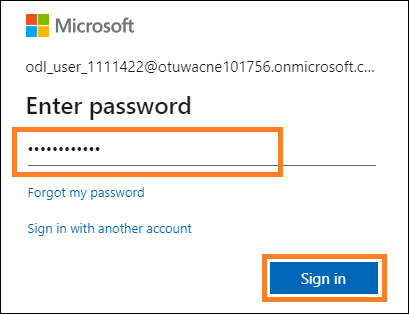

# Microsoft Fabric - Fabric Analyst in a Day - 实验 2 	 

 
 
# 目录
- 简介	

- Fabric 许可证	

    - 任务 1：启用Microsoft Fabric 试用许可证

- Fabric 体验概述	
    - 任务 2：Data Factory 体验	
    - 任务 3：Data Activator 体验	
    - 任务 4：Industry Solutions 体验	
    - 任务 5：Real-Time Intelligence 体验	
    - 任务 6：Synapse Data Engineering 体验	
    - 任务 7：Synapse Data Science 体验	
    - 任务 8：Synapse Data Warehouse 体验	
- Fabric 工作区	
    - 任务 9：创建Fabric 工作区	
    - 任务 10：创建 Lakehouse	
- 参考	

 
# 简介
今天，您将学习Microsoft Fabric 的多种主要功能。这是一个介绍性研讨会，旨在向您介绍Fabric 中提供的各种产品体验和项目。在本次研讨会结束时，您将学习如何使用湖屋、数据流Gen2、数据管道和 DirectLake 等。

本实验结束后，您将学会：

- 如何创建 Fabric 工作区
- 如何创建 Lakehouse

# Fabric 许可证

## 任务 1：启用Microsoft Fabric 试用许可证

1. 打开**浏览器**并导航到  https://app.powerbi.com/。您将导航到登录页。

    **注意：** 如果您未使用实验环境，并且已经有 Power BI 帐户，您可能希望在隐私/无痕模式下使用浏览器。
2. 输入**用户名，** 其位于**环境变量**选项卡中（“实验指南”选项卡旁边），作为**电子邮件地址，** 然后点击 **Submit。**

    

3. 您将导航到**密码**屏幕。输入讲师提供给您的**密码，** 其位于**环境变量**选项卡中（“实验指南”选项卡旁边）。
 
4. 点击 **Sign in** 并按照提示登录Fabric。

    

5. 您将导航到熟悉的 **Power BI 服务主页。**
6. 我们相信您熟悉Power BI 服务的布局。如果您有任何问题，请随时询问讲师。

    您当前位于**我的工作区。** 若要使用Fabric 项目，您需要试用许可证和分配有Fabric 许可证的工作区。

7. 在屏幕右上角，选择**用户图标。**
8. 选择**免费试用。**

    

9. “升级到 Microsoft Fabric 免费试用版”对话框随即打开。选择**开始试用。**

     
 
10. “已成功升级到Microsoft Fabric”对话框随即打开。选择 **Fabric Home Page。**

     

11. 您将导航到 **Microsoft Fabric 主页。**
 
     

# Fabric 体验概述
## 任务 2：Data Factory 体验

1. 选择屏幕左下角的 **Microsoft Fabric**（Fabric 体验选择器）图标。将打开一个包含Fabric 体验列表的对话框。请**注意，** Power BI、Data Factory、Data Activator、Industry Solutions 和Real-Time Intelligence 是独立的体验。Data Engineering、Data Science 和Data Warehouse 是Synapse 体验，这些体验均由Synapse 提供支持。我们来探索吧。
 
2. 选择 **Data Factory。**

    

3. 您将导航到 **Data Factory 主页页面。** 该页面包含三个主要部分。

    a. **建议：** 这里列出了 Data Factory - 数据流Gen2、数据管道、数据工作流和 API for GraphQL 中的可用项目。

    i.	Dataflow Gen2 是新一代数据流。

    ii.	Data pipeline 用于数据编排。

    iii.	数据工作流是工作流编排管理器。

    iv.	API for GraphQL 是用于查询多个数据源的API。

    b. **学习：** 此部分可用于访问快速入门学习文档。

    c. **Quick Access：** 这一部分列出了最近使用或收藏的项目。

    
 
## 任务 3：Data Activator 体验

1. 选择屏幕左下角的 **Fabric 体验选择器图标**（目前设为 Data Factory）。Fabric 体验对话框随即打开。

    

2. 从对话框选择 **Data Activator。** 您将导航到 **Data Activator 主页。** Data Activator 是Microsoft Fabric 中的一种无代码体验，在数据变化中检测到模式或条件时自动采取操作。请注意， 这三个部分与 Data Factory 体验相似。在**建议**部分中，请注意以下项目：

    a. **Reflex：** 用于监视数据集、查询和事件流中的模式。

    b. **Reflex 示例：** 示例解决方案。

    

## 任务 4：Industry Solutions 体验

1. 选择屏幕左下角的 **Fabric 体验选择器图标**（目前设置为 Data Activator）。Fabric 体验对话框随即打开。
2. 从对话框中选择 **Industry Solutions。** 您将导航到 **Industry Solutions** 主页。Microsoft Fabric 提供特定于行业的数据解决方案，这些解决方案为数据管理、分析和决策提供强大的平 台。这些数据解决方案解决了不同行业面临的独特挑战，助力企业优化运营、整合来自不 同来源的数据并使用丰富的分析。请注意，这三个部分与之前的体验相似。在“建议”部 分中，请注意以下项目：

 
    a. **可持续性解决方案：** 支持引入、标准化和分析环境、社会和治理 (ESG)  数据。

    b. **零售解决方案：** 有助于管理大量数据，整合来自各个来源的数据，并提供实时分析 以促进及时做出决策。零售商可以使用这些解决方案进行库存优化、客户细分、销 售预测、动态定价和欺诈检测。

    c. **医疗保健解决方案：** 经过战略设计，旨在通过满足将医疗保健数据有效转换为适合 格式以供分析的关键需求，加快客户实现价值的时间。

    

## 任务 5：Real-Time Intelligence 体验
1. 选择屏幕左下角的 **Fabric 体验选择器图标**（目前设置为Industry Solutions）。Fabric 体验对话框随即打开。
2. 选择 **Real-Time Intelligence。** 您将导航到 **Real-Time Intelligence 主页。** 这里也有三个部分。在“建议”部分中，请注意以下项目：

    a. **Eventhouse：** 用于创建数据库的工作区，可跨项目共享。

    b. **KQL 查询集：** 用于对数据运行查询以生成可共享的表和视觉对象。

    c. **实时仪表板：** 用于在数据引入后的几秒钟内可视化实时仪表板。

    d. **Eventstream：** 用于捕获、转换和传递实时事件流。

    e. **Reflex：** 用于监视数据集、查询和事件流中的模式。

    f. **使用示例：** 示例解决方案。

 
    **注意：** Reflex 也在 Data Activator 体验中可用。

        

## 任务 6：Synapse Data Engineering 体验
1. 选择屏幕左下角的 **Fabric 体验选择器图标**（目前设置为Real-Time Intelligence）。“Fabric 体验”对话框随即打开。
2. 选择 **Data Engineering。** 您将导航到 **Data Engineering 主页。** 该页面也包含三个主要部分。在“建议”部分中，请注意以下项目：

    a. **Lakehouse：** 用于存储大数据以供清理、查询、报告和共享。

    b. **Notebook：** 使用 Python、R 和 Scala 等各种语言进行数据引入、准备、分析和其他与数据相关的任务。

    c. **Environment：** 用于为笔记本和spark 作业定义设置共享库、spark 计算设置和资源。

    d. **Spark Job Definition：** 用于定义、计划和管理 Apache 作业。

    e. **Data pipeline：** 用于编排数据解决方案。

    f. **API for GraphQL：** 是用于查询多个数据源的 API。

    g. **Import notebook：** 用于从本地计算机导入笔记本。

    h. **Use a sample：** 示例解决方案。
 
 
        

## 任务 7：Synapse Data Science 体验

1. 选择屏幕左下角的 **Fabric 体验选择器图标**（目前设置为 Data Engineering）。Fabric 体验对话框随即打开。
2. 选择 **Data Science。** 您将导航到 **Data Science 主页。** 这里也有三个部分。在“建议”部分中，请注意以下项目：

    a. **ML model：** 用于创建机器学习模型。

    b. **Experiment：** 用于创建、运行和跟踪多个模型的开发。

    c. **Notebook：** 用于探索数据和构建机器学习解决方案。

    d. **Environment：** 用于为笔记本和spark 作业定义设置共享库、spark 计算设置和资源。

    e. **AI 技能：** 用于生成您自己的生成式 AI 体验。

    f. **Import Notebook：** 用于从本地计算机导入笔记本。

    g. **Use a sample：** 示例解决方案。

    **注意：** 笔记本、环境、数据管道等项目在多种体验中可用，因为它们与每种体验都相关。
 
         

## 任务 8：Synapse Data Warehouse 体验

1. 选择屏幕左下角的 **Fabric 体验选择器图标**（目前设置为 Data Science）。Fabric 体验对话框随即打开。
2. 选择 **Data Warehouse。** 您将导航到 **Data Warehouse 主页。** 这里也有三个部分。在“新建”部分中，请注意以下项：

    a. **仓库：** 用于创建 Data Warehouse。

    b. **数据管道：** 用于编排数据解决方案。

    c. **镜像 SQL 数据库：** 用于镜像Azure SQL 数据库。

    d. **镜像 Snowflake：** 用于镜像 Snowflake 数据库。

    e. **镜像 Azure Cosmos DB：** 用于镜像 Azure Cosmos DB。

        

# Fabric 工作区
## 任务 9：创建Fabric 工作区
1. 现在我们创建一个具有Fabric 许可证的工作区。从左侧导航栏中选择**工作区。** 对话框随即打开。
2. 选择**新建工作区。**

        

3. 浏览器右侧将打开**创建工作区**对话框。
4. 在**名称**字段中输入 **FAIAD_\<username>**

    **注意：** 工作区名称必须唯一。但是，您必须使用不同的工作区名称。确保“名称”字段下方显 示带有 **“此名称可用”** 的绿色复选标记。

5. 您可以选择输入工作区的**说明。** 这是选填字段。
6. 点击**高级**以展开此部分。

         
 
7. 在 **License mode** 下，确保选择 **Trial。**（这应该已默认选中。）
8. 选择 **Apply** 以创建新工作区。

        

这样就创建了新的工作区，且您将会导航到该工作区。我们将来自不同数据源的数据引入
Lakehouse，并使用 Lakehouse 中的数据来构建模型并生成报表。第一步是创建 Lakehouse。
 
## 任务 10：创建 Lakehouse
1. 选择屏幕左下角的 **Fabric 体验选择器图标** （目前设置为 Data Warehouse）。我们将在以下实验室中向您展示其中一些选项。
2. 选择 **Data Engineering** 以导航到 Data Engineering 主页。

        

3. 选择**湖屋。**

        

4. New lakehouse 对话框随即打开。在Name 文本框中输入 **lh_FAIAD。**

    **注意：** 这里的 lh 指的是 Lakehouse。我们添加 lh 前缀是为了便于识别和搜索。
5. 选择 **Create。**

        

    Lakehouse 很快就会创建完毕，您将导航到 Lakehouse 界面。
 
    在**左侧面板**中，请注意工作区下方有一个 Lakehouse  图标。您可以随时点击此图标轻松导航到
Lakehouse。

    在 Lakehouse Explorer 中会显示**表**和**文件。** Lakehouse 的文件部分下可能会显示Azure Data Lake Storage Gen2 文件，或者数据流可能会将数据加载到 Lakehouse 表中。有各种选项可用。我们将在以下实验中向您展示其中一些选项。

        

    在本实验中，我们探索了Fabric 界面，创建了Fabric 工作区和 Lakehouse。在下一个实验室中， 我们将学习如何使用湖屋中的快捷方式连接到ADLS Gen2 数据以及如何使用视图转换此数据。
 
# 参考
Fabric Analyst in a Day (FAIAD) 介绍了Microsoft Fabric 中提供的一些主要功能。在服务菜单中， “帮助 (?)”部分包含指向一些优质资源的链接。

以下更多参考资源可帮助您进行 Microsoft Fabric 相关的后续步骤。

- 请参阅博客文章以阅读完整的[Microsof t Fabric GA 公告](https://aka.ms/Fabric-Hero-Blog-Ignite23)

- 通过[引导式教程](https://aka.ms/Fabric-GuidedTour)探索 Fabric

- 注册 [Microsoft Fabric 免费试用版](https://aka.ms/try-fabric)

- 通过探索[Microsoft Fabric 网站](https://aka.ms/microsoft-fabric)

- 通过探索 [Fabric 学习模块](https://aka.ms/learn-fabric)学习新技能

- 探索 [Fabric 技术文档](https://aka.ms/fabric-docs)

- 阅读[有关Fabric 入门指南的免费电子书](https://aka.ms/fabric-get-started-ebook)

- 加入[Fabric 社区](https://aka.ms/fabric-community)发布问题、分享反馈并向他人学习

阅读更多深度Fabric 体验公告博客：

- [Fabric 中的Data Factory 体验博客](https://aka.ms/Fabric-Data-Factory-Blog)

- [Fabric 中的Synapse Data Engineering 体验博客](https://aka.ms/Fabric-DE-Blog)

- [Fabric 中的Synapse Data Science 体验博客](https://aka.ms/Fabric-DS-Blog)

- [Fabric 中的Synapse Data Warehousing 体验博客](https://aka.ms/Fabric-DW-Blog)

- [Fabric 中的Synapse Real-Time Analytics 体验博客](https://aka.ms/Fabric-RTA-Blog)

- [Power BI 公告博客](https://aka.ms/Fabric-PBI-Blog)

- [Fabric 中的Data Activator 博客](https://aka.ms/Fabric-DA-Blog)

- [Fabric 中的管理和治理博客](https://aka.ms/Fabric-Admin-Gov-Blog)

- [Fabric 中的OneLake 博客](https://aka.ms/Fabric-OneLake-Blog)

- [Dataverse 和Microsof t Fabric 集成博客](https://aka.ms/Dataverse-Fabric-Blog)

© 2023 Microsoft Corporation.保留所有权利。

© 2023 Microsoft Corporation.保留所有权利。使用此演示/实验即表示您已同意以下条款: 
本演示/实验中的技术/功能由 Microsoft Corporation 出于获取反馈和提供学习体验的目的提供。只能将本演示/实验用于评估这些技术特性和功能以及向Microsoft 提供反馈。不得用于任何其他用途。不得对此演示/实验或其任何部分进行修改、复制、分发、传送、显示、 执行、复制、公布、许可、转让、销售或基于以上内容创建衍生作品。
严禁将本演示/实验（或其任何部分）复制到任何其他服务器或位置以便进一步复制或再  分发。

本演示/实验出于上述目的，在不涉及复杂设置或安装操作的模拟环境中提供特定软件技术
/产品特性和功能，包括潜在的新功能和概念。本演示/实验中展示的技术/概念可能不是完 整的功能，可能会以不同于最终版本的工作方式工作。我们也可能不会发布此类功能或概念的最终版本。在物理环境中使用此类特性和功能的体验可能也有所不同。

**反馈**。如您针对本演示/实验中所述的技术特性、功能和/或概念向 Microsoft 提供反馈，则意味着您向Microsoft  无偿提供以任何方式、出于任何目的使用和分享您的反馈并将其商业化的权利。您同样无偿为第三方提供其产品、技术和服务使用或配合使用包含此反馈的
Microsoft 软件或服务的任何特定部分所需的任何专利权。如果根据某项许可的规定，
Microsoft  由于在其软件或文档中包含了您的反馈需要向第三方授予该软件或文档的许可， 请不要提供这样的反馈。这些权利在本协议终止后继续有效。
反馈。如您针对本演示/实验中所述的技术特性、功能和/或概念向 Microsoft 提供反馈，则意味着您向Microsoft  无偿提供以任何方式、出于任何目的使用和分享您的反馈并将其商业化的权利。您同样无偿为第三方提供其产品、技术和服务使用或配合使用包含此反馈的
Microsoft 软件或服务的任何特定部分所需的任何专利权。如果根据某项许可的规定，
Microsoft  由于在其软件或文档中包含了您的反馈需要向第三方授予该软件或文档的许可， 请不要提供这样的反馈。这些权利在本协议终止后继续有效。

对于本演示/实验，Microsoft Corporation 不提供任何明示、暗示或法定的保证和条件，包括有关适销性、针对特定目的的适用性、所有权和不侵权的所有保证和条件。对于使用本 演示/实验产生的结果或输出内容的准确性，或者出于任何目的包含本演示/实验中的信息的适用性，Microsoft 不做任何保证或陈述。

**免责声明**

本演示/实验仅包含 Microsoft Power BI 的部分新功能和增强功能。在产品的后续版本中， 部分功能可能有所更改。在本演示/实验中，可了解部分新功能，但并非全部新功能。

