# Microsoft Fabric - Fabric Analyst in a Day - Übung 2

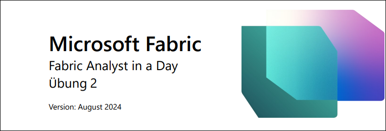

 
## Inhalt
- Einführung
- Fabric-Lizenz
    - Aufgabe 1: Lizenz für Testversion von Microsoft Fabric aktivieren
- Übersicht über die Funktionsbereiche in Fabric
    - Aufgabe 2: Data Factory-Funktionsbereich
    - Aufgabe 3: Data Activator-Funktionsbereich
    Aufgabe 4: Industry Solutions-Funktionsbereich
    - Aufgabe 5: Real-Time Intelligence-Funktionsbereich
    - Aufgabe 6: Data Engineering-Funktionsbereich von Synapse
    - Aufgabe 7: Data Science-Funktionsbereich von Synapse
    - Aufgabe 8: Data Warehouse-Funktionsbereich von Synapse
- Fabric-Arbeitsbereich
    - Aufgabe 9: Fabric-Arbeitsbereich erstellen
    - Aufgabe 10: Lakehouse erstellen
- Referenzen

 
## Einführung
Heute geht es um die verschiedenen Hauptfunktionen von Microsoft Fabric. In diesem Einführungsworkshop werden die verschiedenen Funktionsbereiche und Bestandteile von Fabric vorgestellt. Am Ende des Workshops erfahren Sie zudem, wie Sie Lakehouse, Dataflow Gen2, Data Pipeline, DirectLake und mehr verwenden.

Inhalt dieser Übung:
- So erstellen Sie einen Fabric-Arbeitsbereich
- So erstellen Sie ein Lakehouse

## Fabric-Lizenz

### Aufgabe 1: Lizenz für Testversion von Microsoft Fabric aktivieren

1. Öffnen Sie den **Browser**, und rufen Sie https://app.powerbi.com/ auf. Die Anmeldeseite wird angezeigt.
**Hinweis**: Wenn Sie nicht die Übungsumgebung nutzen und bereits ein Power BI-Konto haben, können Sie den Browser im privaten Modus/Inkognito-Modus verwenden.
2. Geben Sie den **Benutzernamen**, den Sie auf der Registerkarte **Umgebungsvariablen** (neben der der Übungsanleitung) finden, sowie die **E-Mail** ein und klicken Sie auf **Submit**.

    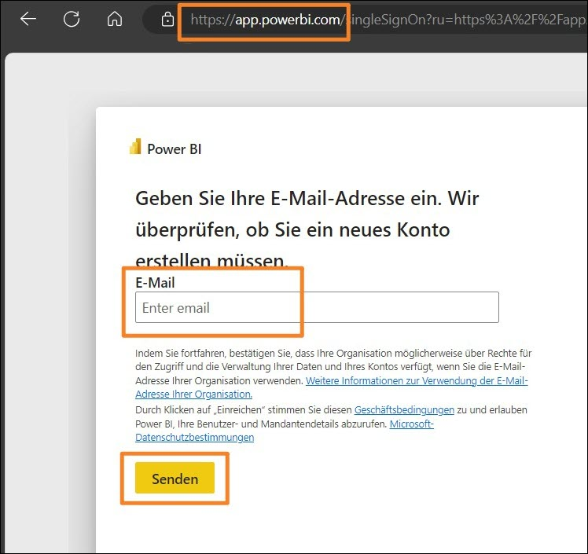

3. Die Seite **Kennwort** wird angezeigt. Geben Sie das **Kennwort** ein, das Sie auf der Registerkarte
**Umgebungsvariablen** (neben der Übungsanleitung) finden und Ihnen von Ihrem Kursleiter mitgeteilt wurde.
4. Klicken Sie auf **Sign in**, und folgen Sie den Anweisungen, um sich bei Fabric anzumelden.

    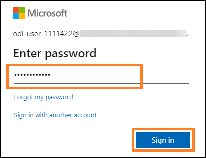

5. Sie werden zur bereits bekannten **Startseite des Power BI-Dienstes** geleitet.
6. Es wird angenommen, dass Ihnen der Aufbau des Power BI-Dienstes bekannt ist. Bei Fragen wenden Sie sich einfach an den Kursleiter.

   Derzeit sind Sie in **Mein Arbeitsbereich**. Wenn Sie mit Fabric-Elementen arbeiten möchten, benötigen Sie eine Testlizenz und einen Arbeitsbereich mit zugewiesener Fabric-Lizenz. Lassen Sie uns das einrichten.

7. Klicken Sie oben rechts auf dem Bildschirm auf das **Benutzersymbol**.
8. Wählen Sie **Kostenlose Testversion** aus.

    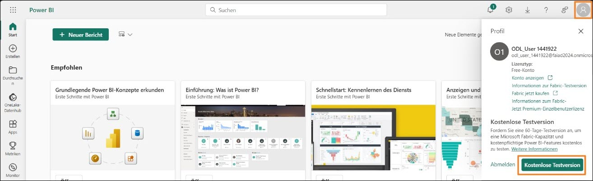

9. Das Dialogfeld „Upgrade auf eine kostenlose Testversion auf Microsoft Fabric“ wird geöffnet. Wählen Sie **Test starten** aus.
 
    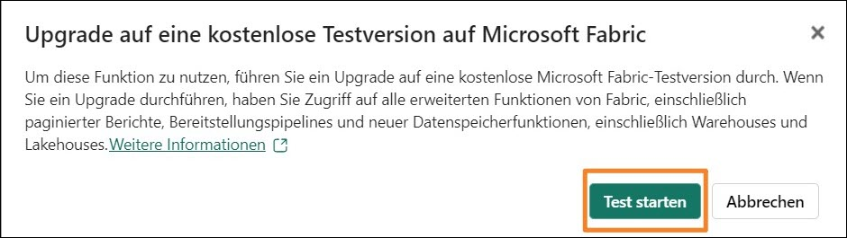

10. Das Dialogfeld „Erfolgreiches Upgrade auf Microsoft Fabric“ wird geöffnet. Wählen Sie Fabric Home Page aus.

    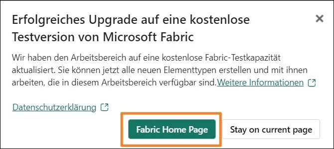

11.	Sie werden zur Startseite von Microsoft Fabric geleitet.

    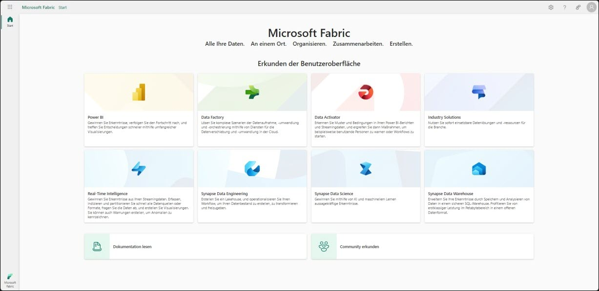

## Übersicht über die Funktionsbereiche in Fabric
### Aufgabe 2: Data Factory-Funktionsbereich

1. Wählen Sie unten links auf Ihrem Bildschirm das Symbol **Microsoft Fabric** (Fabric-
Funktionsbereichs-Auswahl) aus. Ein Dialogfeld mit einer Liste der Funktionsbereiche von Fabric wird geöffnet. Beachten Sie, dass Power BI, Data Factory, Data Activator, Industry Solutions und Real-Time Intelligence unabhängige Funktionsbereiche sind. Data Engineering, Data Science und Data Warehouse sind Synapse-Funktionsbereiche, da diese von Synapse unterstützt werden.
Sehen wir uns die Funktionsbereiche nun gesondert an.
 
2. Wählen Sie Data Factory aus.

    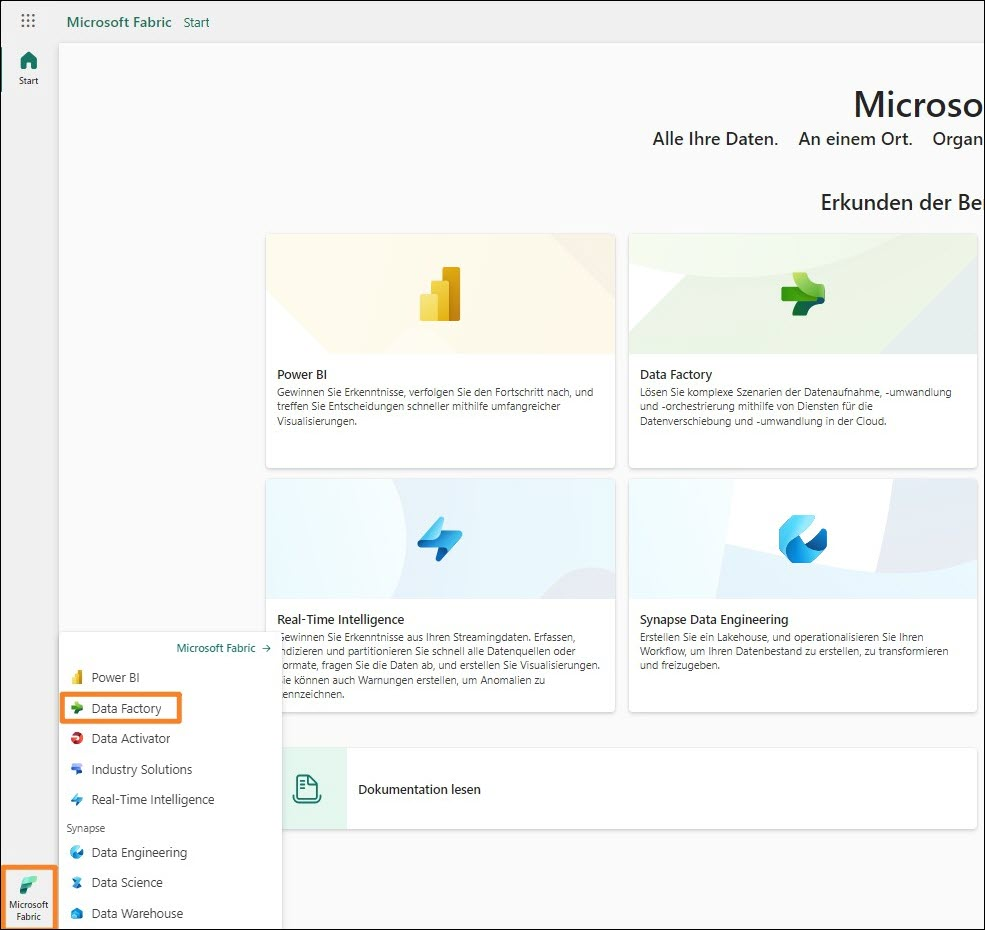

3. Sie werden zur **Startseite von Data Factory** weitergeleitet. Der Seite ist in drei Hauptbereiche unterteilt.

    a. **Empfohlen**: Hier werden die Bestandteile von Data Factory angezeigt – Dataflow Gen2, Datenpipeline, Datenworkflow und API für GraphQL.

    i. Dataflow Gen2 ist die nächste Generation von Dataflow.

    ii.	Data Pipeline dient zur
    Datenorchestrierung.

    iii. Der Datenworkflow ist der Workflow Orchestration Manager.

    iv.	API für GraphQL ist eine API zum Abfragen mehrerer Datenquellen.

    b. **Learn**: In diesem Abschnitt können Sie die Schnellstart-Lerndokumentation aufrufen.

    c. **Quick Access**: Hier finden Sie die zuletzt verwendeten oder bevorzugten Elemente.

    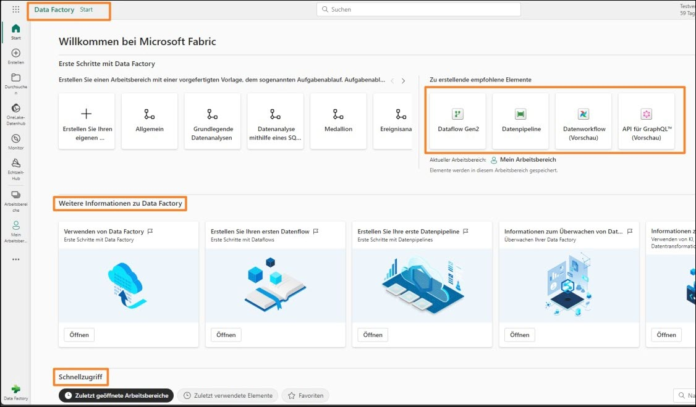

### Aufgabe 3: Data Activator-Funktionsbereich

1.	Wählen Sie unten links auf Ihrem Bildschirm das Symbol **Fabric-Funktionsbereichs-Auswahl**
(aktuell auf Data Factory eingestellt) aus. Das Dialogfeld „Fabric-Funktionsbereich“ wird geöffnet.

    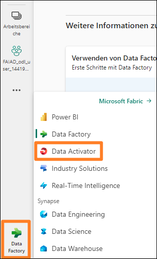

2.	Wählen Sie dort die Option **Data Activator** aus. Sie werden zur **Startseite von Data Activator** weitergeleitet. Data Activator ist ein codefreier Funktionsbereich in Microsoft Fabric, mit dem automatisch Maßnahmen durchgeführt werden können, wenn in sich ändernden Daten Muster oder Bedingungen erkannt werden. Beachten Sie, dass die drei Abschnitte dem Data Factory- Funktionsbereich ähneln. Beachten Sie im Abschnitt „Empfohlen“ die folgenden Elemente:

    a. **Reflex**: Dient zur Überwachung von Datensätzen, Abfragen und Ereignisströmen auf Muster.

    b. **Reflex-Beispiel**: Beispiellösung

    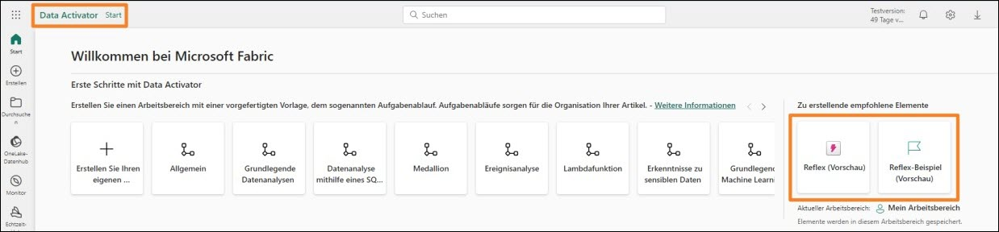
 
### Aufgabe 4: Industry Solutions-Funktionsbereich

1. Wählen Sie unten links auf Ihrem Bildschirm das Symbol **Fabric-Funktionsbereichs-Auswahl** (aktuell auf Data Activator eingestellt) aus. Das Dialogfeld „Fabric-Funktionsbereich“ wird geöffnet.

2. Wählen Sie aus dem Dialogfeld **Industry Solutions** aus. Sie navigieren zur S**tartseite von Industry Solutions**. Microsoft Fabric bietet branchenspezifische Datenlösungen, die eine robuste Plattform für Datenmanagement, Analyse und Entscheidungsfindung bereitstellen. Diese Datenlösungen gehen auf die einzigartigen Herausforderungen ein, mit denen verschiedene Branchen konfrontiert sind, und ermöglichen es Unternehmen, Abläufe zu optimieren, Daten aus
verschiedenen Quellen zu integrieren und umfassende Analysen zu nutzen. Beachten Sie, dass die drei Abschnitte vorangegangenen Funktionsbereichen ähneln. Beachten Sie im Abschnitt
„Empfohlen“ die folgenden Elemente:

    a. **Nachhaltigkeitslösungen**: unterstützen die Erfassung, Standardisierung und Analyse von Umwelt-, Sozial- und Governance-Daten (ESG).

    b. **Retail-Lösungen**: helfen bei der Verwaltung großer Datenmengen, der Integration von Daten aus verschiedenen Quellen und der Bereitstellung von Echtzeitanalysen für eine schnelle Entscheidungsfindung. Einzelhändler können diese Lösungen zur
    Bestandsoptimierung, Kundensegmentierung, Umsatzprognose, dynamischen Preisgestaltung und Betrugserkennung nutzen.

    c. **Healthcare-Datenlösungen** sind strategisch darauf ausgelegt, die Zeit bis zur
    Wertschöpfung für die Kunden zu verkürzen, indem die kritische Notwendigkeit der
    effizienten Umwandlung von Daten aus dem Gesundheitswesen in ein geeignetes Format für die Analyse erfüllt wird.

    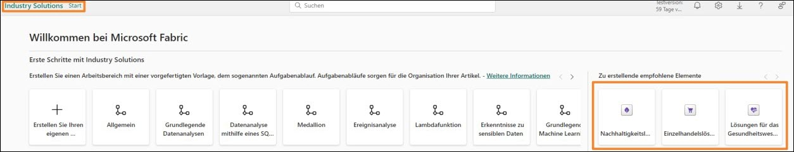

### Aufgabe 5: Real-Time Intelligence-Funktionsbereich

1. Wählen Sie unten links auf Ihrem Bildschirm das Symbol **Fabric-Funktionsbereichs-Auswahl** (aktuell auf Industry Solutions eingestellt) aus. Das Dialogfeld „Fabric-Funktionsbereich“ wird geöffnet.
2. Wählen Sie **Real-Time Intelligence** aus. Sie navigieren zur **Real-Time Intelligence-Startseite**. Auch hier sind drei Abschnitte verfügbar. Beachten Sie im Abschnitt „Empfohlen“ die folgenden Elemente:

    a. **Eventhouse**: Wird verwendet, um einen Arbeitsbereich der Datenbank zu erstellen, der projektübergreifend freigegeben werden kann.

    b. **KQL Queryset**: Wird verwendet, um Abfragen für die Daten auszuführen, um freigabefähige Tabellen und Visuals zu erstellen.

    c. **Echtzeit-Dashboard**: Wird verwendet, um Echtzeit-Dashboards innerhalb von Sekunden nach der Datenerfassung zu visualisieren.

    d. **Eventstream**: Hiermit werden Ereignisströme in Echtzeit erfasst, umgewandelt und weitergeleitet.

    e. **Reflex**: Dient zur Überwachung von Datensätzen, Abfragen und Ereignisströmen auf Muster.

    f. **Beispiel verwenden**: Beispiellösung.
 
**Hinweis**: Reflex ist auch in Data Activator-Umgebungen verfügbar.

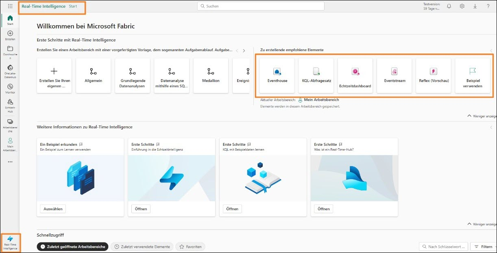

### Aufgabe 6: Data Engineering-Funktionsbereich von Synapse

1. Wählen Sie unten links auf Ihrem Bildschirm das Symbol **Fabric-Funktionsbereichs-Auswahl** (aktuell auf Real-Time Intelligence eingestellt) aus. Das Dialogfeld „Fabric-Funktionsbereich“ wird geöffnet.
2. Klicken Sie auf **Data Engineering**. Sie werden zur **Startseite von Data Engineering** weitergeleitet. Auch diese Seite ist in drei Hauptabschnitte unterteilt. Beachten Sie im Abschnitt „Empfohlen“ die folgenden Elemente:

    a. **Lakehouse**: Dient zum Speichern großer Datenmengen, die bereinigt, abgefragt, in Berichten verwendet und freigegeben werden können.

    b. **Notebook**: Dient zur Datenerfassung, -aufbereitung, -analyse und anderen
    datenbezogenen Aufgaben mithilfe verschiedener Sprachen wie Python, R und Scala.

    c. **Umgebung**: Dient dem Einrichten gemeinsam genutzter Bibliotheken, Spark-Compute- Einstellungen und Ressourcen für Notebooks und Spark-Auftragsdefinitionen.

    d. **Spark-Auftragsdefinition**: Dient zum Definieren, Planen und Verwalten von Apache-Aufträgen.

    e. **Datenpipeline**: Hiermit wird die Datenlösung orchestriert.

    f. **API für GraphQL**: Ist eine API zum Abfragen mehrerer Datenquellen.

    g. **Notebook importieren**: Hiermit werden Notizbücher vom lokalen Computer importiert.

    h. **Beispiel verwenden**: Beispiellösung.

    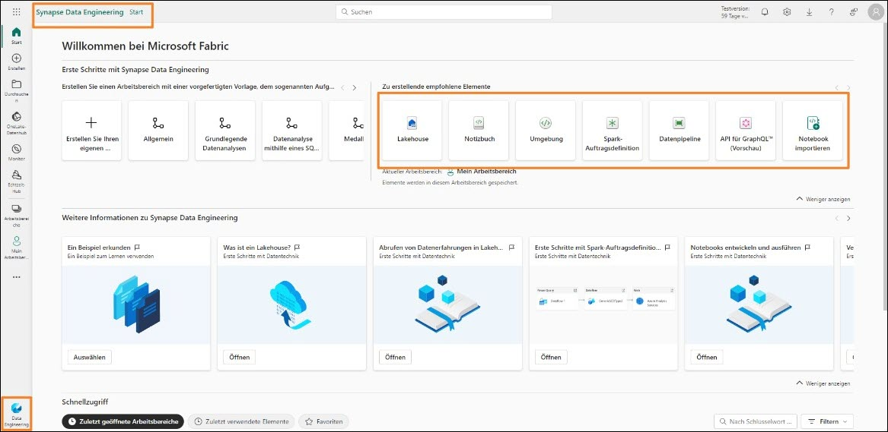

 
### Aufgabe 7: Data Science-Funktionsbereich von Synapse

1. Wählen Sie unten links auf Ihrem Bildschirm das Symbol **Fabric-Funktionsbereichs-Auswahl** (aktuell auf Data Engineering eingestellt) aus. Das Dialogfeld „Fabric-Funktionsbereich“ wird geöffnet.

2. Wählen Sie **Data Science** aus. Sie werden zur **Startseite von Data Science** weitergeleitet. Auch hier gibt es drei Abschnitte: Beachten Sie im Abschnitt „Empfohlen“ die folgenden Elemente:

    a. **ML-Modell**: Hiermit werden Machine-Learning-Modelle erstellt.

    b. **Experiment**: Dies dient zum Entwickeln und Ausführen von Modellen und zur Nachverfolgung der Modellentwicklung.

    c. **Notebook**: Hiermit werden Daten ausgewertet und Machine-Learning-Lösungen entwickelt.

    d. **Umgebung**: Dient dem Einrichten gemeinsam genutzter Bibliotheken, Spark-Compute- Einstellungen und Ressourcen für Notebooks und Spark-Auftragsdefinitionen.

    e. **KI Fertigkeit**: Wird verwendet, um Ihre eigene generative KI-Erfahrung zu erstellen.

    f. **Notebook importieren**: Hiermit werden Notizbücher vom lokalen Computer importiert.

    g. **Beispiel verwenden**: Beispiellösung.

**Hinweis**: Elemente wie Notebook, Umgebung, Datenpipeline usw. sind in mehreren Funktionsbereichen verfügbar, da sie in jedem dieser Bereiche relevant sind.

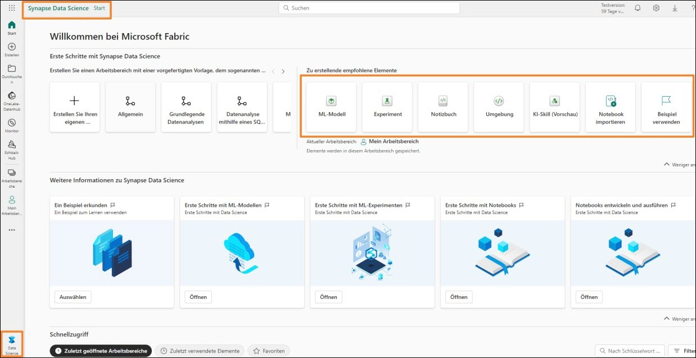

### Aufgabe 8: Data Warehouse-Funktionsbereich von Synapse

1. Wählen Sie unten links auf Ihrem Bildschirm das Symbol **Fabric-Funktionsbereichs-Auswahl**
(aktuell auf Data Science eingestellt) aus. Das Dialogfeld „Fabric-Funktionsbereich“ wird geöffnet.

2. Klicken Sie auf **Data Warehouse**. Sie werden zur **Startseite von Data Warehouse** weitergeleitet. Auch hier gibt es drei Abschnitte: Unter „Neu“ sehen Sie diese Elemente:

a. **Warehouse**: Dient dem Erstellen eines Data Warehouse.

b. **Datenpipeline**: Hiermit wird die Datenlösung orchestriert.

c. **Gespiegelte SQL-Datenbank**: Wird verwendet, um die Azure SQL-Datenbank zu spiegeln.

d. **Gespiegeltes Snowflake**: Wird verwendet, um die Snowflake-Datenbank zu spiegeln.
 
e. **Gespiegeltes Azure Cosmos DB**: Wird verwendet, um Azure Cosmos DB zu spiegeln.

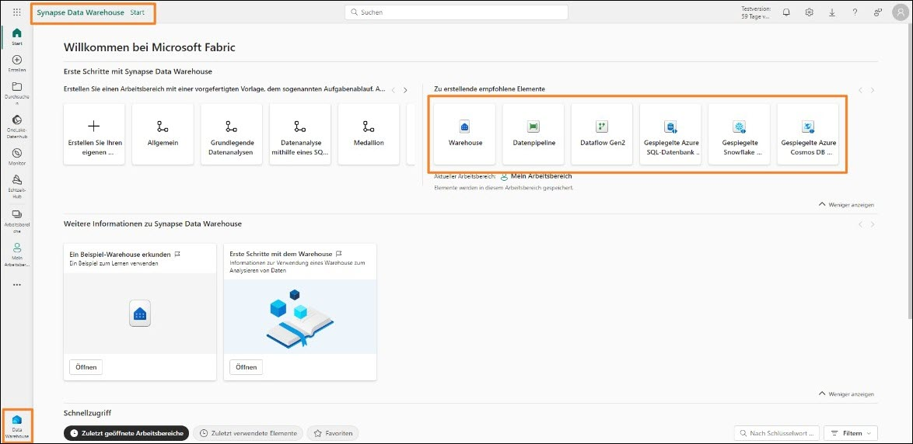

## Fabric-Arbeitsbereich

### Aufgabe 9: Fabric-Arbeitsbereich erstellen

1. Erstellen wir jetzt einen Arbeitsbereich mit Fabric-Lizenz. Wählen Sie in der Navigationsleiste links die Option **Arbeitsbereiche** aus. Ein Dialogfeld wird geöffnet.

2. Klicken Sie auf **Neuer Arbeitsbereich**.

    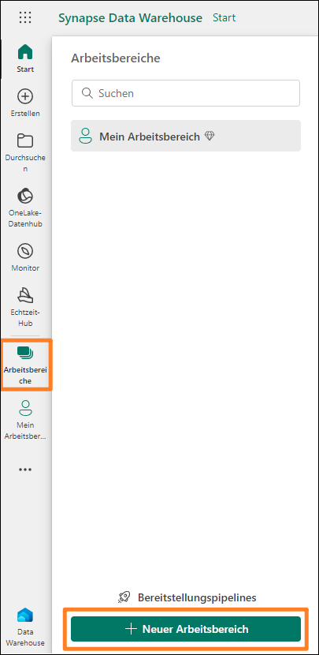

3. Rechts im Browser wird das Dialogfeld **Arbeitsbereich erstellen** geöffnet.

4. Geben Sie im Feld **Name** den Text **FAIAD_<Benutzername>** ein.
 
**Hinweis**: Der Name des Arbeitsbereichs muss eindeutig sein. Der Name Ihres Arbeitsbereichs lautet jedoch anders. Achten Sie darauf, dass unter dem Feld für den Namen ein grünes Häkchen mit dem Text Dieser Name ist verfügbar zu sehen ist.

5. Wenn Sie möchten, können Sie eine **Beschreibung** des Arbeitsbereichs eingeben. Dieses Feld ist optional.

6. Erweitern Sie den Abschnitt mit **Erweitert**.

    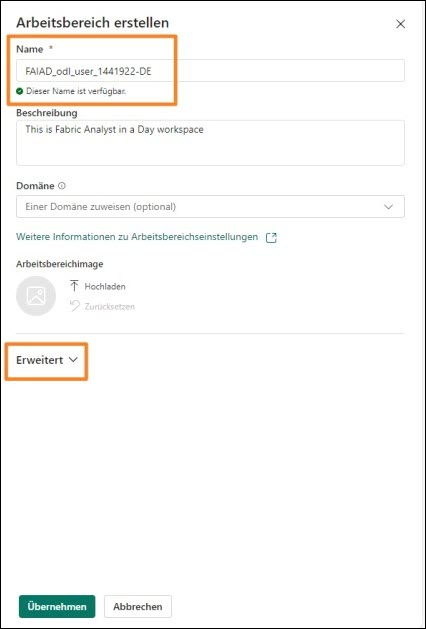

7. Überprüfen Sie unter **Lizenzmodus**, dass die Option **Testversion** ausgewählt ist. (Standardmäßig ist dies der Fall.)

8. Erstellen Sie den neuen Arbeitsbereich durch Klicken auf **Apply**.

    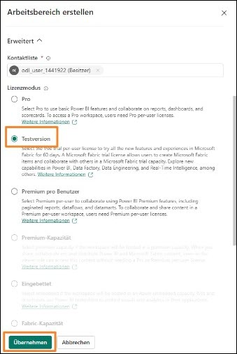

Ein neuer Arbeitsbereich wird erstellt, und Sie werden zu diesem weitergeleitet. Als Nächstes
importieren wir Daten aus verschiedenen Quellen in das Lakehouse, entwickeln damit ein Modell und nutzen die Daten für Berichte. Erstellen wir zunächst ein Lakehouse.
 
### Aufgabe 10: Lakehouse erstellen

1. Wählen Sie unten links auf Ihrem Bildschirm das Symbol **Fabric-Funktionsbereichs-Auswahl**
(aktuell auf Data Warehouse eingestellt) aus. Das Dialogfeld „Fabric-Funktionsbereich“ wird geöffnet.

2. Klicken Sie auf **Data Engineering**, um die Startseite von Data Engineering zu öffnen.

    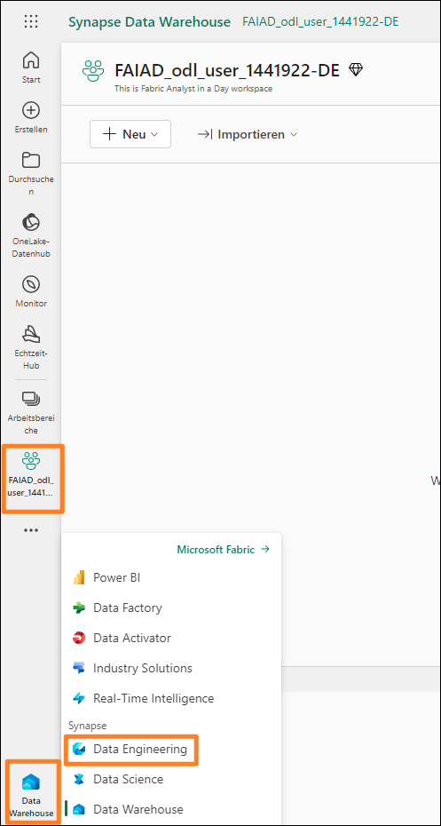

3. Wählen Sie **Lakehouse** aus.

    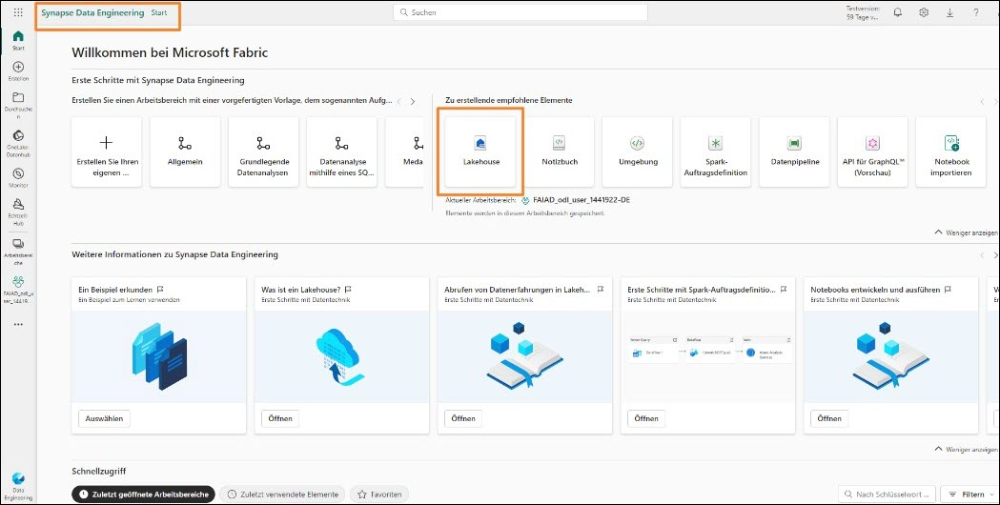

4. Das Dialogfeld „Neues Lakehouse“ wird geöffnet. Geben Sie im Textfeld für den Namen die Bezeichnung **lh_FAIAD** ein.

**Hinweis**: „lh“ bezieht sich hier auf Lakehouse. Die Buchstaben „lh“ werden vorangestellt, damit das Lakehouse leichter erkannt und gefunden werden kann.
 
5. Wählen Sie **Create in the screenshot** aus.

    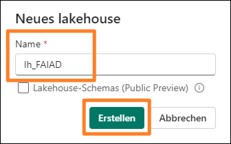

    Das Lakehouse wird in kurzer Zeit erstellt, und Sie werden zur Lakehouse-Oberfläche weitergeleitet. Beachten Sie, dass links unter dem Arbeitsbereich jetzt das Lakehouse-Symbol zu sehen ist. In den folgenden Übungen werden einige dieser Möglichkeiten vorgestellt.

    Im Lakehouse-Explorer werden **Tabels** und **Files** angezeigt. In einem Lakehouse können im Abschnitt mit den Dateien auch Dateien von Azure Data Lake Storage Gen2 stehen, oder mit einem Dataflow können Daten in Lakehouse-Tabellen geladen werden. Es stehen mehrere Möglichkeiten zur
    Auswahl. In den folgenden Übungen werden einige dieser Möglichkeiten vorgestellt.

    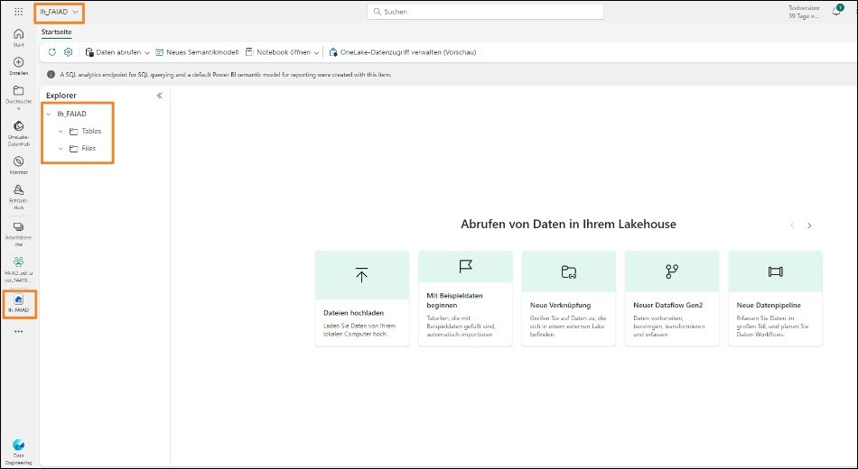

    In dieser Übung haben wir die Fabric-Oberfläche kennengelernt sowie einen Fabric-Arbeitsbereich und ein Lakehouse erstellt. In der nächsten Übung lernen Sie, wie Sie mit Verknüpfungen in Lakehouse eine Verbindung zu ADLS Gen2-Daten herstellen und diese Daten anhand von Ansichten transformieren.
 
## Referenzen

Bei Fabric Analyst in a Day (FAIAD) lernen Sie einige der wichtigsten Funktionen von Microsoft Fabric kennen. Im Menü des Dienstes finden Sie in der Hilfe (?) Links zu praktischen Informationen.

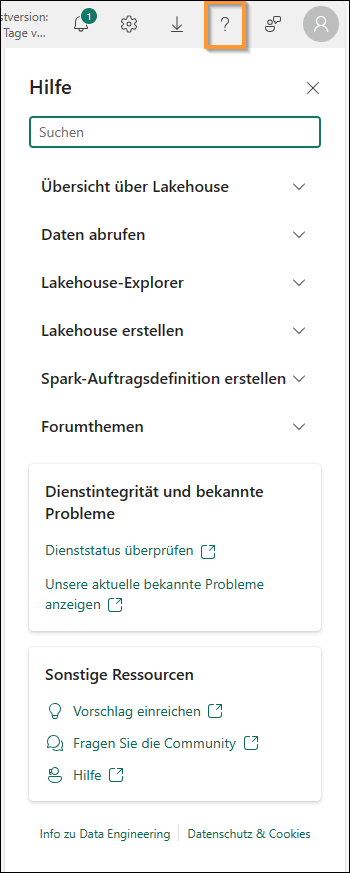

Nachfolgend finden Sie weitere Angebote zur weiteren Arbeit mit Microsoft Fabric.

- Die vollständige [Ankündigung der allgemeinen Verfügbarkeit von Microsof t Fabric finden](https://aka.ms/Fabric-Hero-Blog-Ignite23) Sie im Blogbeitrag.

- Fabric bei einer [interaktiven Vorstellung](https://aka.ms/Fabric-GuidedTour) kennenlernen

- Zur [kostenlosen Testversion von Microsof t Fabric](https://aka.ms/try-fabric) anmelden

- [Website von Microsoft Fabric](https://aka.ms/microsoft-fabric) besuchen

- Mit Modulen von [Fabric Learning](https://aka.ms/learn-fabric) neue Qualifikationen erwerben
- [Technische Dokumentation zu Fabric](https://aka.ms/fabric-docs) lesen
- [Kostenloses E-Book zum Einstieg in Fabric](https://aka.ms/fabric-get-started-ebook) lesen
- Mitglied der [Fabric-Community](https://aka.ms/fabric-community) werden, um Fragen zu stellen, Feedback zu geben und sich mit anderen auszutauschen

Lesen Sie die detaillierteren Blogs zur Ankündigung der Fabric-Umgebung:

- [Blog zum Data Factory-Funktionsbereich in Fabric](https://aka.ms/Fabric-Data-Factory-Blog)
- [Blog zum Data Engineering-Funktionsbereich von Synapse in Fabric](https://aka.ms/Fabric-DE-Blog)
- [Blog zum Data Science-Funktionsbereich von Synapse in Fabric](https://aka.ms/Fabric-DS-Blog)
- [Blog zum Data Warehousing-Funktionsbereich von Synapse in Fabric](https://aka.ms/Fabric-DW-Blog)
- [Blog zum Real-Time Analytics-Funktionsbereich von Synapse in Fabric](https://aka.ms/Fabric-RTA-Blog)
- [Blog mit Ankündigungen zu Power BI](https://aka.ms/Fabric-PBI-Blog)
- [Blog zum Data Activator-Funktionsbereich in Fabric](https://aka.ms/Fabric-Admin-Gov-Blog)
- [Blog zu Verwaltung und Governance in Fabric](https://aka.ms/Fabric-Admin-Gov-Blog)
- [Blog zu OneLake in Fabric](https://aka.ms/Fabric-OneLake-Blog)
- [Blog zur Dataverse- und Microsof t Fabric-Integration](https://aka.ms/Dataverse-Fabric-Blog)

© 2023 Microsoft Corporation. Alle Rechte vorbehalten.

Durch die Verwendung der vorliegenden Demo/Übung stimmen Sie den folgenden Bedingungen zu:

Die in dieser Demo/Übung beschriebene Technologie/Funktionalität wird von der Microsoft Corporation bereitgestellt, um Feedback von Ihnen zu erhalten und Ihnen Wissen zu vermitteln.
Sie dürfen die Demo/Übung nur verwenden, um derartige Technologiefeatures und Funktionen
zu bewerten und Microsoft Feedback zu geben. Es ist Ihnen nicht erlaubt, sie für andere Zwecke zu verwenden. Es ist Ihnen nicht gestattet, diese Demo/Übung oder einen Teil derselben zu ändern, zu kopieren, zu verbreiten, zu übertragen, anzuzeigen, auszuführen, zu vervielfältigen, zu veröffentlichen, zu lizenzieren, zu transferieren oder zu verkaufen oder aus ihr abgeleitete Werke zu erstellen.

DAS KOPIEREN ODER VERVIELFÄLTIGEN DER DEMO/ÜBUNG (ODER EINES TEILS DERSELBEN) AUF EINEN/EINEM ANDEREN SERVER ODER SPEICHERORT FÜR DIE WEITERE VERVIELFÄLTIGUNG ODER VERBREITUNG IST AUSDRÜCKLICH UNTERSAGT.

DIESE DEMO/ÜBUNG STELLT BESTIMMTE SOFTWARE-TECHNOLOGIE-/PRODUKTFEATURES UND FUNKTIONEN, EINSCHLIESSLICH POTENZIELLER NEUER FEATURES UND KONZEPTE, IN EINER SIMULIERTEN UMGEBUNG OHNE KOMPLEXE EINRICHTUNG ODER INSTALLATION FÜR DEN OBEN BESCHRIEBENEN ZWECK BEREIT. DIE TECHNOLOGIE/KONZEPTE IN DIESER DEMO/ÜBUNG ZEIGEN MÖGLICHERWEISE NICHT DAS VOLLSTÄNDIGE FUNKTIONSSPEKTRUM UND FUNKTIONIEREN MÖGLICHERWEISE NICHT WIE DIE ENDGÜLTIGE VERSION. UNTER UMSTÄNDEN VERÖFFENTLICHEN WIR AUCH KEINE ENDGÜLTIGE VERSION DERARTIGER FEATURES ODER KONZEPTE. IHRE ERFAHRUNG BEI DER VERWENDUNG DERARTIGER FEATURES UND FUNKTIONEN IN EINER PHYSISCHEN UMGEBUNG KANN FERNER ABWEICHEND SEIN.

**FEEDBACK**. Wenn Sie Feedback zu den Technologiefeatures, Funktionen und/oder Konzepten geben, die in dieser Demo/Übung beschrieben werden, gewähren Sie Microsoft das Recht, Ihr Feedback in jeglicher Weise und für jeglichen Zweck kostenlos zu verwenden, zu veröffentlichen
und gewerblich zu nutzen. Außerdem treten Sie Dritten kostenlos sämtliche Patentrechte ab, die erforderlich sind, damit deren Produkte, Technologien und Dienste bestimmte Teile einer
Software oder eines Dienstes von Microsoft, welche/welcher das Feedback enthält, verwenden oder eine Verbindung zu dieser/diesem herstellen können. Sie geben kein Feedback, das einem Lizenzvertrag unterliegt, aufgrund dessen Microsoft Drittparteien eine Lizenz für seine Software oder Dokumentation gewähren muss, weil wir Ihr Feedback in diese aufnehmen. Diese Rechte bestehen nach Ablauf dieser Vereinbarung fort.
 
DIE MICROSOFT CORPORATION LEHNT HIERMIT JEGLICHE GEWÄHRLEISTUNGEN UND GARANTIEN IN BEZUG AUF DIE DEMO/ÜBUNG AB, EINSCHLIESSLICH ALLER AUSDRÜCKLICHEN, KONKLUDENTEN ODER GESETZLICHEN GEWÄHRLEISTUNGEN UND GARANTIEN DER HANDELSÜBLICHKEIT, DER EIGNUNG FÜR EINEN BESTIMMTEN ZWECK, DES RECHTSANSPRUCHS UND DER NICHTVERLETZUNG VON RECHTEN DRITTER. MICROSOFT MACHT KEINERLEI ZUSICHERUNGEN BZW. ERHEBT KEINERLEI ANSPRÜCHE IM HINBLICK AUF DIE RICHTIGKEIT DER ERGEBNISSE UND DES AUS DER VERWENDUNG DER DEMO/ÜBUNG RESULTIERENDEN ARBEITSERGEBNISSES BZW. BEZÜGLICH DER EIGNUNG DER IN DER DEMO/ÜBUNG ENTHALTENEN INFORMATIONEN FÜR EINEN BESTIMMTEN ZWECK.

**HAFTUNGSAUSSCHLUSS**

Diese Demo/Übung enthält nur einen Teil der neuen Features und Verbesserungen in Microsoft Power BI. Einige Features können sich unter Umständen in zukünftigen Versionen des Produkts ändern. In dieser Demo/Übung erhalten Sie Informationen über einige, aber nicht über alle neuen Features.
