# Microsoft Fabric - Fabric Analyst in a Day - Übung 2

 
 
## Inhalt

- Einführung
- Verknüpfung zu ADLS Gen2
    - Aufgabe1: Verknüpfung erstellen
- Daten mithilfe einer Visual-Abfrage transformieren
    - Aufgabe 2: Ansicht „Geo“ mithilfe einer Visual-Abfrage erstellen
    - Aufgabe 3: Ansicht „Reseller“ mithilfe einer Visual-Abfrage erstellen
    - Aufgabe 4: Ansicht „Sales“ mithilfe einer Visual-Abfrage erstellen
    - Aufgabe 5: Ansicht „Product“ mithilfe einer Visual-Abfrage erstellen
- Referenzen

 
## Einführung
In unserem Szenario stammen die Verkaufsdaten aus dem ERP-System und werden in einer ADLS Gen2 gespeichert. Jeden Tag um 12 Uhr mittags werden die Daten aktualisiert. Wir müssen diese Daten transformieren, in Lakehouse erfassen und in unserem Modell verwenden.

Es gibt mehrere Möglichkeiten, diese Daten zu erfassen.

- **Verknüpfungen**: Hiermit wird eine Verknüpfung zu den Daten erstellt, und wir können sie anhand von Ansichten für visuelle Abfragen transformieren. Wir werden Verknüpfungen in dieser Übung verwenden.
- **Notebooks**: Dafür müssen wir Code schreiben. Es handelt sich um einen entwicklerfreundlichen Ansatz.
- **Dataflow Gen2**: Sie sind wahrscheinlich mit Power Query oder Dataflow Gen1 vertraut. Dataflow Gen2 ist, wie der Name schon sagt, die neuere Version von Dataflow. Es bietet alle Funktionen von Power Query/Dataflow Gen1 und ermöglicht zusätzlich die Transformation und Erfassung von Daten in mehreren Datenquellen. Wir werden dies in den nächsten Übungen vorstellen.
- **Datenpipeline**: Dies ist ein Orchestrierungstool. Aktivitäten können orchestriert werden, um Daten zu extrahieren, zu transformieren und zu erfassen. Wir werden Data Pipeline verwenden, um Dataflow Gen2-Aktivitäten auszuführen, die wiederum Extraktion, Transformation und Aufnahme durchführen.

Wir beginnen mit der Erstellung einer Verknüpfung, um Daten aus der ADLS Gen2-Datenquelle in
Lakehouse zu erfassen. Nach der Erfassung transformieren wir sie mit Ansichten für Visual-Abfragen.

Am Ende dieser Übung haben Sie Folgendes gelernt:

- Erstellen einer Verknüpfung zu Lakehouse
- Transformieren von Daten mithilfe der Visual-Abfrage

## Verknüpfung zu ADLS Gen2

### Aufgabe1: Verknüpfung erstellen

Die Verknüpfung wird verwendet, um eine Verknüpfung zum Zielort zu erstellen. Dies ist vergleichbar mit der Erstellung von Verknüpfungen auf dem Windows Desktop.

1. Navigieren wir zurück zum **Fabric-Arbeitsbereich**, den Sie in Übung 2, Aufgabe 9, erstellt haben.

2. Wenn Sie nach der vorherigen Übung nicht zu einem anderen Bereich navigiert sind, befinden Sie sich im Lakehouse-Bildschirm. Wenn Sie zu einem anderen Bereich navigiert sind, ist das in Ordnung. Wählen Sie **lh_FAIAD** aus, um zum Lakehouse zu navigieren.

3. Wählen Sie im Bereich **Explorer** die **Auslassungspunkte** neben **Tabellen** aus.
 
4. Wählen Sie **Neue Verknüpfung** aus.

    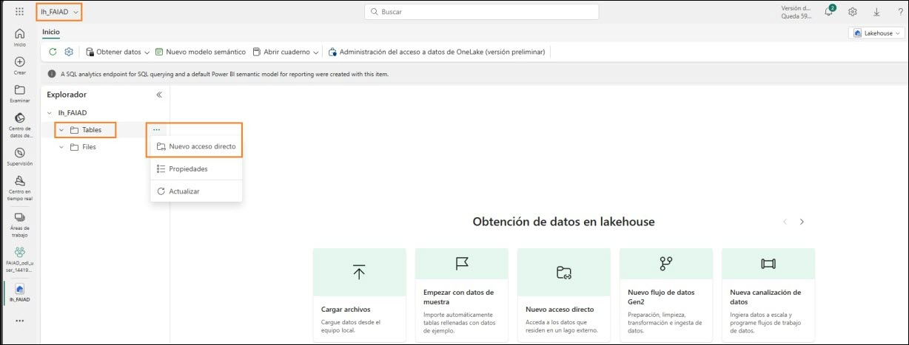

5. Das Dialogfeld **Neue Verknüpfung** wird geöffnet. Wählen Sie unter **Externe Quellen die Option Azure Data Lake Storage Gen2** aus.

    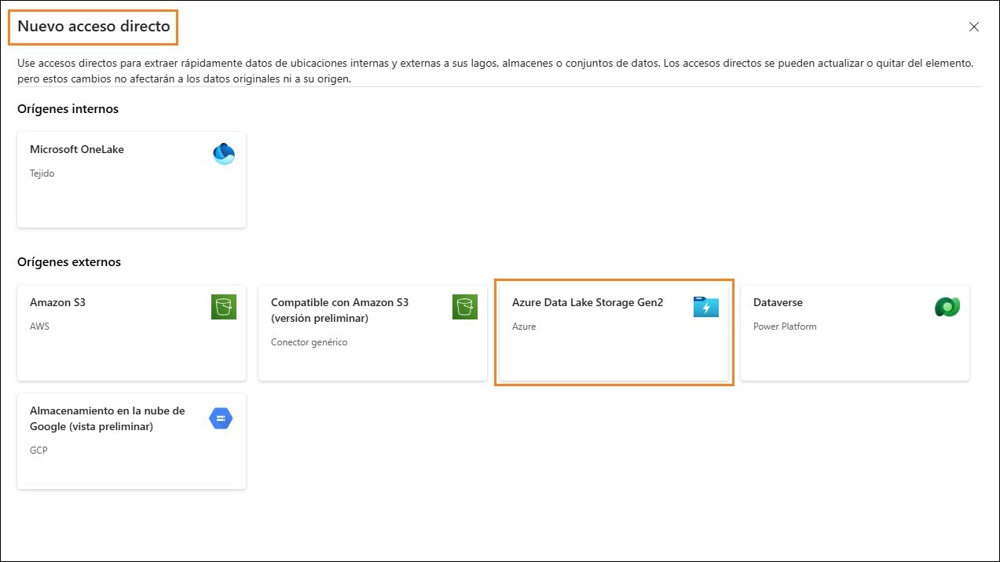

6. Sie müssen eine Verbindung zur ADLS Gen2-Datenquelle herstellen. Geben Sie unter
**Verbindungseinstellungen -> URL** diesen Link
https://stvnextblobstorage.dfs.core.windows.net/fabrikam-sales  ein.

7. Wählen Sie **Kontoschlüssel** aus der Dropdown-Liste „Authentifizierungsart“ aus.

8. Kopieren Sie den **Zugriffsschlüssel für das Adls-Speicherkonto** von der Registerkarte
**Umgebungsvariablen** (neben der Registerkarte „Übungsanleitung“) und fügen Sie ihn in das Textfeld **Kontoschlüssel** ein.
 
9. Wählen Sie unten rechts auf dem Bildschirm **Weiter** aus.

    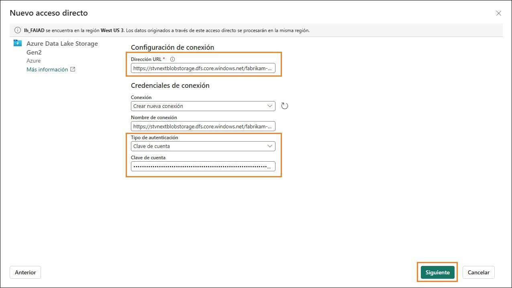

10. Sie werden mit ADLS Gen2 verbunden und die Verzeichnisstruktur wird im linken Bereich angezeigt. Erweitern Sie **Delta-Parquet-Format-FY25**.

11.	**Wählen** Sie die folgenden Verzeichnisse aus:

    a.	Application.Cities

    b.	Application.Countries

    c.	Application.StateProvinces

    d.	DateDim

    e.	Sales.BuyingGroups

    f.	Sales.Customers

    g.	Sales.Invoices

    h.	Sales.InvoiceLines

    i.	Warehouse.StockItems

    j.	Warehouse.StockGroups

    k.	Warehouse.StockItemStockGroups

**Hinweis**: „Sales.Invoices_May“ ist das einzige Verzeichnis, das **nicht** ausgewählt ist.
 
12.	Wählen Sie **Weiter** aus.

    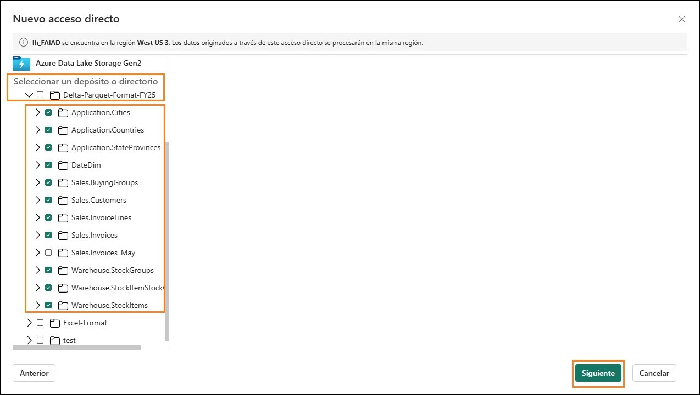

13.	Sie werden zum nächsten Dialogfeld weitergeleitet, in dem Sie die Namen bearbeiten können. Wählen Sie das **Symbol „Bearbeiten“** unter Aktionen für **Application.Cities** aus.

14.	Benennen Sie **Application.Cities in „Cities“** um.

15.	Aktivieren Sie das Häkchen neben dem Namen, um die Änderung zu speichern.

    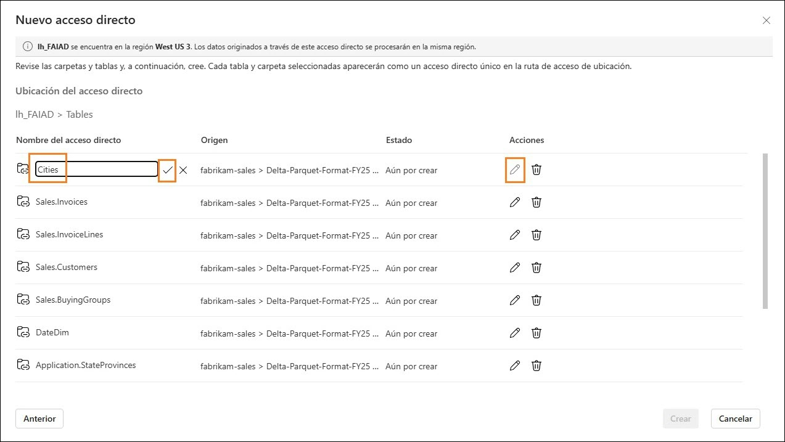

16.	Benennen Sie auch die Namen der Verknüpfungen wie folgt um:

    a.	Application.Countries in **Countries**

    b.	Application.StateProvinces in **States**

    c.	DateDim in **Date**

    d.	Sales.BuyingGroups in **BuyingGroups**

    e.	Sales.Customers in **Customers**

    f.	Sales.InvoiceLines in **InvoiceLineItems**

    g.	Sales.Invoices in **Invoices**

    h.	Warehouse.StockGroups in **ProductGroups**

    i.	Warehouse.StockItemStockGroups in **ProductItemGroup**

    j.	Warehouse.StockItems in **ProductItem**

    **Hinweis**: Überprüfen Sie die Namen. Ein Tippfehler kann während der Übung zu Fehlern führen.

17.	Wählen Sie **Erstellen** aus, um die Verknüpfung zu erstellen.

    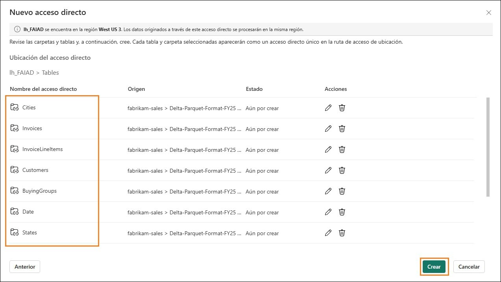

18.	Beachten Sie, dass alle Verknüpfungen als Tabellen erstellt werden. Wählen Sie die Tabelle **BuyingGroups** aus, und beachten Sie, dass im Datenbereich eine Vorschau der Daten angezeigt wird.

    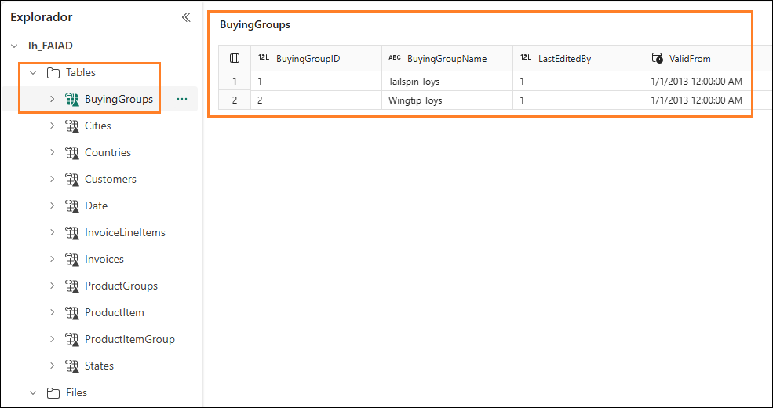
 
Das nächste Schritt besteht darin, die Daten zu transformieren, damit wir ein semantisches Modell erstellen können. Wir erstellen Ansichten, um die Daten zu transformieren.

## Daten mithilfe einer Visual-Abfrage transformieren

### Aufgabe 2: Ansicht „Geo“ mithilfe einer Visual-Abfrage erstellen

1. Wir können Lakehouse über einen SQL-Endpunkt aufrufen. Dies bietet die Möglichkeit, die Daten abzufragen und Ansichten zu erstellen. Wählen Sie **oben rechts** auf dem Bildschirm **Lakehouse -> SQL-Analyseendpunkt** aus.

    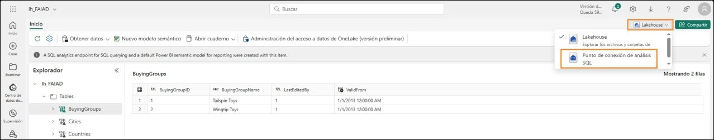

    Sie werden zum SQL-Analyseendpunkt weitergeleitet. Beachten Sie, dass sich das Explorer-Bereich geändert hat. Sie können jetzt Ansichten, gespeicherte Prozeduren, Abfragen und mehr erstellen. Wir erstellen eine Visual-Abfrage, da sie eine Power Query-ähnliche Schnittstelle bietet, und speichern diese als Ansicht.

    Wir beginnen mit der Erstellung der Ansicht „Geo“. Wir müssen Daten aus den Abfragen „Cities“, „Countries“ und „States“ zusammenführen, um „Geo“ zu erstellen.
 
2. Wählen Sie im Menü oben die Option **Neue Visual-Abfrage** aus.

    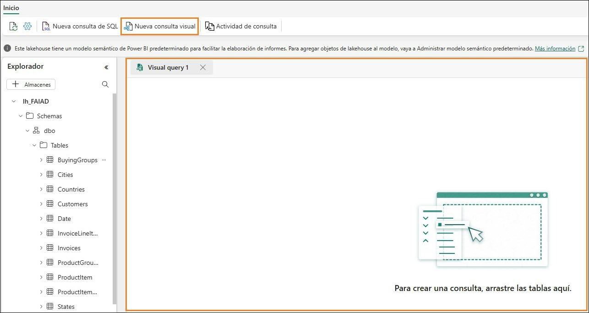

3. Wir müssen Tabellen in den visuellen Abfragebereich ziehen, um eine Abfrage zu erstellen. Lassen Sie uns die Abfragen „Cities“, „States“ und „Countries“ in den Bereich für Visual-Abfragen ziehen.

    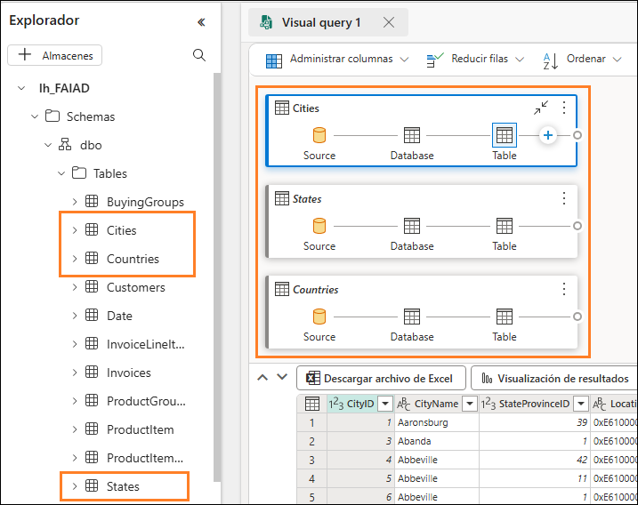

    Wir müssen diese Abfragen zusammenführen. Und die Visual-Abfrage wird mit der Option zum Verwenden des Power Query-Editors bereitgestellt. Lassen Sie uns diese verwenden, da wir damit vertraut sind.
 
4. Klicken Sie im Menü des Editors für Visual-Abfragen auf das Symbol **Fokusmodus** (rechts). Sie werden zum Power Query-Editor weitergeleitet.

    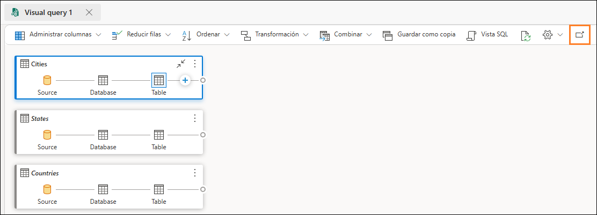

5. Wählen Sie bei ausgewählter Abfrage „Cities“ im Menüband des Power Query-Editors **Start -> Abfragen zusammenführen -> Abfragen als neue Abfrage zusammenführen.** Das Dialogfeld
„Abfragen zusammenführen“ wird geöffnet.

    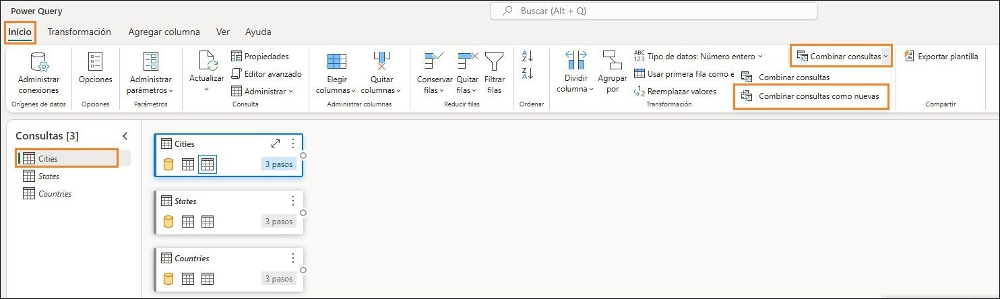

6. Wählen Sie in der **linken zusammenzuführenden Tabelle** die Option **Cities**.

7. Wählen Sie in der **rechten zusammenzuführenden Tabelle** die Option **States**.

8. Wählen Sie **StateProvinceID**-Spalten aus beiden Tabellen aus. Wir führen eine Verknüpfung über diese Spalte aus.

9. Wählen Sie **Innerer** als **Art des Joins** aus.
 
10. Wählen Sie **OK** aus.

    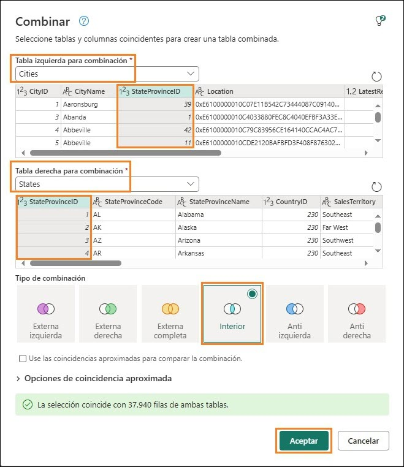

    Beachten Sie, dass eine neue Abfrage mit dem Namen „Merge“ erstellt wurde. Wir benötigen einige Spalten aus „States“.

11.	Klicken Sie in der **Datenansicht** (unterer Bereich) auf den **Doppelpfeil** neben der Spalte **States** (letzte Spalte rechts).

12.	Es wird ein Bereich geöffnet. **Wählen** Sie die folgenden Spalten aus:

    a. StateProvinceCode

    b. StateProvinceName

    c. CountryID

    d. SalesTerritory
 
13.	Wählen Sie **OK** aus.

    

    Wir müssen jetzt die Abfrage „Countries“ zusammenführen.

14.	Wählen Sie bei ausgewählter Merge-Abfrage im Menüband **Start -> Merge-Abfragen -> Merge- Abfragen** aus.

    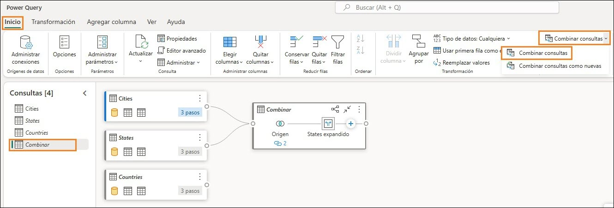

15.	Das Dialogfeld „Merge-Abfrage“ wird geöffnet. Wählen Sie in der **rechten zusammenzuführenden Tabelle Countries** aus.

16.	Wählen Sie **CountryID**-Spalten aus beiden Tabellen aus. Wir führen eine Verknüpfung über diese Spalte aus.

17.	Wählen Sie **Innerer** als **Art des Joins** aus.
 
18.	Wählen Sie **OK** aus.

    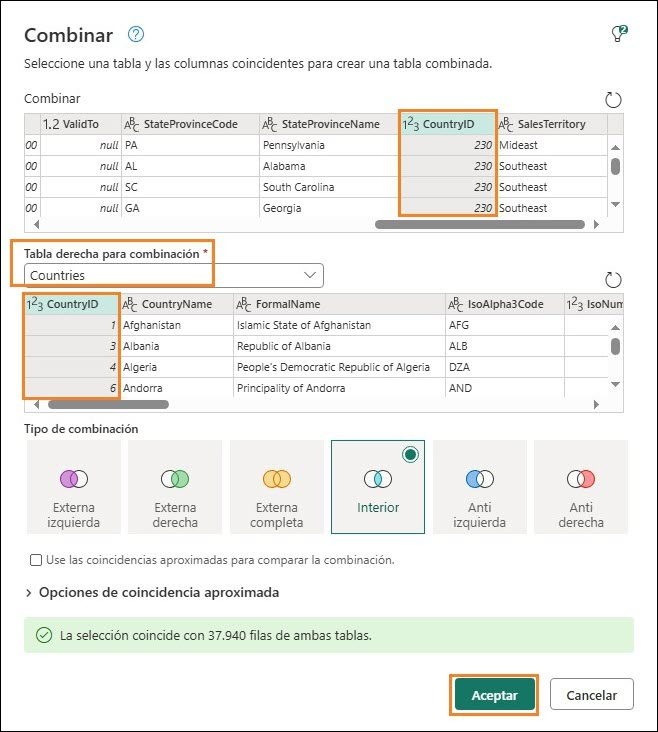

    Wir benötigen einige Spalten aus „Countries“.

19.	Klicken Sie in der **Datenansicht** (unterer Bereich) auf den **Doppelpfeil** neben der Spalte **Countries**.

20.	Es wird ein Bereich geöffnet. **Wählen** Sie die folgenden Spalten aus:

    a. CountryName

    b. FormalName

    c. IsoAlpha3Code

    d. IsoNumericCode

    e. CountryType

    f. Kontinent

    g. Region

    h. Subregion

21.	Wählen Sie **OK** aus.

    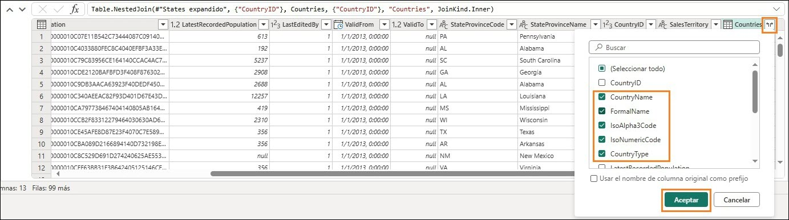

    Wir benötigen nicht alle Spalten. Wir wählen nur die aus, die wir benötigen.
 
22.	Wählen Sie bei Merge-Abfrage im Menüband **Start -> Spalten auswählen-> Spalten auswählen** aus.

    

23.	Das Dialogfeld „Spalten auswählen“ wird geöffnet. **Deaktivieren** Sie die folgenden Spalten.

    a. StateProvinceID

    b. Location

    c. LastEditedBy

    d. ValidFrom

    e. ValidTo

    f. CountryID

24.	Wählen Sie **OK** aus.

    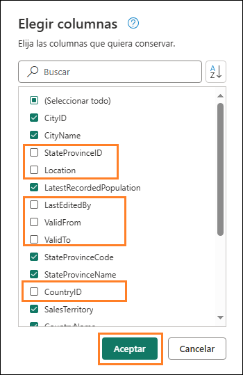

    Beachten Sie, dass der Prozess dem von Power Query ähnelt. Alle Schritte sind sowohl im Bereich „Angewendete Schritte“ rechts als auch in der visuellen Ansicht aufgezeichnet. Wir benennen „Merge-Abfrage“ und „Laden aktivieren“ um, damit die Daten aus dieser Abfrage geladen werden.

25.	**Klicken Sie im Bereich „Abfragen“ (links) mit der rechten Maustaste auf „Merge-Abfrage“.** Wählen Sie **Umbenennen** aus, und benennen Sie die Abfrage in **Geo** um.
 
26.	**Klicken Sie im Bereich „Abfragen“ (links) mit der 1rechten Maustaste auf Geo 1-Abfrage.** Wählen Sie **Laden aktivieren** aus, um diese Abfrage zu aktivieren.

27.	Stellen Sie sicher, dass die Abfragen „Cities“, „States“ und „Countries“ **deaktiviert** sind.

28.	Wählen Sie **Speichern** aus.

    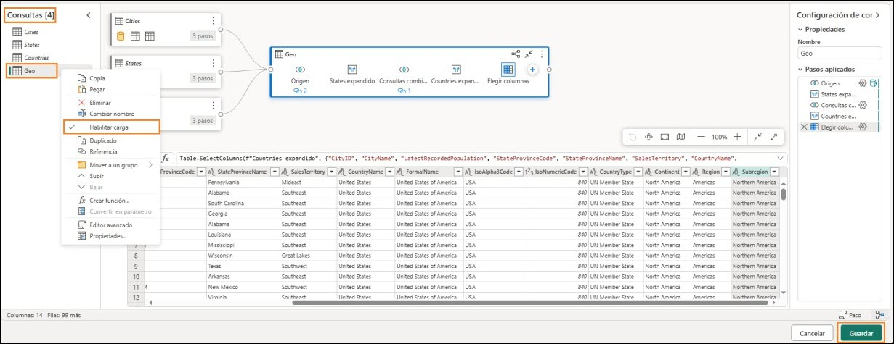

    Wir werden zum visuellen Abfrage-Editor weitergeleitet. Jetzt speichern wir diese Abfrage als Ansicht.

    **Hinweis**: Alle Schritte, die wir mit dem Power Query-Editor ausgeführt haben, können auch mit dem Editor für Visual-Abfragen ausgeführt werden.

29.	Wählen Sie im Menü des Editors für Visual-Abfragen **Als Ansicht speichern** aus.

    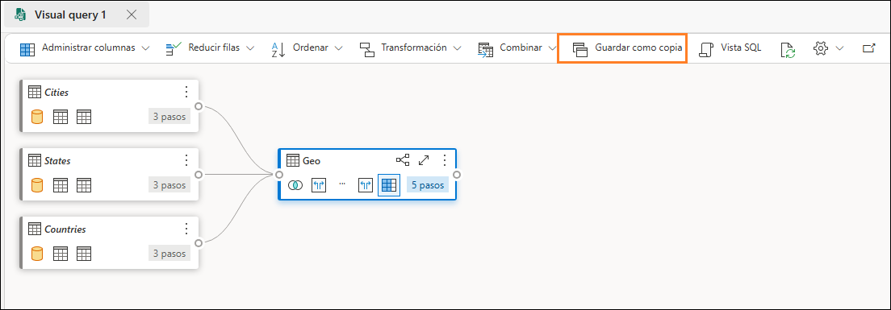

    Das Dialogfeld „Als Ansicht speichern“ wird geöffnet. Beachten Sie, dass die SQL-Abfrage verfügbar ist. Sie können sie bei Bedarf überprüfen.

30.	Geben Sie als **Ansichtsname Geo** ein.
 
31.	Wählen Sie **OK** aus, um die Ansicht zu speichern.

    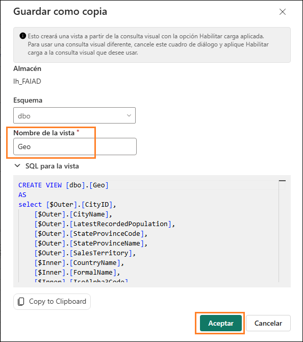

    Sie erhalten eine Benachrichtigung, nachdem die Ansicht gespeichert wurde.

32.	Erweitern Sie im Explorer-Bereich (links) **Ansichten**. Wir haben die neu erstellte Ansicht „Geo“.

    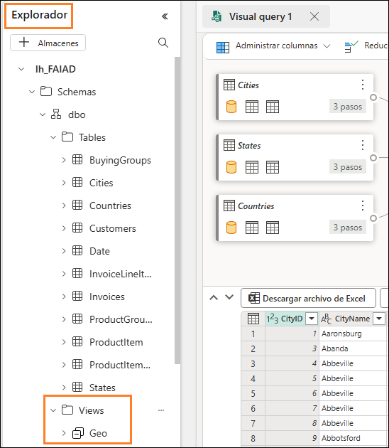
 
### Aufgabe 3: Ansicht „Reseller“ mithilfe einer Visual-Abfrage erstellen

Wir erstellen die Ansicht „Reseller“, indem wir die Tabelle „Customers“ mit der Tabelle
„BuyingGroups“ zusammenführen. Dieses Mal erstellen wir die Ansicht mithilfe einer Visual-Abfrage.

1. Wählen Sie in der Menüleiste von Lakehouse **Start -> Neue Visual-Abfrage** aus. Es wird eine neue Visual-Abfrage geöffnet.

2. Ziehen Sie die Tabellen „Customers“ und „BuyingGroups“ aus dem Explorer-Bereich in den Abschnitt „Visual-Abfrage“.

    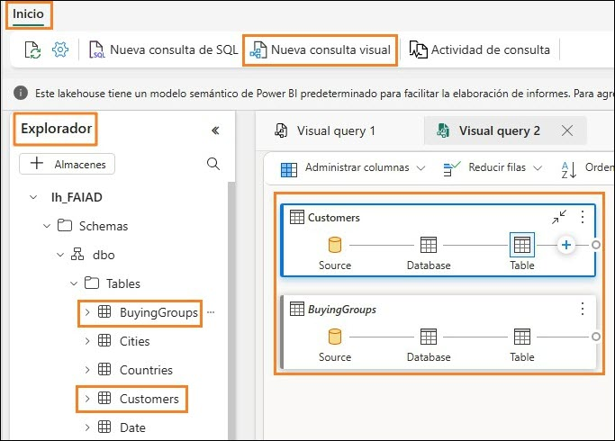

3. **Wählen Sie die Abfrage „Customers“ aus**. Wenn die Abfrage „Customers“ ausgewählt ist, weist es einen blauen Rand auf und hinter „Tabelle“ befindet sich ein „+“-Zeichen (dies gibt an, dass wir nach „Tabelle“ einen Schritt hinzufügen). Wenn kein „+“-Zeichen hinter der Tabelle angezeigt wird, haben Sie möglicherweise einen anderen Schritt ausgewählt. Wählen Sie „Tabelle“ aus und es kann losgehen).

4. Wählen Sie im Menü der Visual-Abfrage **Kombinieren -> Merge-Abfragen** aus.

    Das Dialogfeld „Zusammenführen“ wird geöffnet, wobei „Customers“ als oberste Tabelle ausgewählt ist.

    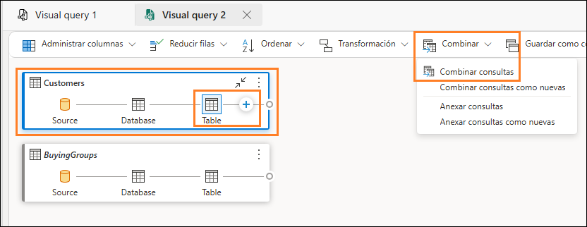

5. Wählen Sie in der **rechten zusammenzuführenden Tabelle die Option BuyingGroups** aus.

6. Wählen Sie **BuyingGroupID**-Spalten aus beiden Tabellen aus. Wir führen eine Verknüpfung über diese Spalte aus.

7. Wählen Sie **Innerer** als **Art des Joins** aus.
 
8. Wählen Sie **OK** aus.

    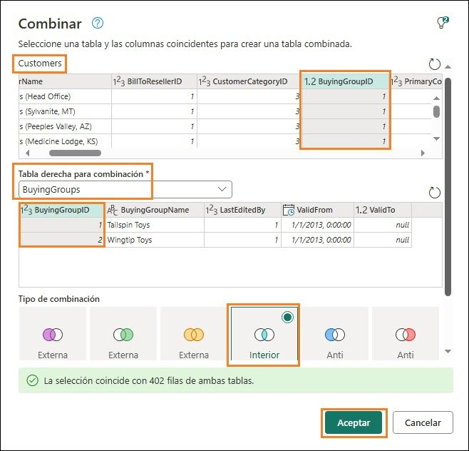

9. Klicken Sie in der **Datenansicht** (unterer Bereich) auf den **Doppelpfeil** neben der Spalte **BuyingGroups** (letzte Spalte rechts), um die Spalten von BuyingGroups auszuwählen.

10.	Es wird ein Bereich geöffnet. **Wählen Sie die Spalte BuyingGroupName** aus.

11.	Wählen Sie **OK** aus.

    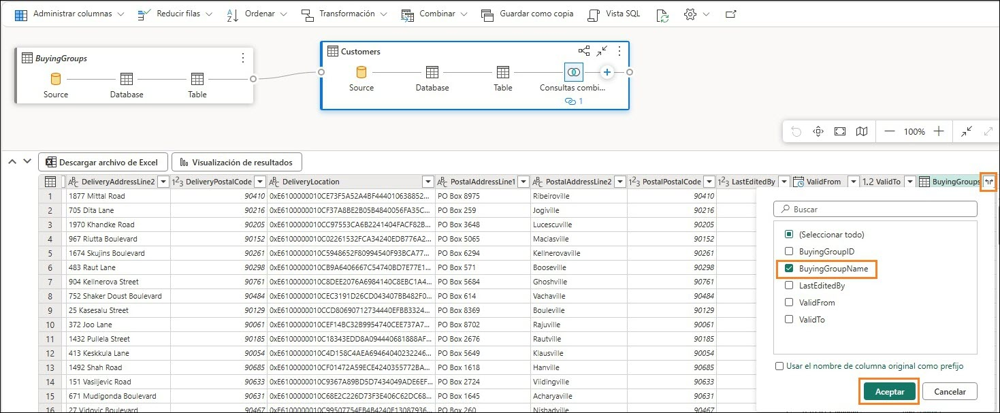

    Wir benötigen nicht alle Spalten. Wir wählen nur die aus, die wir benötigen.
 
12.	Wählen Sie im Menü der Visual-Abfrage **Spalten verwalten -> Spalten auswählen** aus.

    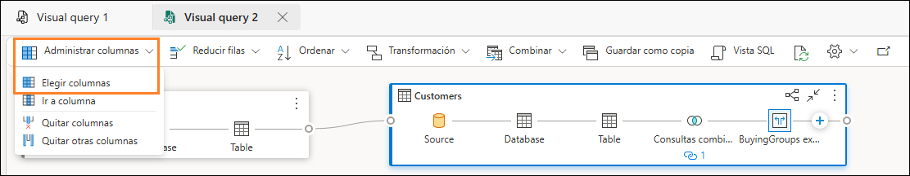

13.	Das Dialogfeld „Spalten auswählen“ wird geöffnet. **Wählen Sie** die folgenden Spalten aus.

    a.	ResellerID

    b.	ResellerName

    c.	PostalCityID

    d.	PhoneNumber

    e.	FaxNumber

    f.	WebsiteURL

    g.	DeliveryAddressLine1

    h.	DeliveryAddressLine2

    i.	DeliveryPostalCode

    j.	PostalAddressLine1

    k.	PostalAddressLine2

    l.	PostalPostalCode

    m.	BuyingGroupName

14.	Wählen Sie **OK** aus.

    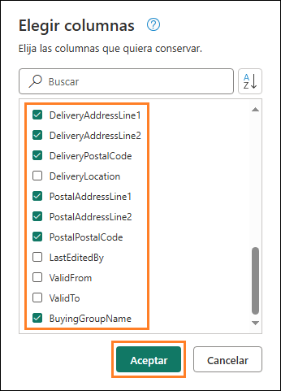

15.	Wir benennen die Spalte „BuyingGroupName“ um. **Doppelklicken Sie in der Datenansicht auf die Spaltenüberschrift „BuyingGroupName“**, damit sie bearbeitet werden kann.
 
16.	Benennen Sie die Spalte in ResellerCompany um.

Beachten Sie, dass in der Tabelle „Customers“ alle Schritte dokumentiert sind. Jetzt speichern wir diese Ansicht.

17.	Wählen Sie im Menü der Visual-Abfrage Als Ansicht speichern aus.

Das Dialogfeld „Als Ansicht speichern“ wird geöffnet. Beachten Sie, dass die SQL-Abfrage verfügbar ist. Sie können sie bei Bedarf überprüfen.

18.	Geben Sie als Ansichtsname Reseller ein.

19.	Wählen Sie OK aus, um die Ansicht zu speichern.

Sie erhalten eine Benachrichtigung, nachdem die Ansicht gespeichert wurde.
 
20.	Erweitern Sie im Explorer-Bereich (links) Ansichten. Wir haben die neu erstellte Ansicht „Reseller“.

### Aufgabe 4: Ansicht „Sales“ mithilfe einer Visual-Abfrage erstellen

Lassen Sie uns die Ansicht „Sales“ erstellen, die durch das Zusammenführen der Tabellen
„InvoiceLineItems“ und „Invoices“ sowie der Ansicht „Reseller“ erstellt wird. Wir haben diese Abfrage in Power BI Desktop. Wir kopieren den Code aus „Erweiterter Editor“. Aber bevor wir den Code
kopieren, müssen wir mit der Visual-Abfrage eine Zusammenführungstabelle erstellen, da in der
Visual-Abfrage keine leere Abfrage erstellt werden kann. Lassen Sie uns diese Methode ausprobieren.
1. Wählen Sie in der Menüleiste von Lakehouse Start -> Neue Visual-Abfrage aus. Es wird eine neue Visual-Abfrage geöffnet.
2. Ziehen Sie aus dem Abschnitt Explorer -> Tabelle die Tabellen InvoiceLineItems, Invoices in den Abschnitt für Visual-Abfragen.
3. Ziehen Sie aus dem Abschnitt Explorer -> Ansichten die Ansicht Reseller in den Abschnitt für Visual-Abfragen.
 
4. Wählen Sie im Editor für Visual-Abfragen das Symbol für den Fokusmodus aus, um den Power Query-Editor zu öffnen.

5. Wählen Sie bei ausgewählter Abfrage „InvoiceLineItems“ im Menüband Start -> Merge-Abfragen
-> Abfragen als neue Abfrage zusammenführen aus.

Das Dialogfeld zum Zusammenführen wird geöffnet.
6. Wählen Sie in der linken zusammenzuführenden Tabelle die Option InvoiceLineItems aus.
7. Wählen Sie in der rechten zusammenzuführenden Tabelle die Option Invoices aus.
8. Wählen Sie InvoiceID-Spalten aus beiden Tabellen aus. Wir führen eine Verknüpfung über diese Spalte aus.
9. Wählen Sie Innerer als Art des Joins aus.
 
10.	Wählen Sie OK aus.

Wir kopieren den Code aus Power BI Desktop, und fügen ihn über „Erweiterter Editor“ ein.
11.	Öffnen Sie FAIAD.pbix im Ordner Report auf dem Desktop Ihrer Übungsumgebung, falls dies noch nicht erfolgt ist.
12.	Wählen Sie im Menüband Start > Daten transformieren aus. Das Power Query-Fenster wird
geöffnet. Wie Sie in der vorherigen Übung festgestellt haben, sind die Abfragen im linken Bereich nach Datenquelle organisiert.

13.	Wählen Sie links unter dem Ordner „ADLSData“ die Abfrage Sales aus.
 
14.	Wählen Sie im Menüband die Registerkarte Start -> Erweiterter Editor aus. Das Dialogfenster
„Erweiterter Editor“ wird geöffnet.

15.	Wählen Sie Code aus Zeile 3 (#"Expanded Invoice" …) bis zur letzten Codezeile aus.
16.	Klicken Sie mit der rechten Maustaste, und wählen Sie Kopieren aus.
17.	Wählen Sie Abbrechen aus, um „Erweiterter Editor“ zu schließen.

18.	Navigieren Sie zurück zum Browser, in dem der Power Query-Editor geöffnet ist.
19.	Stellen Sie sicher, dass Sie die Abfrage Merge ausgewählt haben.
 
20.	Wählen Sie im Menüband die Registerkarte Start -> Erweiterter Editor aus. Das Dialogfenster
„Erweiterter Editor“ wird geöffnet.

21.	Fügen Sie am Ende von Zeile 2 ein Komma hinzu (Source = Table.NestedJoin(InvoiceLineItems,
{"InvoiceID"}, Invoices, {"InvoiceID"}, "Invoices", JoinKind.Inner).
22.	Klicken Sie auf die Eingabetaste, um eine neue Zeile zu beginnen.
23.	Geben Sie auf Ihrer Tastatur STRG+V ein, um den Code einzufügen, den Sie aus Power BI Desktop kopiert haben.
Hinweis: Wenn Sie in der Übungsumgebung arbeiten, wählen Sie die Auslassungspunkte oben rechts auf dem Bildschirm aus. Verwenden Sie den Schieberegler, um das VM Native Clipboard zu
aktivieren. Wählen Sie im Dialogfeld OK aus. Nachdem Sie die Abfragen eingefügt haben, können Sie diese Option deaktivieren.

24.	Markieren Sie die letzten beiden Codezeilen (in der Quelle) und löschen Sie sie.
 
25.	Wählen Sie OK aus, um die Änderungen zu speichern.

Wenn es einfacher ist, löschen Sie den gesamten Code im erweiterten Editor, und fügen Sie den folgenden Code in „Erweiterter Editor“ ein.
let
 Source = Table.NestedJoin(InvoiceLineItems, {"InvoiceID"}, Invoices, {"InvoiceID"}, "Invoices", JoinKind.Inner),
 #"Expanded Invoice" = Table.ExpandTableColumn(Source, "Invoices", {"CustomerID", "BillToCustomerID", "SalespersonPersonID", "InvoiceDate"}, {"CustomerID", "BillToCustomerID", "SalespersonPersonID", "InvoiceDate"}),
 #"Removed Other Columns" = Table.SelectColumns(#"Expanded Invoice",{"InvoiceLineID", "InvoiceID", "StockItemID", "Quantity", "UnitPrice", "TaxRate", "TaxAmount", "LineProfit", "ExtendedPrice", "CustomerID", "SalespersonPersonID", "InvoiceDate"}),
 #"Renamed Columns" = Table.RenameColumns(#"Removed Other Columns",{{"CustomerID", "ResellerID"}}),
  #"Merged Queries" = Table.NestedJoin(#"Renamed Columns", {"ResellerID"}, Reseller,
{"ResellerID"}, "Customer", JoinKind.Inner),
 #"Added Custom" = Table.AddColumn(#"Merged Queries", "Sales Amount", each [ExtendedPrice] - [TaxAmount]),
 #"Changed Type" = Table.TransformColumnTypes(#"Added Custom",{{"Sales Amount", type number}}),
 #"Removed Columns" = Table.RemoveColumns(#"Changed Type",{"Customer"}) in
  #"Removed Columns"

26.	Sie werden zum Power Query-Editor weitergeleitet. Im linken Bereich „Abfragen“ müssen Sie
kauf die „Merge-Abfrage doppelklicken, um sie umzubenennen.
27.	Benennen Sie Merge-Abfrage in Sales um.
 
28.	Klicken Sie mit der rechten Maustaste auf die Abfrage „Sales“, und wählen Sie Laden aktivieren
aus, damit die Abfrage geladen werden kann.

29.	Wählen Sie Speichern aus, um das Power Query-Dialogfeld zu speichern und zu schließen. Die werden zur visuellen Abfrage weitergeleitet.
30.	Wählen Sie im Menü der Visual-Abfrage Als Ansicht speichern aus. Das Dialogfeld „Als Ansicht speichern“ wird geöffnet. Beachten Sie, dass die SQL-Abfrage verfügbar ist. Sie können sie bei Bedarf überprüfen.
31.	Geben Sie als Ansichtsname Sales ein.
32.	Wählen Sie OK aus, um die Ansicht zu speichern.

Sie erhalten eine Benachrichtigung, nachdem die Ansicht gespeichert wurde.
 
33.	Erweitern Sie im Explorer-Bereich (links) Ansichten. Wir haben die neu erstellte Ansicht „Sales“.

### Aufgabe 5: Ansicht „Product“ mithilfe einer Visual-Abfrage erstellen

Wir erstellen die Ansicht „Product“, die durch das Zusammenführen der Tabellen „ProductItem“,
„ProductItemGroup“ und „ProductGroups“ erstellt wird. Um voranzukommen, kopieren wir den Code in „Erweiterter Editor“.
1. Wählen Sie in der Menüleiste von Lakehouse Start -> Neue Visual-Abfrage aus. Es wird eine neue Visual-Abfrage geöffnet.
2. Ziehen Sie die Tabellen ProductItem, ProductItemGroup und ProductGroups aus dem Abschnitt
„Explorer“ in den Abschnitt für visuelle Abfragen.
3. Wählen Sie im Editor für Visual-Abfragen das Symbol für den Fokusmodus aus, um den Power Query-Editor zu öffnen.
 
4. Wählen Sie bei ausgewählter Abfrage ProductItem im Menüband Start -> Abfragen
zusammenführen -> Abfragen als neue Abfrage zusammenführen aus. Das Dialogfeld zum Zusammenführen wird geöffnet.

5. Wählen Sie in der linken zusammenzuführenden Tabelle die Option ProductItem aus.
6. Wählen Sie in der rechten zusammenzuführenden Tabelle die Option ProductItemGroup aus.
7. Wählen Sie StockItemID-Spalten aus beiden Tabellen aus. Wir führen eine Verknüpfung über diese Spalte aus.
8. Wählen Sie als Art des Joins die Option linker äußerer Join aus.
9. Wählen Sie OK aus. Es wird eine neue Merge-Abfrage erstellt.

 
10.	Wählen Sie bei ausgewählter Merge-Abfrage im Menüband Start -> Erweiterter Editor aus. Das Dialogfenster „Erweiterter Editor“ wird geöffnet.

11.	Wählen Sie den gesamten Code in „Erweiterter Editor“ aus, und löschen Sie ihn.
12.	Fügen Sie den folgenden Code in „Erweiterter Editor“ ein. let
 Source = Table.NestedJoin(ProductItem, {"StockItemID"}, ProductItemGroup,
{"StockItemID"}, "ProductItemGroup", JoinKind.LeftOuter),
 #"Expanded ProductItemGroup" = Table.ExpandTableColumn(Source, "ProductItemGroup",
{"StockGroupID"}, {"StockGroupID"}),
 #"Merged queries" = Table.NestedJoin(#"Expanded ProductItemGroup", {"StockGroupID"}, ProductGroups, {"StockGroupID"}, "ProductGroups", JoinKind.LeftOuter),
 #"Expanded ProductGroups" = Table.ExpandTableColumn(#"Merged queries", "ProductGroups", {"StockGroupName"}, {"StockGroupName"}),
 #"Choose columns" = Table.SelectColumns(#"Expanded ProductGroups", {"StockItemID", "StockItemName", "SupplierID", "Size", "IsChillerStock", "TaxRate", "UnitPrice",
"RecommendedRetailPrice", "TypicalWeightPerUnit", "StockGroupName"})
 in
 #"Choose columns"
13.	Wählen Sie OK aus, um „Erweiterter Editor“ zu schließen. Sie werden zum Power Query-Editor weitergeleitet.

 
14.	Im linken Bereich „Abfragen“ müssen Sie kauf die „Merge-Abfrage doppelklicken, um sie umzubenennen.
15.	Benennen Sie Merge-Abfrage in Product um.
16.	Klicken Sie mit der rechten Maustaste auf die Abfrage „Product“, und wählen Sie Laden aktivieren aus, damit die Abfrage geladen werden kann.
17.	Wählen Sie Speichern aus, um das Power Query-Dialogfeld zu speichern und zu schließen. Die werden zur visuellen Abfrage weitergeleitet.

18.	Wählen Sie im Menü der Visual-Abfrage Als Ansicht speichern aus. Das Dialogfeld „Als Ansicht speichern“ wird geöffnet. Beachten Sie, dass die SQL-Abfrage verfügbar ist. Sie können sie bei Bedarf überprüfen.
19.	Geben Sie als Ansichtsname Product ein.
20.	Wählen Sie OK aus, um die Ansicht zu speichern.

Sie erhalten eine Benachrichtigung, nachdem die Ansicht gespeichert wurde.
 
21.	Erweitern Sie im Explorer-Bereich (links) Ansichten. Wir haben die neu erstellte Ansicht
„Product“.

Wir haben die Daten aus der ADLS Gen2-Datenquelle transformiert. In dieser Übung haben wir gelernt, wie man Verknüpfungen erstellt und verschiedene Optionen zur Verwendung von Ansichten für Visual-Abfragen zum Transformieren von Daten erkundet.
In der nächsten Übung erfahren wir, wie man Dataflow Gen2 verwendet und eine Verknüpfung zu einem anderen Lakehouse erstellt.
 
Referenzen
Bei Fabric Analyst in a Day (FAIAD) lernen Sie einige der wichtigsten Funktionen von Microsoft Fabric kennen. Im Menü des Dienstes finden Sie in der Hilfe (?) Links zu praktischen Informationen.

Nachfolgend finden Sie weitere Angebote zur weiteren Arbeit mit Microsoft Fabric.
•	Die vollständige Ankündigung der allgemeinen Verfügbarkeit von Microsoft Fabric finden Sie im Blogbeitrag.
•	Fabric bei einer interaktiven Vorstellung kennenlernen
•	Zur kostenlosen Testversion von Microsoft Fabric anmelden
•	Website von Microsoft Fabric besuchen
•	Mit Modulen von Fabric Learning neue Qualifikationen erwerben
•	Technische Dokumentation zu Fabric lesen
•	Kostenloses E-Book zum Einstieg in Fabric lesen
•	Mitglied der Fabric-Community werden, um Fragen zu stellen, Feedback zu geben und sich mit anderen auszutauschen
Lesen Sie die detaillierteren Blogs zur Ankündigung der Fabric-Umgebung:
•	Blog zum Data Factory-Funktionsbereich in Fabric
•	Blog zum Data Engineering-Funktionsbereich von Synapse in Fabric
•	Blog zum Data Science-Funktionsbereich von Synapse in Fabric
•	Blog zum Data Warehousing-Funktionsbereich von Synapse in Fabric
•	Blog zum Real-Time Analytics-Funktionsbereich von Synapse in Fabric
•	Blog mit Ankündigungen zu Power BI
 
•	Blog zum Data Activator-Funktionsbereich in Fabric
•	Blog zu Verwaltung und Governance in Fabric
•	Blog zu OneLake in Fabric
•	Blog zur Dataverse- und Microsoft Fabric-Integration

© 2023 Microsoft Corporation. Alle Rechte vorbehalten.
Durch die Verwendung der vorliegenden Demo/Übung stimmen Sie den folgenden Bedingungen zu:
Die in dieser Demo/Übung beschriebene Technologie/Funktionalität wird von der Microsoft Corporation bereitgestellt, um Feedback von Ihnen zu erhalten und Ihnen Wissen zu vermitteln.
Sie dürfen die Demo/Übung nur verwenden, um derartige Technologiefeatures und Funktionen
zu bewerten und Microsoft Feedback zu geben. Es ist Ihnen nicht erlaubt, sie für andere Zwecke zu verwenden. Es ist Ihnen nicht gestattet, diese Demo/Übung oder einen Teil derselben zu ändern, zu kopieren, zu verbreiten, zu übertragen, anzuzeigen, auszuführen, zu vervielfältigen, zu veröffentlichen, zu lizenzieren, zu transferieren oder zu verkaufen oder aus ihr abgeleitete Werke zu erstellen.
DAS KOPIEREN ODER VERVIELFÄLTIGEN DER DEMO/ÜBUNG (ODER EINES TEILS DERSELBEN) AUF EINEN/EINEM ANDEREN SERVER ODER SPEICHERORT FÜR DIE WEITERE VERVIELFÄLTIGUNG
ODER VERBREITUNG IST AUSDRÜCKLICH UNTERSAGT.
DIESE DEMO/ÜBUNG STELLT BESTIMMTE SOFTWARE-TECHNOLOGIE-/PRODUKTFEATURES UND FUNKTIONEN, EINSCHLIESSLICH POTENZIELLER NEUER FEATURES UND KONZEPTE, IN EINER
SIMULIERTEN UMGEBUNG OHNE KOMPLEXE EINRICHTUNG ODER INSTALLATION FÜR DEN OBEN BESCHRIEBENEN ZWECK BEREIT. DIE TECHNOLOGIE/KONZEPTE IN DIESER DEMO/ÜBUNG ZEIGEN MÖGLICHERWEISE NICHT DAS VOLLSTÄNDIGE FUNKTIONSSPEKTRUM UND FUNKTIONIEREN MÖGLICHERWEISE NICHT WIE DIE ENDGÜLTIGE VERSION. UNTER UMSTÄNDEN
VERÖFFENTLICHEN WIR AUCH KEINE ENDGÜLTIGE VERSION DERARTIGER FEATURES ODER KONZEPTE. IHRE ERFAHRUNG BEI DER VERWENDUNG DERARTIGER FEATURES UND FUNKTIONEN IN EINER PHYSISCHEN UMGEBUNG KANN FERNER ABWEICHEND SEIN.
FEEDBACK. Wenn Sie Feedback zu den Technologiefeatures, Funktionen und/oder Konzepten geben, die in dieser Demo/Übung beschrieben werden, gewähren Sie Microsoft das Recht, Ihr Feedback in jeglicher Weise und für jeglichen Zweck kostenlos zu verwenden, zu veröffentlichen
und gewerblich zu nutzen. Außerdem treten Sie Dritten kostenlos sämtliche Patentrechte ab, die erforderlich sind, damit deren Produkte, Technologien und Dienste bestimmte Teile einer
Software oder eines Dienstes von Microsoft, welche/welcher das Feedback enthält, verwenden oder eine Verbindung zu dieser/diesem herstellen können. Sie geben kein Feedback, das einem Lizenzvertrag unterliegt, aufgrund dessen Microsoft Drittparteien eine Lizenz für seine Software oder Dokumentation gewähren muss, weil wir Ihr Feedback in diese aufnehmen. Diese Rechte bestehen nach Ablauf dieser Vereinbarung fort.
 
DIE MICROSOFT CORPORATION LEHNT HIERMIT JEGLICHE GEWÄHRLEISTUNGEN UND GARANTIEN IN BEZUG AUF DIE DEMO/ÜBUNG AB, EINSCHLIESSLICH ALLER AUSDRÜCKLICHEN, KONKLUDENTEN ODER GESETZLICHEN GEWÄHRLEISTUNGEN UND GARANTIEN DER HANDELSÜBLICHKEIT, DER EIGNUNG FÜR EINEN BESTIMMTEN ZWECK, DES RECHTSANSPRUCHS UND DER NICHTVERLETZUNG VON RECHTEN DRITTER. MICROSOFT MACHT KEINERLEI ZUSICHERUNGEN BZW. ERHEBT KEINERLEI ANSPRÜCHE IM HINBLICK AUF DIE RICHTIGKEIT DER ERGEBNISSE UND DES AUS DER VERWENDUNG DER DEMO/ÜBUNG RESULTIERENDEN ARBEITSERGEBNISSES BZW. BEZÜGLICH DER EIGNUNG DER IN DER DEMO/ÜBUNG ENTHALTENEN INFORMATIONEN FÜR EINEN BESTIMMTEN ZWECK.
HAFTUNGSAUSSCHLUSS
Diese Demo/Übung enthält nur einen Teil der neuen Features und Verbesserungen in Microsoft Power BI. Einige Features können sich unter Umständen in zukünftigen Versionen des Produkts ändern. In dieser Demo/Übung erhalten Sie Informationen über einige, aber nicht über alle neuen Features.
