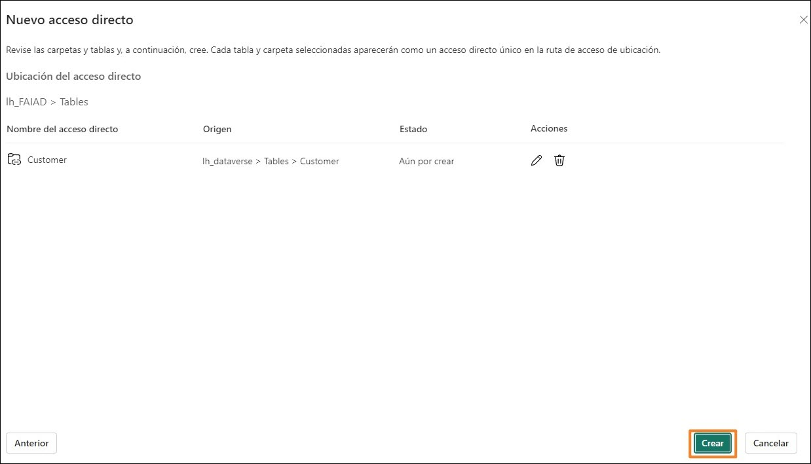

# Microsoft Fabric - Fabric Analyst in a Day - Übung 4

 
## Inhalt

- Einführung
- Dataflow Gen2
    - Aufgabe 1: SharePoint-Abfragen in Dataflow kopieren
    - Aufgabe 2: Verbindung zu SharePoint erstellen
    - Aufgabe 3: Datenziel für die Abfrage „People“ konfigurieren
    -  Aufgabe 4: SharePoint-Dataflow veröffentlichen und umbenennen
    -  Aufgabe 5: Snowflake-Abfragen in Dataflow kopieren
    -  Aufgabe 6: Verbindung zu Snowflake erstellen
    -  Aufgabe 7: Datenziel für die Abfragen „Supplier“ und „PO“ konfigurieren
    -  Aufgabe 8: Snowflake-Dataflow umbenennen und veröffentlichen
- Verknüpfung zu ADLS Gen2
    -  Aufgabe 9: Eine Verknüpfung zu Dataverse erstellen
    -  Aufgabe 6: Eine Verknüpfung zu Lakehouse erstellen
- Referenzen

## Einführung

Bei unserem Anwendungsfall befinden sich die Lieferantendaten in Snowflake, die Kundendaten in Dataverse und die Mitarbeiterdaten in SharePoint. Alle diese Datenquellen werden zu verschiedenen Zeiten aktualisiert. Um die Anzahl der Datenaktualisierungen von Dataflows zu verringern, erstellen wir für Snowflake und SharePoint-Datenquellen individuelle Dataflows.

**Hinweis**: Ein einziger Dataflow berücksichtigt dabei mehrere Datenquellen.

Das IT-Team hat bereits eine Verknüpfung zu Dataverse erstellt und die erforderlichen
Datentransformationen angewendet, die diese in der Power BI Desktop-Datei spiegeln. Sie haben diese Daten in Lakehouse im Arbeitsbereich „Administrator“ erfasst und uns Zugriff auf die Tabelle(n) gewährt. Wir erstellen eine Verknüpfung für das vom IT-Team erstellte Lakehouse.

Am Ende dieser Übung haben Sie Folgendes gelernt:

- Mit Dataflow Gen2 eine Verbindung zu SharePoint herstellen und Daten im Lakehouse erfassen
- Mit Dataflow Gen2 eine Verbindung zu Snowflake herstellen und Daten im Lakehouse erfassen
- Daten aus einem freigegebenen Lakehouse erfassen

## Dataflow Gen2

### Aufgabe 1: SharePoint-Abfragen in Dataflow kopieren

1. Navigieren wir nun zurück zum Fabric-Arbeitsbereich, **FAIAD_<username>**, den Sie in Übung 2, Aufgabe 9, erstellt haben.

2. Wählen Sie unten links auf dem Bildschirm das **Symbol** für die **Fabric-Funktionsbereichs- Auswahl** aus. Das Dialogfeld „Fabric-Funktionsbereich“ wird geöffnet.

3. Wählen Sie dort die Option **Data Factory** aus. Sie navigieren zur **Data Factory-Startseite.**

    
 
4. Wählen Sie unter „Empfohlene Elemente“ die Option **Dataflow Gen2** aus.

    

   Sie werden zur **Dataflow-Seite** weitergeleitet. Die Dataflow Gen2-Schnittstelle ähnelt der von Power Query in Power BI Desktop. Wir können Abfragen von Power BI Desktop nach Dataflow Gen2 kopieren. Lassen Sie uns dies ausprobieren.

5. Öffnen Sie **FAIAD.pbix** im Ordner **Reports** auf dem Desktop Ihrer Übungsumgebung, falls dies noch nicht erfolgt ist.

6. Wählen Sie im Menüband **Start > Daten transformieren** aus. Das Power Query-Fenster wird geöffnet. Wie Sie in der vorherigen Übung festgestellt haben, sind die Abfragen im linken Bereich nach Datenquelle organisiert.

7. Wählen Sie links unter dem Ordner **SharepointData** die Abfrage **People** aus.

8. **Klicken Sie mit der rechten Maustaste,** und wählen Sie **Kopieren** aus.

    
 
9. Rufen Sie im Browser wieder das Fenster **Dataflow** auf.

10. Drücken Sie im Bereich **Dataflow** auf **STRG+V** (das Einfügen mittels Rechtsklick ist derzeit nicht möglich). Wenn Sie ein MAC-Gerät verwenden, drücken Sie zum Einfügen bitte Cmd+V.

**Hinweis**: Wenn Sie in der Übungsumgebung arbeiten, wählen Sie die Auslassungspunkte oben rechts auf dem Bildschirm aus. Verwenden Sie den Schieberegler, um das **VM Native Clipboard** zu aktivieren. Wählen Sie im Dialogfeld OK aus. Nachdem Sie die Abfragen eingefügt haben, können Sie diese Option deaktivieren.

Beachten Sie, dass die Abfrage links eingefügt wurde. Weil für SharePoint keine Verbindung erstellt wurde, wird eine Warnmeldung angezeigt, in der Sie aufgefordert werden, eine Verbindung zu konfigurieren.

### Aufgabe 2: Verbindung zu SharePoint erstellen

1. Wählen Sie **Verbindung konfigurieren** aus.

    

2. Das Dialogfeld „Mit Datenquelle verbinden“ wird geöffnet. Überprüfen Sie, dass im Dropdown- Menü **Verbindung** die Option **Neue Verbindung erstellen** ausgewählt ist.

3. Die **Authentifizierungsart** muss **Organisationskonto** lauten.

4. Wählen Sie **Verbinden** aus.

    **Hinweis**: Sie werden mit Ihren Anmeldeinformationen angemeldet. Sie werden von denen auf dem Screenshot unten abweichen.

    
 
### Aufgabe 3: Datenziel für die Abfrage „People“ konfigurieren

Die Verbindung wird hergestellt, und Sie können die Daten im Vorschaubereich ansehen. Wenn Sie möchten, sehen Sie sich die angewandten Schritte der Abfragen an. Nun müssen die „People“-Daten im Lakehouse erfasst werden.

1. Wählen Sie die Abfrage **People** aus.

2. Klicken Sie im Menüband auf **Start > Datenziel hinzufügen -> Lakehouse**.

    

3. Das Dialogfeld „Herstellen einer Verbindung mit dem Datenziel“ wird geöffnet. Wir müssen eine neue Verbindung zu Lakehouse herstellen. Wenn **Neue Verbindung erstellen im Dropdown-
Menü „Verbindung“** ausgewählt und **Authentifizierungsart** auf **Organisationskonto** festgelegt ist, wählen Sie **Weiter** aus.

    

4. Das Dialogfeld „Ziel auswählen“ wird geöffnet. Stellen Sie sicher, dass das **Optionsfeld „Neue Tabelle“** ausgewählt ist, da wir eine neue Tabelle erstellen.

5. Wir möchten die zuvor erstellte Tabelle in Lakehouse erstellen. Navigieren Sie im linken Bereich zu **Lakehouse -> FAIAD_<Benutzername>**.

6. Wählen Sie **lh_FAIAD** aus.

7. Behalten Sie den Tabellennamen **People** bei.
 
8. Wählen Sie **Weiter** aus.

    

9. Das Dialogfeld „Zieleinstellungen auswählen“ wird geöffnet. Stellen Sie sicher, dass **„Automatische Einstellungen verwenden“ aktiviert** ist.

    **Hinweis**: Sie können die automatischen Einstellungen deaktivieren und haben die Möglichkeit, die Aktualisierungsmethode und die Schemaoptionen festzulegen. Vergewissern Sie sich nach der Erkundung, dass **„Automatische Einstellungen verwenden“ aktiviert** ist.

10. Wählen Sie **Einstellungen speichern** aus.

    

### Aufgabe 4: SharePoint-Dataflow veröffentlichen und umbenennen

1. Sie werden zum **Power Query-Fenster** weitergeleitet. Beachten Sie, dass **unten rechts** das Datenziel auf **Lakehouse** festgelegt ist.
 
2. Wählen Sie unten rechts **Veröffentlichen** aus.

    

    **Hinweis**: Sie werden zum Arbeitsbereich **FAIAD_<Benutzername>** weitergeleitet. Es kann einige Momente dauern, bis der Dataflow veröffentlicht wird.

3. Wir arbeiten mit Dataflow 1. Benennen wir ihn um, bevor wir fortfahren. Klicken Sie auf die **Auslassungspunkte (…)** neben Dataflow 1. Wählen Sie **Eigenschaften** aus.

    

4. Das Dialogfeld „Dataflow-Eigenschaften“ wird geöffnet. Ändern Sie den **Namen** in **df_People_SharePoint**.

5. Ergänzen Sie im Textfeld **Beschreibung** den Text **Dataflow zur Erfassung der „People“-Daten aus SharePoint im Lakehouse**.
 
6. Wählen Sie **Speichern** aus.

    

    Sie werden zum Arbeitsbereich **FAIAD_<Benutzername>** weitergeleitet.

7. Wählen Sie **lh_FAIAD** aus, um zum Lakehouse zu navigieren.

8. Stellen Sie sicher, dass Sie sich in der Lakehouse-Ansicht (nicht im SQL-Analyseendpunkt) befinden.

9. Beachten Sie, dass die Tabelle **People** jetzt im Lakehouse verfügbar ist.

    **Hinweis**: Wenn die neu erstellten Tabellen nicht angezeigt werden, wählen Sie die
    Auslassungspunkte neben „Tabellen“ und „Aktualisieren“ aus, um die Tabellen zu aktualisieren.

    Nun sind alle Daten im Lakehouse erfasst. In der nächsten Übung beschäftigen wir uns mit der Planung von Dataflow-Aktualisierungen.
 
### Aufgabe 5: Snowflake-Abfragen in Dataflow kopieren

1. Wir navigieren zurück zum Fabric-Arbeitsbereich **FAIAD_<username>**.

2. Wählen Sie im Menü oben die Option **Neu -> Dataflow Gen2** aus.

    

    Sie werden zur **Dataflow-Seite** weitergeleitet. Nachdem Sie Dataflow nun kennen, kopieren Sie die Abfragen aus Power BI Desktop in Dataflow.

3. Öffnen Sie **FAIAD.pbix** im Ordner **Reports** auf dem Desktop Ihrer Übungsumgebung, falls dies noch nicht erfolgt ist.

4. Wählen Sie im Menüband **Start > Daten transformieren** aus. Das Power Query-Fenster wird geöffnet. Wie Sie in der vorherigen Übung festgestellt haben, sind die Abfragen im linken Bereich nach Datenquelle organisiert.

5. Wählen Sie links unter dem Ordner „SnowflakeData“ mit **STRG+Auswahl** oder „Umschalt+Auswahl“ die folgenden Abfragen aus:

    a. SupplierCategories

    b. Suppliers

    c. Supplier

    d. PO

    e. PO Line Items
 
6. **Klicken Sie mit der rechten Maustaste**, und wählen Sie **Kopieren** aus.

    

7. Navigieren Sie zurück zum **Browser**.

8. Wählen Sie im Bereich **Dataflow** den **mittleren Bereich** aus, und drücken Sie **STRG+V** (das Einfügen mittels Rechtklick ist derzeit nicht möglich). Wenn Sie ein MAC-Gerät verwenden, drücken Sie zum Einfügen bitte Cmd+V.

    **Hinweis**: Wenn Sie in der Übungsumgebung arbeiten, wählen Sie die Auslassungspunkte oben rechts auf dem Bildschirm aus. Verwenden Sie den Schieberegler, um das **VM Native Clipboard zu aktivieren**. Wählen Sie im Dialogfeld OK aus. Nachdem Sie die Abfragen eingefügt haben, können Sie diese Option deaktivieren.

    
 
### Aufgabe 6: Verbindung zu Snowflake erstellen

Beachten Sie, dass die fünf Abfragen eingefügt wurden und dass der Bereich „Abfragen“ jetzt links ist. Weil für Snowflake keine Verbindung erstellt wurde, wird eine Warnmeldung angezeigt, in der Sie aufgefordert werden, eine Verbindung zu konfigurieren.

1. Wählen Sie **Verbindung konfigurieren** aus.

    

2. Das Dialogfeld „Mit Datenquelle verbinden“ wird geöffnet. Überprüfen Sie, dass im Dropdown- Menü **Verbindung** die Option **Neue Verbindung erstellen** ausgewählt ist.

3. Die **Authentifizierungsart** sollte **Snowflake** lauten.

4. Geben Sie den **Benutzernamen und das Kennwort für Snowflake** ein. Beides finden Sie auf der Registerkarte mit den Environment Variables (neben der Registerkarte mit der Übungsanleitung).

5. Wählen Sie **Verbinden** aus.

    

    Die Verbindung wird hergestellt, und Sie können die Daten im Vorschaubereich ansehen. Wenn Sie möchten, sehen Sie sich die angewandten Schritte der Abfragen an. Grundsätzlich enthält die Suppliers-Abfrage Lieferanteninformationen und „SupplierCategories“, wie der Name schon sagt, Lieferantenkategorien. Diese beiden Tabellen werden zusammengeführt, um die Dimension „Supplier“ mit den erforderlichen Spalten zu erstellen. Auf ähnliche Weise wird „PO Line Items“ mit „PO“ zusammengeführt, um den Fakt „PO“ zu erstellen. Nun müssen die Daten von „Supplier“ und „PO“ im Lakehouse erfasst werden.
 
### Aufgabe 7: Datenziel für die Abfragen „Supplier“ und „PO“ konfigurieren

1. Wählen Sie die Abfrage **Supplier** aus.

2. Klicken Sie im Menüband auf **Start > Datenziel hinzufügen -> Lakehouse**.

    

3. Das Dialogfeld „Herstellen einer Verbindung mit dem Datenziel“ wird geöffnet. Wählen Sie im **Dropdown-Menü „Verbindung“** die Option **Lakehouse (keine)** aus.

4. Wählen Sie **Weiter** aus.

    

5. Das Dialogfeld „Ziel auswählen“ wird geöffnet. Stellen Sie sicher, dass das Optionsfeld **Neue Tabelle ausgewählt** ist, weil wir eine neue Tabelle erstellen.

6. Wir möchten die zuvor erstellte Tabelle in Lakehouse erstellen. Navigieren Sie im linken Bereich zu **Lakehouse -> FAIAD_<Benutzername>.**

7. Wählen Sie **lh_FAIAD** aus.

8. Behalten Sie den Tabellennamen **Supplier** bei.
 
9. Wählen Sie **Weiter** aus.

   

10. Das Dialogfeld „Zieleinstellungen auswählen“ wird geöffnet. Wir verwenden die automatischen Einstellungen, da hierdurch eine vollständige Aktualisierung der Daten erfolgt. Außerdem werden die Spalten nach Bedarf umbenannt. Wählen Sie **Einstellungen speichern** aus.
   
    

11. Sie werden zum **Power Query-Fenster** weitergeleitet. Beachten Sie unten rechts, dass das **Datenziel** auf **Lakehouse** festgelegt ist. Legen Sie ebenso das **Datenziel für die Abfrage „PO“** fest. Sobald das erledigt ist, sollte bei der Abfrage „PO“ das **Datenziel**, wie im Screenshot unten zu sehen, **Lakehouse** lauten.

     

### Aufgabe 8: Snowflake-Dataflow umbenennen und veröffentlichen

1. Wählen Sie oben auf dem Bildschirm den **Pfeil neben Dataflow 1** aus.

2. Ändern Sie im Dialogfeld den Namen in **df_Supplier_Snowflake**

3. Speichern Sie die Namensänderung durch Drücken der **Eingabetaste**.

    

4. Wählen Sie unten rechts **Veröffentlichen** aus.

    

   Sie werden zum Arbeitsbereich **FAIAD_<Benutzername>** weitergeleitet. Es kann einige Momente dauern, bis der Dataflow veröffentlicht wird.

5. Wählen Sie **lh_FAIAD** aus, um zum Lakehouse zu navigieren.

6. Stellen Sie sicher, dass Sie sich in der Lakehouse-Ansicht (nicht im SQL-Analyseendpunkt) befinden.

7. Beachten Sie, dass die Tabelle **PO** und **Supplier** jetzt im Lakehouse verfügbar ist.

   **Hinweis:** Wenn die neu erstellten Tabellen nicht angezeigt werden, wählen Sie die
Auslassungspunkte neben „Tabellen“ und „Aktualisieren“ aus, um die Tabellen zu aktualisieren. 

   Nun erstellen wir eine Verknüpfung, um Daten aus Dataverse zu erfassen.

## Verknüpfung zu ADLS Gen2

### Aufgabe 9: Eine Verknüpfung zu Dataverse erstellen

Sie sollten sich im Lakehouse lh_FAIAD befinden. Stellen Sie sicher, dass Sie sich in der Lakehouse- Ansicht (nicht im SQL-Analyseendpunkt) befinden.

1. Wählen Sie im Bereich **Explorer** die **Auslassungspunkte** neben **Tabellen** aus.

2. Wählen Sie **Neue Verknüpfung** aus.

     

3. Das Dialogfeld „Neue Verknüpfung“ wird geöffnet. Wählen Sie unter **Externe Quellen die Option Dataverse** aus.

   **Hinweis:** In der vorherigen Übung haben wir ähnliche Schritte zum Erstellen einer Verknüpfung zu Azure Data Lake Storage Gen2 ausgeführt.

   

4. Das Dialogfeld „Verbindungseinstellungen“ wird geöffnet. Geben Sie **org6c18814a.crm.dynamics.com** als **Umgebungsdomäne** ein.

5. Behalten Sie **Authentifizierungsart** als **Organisationskonto** bei.
 
6. Wählen Sie **Anmelden** aus.

   

7. Das Dialogfeld „Bei Ihrem Konto anmelden“ wird geöffnet. **Wählen Sie Ihr Konto** aus, um sich anzumelden.

   **Hinweis:** Ihr Konto wird von dem auf dem Screenshot unten abweichen.

   

8. Wählen Sie im Dialogfeld „Verbindungseinstellungen“ die Option **Weiter** aus.

   Sie werden zu einem Dialogfeld weitergeleitet, in dem Sie den anderen Bucket/das andere Verzeichnis aus Dataverse auswählen können. Beachten Sie, dass viele verschiedene Buckets zur Verfügung stehen. Wir können den/die Buckets auswählen, die wir benötigen, und den in Übung 3 beschriebenen Prozess befolgen (die Visual-Abfrage verwenden, um Daten zu transformieren und Ansichten zu erstellen). Wir können auch mit Dataflow Gen2 eine Verbindung zu SharePoint herstellen, wie zuvor in dieser Übung. Wir möchten Sie jedoch auf eine weitere verfügbare Option aufmerksam machen.

    In unseren Szenario hat das IT-Team bereits eine Verknüpfung zu Dataverse erstellt und die erforderlichen Datentransformationen angewendet, die diese in der Power BI Desktop-Datei spiegeln. Sie haben diese Daten in Lakehouse im Arbeitsbereich „Administrator“ erfasst und uns Zugriff auf die Tabelle(n) gewährt. Da unser IT-Team die ganze harte Arbeit erledigt hat, können wir im Arbeitsbereich „Administrator“ eine Verknüpfung zu diesem Lakehouse erstellen.
 
9. Wählen Sie im Dialogfeld „Neue Verknüpfung“ die Option **Abbrechen** aus, um zum Lakehouse zurückzukehren.
 
   

### Aufgabe 6: Eine Verknüpfung zu Lakehouse erstellen

1. Wählen Sie im Bereich **Explorer** die **Auslassungspunkte** neben **Tabellen** aus.

2. Wählen Sie **Neue Verknüpfung** aus.

    

3. Das Dialogfeld „Neue Verknüpfung“ wird geöffnet. Wählen Sie die Option **Microsoft OneLake** unter „Interne Quellen“ aus.

    

4. Das Dialogfeld „Datenquellentyp auswählen“ wird geöffnet. Beachten Sie, dass Sie über zwei Datenquellen verfügen.

    a. lh_FAIAD – Dies ist das von Ihnen erstellte Lakehouse.

    b. lh_dataverse – Dies ist das vom Administrator erstellte Lakehouse.

5. Wählen Sie **lh_dataverse** aus.

6. Wählen Sie **Weiter** aus.

     

7. Erweitern Sie im linken Bereich **lh_dataverse -> Tabellen**. Beachten Sie, dass der IT-Administrator Zugriff auf die Tabelle „Customer“ gewährt hat.

8. Wählen Sie **Kunde** aus.
 
9. Wählen Sie **Weiter** aus.

   

10. Wählen Sie im nächsten Dialogfeld **Erstellen** aus. Sie werden zum Lakehouse „lh_FAIAD“ weitergeleitet.

    

11.	Beachten Sie, dass im linken Bereich **Explorer** die neue Tabelle **Customer** erstellt wurde.

12. Wählen Sie die Tabelle **Customer** aus, um die Daten im Vorschaubereich anzuzeigen. 

Wir haben erfolgreich eine Verknüpfung zu einem anderen Lakehouse erstellt.

In der nächsten Übung richten wir geplante Aktualisierungen ein.
 
## Referenzen

Bei Fabric Analyst in a Day (FAIAD) lernen Sie einige der wichtigsten Funktionen von Microsoft Fabric kennen. Im Menü des Dienstes finden Sie in der Hilfe (?) Links zu praktischen Informationen.

  

Nachfolgend finden Sie weitere Angebote zur weiteren Arbeit mit Microsoft Fabric.

- Die vollständige [Ankündigung der allgemeinen Verfügbarkeit von Microsoft Fabric](https://aka.ms/Fabric-Hero-Blog-Ignite23) finden Sie im Blogbeitrag.
- Fabric bei einer [interaktiven Vorstellung](https://aka.ms/Fabric-GuidedTour) kennenlernen
- Zur [kostenlosen Testversion von Microsoft Fabric](https://aka.ms/try-fabric) anmelden
- [Website von Microsoft Fabric](https://aka.ms/microsoft-fabric) besuchen
- Mit Modulen von [Fabric Learning](https://aka.ms/learn-fabric) neue Qualifikationen erwerben
- [Technische Dokumentation zu Fabric](https://aka.ms/fabric-docs) lesen
- [Kostenloses E-Book zum Einstieg in Fabric](https://aka.ms/fabric-get-started-ebook) lesen
- Mitglied der [Fabric-Community](https://aka.ms/fabric-community) werden, um Fragen zu stellen, Feedback zu geben und sich mit anderen auszutauschen

Lesen Sie die detaillierteren Blogs zur Ankündigung der Fabric-Umgebung:

- [Blog zum Data Factory-Funktionsbereich in Fabric](https://aka.ms/Fabric-Data-Factory-Blog)
- [Blog zum Data Engineering-Funktionsbereich von Synapse in Fabric](https://aka.ms/Fabric-DE-Blog)
- [Blog zum Data Science-Funktionsbereich von Synapse in Fabric](https://aka.ms/Fabric-DS-Blog)
- [Blog zum Data Warehousing-Funktionsbereich von Synapse in Fabric](https://aka.ms/Fabric-DW-Blog)
- [Blog zum Real-Time Analytics-Funktionsbereich von Synapse in Fabric](https://aka.ms/Fabric-RTA-Blog)
- [Blog mit Ankündigungen zu Power BI](https://aka.ms/Fabric-PBI-Blog)
- [Blog zum Data Activator-Funktionsbereich in Fabric](https://aka.ms/Fabric-DA-Blog)
- [Blog zu Verwaltung und Governance in Fabric](https://aka.ms/Fabric-Admin-Gov-Blog)
- [Blog zu OneLake in Fabric](https://aka.ms/Fabric-OneLake-Blog)
- [Blog zur Dataverse- und Microsoft Fabric-Integration](https://aka.ms/Dataverse-Fabric-Blog)

© 2023 Microsoft Corporation. Alle Rechte vorbehalten.

Durch die Verwendung der vorliegenden Demo/Übung stimmen Sie den folgenden Bedingungen zu:

Die in dieser Demo/Übung beschriebene Technologie/Funktionalität wird von der Microsoft Corporation bereitgestellt, um Feedback von Ihnen zu erhalten und Ihnen Wissen zu vermitteln. Sie dürfen die Demo/Übung nur verwenden, um derartige Technologiefeatures und Funktionen zu bewerten und Microsoft Feedback zu geben. Es ist Ihnen nicht erlaubt, sie für andere Zwecke zu verwenden. Es ist Ihnen nicht gestattet, diese Demo/Übung oder einen Teil derselben zu ändern, zu kopieren, zu verbreiten, zu übertragen, anzuzeigen, auszuführen, zu vervielfältigen, zu veröffentlichen, zu lizenzieren, zu transferieren oder zu verkaufen oder aus ihr abgeleitete Werke zu erstellen.

DAS KOPIEREN ODER VERVIELFÄLTIGEN DER DEMO/ÜBUNG (ODER EINES TEILS DERSELBEN) AUF EINEN/EINEM ANDEREN SERVER ODER SPEICHERORT FÜR DIE WEITERE VERVIELFÄLTIGUNG ODER VERBREITUNG IST AUSDRÜCKLICH UNTERSAGT. DIESE DEMO/ÜBUNG STELLT BESTIMMTE SOFTWARE-TECHNOLOGIE-/PRODUKTFEATURES UND FUNKTIONEN, EINSCHLIESSLICH POTENZIELLER NEUER FEATURES UND KONZEPTE, IN EINER SIMULIERTEN UMGEBUNG OHNE KOMPLEXE EINRICHTUNG ODER INSTALLATION FÜR DEN OBEN BESCHRIEBENEN ZWECK BEREIT. DIE TECHNOLOGIE/KONZEPTE IN DIESER DEMO/ÜBUNG ZEIGEN MÖGLICHERWEISE NICHT DAS VOLLSTÄNDIGE FUNKTIONSSPEKTRUM UND FUNKTIONIEREN MÖGLICHERWEISE NICHT WIE DIE ENDGÜLTIGE VERSION. UNTER UMSTÄNDEN VERÖFFENTLICHEN WIR AUCH KEINE ENDGÜLTIGE VERSION DERARTIGER FEATURES ODER KONZEPTE. IHRE ERFAHRUNG BEI DER VERWENDUNG DERARTIGER FEATURES UND FUNKTIONEN IN EINER PHYSISCHEN UMGEBUNG KANN FERNER ABWEICHEND SEIN.

**FEEDBACK**. Wenn Sie Feedback zu den Technologiefeatures, Funktionen und/oder Konzepten geben, die in dieser Demo/Übung beschrieben werden, gewähren Sie Microsoft das Recht, Ihr Feedback in jeglicher Weise und für jeglichen Zweck kostenlos zu verwenden, zu veröffentlichen und gewerblich zu nutzen. Außerdem treten Sie Dritten kostenlos sämtliche Patentrechte ab, die erforderlich sind, damit deren Produkte, Technologien und Dienste bestimmte Teile einer Software oder eines Dienstes von Microsoft, welche/welcher das Feedback enthält, verwenden oder eine Verbindung zu dieser/diesem herstellen können. Sie geben kein Feedback, das einem Lizenzvertrag unterliegt, aufgrund dessen Microsoft Drittparteien eine Lizenz für seine Software oder Dokumentation gewähren muss, weil wir Ihr Feedback in diese aufnehmen. Diese Rechte bestehen nach Ablauf dieser Vereinbarung fort.

DIE MICROSOFT CORPORATION LEHNT HIERMIT JEGLICHE GEWÄHRLEISTUNGEN UND GARANTIEN IN BEZUG AUF DIE DEMO/ÜBUNG AB, EINSCHLIESSLICH ALLER AUSDRÜCKLICHEN, KONKLUDENTEN ODER GESETZLICHEN GEWÄHRLEISTUNGEN UND GARANTIEN DER HANDELSÜBLICHKEIT, DER EIGNUNG FÜR EINEN BESTIMMTEN ZWECK, DES RECHTSANSPRUCHS UND DER NICHTVERLETZUNG VON RECHTEN DRITTER. MICROSOFT MACHT KEINERLEI ZUSICHERUNGEN BZW. ERHEBT KEINERLEI ANSPRÜCHE IM HINBLICK AUF DIE RICHTIGKEIT DER ERGEBNISSE UND DES AUS DER VERWENDUNG DER DEMO/ÜBUNG RESULTIERENDEN ARBEITSERGEBNISSES BZW. BEZÜGLICH DER EIGNUNG DER IN DER DEMO/ÜBUNG ENTHALTENEN INFORMATIONEN FÜR EINEN BESTIMMTEN ZWECK.

**HAFTUNGSAUSSCHLUSS**

Diese Demo/Übung enthält nur einen Teil der neuen Features und Verbesserungen in Microsoft Power BI. Einige Features können sich unter Umständen in zukünftigen Versionen des Produkts ändern. In dieser Demo/Übung erhalten Sie Informationen über einige, aber nicht über alle neuen Features.
