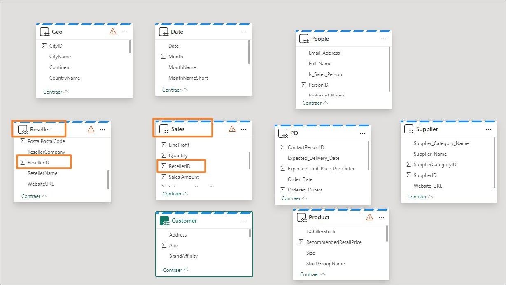

# Microsoft Fabric - Fabric Analyst in a Day - Übung 6


# Inhalt

- Einführung

- Lakehouse – Analysieren von Daten
    - Aufgabe 1: Daten mithilfe von SQL abfragen
    - Aufgabe 2: T-SQL-Ergebnis veranschaulichen

- Lakehouse – Semantische Modellierung
    - Aufgabe 3: Semantisches Modell erstellen
    - Aufgabe 4: Beziehungen erstellen
    - Aufgabe 5: Measures erstellen
    - Aufgabe 6: Fakultativer Abschnitt – Beziehungen erstellen
    - Aufgabe 7: Fakultativer Abschnitt – Measures erstellen

- Referenzen

 
# Einführung

Wir haben Daten aus verschiedenen Datenquellen im Lakehouse erfasst. In dieser Übung arbeiten Sie mit dem semantischen Modell. Üblicherweise werden Modellierungsarbeiten wie das Erstellen von Beziehungen, das Hinzufügen von Measures usw. in Power BI Desktop durchgeführt. Nun erfahren Sie, wie Sie diese Vorgänge im Dienst durchführen können.

Am Ende dieser Übung haben Sie Folgendes gelernt:

- Verwenden der SQL-Ansicht im SQL-Analyseendpunkt
- Ein semantisches Modell erstellen


# Lakehouse – Analysieren von Daten

## Aufgabe 1: Daten mithilfe von SQL abfragen

1. Navigieren wir nun zurück zum Fabric-Arbeitsbereich **FAIAD_\<Benutzername>**, den Sie in Übung 2, Aufgabe 9, erstellt haben.

2. Sie können bei Bedarf den **Aufgabenfluss minimieren**, um die vollständige Liste der Elemente anzuzeigen.

3. Sie sehen drei Arten von lh_FAIAD – Lakehouse, Semantikmodell und SQL-Endpunkt. In einer früheren Übung haben wir uns mit Lakehouse beschäftigt und Visual-Abfragen mithilfe des SQL- Analyseendpunkts erstellt. Wählen Sie die Option **lh_FAIAD SQL-Analyseendpunkt** aus, um diese Option weiter zu erkunden. Sie werden zur **SQL-Ansicht** des Explorers weitergeleitet.

   

   Wenn Sie sich die Daten vor der Erstellung eines Datenmodells genauer ansehen möchten, können Sie dies mit SQL tun. Für die Verwendung von SQL sind zwei Optionen verfügbar. Option eins ist die Visual-Abfrage, die wir in der vorherigen Übung verwendet haben. Option zwei ist das Schreiben von TSQL-Code. Dies ist eine entwicklerfreundliche Option. Untersuchen wir dies genauer.
 
   Angenommen, Sie möchten mithilfe von SQL schnell die von einem Lieferanten verkauften Einheiten ermitteln.

   Beachten Sie im linken Bereich von Lakehouse, dem SQL-Analyseendpunkt, dass die Tabellen angezeigt werden. Wenn Sie diese erweitern, sehen Sie die Spalten der Tabelle. Außerdem lassen sich SQL-Ansichten, Funktionen und gespeicherten Prozeduren erstellen. Wenn Sie bereits Erfahrung mit SQL haben, probieren Sie diese Optionen gerne aus. Schreiben wir nun eine einfache SQL- Abfrage.

4. Wählen Sie im **Menü oben** die Option **Neue SQL-Abfrage** aus, oder klicken Sie **links unten** auf **Abfrage**. Die Ansicht „SQL-Abfrage“ wird geöffnet.

   

5. Fügen Sie die unten **stehende SQL-Abfrage** in das **Abfragefenster** ein. Mit dieser Abfrage werden die Units by Supplierenname ermittelt. Dazu wird die Tabelle „Sales“ mit den Tabellen „Product“ und „Supplier“ verknüpft.

    ```
    SELECT su.SupplierName, SUM(Quantity) as Units
    FROM dbo.Sales s
    JOIN dbo.Product p on p.StockItemID = s.StockItemID
    JOIN dbo.Supplier su on su.SupplierID = p.SupplierID
    GROUP BY su.SupplierName
    ```

6. Klicken Sie im SQL-Editor-Menü auf **Ausführen**, um die Ergebnisse anzuzeigen.

7. Beachten Sie, dass die Abfrage mit der Option **Als Ansicht speichern** gespeichert werden kann.

8. Die Abfrage wird dann **links** im Bereich **Explorer** unter dem Abschnitt **Abfragen** unter **Meine Abfragen** als **SQL-Abfrage 1** gespeichert. So kann die Abfrage umbenannt und zur späteren Verwendung gespeichert werden. Es ist auch möglich, Abfragen anzuzeigen, die an Sie freigegeben wurden. Öffnen Sie dazu den Ordner **Freigegebene Abfragen**.
 
   **Hinweis:** Visual-Abfragen, die Sie in früheren Übungen erstellt haben, sind auch im Ordner „Meine Abfragen“ verfügbar.

   

## Aufgabe 2: T-SQL-Ergebnis veranschaulichen

1. Das Ergebnis der Abfrage kann auch bildlich veranschaulicht werden. **Markieren Sie die Abfrage** im Abfragebereich

2. Wählen Sie im Menü des Bereichs „Ergebnisse“ **Diese Daten erkunden (Vorschauversion) -> Ergebnisse visualisieren** aus.

   

3. Das Dialogfeld **Ergebnisse visualisieren** wird geöffnet. Wählen Sie **Weiter** aus.

   Das Dialogfeld **Ergebnisse visualisieren** wird geöffnet und ähnelt der Power BI Desktop - Berichtsansicht. Es umfasst alle in der Power BI Desktop-Berichtsansicht verfügbaren Funktionen. Sie können die Seite formatieren, verschiedene Visuals auswählen, Visuals formatieren, Filter hinzufügen usw. Wir werden uns in diesem Kurs nicht mit diesen Optionen beschäftigen.
 
4. Erweitern Sie den Bereich **Daten**, und erweitern Sie **SQL-Abfrage 1**.

5. Wählen Sie die Felder **Supplier_Name** und **Units** aus. Das Tabellenvisual wird erstellt.

    

6. Ändern Sie unter **Visualisierung** den Visualtyp durch Auswahl des **gestapelten Säulendiagramms**.

7. Wählen Sie unten rechts auf dem Bildschirm die Option **Als Bericht speichern** aus.

   

8. Das Dialogfeld „Bericht speichern“ wird geöffnet. Geben Sie im Textfeld Bericht benennen den Text **Units by Supplier** ein.

9. Überprüfen Sie, dass der Zielarbeitsbereich Ihrem Fabric-Arbeitsbereich **FAIAD_\<Benutzername>** entspricht.

10. Wählen Sie **Speichern** aus.

    

    Sie werden zum Bildschirm „SQL-Abfrage“ weitergeleitet.
 
# Lakehouse – Semantische Modellierung

## Aufgabe 3: Semantisches Modell erstellen

1. Wählen Sie im **unteren Bereich** die Option **Modell** aus. Sie werden feststellen, dass der mittlere Bereich wie die Modellansicht in Power BI Desktop aussieht.

    

   Hierbei handelt es sich um das Standardmodell, das vom Lakehouse erstellt wird. Beim Standardmodell gelten jedoch einige Einschränkungen (z. B. die Möglichkeit zum Formatieren von Kennzahlen usw.). Außerdem benötigen wir in unserem Modell nur eine Teilmenge der Tabellen. Wir erstellen also ein neues semantisches Modell.

2. Wählen Sie im Menü oben rechts **den Pfeil neben „SQL Analyseendpunkt“** aus.

3. Wählen Sie **Lakehouse**, um zur Lakehouse-Ansicht zu gelangen.

    

4. Wählen Sie im Menü **Start -> Neues semantisches Modell** aus.

5. Das Dialogfeld „Neues semantisches Modell“ wird geöffnet. Geben Sie **sm_FAIAD** als Name des semantischen Direct Lake-Modells ein.
 
6. Wir haben standardmäßig die Möglichkeit, eine Teilmenge der Tabellen auszuwählen. Denken Sie daran, dass wir in der vorherigen Übung Ansichten erstellt haben. Wir möchten diese Ansichten in das Modell einbeziehen. **Klicken Sie** auf das **Symbol** in der **Suchleiste**, und wählen Sie **Ansichten** **anzeigen** aus. Jetzt haben wir die Möglichkeit, Ansichten anzuzeigen und auszuwählen.

   

7. **Wählen Sie** die folgenden Tabellen/Ansichten aus:

    a. **Date**  
    
    b. **People**  
    
    c. **Customer**  
    
    d. **PO**  
    
    e. **Supplier**  
    
    f. **Geo**  
    
    g. **Reseller**  
    
    h. **Sales**  
    
    i. **Product**
 
8. Wählen Sie **Bestätigen** aus.

   

## Aufgabe 4: Beziehungen erstellen

Sie navigieren zum neuen semantischen Modell mit den ausgewählten Tabellen. Sie können die Tabellen bei Bedarf **Neu anordnen**. Beachten Sie, dass einige der Tabellen (Geo, Reseller, Sales und Product) oben rechts in der Tabelle ein Warnzeichen aufweisen. Dies liegt daran, dass es sich hierbei um Ansichten handelt. Alle mit Feldern aus diesen Ansichten erstellten Visuals befinden sich im Direct Query- und nicht im Direct Lake-Modus.

**Hinweis:** Der Direct Lake-Modus ist schneller als der Direct Query-Modus.

 

Das erste Schritt besteht darin, Beziehungen zwischen diesen Tabellen zu erstellen.

1. Erstellen wir jetzt eine Beziehung zwischen den Tabellen „Sales“ und „Reseller“. Wählen Sie in der Tabelle **Sales** den Eintrag **ResellerID** aus, und ziehen Sie ihn in der Tabelle **Reseller** auf den Eintrag **ResellerID**.

   

2. Das Dialogfeld „Neue Beziehung“ wird geöffnet. Vergewissern Sie sich, dass unter **Von Tabelle Sales** und bei **Spalte ResellerID** angegeben ist.

3. Vergewissern Sie sicher, dass unter **In Tabelle Reseller** und bei **Spalte ResellerID** angegeben ist.

4. Die **Kardinalität** lautet **n:1**.

5. Bei **Kreuzfilterrichtung** muss **Einfach** ausgewählt sein.

6. Wählen Sie **Speichern** aus.

   

7. Erstellen wir auf diese Weise auch eine Beziehung zwischen den Tabellen „Sales“ und „Date“. Wählen Sie in der Tabelle **Sales** den Eintrag **InvoiceDate** aus, und ziehen Sie ihn in der Tabelle **Date** auf den Eintrag **Date**.

8. Das Dialogfeld „Neue Beziehung“ wird geöffnet. Vergewissern Sie sich, dass unter **Von Tabelle Sales** und bei **Spalte InvoiceDate** angegeben ist.

9. Vergewissern Sie sich, dass unter **In Tabelle Date** und bei **Spalte Date** angegeben ist.

10. Die **Kardinalität** lautet n:1.

11. Bei **Kreuzfilterrichtung** muss **Einfach** ausgewählt sein.

12. Wählen Sie **Speichern** aus.

    

13. Erstellen Sie eine analog eine **n:1-Beziehung** zwischen den Tabellen **Sales** und **Product**. Wählen Sie in der Tabelle **Sales** den Eintrag **StockItemID** und in der Tabelle **Product** den Eintrag **StockItemID** aus.

    **Hinweis:** Alle unsere Aktualisierungen werden automatisch gespeichert.

    **Überprüfen Sie:** Das Modell muss die drei Beziehungen zwischen den Tabellen „Sales“ und „Reseller“,„Sales“ und „Date“ sowie „Sales“ und „Product“ aufweisen, wie im folgenden Screenshot gezeigt:

    

    Aus Zeitgründen können wir nicht alle Beziehungen erstellen. Sofern Zeit verbleibt, können Sie den fakultativen Abschnitt am Ende der Übung durcharbeiten. Darin werden die restlichen Beziehungen erstellt.

## Aufgabe 5: Measures erstellen

Ergänzen wir ein paar Kennzahlen, die zur Erstellung des Sales-Dashboards benötigt werden.

1. Wählen Sie in der Modellansicht die Tabelle **Sales** aus. Die Measures sollen in der Tabelle „Sales“ ergänzt werden.

2. Wählen Sie im Menü oben den Eintrag **Start -> Neues Measure** aus. Die Bearbeitungsleiste wird angezeigt.

3. Geben Sie in der **Bearbeitungsleiste Sales = SUM(Sales[Sales Amount])** ein.

4. Klicken Sie links neben der Bearbeitungsleiste auf das **Häkchen**, oder drücken Sie die **Eingabetaste**.

5. Erweitern Sie den Bereich „Eigenschaften“ rechts.

6. Erweitern Sie den Abschnitt **Formatierung**.

7. Wählen Sie in der Dropdown-Liste **Format** den Eintrag **Währung** aus.
 
8. Legen Sie Dezimalstellen auf **0** fest.

   

9. Wählen Sie bei Auswahl der Tabelle **Sales** im Menü oben die Option **Start -> Neues Measure** aus. Die Bearbeitungsleiste wird angezeigt.

10. Geben Sie dort **Units = SUM(Sales[Quantity])** ein.

11. Klicken Sie links neben der Bearbeitungsleiste auf das **Häkchen**, oder drücken Sie die **Eingabetaste**.

12. Erweitern Sie im Eigenschaftsfenster rechts den Abschnitt **Formatierung** (es kann einen Moment dauern, bis das Eigenschaftsfenster geladen wird).

13. Wählen Sie in der Dropdown-Liste **Format** den Eintrag **Ganze Zahl** aus.

14. Verwenden Sie den Schieberegler, um **Tausendertrennzeichen** auf **Ja** festzulegen.

    

15. Wählen Sie bei Auswahl der Tabelle **Sales** im Menü oben die Option **Start -> Neues Measure** aus. Die Bearbeitungsleiste wird angezeigt.
 
16. Geben Sie in der **Formularleiste Sales Orders = DISTINCTCOUNT(Sales[InvoiceID])** ein.

17. Klicken Sie links neben der Bearbeitungsleiste auf das **Häkchen**, oder drücken Sie die **Eingabetaste**.

18. Erweitern Sie im Eigenschaftsfenster rechts den Abschnitt **Formatierung**.

19. Wählen Sie in der Dropdown-Liste **Format** den Eintrag **Ganze Zahl** aus.

20. Verwenden Sie den Schieberegler, um **Tausendertrennzeichen** auf **Ja** festzulegen.

    

21. Wählen Sie im **Datenbereich** (rechts) die Option **Modell** aus. Beachten Sie, dass dadurch eine Ansicht bereitgestellt wird, in der Sie alle Elemente im semantischen Modell organisieren können.

22. Erweitern Sie **Semantisches Modell -> Kennzahlen**, um alle Kennzahlen anzuzeigen, die Sie gerade erstellt haben.

23. Sie können auch **einzelne Tabellen erweitern**, um die Spalten, Hierarchien und Kennzahlen in jeder einzelnen Tabelle anzuzeigen.

    

    Auch hier können wir aus Zeitgründen nicht alle Kennzahlen erstellen. Sofern Zeit verbleibt, können Sie den fakultativen Abschnitt am Ende der Übung durcharbeiten. Darin werden die restlichen Measures erstellt.

    Wir haben ein semantisches Modell erstellt, und der nächste Schritt besteht darin, einen Bericht zu erstellen. Dies erfolgt in der nächsten Übung.

## Aufgabe 6: Fakultativer Abschnitt – Beziehungen erstellen

Ergänzen wir die restlichen Beziehungen.

1. Wählen Sie im Menü Start > Beziehungen verwalten aus.

2. Das Dialogfeld „Beziehungen verwalten“ wird geöffnet. Wählen Sie Neue Beziehung aus.

    

3. Das Dialogfeld „Neue Beziehung“ wird geöffnet. Vergewissern Sie sich, dass unter **Von Tabelle Sales** und bei **Spalte SalespersonPersonID** angegeben ist.

4. Vergewissern Sie sich, dass unter **In Tabelle People** und bei **Spalte PersonID** angegeben ist.

5. Die **Kardinalität** lautet **n:1**.

6. Bei **Kreuzfilterrichtung** muss **Einfach** ausgewählt sein.

7. Wählen Sie **Speichern** aus. Das Dialogfeld „Beziehungen verwalten“ wird mit der neuen hinzugefügten Beziehung geöffnet.

    
 
8. Erstellen wir jetzt eine Beziehung zwischen den Tabellen „Product“ und „Supplier“. Wählen Sie **Neue Beziehung** aus.

9. Vergewissern Sie sich, dass unter **Von Tabelle Product** und bei **Spalte SupplierID** angegeben ist.

10. Vergewissern Sie sich, dass unter **In Tabelle Supplier** und bei **Spalte SupplierID** angegeben ist.

11. Die **Kardinalität** lautet **n:1**.

12. Bei **Kreuzfilterrichtung** muss **Beides** ausgewählt sein.

13. Wählen Sie **Speichern** aus.

    

14. Erstellen wir jetzt eine Beziehung zwischen den Tabellen „Reseller“ und „Geo“. Wählen Sie **Neue Beziehung** aus.

15. Das Dialogfeld „Neue Beziehung“ wird geöffnet. Vergewissern Sie sich, dass unter **Von Tabelle Reseller** und bei **Spalte PostalCityID** festgelegt ist.

16. Vergewissern Sie sich, dass unter **In Tabelle** auf **Geo** und Spalte auf **CityID** festgelegt ist.

17. Die **Kardinalität** lautet **n:1**.

18. Bei **Kreuzfilterrichtung** muss **Beides** ausgewählt sein.
 
19. Wählen Sie **Speichern** aus.

    

20. Erstellen Sie ebenso eine Beziehung zwischen den Tabellen „Customer“ und „Reseller“. Wählen Sie **Neue Beziehung** aus.

21. Das Dialogfeld „Neue Beziehung“ wird geöffnet. Vergewissern Sie sich, dass unter **Von Tabelle Customer** und bei **Spalte ResellerID** angegeben ist.

22. Vergewissern Sie sicher, dass unter **In Tabelle Reseller** und bei **Spalte ResellerID** angegeben ist.

23. Die **Kardinalität** lautet **n:1**.

24. Bei **Kreuzfilterrichtung** muss **Einfach** ausgewählt sein.

25. Wählen Sie **Speichern** aus.

    **Prüfpunkt:** „Beziehungen verwalten“ sollte so wie im Screenshot unten aussehen.

    

26. Erstellen Sie ebenso eine **n:1-Beziehung** zwischen den Tabellen **PO** und **Date**. Wählen Sie **Order_Date** aus **PO** und **Date** aus **Date** aus.

27. Erstellen Sie ebenso eine **n:1-Beziehung** zwischen den Tabellen PO und Product. Wählen Sie unter **PO** den Eintrag **StockItemID** und unter **Product** den Eintrag **StockItemID** aus.

28. Erstellen Sie ebenso eine **n:1-Beziehung** zwischen den Tabellen **PO** und **People**. Wählen Sie unter **PO** den Eintrag **ContactPersonID** und unter **People** den Eintrag **PersonID** aus.

29. Wählen Sie **Schließen** aus, um das Dialogfeld „Beziehungen verwalten“ zu schließen. Nun sind alle Beziehungen erstellt.

    **Überprüfen Sie:** Das Modell sollte so wie im Screenshot unten aussehen.

    

# Aufgabe 7: Fakultativer Abschnitt – Measures erstellen

Ergänzen wir die restlichen Measures.

1. Wählen Sie die Tabelle **Sales** und im oberen Menü **Start -> Neue Kennzahl** aus.

2. Geben Sie auf der Bearbeitungsleiste den Eintrag **Avg Order = DIVIDE([Sales], [Orders])** ein.

3. Klicken Sie links neben der Bearbeitungsleiste auf das **Häkchen**, oder drücken Sie die Eingabetaste.

4. Erweitern Sie den Bereich „Eigenschaften“ rechts.

5. Erweitern Sie den Abschnitt **Formatierung**.

6. Wählen Sie in der Dropdown-Liste **Format** den Eintrag **Währung** aus.
 
7. Legen Sie Dezimalstellen auf 0 fest.

   

8. Fügen Sie auf gleiche Weise die folgenden Measures hinzu:

    a. In der Tabelle **Sales, GM = SUM(Sales[LineProfit])** formatiert als**Währung mit 0 Dezimalstellen**.

    b. In der Tabelle **Sales, GM% = DIVIDE([GM], [Sales])** formatiert als **Prozentsatz mit 0 Dezimalstellen**.

    c. In der Tabelle **Sales, Sales YoY% = VAR __PREV_YEAR = CALCULATE([Sales], DATEADD('Date'[Date].[Date], -1, YEAR))RETURN DIVIDE([Sales] - __PREV_YEAR, __PREV_YEAR)** formatiert als **Prozentsatz mit 2 Dezimalstellen**.

    d. In der Tabelle **Customer , No of Customers = COUNTROWS(Customer)** formatiert als **Ganze Zahl mit aktiviertem Tausendertrennzeichen**.
 
## Referenzen
Bei Fabric Analyst in a Day (FAIAD) lernen Sie einige der wichtigsten Funktionen von Microsoft Fabric kennen. Im Menü des Dienstes finden Sie in der Hilfe (?) Links zu praktischen Informationen.

  

Nachfolgend finden Sie weitere Angebote zur weiteren Arbeit mit Microsoft Fabric.

- Die vollständige [Ankündigung der allgemeinen Verfügbarkeit von Microsoft Fabric](https://aka.ms/Fabric-Hero-Blog-Ignite23) finden Sie 
im Blogbeitrag.
- Fabric bei einer [interaktiven Vorstellung](https://aka.ms/Fabric-GuidedTour) kennenlernen
- Zur [kostenlosen Testversion von Microsoft Fabric](https://aka.ms/try-fabric) anmelden
- [Website von Microsoft Fabric](https://aka.ms/microsoft-fabric) besuchen
- Mit Modulen von [Fabric Learning](https://aka.ms/learn-fabric) neue Qualifikationen erwerben
- [Technische Dokumentation zu Fabric lesen](https://aka.ms/fabric-docs)
- [Kostenloses E-Book zum Einstieg in Fabric](https://aka.ms/fabric-get-started-ebook) lesen
- Mitglied der [Fabric-Community](https://aka.ms/fabric-community) werden, um Fragen zu stellen, Feedback zu geben und sich mit anderen auszutauschen

Lesen Sie die detaillierteren Blogs zur Ankündigung der Fabric-Umgebung:
- [Blog zum Data Factory-Funktionsbereich in Fabric](https://aka.ms/Fabric-Data-Factory-Blog)
- [Blog zum Data Engineering-Funktionsbereich von Synapse in Fabric](https://aka.ms/Fabric-DE-Blog)
- [Blog zum Data Science-Funktionsbereich von Synapse in Fabric](https://aka.ms/Fabric-DS-Blog)
- [Blog zum Data Warehousing-Funktionsbereich von Synapse in Fabric](https://aka.ms/Fabric-DW-Blog)
- [Blog zum Real-Time Analytics-Funktionsbereich von Synapse in Fabric](https://aka.ms/Fabric-RTA-Blog)
- [Blog mit Ankündigungen zu Power BI](https://aka.ms/Fabric-PBI-Blog)
- [Blog zum Data Activator-Funktionsbereich in Fabric](https://aka.ms/Fabric-DA-Blog)
- [Blog zu Verwaltung und Governance in Fabric](https://aka.ms/Fabric-Admin-Gov-Blog)
- [Blog zu OneLake in Fabric](https://aka.ms/Fabric-OneLake-Blog)
- [Blog zur Dataverse- und Microsoft Fabric-Integration](https://aka.ms/Dataverse-Fabric-Blog)


© 2023 Microsoft Corporation. Alle Rechte vorbehalten.

Durch die Verwendung der vorliegenden Demo/Übung stimmen Sie den folgenden Bedingungen zu: 

Die in dieser Demo/Übung beschriebene Technologie/Funktionalität wird von der Microsoft Corporation bereitgestellt, um Feedback von Ihnen zu erhalten und Ihnen Wissen zu vermitteln. Sie dürfen die Demo/Übung nur verwenden, um derartige Technologiefeatures und Funktionen zu bewerten und Microsoft Feedback zu geben. Es ist Ihnen nicht erlaubt, sie für andere Zwecke zu verwenden. Es ist Ihnen nicht gestattet, diese Demo/Übung oder einen Teil derselben zu ändern, zu kopieren, zu verbreiten, zu übertragen, anzuzeigen, auszuführen, zu vervielfältigen, zu veröffentlichen, zu lizenzieren, zu transferieren oder zu verkaufen oder aus ihr abgeleitete Werke zu erstellen.

DAS KOPIEREN ODER VERVIELFÄLTIGEN DER DEMO/ÜBUNG (ODER EINES TEILS DERSELBEN) AUF EINEN/EINEM ANDEREN SERVER ODER SPEICHERORT FÜR DIE WEITERE VERVIELFÄLTIGUNG ODER VERBREITUNG IST AUSDRÜCKLICH UNTERSAGT.

DIESE DEMO/ÜBUNG STELLT BESTIMMTE SOFTWARE-TECHNOLOGIE-/PRODUKTFEATURES UND FUNKTIONEN, EINSCHLIESSLICH POTENZIELLER NEUER FEATURES UND KONZEPTE, IN EINER SIMULIERTEN UMGEBUNG OHNE KOMPLEXE EINRICHTUNG ODER INSTALLATION FÜR DEN OBEN BESCHRIEBENEN ZWECK BEREIT. DIE TECHNOLOGIE/KONZEPTE IN DIESER DEMO/ÜBUNG ZEIGEN MÖGLICHERWEISE NICHT DAS VOLLSTÄNDIGE FUNKTIONSSPEKTRUM UND FUNKTIONIEREN MÖGLICHERWEISE NICHT WIE DIE ENDGÜLTIGE VERSION. UNTER UMSTÄNDEN VERÖFFENTLICHEN WIR AUCH KEINE ENDGÜLTIGE VERSION DERARTIGER FEATURES ODER KONZEPTE. IHRE ERFAHRUNG BEI DER VERWENDUNG DERARTIGER FEATURES UND FUNKTIONEN IN EINER PHYSISCHEN UMGEBUNG KANN FERNER ABWEICHEND SEIN.

**FEEDBACK**. Wenn Sie Feedback zu den Technologiefeatures, Funktionen und/oder Konzepten geben, die in dieser Demo/Übung beschrieben werden, gewähren Sie Microsoft das Recht, Ihr Feedback in jeglicher Weise und für jeglichen Zweck kostenlos zu verwenden, zu veröffentlichen
und gewerblich zu nutzen. Außerdem treten Sie Dritten kostenlos sämtliche Patentrechte ab, die erforderlich sind, damit deren Produkte, Technologien und Dienste bestimmte Teile einer
Software oder eines Dienstes von Microsoft, welche/welcher das Feedback enthält, verwenden oder eine Verbindung zu dieser/diesem herstellen können. Sie geben kein Feedback, das einem Lizenzvertrag unterliegt, aufgrund dessen Microsoft Drittparteien eine Lizenz für seine Software oder Dokumentation gewähren muss, weil wir Ihr Feedback in diese aufnehmen. Diese Rechte bestehen nach Ablauf dieser Vereinbarung fort.
 
DIE MICROSOFT CORPORATION LEHNT HIERMIT JEGLICHE GEWÄHRLEISTUNGEN UND GARANTIEN IN BEZUG AUF DIE DEMO/ÜBUNG AB, EINSCHLIESSLICH ALLER AUSDRÜCKLICHEN, KONKLUDENTEN ODER GESETZLICHEN GEWÄHRLEISTUNGEN UND GARANTIEN DER HANDELSÜBLICHKEIT, DER EIGNUNG FÜR EINEN BESTIMMTEN ZWECK, DES RECHTSANSPRUCHS UND DER NICHTVERLETZUNG VON RECHTEN DRITTER. MICROSOFT MACHT KEINERLEI ZUSICHERUNGEN BZW. ERHEBT KEINERLEI ANSPRÜCHE IM HINBLICK AUF DIE RICHTIGKEIT DER ERGEBNISSE UND DES AUS DER VERWENDUNG DER DEMO/ÜBUNG RESULTIERENDEN ARBEITSERGEBNISSES BZW. BEZÜGLICH DER EIGNUNG DER IN DER DEMO/ÜBUNG ENTHALTENEN INFORMATIONEN FÜR EINEN BESTIMMTEN ZWECK.

**HAFTUNGSAUSSCHLUSS**

Diese Demo/Übung enthält nur einen Teil der neuen Features und Verbesserungen in Microsoft Power BI. Einige Features können sich unter Umständen in zukünftigen Versionen des Produkts ändern. In dieser Demo/Übung erhalten Sie Informationen über einige, aber nicht über alle neuen Features.

