# Microsoft Fabric - Fabric Analyst in a Day - Übung 7


# Inhalt

- Einführung

- Power BI 

    - Aufgabe 1: Bericht automatisch erstellen

    - Aufgabe 2: Hintergrund für einen neuen Bericht konfigurieren 

    - Aufgabe 3: Dem Bericht eine Kopfzeile hinzufügen

    - Aufgabe 4: Dem Bericht KPIs hinzufügen

    - Aufgabe 5: Dem Bericht ein Liniendiagramm hinzufügen

    - Aufgabe 6: Den Bericht speichern

    - Aufgabe 7: Spalte „Year“ in der Tabelle „Date“ konfigurieren 

    - Aufgabe 8: Die Spalte „Month Name“ in der Tabelle „Date“ konfigurieren 

    - Aufgabe 9: Liniendiagramm formatieren 

    - Aufgabe 10: Power BI Desktop mit dem semantischen Modell verbinden 

    - Aufgabe 11: Neue Daten hinzufügen, um den Direct Lake-Modus zu simulieren 

- Übungsumgebung bereinigen

- Referenzen 

# Einführung  

Wir haben eine Einführung im Lakehouse erhalten, Daten aus verschiedenen Datenquellen in Lakehouse erfasst, einen Aktualisierungsplan für die Datenquellen festgelegt und ein Datenmodell erstellt. Jetzt erstellen wir einen Bericht. 

Inhalt dieser Übung:  

- So erstellen Sie einen Bericht automatisch 

- So erstellen Sie einen Bericht von einem leeren Canvas ausgehend 

- Einen Bericht mit Power BI Desktop erstellen 

- So erkunden Sie den Direct Lake-Modus, in dem Daten automatisch aktualisiert werden 

# Power BI 

## Aufgabe 1: Bericht automatisch erstellen 

Verwenden wir zunächst die Option „Bericht automatisch erstellen“. Und später in der Übung werden wir den Bericht, den wir in Power BI haben, neu erstellen. 


1. Wir navigieren zurück zum **Fabric-Arbeitsbereich,** den Sie in der vorherigen Übung erstellt haben. 

2. Wählen Sie unten links das Symbol **Fabric-Funktionsbereichs-Auswahl** aus. 

3. Das Dialogfeld „Fabric-Funktionsbereich“ wird geöffnet. Wählen Sie **Power BI** aus. Sie werden zur **Power BI-Startseite** weitergeleitet. 

   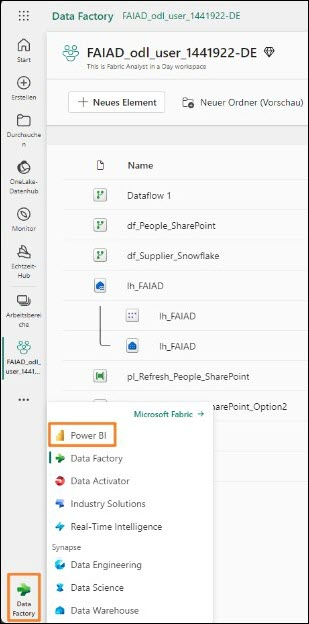

4. Wählen Sie **Neuer Bericht** aus dem oberen Menü aus. 

   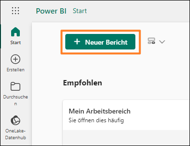

5. Sie werden zu **Erstellen Sie Ihren ersten Bericht** weitergeleitet. Dort sind Optionen verfügbar, um Berichte mit Excel oder CSV zu erstellen, Daten manuell einzugeben und ein veröffentlichtes semantisches Modell auszuwählen. In den vorherigen Übungen haben wir ein semantisches Modell erstellt. Lassen Sie uns das verwenden. Wählen Sie die Option **Veröffentlichtes Semantikmodell auswählen** aus. 

   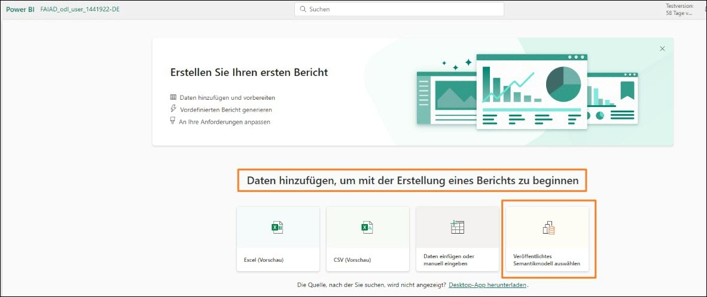

6. Die Seite „Ein in Ihrem Bericht zu verwendendes DataSet auswählen“ wird geöffnet. Beachten Sie, dass wir über vier Optionen verfügen. **Wählen Sie sm_FAIADaus**. 

    a. **sm_FAIAD**: Dies ist das semantische Modell, das wir erstellt haben und zum Erstellen des Berichts verwenden möchten. 

    b. **lh_FAIAD**: Dies ist das Lakehouse, in dem wir alle Daten erfasst haben. 

    c. **Units by Supplier**: Dies ist das DataSet, das wir mit T-SQL erstellt haben. 

    d. **DataflowsStagingWarehouse**: Dies ist das Staging Warehouse, das standardmäßig erstellt wird. Wir haben es nicht verwendet, da wir keine Daten bereitgestellt haben. 

    e. **DataflowsStagingLakehouse**: Dies ist das Staging Lakehouse, das standardmäßig erstellt wird. Wir haben es nicht verwendet, da wir keine Daten bereitgestellt haben. 

7. Klicken Sie auf den **Pfeil neben der Schaltfläche „Bericht automatisch erstellen“**. Beachten Sie, dass es zwei Optionen gibt: „Bericht automatisch erstellen“ und „Leeren Bericht erstellen“. Versuchen wir es mit der automatischen Erstellung. Wählen Sie daher **Bericht automatisch erstellen** aus. 

   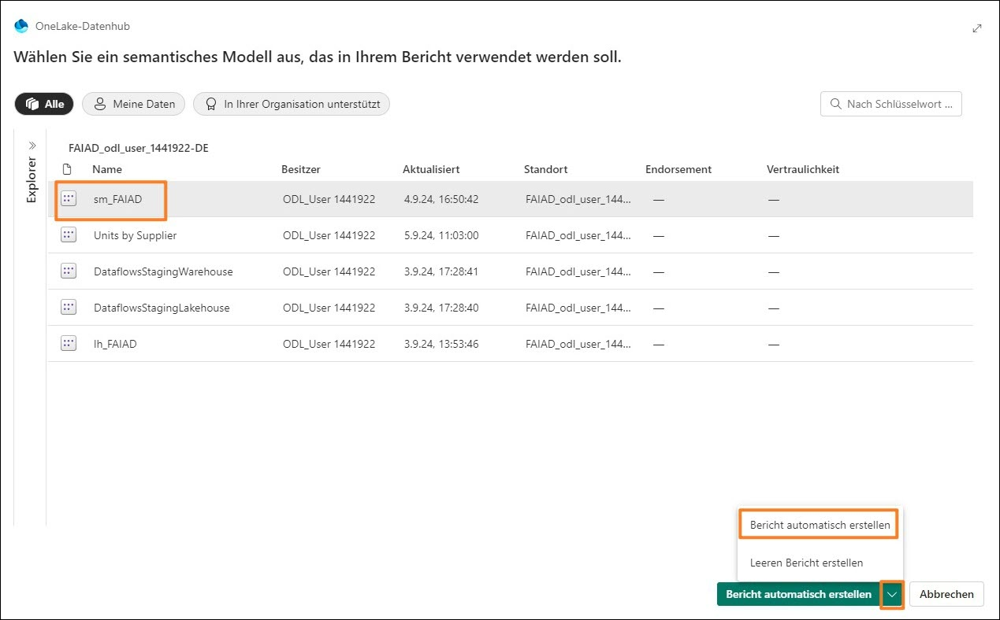

8. Power BI beginnt mit der automatischen Erstellung des Berichts. Beachten Sie, dass bei entsprechender Auswahl eine Option für die Vorauswahl verschiedener Daten vorhanden ist. Sobald der Bericht fertig ist, wird oben rechts auf dem Bildschirm ein Dialogfeld angezeigt. Wählen Sie **Bericht jetzt anzeigen, oder er wird in einigen Sekunden automatisch geladen** aus. 

   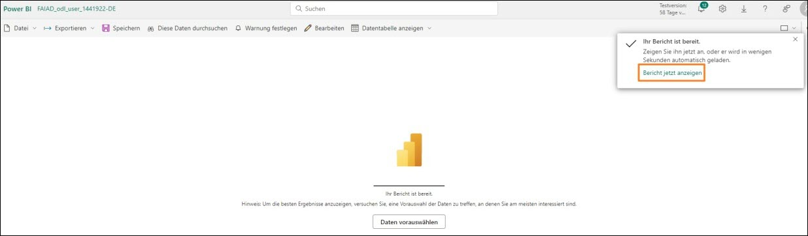

    **Prüfpunkt**: Sie erhalten einen Bericht, der wie im folgenden Screenshot aussieht. Es gibt einige KPIs und einige Trendvisualisierungen. Dies ist ein guter Ausgangspunkt, wenn Sie ein neues Modell analysieren und sofort starten müssen. 

    **Hinweis**: Im oberen Menü haben Sie die Möglichkeit, den Bericht zu bearbeiten oder einige der Daten als Tabellen anzuzeigen. Sehen Sie sich diese Optionen doch einmal genauer an. 

9. Speichern wir diesen Bericht. Wählen Sie im oberen Menü **Speichern** aus. 

10. Das Dialogfeld „Bericht speichern“ wird geöffnet. Geben Sie dem Bericht den Namen **rpt_Sales_Auto_Report**.  

    **Hinweis**: Wir stellen dem Berichtsnamen das Präfix „rpt“ voran, was für „Bericht“ steht. 

11. Stellen Sie sicher, dass der Bericht in Ihrem Arbeitsbereich **FAIAD_\<Benutzername>** gespeichert wird. 

12. Wählen Sie **Speichern** aus. 

    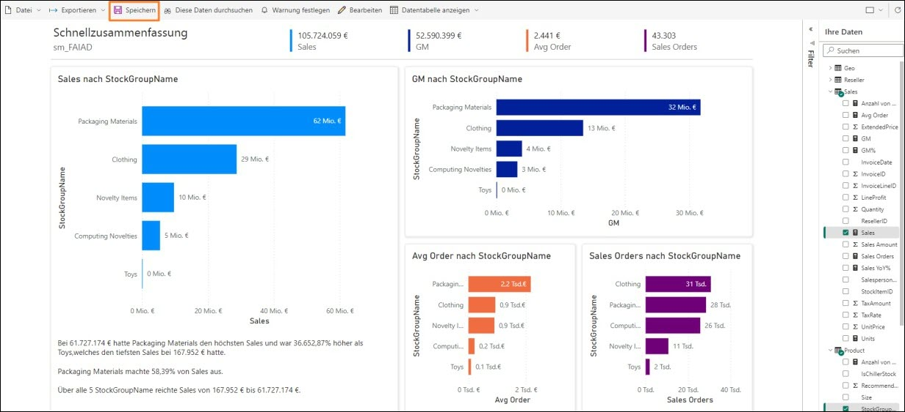

    **Hinweis**: Der automatisch erstellte Bericht kann für Sie anders aussehen, da er „automatisch erstellt“ wird. Dies hängt auch von den Beziehungen und Kennzahlen ab, die Sie in der vorangegangenen Übung (Übung 6) erstellt haben.  

    Der Screenshot oben zeigt, wie der automatisch erstellte Bericht aussehen **könnte**, wenn Sie alle Beziehungen und Kennzahlen einschließlich der optionalen Beziehungen (Übung 6) erstellt haben. 

    Der Screenshot unten zeigt, wie der automatisch erstellte Bericht aussehen **könnte**, wenn Sie die Erstellung der optionalen Beziehungen und Kennzahlen (Übung 6) übersprungen haben. 

    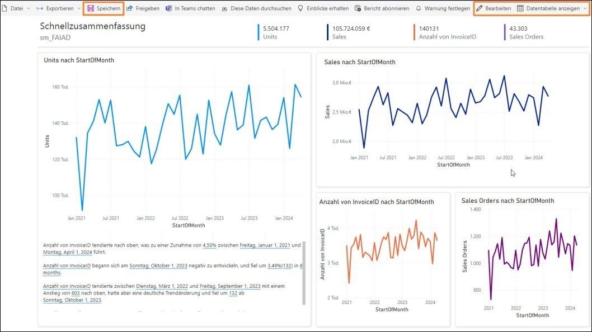

## Aufgabe 2: Hintergrund für einen neuen Bericht konfigurieren 

Lassen Sie uns einen neuen Bericht mit einer leeren Canvas erstellen. 

1. Wählen Sie im **linken Bereich** den Namen Ihres Arbeitsbereichs, **FAIAD_\<Benutzername>**, aus, um zum Arbeitsbereich zu gelangen. 

2. Wählen Sie im oberen Menü **Neu -> Bericht** aus. Sie werden zur Seite „Erstellen Sie Ihren ersten Bericht” weitergeleitet. 

   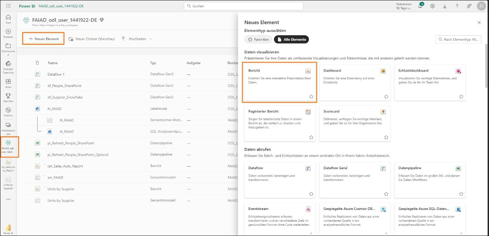

3. Wählen Sie **Veröffentlichtes Semantikmodell auswählen** aus, damit wir das von uns erstellte Modell auswählen können. 

   

4. Das Dialogfeld „Ein in Ihrem Bericht zu verwendendes Semantikmodell auswählen“ wird geöffnet. Wählen Sie **sm_FAIAD** aus. 

5. Klicken Sie auf den **Pfeil neben der Schaltfläche „Bericht automatisch erstellen“**. Wählen Sie **Leeren Bericht erstellen** aus. Sie werden zu einer Berichtsseite weitergeleitet, die der Power BI Desktop-Berichtsseite ähnelt. 

     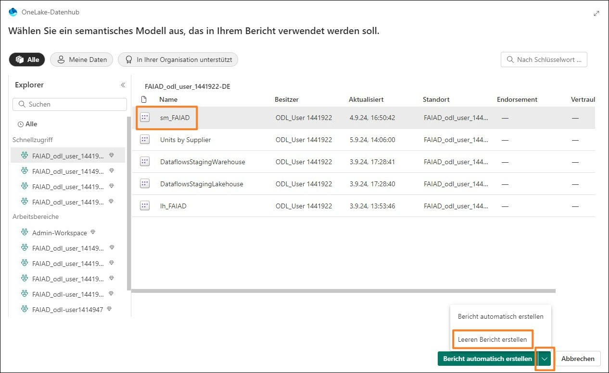

6. Öffnen Sie **FAIAD.pbix** im Ordner **Reports** auf dem **Desktop** Ihrer Übungsumgebung, falls dies noch nicht erfolgt ist. 

   Wir werden diesen Bericht als Referenz verwenden. Wir fügen zunächst den Canvashintergrund hinzu. Wir erstellen die Berichtskopfzeile, fügen einige KPIs hinzu und erstellen das Liniendiagramm „Verkäufe im Laufe der Zeit“. Aus Zeitgründen und davon ausgehend, dass Sie bereits Erfahrung mit der Erstellung von Visuals Power BI Desktop haben, werden wir nicht alle Visuals erstellen.  

   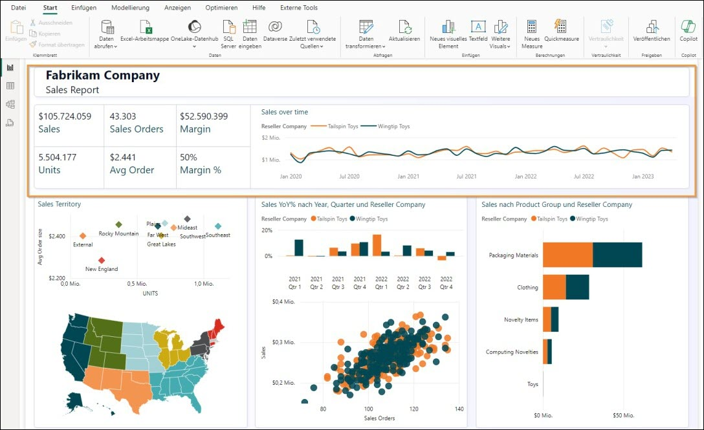

7. Navigieren Sie zurück zum **Power BI-Canvas** in Ihrem Browser. 

8. Wählen Sie im Visualisierungsbereich das **Symbol** für die **Formatseite** aus. 

9. Erweitern Sie den **Abschnitt „Canvas-Hintergrund“**. 

10. Wählen Sie **Durchsuchen** über die Option **Bild** aus. Das Dialogfeld „Datei-Explorer“ wird geöffnet. 

11. Navigieren Sie auf dem **Desktop** Ihrer Übungsumgebung zum Ordner **Reports**. 

12. Wählen Sie **Summary Background.png** aus. 

13. Wählen Sie im Dropdownmenü **Bild anpassen** den Eintrag **Anpassen** aus. 

14. Legen Sie die Transparenz auf **0 %** fest. 

    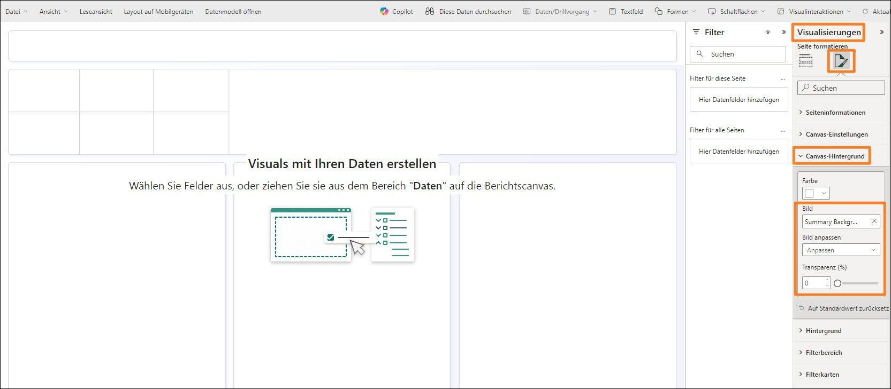

## Aufgabe 3: Dem Bericht eine Kopfzeile hinzufügen 

1. Wir fügen nun die Kopfzeile am oberen Rand hinzu. Wählen Sie im **Menü** die Option **Textfeld** aus. 

2. Geben Sie **Fabrikam Company** als erste Zeile in das Textfeld ein. 

3. Geben Sie als zweite Zeile **Sales Report** in das Textfeld ein. 

4. Markieren Sie **Fabrikam Company**, und legen Sie **Schriftart** auf **Segoe UI** und **Schriftgröße** auf **18, Fett**  fest. 

5. Markieren Sie **Sales Report**, und legen Sie **Schriftart** auf **Segoe UI** und **Schriftgröße** auf **14** fest. 

6. Erweitern Sie bei **ausgewähltem Textfeld** im Bereich „Textfeldformat“ rechts die Option **Effekte**. 

7. Verwenden Sie den Schieberegler **Hintergrund**, um ihn auf **Aus** festzulegen. 

8. Passen Sie die Größe des **Textfelds so an, dass es in den oberen Rand passt**. 

   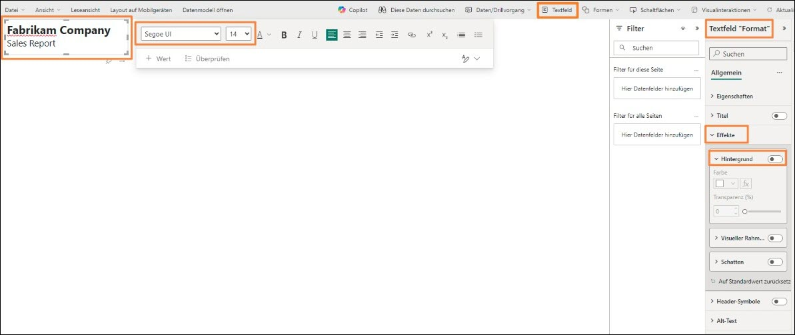

## Aufgabe 4: Dem Bericht KPIs hinzufügen 

1. Fügen wir nun Verkauf-KPI hinzu. Wählen Sie den **Leerraum** im Canvas aus, um den Fokus vom Textfeld zu entfernen. 

2. Wählen Sie im **Abschnitt Visualisierungen** die Option **Mehrzeiliges Kartenvisual** aus. 

3. Erweitern Sie im **Abschnitt „Daten“** die **Tabelle Sales**. 

4. Wählen Sie **Kennzahl „Sales“** aus. 

   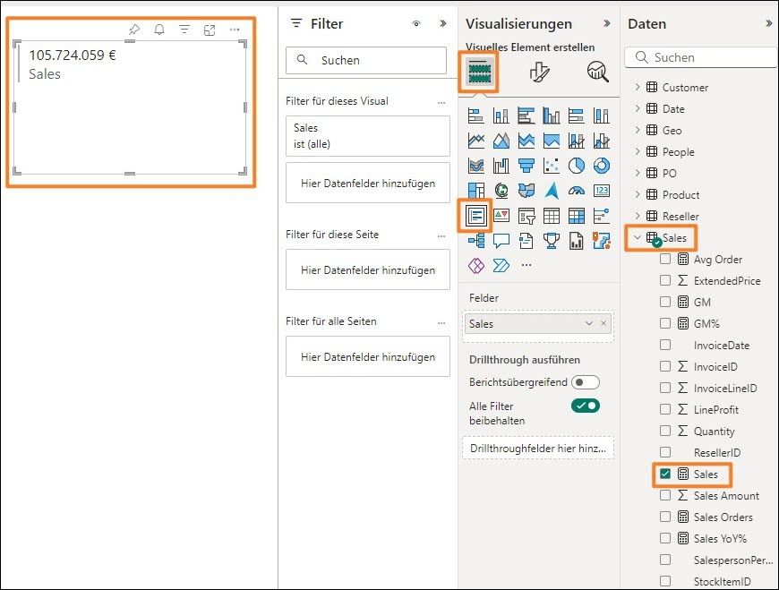

5. Wenn das **mehrzeilige Kartenvisual ausgewählt ist**, wählen Sie das **Symbol „Visual formatieren“** im Abschnitt „Visualisierungen“ aus. 

6. Erweitern Sie den Abschnitt **Kategoriebeschriftungen** aus. 

7. Erhöhen Sie die **Schriftgröße** auf **14**. 

8. Wählen Sie das **Dropdownmenü „Farbe“** aus. Das Dialogfeld „Farbpalette“ wird geöffnet. 

9. Wählen Sie **Mehr Farben** aus. 

10. Legen Sie den HEX-Wert auf **#004753** fest. 

    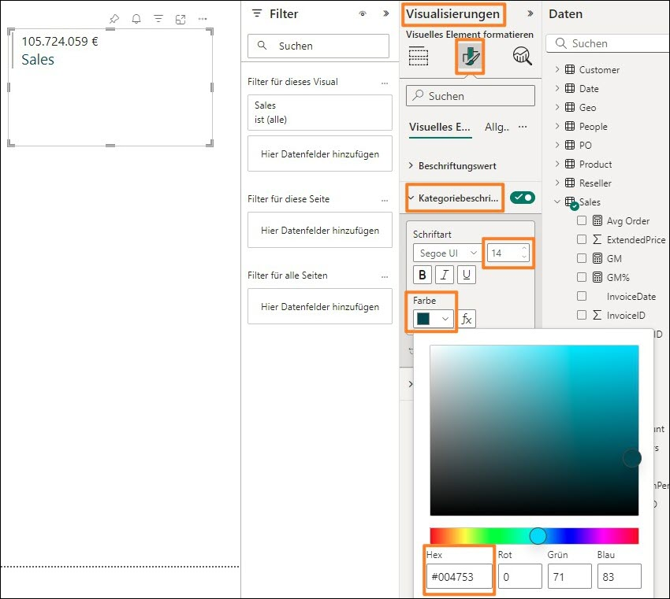

11. Erweitern Sie den Abschnitt **Karten**. 

12. Verwenden Sie den Schieberegler **Akzentleiste**, um ihn auf **Aus** festzulegen. 

    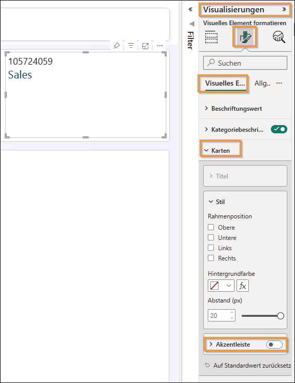

13. Wählen Sie im Visualisierungsbereich **Allgemein** aus. 

14. Erweitern Sie den **Abschnitt „Effekte“**. 

15. Verwenden Sie den Schieberegler **Hintergrund**, um ihn auf **Aus** festzulegen. 

16. Ändern Sie die Größe des **Visuals**, und verschieben Sie es in das **linke Feld, wie im Screenshot dargestellt**. 

    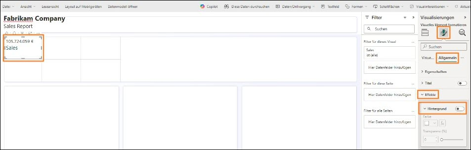

17. Fügen wir nun einen weiteren KPI hinzu. Wählen Sie die soeben erstellte **mehrzeilige Sales-Karte** aus. **Kopieren Sie** das Visual, indem Sie **STRG+C** auf Ihrer Tastatur auswählen. 

18. Fügen Sie das Visual ein, indem Sie STRG+V auf Ihrer Tastatur auswählen. Beachten Sie, dass das Visual in das Canvas eingefügt wird. 

19. Wenn das neue **Visual hervorgehoben ist**, entfernen Sie im Abschnitt **Visualisierungsbereich -> Visual erstellen -> Felder** die Kennzahl **Sales**. 

20. Erweitern Sie im Abschnitt **Daten** die Tabelle **Sales**, und wählen Sie die Kennzahl **Units** aus. 

21. Ändern Sie die Größe des **Visuals** und **platzieren Sie es im Feld unter dem Sales-Visual**. 

    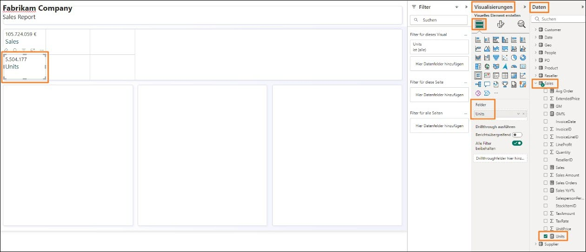

## Aufgabe 5: Dem Bericht ein Liniendiagramm hinzufügen 

Lassen Sie uns ein Liniendiagramm erstellen, um Sales im Zeitverlauf nach Reseller Company zu visualisieren. 

1. Wählen Sie den **Leerraum** im Canvas aus, um den Fokus vom mehrzeiligen Kartenvisual zu entfernen. 

2. Wählen Sie im **Abschnitt Visualisierungen** die Option **Liniendiagramm** aus. 

3. Erweitern Sie im **Abschnitt „Daten“** die Tabelle **Date**. 

4. Wählen Sie das Feld **Year** aus. Beachten Sie, dass „Year“ standardmäßig summiert und der Y-Achse hinzugefügt wird. Lassen Sie uns dies korrigieren. 

   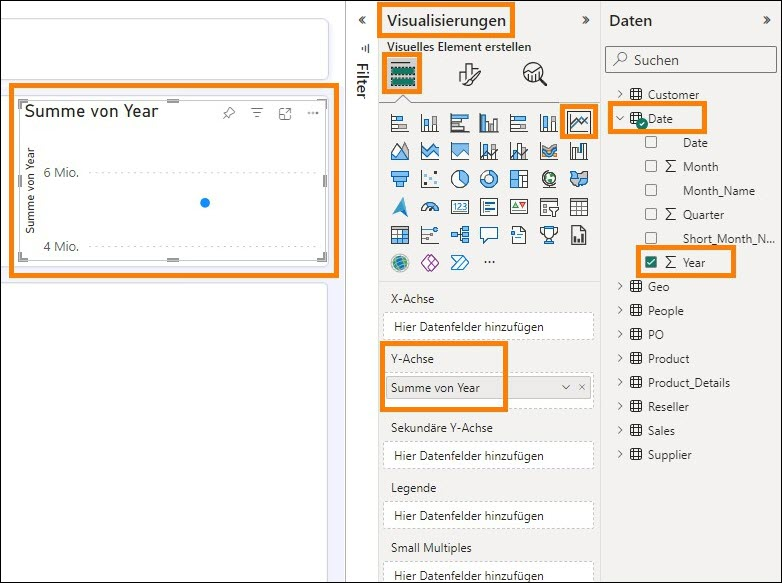

## Aufgabe 6: Den Bericht speichern 

Speichern wir den Bericht, bevor wir ihn verlassen, um Änderungen am Modell vorzunehmen.  

1. Wählen Sie im Menü **Datei -> Speichern** aus. 

2. Das Dialogfeld „Bericht speichern“ wird geöffnet. Geben Sie dem Bericht den Namen **rpt_Sales_Report**.  

   **Hinweis:** Wir stellen dem Berichtsnamen das Präfix „rpt“ voran, was für „Bericht“ steht. 

3. Stellen Sie sicher, dass der Bericht im Arbeitsbereich **FAIAD_\<Benutzername>** gespeichert wird. 

4. Wählen Sie **Speichern** aus. Beachten Sie, dass der Bericht gespeichert ist und Sie sich im Anzeigemodus befinden. 

   

## Aufgabe 7: Spalte „Year“ in der Tabelle „Date“ konfigurieren 

1. Wählen Sie im **oberen Menü** die Option **Bearbeiten** aus, um zum Bearbeitungsmodus zurückzukehren. 

2. Wählen Sie im **oberen Menü Datenmodell öffnen** aus. Beachten Sie, dass das semantische Modell in einem neuen Browserfenster bzw. einer neuen Browser-Registerkarte geöffnet wird. 

   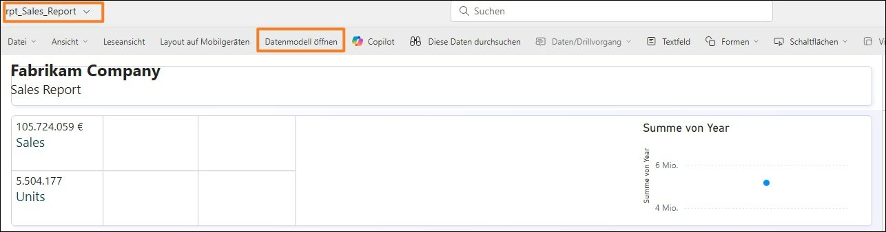

3. Wählen Sie im Bereich **Daten auf der rechten Seite „** Tabellen“ aus. 

4. Erweitern Sie die Tabelle **Date**. 

5. Wählen Sie die Spalte **Year** aus. 

6. Erweitern Sie im Bereich **Eigenschaften** rechts den Abschnitt **Erweitert**. 

7. Wählen Sie aus der Dropdownliste **Zusammenfassen nach** den Eintrag **Keine** aus. 

   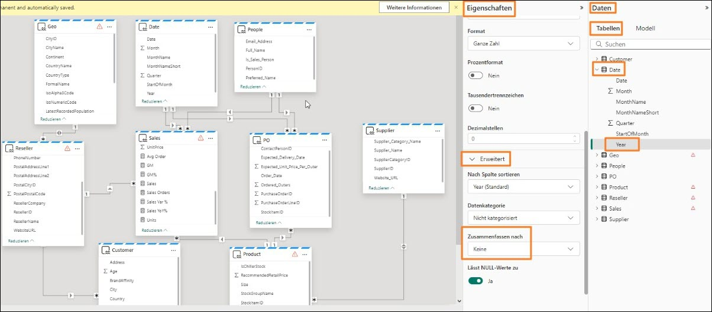

8. Navigieren zum/zur **Berichtsfenster/-registerkarte** des Browsers. 

9. Erweitern Sie im **Datenbereich** rechts die Tabelle **Date**. Beachten Sie, dass „Year“ kein Summierungsfeld ist. 

10. Wenn das **Visual „Liniendiagramm“ ausgewählt ist, entfernen Sie „Sum of Year“** von der Y-Achse. 

11. Wählen Sie das Feld **Year** aus, sodass es der **X-Achse** hinzugefügt wird. 

12. Erweitern Sie die Tabelle **Sales**, und wählen Sie die **Kennzahl „Sales“** aus. 

    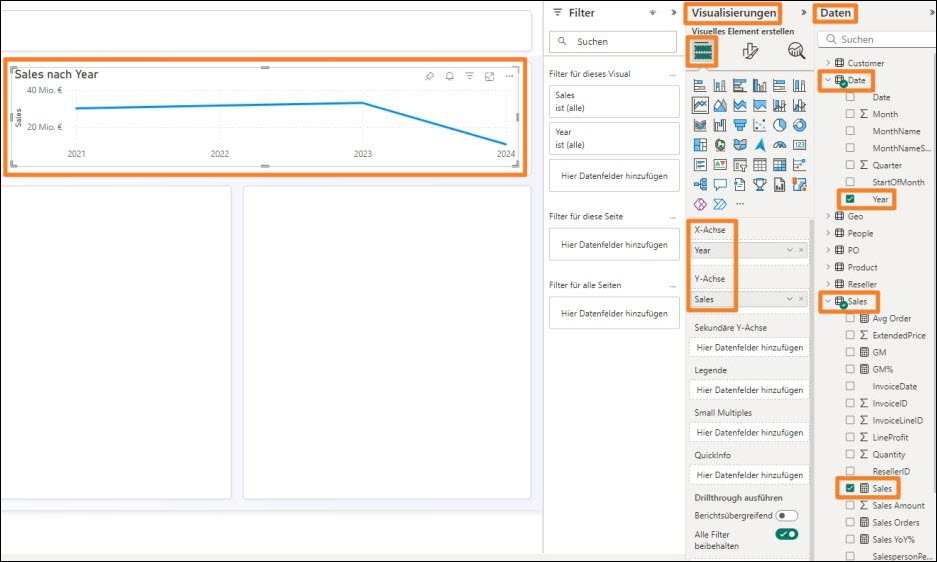

## Aufgabe 8: Die Spalte „Month Name“ in der Tabelle „Date“ konfigurieren 

1. Fügen wir diesem Diagramm „Monat“ hinzu. Ziehen Sie das Feld **MonthNameShort** unter **Year** aus der Tabelle „Date“ in die **X-Achse**. Nun sortieren wir es nach **MonthNameShort**. 

2. Wählen Sie die **Auslassungspunkte (…)** oben rechts im Visual aus. 

3. Wählen Sie **Sortierachse -> Year Short_Month_Name** aus. 

4. Wählen Sie die **Auslassungspunkte (…)** oben rechts im Visual aus. 

5. Wählen Sie **Sortierachse -> Aufsteigend sortieren** aus. 

   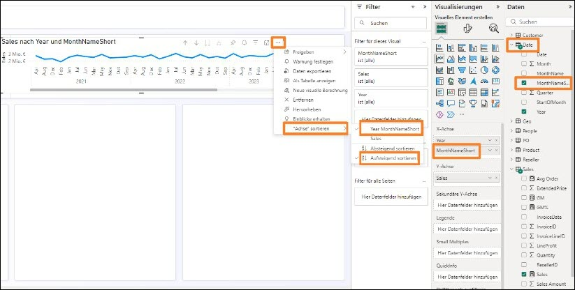

   **Hinweis:** Die Monate sind alphabetisch sortiert. Lassen Sie uns dieses Problem beheben. 

   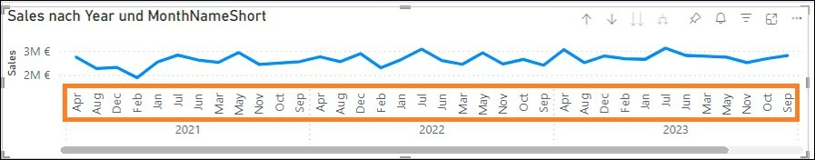

6. Navigieren Sie zurück zum/zur **Browserfenster/-registerkarte,** in dem/auf der Sie das semantische Modell geöffnet haben. 

7. Erweitern Sie im Bereich **Daten** die Tabelle **Date**. 

8. Wählen Sie die Spalte **MonthNameShort** aus. 

9. Erweitern Sie im Bereich **Eigenschaften** rechts den Abschnitt **Erweitert**. 

10. Wählen Sie im Dropdownmenü **Nach Spalte sortieren** den Eintrag **Monat** aus. 

     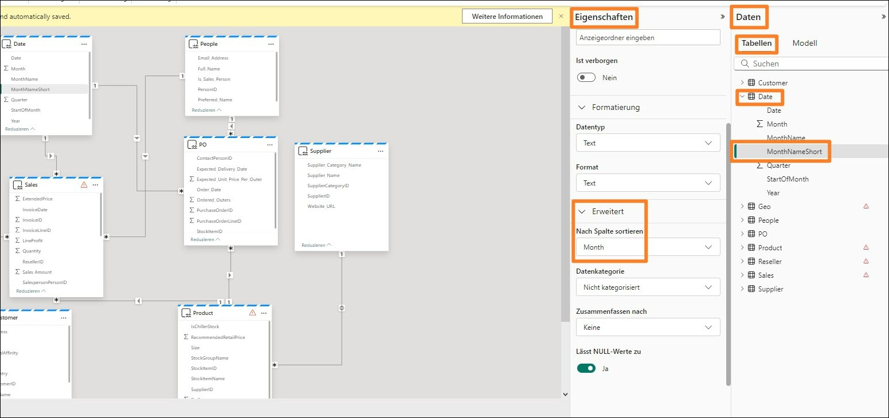

11. Navigieren zum/zur **Berichtsfenster/-registerkarte** des Browsers. Beachten Sie, dass die Monate jetzt richtig sortiert sind. 

     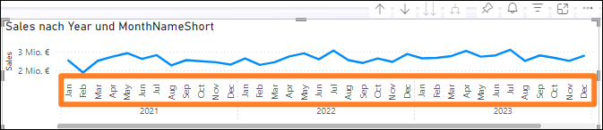

## Aufgabe 9: Liniendiagramm formatieren 

Beachten Sie, wie einfach es ist, das semantische Modell beim Erstellen der Berichte zu aktualisieren. Daraus ergibt sich eine nahtlose Interaktion wie Power BI Desktop. 

1. Wenn das **Visual „Liniendiagramm“ ausgewählt ist**, erweitern Sie im Abschnitt **Daten** die Tabelle **Reseller**. 

2. Ziehen Sie das Feld **Reseller -> Reseller Company** in den Abschnitt **Legende**. 

   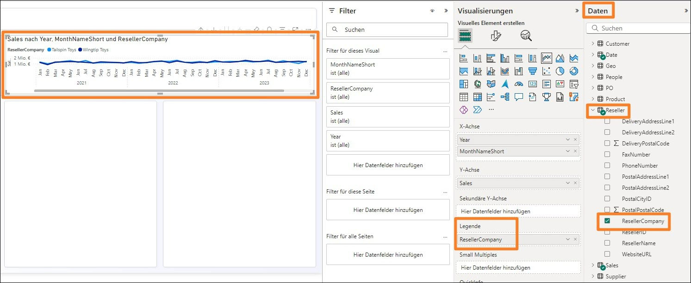

3. Wenn das **Visual „Liniendiagramm“ ausgewählt ist,** wählen Sie im Abschnitt **Visualisierung** das **Symbol „Visual formatieren“ -> Allgemein** aus. 

4. Erweitern Sie den Abschnitt **Titel**. 

5. Legen Sie den **Titeltext** auf **Verkäufe im Zeitverlauf** fest. 

6. Erweitern Sie den Abschnitt **Effekte**. 

7. Verwenden Sie den Schieberegler **Hintergrund**, um ihn auf **Aus** festzulegen. 

   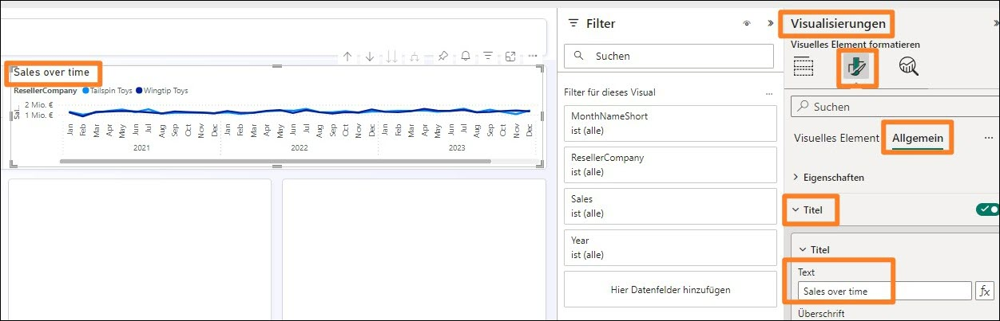

8. Wählen Sie im Abschnitt **Visualisierung Symbol „Visual formatieren“ -> Visual** aus. 

9. Erweitern Sie den Abschnitt **Linien**. 

10. Wählen sie im Dropdownmenü **Einstellungen anwenden auf -> Serie** die Option **Tailspin Toys** aus. 

11. Erweitern Sie den Abschnitt **Farben**. 

12. Legen Sie **Farbe** auf **#F17925** fest. 

13. Wählen sie im Dropdownmenü **Einstellungen anwenden auf -> Serie** die Option **Wingtip Toys** aus. 

14. Legen Sie **Farbe** auf **#004753** fest. 

15. Ändern Sie die Größe des **Visuals**, und verschieben Sie es in das **obere rechte Feld, wie im Screenshot dargestellt**. 

16. Scrollen Sie im Visual nach rechts und **beachten Sie, dass Daten bis April 2024 verfügbar sind**. 

    

17. Lassen Sie uns den Bericht speichern, indem wird im Menü **Datei -> Speichern** auswählen. 

    Wie bereits erwähnt, werden wir nicht alle Visuals in dieser Übung erstellen. Sie können nach Belieben weitere Visuals erstellen.  

## Aufgabe 10: Power BI Desktop mit dem semantischen Modell verbinden 

Sehen wir uns nun an, wie einfach es ist, Power BI Desktop mit dem semantischen Modell zu verbinden und Visuals zu erstellen. 

1. Öffnen Sie in der Übungsumgebung auf dem **Desktop** im Ordner **Reports** die Datei **FAIADTemplate.pbix**. 

2. Wählen Sie im Menüband **Start -> OneLake-Daten-Hub -> Semantische Power BI-Modelle** aus. 

   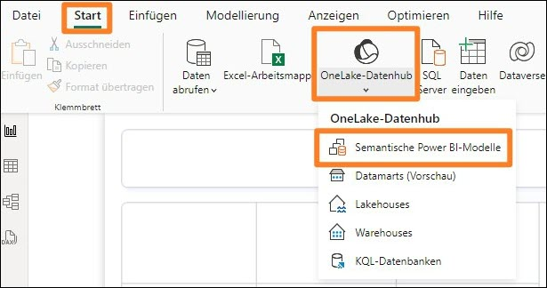

3. Das Dialogfeld „OneLake Data Hub“ wird geöffnet. Wählen Sie **sm_FAIAD**, das semantische Modell, das wir erstellt haben, aus. 

4. Wählen Sie **Verbinden** aus. Beachten Sie, dass sich die Tabellen aus dem semantischen Modell im Datenbereich befinden. 

    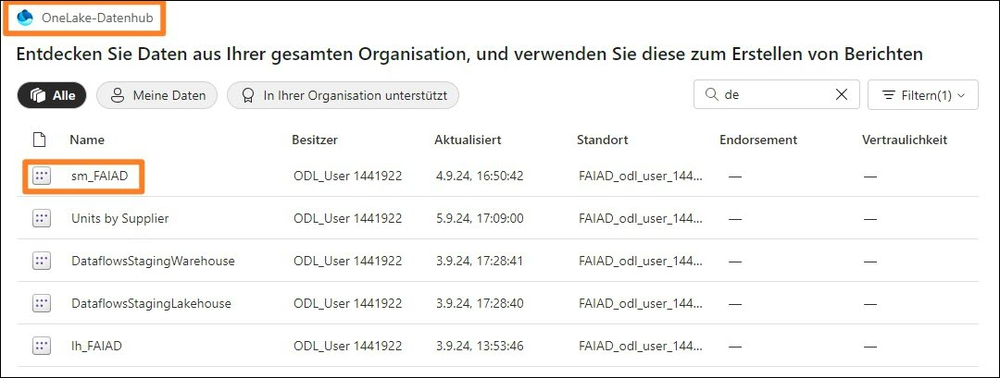

5. Wählen Sie im **linken Bereich** die Option **Modellansicht** aus. Beachten Sie, dass wir die Beziehung zwischen Tabellen anzeigen können. 

    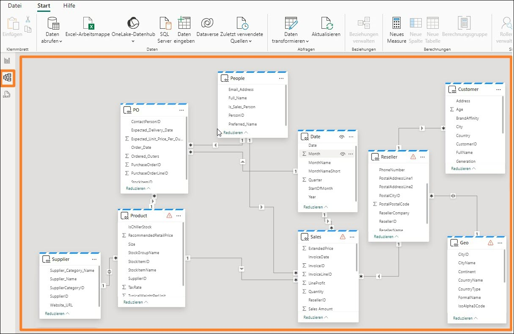

6. Wählen Sie im linken Bereich die Option Berichtsansicht aus, um zur Berichtsansicht zurückzukehren. 

7. Öffnen Sie **FAIAD.pbix** im Ordner **Reports** auf dem **Desktop** Ihrer Übungsumgebung, falls dies noch nicht erfolgt ist. 

8. Wählen Sie **Visual für Berichtstitel** aus. 

9. Klicken Sie im Menüband **Start > Kopieren** aus. 

   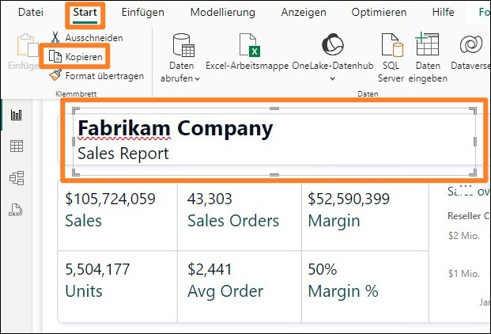

10. Navigieren Sie zu **FAIADTemplate.pbix** , und wählen Sie die Berichtscanvas aus. 

11. Klicken Sie im Menüband auf **Home > Einfügen**. 

    

12. Kopieren Sie auf dieselbe Weise die **KPIs für Verkäufe und Einheiten,** und fügen Sie sie ein. Zu Ihrer Information: Es können mehrere Visuals zusammen kopiert und eingefügt werden. 

    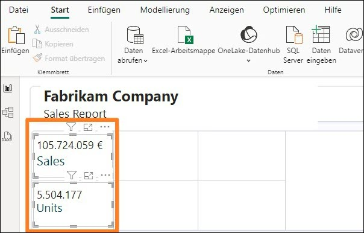

     Beachten Sie, dass es einfach ist, Visuals aus einem vorhandenen Bericht zu kopieren und in einen Bericht einzufügen, der eine Verbindung zum semantischen Modell herstellt. Beachten Sie, dass die Tabellen-, Spalten- und Kennzahlennamen identisch sein müssen, damit das Kopieren und Einfügen funktioniert. Wenn sie nicht identisch sind, liegt möglicherweise ein Fehler vor, der sich jedoch leicht beheben lässt. 

13. Navigieren Sie zu **FAIAD.pbix** , und wählen Sie das Liniendiagramm „Verkäufe im Laufe der Zeit“ aus. 

14. Klicken Sie im Menüband **Start > Kopieren** aus. 

15. Navigieren Sie zu **FAIADTemplate.pbix** , und wählen Sie die Berichtscanvas aus. 

16. Klicken Sie im Menüband auf **Home > Einfügen**. Beachten Sie, dass das Visual nicht gerendert wird. Dies liegt daran, dass das semantische Modell derzeit keine Hierarchie aus dem Date-Feld erstellt. 

17. Lassen Sie uns dieses Problem beheben. Löschen Sie im Bereich **Visualisierung** unter **X-Achse StartOfMonth**. 

    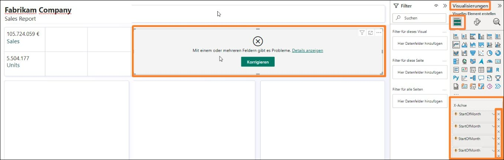

18. Erweitern Sie im **Datenbereich** die Tabelle **Date**. 

19. Ziehen Sie das Feld **StartOfMonth** in die **X-Achse**. Dadurch wird das visuelle Problem behoben. Sie müssen das Visual möglicherwiese formatieren. 

    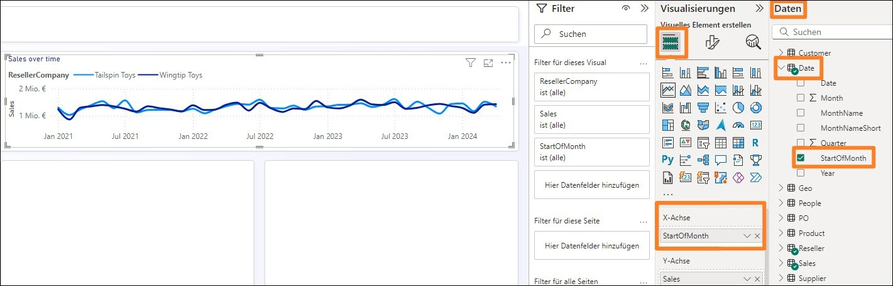

20. Lassen Sie uns den Bericht speichern, indem wird im Menüband **Datei -> Speichern** auswählen. 

## Aufgabe 11: Neue Daten hinzufügen, um den Direct Lake-Modus zu simulieren 

Normalerweise müssen wir im Import-Modus, sobald die Daten in der Quelle aktualisiert wurden, das Power BI-Modell aktualisieren, woraufhin die Daten im Bericht aktualisiert werden. Im Direct Query-Modus sind die Daten im Power BI-Bericht verfügbar, nachdem sie in der Quelle aktualisiert wurden. Der Direct Query-Modus ist in der Regel jedoch langsam. Um dieses Problem zu beheben, hat Microsoft Fabric den Direct Lake-Modus eingeführt. Direct Lake ermöglicht das schnelle Laden der Daten aus dem Lake direkt in das Power BI-Modul, wo sie für die Analyse bereit sind.  

Lassen Sie uns das Szenario untersuchen, in dem Daten in ADLS Gen2 aktualisiert werden und die Änderungen sofort im Power BI-Bericht angezeigt werden, ohne dass Aktualisierungen ausgeführt werden müssen. 

In einem realen Szenario werden die Daten an der Quelle aktualisiert. Da wir uns in einer Schulungsumgebung befinden, werden wir dies simulieren. Wir verfügen über Verkaufsdaten bis April 2024. Fügen wir nun Verkaufsdaten für Mai 2024 hinzu, indem wir eine Verknüpfung zur Datei vom Mai 2024 in ADLS Gen2 erstellen und die Ansicht „Sales“ aktualisieren. 

1. Navigieren Sie zurück zum **Browser**. 

2. Wählen Sie in der linken Menüleiste **FAIAD_\<Benutzername>** aus, um zur Startseite des Arbeitsbereichs zu wechseln. 

3. Wählen Sie **lh_FAIAD** aus, um zum Lakehouse zu navigieren. 

   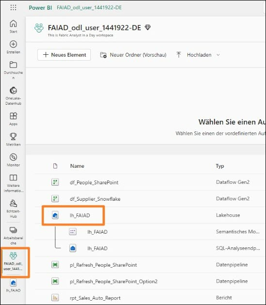

4. Wählen Sie im **Explorer-Bereich** auf der linken Seite die **Auslassungspunkte** neben **Tabellen** aus. 

5. Wählen Sie **Neue Verknüpfung** aus. 

   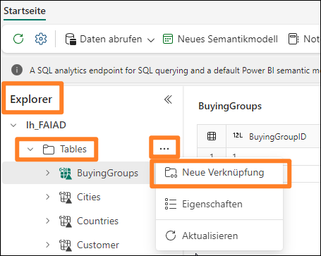

6. Das Dialogfeld „Neue Verknüpfung“ wird geöffnet. Wählen Sie unter **Externe Quellen Azure Data Lake Storage Gen2** aus. 

   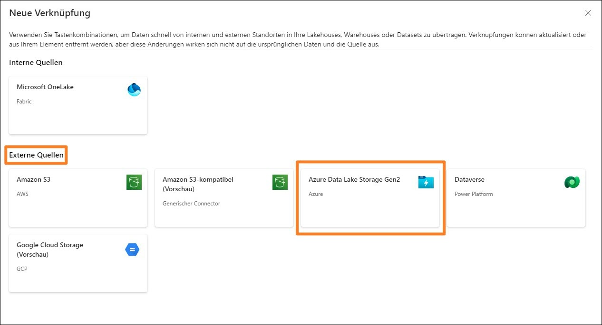

7. Geben Sie unter Verbindungseinstellungen -> URL diesen Link https://stvnextblobstorage.dfs.core.windows.net/fabrikam-sales. 

8. Da wir die Verbindung bereits früher hergestellt haben, wird sie erkannt. Wählen Sie **Weiter** aus. 

    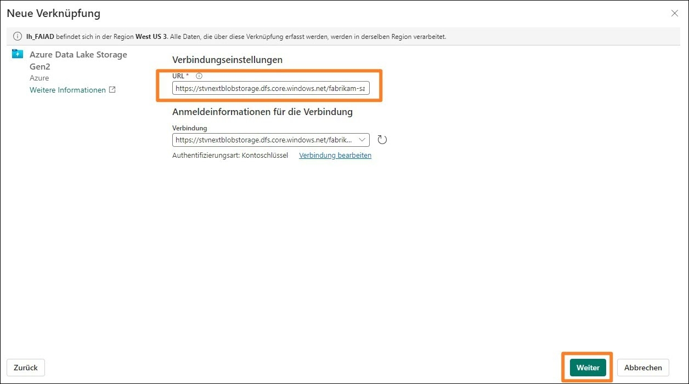

9. Sie werden mit ADLS Gen2 verbunden und die Verzeichnisstruktur wird im linken Bereich angezeigt. Erweitern Sie **Delta-Parquet-Format-FY25**. 

10. Wählen Sie S**ales.Invoices_May** aus. 

11. Wählen Sie **Weiter** aus. 

    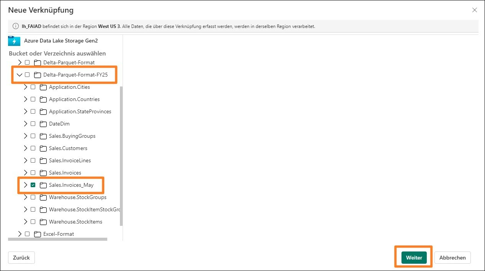

12. Sie werden zum nächsten Dialogfeld weitergeleitet, in dem Sie die Namen bearbeiten können. Wählen Sie das **Symbol „Bearbeiten“** unter Aktionen für **Sales.Invoices_May** aus. 

13. Benennen **SieSales.Invoices_May nach InvoicesMay** um. 

14. Aktivieren Sie das **Häkchen** neben dem Namen, um die Änderung zu speichern. 

15. Wählen Sie **Erstellen** aus. 

    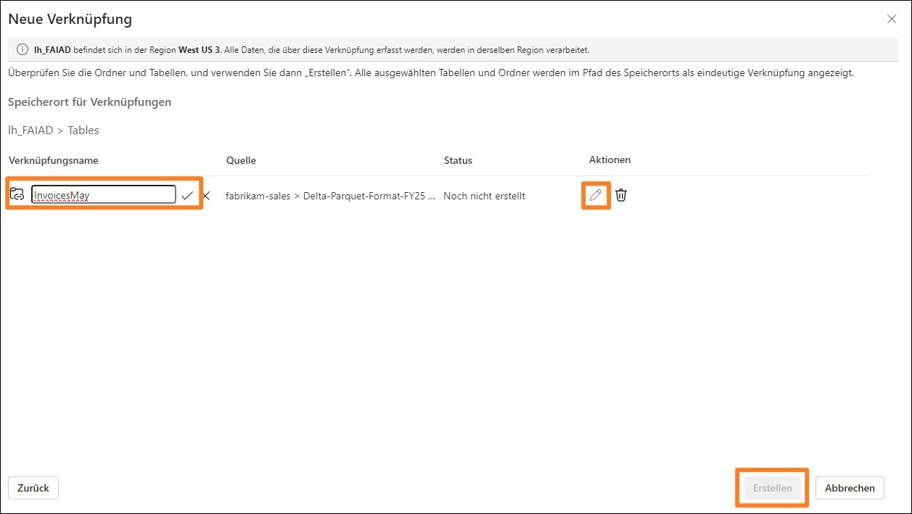

    Beachten Sie, dass sich im **Explorer-Bereich** auf der linken Seite die Tabelle „InvoicesMay“ befindet. Jetzt müssen wir die Ansicht „Sales“ aktualisieren. 

16. Wählen Sie **oben rechts** auf dem Bildschirm **Lakehouse -> SQL-Analyseendpunkt** aus. 

    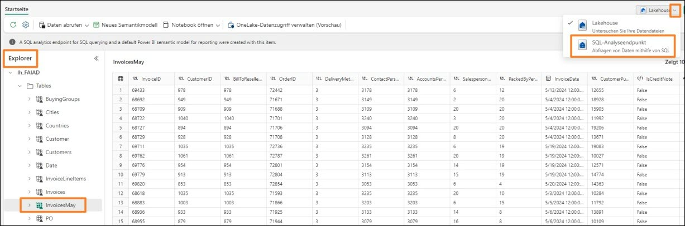

17. Wählen Sie im Menü oben **Start -> Neue SQL-Abfrage** aus. Es wird ein neuer Bereich für SQL-Abfragen geöffnet. 

18. **Kopieren** Sie den folgenden Code, und **fügen** Sie ihn in den SQL-Abfragebereich **ein**. 

```
ALTER VIEW [dbo].[Sales] AS (
  SELECT [$Outer].[InvoiceLineID] AS [InvoiceLineID],
    [$Outer].[InvoiceID] AS [InvoiceID],
    [$Outer].[StockItemID] AS [StockItemID],
    [$Outer].[Quantity] AS [Quantity],
    [$Outer].[UnitPrice] AS [UnitPrice],
    [$Outer].[TaxRate] AS [TaxRate],
    [$Outer].[TaxAmount] AS [TaxAmount],
    [$Outer].[LineProfit] AS [LineProfit],
    [$Outer].[ExtendedPrice] AS [ExtendedPrice],
    [$Outer].[CustomerID] AS [ResellerID],
    [$Outer].[SalespersonPersonID] AS [SalespersonPersonID],
    [$Outer].[InvoiceDate] AS [InvoiceDate],
    [$Outer].[t0_0] AS [Sales Amount]
  FROM (
    SELECT [_].[InvoiceLineID] AS [InvoiceLineID],
      [_].[InvoiceID] AS [InvoiceID],
      [_].[StockItemID] AS [StockItemID],
      [_].[Quantity] AS [Quantity],
      [_].[UnitPrice] AS [UnitPrice],
      [_].[TaxRate] AS [TaxRate],
      [_].[TaxAmount] AS [TaxAmount],
      [_].[LineProfit] AS [LineProfit],
      [_].[ExtendedPrice] AS [ExtendedPrice],
      [_].[CustomerID] AS [CustomerID],
      [_].[SalespersonPersonID] AS [SalespersonPersonID],
      [_].[InvoiceDate] AS [InvoiceDate],
      [_].[ExtendedPrice] - [_].[TaxAmount] AS [t0_0]
    FROM (
      SELECT [$Outer].[InvoiceLineID],
        [$Outer].[InvoiceID],
        [$Outer].[StockItemID],
        [$Outer].[Quantity],
        [$Outer].[UnitPrice],
        [$Outer].[TaxRate],
        [$Outer].[TaxAmount],
        [$Outer].[LineProfit],
        [$Outer].[ExtendedPrice],
        [$Inner].[CustomerID],
        [$Inner].[SalespersonPersonID],
        [$Inner].[InvoiceDate]
      FROM [lh_FAIAD].[dbo].[InvoiceLineItems] AS [$Outer]
      INNER JOIN (
        SELECT [_].[InvoiceID] AS [InvoiceID2],
          [_].[CustomerID],
          [_].[BillToResellerID],
          [_].[OrderID],
          [_].[DeliveryMethodID],
          [_].[ContactPersonID],
          [_].[AccountsPersonID],
          [_].[SalespersonPersonID],
          [_].[PackedByPersonID],
          [_].[InvoiceDate],
          [_].[CustomerPurchaseOrderNumber],
          [_].[IsCreditNote],
          [_].[CreditNoteReason],
          [_].[Comments],
          [_].[DeliveryInstructions],
          [_].[InternalComments],
          [_].[TotalDryItems],
          [_].[TotalChillerItems],
          [_].[DeliveryRun],
          [_].[RunPosition],
          [_].[ReturnedDeliveryData],
          [_].[ConfirmedDeliveryTime],
          [_].[ConfirmedReceivedBy],
          [_].[LastEditedBy] AS [LastEditedBy2],
          [_].[LastEditedWhen] AS [LastEditedWhen2]
        FROM (
          SELECT [$Table].[InvoiceID],
            [$Table].[CustomerID],
            [$Table].[BillToResellerID],
            [$Table].[OrderID],
            [$Table].[DeliveryMethodID],
            [$Table].[ContactPersonID],
            [$Table].[AccountsPersonID],
            [$Table].[SalespersonPersonID],
            [$Table].[PackedByPersonID],
            [$Table].[InvoiceDate],
            [$Table].[CustomerPurchaseOrderNumber],
            [$Table].[IsCreditNote],
            [$Table].[CreditNoteReason],
            [$Table].[Comments],
            [$Table].[DeliveryInstructions],
            [$Table].[InternalComments],
            [$Table].[TotalDryItems],
            [$Table].[TotalChillerItems],
            [$Table].[DeliveryRun],
            [$Table].[RunPosition],
            [$Table].[ReturnedDeliveryData],
            [$Table].[ConfirmedDeliveryTime],
            [$Table].[ConfirmedReceivedBy],
            [$Table].[LastEditedBy],
            [$Table].[LastEditedWhen]
          FROM [lh_FAIAD].[dbo].[Invoices] AS [$Table]
          UNION ALL
          SELECT [$Table].[InvoiceID],
            [$Table].[CustomerID],
            [$Table].[BillToResellerID],
            [$Table].[OrderID],
            [$Table].[DeliveryMethodID],
            [$Table].[ContactPersonID],
            [$Table].[AccountsPersonID],
            [$Table].[SalespersonPersonID],
            [$Table].[PackedByPersonID],
            [$Table].[InvoiceDate],
            [$Table].[CustomerPurchaseOrderNumber],
            [$Table].[IsCreditNote],
            [$Table].[CreditNoteReason],
            [$Table].[Comments],
            [$Table].[DeliveryInstructions],
            [$Table].[InternalComments],
            [$Table].[TotalDryItems],
            [$Table].[TotalChillerItems],
            [$Table].[DeliveryRun],
            [$Table].[RunPosition],
            [$Table].[ReturnedDeliveryData],
            [$Table].[ConfirmedDeliveryTime],
            [$Table].[ConfirmedReceivedBy],
            [$Table].[LastEditedBy],
            [$Table].[LastEditedWhen]
          FROM [lh_FAIAD].[dbo].[InvoicesMay] AS [$Table]
        ) AS [_]
      ) AS [$Inner] ON ([$Outer].[InvoiceID] = [$Inner].[InvoiceID2] OR [$Outer].[InvoiceID] IS NULL AND [$Inner].[InvoiceID2] IS NULL)
    ) AS [_]
  ) AS [$Outer]
  WHERE EXISTS (
    SELECT 1
    FROM (
      SELECT [ResellerID]
      FROM [lh_FAIAD].[dbo].[Reseller] AS [$Table]
    ) AS [$Inner]
    WHERE [$Outer].[CustomerID] = [$Inner].[ResellerID] OR [$Outer].[CustomerID] IS NULL AND [$Inner].[ResellerID] IS NULL
  )
)
```

19. Wählen Sie Menü für Visual-Abfragen **Ausführen** aus, um den Code auszuführen. 

    Sobald der Code ausgeführt wurde, haben wir die Tabelle „Sales“ aktualisiert, um die Daten für Mai 2024 aufzunehmen. 

    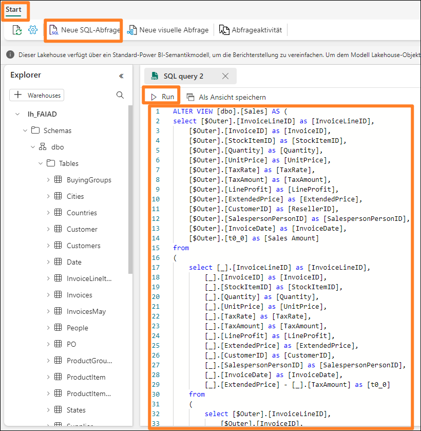

20. Wählen Sie in der linken Menüleiste **rpt_Sales_Report** aus, um zum Bericht zurückzukehren. 

21. Wählen Sie im oberen Menü **Aktualisieren** aus. Beachten Sie, dass das Liniendiagramm nun Daten für Mai 2024 enthält. Beachten Sie auch, dass der Betrag und die Einheiten gestiegen sind. 

    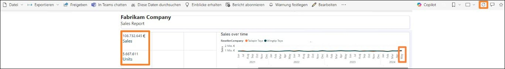

    Wir müssen das Datenmodell und den Bericht nicht aktualisieren, wenn Daten geändert werden. Dies ist der Vorteil von Direct Lake und der Direct Query. 

    Sehen wir uns noch einmal die Herausforderungen an, die in der Problemstellung aufgeführt sind: 

- **Das Dataset muss mindestens dreimal täglich aktualisiert werden, um den verschiedenen Aktualisierungszeiten der Datenquellen Rechnung zu tragen**. 

  Wir haben dieses Problem mithilfe von Direct Lake gelöst. Jeder einzelne Dataflow wird nach seinem Zeitplan aktualisiert. Das DataSet und der Bericht müssen nicht aktualisiert werden. 

- **Die Aktualisierungen dauern lange, weil die Daten jedes Mal komplett aktualisiert werden müssen, um alle Änderungen an den Daten in den Quellsystemen zu erfassen**. 

  Auch hier haben wir dieses Problem mithilfe von Direct Lake gelöst. Jeder einzelne Dataflow wird nach seinem Zeitplan aktualisiert. Das DataSet und der Bericht müssen nicht aktualisiert werden, sodass wir uns keine Sorgen über eine vollständige Aktualisierung machen müssen.  

- **Tritt in den Datenquellen, aus denen die Daten abgerufen werden, ein Fehler auf, wird die DataSet-Aktualisierung abgebrochen. Oftmals wird die Mitarbeiterdatei nicht pünktlich hochgeladen, was ebenso zum Abbruch der DataSet-Aktualisierung führt**.  

  Die Datenpipeline hilft, dieses Problem zu lösen, indem es die Möglichkeit bietet, die Aktualisierung bei Fehlern und in verschiedenen Intervallen zu wiederholen. 

- **Änderungen am Datenmodell nehmen sehr viel Zeit in Anspruch, weil Power Query aufgrund der großen Datenmenge und des aufwändigen Transformationsvorgangs sehr lange braucht, um die Vorschauversionen zu aktualisieren**.  

  Wir haben festgestellt, dass Dataflows und Lakehouse effizient und einfach zu ändern sind. Das Laden der Vorschauversion in Dataflows und Lakehouse dauert in der Regel nicht lange. 

- **Für Power BI Desktop brauchen Sie einen PC mit Windows, auch wenn im Unternehmen Mac-Geräte genutzt werden**.

  Microsoft Fabric ist ein SaaS-Angebot. Wir benötigen lediglich einen Browser, um auf den Dienst zuzugreifen. Wir müssen keine Software auf unseren Desktops installieren. 

# Übungsumgebung bereinigen 

Wenn Sie bereit sind, die Übungsumgebung zu bereinigen, führen Sie die folgenden Schritte aus. 

1. Wählen Sie im linken Bereich den Arbeitsbereich **FAIAD_\<Benutzername>** aus, um zur Startseite des Arbeitsbereichs zu navigieren. 

2. Wählen Sie im oberen Menü **Arbeitsbereichseinstellungen** aus. 

   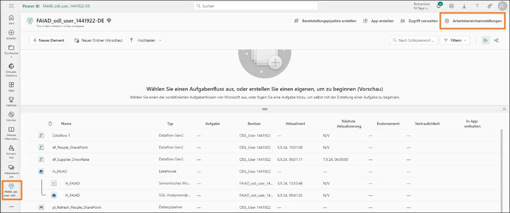

3. Das Dialogfeld „Arbeitsbereichseinstellungen“ wird geöffnet. Scrollen Sie im Abschnitt **Allgemein** nach unten. 

4. Wählen Sie **Diesen Arbeitsbereich entfernen** aus. 

5. Das Dialogfeld „Arbeitsbereich löschen“ wird angezeigt. Wählen Sie **Löschen** aus. 

   Dadurch werden der Arbeitsbereich und alle darin enthaltenen Elemente gelöscht. 

   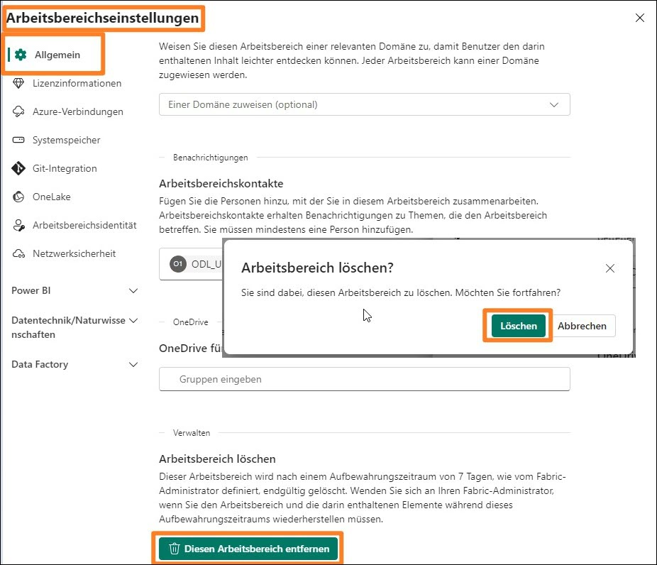

## Referenzen

Bei Fabric Analyst in a Day (FAIAD) lernen Sie einige der wichtigsten Funktionen von Microsoft Fabric kennen. Im Menü des Dienstes finden Sie in der Hilfe (?) Links zu praktischen Informationen.

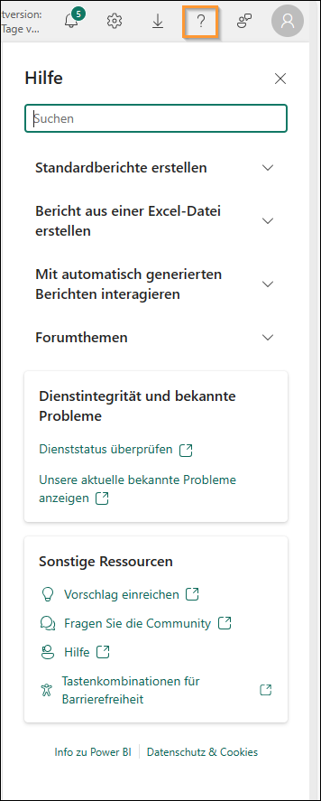

Nachfolgend finden Sie weitere Angebote zur weiteren Arbeit mit Microsoft Fabric.

- Die vollständige [Ankündigung der allgemeinen Verfügbarkeit von Microsoft Fabric](https://aka.ms/Fabric-Hero-Blog-Ignite23) finden Sie 
im Blogbeitrag.
- Fabric bei einer [interaktiven Vorstellung](https://aka.ms/Fabric-GuidedTour) kennenlernen
- Zur [kostenlosen Testversion von Microsoft Fabric](https://aka.ms/try-fabric) anmelden
- [Website von Microsoft Fabric](https://aka.ms/microsoft-fabric) besuchen
- Mit Modulen von [Fabric Learning](https://aka.ms/learn-fabric) neue Qualifikationen erwerben
- [Technische Dokumentation zu Fabric lesen](https://aka.ms/fabric-docs)
- [Kostenloses E-Book zum Einstieg in Fabric](https://aka.ms/fabric-get-started-ebook) lesen
- Mitglied der [Fabric-Community](https://aka.ms/fabric-community) werden, um Fragen zu stellen, Feedback zu geben und sich mit anderen auszutauschen

Lesen Sie die detaillierteren Blogs zur Ankündigung der Fabric-Umgebung:
- [Blog zum Data Factory-Funktionsbereich in Fabric](https://aka.ms/Fabric-Data-Factory-Blog)
- [Blog zum Data Engineering-Funktionsbereich von Synapse in Fabric](https://aka.ms/Fabric-DE-Blog)
- [Blog zum Data Science-Funktionsbereich von Synapse in Fabric](https://aka.ms/Fabric-DS-Blog)
- [Blog zum Data Warehousing-Funktionsbereich von Synapse in Fabric](https://aka.ms/Fabric-DW-Blog)
- [Blog zum Real-Time Analytics-Funktionsbereich von Synapse in Fabric](https://aka.ms/Fabric-RTA-Blog)
- [Blog mit Ankündigungen zu Power BI](https://aka.ms/Fabric-PBI-Blog)
- [Blog zum Data Activator-Funktionsbereich in Fabric](https://aka.ms/Fabric-DA-Blog)
- [Blog zu Verwaltung und Governance in Fabric](https://aka.ms/Fabric-Admin-Gov-Blog)
- [Blog zu OneLake in Fabric](https://aka.ms/Fabric-OneLake-Blog)
- [Blog zur Dataverse- und Microsoft Fabric-Integration](https://aka.ms/Dataverse-Fabric-Blog)


© 2023 Microsoft Corporation. Alle Rechte vorbehalten.

Durch die Verwendung der vorliegenden Demo/Übung stimmen Sie den folgenden Bedingungen zu: 

Die in dieser Demo/Übung beschriebene Technologie/Funktionalität wird von der Microsoft Corporation bereitgestellt, um Feedback von Ihnen zu erhalten und Ihnen Wissen zu vermitteln. Sie dürfen die Demo/Übung nur verwenden, um derartige Technologiefeatures und Funktionen zu bewerten und Microsoft Feedback zu geben. Es ist Ihnen nicht erlaubt, sie für andere Zwecke zu verwenden. Es ist Ihnen nicht gestattet, diese Demo/Übung oder einen Teil derselben zu ändern, zu kopieren, zu verbreiten, zu übertragen, anzuzeigen, auszuführen, zu vervielfältigen, zu veröffentlichen, zu lizenzieren, zu transferieren oder zu verkaufen oder aus ihr abgeleitete Werke zu erstellen.

DAS KOPIEREN ODER VERVIELFÄLTIGEN DER DEMO/ÜBUNG (ODER EINES TEILS DERSELBEN) AUF EINEN/EINEM ANDEREN SERVER ODER SPEICHERORT FÜR DIE WEITERE VERVIELFÄLTIGUNG ODER VERBREITUNG IST AUSDRÜCKLICH UNTERSAGT.

DIESE DEMO/ÜBUNG STELLT BESTIMMTE SOFTWARE-TECHNOLOGIE-/PRODUKTFEATURES UND FUNKTIONEN, EINSCHLIESSLICH POTENZIELLER NEUER FEATURES UND KONZEPTE, IN EINER SIMULIERTEN UMGEBUNG OHNE KOMPLEXE EINRICHTUNG ODER INSTALLATION FÜR DEN OBEN BESCHRIEBENEN ZWECK BEREIT. DIE TECHNOLOGIE/KONZEPTE IN DIESER DEMO/ÜBUNG ZEIGEN MÖGLICHERWEISE NICHT DAS VOLLSTÄNDIGE FUNKTIONSSPEKTRUM UND FUNKTIONIEREN MÖGLICHERWEISE NICHT WIE DIE ENDGÜLTIGE VERSION. UNTER UMSTÄNDEN VERÖFFENTLICHEN WIR AUCH KEINE ENDGÜLTIGE VERSION DERARTIGER FEATURES ODER KONZEPTE. IHRE ERFAHRUNG BEI DER VERWENDUNG DERARTIGER FEATURES UND FUNKTIONEN IN EINER PHYSISCHEN UMGEBUNG KANN FERNER ABWEICHEND SEIN.

**FEEDBACK**. Wenn Sie Feedback zu den Technologiefeatures, Funktionen und/oder Konzepten geben, die in dieser Demo/Übung beschrieben werden, gewähren Sie Microsoft das Recht, Ihr Feedback in jeglicher Weise und für jeglichen Zweck kostenlos zu verwenden, zu veröffentlichen
und gewerblich zu nutzen. Außerdem treten Sie Dritten kostenlos sämtliche Patentrechte ab, die erforderlich sind, damit deren Produkte, Technologien und Dienste bestimmte Teile einer
Software oder eines Dienstes von Microsoft, welche/welcher das Feedback enthält, verwenden oder eine Verbindung zu dieser/diesem herstellen können. Sie geben kein Feedback, das einem Lizenzvertrag unterliegt, aufgrund dessen Microsoft Drittparteien eine Lizenz für seine Software oder Dokumentation gewähren muss, weil wir Ihr Feedback in diese aufnehmen. Diese Rechte bestehen nach Ablauf dieser Vereinbarung fort.
 
DIE MICROSOFT CORPORATION LEHNT HIERMIT JEGLICHE GEWÄHRLEISTUNGEN UND GARANTIEN IN BEZUG AUF DIE DEMO/ÜBUNG AB, EINSCHLIESSLICH ALLER AUSDRÜCKLICHEN, KONKLUDENTEN ODER GESETZLICHEN GEWÄHRLEISTUNGEN UND GARANTIEN DER HANDELSÜBLICHKEIT, DER EIGNUNG FÜR EINEN BESTIMMTEN ZWECK, DES RECHTSANSPRUCHS UND DER NICHTVERLETZUNG VON RECHTEN DRITTER. MICROSOFT MACHT KEINERLEI ZUSICHERUNGEN BZW. ERHEBT KEINERLEI ANSPRÜCHE IM HINBLICK AUF DIE RICHTIGKEIT DER ERGEBNISSE UND DES AUS DER VERWENDUNG DER DEMO/ÜBUNG RESULTIERENDEN ARBEITSERGEBNISSES BZW. BEZÜGLICH DER EIGNUNG DER IN DER DEMO/ÜBUNG ENTHALTENEN INFORMATIONEN FÜR EINEN BESTIMMTEN ZWECK.

**HAFTUNGSAUSSCHLUSS**

Diese Demo/Übung enthält nur einen Teil der neuen Features und Verbesserungen in Microsoft Power BI. Einige Features können sich unter Umständen in zukünftigen Versionen des Produkts ändern. In dieser Demo/Übung erhalten Sie Informationen über einige, aber nicht über alle neuen Features.