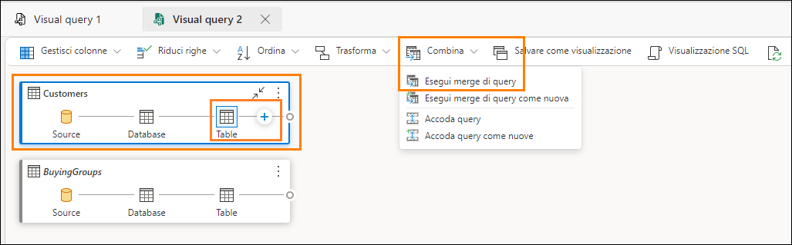

# Microsoft Fabric - Fabric Analyst in a Day - Lab 3

 

# Sommario

- Introduzione

- Collegamento ad ADLS Gen2
  
  - Attività 1: Creazione di un collegamento
  
- Trasformazione dei dati usando le query visive
  
  - Attività 2: Creazione di una vista Geo mediante le query visive
    
  - Attività 3: Creazione di una vista Reseller mediante le query visive
    
  - Attività 4: Creazione di una vista Sales mediante le query visive
    
  - Attività 5: Creazione di una vista Product mediante le query visive
  
- Riferimenti 

# Introduzione 

Nel nostro scenario i dati di vendita provengono dal sistema ERP e sono archiviati in un ADLS Gen2. 
Vengono aggiornati alle 12.00 ogni giorno. Dobbiamo trasformare e inserire questi dati in Lakehouse e usarli nel nostro modello.

Esistono più modi per inserire questi dati. 

- **Collegamenti:** crea un collegamento ai dati e possiamo usare le viste di query visive per 
trasformarlo. Useremo i collegamenti in questo lab.

- **Notebook:** richiedono la scrittura di codice. È un approccio pensato per gli sviluppatori.

- **Flusso di dati Gen2:** probabilmente si ha familiarità con Power Query o Flusso di dati Gen1. 
Flusso di dati Gen2, come indica il nome, è la versione più recente di Flusso di dati. Fornisce 
tutte le funzionalità di Power Query/Flusso di dati Gen1 con la possibilità aggiuntiva di 
trasformare e inserire dati in più origini dati. Ne parleremo nei prossimi due lab.

- **Pipeline di dati:** questo è uno strumento di orchestrazione. Le attività possono essere orchestrate per estrarre, trasformare e acquisire dati. Useremo Pipeline di dati per eseguire l'attività di Flusso di dati Gen2 che a sua volta eseguirà l'estrazione, la trasformazione e l'acquisizione.

   Inizieremo creando un collegamento per importare i dati nel lakehouse dall'origine dati ADLS Gen2. Una volta inseriti i dati, useremo le viste delle query visive per trasformarli.

  In questo lab si apprenderà quanto segue: 

  - Come creare un collegamento al lakehouse

  - Come trasformare i dati usando le query visive

# Collegamento ad ADLS Gen2

## Attività 1: Creazione di un collegamento

Si usa il collegamento per creare un link all'ubicazione di destinazione. È come creare dei 
collegamenti nel desktop di Windows.

1. Torniamo all'**area di lavoro di Fabric** creata nel Lab 2, Attività 9.

2. Se non si è usciti dopo il lab precedente, ci si trova nella schermata Lakehouse. Se si è usciti, non c'è problema. Selezionare **lh_FAIAD** per spostarsi nel lakehouse. 

3. Nel **pannello Explorer** selezionare i **puntini di sospensione** accanto a **Tables.**

4. Selezionare **Nuovo collegamento.**

   

5. Viene visualizzata la finestra di dialogo **Nuovo collegamento** . In **Origini esterne** selezionare **Azure Data Lake Storage Gen2.**

    

6. È necessario creare una connessione all'origine dati ADLS Gen2. In **Impostazioni connessione -> 
URL** immettere il seguente collegamento: 
https://stvnextblobstorage.dfs.core.windows.net/fabrikam-sales

7. Selezionare **Chiave account** dal menu a discesa Tipo di autenticazione.

8. Copiare la **chiave di accesso dell'account di archiviazione ADLS** nella scheda **Variabili di 
ambiente** (accanto alla scheda Guida al lab) e incollarla nella casella di testo **Chiave account.**

9. Selezionare **Avanti** nella parte inferiore destra della schermata.

    

10. Verrà stabilita una connessione ad ADLS Gen2 con la struttura delle directory visualizzata nel 
pannello di sinistra. Espandere **Delta-Parquet-Format-FY25.**

11. **Selezionare** le seguenti directory:

    a. Application.Cities

    b. Application.Countries

    c. Application.StateProvinces

    d. DateDim

    e. Sales.BuyingGroups

    f. Sales.Customers

    g. Sales.Invoices

    h. Sales.InvoiceLines

    i. Warehouse.StockItems

    j. Warehouse.StockGroups

    k. Warehouse.StockItemStockGroups

    **Nota:** Sales.Invoices_May è l'unica directory **non** selezionata.

12. Selezionare **Avanti.**

     

13. Si verrà indirizzati alla finestra di dialogo successiva, dove avremo la possibilità di modificare 
i nomi. Selezionare l'**icona Modifica** in Azioni per **Application.Cities.**

14. Rinominare **Application.Cities in Cities.**

15. Selezionare il segno di spunta accanto al nome per salvare la modifica.

    

16. Allo stesso modo, rinominare i collegamenti come indicato di seguito:

    a. Application.Countries in **Countries**

    b. Application.StateProvinces in **States**

    c. DateDim in **Date**

    d. Sales.BuyingGroups in **BuyingGroups**

    e. Sales.Customers in **Customers**

    f. Sales.InvoiceLines in **InvoiceLineItems**

    g. Sales.Invoices in **Invoices**

    h. Warehouse.StockGroups in **ProductGroups**

    i. Warehouse.StockItemStockGroups in **ProductItemGroup**

    j. Warehouse.StockItems in **ProductItem**

    **Nota:** ricontrollare i nomi. Un errore di digitazione potrebbe causare errori durante il lab.

17. Selezionare **Crea** per creare il collegamento.

     

18. Notare che tutti i collegamenti vengono creati come tabelle. Selezionare la tabella **BuyingGroups;** notare che è possibile vedere un anteprima dei dati nel pannello dati.
Il passaggio successivo consiste nel trasformare i dati, in modo da poter creare un modello 
semantico. Creeremo delle viste per trasformare i dati.

    

# Trasformazione dei dati usando le query visive

## Attività 2: Creazione di una vista Geo mediante le query visive

1. Possiamo accedere al lakehouse usando un endpoint SQL. Ciò permette di eseguire query sui dati e creare viste. In alto a destra della schermata selezionare **Lakehouse -> Endpoint di Analisi SQL.**

   

   Si verrà indirizzati all'endpoint di Analisi SQL. Notare che il pannello Explorer è cambiato. Ora è possibile creare viste, stored procedure, query e altro ancora. Creeremo una query visiva poiché fornisce un'interfaccia simile a quella di Power Query e la salveremo come vista.

   Inizieremo creando la vista Geo. Per poter creare la vista Geo, dobbiamo unire i dati dalle query Cities, States e Countries.

2. Nel menu in alto selezionare **Nuova query visiva.**

    

3. Per creare una query dobbiamo trascinare le tabelle nel pannello Query visiva. Trasciniamo le 
query Cities, States e Countries nel pannello della query visiva.

     

   Dobbiamo unire queste query. La query visiva include un'opzione che permette di usare l'editor di Power Query. E noi lo useremo, visto che lo conosciamo bene.

4. Dal menu nell'editor di query visive, selezionare l'icona **Modalità messa a fuoco** (verso destra). Si aprirà l'editor di Power Query.

     

5. Con la query Cities selezionata, dalla barra multifunzione dell'editor di Power Query selezionare 
**Home - > Esegui merge di query -> Esegui merge di query come nuova.** Si apre la finestra di 
dialogo Esegui merge di query.

    

6. Nella **tabella di sinistra da unire** selezionare **Cities.**

7. Nella **tabella di destra da unire** selezionare **States.**

8. Selezionare le colonne **StateProvinceID** da entrambe le tabelle. Useremo questa colonna per 
creare un join.

9. Selezionare **Inner** come **Tipo di join.**

10. Selezionare **OK.**

    

    Notare che è stata creata una nuova query denominata Merge. Abbiamo bisogno di alcune colonne da States.

11. Nel **vista dati** (pannello inferiore) fare clic sulla **freccia doppia** accanto alla colonna **States** (ultima colonna a destra).

12. Si apre un pannello. **Selezionare** le seguenti colonne:

    a. StateProvinceCode

    b. StateProvinceName

    c. CountryID

    d. SalesTerritory

13. Selezionare **OK.**

    

    Ora dobbiamo unire la query Countries. 

14. Con la query Merge selezionata, selezionare **Home -> Esegui merge di query -> Esegui merge di 
query** dalla barra multifunzione.

     

15. Si apre la finestra di dialogo Esegui merge di query. Nella **tabella di destra da unire** selezionare **Countries.**

16. Selezionare le colonne **ICountryID** da entrambe le tabelle. Useremo questa colonna per creare 
un join.

17. Selezionare **Inner** come **Tipo di join.**

18. Selezionare **OK.**

    

    Abbiamo bisogno di alcune colonne da Countries.

19. Nel **vista dati** (pannello inferiore) fare clic sulla **freccia doppia** accanto alla colonna **Countries.**

20. Si apre un pannello.**Selezionare** le seguenti colonne:

    a. CountryName

    b. FormalName

    c. IsoAlpha3Code

    d. IsoNumericCode

    e. CountryType

    f. Continent

    g. Region

    h. Subregion

21. Selezionare **OK.**

    

    Non abbiamo bisogno di tutte le colonne. Selezioniamo solo quelle di cui abbiamo bisogno.

22. Con la query Merge, dalla barra multifunzione selezionare **Home -> Scegli colonne -> Scegli 
colonne.**

    

23. Viene visualizzata la finestra di dialogo Scegli colonne. **Deselezionare** le seguenti colonne.

    a. StateProvinceID

    b. Location

    c. LastEditedBy

    d. ValidFrom

    e. ValidTo

    f. CountryID

24. Selezionare **OK.**

    

    Notare che il processo è simile a quello di Power Query, abbiamo tutti i passaggi registrati sia nel pannello Passaggi applicati a destra sia nella vista visiva. Rinominiamo la query Merge e poi scegliamo Abilita caricamento, in modo che i dati vengano caricati da questa query.

25. **Fare clic con il pulsante destro del mouse sulla query Merge** nel pannello Query (a sinistra). Selezionare **Rinomina,** quindi rinominare la query in **Geo.**

26. **Fare clic con il pulsante destro del mouse sulla query Geo** nel pannello Query (a sinistra). 
Selezionare **Abilita caricamento** per abilitare questa query.

27. Accertarsi che le query Cities, States e Countries siano **disabilitate.**

28. Selezionare **Salva.**

    

    Verremo indirizzati all'editor di query visive. Salviamo ora questa query come vista.

    **Nota:** tutti i passaggi eseguiti mediante l'editor di Power Query possono essere anche eseguiti usando l'editor di query visive.

29. Dal menu Editor di query visive selezionare **Salvare come viualizzazione.**

    

    Viene visualizzata la finestra di dialogo Salva come visualizzazione. Notare che la query SQL è disponibile. Se lo si desidera, è possibile rivederla. 

30. Immettere **Geo** come **Nome visualizzazione.**

31. Selezionare **OK** per salvare la vista. 

    

    Si riceverà un avviso una volta salvata la vista. 

32. Nel pannello Explorer (a sinistra), espandere **Views.** Abbiamo la vista Geo appena creata.

     

## Attività 3: Creazione di una vista Reseller mediante le query visive

Creiamo la vista Reseller, creata unendo la tabella Customers con la tabella BuyingGroups. Questa 
volta creeremo la vista usando una query visiva.

1. Dalla barra di menu di Lakehouse selezionare **Home -> Nuova query visiva.** Si apre una nuova 
query visiva.

2. Dalla sezione Explorer, trascinare le tabelle Customers e BuyingGroups nella sezione dedicata alla query visiva.

   

3. S**elezionare la query** Customers. Una volta selezionato, Customers avrà un bordo blu e un segno 
"+" dopo Table (ciò indica che stiamo aggiungendo un passaggio dopo Table. Se non è 
visualizzato alcun segno "+" dopo la tabella, è possibile che si sia selezionato un passaggio 
diverso. Selezionare Table e il problema è risolto).

4. Nel menu Query visiva selezionare **Combina -> Esegui merge di query.**

     

   Viene visualizzata la finestra di dialogo Merge con Customers selezionato come tabella superiore. 

5. Nella **tabella di destra da unire** selezionare **BuyingGroups.**

6. Selezionare le colonne **BuyingGroupID** da entrambe le tabelle. Useremo questa colonna per 
creare un join.

7. Selezionare **Inner** come **Tipo di join.**

8. Selezionare **OK.**

   

9. Nella **Vista dati** (pannello inferiore), fare clic sulla **freccia doppia** accanto alla colonna 
**BuyingGroups** (ultima colonna a destra) per selezionare le colonne di cui abbiamo bisogno da 
BuyingGroups.

10. Si apre un pannello. **Selezionare la colonna BuyingGroupName .**

11. Selezionare **OK.**

    

    Non abbiamo bisogno di tutte le colonne. Selezioniamo solo quelle di cui abbiamo bisogno.

12. Dal menu della query visiva selezionare **Gestisci colonne -> Scegli colonne.**

     

13. Viene visualizzata la finestra di dialogo Scegli colonne. **Selezionare** le seguenti colonne.

    a. ResellerID

    b. ResellerName

    c. PostalCityID

    d. PhoneNumber

    e. FaxNumber

    f. WebsiteURL

    g. DeliveryAddressLine1

    h. DeliveryAddressLine2

    i. DeliveryPostalCode

    j. PostalAddressLine1

    k. PostalAddressLine2

    l. PostalPostalCode

    m. BuyingGroupName

14. Selezionare **OK.**

    

15. Rinominiamo la colonna BuyingGroupName. Nella **vista Dati, fare doppio clic sull'intestazione 
della colonna BuyingGroupName** per renderla modificabile.

16. **Rinominare** la colonna in **ResellerCompany.**

    

Notare che nella tabella Customer sono documentati tutti i passaggi. Ora è il momento di salvare la vista.

17. Dal menu Query visiva selezionare **Salvare come visualizzazione.**

    

    Viene visualizzata la finestra di dialogo Salva come visualizzazione. Notare che la query SQL è disponibile. Se lo si desidera, è possibile rivederla. 

18. Immettere **Reseller** come **Nome visualizzazione.**

19. Selezionare **OK** per salvare la vista. 

    

    Si riceverà un avviso una volta salvata la vista. 

20. Nel pannello Explorer (a sinistra), espandere **Views.** Abbiamo la vista Reseller appena creata.

     

## Attività 4: Creazione di una vista Sales mediante le query visive

Creiamo la vista Sales, unendo le tabelle InvoiceLineItems e Invoices e la vista Reseller. Abbiamo questa query in Power BI Desktop. Copieremo il codice dall'editor avanzato. Ma prima di copiare il codice, dobbiamo creare una tabella di unione usando Query visiva, poiché in Query visiva non è possibile creare una query vuota. Proviamo a usare questo metodo.

1. Dalla barra di menu di Lakehouse selezionare H**ome -> Nuova query visiva.** Si apre una nuova 
query visiva.

2. Dalla sezione **Explorer -> Tables,** trascinare le tabelle **InvoiceLineItems, Invoices** nella sezione Query visiva 

3. Dalla sezione **Explorer -> Views,** trascinare la vista **Reseller** nella sezione Query visiva 

4. Dall'editor di query visive, selezionare l'**icona Modalità messa a fuoco** per aprire l'editor di Power Query.

   

5. Con la query InvoiceLineItems selezionata, dalla barra multifunzione dell'editor, selezionare 
**Home - > Esegui merge di query - > Esegui merge di query come nuova.**

   

   Si apre la finestra di dialogo Merge.

6. Nella **tabella di sinistra da unire** selezionare **InvoiceLineItems.**

7. Nella **tabella di destra da unire**  selezionare **Invoices.**

8. Selezionare le colonne **InvoiceID** da entrambe le tabelle. Useremo questa colonna per creare un 
join.

9. Selezionare Inner come **Tipo di join.**

10. Selezionare **OK.**

    

    Copiamo il codice da Power BI Desktop e lo incolliamo usando l'editor avanzato.

11. Se non lo si è ancora aperto, aprire il file **FAIAD.pbix** nella cartella Reports sul desktop 
dell'ambiente lab. 

12. Nella barra multifunzione selezionare **Home -> Trasforma dati.** Si apre la finestra Power Query. Come si è notato nel lab precedente, le query nel pannello di sinistra sono organizzate per origine dati.

    

13. Dal pannello di sinistra, nella cartella ADLSData, selezionare la query **Sales.**

14. Nella barra multifunzione selezionare **Home - > Editor avanzato.** Viene visualizzata la finestra di dialogo dell'editor avanzato.

    

15. **Selezionare li codice dalla riga 3** (#"Expanded Invoice" …) fino all'ultima riga di codice.

16. **Fare clic con il pulsante destro del mouse** e selezionare **Copia.**

17. Selezionare **Annulla** per chiudere l'editor avanzato.

    

18. **Tornare alla finestra/scheda del browser** in cui è aperto l'editor di Power Query.

19. Accertarsi di aver selezionato la query **Merge.**

20. Nella barra multifunzione selezionare **Home -> Editor avanzato.** Viene visualizzata la finestra di dialogo dell'editor avanzato.

     

21. Alla **fine della riga 2 aggiungere una virgola** (Source = Table.NestedJoin(InvoiceLineItems, 
{"InvoiceID"}, Invoices, {"InvoiceID"}, "Invoices", JoinKind.Inner)

22. Fare clic su **INVIO** per iniziare una nuova riga.

23. Usare la combinazione di tasti **CTRL+V** per incollare il codice copiato da Power BI Desktop.


    **Nota:** se si lavora in un ambiente lab, selezionare i puntini di sospensione in alto a destra della schermata. Usare il dispositivo di scorrimento per **abilitare VM Native Clipboard.** Nella finestra di dialogo selezionare OK. Dopo aver incollato le query è possibile disabilitare questa opzione.

    

24. Evidenziare le ultime due righe di codice (in Origine) ed **eliminarle.**

25. Selezionare **OK** per salvare le modifiche.

    

    Se è più semplice, eliminare tutto il codice nell'editor avanzato e incollare il codice sottostante.

    ```
    let
    Source = Table.NestedJoin(InvoiceLineItems, {"InvoiceID"}, Invoices, {"InvoiceID"}, "Invoices", JoinKind.Inner),
    #"Expanded Invoice" = Table.ExpandTableColumn(Source, "Invoices", {"CustomerID",
    "BillToCustomerID", "SalespersonPersonID", "InvoiceDate"}, {"CustomerID", "BillToCustomerID", "SalespersonPersonID", "InvoiceDate"}),
    #"Removed Other Columns" = Table.SelectColumns(#"Expanded Invoice",{"InvoiceLineID", "InvoiceID", "StockItemID", "Quantity", "UnitPrice", "TaxRate", "TaxAmount", "LineProfit", "ExtendedPrice", "CustomerID", "SalespersonPersonID", "InvoiceDate"}),
    #"Renamed Columns" = Table.RenameColumns(#"Removed Other Columns",{{"CustomerID", "ResellerID"}}),
    
    #"Merged Queries" = Table.NestedJoin(#"Renamed Columns", {"ResellerID"}, Reseller,
    {"ResellerID"}, "Customer", JoinKind.Inner),
    #"Added Custom" = Table.AddColumn(#"Merged Queries", "Sales Amount", each [ExtendedPrice] - [TaxAmount]),
    #"Changed Type" = Table.TransformColumnTypes(#"Added Custom",{{"Sales Amount", type number}}),
    #"Removed Columns" = Table.RemoveColumns(#"Changed Type",{"Customer"}) in
    #"Removed Columns"
    ```

26. Si aprirà nuovamente l'editor di Power Query. A sinistra, nel pannello Query, **fare doppio clic 
sulla query Merge** per rinominarla.

27. **Rinominare** la query Merge in **Sales.**

28. Fare clic con il pulsante destro del mouse sulla query Sales e selezionare **Abilita caricamento** per abilitare il caricamento della query.

     

29. Selezionare **Salva** per salvare e chiudere la finestra di dialogo Power Query. Si verrà indirizzati alla 
query visiva.

30. Dal menu Query visiva selezionare **Salvare come visualizzazione.** Viene visualizzata la finestra di 
dialogo Salva come visualizzazione. Notare che la query SQL è disponibile. Se lo si desidera, è possibile 
rivederla. 

31. Immettere **Sales** come **Nome visualizzazione.**

32. Selezionare **OK** per salvare la vista. 

    

    Si riceverà un avviso una volta salvata la vista. 

33. Nel pannello Explorer (a sinistra), espandere **Views.** Abbiamo la vista Sales appena creata.

    

## Attività 5: Creazione di una vista Product mediante le query visive

Creiamo la vista Product unendo le tabelle ProductItem, ProductItemGroup e ProductGroups. Per 
procedere, copieremo il codice nell'editor avanzato.

1. Dalla barra di menu di Lakehouse selezionare **Home -> Nuova query visiva.** Si apre una nuova 
query visiva.

2. Dalla sezione Explorer trascinare le tabelle **ProductItem, ProductItemGroup and ProductGroups** 
nella sezione della query visiva 

3. Dall'editor di query visive, selezionare l'**icona Modalità messa a fuoco** per aprire l'editor di 
Power Query.

   

4. Con la query **ProductItem** selezionata, dalla barra multifunzione selezionare **Home -> Esegui 
merge di query -> Esegui merge di query come nuova.** Si apre la finestra di dialogo Merge. 

   

5. Nella **tabella di sinistra da unire** selezionare **ProductItem.**

6. Nella **tabella di destra da unire** selezionare **ProductItemGroup.**

7. Selezionare le colonne **StockItemID** da entrambe le tabelle. Useremo questa colonna per creare 
un join.

8. Selezionare **Left outer** come **Tipo di join.**

9. Selezionare **OK.** La nuova query viene creata.

   

10. Con la query Merge selezionata, dalla barra multifunzione selezionare **Home -> Editor avanzato.** Viene visualizzata la finestra di dialogo dell'editor avanzato.

    

11. **Selezionare tutto il codice** nell'editor avanzato ed **eliminarlo.**

12. **Incollare** il codice di seguito nell'editor avanzato.

```
    let
    Source = Table.NestedJoin(ProductItem, {"StockItemID"}, ProductItemGroup, {"StockItemID"}, "ProductItemGroup", JoinKind.LeftOuter),
    #"Expanded ProductItemGroup" = Table.ExpandTableColumn(Source, "ProductItemGroup",
    {"StockGroupID"}, {"StockGroupID"}),
    #"Merged queries" = Table.NestedJoin(#"Expanded ProductItemGroup", {"StockGroupID"}, ProductGroups, {"StockGroupID"}, "ProductGroups", JoinKind.LeftOuter),
    #"Expanded ProductGroups" = Table.ExpandTableColumn(#"Merged queries", "ProductGroups", {"StockGroupName"}, {"StockGroupName"}),
    
    #"Choose columns" = Table.SelectColumns(#"Expanded ProductGroups", {"StockItemID", "StockItemName", "SupplierID", "Size", "IsChillerStock", "TaxRate", "UnitPrice",
    "RecommendedRetailPrice", "TypicalWeightPerUnit", "StockGroupName"})
    in
    #"Choose columns"
  ```

13. Selezionare **OK** per chiudere l'editor avanzato. Si aprirà nuovamente l'editor di Power Query.

    

14. A sinistra, nel pannello Query, **fare doppio clic sulla query Merge** per rinominarla.

15. **Rinominare** la query Merge in **Product.**

16. Fare clic con il pulsante destro del mouse sulla query Product e selezionare **Abilita caricamento** per abilitare il caricamento della query.

17. Selezionare **Salva** per salvare e chiudere la finestra di dialogo Power Query. Si verrà indirizzati alla 
query visiva.

     

18. Dal menu Query visiva selezionare **Salvare come visualizzazione.** Viene visualizzata la finestra di dialogo Salva come visualizzazione. Notare che la query SQL è disponibile. Se lo si desidera, è possibile rivederla. 

19. Immettere **Product** come **Nome visualizzazione.**

20. Selezionare **OK** per salvare la vista. 

    

    Si riceverà un avviso una volta salvata la vista. 

21. Nel pannello Explorer (a sinistra), espandere **Views.** Abbiamo la vista Product appena creata.

    

    Abbiamo trasformato i dati dall'origine dati ADLS Gen2. In questo laboratorio è stato spiegato come creare collegamenti e sono state illustrate varie opzioni per usare le viste di query visive per trasformare i dati.

    Nel prossimo lab verrà descritto come usare Dataflow Gen2 e creare un collegamento a un altro lakehouse.

# Riferimenti

Fabric Analyst in a Day (FAIAD) presenta alcune delle funzionalità chiave disponibili in Microsoft Fabric. Nel menu di servizio, la sezione Guida (?) include collegamenti ad alcune risorse utili.


     
Di seguito sono riportate ulteriori risorse utili che consentiranno di progredire nell'uso di Microsoft Fabric.<br>
- Vedere il post di blog per leggere l'[annuncio completo sulla disponibilità generale di Microsof t Fabric](https://aka.ms/Fabric-Hero-Blog-Ignite23)<br>
- Esplorare Fabric attraverso la [Presentazione guidata](https://aka.ms/Fabric-GuidedTour)<br>
- Iscriversi alla [versione di valutazione gratuita di Microsof t Fabric](https://aka.ms/try-fabric)<br>
- Visitare il [sito Web di Microsof t Fabric](https://aka.ms/microsoft-fabric)<br>
- Acquisire nuove competenze esplorando i [moduli di apprendimento su Fabric](https://aka.ms/learn-fabric)<br>
- Consultare la [documentazione tecnica di Fabric](https://aka.ms/fabric-docs)<br>
- Leggere l'[e-book gratuito introduttivo a Fabric](https://aka.ms/fabric-get-started-ebook)<br>
- Unirsi alla [community di Fabric](https://aka.ms/fabric-community) per pubblicare domande, condividere feedback e imparare dagli altri<br>

Leggere i blog di annunci più approfonditi sull'esperienza in Fabric:

- [Blog sull'esperienza Data Factory in Fabric](https://aka.ms/Fabric-Data-Factory-Blog)<br>
- [Blog sull'esperienza Synapse Data Engineering in Fabric](https://aka.ms/Fabric-DE-Blog)<br>
- [Blog sull'esperienza Synapse Data Science in Fabric](https://aka.ms/Fabric-DS-Blog)<br>
- [Blog sull'esperienza Synapse Data Warehousing in Fabric](https://aka.ms/Fabric-DW-Blog)<br>
- [Blog sull'esperienza Synapse Real-Time Analytics in Fabric](https://aka.ms/Fabric-RTA-Blog)<br>
- [Blog di annunci di Power BI](https://aka.ms/Fabric-PBI-Blog)<br>
- [Blog sull'esperienza Data Activator in Fabric](https://aka.ms/Fabric-DA-Blog)<br>
- [Blog su amministrazione e governance in Fabric](https://aka.ms/Fabric-Admin-Gov-Blog)<br>
- [Blog su OneLake in Fabric](https://aka.ms/Fabric-OneLake-Blog)<br>
- [Blog sull'integrazione di Dataverse e Microsof t Fabric](https://aka.ms/Dataverse-Fabric-Blog)<br>

© 2023 Microsoft Corporation. Tutti i diritti sono riservati.

L'uso della demo/del lab implica l'accettazione delle seguenti condizioni:

La tecnologia/le funzionalità descritte nella demo/nel lab sono fornite da Microsoft Corporation allo scopo di ottenere feedback dall'utente e offrire un'esperienza di apprendimento. L'utilizzo della demo/del lab è consentito solo per la valutazione delle caratteristiche e delle funzionalità di tale tecnologia e per l'invio di feedback a Microsoft. L'utilizzo per qualsiasi altro scopo non è consentito. È vietato modificare, copiare, distribuire, trasmettere, visualizzare, eseguire,
riprodurre, pubblicare, concedere in licenza, usare per la creazione di lavori derivati, trasferire o vendere questa demo/questo lab o parte di essi.

SONO ESPLICITAMENTE PROIBITE LA COPIA E LA RIPRODUZIONE DELLA DEMO/DEL LAB (O DI QUALSIASI PARTE DI ESSI) IN QUALSIASI ALTRO SERVER O IN QUALSIASI ALTRA POSIZIONE PER ULTERIORE RIPRODUZIONE O RIDISTRIBUZIONE.
QUESTA DEMO/QUESTO LAB RENDONO DISPONIBILI TECNOLOGIE SOFTWARE/FUNZIONALITÀ DI PRODOTTO SPECIFICHE, INCLUSI NUOVI CONCETTI E NUOVE FUNZIONALITÀ POTENZIALI, IN UN AMBIENTE SIMULATO, CON UN'INSTALLAZIONE E UNA CONFIGURAZIONE PRIVE DI COMPLESSITÀ, PER GLI SCOPI DESCRITTI IN PRECEDENZA. LA TECNOLOGIA/I CONCETTI RAPPRESENTATI IN QUESTA DEMO/IN QUESTO LAB POTREBBERO NON CONTENERE LE FUNZIONALITÀ COMPLETE E IL LORO FUNZIONAMENTO POTREBBE NON ESSERE LO STESSO DELLA VERSIONE FINALE. È ANCHE POSSIBILE CHE UNA VERSIONE FINALE DI TALI FUNZIONALITÀ O CONCETTI NON VENGA RILASCIATA. L'ESPERIENZA D'USO DI TALI CARATTERISTICHE E FUNZIONALITÀ PUÒ INOLTRE RISULTARE DIVERSA IN UN AMBIENTE FISICO.

**FEEDBACK.** L'invio a Microsoft di feedback sulle caratteristiche, sulle funzionalità e/o sui concetti della tecnologia descritti in questa demo/questo lab implica la concessione a Microsoft, a titolo gratuito, del diritto di utilizzare, condividere e commercializzare tale feedback in qualsiasi modo e per qualsiasi scopo. Implica anche la concessione a titolo gratuito a terze parti del diritto di utilizzo di eventuali brevetti necessari per i loro prodotti, le loro tecnologie e i loro servizi al fine di utilizzare o interfacciarsi ai componenti software o ai servizi Microsoft specifici che includono il feedback. L'utente si impegna a non inviare feedback la cui inclusione all'interno di software o
documentazione Microsoft imponga a Microsoft di concedere in licenza a terze parti tale software o documentazione. Questi diritti sussisteranno anche dopo la scadenza del presente contratto.
 
CON LA PRESENTE MICROSOFT CORPORATION NON RICONOSCE ALCUNA GARANZIA O CONDIZIONE RELATIVAMENTE ALLA DEMO/AL LAB, INCLUSE TUTTE LE GARANZIE E CONDIZIONI DI COMMERCIABILITÀ, DI FATTO ESPRESSE, IMPLICITE O PRESCRITTE DALLA LEGGE, ADEGUATEZZA PER UNO SCOPO SPECIFICO, TITOLARITÀ E NON VIOLABILITÀ. MICROSOFT NON OFFRE GARANZIE O RAPPRESENTAZIONI IN RELAZIONE ALL'ACCURATEZZA DEI RISULTATI E DELL'OUTPUT DERIVANTI DALL'USO DELLA DEMO/DEL LAB O ALL'ADEGUATEZZA DELLE INFORMAZIONI CONTENUTE NELLA DEMO/NEL LAB PER QUALSIASI SCOPO.

**CLAUSOLA DI RESPONSABILITÀ**

Questa demo/questo lab contiene solo una parte delle nuove funzionalità e dei miglioramenti in Microsoft Power BI. Alcune funzionalità potrebbero cambiare nelle versioni future del prodotto. In questa demo/in questo lab si apprendono alcune delle nuove funzionalità, ma non tutte.
