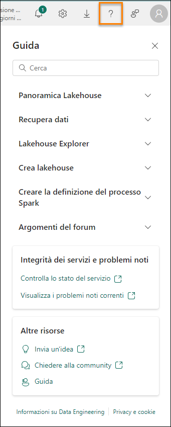

# Microsoft Fabric - Fabric Analyst in un giorno - Lab 4

# Sommario

- Introduzione

- Flusso di dati Gen2

    - Attività 1: Copia di query SharePoint nel flusso di dati 

    - Attività 2: Creazione della connessione a SharePoint

    - Attività 3: Configurazione della destinazione dei dati per la query People 

    - Attività 4: Pubblicazione e ridenominazione del flusso di dati SharePoint

    - Attività 5: Copia di query di Snowflake nel flusso di dati

    - Attività 6: Creazione della connessione a Snowflake 

    - Attività 7: Configurazione della destinazione dei dati per le query Supplier e PO

    - Attività 8 - Ridenominazione e pubblicazione del flusso di dati Snowflake 

- Collegamento ad ADLS Gen2 

    - Attività 9: Come creare un collegamento a Dataverse

    - Attività 10: Creazione di un collegamento al lakehouse 

- Riferiment

# Introduzione

Nel nostro scenario, i dati sui fornitori si trovano in Snowflake, i dati sui clienti si trovano in Dataverse e i dati sui dipendenti si trovano in SharePoint. Tutte queste origini dati vengono aggiornate in momenti diversi. Per ridurre al minimo il numero di aggiornamenti dei dati dei flussi di dati, creeremo flussi di dati individuali per le origini dati Snowflake e SharePoint.

**Nota**: è supportata la presenza di più origini dati in un unico flusso di dati.

Il team IT ha già stabilito un collegamento a Dataverse e applicato le necessarie trasformazioni dei dati, eseguendone il mirroring nel file Power BI Desktop. Ha inserito questi dati nel lakehouse nell'area di lavoro di amministrazione e ha concesso l'accesso alle tabelle. Ora procederemo a creare un collegamento per il lakehouse creato dal team IT.

In questo lab si apprenderà quanto segue: 

- Come stabilire una connessione a SharePoint mediante Flusso di dati Gen2 e inserire dati in lakehouse.

- Come stabilire una connessione a Snowflake tramite Flusso di dati Gen2 e inserire dati in Lakehouse.

- Come inserire dati in un lakehouse condiviso.

# Flusso di dati Gen2

## Attività 1: Copia di query SharePoint nel flusso di dati

1. Torniamo all'area di lavoro di Fabric **FAIAD_\<nome utente>** creata nel Lab 2, Attività 9.

2. Selezionare l'icona **selettore esperienza Fabric in basso** a sinistra della schermata. Si apre la finestra di dialogo Esperienza Fabric

3. Selezionare **Data Factory** nella finestra di dialogo. Verrà visualizzata la **home page di Data Factory**.

    

4. Nella sezione dedicata agli elementi consigliati, selezionare **Flusso di dati Gen2.**

    

    Verrà visualizzata la pagina **Flusso di dati**. L'interfaccia di Flusso di dati Gen2 è simile a Power Query in Power BI Desktop. Possiamo copiare le query da Power BI Desktop a Flusso di dati Gen2. Proviamo.

5. Se non è già stato fatto, aprire il file **FAIAD.pbix** che si trova nella cartella **Reports** sul desktop dell'ambiente lab. 

6. Nella barra multifunzione selezionare **Home -> Trasforma dati**. Si apre la finestra Power Query. Come si è notato nel lab precedente, le query nel pannello di sinistra sono organizzate per origine dati.

7. Dal pannello di sinistra **selezionare** la query **People** nella cartella SharepointData.

8. **Fare clic con il pulsante destro del mouse** e selezionare **Copia**.

    

9. Tornare alla schermata **Flusso di dati** nel browser.

10. Nel **riquadro Flusso di dati** premere **CTRL+V** (l'opzione Incolla del menu del pulsante destro non è attualmente supportata). Se si usa un dispositivo MAC, usare Cmd+V per incollare.

    **Nota**: se si lavora in un ambiente lab, selezionare i puntini di sospensione in alto a destra della schermata. Usare il dispositivo di scorrimento per **abilitare VM Native Clipboard**. Nella finestra di dialogo selezionare OK. Dopo aver incollato le query è possibile disabilitare questa opzione.

    Notare che la query viene incollata ed è disponibile nel pannello di sinistra. Poiché non abbiamo creato una connessione a SharePoint, compare un messaggio di avviso che chiede di configurare la connessione.

## Attività 2: Creazione della connessione a SharePoint

1. Selezionare **Configura connessione**.

    

2. Si apre la finestra di dialogo Connetti a origine dati. Assicurarsi che nel menu a discesa **Connessione** sia selezionato **Crea nuova connessione**.

3. Il **Tipo di autenticazione** dovrebbe essere **Account aziendale**.

4. Selezionare **Connetti**.

    **Nota**: l'accesso verrà eseguito usando le proprie credenziali. Saranno diverse rispetto allo screenshot qui sotto.

    

## Attività 3: Configurazione della destinazione dei dati per la query People

Viene stabilita la connessione ed è possibile visualizzare i dati nel pannello di anteprima. Esplorare i Passaggi applicati delle query. Ora dobbiamo inserire i dati di People in Lakehouse.

1. Selezionare la query **People**.

2. Nella barra multifunzione selezionare **Home -> Aggiungi destinazione dati -> Lakehouse**.

    

3. Si apre la finestra di dialogo Connetti alla destinazione dati. Dobbiamo creare una nuova connessione a Lakehouse. Con l'opzione **Crea nuova connessione** selezionata nel menu a discesa **Connessione** e **Tipo di autenticazione** impostato su **Account aziendale**, selezionare **Avanti**.

    

4. Si apre la finestra di dialogo Scegliere il target di destinazione. Assicurarsi che il pulsante di opzione **Nuova tabella** sia selezionato, poiché si sta creando una nuova tabella.

5. Vogliamo creare la tabella nel Lakehouse creato in precedenza. Nel pannello di sinistra andare a **Lakehouse -> FAIAD_\<nomeutente>**.

6. Selezionare **lh_FAIAD**

7. Lasciare il nome della tabella **People**

8. Selezionare **Avanti**.

    

9. Si apre la finestra di dialogo Scegli le impostazioni di destinazione. Assicurarsi che l'opzione "**Usa impostazioni automatiche**" sia **abilitata**. 

    **Nota**: se si disabilitano le impostazioni automatiche, si potrà notare che sono disponibili opzioni per impostare il metodo di aggiornamento e opzioni dello schema. Dopo aver vagliato le possibilità offerte, assicurarsi che l'opzione "**Usa impostazioni automatiche**" sia **abilitata**. 

10. Selezionare **Salva impostazioni**.

    

## Attività 4: Pubblicazione e ridenominazione del flusso di dati SharePoint

1. Si apre nuovamente la **finestra di Power Query**. Nell'**angolo in basso a destra** notare che la Destinazione dati è impostata su **Lakehouse**.

2. Nell'angolo inferiore destro selezionare **Pubblica**.

    

    **Nota**: si tornerà all'**area di lavoro FAIAD_\<nome utente>**. La pubblicazione del flusso di dati potrebbe richiedere alcuni istanti. 

3. Stiamo lavorando in Dataflow 1. Rinominiamolo prima di continuare. Fare clic sui **puntini di sospensione (…)** accanto a Dataflow 1. Selezionare **Proprietà**.

    

4. Si apre la finestra di dialogo Proprietà flusso di dati. Cambiarne il **Nome** in **df_People_SharePoint**.

5. Nella casella di testo **Descrizione** aggiungere **Flusso di dati per inserire i dati di People da SharePoint in Lakehouse**.

6. Selezionare **Salva**.

    

    Si tornerà all'area di lavoro **FAIAD_\<nome utente>**.

7. Selezionare **lh_FAIAD** per spostarsi nel lakehouse.

8. Accertarsi di essere nella vista Lakehouse (non nell'endpoint di Analisi SQL).

9. Notare la tabella **People** ora disponibile nel lakehouse.

    **Nota**: se le tabelle appena create non sono visibili, selezionare i puntini di sospensione accanto a Tables e selezionare Aggiorna per aggiornare le tabelle.

    Ora abbiamo inserito tutti i dati nel lakehouse. Nel prossimo lab pianificheremo l'aggiornamento del flusso di dati.

## Attività 5: Copia di query di Snowflake nel flusso di dati

1. Torniamo all'area di lavoro di Fabric **FAIAD_\<nome utente>**.

2. Nel menu in alto selezionare **Nuovo -> Flusso di dati Gen2**.

    

    Verrà visualizzata la pagina **Flusso di dati**. Ora che abbiamo familiarità con Flusso di dati, procediamo con la copia delle query da Power BI Desktop a Flusso di dati.

3. Se non è già stato fatto, aprire il file **FAIAD.pbix** che si trova nella cartella **Reports** sul desktop dell'ambiente lab. 

4. Nella barra multifunzione selezionare **Home -> Trasforma dati**. Si apre la finestra Power Query. Come si è notato nel lab precedente, le query nel pannello di sinistra sono organizzate per origine dati.

5. Nel pannello di sinistra selezionare le seguenti query nella cartella SnowflakeData tenendo premuto il tasto **CTRL o MAIUSC**:
    
    a. SupplierCategories
    
    b. Suppliers
    
    c. Supplier
    
    d. PO
    
    e. PO Line Items

6. **Fare clic con il pulsante destro del mouse** e selezionare **Copia**.

    

7. Tornare al **browser**.

8. Nel **riquadro Flusso di dati** selezionare il **riquadro centrale** e premere **CTRL+V** (l'opzione Incolla del menu del pulsante destro non è attualmente supportata). Se si usa un dispositivo MAC, usare Cmd+V per incollare.

    **Nota**: se si lavora in un ambiente lab, selezionare i puntini di sospensione in alto a destra della schermata. Usare il dispositivo di scorrimento per **abilitare VM Native Clipboard**. Nella finestra di  dialogo selezionare OK. Dopo aver incollato le query è possibile disabilitare questa opzione.

    

## Attività 6: Creazione della connessione a Snowflake

Notare che le cinque query vengono incollate e sulla sinistra è visualizzato il pannello Query. Poiché non abbiamo creato una connessione a Snowflake, compare un messaggio di avviso che chiede di configurare la connessione.

1. Selezionare **Configura connessione**.

    

2. Si apre la finestra di dialogo Connetti a origine dati. Assicurarsi che nel menu a discesa **Connessione** sia selezionato **Crea nuova connessione**.

3. Il **Tipo di autenticazione** dovrebbe essere impostato su **Snowflake**.

4. Immettere **nome utente e password di Snowflake** disponibili nella scheda Variabili di ambiente (accanto alla scheda Guida al lab).

5. Selezionare **Connetti**.

    

    Viene stabilita la connessione ed è possibile visualizzare i dati nel pannello di anteprima. Esplorare i Passaggi applicati delle query. In genere, la query Suppliers contiene i dettagli sui fornitori e SupplierCategories contiene le categorie di fornitori. Queste due tabelle vengono unite per creare la dimensione Supplier, con le colonne necessarie. Analogamente, PO Line Items viene unita con PO per creare il fatto PO. Ora dobbiamo inserire i dati di Supplier e PO in Lakehouse.

## Attività 7: Configurazione della destinazione dei dati per le query Supplier e PO

1. Seleziona la query **Supplier**.

2. Nella barra multifunzione selezionare **Home -> Aggiungi destinazione dati -> Lakehouse**.

    

3. Si apre la finestra di dialogo Connetti alla destinazione dati. Nel **menu a discesa Connessione** selezionare **Lakehouse (nessuno)**.

4. Selezionare **Avanti**.

    

5. Si apre la finestra di dialogo Scegliere il target di destinazione. Assicurarsi che il pulsante di opzione **Nuova tabella** sia **selezionato**, poiché si sta creando una nuova tabella.

6. Vogliamo creare la tabella nel Lakehouse creato in precedenza. Nel pannello di sinistra andare a **Lakehouse -> FAIAD_\<nomeutente>**.

7. Selezionare **lh_FAIAD**

8. Lasciare il nome della tabella **Supplier**

9. Selezionare **Avanti**.

    

10. Si apre la finestra di dialogo Scegli le impostazioni di destinazione. Useremo le impostazioni automatiche perché i dati verranno aggiornati completamente. Inoltre, le colonne verranno rinominate secondo necessità. Selezionare **Salva impostazioni**.

    

11. Si apre nuovamente la **finestra di Power Query**. Nell'angolo in basso a destra notare che la **Destinazione dati** è impostata su **Lakehouse**. Allo stesso modo, **impostare la Destinazione dati per la query PO**. Al termine, la **Destinazione dati** della query PO dovrebbe essere impostata su **Lakehouse** come illustrato nello screenshot.

    

## Attività 8 - Ridenominazione e pubblicazione del flusso di dati Snowflake

1. Nella parte superiore dello schermo selezionare la **freccia accanto a Dataflow 1** per rinominarlo.

2. Nella finestra di dialogo cambiarne il nome in **df_Supplier_Snowflake**

3. Premere **INVIO** per salvare la modifica del nome.

    

4. Nell'angolo inferiore destro selezionare **Pubblica**.

    

    Si tornerà all'area di lavoro **FAIAD_\<nome utente>**. La pubblicazione del flusso di dati potrebbe richiedere alcuni istanti.

5. Selezionare **lh_FAIAD** per spostarsi nel lakehouse.

6. Accertarsi di essere nella vista Lakehouse (non nell'endpoint di Analisi SQL).

7. Notare le tabelle **PO** e **Supplier** ora disponibili nel lakehouse.

    **Nota**: se le tabelle appena create non sono visibili, selezionare i puntini di sospensione accanto a Tables e selezionare Aggiorna per aggiornare le tabelle.

    Ora creiamo un collegamento per importare i dati da Dataverse.

# Collegamento ad ADLS Gen2

## Attività 9: Come creare un collegamento a Dataverse

Ci si dovrebbe trovare nel lakehouse **lh_FAIAD**. Accertarsi di essere nella vista Lakehouse (non nell'endpoint di Analisi SQL).

1. Nel pannello **Explorer** selezionare i **puntini di sospensione** accanto a **Tables**.

2. Selezionare **Nuovo collegamento**.

    

3. Viene visualizzata la finestra di dialogo Nuovo collegamento. In **Origini esterne** selezionare **Dataverse**.

    **Nota**: nel lab precedente abbiamo seguito passaggi simili per creare un collegamento a Azure Data Lake Storage Gen2.

    

4. Si apre la finestra di dialogo Impostazioni connessione. Immettere **org6c18814a.crm.dynamics.com** come **Dominio dell'ambiente**.

5. Lasciare **Tipo di autenticazione** come **Account aziendale**.

6. Selezionare **Accedi**.

    

7. Viene visualizzata la finestra di dialogo Accedi al tuo account. **Selezionare il proprio account** per effettuare l'accesso.

    **Nota**: l'account sarà diverso rispetto allo screenshot di seguito.

    

8. Selezionare **Avanti** nella finestra di dialogo Impostazioni connessione.

    Si verrà indirizzati a una finestra di dialogo in cui sarà possibile scegliere un bucket/una directory diverso da Dataverse. Notare che sono presenti numerosi bucket diversi. Possiamo selezionare i bucket di cui abbiamo bisogno e seguire il processo come nel Lab 3 (usare una query visiva per trasformare i dati e creare viste). Possiamo anche usare il flusso di dati Gen2 come abbiamo fatto in precedenza in questo lab per stabilire una connessione a SharePoint. Tuttavia, vogliamo segnalare un'altra opzione disponibile.

    Nel nostro scenario, il team IT ha già stabilito un collegamento a Dataverse e applicato le necessarie trasformazioni dei dati, eseguendone il mirroring nel file Power BI Desktop. Ha inserito questi dati nel lakehouse nell'area di lavoro di amministrazione e ha concesso l'accesso alle tabelle. Dal momento che il team IT ha già fatto la parte più complessa del lavoro, possiamo creare un collegamento a questo lakehouse nell'area di lavoro Amministrazione.

9. Selezionare **Annulla** nella finestra di dialogo Nuovo collegamento per tornare al lakehouse.

    

## Attività 10: Creazione di un collegamento al lakehouse

1. Nel pannello **Explorer** selezionare i **puntini di sospensione** accanto a **Tables**.

2. Selezionare **Nuovo collegamento**.

    

3. Viene visualizzata la finestra di dialogo Nuovo collegamento. Selezionare l'opzione **Microsoft OneLake** in Origini interne.

    

4. Viene visualizzata la finestra di dialogo Selezionare il tipo di origine dati. Come si può notare, ora 
sono disponibili due origini dati.

    a. lh_FAIAD: questo è il lakehouse creato personalmente.

    b. lh_dataverse: questo è il lakehouse creato dall'amministratore.

5. Selezionare **lh_dataverse**.

6. Selezionare **Avanti**.

    

7. Nel pannello di sinistra espandere **lh_dataverse -> Tables**. Notare che l'amministratore IT ha concesso l'accesso alla tabella Customer.

8. Selezionare **Customer**.

9. Selezionare **Avanti**.

    

10. Selezionare **Crea** nella successiva finestra di dialogo. Si tornerà al lakehouse lh_FAIAD.

    

11. Nel pannello **Explorer** a sinistra, notare la tabella **Customer** appena creata.

12. Selezionare la tabella **Customer** per visualizzare i dati nel pannello di anteprima.

Abbiamo creato un collegamento a un altro lakehouse.

Nel prossimo lab pianificheremo gli aggiornamenti della pianificazione.

# Riferimenti

Fabric Analyst in a Day (FAIAD) presenta alcune delle funzionalità chiave disponibili in Microsoft Fabric. Nel menu di servizio, la sezione Guida (?) include collegamenti ad alcune risorse utili.

Di seguito sono riportate ulteriori risorse utili che consentiranno di progredire nell'uso di Microsoft Fabric.

- Vedere il post di blog per leggere l'[annuncio completo sulla disponibilità generale di Microsoft Fabric](https://aka.ms/Fabric-Hero-Blog-Ignite23)
- Esplorare Fabric attraverso la [Presentazione guidata](https://aka.ms/Fabric-GuidedTour)
- Iscriversi alla [versione di valutazione gratuita di Microsoft Fabric](https://aka.ms/try-fabric)
- Visitare il [sito Web di Microsoft Fabric](https://aka.ms/microsoft-fabric)
- Acquisire nuove competenze esplorando i [moduli di apprendimento su Fabric](https://aka.ms/learn-fabric)
- Consultare la [documentazione tecnica di Fabric](https://aka.ms/fabric-docs)
- Leggere l'[e-book gratuito introduttivo a Fabric](https://aka.ms/fabric-get-started-ebook)
- Unirsi alla [community di Fabric](https://aka.ms/fabric-community) per pubblicare domande, condividere feedback e imparare dagli altri

Leggere i blog di annunci più approfonditi sull'esperienza Fabric:

- [Blog sull'esperienza Data Factory in Fabric](https://aka.ms/Fabric-Data-Factory-Blog)
- [Blog sull'esperienza Synapse Data Engineering in Fabric](https://aka.ms/Fabric-DE-Blog)
- [Blog sull'esperienza Synapse Data Science in Fabric](https://aka.ms/Fabric-DS-Blog)
- [Blog sull'esperienza Synapse Data Warehousing in Fabric](https://aka.ms/Fabric-DW-Blog)
- [Blog sull'esperienza Synapse Real-Time Analytics in Fabric](https://aka.ms/Fabric-RTA-Blog)

- [Blog di annunci di Power BI](https://aka.ms/Fabric-PBI-Blog)
- [Blog sull'esperienza Data Activator in Fabric](https://aka.ms/Fabric-DA-Blog)
- [Blog su amministrazione e governance in Fabric](https://aka.ms/Fabric-Admin-Gov-Blog)
- [Blog su OneLake in Fabric](https://aka.ms/Fabric-OneLake-Blog)
- [Blog sull'integrazione di Dataverse e Microsoft Fabric](https://aka.ms/Dataverse-Fabric-Blog)

© 2023 Microsoft Corporation. Tutti i diritti sono riservati.

L'uso della demo/del lab implica l'accettazione delle seguenti condizioni:

La tecnologia/le funzionalità descritte nella demo/nel lab sono fornite da Microsoft Corporation allo scopo di ottenere feedback dall'utente e offrire un'esperienza di apprendimento. L'utilizzo della demo/del lab è consentito solo per la valutazione delle caratteristiche e delle funzionalità di tale tecnologia e per l'invio di feedback a Microsoft. L'utilizzo per qualsiasi altro scopo non è consentito. È vietato modificare, copiare, distribuire, trasmettere, visualizzare, eseguire, 
riprodurre, pubblicare, concedere in licenza, usare per la creazione di lavori derivati, trasferire o vendere questa demo/questo lab o parte di essi.

SONO ESPLICITAMENTE PROIBITE LA COPIA E LA RIPRODUZIONE DELLA DEMO/DEL LAB (O DI QUALSIASI PARTE DI ESSI) IN QUALSIASI ALTRO SERVER O IN QUALSIASI ALTRA POSIZIONE PER ULTERIORE RIPRODUZIONE O RIDISTRIBUZIONE.

QUESTA DEMO/QUESTO LAB RENDONO DISPONIBILI TECNOLOGIE SOFTWARE/FUNZIONALITÀ DI PRODOTTO SPECIFICHE, INCLUSI NUOVI CONCETTI E NUOVE FUNZIONALITÀ POTENZIALI, IN UN AMBIENTE SIMULATO, CON UN'INSTALLAZIONE E UNA CONFIGURAZIONE PRIVE DI COMPLESSITÀ, PER GLI SCOPI DESCRITTI IN PRECEDENZA. LA TECNOLOGIA/I CONCETTI RAPPRESENTATI IN QUESTA DEMO/IN QUESTO LAB POTREBBERO NON CONTENERE LE FUNZIONALITÀ COMPLETE E IL LORO FUNZIONAMENTO POTREBBE NON ESSERE LO STESSO DELLA VERSIONE FINALE. È ANCHE 
POSSIBILE CHE UNA VERSIONE FINALE DI TALI FUNZIONALITÀ O CONCETTI NON VENGA RILASCIATA. L'ESPERIENZA D'USO DI TALI CARATTERISTICHE E FUNZIONALITÀ PUÒ INOLTRE RISULTARE DIVERSA IN UN AMBIENTE FISICO.

**FEEDBACK**. L'invio a Microsoft di feedback sulle caratteristiche, sulle funzionalità e/o sui concetti della tecnologia descritti in questa demo/questo lab implica la concessione a Microsoft, a titolo gratuito, del diritto di utilizzare, condividere e commercializzare tale feedback in qualsiasi modo e per qualsiasi scopo. Implica anche la concessione a titolo gratuito a terze parti del diritto di utilizzo di eventuali brevetti necessari per i loro prodotti, le loro tecnologie e i loro servizi al fine di utilizzare o interfacciarsi ai componenti software o ai servizi Microsoft specifici che includono il feedback. L'utente si impegna a non inviare feedback la cui inclusione all'interno di software o 
documentazione Microsoft imponga a Microsoft di concedere in licenza a terze parti tale software o documentazione. Questi diritti sussisteranno anche dopo la scadenza del presente contratto.

CON LA PRESENTE MICROSOFT CORPORATION NON RICONOSCE ALCUNA GARANZIA O 
CONDIZIONE RELATIVAMENTE ALLA DEMO/AL LAB, INCLUSE TUTTE LE GARANZIE E CONDIZIONI DI COMMERCIABILITÀ, DI FATTO ESPRESSE, IMPLICITE O PRESCRITTE DALLA LEGGE, ADEGUATEZZA PER UNO SCOPO SPECIFICO, TITOLARITÀ E NON VIOLABILITÀ. MICROSOFT NON OFFRE GARANZIE O RAPPRESENTAZIONI IN RELAZIONE ALL'ACCURATEZZA DEI RISULTATI E DELL'OUTPUT DERIVANTI DALL'USO DELLA DEMO/DEL LAB O ALL'ADEGUATEZZA DELLE INFORMAZIONI CONTENUTE NELLA DEMO/NEL LAB PER QUALSIASI SCOPO.

### CLAUSOLA DI RESPONSABILITÀ

Questa demo/questo lab contiene solo una parte delle nuove funzionalità e dei miglioramenti in Microsoft Power BI. Alcune funzionalità potrebbero cambiare nelle versioni future del prodotto. In questa demo/in questo lab si apprendono alcune delle nuove funzionalità, ma non tutte.
