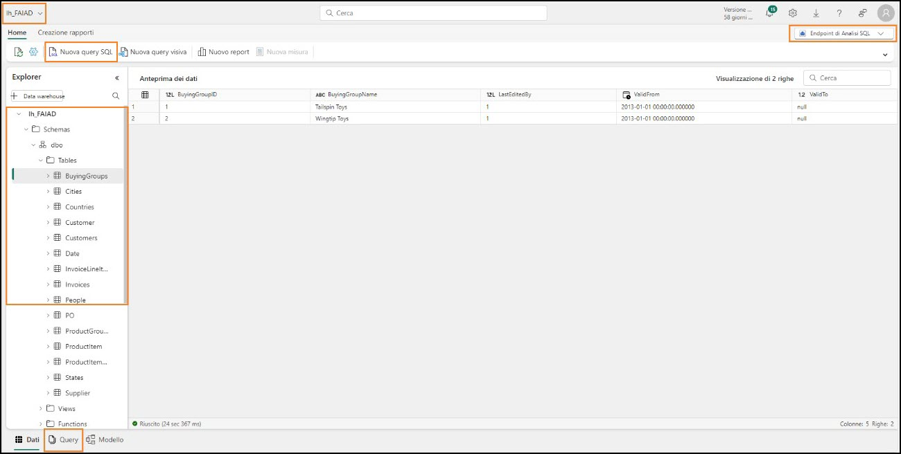
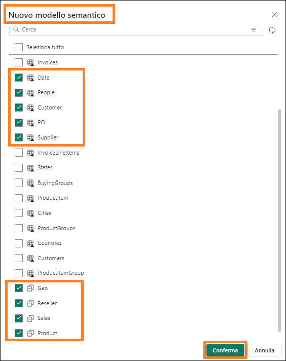
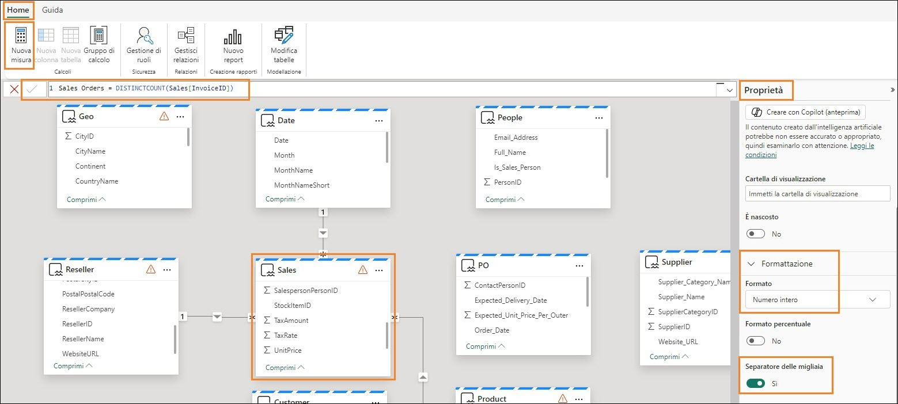

# Microsoft Fabric - Fabric Analyst in un giorno - Lab 6


# Sommario

- Introduzione

- Lakehouse: analisi di dati 

    - Attività 1: Query sui dati mediante SQL 

    - Attività 2: Visualizzazione del risultato T-SQL

- Lakehouse: modellazione semantica

    - Attività 3: Creazione di un modello semantico 

    - Attività 4: Creazione di relazioni 

    - Attività 5: Creazione delle misure 

    - Attività 6: Sezione facoltativa: creazione delle relazioni

    - Attività 7: Sezione facoltativa: creazione delle misure

- Riferimenti 

# Introduzione 

Abbiamo inserito dati provenienti da diverse origini dati in Lakehouse. In questo lab si lavorerà con il modello semantico. In genere, eseguiamo attività di modellazione quali la creazione di relazioni, l'aggiunta di misure, ecc. in Power BI Desktop. Qui impareremo a eseguire queste attività di modellazione nel servizio. 

In questo lab si apprenderà quanto segue:

- Uso della vista SQL nell'endpoint di Analisi SQL
- Creazione di un modello semantico

# Lakehouse: analisi di dati

## Attività 1: Query sui dati mediante SQL

1. Torniamo all'area di lavoro di Fabric **FAIAD_\<nome utente>** creata nel Lab 2, Attività 9.

2. Se si preferisce, è possibile **ridurre a icona il flusso di attività** per visualizzare l'elenco completo 
degli elementi.

3. Saranno visibili tre tipi di lh_FAIAD, Lakehouse, modello semantico ed endpoint SQL. In un lab 
precedente abbiamo esaminato il lakehouse e creato query visive usando l'endpoint di Analisi 
SQL. Selezionare l'opzione **lh_FAIAD - Endpoint di Analisi SQL** per continuare a esplorare questa 
opzione. Si aprirà la **vista SQL** di Explorer.

    

    Se si desidera esplorare i dati prima di creare un modello di dati, è possibile usare SQL a questo fine. Sono disponibili due opzioni per usare SQL. La prima opzione è la query visiva, che abbiamo usato nel 
    lab precedente. La seconda opzione è la scrittura di codice TSQL. Si tratta di un'opzione pensata per gli sviluppatori. Esaminiamola assieme. 

    Supponiamo di voler conoscere rapidamente le unità Units dal fornitore mediante SQL.

    Nell'endpoint di Analisi SQL del lakehouse, come indicato nel pannello di sinistra, è possibile visualizzare le tabelle. Espandendo le tabelle, si possono visualizzare le colonne che compongono la tabella. Vi sono inoltre opzioni per la creazione di viste SQL, funzioni e stored procedure. Se si ha familiarità con SQL, è possibile esplorare queste opzioni. Proviamo a scrivere una semplice query SQL.

4. Nel **menu in alto** selezionare **Nuova query SQL** oppure nella **parte inferiore del pannello di sinistra** selezionare **Query**. Si aprirà la vista della query SQL.

       

5. Incollare la **query SQL seguente** nella **finestra della query**. Questa query restituirà le unità in base al nome del fornitore. Per ottenere questo risultato è necessario unire la tabella Sales alle 
tabelle Product e Supplier.

    ```
    SELECT su.SupplierName, SUM(Quantity) as Units
    FROM dbo.Sales s
    JOIN dbo.Product p on p.StockItemID = s.StockItemID
    JOIN dbo.Supplier su on su.SupplierID = p.SupplierID
    GROUP BY su.SupplierName
    ```

6. Fare clic su **Esegui** nel menu dell'editor SQL per visualizzare i risultati.

7. Notare che è disponibile un'opzione per salvare questa query come vista selezionando **Salva come visualizzazione**.

8. Nel pannello di **sinistra Explorer**, nella sezione **Query** notare che questa query è salvata in **Query personali** come **SQL query 1**. Ciò consente di rinominare la query e salvarla per l'uso futuro. È inoltre presente un'opzione per visualizzare le query condivise con l'utente corrente mediante la cartella **Query condivise**.

    **Nota:** le query visive create nei lab precedenti sono disponibili anche nella cartella My queries.

    

## Attività 2: Visualizzazione del risultato T-SQL

1. Possiamo anche visualizzare il risultato di questa query. **Evidenziare la query** nel riquadro delle query 

2. Nel menu del riquadro Risultati, selezionare **Esplorare questi dati (anteprima) -> Visualizza risultati**.

    

3. Si apre la finestra di dialogo **Visualizza risultati** . Selezionare **Continua**.

    Si apre la finestra di dialogo **Visualizza risultati** che ha un aspetto simile alla vista del report Power BI 
    Desktop. Presenta tutte le funzionalità disponibili nella vista del report Power BI Desktop: è possibile 
    formattare la pagina, selezionare diversi oggetti visivi, formattare gli oggetti visivi, aggiungere filtri, 
    ecc. Non esploreremo queste opzioni in questo corso.

4. Espandere il riquadro **Dati**, quindi espandere **Query SQL 1**.

5. Selezionare i campi **Supplier_Name** e **Units**. Viene creato un oggetto visivo tabella.

    

6. Nella sezione **Visualizzazioni** cambiare il tipo di oggetto visivo selezionando l'**istogramma in pila**.

7. Selezionare **Salvare come report**  in basso a destra della schermata.

    

8. Si apre la finestra di dialogo Salva il report. Digitare **Units per fornitore** nella casella di testo **Immettere un nome per il report**.

9. Assicurarsi che l'area di lavoro di destinazione sia l'area di lavoro di Fabric **FAIAD\<nomeutente>**

10. Selezionare **Salva**.

    

    Si aprirà nuovamente la schermata Query SQL.

# Lakehouse: modellazione semantica

## Attività 3: Creazione di un modello semantico

1. Nel **pannello inferiore** selezionare **Modello**. Il riquadro centrale è simile alla vista Modello presente in Power BI Desktop. 

    

    Questo è il modello predefinito creato dal lakehouse. Tuttavia, il modello predefinito presenta alcune limitazioni (ad esempio la possibilità di formattare le misure, ecc.). Inoltre, nel nostro modello abbiamo bisogno solo di un sottoinsieme delle tabelle. Quindi procederemo alla creazione di un nuovo modello semantico.
    
2. Dal menu in alto a destra **selezionare la freccia accanto all'endpoint di Analisi SQL**.

3. Selezionare **Lakehouse** per passare alla vista Lakehouse.

    

4. Nel menu selezionare **Home -> Nuovo modello semantico**.

5. Viene visualizzata la finestra di dialogo Nuovo modello semantico. Immettere **sm_FAIAD** come nome del modello semantico Direct Lake.

6. Per impostazione predefinita abbiamo la possibilità di selezionare un sottoinsieme delle tabelle. tenere presente che nel lab precedente avevamo creato delle viste. Ora vogliamo includere queste viste nel modello. **Fare clic** sull'**icona** nella **barra di ricerca** e selezionare **Mostra viste**. Ora abbiamo la possibilità di visualizzare e selezionare le viste.

    

7. **Selezionare** le seguenti tabelle/viste:
    
    **a. Date**

    **b. People**

    **c. Customer**

    **d. PO**

    **e. Supplier**

    **f. Geo**

    **g. Reseller**

    **h. Sales**

    **i. Product**

8. Selezionare **Conferma**.

    

## Attività 4: Creazione di relazioni

Verrà visualizzato il nuovo modello semantico con le tabelle selezionate. È possibile **ridisporre** liberamente le tabelle in base alle esigenze. Notare che alcune tabelle (Geo, Reseller, Sales e Product) presentano un segnale di avviso in alto a destra. Questo perché si tratta di viste. Tutti gli oggetti visivi creati con campi a partire da queste viste saranno in modalità Direct Query e non in modalità Direct Lake. 

**Nota:** la modalità Direct Lake è più veloce della modalità Direct Query. 


Il primo passaggio permette di creare relazioni tra queste tabelle.

1. Creiamo una relazione tra le tabelle Sales e Reseller. Selezionare **ResellerID** dalla tabella **Sales** e trascinarlo su **ResellerID** nella tabella **Reseller**.

    

10. Si apre la finestra di dialogo Nuova relazione. Assicurarsi che **Da tabella** sia **Sales** e che la **Colonna** sia **ResellerID**.

11. Assicurarsi che **Nella tabella** sia **Reseller** e che la **Colonna** sia **ResellerID**.

12. Assicurarsi che il campo **Cardinalità** sia impostato su **Molti a uno (*:1)**.

13. Assicurarsi che il campo **Direzione filtro incrociato** sia impostato su **Singola**.

14. Selezionare **Salva**.

    

15. Allo stesso modo, creiamo una relazione tra le tabelle Sales e Date. Selezionare **InvoiceDate** dalla tabella **Sales** e trascinarlo su **Date** nella tabella **Date**.

16. Si apre la finestra di dialogo Nuova relazione. Assicurarsi che **Da tabella** sia **Sales** e che la **Colonna** sia **InvoiceDate**.

17. Assicurarsi che **Nella tabella** sia **Date** e che la **Colonna** sia **Date**.

18. Assicurarsi che il campo **Cardinalità** sia impostato su **Molti a uno (*:1)**.

19. Assicurarsi che il campo **Direzione filtro incrociato** sia impostato su **Singola**.

20. Selezionare **Salva**.

    

21. Analogamente, creare una relazione molti-a-uno tra le tabelle **Sales** e **Product**. Selezionare **StockItemID** dalla tabella **Sales** e **StockItemID** dalla tabella **Product**.

    **Nota:** tutti i nostri aggiornamenti vengono salvati automaticamente.

    **Checkpoint:** il modello dovrebbe avere le tre relazioni tra le tabelle Sales e Reseller e le tabelle Sales 
    e Date e Sales e Product come mostrato nello screenshot seguente:

    

    Per motivi di tempo, non creeremo tutte le relazioni. Se il tempo lo consente, è possibile completare la sezione facoltativa alla fine del laboratorio. La sezione facoltativa illustra i passaggi per creare le relazioni rimanenti.

## Attività 5: Creazione delle misure
Aggiungiamo alcune misure necessarie per creare il dashboard Sales.

1. Selezionare la tabella **Sales** dalla vista del modello. Vogliamo aggiungere le misure alla tabella 
Sales.

2. Nel menu in alto selezionare **Home -> Nuova misura**. Notare che viene visualizzata la barra della 
formula.

3. Immettere **Sales = SUM(Sales[Sales Amount])** nella **barra della formula**.

4. Fare clic sul **segno di spunta** a sinistra della barra della formula o premere il tasto **INVIO**.

5. Espandere il pannello delle proprietà a destra.

6. Espandere la sezione **Formattazione**.

7. Nel menu a discesa **Formato** selezionare **Valuta**.

8. Impostare Posizioni decimali su **0**.

    

9. Con la tabella **Sales** selezionata nel menu in alto, selezionare **Home -> Nuova misura**. Notare che viene visualizzata la barra della formula.

10. Immettere **Units = SUM(Sales[Quantity])** nella **barra della formula**.

11. Fare clic sul **segno di spunta** a sinistra della barra della formula o premere il tasto **INVIO**.

12. Nel pannello Proprietà a destra espandere la sezione **Formattazione** (il caricamento del pannello Proprietà potrebbe richiedere alcuni istanti).

13. Nell'elenco a discesa **Formato** selezionare **Numero intero**.

14. Usare il dispositivo di scorrimento per impostare il **Separatore delle migliaia su Sì**.

    

15. Con la tabella Sales selezionata nel menu in alto, selezionare **Home -> Nuova misura**. Notare che viene visualizzata la barra della formula.

16. Immettere **Sales Orders = DISTINCTCOUNT(Sales[InvoiceID])** nella **barra della formula**.

17. Fare clic sul **segno di spunta** a sinistra della barra della formula o premere il tasto **INVIO**.

18. Nel pannello Proprietà a destra espandere la sezione **Formattazione**.

19. Nell'elenco a discesa **Formato** selezionare **Numero intero**.
20. Usare il dispositivo di scorrimento per impostare il **Separatore delle migliaia** su **Sì**.

    

21. Nel **pannello dati** (a destra) selezionare **Modello**. Notare che questa operazione fornisce una vista che semplificherà l'organizzazione di tutti gli elementi nel modello semantico.

22. Espandere **Modello semantico -> Misure** per visualizzare tutte le misure appena create.

23. È anche possibile **espandere le singole tabelle** per visualizzare le colonne, le gerarchie e le misure in ciascuna di esse.

    

    Anche in questo caso, per motivi di tempo non creeremo tutte le misure. Se il tempo lo consente, è possibile completare la sezione facoltativa alla fine del laboratorio. La sezione facoltativa illustra i passaggi per creare le misure rimanenti.

    Abbiamo creato un modello semantico, il passaggio successivo è creare un report. Ce ne occuperemo nel prossimo lab.

## Attività 6: Sezione facoltativa: creazione delle relazioni
Aggiungiamo le relazioni rimanenti.

1. Nel menu in alto selezionare Home -> Gestisci relazioni.

2. Viene visualizzata la finestra di dialogo Gestisci relazioni. Selezionare Nuova relazione.

    

3. Si apre la finestra di dialogo Nuova relazione. Assicurarsi che **Da tabella** sia **Sales** e che la **Colonna** sia **SalespersonPersonID**.

4. Assicurarsi che **Nella tabella** sia **People** e che la **Colonna** sia **PersonID**.

5. Assicurarsi che il campo **Cardinalità** sia impostato su **Molti a uno (*:1)**.

6. Assicurarsi che il campo **Direzione filtro incrociato** sia impostato su **Singola**.

7. Selezionare **Salva**. Viene visualizzata la finestra di dialogo Gestisci relazioni con la nuova relazione 
aggiunta.

    

8. Creiamo ora una relazione tra Product e Supplier. Selezionare **Nuova relazione**.

9. Assicurarsi che **Da tabella** sia **Product** e che la **Colonna** sia **SupplierID**.

10. Assicurarsi che **Nella tabella** sia **Supplier** e che la **Colonna** sia **SupplierID**.

11. Assicurarsi che il campo **Cardinalità** sia impostato su **Molti a uno (*:1)**.

12. Assicurarsi che il campo **Direzione filtro incrociato** sia impostato su **Entrambi**.

13. Selezionare **Salva**.

    

14. Creiamo ora una relazione tra Reseller e Geo. Selezionare **Nuova relazione**.

15. Si apre la finestra di dialogo Nuova relazione. Assicurarsi che **Da tabella** sia **Reseller** e che la **Colonna** sia **PostalCityID**.

16. Assicurarsi che **Nella tabella** sia **Geo** e che la **Colonna** sia **CityID**.

17. Assicurarsi che il campo **Cardinalità** sia impostato su **Molti a uno (*:1)**.

18. Assicurarsi che il campo **Direzione filtro incrociato** sia impostato su **Entrambi**.

19. Selezionare **Salva**.

    

20. Creiamo ora una relazione tra Customer e Reseller seguendo la stessa procedura. Selezionare **Nuova relazione**.

21. Si apre la finestra di dialogo Nuova relazione. Assicurarsi che **Da tabella** sia **Customer** e che la **Colonna** sia **ResellerID**.

22. Assicurarsi che **Nella tabella** sia **Reseller** e che la **Colonna** sia **ResellerID**.

23. Assicurarsi che il campo **Cardinalità** sia impostato su **Molti a uno (*:1)**.

24. Assicurarsi che il campo **Direzione filtro incrociato** sia impostato su **Singola**.

25. Selezionare **Salva**.

    **Checkpoint:** le relazioni del modello dovrebbero presentarsi come illustrato nello screenshot 
    seguente.

    

26. Allo stesso modo, creare una relazione **molti-a-uno** tra le tabelle **PO** e **Date**. Selezionare **Order_Date** da **PO** e **Date** da **Date**.

27. Allo stesso modo, creare una relazione **molti-a-uno** tra le tabelle **PO** e **Product**. Selezionare **StockItemID** da **PO** e **StockItemID** da **Product**.

28. Allo stesso modo, creare una relazione **molti-a-uno** tra le tabelle **PO** e **People**. Selezionare **ContactPersonID** da **PO** e **PersonID** da **People**. 

29. Selezionare **Chiudi** per chiudere la finestra di dialogo Gestisci relazioni.

Abbiamo creato tutte le relazioni. 

**Checkpoint:** il modello dovrebbe presentarsi come illustrato nello screenshot seguente.


## Attività 7: Sezione facoltativa: creazione delle misure
Aggiungiamo le misure rimanenti.

1. Selezionare la tabella **Sales**  e nel menu in alto selezionare **Home -> Nuova misura**.

2. Immettere **Avg Order = DIVIDE([Sales], [Orders])** nella barra della formula.

3. Fare clic sul **segno di spunta** nella barra della formula o premere il tasto INVIO.

4. Espandere il pannello delle proprietà a destra.

5. Espandere la sezione **Formattazione**.

6. Nel menu a discesa **Formato** selezionare **Valuta**.

7. Impostare Posizioni decimali su 0.

    

8. Seguire passaggi analoghi per aggiungere le seguenti misure:

    a. Nella tabella **Sales, GM = SUM(Sales[LineProfit])** formattato come **Valuta con 0 posizioni decimali**.

    b. Nella tabella **Sales, GM% = DIVIDE([GM], [Sales])** formattato come **Percentuale con 0 posizioni decimali**.

    c. Nella tabella **Sales, Sales YoY% = VAR __PREV_YEAR = CALCULATE([Sales], DATEADD('Date'[Date].[Date], -1, YEAR))RETURN DIVIDE([Sales] - __PREV_YEAR, __PREV_YEAR)** formattato come **Percentuale con 2 cifre decimali**.

    d. Nella tabella **Customer, No of Customers = COUNTROWS(Customer)** formattato come **Numero intero con separatore delle migliaia abilitato**.

# Riferimenti

Fabric Analyst in a Day (FAIAD) presenta alcune delle funzionalità chiave disponibili in Microsoft 
Fabric. Nel menu di servizio, la sezione Guida (?) include collegamenti ad alcune risorse utili.


Di seguito sono riportate ulteriori risorse utili che consentiranno di progredire nell'uso di Microsoft 
Fabric.

-   Vedere il post di blog per leggere l'[annuncio completo sulla disponibilità generale di 
Microsoft Fabric](https://www.microsoft.com/en-us/microsoft-fabric/blog/2023/11/15/prepare-your-data-for-ai-innovation-with-microsoft-fabric-now-generally-available/)

-   Esplorare Fabric attraverso la [Presentazione guidata](https://guidedtour.microsoft.com/en-us/guidedtour/microsoft-fabric/microsoft-fabric/1/1)

-   Iscriversi alla [versione di valutazione gratuita di Microsoft Fabric](https://www.microsoft.com/en-us/microsoft-fabric/getting-started)

-   Visitare il [sito Web di Microsoft Fabric](https://www.microsoft.com/en-in/microsoft-fabric)

-   Acquisire nuove competenze esplorando i [moduli di apprendimento su Fabric](https://learn.microsoft.com/en-us/training/browse/?products=fabric&resource_type=module)

-   Consultare la [documentazione tecnica di Fabric](https://learn.microsoft.com/en-us/fabric/)

-   Leggere l'[e-book gratuito introduttivo a Fabric](https://info.microsoft.com/ww-landing-unlocking-transformative-data-value-with-microsoft-fabric.html)

-   Unirsi alla [community di Fabric](https://community.fabric.microsoft.com/) per pubblicare domande, condividere feedback e imparare 
dagli altri

Leggere i blog di annunci più approfonditi sull'esperienza Fabric:

-   [Blog sull'esperienza Data Factory in Fabric](https://blog.fabric.microsoft.com/en-us/blog/introducing-data-factory-in-microsoft-fabric/)
-   [Blog sull'esperienza Synapse Data Engineering in Fabric](https://blog.fabric.microsoft.com/en-us/blog/introducing-synapse-data-engineering-in-microsoft-fabric/)
-   [Blog sull'esperienza Synapse Data Science in Fabric](https://blog.fabric.microsoft.com/en-us/blog/introducing-synapse-data-science-in-microsoft-fabric/)
-   [Blog sull'esperienza Synapse Data Warehousing in Fabric](https://blog.fabric.microsoft.com/en-us/blog/introducing-synapse-data-warehouse-in-microsoft-fabric/)
-   [Blog sull'esperienza Synapse Real-Time Analytics in Fabric](https://blog.fabric.microsoft.com/en-us/blog/sense-analyze-and-generate-insights-with-synapse-real-time-analytics-in-microsoft-fabric/)
-   [Blog di annunci di Power BI](https://powerbi.microsoft.com/en-us/blog/empower-power-bi-users-with-microsoft-fabric-and-copilot/)
-   [Blog sull'esperienza Data Activator in Fabric](https://blog.fabric.microsoft.com/en-us/blog/driving-actions-from-your-data-with-data-activator/)
-   [Blog su amministrazione e governance in Fabric](https://blog.fabric.microsoft.com/en-us/blog/administration-security-and-governance-in-microsoft-fabric/)
-   [Blog su OneLake in Fabric](https://blog.fabric.microsoft.com/en-us/blog/microsoft-onelake-in-fabric-the-onedrive-for-data/)
-   [Blog sull'integrazione di Dataverse e Microsoft Fabric](https://www.microsoft.com/en-us/dynamics-365/blog/it-professional/2023/05/24/new-dataverse-enhancements-and-ai-powered-productivity-with-microsoft-365-copilot/)


© 2023 Microsoft Corporation. Tutti i diritti sono riservati.

L'uso della demo/del lab implica l'accettazione delle seguenti condizioni:

La tecnologia/le funzionalità descritte nella demo/nel lab sono fornite da Microsoft Corporation 
allo scopo di ottenere feedback dall'utente e offrire un'esperienza di apprendimento. L'utilizzo 
della demo/del lab è consentito solo per la valutazione delle caratteristiche e delle funzionalità 
di tale tecnologia e per l'invio di feedback a Microsoft. L'utilizzo per qualsiasi altro scopo non 
è consentito. È vietato modificare, copiare, distribuire, trasmettere, visualizzare, eseguire, 
riprodurre, pubblicare, concedere in licenza, usare per la creazione di lavori derivati, trasferire 
o vendere questa demo/questo lab o parte di essi.


SONO ESPLICITAMENTE PROIBITE LA COPIA E LA RIPRODUZIONE DELLA DEMO/DEL LAB (O DI 
QUALSIASI PARTE DI ESSI) IN QUALSIASI ALTRO SERVER O IN QUALSIASI ALTRA POSIZIONE PER 
ULTERIORE RIPRODUZIONE O RIDISTRIBUZIONE.

QUESTA DEMO/QUESTO LAB RENDONO DISPONIBILI TECNOLOGIE SOFTWARE/FUNZIONALITÀ DI 
PRODOTTO SPECIFICHE, INCLUSI NUOVI CONCETTI E NUOVE FUNZIONALITÀ POTENZIALI, IN UN 
AMBIENTE SIMULATO, CON UN'INSTALLAZIONE E UNA CONFIGURAZIONE PRIVE DI COMPLESSITÀ, 
PER GLI SCOPI DESCRITTI IN PRECEDENZA. LA TECNOLOGIA/I CONCETTI RAPPRESENTATI IN 
QUESTA DEMO/IN QUESTO LAB POTREBBERO NON CONTENERE LE FUNZIONALITÀ COMPLETE E 
IL LORO FUNZIONAMENTO POTREBBE NON ESSERE LO STESSO DELLA VERSIONE FINALE. È ANCHE 
POSSIBILE CHE UNA VERSIONE FINALE DI TALI FUNZIONALITÀ O CONCETTI NON VENGA 
RILASCIATA. L'ESPERIENZA D'USO DI TALI CARATTERISTICHE E FUNZIONALITÀ PUÒ INOLTRE 
RISULTARE DIVERSA IN UN AMBIENTE FISICO.

**FEEDBACK**. L'invio a Microsoft di feedback sulle caratteristiche, sulle funzionalità e/o sui concetti 
della tecnologia descritti in questa demo/questo lab implica la concessione a Microsoft, a titolo 
gratuito, del diritto di utilizzare, condividere e commercializzare tale feedback in qualsiasi modo e 
per qualsiasi scopo. Implica anche la concessione a titolo gratuito a terze parti del diritto di utilizzo 
di eventuali brevetti necessari per i loro prodotti, le loro tecnologie e i loro servizi al fine di 
utilizzare o interfacciarsi ai componenti software o ai servizi Microsoft specifici che includono il 
feedback. L'utente si impegna a non inviare feedback la cui inclusione all'interno di software o 
documentazione Microsoft imponga a Microsoft di concedere in licenza a terze parti tale software 
o documentazione. Questi diritti sussisteranno anche dopo la scadenza del presente contratto.


CON LA PRESENTE MICROSOFT CORPORATION NON RICONOSCE ALCUNA GARANZIA O 
CONDIZIONE RELATIVAMENTE ALLA DEMO/AL LAB, INCLUSE TUTTE LE GARANZIE E CONDIZIONI 
DI COMMERCIABILITÀ, DI FATTO ESPRESSE, IMPLICITE O PRESCRITTE DALLA LEGGE, 
ADEGUATEZZA PER UNO SCOPO SPECIFICO, TITOLARITÀ E NON VIOLABILITÀ. MICROSOFT NON 
OFFRE GARANZIE O RAPPRESENTAZIONI IN RELAZIONE ALL'ACCURATEZZA DEI RISULTATI E 
DELL'OUTPUT DERIVANTI DALL'USO DELLA DEMO/DEL LAB O ALL'ADEGUATEZZA DELLE 
INFORMAZIONI CONTENUTE NELLA DEMO/NEL LAB PER QUALSIASI SCOPO.

**CLAUSOLA DI RESPONSABILITÀ**

Questa demo/questo lab contiene solo una parte delle nuove funzionalità e dei miglioramenti in 
Microsoft Power BI. Alcune funzionalità potrebbero cambiare nelle versioni future del prodotto. 
In questa demo/in questo lab si apprendono alcune delle nuove funzionalità, ma non tutte.