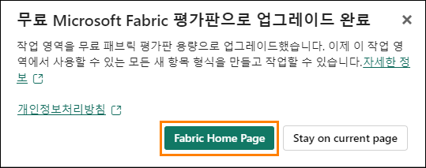
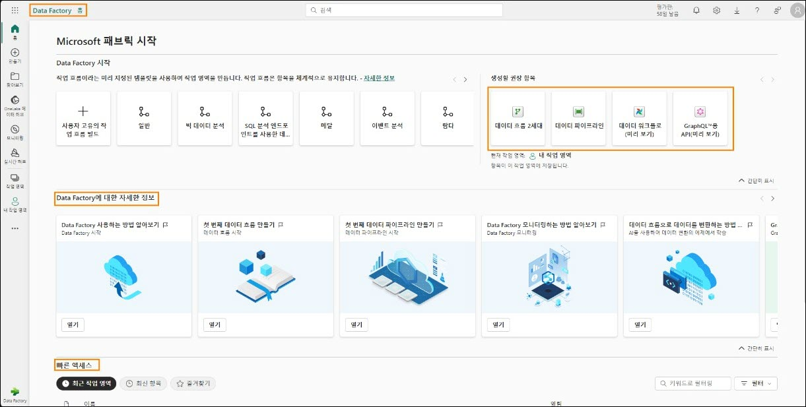
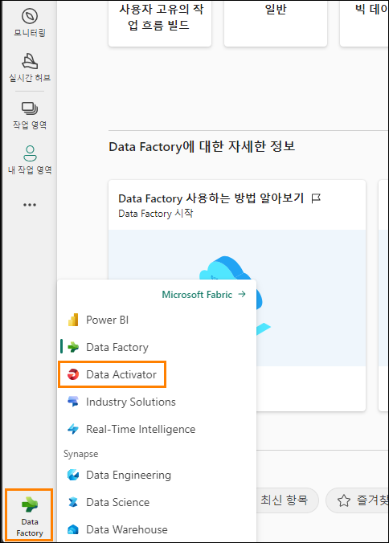
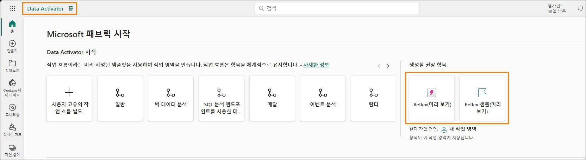
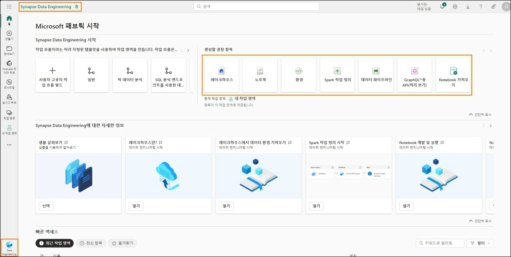
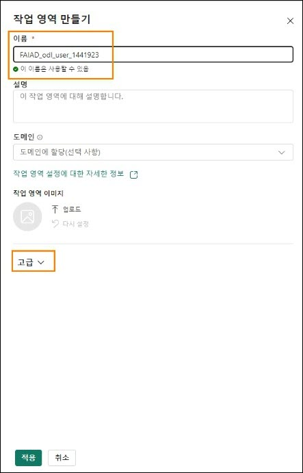
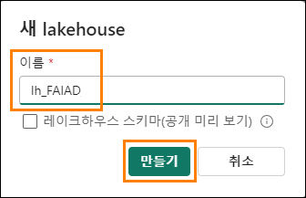
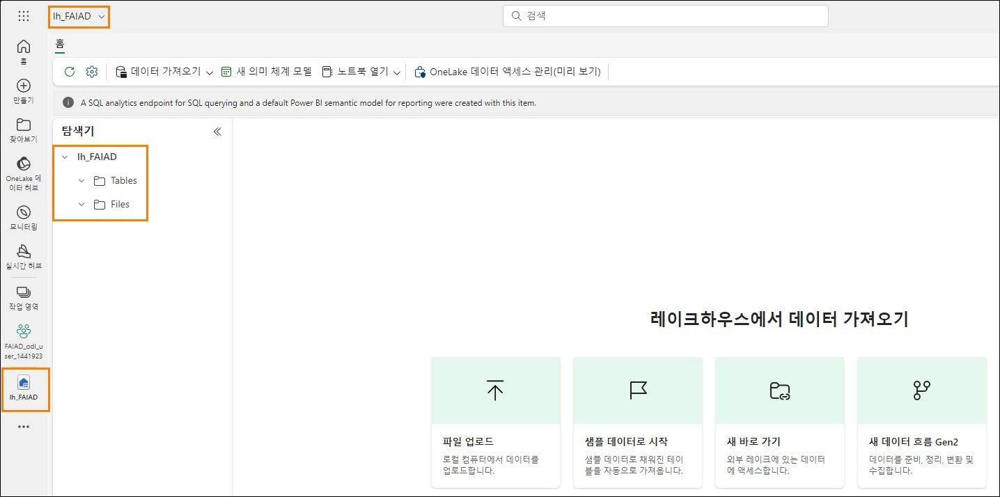

# Microsoft Fabric - 일일 패브릭 분석가 - 랩 2

# 목차

- 소개	
- Fabric 라이선스	
  - 작업 1: Microsoft Fabric 평가판 라이선스 활성화	
- Fabric 환경 개요	
  - 작업 2: Data Factory 환경	
  - 작업 3: Data Activator 환경	
  - 작업 4: Industry Solutions 경험	
  - 작업 5: Real-Time Intelligence 환경	
  - 작업 6: Synapse Data Engineering 환경	
  - 작업 7: Synapse Data Science 환경	
  - 작업 8: Synapse Data Warehouse 환경	
- Fabric 작업 영역	
  - 작업 9: Fabric 작업 영역 만들기	
  - 작업 10: 레이크하우스 만들기	
- 참조	

 
# 소개

오늘은 Microsoft Fabric의 다양한 주요 기능을 학습하게 됩니다. 본 랩은 Fabric에서 이용할 수 있는 다양한 제품 환경과 항목을 소개하기 위한 입문 워크샵입니다. 이 워크샵이 끝나면
레이크하우스, 데이터 흐름 2세대, 데이터 파이프라인, DirectLake 등을 사용하는 방법을 배우게 됩니다.
이 랩을 마치면 다음 사항을 알게 됩니다.

  - Fabric 작업 영역을 만드는 방법
  - Lakehouse 만드는 방법

# Fabric 라이선스

## 작업 1: Microsoft Fabric 평가판 라이선스 활성화

1. **브라우저**를 열어서 https://app.powerbi.com/으로 이동합니다. 로그인 페이지가 열립니다. **참고:** 랩 환경을 사용하지 않고 기존 Power BI 계정이 있는 경우 브라우저를 비공개/익명 모드로 사용하기를 원할 수도 있습니다.

2. **환경 변수** 탭(랩 가이드 옆)에 있는 **사용자 이름을 이메일로 입력하고 Submit**을 클릭합니다.

    

3. **암호** 화면이 열립니다. 강사가 공유한 **환경 변수** 탭(랩 가이드 옆)에 있는 **암호를** 입력합니다.
 
4. **Sign in**을 클릭하고 안내에 따라 Fabric에 로그인합니다.

    

5. 익숙한 **Power BI 서비스 홈 페이지**가 열립니다.

6. 참여자가 Power BI 서비스 레이아웃에 익숙하다고 가정합니다. 궁금한 사항은 주저없이 강사에게 문의하십시오.

  현재 **내 작업 영역**에 있습니다. Fabric 항목으로 작업하려면 평가판 라이선스와 Fabric
  라이선스가 할당된 작업 영역이 필요합니다. 설정해 보겠습니다.

7. 화면의 오른쪽 상단 모서리에서 **사용자 아이콘**을 선택합니다.

8. **무료 평가판**을 선택합니다.

    

    

9. 무료 Microsoft Fabric 평가판으로 업그레이드 대화상자가 열립니다. **평가판 시작**을 선택합니다.

10.	Microsoft Fabric 업그레이드 성공 대화 상자가 열립니다. **Fabric Home Page**를 선택합니다.

    

11.	**Microsoft Fabric 홈 페이지**로 이동합니다.

    

# Fabric 환경 개요

## 작업 2: Data Factory 환경

1. 화면 왼쪽 하단에 있는 **Microsoft Fabric**(Fabric 환경 선택기) 아이콘을 선택합니다. Fabric 환경 목록이 포함된 대화 상자가 열립니다. Power BI, Data Factory, Data Activator, Industry Solutions 및 Real-Time Intelligence는 독립적인 환경이라는 점에 유의하세요. Data
Engineering, Data Science 및 Data Warehouse는 Synapse에 의해 구동되는 경험이므로
Synapse 경험입니다.. 한번 살펴보겠습니다!

2. **Data Factory**를 선택합니다.

    

3. **Data Factory 홈 페이지**로 이동되었습니다. 이 페이지에는 세 가지 주요 섹션이 있습니다:  

   a. **권장**: Data Factory에서 사용할 수 있는 항목 - 데이터 흐름 2세대, 데이터 파이프라인, 데이터 워크플로 및 GraphQL용 API가 나열되어 있습니다.  
      i. 데이터 흐름 2세대는 차세대 데이터 흐름입니다.  
      ii. 데이터 파이프라인은 데이터 조정에 사용됩니다.  
      iii. 데이터 워크플로는 워크플로 오케스트레이션 관리자입니다.  
      iv. GraphQL용 API는 여러 데이터 원본을 쿼리하는 API입니다.  

   b. **Learn**: 이 섹션은 빠른 시작 학습 문서에 대한 액세스를 제공합니다.  

   c. **빠른 액세스**: 이 섹션은 최근에 사용했거나 즐겨찾는 항목을 나열합니다.  

      
 
# 작업 3: Data Activator 환경

1. 화면 왼쪽 하단에 있는 **Fabric 환경 선택기 아이콘**(현재 Data Factory로 설정됨)을 선택합니다. Fabric 환경 대화 상자가 열립니다.

    

2. 대화 상자에서 **Data Activator**를 선택합니다. **Data Activator 홈 페이지**로 이동됩니다. Data Activator는 데이터 변경에서 패턴이나 조건이 감지되면 자동으로 조치를 취하는 Microsoft Fabric의 노코드 환경입니다. 세 가지 섹션은 Data Factory 환경과 유사합니다. 권장 섹션에서 다음 항목을 확인합니다:  

   a. **Reflex**: 패턴에 대한 데이터 세트, 쿼리 및 Eventstreams를 모니터링하는 데 사용됩니다.  
  
   b. **Reflex 샘플**: 샘플 솔루션.
  
      

# 작업 4: Industry Solutions 경험

1. 화면 왼쪽 하단에 있는 **Fabric 환경 선택기 아이콘**(현재 Data Activator로 설정됨)을 선택합니다. Fabric 환경 대화 상자가 열립니다.

2. 대화 상자에서 **Industry Solutions**를 선택합니다. **Industry Solutions** 홈 페이지로 이동합니다. Microsoft Fabric에서는 데이터 관리, 분석 및 의사 결정을 위한 강력한 산업별 플랫폼을 제공합니다. 이러한 데이터 솔루션은 다양한 산업이 직면한 고유한 문제를 해결하여 기업이 운영을 최적화하고, 다양한 소스의 데이터를 통합하고, 풍부한 분석을 사용할 수 있도록 지원합니다. 세 가지 섹션은 이전 환경과 유사합니다. 권장 섹션에서 다음 항목을 확인합니다:  

   a. **지속 가능성 솔루션**: 환경, 사회 및 거버넌스(ESG) 데이터의 수집, 표준화 및 분석을 지원합니다.  
   
   b. **리테일 솔루션**: 대량의 데이터를 관리하고, 다양한 소스의 데이터를 통합하며, 신속한 의사 결정을 위한 실시간 분석을 제공합니다. 판매점은 이러한 솔루션을 사용하여 재고 최적화, 고객 세분화, 판매 예측, 동적 가격 책정 및 사기 탐지를 수행할 수 있습니다.  
   
   c. **Healthcare 솔루션**: 의료 데이터를 분석에 적합한 형식으로 효율적으로 변환해야 하는 중요한 요구를 해결하여 고객의 가치 실현 시간을 단축하기 위해 전략적으로 설계되었습니다.  
    
      
   
# 작업 5: Real-Time Intelligence 환경

1. 화면 왼쪽 하단에 있는 **Fabric 환경 선택기 아이콘**(현재 Industry Solutions로 설정됨)을 선택합니다. Fabric 환경 대화 상자가 열립니다.

2. **Real-Time Intelligence**를 선택합니다. **Real-Time Intelligence 홈 페이지**로 이동됩니다. 여기에도 세 개의 섹션이 있습니다. 권장 섹션에서 다음 항목을 확인합니다:  

   a. **Eventhouse**: 프로젝트 간에 공유할 수 있는 데이터베이스 작업 공간을 만드는 데 사용됩니다.  
   
   b. **KQL 쿼리 집합**: 공유 가능한 테이블과 시각적 개체를 생성하기 위해 데이터에 대한 쿼리를 실행하는 데 사용됩니다.  
   
   c. **실시간 대시보드**: 데이터 수집 후 몇 초 내에 실시간 대시보드를 시각화하는 데 사용됩니다.  
   
   d. **Eventstream**: 실시간 이벤트 스트림을 캡처, 변환 및 라우팅하는 데 사용됩니다.  
   
   e. **Reflex**: 데이터 집합, 쿼리 및 이벤트 스트림에서 패턴을 모니터링하는 데 사용됩니다.  
   
   f. **샘플 사용**: 샘플 솔루션.  

    **참고:** Reflex는 Data Activator 환경에서도 사용할 수 있습니다.

    

# 작업 6: Synapse Data Engineering 환경

1. 화면 왼쪽 하단에 있는 **Fabric 환경 선택기 아이콘**(현재 Real-Time Intelligence 로 설정됨)을 선택합니다. Fabric 환경 대화 상자가 열립니다.
 
2. **Data Engineering**을 선택합니다. **Data Engineering 홈 페이지**로 이동됩니다. 이번에도 이 페이지에는 세 가지 주요 섹션이 있습니다. 권장 섹션에서 다음 항목을 확인합니다:  

   a. **Lakehouse**: 정리, 쿼리, 보고 및 공유를 위한 빅데이터를 저장하는 데 사용됩니다.  
   
   b. **Notebook**: Python, R, Scala 등 다양한 언어를 사용하여 데이터 수집, 준비, 분석 및 기타 데이터 관련 작업에 사용됩니다.  
   
   c. **Environment**: 공유 라이브러리를 설정하고 Notebooks용 Spark 컴퓨팅 설정 및 리소스와 Spark 작업 정의를 설정하는 데 사용됩니다.  
   
   d. **Spark Job Definition**: Apache 작업을 정의, 예약 및 관리하는 데 사용됩니다.  
   
   e. **Data pipeline**: 데이터 솔루션 조정에 사용됩니다.  
   
   f. **GraphQL용 API**: 여러 데이터 원본을 쿼리하는 API입니다.  
   
   g. **Import notebook**: 로컬 컴퓨터에서 Notebook을 가져오는 데 사용됩니다.  
   
   h. **Use a sample**: 샘플 솔루션.
   
   

# 작업 7: Synapse Data Science 환경

1. 화면 왼쪽 하단에 있는 **Fabric 환경 선택기 아이콘**(현재 Data Engineering으로 설정됨)을 선택합니다. Fabric 환경 대화 상자가 열립니다.

2. **Data Science**를 선택합니다. **Data Science 홈 페이지**로 이동됩니다. 여기에도 역시 세 개의 섹션이 있습니다. 권장 섹션에서 다음 항목을 확인합니다:  

   a. **ML model**: 기계 학습 모델을 생성하는 데 사용됩니다.  
   
   b. **Experiment**: 여러 모델을 생성, 실행하고 그 개발을 추적하는 데 사용됩니다.  
   
   c. **Notebook**: 데이터를 탐색하고 기계 학습 솔루션을 구축하는 데 사용됩니다.  
   
   d. **Environment**: 공유 라이브러리를 설정하고 Notebooks용 Spark 컴퓨팅 설정 및 리소스와 Spark 작업 정의를 설정하는 데 사용됩니다.  
   
   e. **AI 기술**: 자신만의 생성형 AI 경험을 구축하는 데 사용됩니다.  
   
   f. **Import notebook**: 로컬 컴퓨터에서 Notebook을 가져오는 데 사용됩니다.  
   
   g. **Use a sample**: 샘플 솔루션.  

    **메모**: Notebook, 환경, 데이터 파이프라인 등과 같은 항목은 각 경험과 관련이 있으므로 여러 경험에서 사용할 수 있습니다.

    

# 작업 8: Synapse Data Warehouse 환경

1. 화면 왼쪽 하단에 있는 **Fabric 환경 선택기 아이콘**(현재 Data Science로 설정됨)을 선택합니다. Fabric 환경 대화 상자가 열립니다.

2. **Data Warehouse**를 선택합니다. **Data Warehouse 홈 페이지**로 이동됩니다. 여기에도 역시 세 개의 섹션이 있습니다. 새로 만들기 섹션에서 다음 항목을 확인합니다:  

   a. **웨어하우스**: Data Warehouse를 생성하는 데 사용됩니다.  
   
   b. **데이터 파이프라인**: 데이터 솔루션 조정에 사용됩니다.  
   
   c. **미러링된 SQL Database**: Azure SQL Database를 미러링하는 데 사용됩니다.  
   
   d. **미러링된 Snowflake**: Snowflake Database를 미러링하는 데 사용됩니다.  
   
   e. **미러링된 Azure Cosmos DB**: Azure Cosmos DB를 미러링하는 데 사용됩니다.

    

# Fabric 작업 영역

## 작업 9: Fabric 작업 영역 만들기

1. 이제 Fabric 라이선스로 작업 영역을 만들어 보겠습니다. 왼쪽 탐색 모음에서 **작업 영역**을 선택합니다. 대화 상자가 열립니다.

2. **새 작업 영역**을 선택합니다.

    

3. 브라우저 오른쪽에 **작업 영역 만들기** 대화상자가 열립니다.
 
4. **이름** 필드에 **FAIAD_\<username>** 을 입력합니다.
**참고:** 작업 영역 이름은 고유해야 합니다. 그러나 참여자의 작업 영역 이름은 이와 달라야 합니다. 이름 필드 아래에 **"이 이름을 사용할 수 있습니다."** 라는 문구와 함께 녹색 확인 표시가 있는지 확인합니다.

5. 원하는 경우 작업 영역에 대한 **설명**을 입력할 수 있습니다. 이는 선택적 필드입니다.

6. **고급**을 클릭하여 섹션을 확장합니다.

    

7. **라이선스 모드에서 평가판** 이 선택되어 있는지 확인합니다. (기본적으로 선택되어 있어야 합니다.)

8. **Apply**을 선택하여 새 작업 영역을 만듭니다.

    

    새 작업 영역이 만들어지면 그 작업 영역으로 전환됩니다. 다양한 데이터 원본의 데이터를 Lakehouse로 가져오고 Lakehouse의 데이터를 사용하여 모델을 구축하고 이에 대해 보고할 것입니다. 첫 번째 단계로 Lakehouse를 선택합니다.
 
# 작업 10: 레이크하우스 만들기

1. 화면 왼쪽 하단에 있는 **Fabric 환경 선택기 아이콘**(현재 Data Warehouse로 설정됨)을 선택합니다. Fabric 환경 대화 상자가 열립니다.

2. Data Engineering 홈페이지로 이동하려면 **Data Engineering**을 선택합니다.

    

3. **레이크하우스**를 선택합니다.

    

4. 새 레이크하우스 대화 상자가 열립니다. 이름 텍스트 상자에 **lh_FAIAD**를 입력합니다. **참고:** 여기서 lh는 Lakehouse를 나타냅니다. 쉽게 식별하고 검색할 수 있도록 lh 접두사를 붙입니다.
 
5. **만들기**를 선택합니다.

    

    몇 분 안에 Lakehouse가 생성되고 Lakehouse 인터페이스로 이동하게 됩니다.
    **왼쪽 패널**에서 작업 영역 아래에 Lakehouse 아이콘이 있는 것을 확인합니다. 언제든지 이 아이콘을 클릭하면 Lakehouse로 쉽게 이동할 수 있습니다.

    

    Lakehouse 탐색기에는 테이블 및 파일이 표시됩니다. Lakehouse는 파일 섹션 아래에 Azure Data Lake Storage Gen2 파일을 노출하거나 데이터 흐름이 Lakehouse 테이블에 데이터를 로드할 수 있습니다. 사용할 수 있는 다양한 옵션이 있습니다. 다음 랩에서 몇 가지 옵션을 보여드리겠습니다.
    이 랩에서는 Fabric 인터페이스를 살펴보고 Fabric 작업 영역과 Lakehouse를 만들었습니다. 다음 랩에서는 레이크하우스에서 바로 가기를 사용하여 ADLS Gen2 데이터에 연결하는 방법과 보기를 사용하여 이 데이터를 변환하는 방법에 대해 알아봅니다.
 
# 참조
Fabric Analyst in a Day(FAIAD)는 Microsoft Fabric에서 사용할 수 있는 몇 가지 주요 기능을 소개합니다. 서비스의 메뉴에 있는 도움말(?) 섹션에는 유용한 리소스로 연결되는 링크가 있습니다.

아래는 Microsoft Fabric의 다음 단계에 도움이 되는 몇 가지 추가 자료입니다.

- [Microsoft Fabric GA 발표](https://www.microsoft.com/en-us/microsoft-fabric/blog/2023/11/15/prepare-your-data-for-ai-innovation-with-microsoft-fabric-now-generally-available/) 전문을 블로그 포스트로 읽기
- [가이드 투어](https://guidedtour.microsoft.com/en-us/guidedtour/microsoft-fabric/microsoft-fabric/1/1)로 Fabric 탐색
- [Microsoft Fabric 무료 평가판](https://www.microsoft.com/en-us/microsoft-fabric/getting-started) 신청
- [Microsoft Fabric 웹사이트](https://www.microsoft.com/en-in/microsoft-fabric) 방문
- [Fabric 학습 모듈](https://learn.microsoft.com/en-us/training/browse/?products=fabric&resource_type=module)을 탐색해서 새로운 기술 익히기
- [Fabric 기술 문서](https://learn.microsoft.com/en-us/fabric/) 검토
- [Fabric 시작하기 무료 e북](https://info.microsoft.com/ww-landing-unlocking-transformative-data-value-with-microsoft-fabric.html) 읽기
- [Fabric 커뮤니티](https://community.fabric.microsoft.com/)에 가입하여 질문을 게시하고 피드백을 공유하며 다른 사람들로부터 배우기

더 많은 심층 Fabric 환경 발표 블로그 포스트 읽기:
- [Fabric 블로그의 Data Factory 환경](https://aka.ms/Fabric-Data-Factory-Blog)
- [Fabric 블로그의 Synapse Data Engineering 환경](https://aka.ms/Fabric-DE-Blog)
- [Fabric 블로그의 Synapse Data Science 환경](https://aka.ms/Fabric-DS-Blog)
- [Fabric 블로그의 Synapse Data Warehousing 환경](https://aka.ms/Fabric-DW-Blog)
- [Fabric 블로그의 Synapse Real-Time Analytics 환경](https://aka.ms/Fabric-RTA-Blog)
- [Power BI 발표 블로그](https://aka.ms/Fabric-PBI-Blog)
- [Fabric 블로그의 Data Activator 환경](https://aka.ms/Fabric-DA-Blog)
- [Fabric 블로그의 관리 및 거버넌스](https://aka.ms/Fabric-Admin-Gov-Blog)
- [Fabric 블로그의 OneLake](https://aka.ms/Fabric-OneLake-Blog)
- [Dataverse 및 Microsoft Fabric 통합 블로그](https://aka.ms/Dataverse-Fabric-Blog)

**© 2023 Microsoft Corporation. All rights reserved.**
이 데모/랩을 사용하면 다음 조건에 동의하게 됩니다.

이 데모/랩에 설명된 기술/기능은 학습 환경을 제공하고 사용자 의견을 얻기 위해 **Microsoft Corporation**에서 제공합니다. 데모/랩을 통해서만 이러한 기술적 특성과 기능을 평가하고 사용자 의견을 Microsoft에 제시할 수 있습니다. 다른 용도로는 사용할 수 없습니다. 이 데모/랩 또는 그 일부에 대해 수정, 복사, 배포, 전송, 표시, 수행, 재현, 게시, 라이선스 허여, 파생 작업 생성, 양도 또는 판매할 수 없습니다.

추가 복제 또는 재배포를 위한 다른 서버 또는 위치에 대한 데모/랩(또는 그 일부)의 복사 또는 재현은 명시적으로 금지됩니다.

이 데모/랩은 위에서 명시한 목적을 위해 복잡한 설정 또는 설치가 없는 시뮬레이션된 환경에서 잠재적인 새로운 기능과 개념을 포함하여 특정 소프트웨어 기술/제품의 특성 및 기능을 제공합니다. 이 데모/랩에서 서술된 기술/개념은 전체 기능을 나타내지 않을 수 있으며, 최종 버전이 작동하지 않을 수도 있습니다. 또한 해당 기능 또는 개념의 최종

버전을 릴리스하지 않을 수도 있습니다. 또한 실제 환경에서 이러한 특성과 기능을 사용한 경험이 다를 수도 있습니다.
 
**피드백**. 이 데모/랩에서 서술된 기술적 특성, 기능 및/또는 개념에 대한 사용자 의견을
**Microsoft**에 제시하면 Microsoft는 이 사용자 의견을 어떤 방식과 목적으로든 무료로 사용, 공유 및 상용화할 수 있습니다. 또한 제품, 기술 및 서비스에서 사용자 의견이 포함된

**Microsoft** 소프트웨어 또는 서비스의 특정 부분을 사용하거나 인터페이스하는 데 필요한 모든 특허권을 제3자에게 무료로 제공합니다. Microsoft에서 사용자 의견을 포함하기 때문에 Microsoft에서 해당 소프트웨어 또는 설명서의 사용을 인가해야 하는 라이선스에 종속된 사용자 의견은 제공할 수 없습니다. 이러한 권리는 본 계약에 의거하여 유효합니다.

**Microsoft Corporation**은 이에 따라 명시적, 묵시적 또는 법적 특정 목적에의 적합성, 권리 및 비침해 여부에 관계없이 모든 보증과 조건을 포함하여 데모/랩과 관련된 모든 보증 및 조건을 부인합니다. Microsoft는 어떤 목적으로든 결과의 정확성, 데모/랩의 사용으로 파생된 출력 또는 데모/랩에 포함된 정보의 적합성과 관련하여 어떠한 보증이나 진술도 하지 않습니다.

**고지 사항**
이 데모/랩에는 **Microsoft Power BI**의 새로운 기능 및 향상된 기능 중 일부만 포함되어 있습니다. 일부 기능은 제품의 향후 릴리스에서 변경될 수 있습니다. 이 데모/랩에서는 새로운 기능 모두가 아닌 일부에 대해 학습하게 됩니다.
