# 목차
- 소개	
- ADLS Gen2 바로 가기	3
    - 작업 1: 바로 가기 만들기	
- 시각적 쿼리를 사용하여 데이터 변환	
    - 작업 2: 시각적 쿼리를 사용하여 Geo 보기 만들기	
    - 작업 3: 시각적 쿼리를 사용하여 Reseller 보기 만들기	
    - 작업 4: 시각적 쿼리를 사용하여 Sales 보기 만들기	
    - 작업 5: 시각적 쿼리를 사용하여 Product 보기 만들기	
- 참조	

 
# 소개
우리 시나리오에서 매출 데이터는 ERP 시스템에서 제공되며 ADLS Gen2에 저장됩니다. 매일 정오/오후 12시에 업데이트됩니다. 이 데이터를 레이크하우스로 변환하고 수집하여 모델에서 사용해야 합니다.

데이터를 수집할 수 있는 방법은 다양합니다.

- **바로 가기:** 이렇게 하면 데이터에 대한 링크가 만들어지고 시각적 쿼리 보기를 사용하여 데이터를 변환할 수 있습니다. 이 랩에서는 바로 가기를 사용하겠습니다.
- **Notebooks:** 이를 위해서는 코드를 작성해야 합니다. 이는 개발자 친화적인 방식입니다.
- **데이터 흐름 2세대:** 아마도 Power Query 또는 데이터 흐름 1세대에 익숙할 것입니다. 데이터 흐름 2세대는 이름에서 알 수 있듯이 데이터 흐름의 최신 버전입니다. 이는 데이터를 여러 데이터 원본으로 변환하고 수집하는 추가 기능과 함께 Power Query / 데이터 흐름 1세대의 모든 기능을 제공합니다. 다음 두 랩에서 이것을 소개할 것입니다.
- **데이터 파이프라인:** 이는 오케스트레이션 도구입니다. 데이터를 추출, 변환, 수집하도록 활동을 조정할 수 있습니다. 데이터 파이프라인을 사용하여 데이터 흐름 2세대 활동을 실행하여 추출, 변환, 수집이 수행되도록 할 수 있습니다.
  
먼저 ADLS Gen2 데이터 원본에서 레이크하우스로 데이터를 수집하는 바로 가기를 만들어 보겠습니다. 수집된 후에는 시각적 쿼리 보기를 사용하여 변환합니다.
이 랩을 마치면 다음 사항을 알게 됩니다.
    -  레이크하우스 바로 가기 생성 방법
    -  시각적 쿼리를 사용하여 데이터를 변환하는 방법
    
# ADLS Gen2 바로 가기
## 작업 1: 바로 가기 만들기

바로 가기는 대상 위치에 대한 링크를 만드는 데 사용됩니다. 이것은 Windows 바탕 화면에 바로 가기를 만드는 것과 같습니다.
1.	다시 랩 2, 작업 9에서 만든 **Fabric 작업 영역**으로 되돌아가 보겠습니다.
2.	이전 랩에서 다른 곳으로 이동하지 않은 경우 레이크하우스 화면이 표시됩니다. 다른 곳으로 이동해도 괜찮습니다. **lh_FAIAD**를 선택하여 레이크하우스로 이동합니다.
3.	**탐색기** 창에서 **테이블** 옆의 줄임표를 선택합니다.
 
4.	**새 바로 가기**를 선택합니다.

    

5.	**새 바로 가기** 대화 상자가 열립니다. 외부 원본에서 **Azure Data Lake Storage Gen2**를 선택합니다.

    

6.	ADLS Gen2 데이터 원본에 대한 연결을 만들어야 합니다. 연결 설정 ‐> URL에서 다음 링크를 입력합니다. https://stvnextblobstorage.dfs.core.windows.net/fabrikam-sales
7.	인증 종류 드롭다운에서 **계정 키**를 선택합니다.
8.	환경 변수 탭(랩 가이드 탭 옆)의 **Adls** **스토리지 계정 액세스 키**를 복사하여 **계정 키 텍스트 상자**에 붙여 넣습니다.
9.	화면 오른쪽 하단에서 **다음**을 선택합니다.

    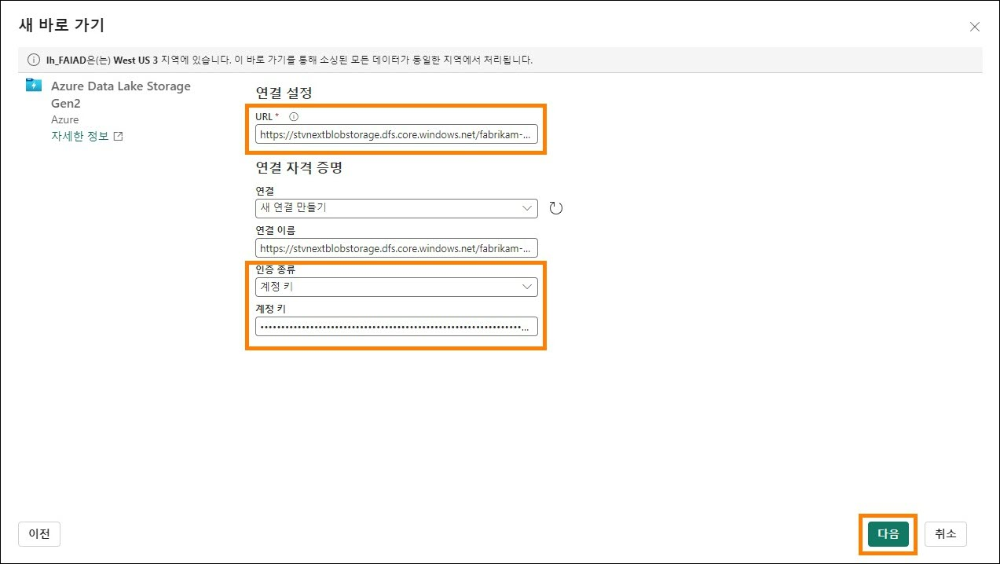

10. 왼쪽 패널에 디렉터리 구조가 표시된 ADLS Gen2에 연결됩니다. **Delta‐Parquet‐Format‐FY25**를 확장합니다.

11. 다음 디렉터리를 **선택**합니다:

    a. Application.Cities  
    b. Application.Countries  
    c. Application.StateProvinces  
    d. DateDim  
    e. Sales.BuyingGroups  
    f. Sales.Customers  
    g. Sales.Invoices  
    h. Sales.InvoiceLines  
    i. Warehouse.StockItems  
    j. Warehouse.StockGroups  
    k. Warehouse.StockItemStockGroups  
   	
**참고:** Sales.Invoices_May는 선택되지 않은 유일한 디렉터리입니다.

13.	**다음**을 선택합니다.

    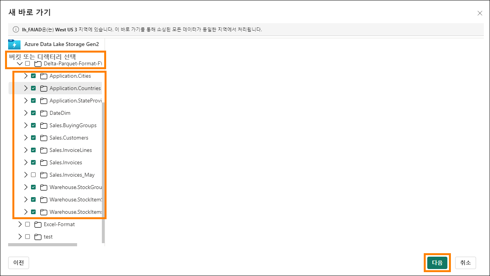

14.	이름을 편집할 수 있는 다음 대화 상자로 이동합니다.**Application.Cities**에 대한 작업에서
편집 아이콘을 선택합니다.
15.	**Application.Cities를 Cities**로 이름을 변경합니다.
16. 이름 옆의 확인 표시를 선택하여 변경 사항을 저장합니다.

    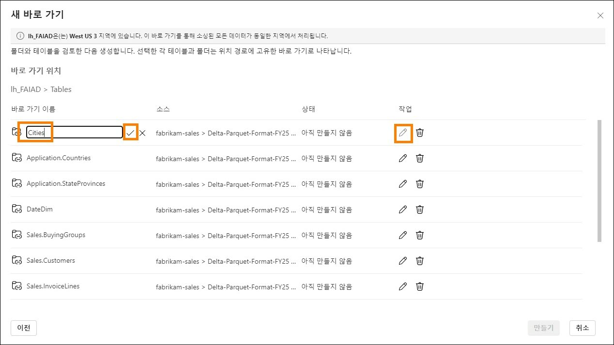

17. 마찬가지로 바로 가기 이름도 아래와 같이 이름을 바꿉니다:

    a. Application.Countries에서 **Countries**로  
    b. Application.StateProvinces에서 **States**로  
    c. DateDim에서 **Date**로  
    d. Sales.BuyingGroups에서 **BuyingGroups**로  
    e. Sales.Customers에서 **Customers**로  
    f. Sales.InvoiceLines에서 **InvoiceLineItems**로  
    g. Sales.Invoices에서 **Invoices**로  
    h. Warehouse.StockGroups에서 **ProductGroups**로  
    i. Warehouse.StockItemStockGroups에서 **ProductItemGroup**로  
    j. Warehouse.StockItems에서 **ProductItem**로 
     	
**참고:** 이름을 다시 확인하세요. 랩 도중 오타로 인해 오류가 발생할 수 있습니다.
17.	**만들기**를 선택하여 바로 가기를 만듭니다.


18.	모든 바로 가기가 테이블로 생성되는 것을 확인할 수 있습니다. **BuyingGroups** 테이블을 선택하면 데이터 창에서 데이터 미리 보기를 볼 수 있습니다.

    

다음 단계는 의미 체계 모델을 만들 수 있도록 데이터를 변환하는 것입니다. 데이터를 변환하는 뷰를 만들겠습니다.

# 시각적 쿼리를 사용하여 데이터 변환

## 작업 2: 시각적 쿼리를 사용하여 Geo 보기 만들기

1.	SQL 엔드포인트를 사용하여 레이크하우스에 액세스할 수 있습니다. 이를 통해 데이터를 쿼리하고 보기를 만들 수 있습니다. 화면 오른쪽 상단에서 **Lakehouse ‐> SQL** **분석 엔드포인트를** 선택합니다.

    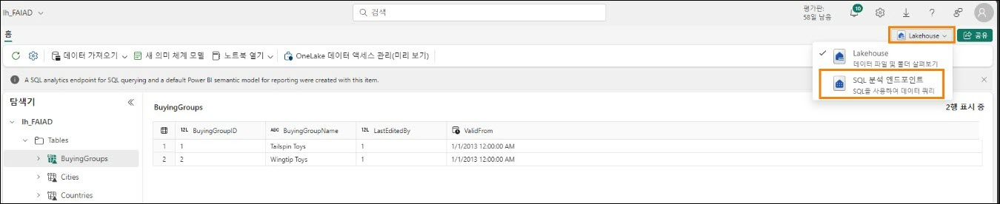

SQL 분석 엔드포인트로 이동합니다. 탐색기 패널이 변경된 것을 확인할 수 있습니다. 이제 보기, 저장 프로시저, 쿼리 등을 만들 수 있습니다. Power Query와 같은 인터페이스를 제공하는 시각적 쿼리를 만들고 이를 뷰로 저장하겠습니다.
먼저 Geo 보기를 만들어 보겠습니다. Cities, States 및 Countries 쿼리의 데이터를 병합하여
Geo를 만들어야 합니다.
 
2.	상단 메뉴에서 **새 시각적 쿼리**를 선택합니다.
    
    

3.	쿼리를 작성하려면 테이블을 새 시각적 쿼리 패널로 끌어야 합니다. Cities, States 및
Countries 쿼리를 새 시각적 쿼리 패널로 끌어 보겠습니다.

    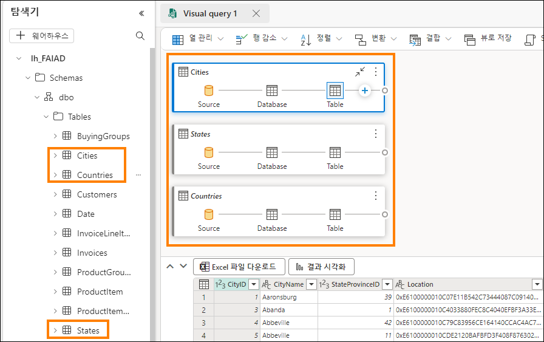

이러한 쿼리를 병합해야 합니다. 새 시각적 쿼리에는 Power Query 편집기를 사용할 수 있는 옵션이 함께 제공됩니다. 익숙한 기능이니 이 기능을 사용해보겠습니다.
 
4.	새 시각적 쿼리 편집기의 메뉴에서 **포커스 모드** 아이콘(오른쪽)을 선택합니다. Power Query
편집기로 이동합니다.

    

5.	Cities 쿼리를 선택한 상태에서 Power Query 편집기 리본 메뉴에서 **홈 ‐ > 쿼리 병합 ‐ >
쿼리를 새 항목으로 병합**을 선택합니다. 쿼리 병합 대화 상자가 열립니다.

    

6.	**병합할 왼쪽 테이블**에서 **Cities**를 선택합니다.
7.	**병합할 오른쪽 테이블**에서 **States**를 선택합니다.
8.	두 테이블에서 **StateProvinceID** 열을 선택합니다. 이 열을 사용하여 조인할 것입니다.
9.	**조인 종류**로 **안쪽을** 선택합니다.
10.	**확인**을 선택합니다.
    
    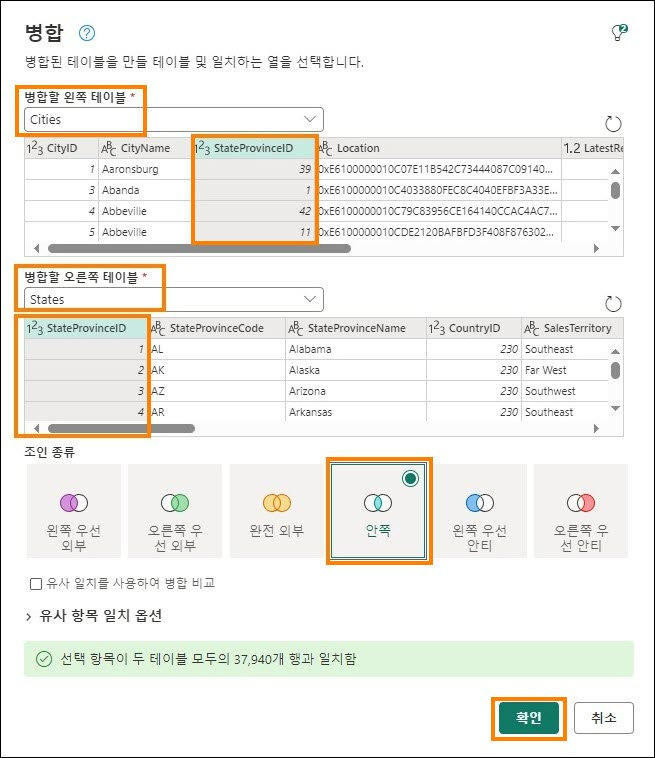

병합이라는 새 쿼리가 생성되♘음을 알 수 있습니다. States에서 열이 몇 개 필요합니다.

11. **Data 보기**(아래쪽 패널)에서 **States** 열(오른쪽 마지막 열) 옆에 있는 **이중 화살표**를 클릭합니다.  
12. 패널이 열립니다. 다음 열을 선택합니다:  
    a. StateProvinceCode  
    b. StateProvinceName  
    c. CountryID  
    d. SalesTerritory  
13. **확인**을 선택합니다.  

    

이제 Countries 쿼리를 병합해야 합니다. 

14. 쿼리 병합을 선택한 상태에서 리본 메뉴에서 **홈 ‐> 쿼리 병합 ‐> 쿼리 병합**을 선택합니다. 

     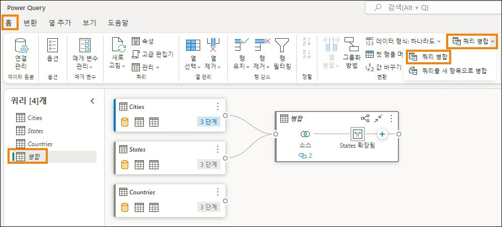

15. 쿼리 병합 대화 상자가 열립니다. **병합할 오른쪽 테이블에서 Countries**를 선택합니다.  
16. 두 테이블에서 **CountryID** 열을 선택합니다. 이 열을 사용하여 조인할 것입니다.  
17. **조인 종류**로 **안쪽**을 선택합니다.  
18. **확인**을 선택합니다.  

    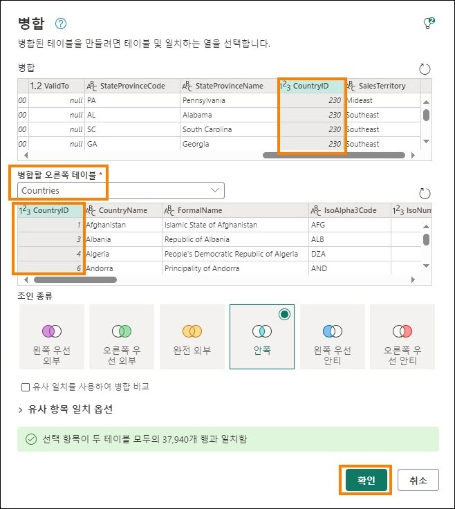

Countries에서 열이 몇 개 필요합니다.  
19. **Data 보기**(하단 패널)에서 **Countries** 열 옆의 **이중 화살표**를 클릭합니다.  
20. 패널이 열립니다. 다음 열을 **선택**합니다:  
    a. CountryName  
    b. FormalName  
    c. IsoAlpha3Code  
    d. IsoNumericCode  
    e. CountryType  
    f. Continent  
    g. Region  
    h. Subregion  

21.	**확인**을 선택합니다.

    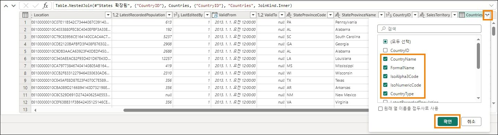

모든 열이 필요하지는 않습니다. 필요한 것만 선택해 보겠습니다.
 
22.	쿼리 병합을 선택한 상태에서 리본 메뉴에서 **홈 ‐> 열 선택 ‐> 열 선택**을 선택합니다.

    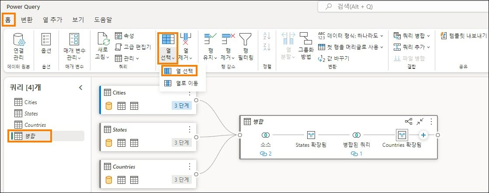

23. 열 선택 대화 상자가 열립니다. 다음 열을 **선택 취소**합니다:  
    a. StateProvinceID  
    b. Location  
    c. LastEditedBy  
    d. ValidFrom  
    e. ValidTo  
    f. CountryID  
24. **확인**을 선택합니다.  

    

오른쪽의 적용된 단계 패널과 시각적 보기 모두에 모든 단계가 기록되어 있으며, 프로세스는 Power Query과 같습니다. 이 쿼리에서 데이터가 로드되도록 쿼리 병합 및 로드 활성화의 이름을 변경하겠습니다.
25.	쿼리(왼쪽) 패널에서 쿼리 **병합을 마우스 오른쪽 버튼으로 클릭**합니다. 이름 바꾸기를 선택하고 쿼리 이름을 **Geo로** 바꿉니다.

26.	쿼리(왼쪽) 패널에서 쿼리 **Geo를 마우스 오른쪽 버튼으로 클릭**합니다. **로드 사용을를** 선택하여 이 쿼리를 활성화합니다.

27.	Cities, States 및 Countries쿼리가 **비활성화**되어 있는지 확인합니다.

28.	저장을 선택합니다.

    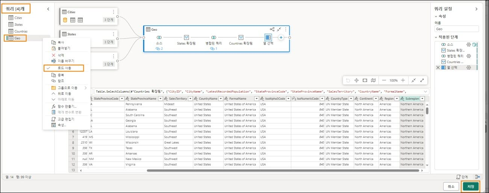

시각적 쿼리 편집기로 이동합니다. 이제 이 쿼리를 뷰로 저장해 보겠습니다.
**참고:** Power Query 편집기를 사용하여 수행한 모든 단계는 시각적 쿼리 편집기를 통해서도 수행할 수 있습니다.

29.	시각적 쿼리 편집기 메뉴에서 **뷰로 저장**을 선택합니다.

    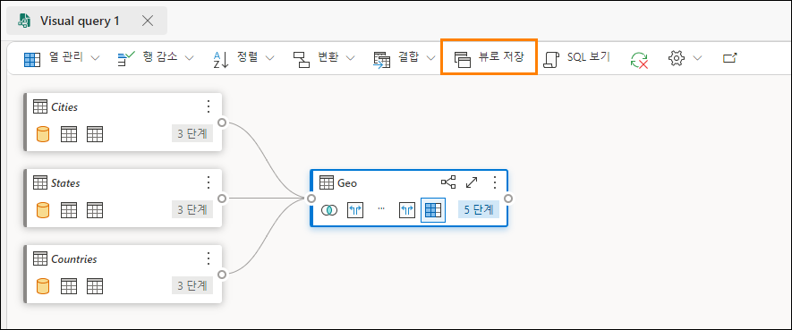
 
뷰로 저장 대화 상자가 열립니다. SQL 쿼리가 사용 가능하다는 것을 알 수 있습니다. 원하는 경우 검토할 수 있습니다.

30.	**보기 이름으로 Geo를** 입력합니다.

31.	**확인**을 선택하여 보기를 저장합니다.

    

뷰가 저장되면 알림을 받게 됩니다.

32.	탐색기(왼쪽) 패널에서 **Views를** 펼칩니다. 새로 생성된 지역 보기가 있습니다.

    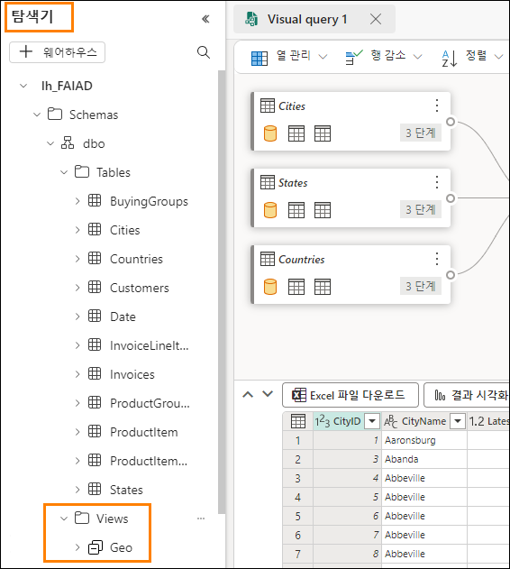
 
# 작업 3: 시각적 쿼리를 사용하여 Reseller 보기 만들기

Customers 테이블과 BuyingGroups 테이블을 병합하여 생성되는 Reseller 보기를 만들어 보겠습니다. 이번에는 시각적 쿼리를 사용하여 보기를 만들어 보겠습니다.

1.	레이크하우스 메뉴 모음에서 홈 ‐> 새 시각적 쿼리를 선택합니다. 새 시각적 창이 열립니다.

2.	탐색기섹션에서 Customers 및 BuyingGroups 테이블을 시각적 쿼리 섹션으로 끌어옵니다.

    

3.	**Customers** 쿼리를 선택합니다. 선택하면 Customers에 파란색 테두리가 생기고 테이블 뒤에
“+” 기호가 표시됩니다(이는 테이블 뒤에 단계를 추가하고 있음을 나타냅니다). 테이블
 
뒤에 "+" 기호가 표시되지 않으면 다른 단계를 선택했을 수 있습니다. Table을 선택하면 바로 사용할 수 있습니다.

4.	시각적 쿼리 메뉴에서 **결합 ‐> 쿼리 병합**을 선택합니다.
    
    

병합 대화 상자가 열리고 Customers가 맨 위 테이블로 선택되어 있습니다.

5.	**병합할 오른쪽 테이블**에서 **BuyingGroups를** 선택합니다.

6.	두 테이블에서 **BuyingGroupID** 열을 선택합니다. 이 열을 사용하여 조인할 것입니다.

7.	**조인 종류로 안쪽을** 선택합니다.

8.	**확인**을 선택합니다.

    

9.	**데이터 보기**(아래쪽 패널)에서 **BuyingGroups** 열(오른쪽 마지막 열) 옆의 이중 화살표를 클릭하여 BuyingGroups에서 필요한 열을 선택합니다.

10.	패널이 열립니다. **BuyingGroupName** 열을 **선택**합니다.

11.	**확인**을 선택합니다.

    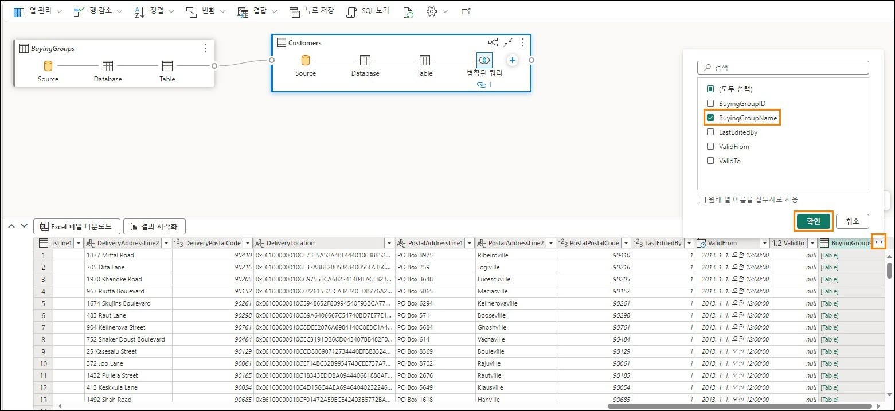

모든 열이 필요하지는 않습니다. 필요한 것만 선택해 보겠습니다.

12.	시각적 쿼리 메뉴에서 열 관리 ‐> 열 선택을 선택합니다.

    

13. 열 선택 대화 상자가 열립니다. 다음 열을 선택합니다:  
    a. ResellerID  
    b. ResellerName  
    c. PostalCityID  
    d. PhoneNumber  
    e. FaxNumber  
    f. WebsiteURL  
    g. DeliveryAddressLine1  
    h. DeliveryAddressLine2  
    i. DeliveryPostalCode  
    j. PostalAddressLine1  
    k. PostalAddressLine2  
    l. PostalPostalCode  
    m. BuyingGroupName  

14.	**확인**을 선택합니다.

    
 
15.	BuyingGroupName 열의 이름을 변경해 보겠습니다. **데이터 보기에서 BuyingGroupName** 열 머리글을 두 번 클릭하여 편집할 수 있도록 합니다.

16.	열 이름을 **ResellerCompany**로 변경합니다.

     

Customer 테이블에 모든 단계가 문서화되어 있습니다. 이제 이 보기를 저장해 보겠습니다.

17.	시각적 쿼리 메뉴에서 **뷰로 저장**을 선택합니다.

         
 
뷰로 저장 대화 상자가 열립니다. SQL 쿼리가 사용 가능하다는 것을 알 수 있습니다. 원하는 경우 검토할 수 있습니다.

18.	**보기 이름**으로 **Reseller**를 입력합니다.

19.	**확인**을 선택하여 보기를 저장합니다.

    

뷰가 저장되면 알림을 받게 됩니다.

20.	탐색기(왼쪽) 패널에서 **Views** 를 펼칩니다. 새로 생성된 Reseller 보기가 있습니다.
 
    

# 작업 4: 시각적 쿼리를 사용하여 Sales 보기 만들기

InvoiceLineItems 및 Invoices 테이블과 Reseller 보기를 병합하여 Sales 보기를 만들어 보겠습니다. Power BI Desktop에는 이 쿼리가 있습니다. 고급 편집기에서 코드를 복사하겠습니다. 그러나 코드를 복사하기 전에 시각적 쿼리에서는 빈 쿼리를 만들 수 없으므로 시각적 쿼리를 사용하여 병합 테이블을 만들어야 합니다. 이 방법을 시도해 보겠습니다.

1.	레이크하우스 메뉴 모음에서 **홈 ‐> 새 시각적 쿼리**를 선택합니다. 새로운 시각적 쿼리 창이 열립니다.

2.	**탐색기‐> 테이블** 섹션에서 **InvoiceLineItems, Invoices** 테이블을 시각적 쿼리 섹션으로 끌어옵니다.

3.	**탐색기‐> Views** 섹션에서 **Reseller** 보기를 시각적 쿼리 섹션으로 끌어옵니다.

4.	시각적 쿼리 편집기에서 **포커스 모드 아이콘**을 선택하여 Power Query 편집기를 엽니다.
 
    

5.	InvoiceLineItems 쿼리를 선택한 상태에서 리본 메뉴에서 **홈 ‐ > 쿼리 병합 ‐ > 쿼리를 새 항목으로 병합**을 선택합니다.

    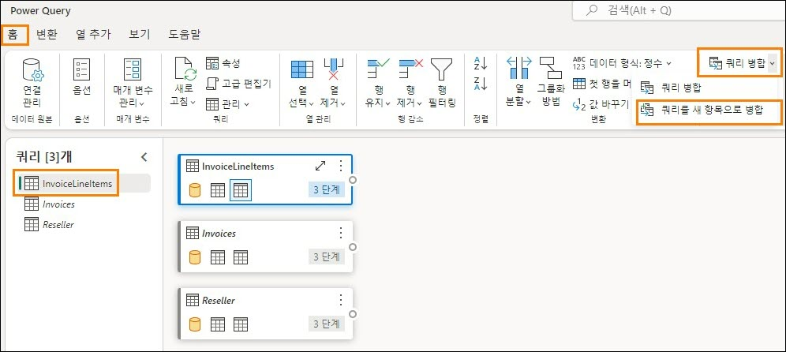

병합 대화 상자가 열립니다.

6.	**병합할 왼쪽 테이블**에서 **InvoiceLineItems**를 선택합니다.

7.	**병합할 오른쪽 테이블**에서 **Invoices**를 선택합니다.

8.	두 테이블에서 **InvoiceID** 열을 선택합니다. 이 열을 사용하여 조인할 것입니다.

9.	**조인 종류로 안쪽**을 선택합니다.

10.	**확인**을 선택합니다.
 
    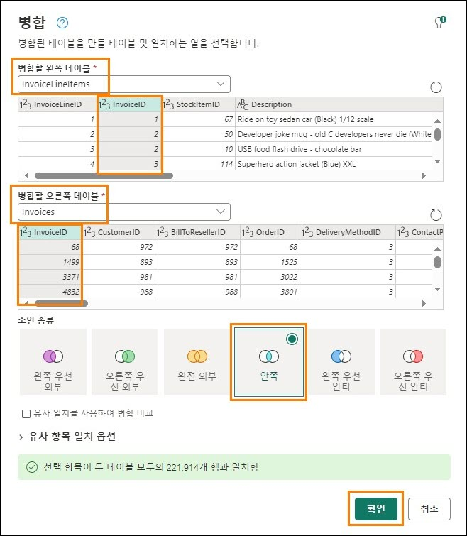 

Power BI Desktop에서 코드를 복사하여 고급 편집기를 사용하여 붙여 넣겠습니다.

11.	아직 열지 않았다면 랩 환경 바탕 화면의 **Reports** 폴더에 있는 **FAIAD.pbix**를 엽니다.

12.	리본 메뉴에서 **홈 ‐> 데이터 변환**을 선택합니다. Power Query 창이 열립니다. 이전 랩에서 알아본 것처럼 왼쪽 패널의 쿼리는 데이터 원본별로 구성됩니다.
    
    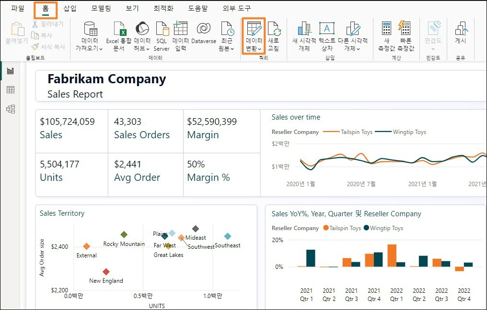

13.	왼쪽 패널의 ADLSData 폴더에서 **Sales** 쿼리를 선택합니다.

14.	리본 메뉴에서 **홈 ‐> 고급 편집기**를 선택합니다. 고급 편집기 대화 상자가 열립니다.
 
    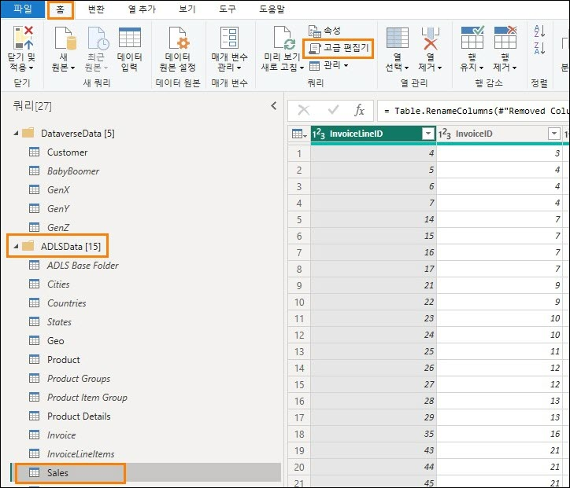

15.	**3번째** 줄(#“Expanded Invoice”...)부터 코드의 마지막 줄까지 코드를 선택합니다.

16.	**마우스 오른쪽 버튼을 클릭하고 Copy** 를 선택합니다.

17.	**취소**를 선택하여 고급 편집기를 닫습니다.

    

18.	Power Query 편집기가 열려 있는 브라우저로 다시 이동합니다.

19.	쿼리 병합이 선택되어 있는지 확인합니다.

20.	리본 메뉴에서 홈 ‐> 고급 편집기를 선택합니다. 고급 편집기 대화 상자가 열립니다.

    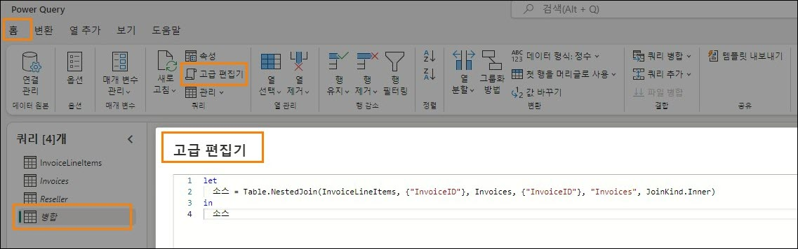 
 

21.	**2줄 끝에 쉼표를 추가합니다** (Source = Table.NestedJoin(InvoiceLineItems, {"InvoiceID"}, Invoices, {"InvoiceID"}, "Invoices", JoinKind.Inner)

22.	**Enter**를 클릭하여 새 줄을 시작합니다.

23.	키보드에서 **Ctrl+V**를 입력하여 Power BI Desktop에서 복사한 코드를 붙여 넣습니다.

**참고:** 랩 환경에서 작업하는 경우 화면 오른쪽 상단에 있는 줄임표를 선택합니다. 슬라이더를 사용하여 **VM 네이티브 클립보드를 활성화**합니다. 대화 상자에서 확인을 선택합니다. 쿼리 붙여 넣기가 완료되면 이 옵션을 비활성화할 수 있습니다.

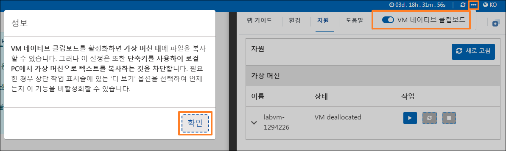

24.	소스에서 마지막 두 줄의 코드를 강조 표시하고 삭제합니다.

25.	**확인**을 선택하여 변경 내용을 저장합니다.
 
    
 

더 쉬운 방법은 고급 편집기에서 모든 코드를 삭제하고 아래 코드를 고급 편집기에 붙여 넣는 것입니다.

```
let
  Source = Table.NestedJoin(InvoiceLineItems, {"InvoiceID"}, Invoices, {"InvoiceID"}, "Invoices", JoinKind.Inner),
    #"Expanded Invoice" = Table.ExpandTableColumn(Source, "Invoices", {"CustomerID", "BillToCustomerID", "SalespersonPersonID", "InvoiceDate"}, {"CustomerID",
"BillToCustomerID", "SalespersonPersonID", "InvoiceDate"}),
    #"Removed Other Columns" = Table.SelectColumns(#"Expanded Invoice",{"InvoiceLineID", "InvoiceID", "StockItemID", "Quantity", "UnitPrice", "TaxRate", "TaxAmount", "LineProfit",
"ExtendedPrice", "CustomerID", "SalespersonPersonID", "InvoiceDate"}),
    #"Renamed Columns" = Table.RenameColumns(#"Removed Other Columns",{{"CustomerID", "ResellerID"}}),
    #"Merged Queries" = Table.NestedJoin(#"Renamed Columns", {"ResellerID"}, Reseller,
{"ResellerID"}, "Customer", JoinKind.Inner),
    #"Added Custom" = Table.AddColumn(#"Merged Queries", "Sales Amount", each [ExtendedPrice] - [TaxAmount]),
    #"Changed Type" = Table.TransformColumnTypes(#"Added Custom",{{"Sales Amount", type number}}),
    #"Removed Columns" = Table.RemoveColumns(#"Changed Type",{"Customer"}) in
    #"Removed Columns"
```

26.	Power Query 편집기로 다시 이동합니다. 왼쪽의 쿼리 패널에서 쿼리 **병합을 두 번 클릭**하여 쿼리 이름을 바꿉니다.

27.	병합 쿼리의 이름을 **Sales로 바꿉니다**.
 
28.	Sales 쿼리를 마우스 오른쪽 버튼으로 클릭하고 **로드 사용을** 선택하여 쿼리를 로드할 수 있도록 설정합니다.

    

29.	**저장**을 선택하여 저장하고 Power Query 대화 상자를 닫습니다. 시각적 쿼리 보기로 이동합니다.

30.	시각적 쿼리 메뉴에서 **뷰로 저장**을 선택합니다. 뷰로 저장 대화 상자가 열립니다. SQL
쿼리가 사용 가능하다는 것을 알 수 있습니다. 원하는 경우 검토할 수 있습니다.

31.	**보기 이름**으로 **Sales**를 입력합니다.

32.	**확인**을 선택하여 보기를 저장합니다.
 
     

뷰가 저장되면 알림을 받게 됩니다.

33.	탐색기(왼쪽) 패널에서 **Views** 를 펼칩니다. 새로 생성된 Sales 보기가 있습니다.

    
 
# 작업 5: 시각적 쿼리를 사용하여 Product 보기 만들기
ProductItem, ProductItemGroup 및 ProductGroups 테이블을 병합하여 생성되는 제품 보기를 만들어 보겠습니다. 작업을 진행하기 위해 고급 편집기에 코드를 복사하겠습니다.

1.	레이크하우스 메뉴 모음에서 홈 ‐> 새 시각적 쿼리를 선택합니다. 새로운 시각적 쿼리 창이 열립니다.

2.	탐색기 섹션에서 **ProductItem, ProductItemGroup 및 ProductGroups** 테이블을 시각적 쿼리 섹션으로 드래그합니다.

3.	시각적 쿼리 편집기에서 **포커스 모드 아이콘**을 선택하여 Power Query 편집기를 엽니다.

    

4.	**ProductItem** 쿼리를 선택한 상태에서 리본에서 **홈 ‐> 쿼리 병합 ‐> 쿼리를 새 항목으로 병합**을 선택합니다. 병합 대화 상자가 열립니다.

    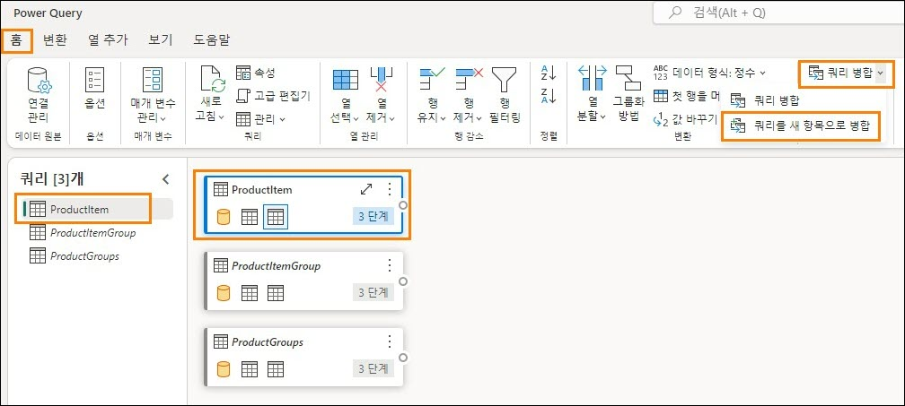

5.	**병합할 왼쪽 테이블**에서 **ProductItem**을 선택합니다.

6.	**병합할 오른쪽 테이블**에서 **ProductItemGroup**을 선택합니다.

7.	두 테이블에서 **StockItemID**열을 선택합니다. 이 열을 사용하여 조인할 것입니다.
 
8.	**조인 종류로 왼쪽 우선 외부**를 선택합니다.

9.	**확인**을 선택합니다. 새 병합 쿼리가 만들어집니다.
    
    

10.	쿼리 병합을 선택한 상태에서 리본 메뉴에서 **홈 ‐> 고급 편집기**를 선택합니다. 고급 편집기 대화 상자가 열립니다.

    

11.	고급 편집기에서 **모든 코드**를 선택하고 **삭제**합니다.

12.	아래 코드를 고급 편집기에 **붙여 넣습니다.**

```
let
   Source = Table.NestedJoin(ProductItem, {"StockItemID"}, ProductItemGroup,
{"StockItemID"}, "ProductItemGroup", JoinKind.LeftOuter),
   #"Expanded ProductItemGroup" = Table.ExpandTableColumn(Source, "ProductItemGroup",
{"StockGroupID"}, {"StockGroupID"}),
   #"Merged queries" = Table.NestedJoin(#"Expanded ProductItemGroup", {"StockGroupID"}, ProductGroups, {"StockGroupID"}, "ProductGroups", JoinKind.LeftOuter),
   #"Expanded ProductGroups" = Table.ExpandTableColumn(#"Merged queries", "ProductGroups", {"StockGroupName"}, {"StockGroupName"}),
 
   #"Choose columns" = Table.SelectColumns(#"Expanded ProductGroups", {"StockItemID", "StockItemName", "SupplierID", "Size", "IsChillerStock", "TaxRate", "UnitPrice",
"RecommendedRetailPrice", "TypicalWeightPerUnit", "StockGroupName"})
 in
  #"Choose columns"
```

13.	**확인**을 선택하여 고급 편집기를 닫습니다. Power Query 편집기로 다시 이동합니다.

    

14.	왼쪽의 쿼리 패널에서 쿼리 **병합을 두 번 클릭**하여 쿼리 이름을 바꿉니다.

15.	병합 쿼리의 이름을 **Product로 바꿉니다**.

16.	Product 쿼리를 마우스 오른쪽 버튼으로 클릭하고 **로드 사용을** 선택하여 쿼리를 로드할 수 있도록 설정합니다.

17.	**저장**을 선택하여 저장하고 Power Query 대화 상자를 닫습니다. 시각적 쿼리 보기로 이동합니다.

    
 
18.	시각적 쿼리 메뉴에서 **뷰로 저장**을 선택합니다. 뷰로 저장기 대화 상자가 열립니다. SQL
쿼리가 사용 가능하다는 것을 알 수 있습니다. 원하는 경우 검토할 수 있습니다.

19.	**보기 이름**으로 **Product**를 입력합니다.

20.	**확인**을 선택하여 보기를 저장합니다.

    

뷰가 저장되면 알림을 받게 됩니다.

21.	탐색기(왼쪽) 패널에서 **Views** 를 펼칩니다. 새로 생성된 Product 보기가 있습니다.

    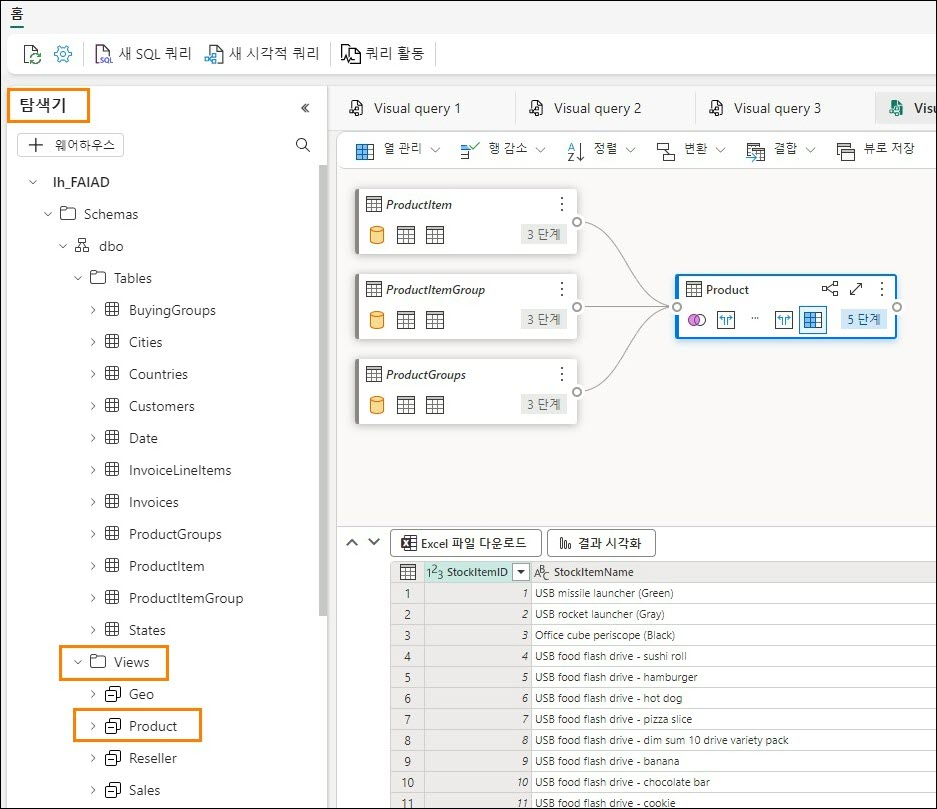

ADLS Gen2 데이터 원본에서 데이터를 변환했습니다. 이 랩에서는 바로 가기를 만드는 방법을 배우고 시각적 쿼리 보기를 사용하여 데이터를 변환하는 다양한 옵션을 살펴보았습니다.
다음 랩에서는 데이터 흐름 2세대를 사용하고 다른 레이크하우스로 바로 가기를 만드는 방법에 대해 알아보겠습니다.


# 참조
Fabric Analyst in a Day(FAIAD)는 Microsoft Fabric에서 사용할 수 있는 몇 가지 주요 기능을 소개합니다. 서비스의 메뉴에 있는 도움말(?) 섹션에는 유용한 리소스로 연결되는 링크가 있습니다.


아래는 Microsoft Fabric의 다음 단계에 도움이 되는 몇 가지 추가 자료입니다.
- Microsof t Fabric GA 발표 전문을 블로그 포스트로 읽기
- 가이드 투어로 Fabric 탐색
- Microsof t Fabric 무료 평가판 신청
- Microsof t Fabric 웹사이트 방문
- Fabric 학습 모듈을 탐색해서 새로운 기술 익히기
- Fabric 기술 문서 검토
- Fabric 시작하기 무료 e북 읽기
- Fabric 커뮤니티에 가입하여 질문을 게시하고 피드백을 공유하며 다른 사람들로부터 배우기
더 많은 심층 Fabric 환경 발표 블로그 포스트 읽기:
- Fabric 블로그의 Data Factory 환경
- Fabric 블로그의 Synapse Data Engineering 환경
- Fabric 블로그의 Synapse Data Science 환경
- Fabric 블로그의 Synapse Data Warehousing 환경
- Fabric 블로그의 Synapse Real-Time Analytics 환경
- Power BI 발표 블로그
- Fabric 블로그의 Data Activator 환경
- Fabric 블로그의 관리 및 거버넌스
- Fabric 블로그의 OneLake
- Dataverse 및 Microsof t Fabric 통합 블로그

© 2023 Microsoft Corporation. All rights reserved.
이 데모/랩을 사용하면 다음 조건에 동의하게 됩니다.
이 데모/랩에 설명된 기술/기능은 학습 환경을 제공하고 사용자 의견을 얻기 위해 Microsoft Corporation에서 제공합니다. 데모/랩을 통해서만 이러한 기술적 특성과 기능을 평가하고 사용자 의견을 Microsoft에 제시할 수 있습니다. 다른 용도로는 사용할 수 없습니다. 이 데모/랩 또는 그 일부에 대해 수정, 복사, 배포, 전송, 표시, 수행, 재현, 게시, 라이선스 허여, 파생 작업 생성, 양도 또는 판매할 수 없습니다.
추가 복제 또는 재배포를 위한 다른 서버 또는 위치에 대한 데모/랩(또는 그 일부)의 복사 또는 재현은 명시적으로 금지됩니다.
이 데모/랩은 위에서 명시한 목적을 위해 복잡한 설정 또는 설치가 없는 시뮬레이션된 환경에서 잠재적인 새로운 기능과 개념을 포함하여 특정 소프트웨어 기술/제품의 특성 및 기능을 제공합니다. 이 데모/랩에서 서술된 기술/개념은 전체 기능을 나타내지 않을 수 있으며, 최종 버전이 작동하지 않을 수도 있습니다. 또한 해당 기능 또는 개념의 최종 버전을 릴리스하지 않을 수도 있습니다. 또한 실제 환경에서 이러한 특성과 기능을 사용한 경험이 다를 수도 있습니다.
 
피드백. 이 데모/랩에서 서술된 기술적 특성, 기능 및/또는 개념에 대한 사용자 의견을
Microsoft에 제시하면 Microsoft는 이 사용자 의견을 어떤 방식과 목적으로든 무료로 사용, 공유 및 상용화할 수 있습니다. 또한 제품, 기술 및 서비스에서 사용자 의견이 포함된
Microsoft 소프트웨어 또는 서비스의 특정 부분을 사용하거나 인터페이스하는 데 필요한 모든 특허권을 제3자에게 무료로 제공합니다. Microsoft에서 사용자 의견을 포함하기 때문에 Microsoft에서 해당 소프트웨어 또는 설명서의 사용을 인가해야 하는 라이선스에 종속된 사용자 의견은 제공할 수 없습니다. 이러한 권리는 본 계약에 의거하여 유효합니다.
Microsoft Corporation은 이에 따라 명시적, 묵시적 또는 법적 특정 목적에의 적합성, 권리 및 비침해 여부에 관계없이 모든 보증과 조건을 포함하여 데모/랩과 관련된 모든 보증 및 조건을 부인합니다. Microsoft는 어떤 목적으로든 결과의 정확성, 데모/랩의 사용으로 파생된 출력 또는 데모/랩에 포함된 정보의 적합성과 관련하여 어떠한 보증이나 진술도 하지 않습니다.
고지 사항
이 데모/랩에는 Microsoft Power BI의 새로운 기능 및 향상된 기능 중 일부만 포함되어 있습니다. 일부 기능은 제품의 향후 릴리스에서 변경될 수 있습니다. 이 데모/랩에서는 새로운 기능 모두가 아닌 일부에 대해 학습하게 됩니다.
