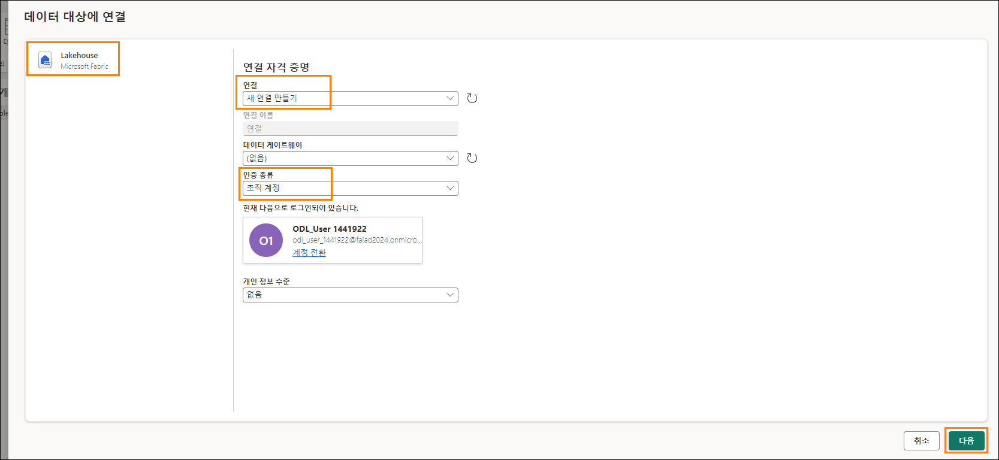

# 목차

- 소개	
- 데이터 흐름 2세대	
  - 작업 1: SharePoint 쿼리를 데이터 흐름에 복사	
  - 작업 2: SharePoint 연결 만들기	
  - 작업 3: People 쿼리를 위한 데이터 대상 구성	
  - 작업 4: SharePoint 데이터 흐름 이름 바꾸기 및 게시	
  - 작업 5: Snowflake 쿼리를 데이터 흐름에 복사	
  - 작업 6: Snowflake에 대한 연결 만들기	
  - 작업 7: Supplier 및 PO 쿼리를 위한 데이터 대상 구성	
  - 작업 8: Snowflake 데이터 흐름 이름 바꾸기 및 게시	
- ADLS Gen2 바로 가기	
  - 작업 9: Dataverse 바로 가기 생성 방법	
  - 작업 6: 레이크하우스로 바로 가기 만들기	
- 참조	

 
# 소개

우리 시나리오에서 공급사 데이터는 **Snowflake**  에 있고 고객 데이터는 **Dataverse에** 있으며 직원 데이터는 **SharePoint에** 있습니다. 이들 모든 데이터 원본은 서로 다른 시간에 업데이트됩니다. 데이터 흐름의 데이터 새로 고침 횟수를 최소화하기 위해 **Snowflake** 및 **SharePoint** 데이터 원본에 대한 개별 데이터 흐름을 만들겠습니다.

**참고:** 단일 데이터 흐름에서는 복수의 데이터 원본이 지원됩니다.

IT 팀은 이미 **Dataverse**에 대한 링크를 설정하고 필요한 데이터 변환을 적용하여 **Power BI Desktop** 파일에 있는 데이터 변환을 미러링했습니다. 이 데이터를 관리자 작업 영역의 레이크하우스에 수집하고 테이블에 대한 액세스 권한을 부여했습니다. 레이크하우스 IT 팀이 만든 바로 가기를 만들려고 합니다.

이 랩을 마치면 다음 사항을 알게 됩니다.

-	데이터 흐름 2세대를 사용하여 SharePoint에 연결하고 레이크하우스에 데이터를 수집하는 방법
-	데이터 흐름 2세대를 사용하여 Snowflake에 연결하고 레이크하우스로 데이터를 수집하는 방법
-	공유 레이크하우스에서 데이터를 수집하는 방법

# 데이터 흐름 2세대

## 작업 1: SharePoint 쿼리를 데이터 흐름에 복사

1.	다시 랩 2, 작업 9에서 만든 Fabric 작업 영역, **FAIAD_<username>**으로 되돌아가 보겠습니다.

2.	화면 왼쪽 하단에서 **Fabric 환경 선택기 아이콘**을 선택합니다. Fabric 환경 대화 상자가 열립니다

3.	대화 상자에서 **Data Factory**를 선택합니다. **Data Factory 홈 페이지**로 이동됩니다.

    

4.	권장 항목에서 **데이터 흐름 2세대**를 선택합니다.

    

**데이터 흐름 페이지**로 이동됩니다. 데이터 흐름 2세대 인터페이스는 Power BI Desktop의 Power Query과 같습니다. 쿼리를 Power BI Desktop에서 데이터 흐름 2세대로 복사할 수 있습니다. 시도해 보겠습니다.

5.	아직 열지 않았다면, 랩 환경의 바탕 화면에서 **Report** 폴더에 있는 **FAIAD.pbix**를 엽니다.
   
6.	리본 메뉴에서 **홈 ‐> 데이터 변환**을 선택합니다. Power Query 창이 열립니다. 이전 랩에서 알아본 것처럼 왼쪽 패널의 쿼리는 데이터 원본별로 구성됩니다.

7.	왼쪽 패널의 SharepointData 폴더에서 **People** 쿼리를 **선택**합니다.

8.	**마우스 우클릭**하고 **복사**를 선택합니다.

    

9.	브라우저에서 **데이터 흐름 화면**으로 다시 이동합니다.

10.	**데이터 흐름 창**에서 **Ctrl+V**를 입력합니다(현재 마우스 우클릭 붙여 넣기는 지원되지 않습니다). MAC 디바이스를 사용하는 경우 Cmd+V를 사용하여 붙여 넣습니다.

**참고:** 랩 환경에서 작업하는 경우 화면 오른쪽 상단에 있는 줄임표를 선택합니다. 슬라이더를 사용하여 **VM 네이티브 클립보드**를 **활성화**합니다. 대화 상자에서 확인을 선택합니다. 쿼리 붙여 넣기가 완료되면 이 옵션을 비활성화할 수 있습니다.

붙여 넣은 쿼리가 왼쪽 패널에 있는지 확인합니다. SharePoint에 대해 생성된 연결이 없으므로 연결 구성을 요청하는 경고 메시지가 표시됩니다.
 
# 작업 2: SharePoint 연결 만들기

1.	**연결 구성**을 선택합니다.

    

2.	데이터 원본에 연결 대화 상자가 열립니다. **연결**드롭다운에서 **새 연결 만들기**가 선택되어 있는지 확인합니다.

3.	**인증 종류**는 **조직 계정**이어야 합니다.

4.	**연결**을 선택합니다.
**참고:** 자격 증명을 사용하여 로그인됩니다. 아래 스크린샷과 다를 수 있습니다.

    
 
# 작업 3: People 쿼리를 위한 데이터 대상 구성

연결이 설정되고 프리뷰 패널에서 데이터를 볼 수 있습니다. 쿼리의 적용된 단계를 자유롭게 탐색하세요. 이제 People 데이터를 레이크하우스에 수집해야 합니다.
1.	**People** 쿼리를 선택합니다.

2.	리본 메뉴에서 **홈 ‐> 데이터 대상 추가 ‐> Lakehouse** 를 선택합니다.

    

3.	데이터 대상에 연결 대화 상자가 열립니다. 레이크하우스에 대한 새로운 연결을 생성해야 합니다. **연결 드롭다운에서 새 연결 만들기**를 선택하고 **조직 계정**을 **인증 종류**로 설정하여 다음을 선택합니다.

    

4.	목적지 대상 선택 대화 상자가 열립니다. 새 테이블을 만드는 중이므로 새 **테이블 라디오 버튼**이 선택되어 있는지 확인합니다.
5.	앞서 만든 레이크하우스에 테이블을 만들고자 합니다. 왼쪽 패널에서 **Lakehouse ‐> FAIAD_<username>**(으)로 이동합니다.
 
6.	**lh_FAIAD**를 선택합니다.

7.	테이블 이름을 **People**로 둡니다.

8.	**다음**을 선택합니다.

    

9.	대상 설정 선택 대화 상자가 열립니다. "**자동 설정 사용**"이 활성화되어 있는지 확인합니다.
**참고:** 자동 설정을 비활성화하면 업데이트 방법 및 스키마 옵션을 설정할 수 있는 옵션이 표시됩니다. 탐색이 끝나면 "**자동 설정 사용**"이 **활성화**되어 있는지 확인합니다.

10.	**설정 저장**을 선택합니다.

    
 
# 작업 4: SharePoint 데이터 흐름 이름 바꾸기 및 게시

1.	**Power Query 창**으로 이동합니다. **오른쪽 하단**에서 데이터 대상이 **Lakehouse** 로 설정된 것을 확인합니다.

2.	오른쪽 하단에서 **게시**를 선택합니다.

    

**참고: FAIAD_<username> 작업 영역**으로 되돌아갑니다. 데이터 흐름이 게시되는 데 몇 분 정도 걸릴 수 있습니다.

3.	데이터 흐름 1이 작업 중인 데이터 흐름입니다. 계속하기 전에 이름을 바꿔 보겠습니다.
Dataflow 1 옆에 있는 **줄임표(**...)를 클릭합니다. **속성**을 클릭합니다.

    
 
4.	데이터 흐름 속성 대화 상자가 열립니다. **이름**을 **df_People_SharePoint**로 변경합니다.

5.	**설명** 텍스트 상자에 **Dataflow to ingest People data from SharePoint to Lakehouse**를 추가합니다.

6.	**저장**을 선택합니다.

    

**FAIAD_<username> 작업 영역**으로 되돌아갑니다.
7.	**lh_FAIAD**를 선택하여 레이크하우스로 이동합니다.

8.	SQL 분석 엔드포인트가 아닌 Lakehouse 보기에 있는지 확인하세요.

9.	이제 레이크하우스에 **People** 테이블이 있습니다.

**참고:** 새로 생성된 테이블이 표시되지 않으면 테이블 옆에 있는 줄임표를 선택하고 새로 고침을 선택하여 테이블을 새로 고칩니다.
이제 모든 데이터가 레이크하우스에 수집되었습니다. 다음 랩에서는 데이터 흐름 새로 고침을 예약하겠습니다.
 
# 작업 5: Snowflake 쿼리를 데이터 흐름에 복사

1.	Fabric 작업 영역인 **FAIAD_<username>**로 다시 이동해 보겠습니다.

2.	메뉴에서 **새로 만들기 ‐> 데이터 흐**름 2세대를 선택합니다.

    

**데이터 흐름 페이지**로 이동됩니다. 이제 데이터 흐름에 익숙해졌으므로 Power BI Desktop에서 데이터 흐름으로 쿼리를 복사해 보겠습니다.

3.	아직 열지 않았다면, 랩 환경의 바탕 화면에서 **Report** 폴더에 있는 **FAIAD.pbix**를 엽니다.

4.	리본 메뉴에서 **홈 ‐> 데이터 변환**을 선택합니다. Power Query 창이 열립니다. 이전 랩에서 알아본 것처럼 왼쪽 패널의 쿼리는 데이터 원본별로 구성됩니다.

5. 왼쪽 패널의 SnowflakeData 폴더에서 다음 쿼리를 **Ctrl+선택** 또는 **Shift+선택**합니다:  
   a. SupplierCategories  
   b. Suppliers  
   c. Supplier  
   d. PO  
   e. PO Line Items  

6. **마우스 우클릭**하고 **복사**를 선택합니다.   

    

7.	**브라우저**로 돌아갑니다.

8.	**데이터 흐름 창**에서 **중앙 창**을 선택하고 **Ctrl+V**을 입력합니다(현재 마우스 우클릭 붙여 넣기는 지원되지 않습니다). MAC 디바이스를 사용하는 경우 Cmd+V를 사용하여 붙여 넣습니다.

**참고:** 랩 환경에서 작업하는 경우 화면 오른쪽 상단에 있는 줄임표를 선택합니다. 슬라이더를 사용하여 **VM 네이티브 클립보드**를 **활성화**합니다. 대화 상자에서 확인을 선택합니다. 쿼리 붙여 넣기가 완료되면 이 옵션을 비활성화할 수 있습니다.

 
# 작업 6: Snowflake에 대한 연결 만들기

5개의 쿼리가 붙여 넣기 되어 있고 이제 왼쪽에 쿼리 패널이 표시됩니다. **Snowflake******에 대해 생성된 연결이 없으므로 연결 구성을 요청하는 경고 메시지가 표시됩니다.

1.	**연결 구성**을 선택합니다.

    

2.	데이터 원본에 연결 대화 상자가 열립니다. **연결** 드롭다운에서 **새 연결 만들기**가 선택되어 있는지 확인합니다.

3.	**인증 종류는 Snowflake**여야 합니다.

4.	환경 변수 탭(랩 가이드 옆)에 있는 **Snowflake 사용자 이름 및 암호**를 입력합니다.

5.	**연결**을 선택합니다.

    

연결이 설정되고 미리보기 패널에서 데이터를 볼 수 있습니다. 쿼리의 적용된 단계를 자유롭게 탐색하세요. 기본적으로 Suppliers 쿼리에는 공급사의 상세 정보가 있으며 이름에서 알 수 있듯이 SupplierCategories에는 공급사 범주가 있습니다. 이 두 테이블은 결합하여 필요한 열이 포함된 Supplier 차원을 생성합니다. 마찬가지로 PO Line Items을 PO와 병합하여 PO 팩트를 생성합니다. 이제 Supplier 및 PO 데이터를 레이크하우스에 수집해야 합니다.
 
# 작업 7: Supplier 및 PO 쿼리를 위한 데이터 대상 구성

1.	**Supplier** 쿼리를 선택합니다.

2.	리본 메뉴에서 **홈 ‐> 데이터 대상 추가 ‐> Lakehouse**를 선택합니다.

    

3.	데이터 대상에 연결 대화 상자가 열립니다. **연결 드롭다운**에서 **Lakehouse(없음)** 를 선택합니다.

4.	**다음**을 선택합니다.

    

5.	목적지 대상 선택 대화 상자가 열립니다. 새 테이블을 만드는 중이므로 **새 테이블 라디오 버튼이 선택**되어 있는지 확인합니다.

6.	앞서 만든 레이크하우스에 테이블을 만들고자 합니다. 왼쪽 패널에서 **Lakehouse ‐> FAIAD_<username>**(으)로 이동합니다.

7.	**lh_FAIAD**를 선택합니다.
 
8.	테이블 이름을 **Supplier**로 둡니다.

9.	**다음**을 선택합니다.

    

10.	대상 설정 선택 대화 상자가 열립니다. 데이터의 전체 업데이트가 이루어지므로 자동 설정을 사용할 것입니다. 또한 필요에 따라 열 이름을 바꿉니다. **설정 저장**을 선택합니다.

    

11.	**Power Query** 창으로 이동합니다. **오른쪽 하단**에서 데이터 대상이 **Lakehouse**로 설정된 것을 확인합니다. 마찬가지로 **PO 쿼리를 위한 데이터 대상을 설정**합니다. 완료되면 PO 쿼리는 아래 스크린샷과 같이 **데이터 대상**을 **Lakehouse**로 설정해야 합니다.
 
    

# 작업 8: Snowflake 데이터 흐름 이름 바꾸기 및 게시

1.	화면 상단에서 **데이터 흐름 1 옆에 있는 화살표**를 선택하여 이름을 바꿉니다.

2.	대화 상자에서 이름을 **df_Supplier_Snowflake**로 변경합니다.

3.	이름 변경 사항을 저장하려면 **Enter**를 클릭합니다.

    

4.	오른쪽 하단에서 **게시**를 선택합니다.
 
    
 
**FAIAD_<username> 작업 영역**으로 되돌아갑니다. 데이터 흐름이 게시되는 데 몇 분 정도 걸릴 수 있습니다.

5.	**lh_FAIAD**를 선택하여 Lakehouse 로 이동합니다.

6.	SQL 분석 엔드포인트가 아닌 Lakehouse 보기에 있는지 확인하세요.

7.	이제 레이크하우스에서 **PO 및 Supplier** 테이블을 사용할 수 있습니다.

**참고:** 새로 생성된 테이블이 표시되지 않으면 테이블 옆에 있는 줄임표를 선택하고 새로 고침을 선택하여 테이블을 새로 고칩니다.
이제 Dataverse에서 데이터를 가져오는 바로 가기를 만들어 보겠습니다.
 
# ADLS Gen2 바로 가기

## 작업 9: Dataverse 바로 가기 생성 방법

레이크하우스 **lh_FAIAD**에 있어야 합니다. SQL 분석 엔드포인트가 아닌 Lakehouse 보기에 있는지 확인하세요.

1.	**왼쪽 탐색기** 창에서 **테이블** 옆의 **줄임표**를 선택합니다.

2.	**새 바로 가기**를 선택합니다.

    

3.	새 바로 가기 대화 상자가 열립니다. **외부 원본에서 Dataverse**를 선택합니다.

    

**참고:** 이전 랩에서는 유사한 단계에 따라 Azure Data Lake Storage Gen2에 대한 바로 가기를 만들었습니다.
 
4.	연결 설정 대화 상자가 열립니다. **환경 도메인**으로 **org6c18814a.crm.dynamics.com**을 입력합니다.

5.	**인증 종류**를 **조직 계정**으로 그대로 둡니다.

6.	**로그인**을 선택합니다.

    

7.	계정에 로그인 대화 상자가 열립니다. 로그인할 **계정을 선택**합니다.

**참고:** 계정은 아래 스크린샷과 다를 수 있습니다.

8.	연결 설정 대화 상자에서 **다음**을 선택합니다.

Dataverse에서 다른 버킷/디렉터리를 선택할 수 있는 대화 상자로 이동합니다. 다양한 버킷을 사용할 수 있습니다. 필요한 버킷을 선택하고 랩 3(시각적 쿼리를 사용하여 데이터 변환 및 보기 만들기)과 같은 프로세스를 따를 수 있습니다. 이 랩의 앞부분에서 사용한 것과 같이 데이터 흐름 2세대를 사용하여 SharePoint에 연결할 수도 있습니다. 하지만 사용 가능한 다른 옵션이 있음을 알려드리고자 합니다.

이 시나리오에서는 IT 팀은 이미 Dataverse에 대한 링크를 설정하고 필요한 데이터 변환을 적용하여 Power BI Desktop 파일에 있는 데이터 변환을 미러링했습니다. 이 데이터를 관리자 작업 영역의 레이크하우스에 수집하고 테이블에 대한 액세스 권한을 부여했습니다. IT 팀이 모든 작업을 완료했으므로 관리자 작업 영역에 이 레이크하우스로 바로 가기를 만들 수 있습니다.

9.	새로 만들기 바로 가기 대화 상자에서 **취소**를 선택하여 레이크하우스로 다시 이동합니다.
 
    

# 작업 6: 레이크하우스로 바로 가기 만들기

1.	**왼쪽 탐색**기 창에서 **테이블** 옆의 **줄임표**를 선택합니다.

2.	**새 바로 가기**를 선택합니다.

    

3.	새 바로 가기 대화 상자가 열립니다. 내부 원본에서 **Microsoft OneLake** 옵션을 선택합니다.

    
 
4. 데이터 원본 유형 선택 대화 상자가 열립니다. 두 개의 데이터 원본이 있음을 알 수 있습니다:  
   a. lh_FAIAD – 여러분이 만든 레이크하우스입니다.  
   b. lh_dataverse – 관리자가 만든 레이크하우스입니다.  

5. **lh_dataverse**를 선택합니다.  

6. **다음**을 선택합니다.

    

7.	왼쪽 패널에서 **lh_dataverse ‐> Tables**를 확장합니다. IT 관리자가 Customer 테이블에 대한 액세스 권한을 제공했습니다.

8.	**Customer**를 선택합니다.
 
9.	**다음**을 선택합니다.

    

10.	다음 대화 상자에서 **만들기**를 선택합니다. lh_FAIAD 레이크하우스로 돌아갑니다.

    

11.	왼쪽의 **탐색기** 패널에서 새 **Customer** 테이블이 생성된 것을 확인할 수 있습니다.

12.	**Customer** 테이블을 선택하여 프리뷰 패널에서 데이터를 봅니다. 다른 레이크하우스로 가는 바로 가기를 만들었습니다.
다음 랩에서는 일정 새로 고침을 설정해 보겠습니다.
 
# 참조

Fabric Analyst in a Day(FAIAD)는 Microsoft Fabric에서 사용할 수 있는 몇 가지 주요 기능을 소개합니다. 서비스의 메뉴에 있는 도움말(?) 섹션에는 유용한 리소스로 연결되는 링크가 있습니다.

아래는 Microsoft Fabric의 다음 단계에 도움이 되는 몇 가지 추가 자료입니다.
•	Microsoft Fabric GA 발표 전문을 블로그 포스트로 읽기
•	가이드 투어로 Fabric 탐색
•	Microsoft Fabric 무료 평가판 신청
•	Microsoft Fabric 웹사이트 방문
•	Fabric 학습 모듈을 탐색해서 새로운 기술 익히기
•	Fabric 기술 문서 검토
•	Fabric 시작하기 무료 e북 읽기
•	Fabric 커뮤니티에 가입하여 질문을 게시하고 피드백을 공유하며 다른 사람들로부터 배우기
 
더 많은 심층 Fabric 환경 발표 블로그 포스트 읽기:
•	Fabric 블로그의 Data Factory 환경
•	Fabric 블로그의 Synapse Data Engineering 환경
•	Fabric 블로그의 Synapse Data Science 환경
•	Fabric 블로그의 Synapse Data Warehousing 환경
•	Fabric 블로그의 Synapse Real-Time Analytics 환경
•	Power BI 발표 블로그
•	Fabric 블로그의 Data Activator 환경
•	Fabric 블로그의 관리 및 거버넌스
•	Fabric 블로그의 OneLake
•	Dataverse 및 Microsoft Fabric 통합 블로그

© 2023 Microsoft Corporation. All rights reserved.
이 데모/랩을 사용하면 다음 조건에 동의하게 됩니다.
이 데모/랩에 설명된 기술/기능은 학습 환경을 제공하고 사용자 의견을 얻기 위해 Microsoft Corporation에서 제공합니다. 데모/랩을 통해서만 이러한 기술적 특성과 기능을 평가하고 사용자 의견을 Microsoft에 제시할 수 있습니다. 다른 용도로는 사용할 수 없습니다. 이 데모/랩 또는 그 일부에 대해 수정, 복사, 배포, 전송, 표시, 수행, 재현, 게시, 라이선스 허여, 파생 작업 생성, 양도 또는 판매할 수 없습니다.
추가 복제 또는 재배포를 위한 다른 서버 또는 위치에 대한 데모/랩(또는 그 일부)의 복사 또는 재현은 명시적으로 금지됩니다.
이 데모/랩은 위에서 명시한 목적을 위해 복잡한 설정 또는 설치가 없는 시뮬레이션된 환경에서 잠재적인 새로운 기능과 개념을 포함하여 특정 소프트웨어 기술/제품의 특성 및 기능을 제공합니다. 이 데모/랩에서 서술된 기술/개념은 전체 기능을 나타내지 않을 수 있으며, 최종 버전이 작동하지 않을 수도 있습니다. 또한 해당 기능 또는 개념의 최종 버전을 릴리스하지 않을 수도 있습니다. 또한 실제 환경에서 이러한 특성과 기능을 사용한 경험이 다를 수도 있습니다.
 
피드백. 이 데모/랩에서 서술된 기술적 특성, 기능 및/또는 개념에 대한 사용자 의견을
Microsoft에 제시하면 Microsoft는 이 사용자 의견을 어떤 방식과 목적으로든 무료로 사용, 공유 및 상용화할 수 있습니다. 또한 제품, 기술 및 서비스에서 사용자 의견이 포함된
Microsoft 소프트웨어 또는 서비스의 특정 부분을 사용하거나 인터페이스하는 데 필요한 모든 특허권을 제3자에게 무료로 제공합니다. Microsoft에서 사용자 의견을 포함하기 때문에 Microsoft에서 해당 소프트웨어 또는 설명서의 사용을 인가해야 하는 라이선스에 종속된 사용자 의견은 제공할 수 없습니다. 이러한 권리는 본 계약에 의거하여 유효합니다.
Microsoft Corporation은 이에 따라 명시적, 묵시적 또는 법적 특정 목적에의 적합성, 권리 및 비침해 여부에 관계없이 모든 보증과 조건을 포함하여 데모/랩과 관련된 모든 보증 및 조건을 부인합니다. Microsoft는 어떤 목적으로든 결과의 정확성, 데모/랩의 사용으로 파생된 출력 또는 데모/랩에 포함된 정보의 적합성과 관련하여 어떠한 보증이나 진술도 하지 않습니다.
고지 사항
이 데모/랩에는 Microsoft Power BI의 새로운 기능 및 향상된 기능 중 일부만 포함되어 있습니다. 일부 기능은 제품의 향후 릴리스에서 변경될 수 있습니다. 이 데모/랩에서는 새로운 기능 모두가 아닌 일부에 대해 학습하게 됩니다.
