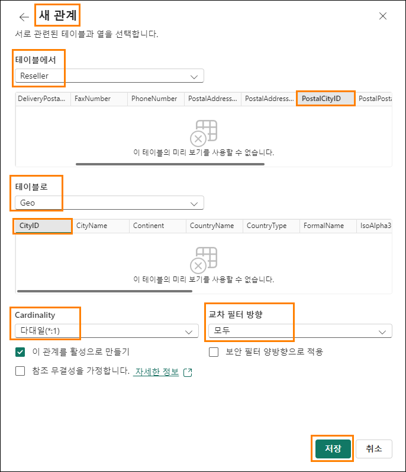

# Microsoft Fabric - 일일 패브릭 분석가 - 랩 6


# 목차

- 소개	
- 레이크하우스 – 데이터 분석	
  - 작업 1: SQL을 사용한 데이터 쿼리	
  - 작업 2: T-SQL 결과 시각화	
- 레이크하우스 - 의미 체계 모델링	
  - 작업 3: 의미 체계 모델 만들기	
  - 작업 4: 관계 만들기	
  - 작업 5: 측정값 만들기	
  - 작업 6: 선택 섹션 – 관계 만들기	
  - 작업 7: 선택 섹션 – 측정값 만들기	
- 참조	

# 소개
우리는 다양한 데이터 원본의 데이터를 레이크하우스로 수집했습니다. 본 랩에서는 의미 체계 모델을 사용합니다. 일반적으로 우리는 **Power BI Desktop**에서 관계 생성, 측정값 추가 등과 같은 모델링 활동을 수행했습니다. 여기서는 서비스에서 이러한 모델링 활동을 수행하는 방법을 알아봅니다.

이 랩을 마치면 다음 사항을 알게 됩니다.
  - SQL 분석 엔드포인트에서 SQL 보기 사용
  -	의미 체계 모델 만들기

# 레이크하우스 – 데이터 분석

## 작업 1: SQL을 사용한 데이터 쿼리

1. 다시 랩 2, 작업 9에서 만든 Fabric 작업 영역, **FAIAD_\<username>** 으로 되돌아가 보겠습니다.

2. 원하는 경우 **작업 흐름을 최소화**하여 전체 항목 목록을 볼 수 있습니다.

3. lh_FAIAD의 세 가지 유형(레이크하우스, 의미 체계 모델 및 SQL 엔드포인트)을 보게 됩니다. 이전 랩에서 레이크하우스를 탐색하고 SQL 분석 엔드포인트를 사용하여 시각적 쿼리를 만들♘습니다. 이 옵션을 계속 탐색하려면 **lh_FAIAD SQL 분석 엔드포인트** 옵션을 선택합니다. 탐색기의 **SQL 보기**로 이동합니다.

    

    데이터 모델을 만들기 전에 데이터를 탐색하려면 SQL을 사용하면 됩니다. SQL을 사용하는 방법에는 두 가지 옵션이 있습니다. 첫 번째 옵션은 이전 랩에서 사용한 시각적 쿼리입니다. 옵션 2는 TSQL 코드를 작성하는 것입니다. 개발자 친화적인 옵션입니다. 이에 대해서 알아보겠습니다.

    SQL을 사용하여 Supplier가 판매한 Units를 빠르게 찾고 싶다고 가정해 보겠습니다.

    SQL 분석 엔드포인트인 레이크하우스의 왼쪽 패널에서 테이블을 볼 수 있습니다. 테이블을 확장하면 테이블을 구성하는 열을 볼 수 있습니다. 또한 SQL 보기, 함수 및 저장 프로시저를 생성하는 옵션도 있습니다. SQL에 대한 배경 지식이 있다면 자유롭게 다음 옵션을 살펴보세요. 간단한 SQL 쿼리를 작성해 보겠습니다.

4. **상단 메뉴**에서 **새 SQL 쿼리**를 선택하거나, **왼쪽 패널 하단**에서 **쿼리**를 선택합니다. SQL 쿼리 보기로 이동합니다.

    

5. **아래 SQL 쿼리**를 **쿼리 창**에 붙여 넣습니다. 이 쿼리는 Supplier 이름별로 unit을 반환합니다. 이를 달성하기 위해 Sales 테이블을 Product 및 Supplier 테이블과 결합합니다.

    ```
    SELECT su.SupplierName, SUM(Quantity) as Units FROM dbo.Sales s
    JOIN dbo.Product p on p.StockItemID = s.StockItemID JOIN dbo.Supplier su on su.SupplierID = p.SupplierID GROUP BY    
    su.SupplierName
    ```
6. SQL 편집기 메뉴에서 **Run** 을 클릭하여 결과를 확인합니다.

7. **뷰로 저장**을 선택하여 이 쿼리를 뷰로 저장할 수 있는 옵션이 있습니다.
 
8. **왼쪽 탐색기** 패널의 **쿼리** 섹션에서 이 쿼리가 **내 쿼리** 아래에 **SQL query 1**으로 저장되어 있습니다. 이는 쿼리 이름을 바꾸고 나중에 사용할 수 있도록 저장하는 옵션을 제공합니다. **공유 쿼리** 폴더를 사용하여 나와 공유된 쿼리를 볼 수 있는 옵션도 있습니다.

    **참고:** 이전 랩에서 만든 시각적 쿼리는 내 쿼리 폴더에서도 사용할 수 있습니다.

    

# 작업 2: T-SQL 결과 시각화

1. 이 쿼리의 결과를 시각화할 수도 있습니다. 쿼리 창에서 **쿼리를 강조 표시**합니다

2. 결과 창 메뉴에서 **이 데이터 탐색(미리 보기) > 결과 시각화**를 선택합니다.

    

3. **결과 시각화** 대화 상자가 열립니다. 계속을 선택합니다.
 
    **결과 시각화** 대화 상자가 열리고 Power BI Desktop보고서 보기처럼 보입니다. 여기에는 Power BI Desktop 보고서 보기에서 사용할 수 있는 모든 기능이 있으며, 페이지 서식 지정, 다양한 시각적 개체 선택, 시각적 개체 서식 지정, 필터 추가 등을 수행할 수 있습니다. 이 과정에서는 이러한 옵션을 살펴보지 않습니다.

4. **데이터** 창에서 확장하고 **SQL query 1**을 확장합니다.

5. **Supplier_Name 및 Units 필드**를 선택합니다. 테이블 시각적 개체가 생성되♘습니다.

    

6. **시각화 섹션**에서 **누적 세로 막대형 차트**를 선택하여 시각적 개체 유형을 변경합니다.

7. 화면의 오른쪽 하단에서 **보고서로 저장**을 선택합니다.

    

8. 보고서 저장 대화 상자가 열립니다. **보고서의 이름 입력 텍스트 상자에 Units by Supplier를** 입력합니다.

9. 대상 작업 영역이 Fabric 작업 영역 **FAIAD_\<username>** (으)로 설정되어 있는지 확인합니다.

10. **저장**을 선택합니다.

    
 
    SQL 쿼리 화면으로 되돌아갑니다.

# 레이크하우스 - 의미 체계 모델링

## 작업 3: 의미 체계 모델 만들기

1. **하단 창에서 모델**을 선택합니다. 가운데 창은 Power BI Desktop에서 볼 수 있는 모델 뷰와 비슷합니다.

    

    이것이 레이크하우스에서 생성하는 기본 모델입니다. 그러나 기본 모델에는 몇 가지 제한 사항이 있습니다(측정값 서식 지정 기능 등). 또한 모델에 있는 테이블의 하위 집합만 필요합니다. 그래서 우리는 새로운 의미 체계 모델을 만들 것입니다.

2. 메뉴에서, 오른쪽 상단의 **SQL 분석 엔드포인트 옆에 있는 화살표를 선택합니다**.

3. 레이크하우스를 선택하면 **레이크하우스** 보기로 이동합니다.

    

4. 메뉴에서 **홈 ‐> 새 의미 체계 모델**을 선택합니다.

5. 새 의미 체계 모델 대화 상자가 열립니다. **sm_FAIAD**를 Direct Lake 의미 체계 모델 이름으로 입력합니다.

6. 기본적으로 테이블의 하위 집합을 선택할 수 있는 옵션이 있습니다. 이전 랩에서 보기를 만들♘음을 기억하세요. 이러한 보기를 모델에 포함하려고 합니다. **검색창**의 **아이콘**을 **클릭**하고 **보기 표시**를 선택합니다. 이제 보기를 보고 선택할 수 있는 옵션이 생겼습니다.

    

7. 다음 테이블/보기를 **선택**합니다:  

   a. Date  
   b. People  
   c. Customer  
   d. PO  
   e. Supplier  
   f. Geo  
   g. Reseller  
   h. Sales  
   i. Product
    
9. **확인**을 선택합니다.

    

# 작업 4: 관계 만들기

선택한 테이블이 있는 새 의미 체계 모델로 이동합니다. 필요에 따라 테이블을 **재배치**하십시오. 일부 테이블(Geo, Reseller, Sales 및 Product)의 경우 테이블 오른쪽 상단에 경고 표시가 있습니다. 이는 보기이기 때문입니다. 이러한 보기의 필드를 사용하여 만든 모든 시각적 

개체는 Direct Lake 모드가 아닌 Direct Query 모드가 됩니다.

**참고:** Direct Lake 모드는 Direct Query 모드보다 빠릅니다.


첫 번째 단계는 이러한 테이블 간에 관계를 만드는 것입니다.

1. Sales 테이블과 Reseller 테이블 간의 관계를 만들어 보겠습니다. **Sales** 테이블에서 **ResellerID**를 선택하여 **Reseller** 테이블의 **ResellerID**로 드래그합니다.

    
 
2. 새 관계 대화 상자가 열립니다. **테이블에서**가 **Sales**이고 열이 **ResellerID**인지 확인합니다.

3. **테이블로**가 **Reseller**이고 열이 **ResellerID**인지 확인합니다.

4. **Cardinality 다대일(*:1)** 인지 확인합니다.

5. **교차 필터 방향**이 **Single**인지 확인합니다.

6. **저장**을 선택합니다.

    

7. 마찬가지로 Sales 테이블과 Date 테이블 간의 관계를 만듭니다. **Sales** 테이블에서 **InvoiceDate**를 선택하여 **Date** 테이블의 **Date**로 드래그합니다.

8. 새 관계 대화 상자가 열립니다. **테이블에서**가 **Sales**이고 열이 **InvoiceDate**인지 확인합니다.

9. **테이블로**가 **Date**이고 열이 **Date**인지 확인합니다.

10.	Cardinality 다대일(*:1)인지 확인합니다.

11.	**교차 필터 방향**이 **Single**인지 확인합니다.

12. **저장**을 선택합니다.

    
 
13.	비슷하게, **Sales**와 **Product** 테이블 사이에 **다대일** 관계를 만듭니다. **Sales** 테이블에서 **StockItemID**를 그리고 **Product** 테이블에서 **StockItemID**를 선택합니다.

    **참고:** 모든 업데이트는 자동으로 저장됩니다.

    **체크포인트:** 현재 모델은 아래 스크린샷에 표시된 것처럼 Sales와 Reseller 테이블 간 및 Sales와 Date 그리고 Sales와 Product 테이블 간의 세 가지 관계가 있어야 합니다.
    
    

    시간 관계상 모든 관계를 만들지는 않을 것입니다. 시간이 허락한다면 랩 마지막에 선택 섹션을 완료할 수 있습니다. 선택 섹션에서는 나머지 관계를 만드는 단계를 안내합니다.

# 작업 5:** 측정값 만들기

Sales 대시보드를 만드는 데 필요한 몇 가지 측정값을 추가해 보겠습니다.

1. 모델 뷰에서 **Sales 테이블**을 선택합니다. Sales 테이블에 측정값을 추가하려고 합니다.

2. 상단 메뉴에서 **홈 ‐ > 새 측정값**을 선택합니다. 수식 입력줄이 표시됩니다.

3. **수식 입력줄에 Sales = SUM(Sales[Sales Amount])**를 입력합니다.

4. 수식 입력줄 왼쪽의 **체크 표시 **를 클릭하거나 Enter 버튼을 클릭합니다.

5. 오른쪽의 속성 패널을 확장합니다.

6. **서식** 섹션을 확장합니다.

7. **서식** 드롭다운 목록에서 **통화**를 선택합니다.

8. 소수점 자릿수를 **0**으로 설정합니다.

    

9. 상단 메뉴에서 **Sales 테이블** 을 선택한 상태에서 **홈 ‐> 새 측정값**을 선택합니다. 수식 입력줄이 표시됩니다.

10.	**수식 입력줄에 Units = SUM(Sales[Quantity])** 을 입력합니다.

11.	수식 입력줄 왼쪽의 **체크 표시** 를 클릭하거나 **Enter** 버튼을 클릭합니다.

12.	오른쪽의 속성 패널에서 **서식** 섹션을 확장합니다(속성 패널을 로드하는 데 몇 분 정도 걸릴 수 있습니다).

13.	**서식** 드롭다운 목록에서 정수를 선택합니다.

14. **천단위 구분 기호**를 **예**로 설정합니다.

    

15.	상단 메뉴에서 **Sales 테이블** 을 선택한 상태에서 **홈 ‐> 새 측정값**을 선택합니다. 수식 입력줄이 표시됩니다.

16.	**수식 입력줄에 Sales Orders = DISTINCTCOUNT(Sales[InvoiceID])**를 입력합니다.

17.	수식 입력줄 왼쪽의 **체크 표시** 를 클릭하거나 **Enter** 버튼을 클릭합니다.

18.	오른쪽 속성 패널에서 **서식** 섹션을 확장합니다.

19.	**서식** 드롭다운 목록에서 **정수**를 선택합니다.

20. **천단위 구분 기호**를 **예**로 설정합니다.

    

21.	**데이터 창**(오른쪽)에서 **모델**을 선택합니다. 이렇게 하면 의미 체계의 모든 항목을 정리하는 데 도움이 되는 보기가 제공됩니다.

22.	**의미 체계 모델 ‐ > 측정값**을 확장하여 방금 만든 모든 측정값을 봅니다.

23. **개별 테이블을 확장**하여 각 테이블의 열, 계층 및 측정값을 볼 수도 있습니다.

    
 
    다시 한 번 말씀드리지만, 시간 관계상 모든 조치를 만들지는 않을 것입니다. 시간이 허락한다면 랩 마지막에 선택 섹션을 완료할 수 있습니다. 선택 섹션에서는 나머지 측정값을 만드는 단계를 안내합니다. 의미 체계 모델을 만들♘으니, 다음 단계는 보고서를 만드는 것입니다. 그 작업은 다음 랩에서 하도록 하겠습니다.

# 작업 6: 선택 섹션 – 관계 만들기

나머지 관계를 추가해 보겠습니다.

1. 상단 메뉴에서 홈 - > 관계 관리를 선택합니다.

2. 관계 관리 대화 상자가 열립니다. 새 관계를 선택합니다. 

    

3. 새 관계 대화 상자가 열립니다. **테이블에서가 Sales**이고 **열**이 **SalespersonPersonID**인지 확인합니다.

4. **테이블로가 People**이고 **열**이 **PersonID**인지 확인합니다.

5. **Cardinality 다대일(*:1)** 인지 확인합니다.

6. **교차 필터 방향**이 **Single**인지 확인합니다.

7. **저장**을 선택합니다. 새 관계가 추가된 관계 관리 대화 상자가 열립니다.

    

8. 이제 Product와 Supplier 간의 관계를 만들어 보겠습니다. **새 관계**를 선택합니다.

9. **테이블에서**가 **Product**이고 열이 **SupplierID**인지 확인합니다.

10. **테이블로**가 **Supplier**이고 열이 **SupplierID**인지 확인합니다.

11. **Cardinality 다대일**(*:1)인지 확인합니다.

12. **교차 필터 방향**이 **모두**인지 확인합니다.

13. **저장**을 선택합니다.

    

14.	이제 Reseller과 Geo 간의 **관계**를 만들어 보겠습니다. 새 관계를 선택합니다.

15.	새 관계 대화 상자가 열립니다. **테이블에서**가 **Reseller**이고 열이 **PostalCityID**인지 확인합니다.

16.	**T테이블로**가 **Geo**이고 열이 **CityID**인지 확인합니다.

17.	**Cardinality 다대일(*:1)** 인지 확인합니다.

18.	**교차 필터 방향이 모두**인지 확인합니다.

19. **저장**을 선택합니다.

    

20. 마찬가지로 Customer와 Reseller 간의 **관계**를 만들어 보겠습니다. 새 관계를 선택합니다.

21. 새 관계 대화 상자가 열립니다. **테이블에서**가 **Customer**이고 열이 **ResellerID**인지 확인합니다.

22. **테이블로**가 **Reseller**이고 열이 **ResellerID**인지 확인합니다.

23. **Cardinality 다대일(*:1)** 인지 확인합니다.

24. **교차 필터 방향**이 **Single**인지 확인합니다.

25. **저장**을 선택합니다.

    

    **체크포인트:** 관계 관리는 아래 스크린샷과 같이 표시되어야 합니다.

26. 마찬가지로 **PO**와 **Date** 테이블 사이에 **다대일** 관계를 만듭니다. **PO**에서 **Order_Date**를 선택하고 **날짜**에서 **Date**를 선택합니다.

27. 마찬가지로 **PO**와 **Product** 테이블 사이에 **다대일** 관계를 만듭니다. **PO**에서 **StockItemID**를 그리고 **Product**에서 **StockItemID**를 선택합니다.

28. 마찬가지로 **PO**와 **People** 테이블 사이에 다대일 관계를 만듭니다. **PO**에서 **ContactPersonID**를 그리고 **People**에서 **PersonID**를 선택합니다.

29. **닫기**를 선택하여 관계 관리 대화 상자를 닫습니다. 모든 관계의 생성이 완료되♘습니다.

    **체크포인트:** 현재 모델이 아래 스크린샷과 유사해야 합니다.

    
 
# 작업 7: 선택 섹션 – 측정값 만들기

나머지 측정값을 추가해 보겠습니다.

1. 상단 메뉴에서 **Sales**테이블을 선택한 상태에서 **홈 ‐> 새 측정값**을 선택합니다.

2. 수식 입력줄에 A**vg Order = DIVIDE([Sales], [Orders])** 를 입력합니다.

3. 수식 입력줄의 **체크 표시**를 클릭하거나 Enter 버튼을 클릭합니다.

4. 오른쪽의 속성 패널을 확장합니다.

5. **서식** 섹션을 확장합니다.

6. **서식** 드롭다운 목록에서 **통화**를 선택합니다.

7. 소수점 자릿수를 0으로 설정합니다.

    

8. 비슷한 단계에 따라 다음 측정값을 추가합니다:  

   a. **Sales** 테이블에서 `GM = SUM(Sales[LineProfit])`는 소수점 이하 자릿수가 0인 통화로 서식이 지정됩니다.  

   b. **Sales** 테이블에서 `GM% = DIVIDE([GM], [Sales])`는 소수점 이하 자릿수가 0인 백분율로 형식이 지정됩니다.  

   c. **Sales** 테이블에서 `Sales YoY%` = VAR PREV_YEAR = CALCULATE([Sales], DATEADD('Date'[Date].[Date], ‐1, YEAR)) RETURN DIVIDE([Sales] ‐ PREV_YEAR, PREV_YEAR) 소수점 이하 2자리의 백분율로 형식이 지정됩니다.  

   d. **Customer** 테이블에서 `No of Customers = COUNTROWS(Customer)`는 천 단위 구분 기호가 활성화된 정수로 형식이 지정됩니다.  

## 참조

Fabric Analyst in a Day(FAIAD)는 Microsoft Fabric에서 사용할 수 있는 몇 가지 주요 기능을 소개합니다. 서비스의 메뉴에 있는 도움말(?) 섹션에는 유용한 리소스로 연결되는 링크가 있습니다.


아래는 Microsoft Fabric의 다음 단계에 도움이 되는 몇 가지 추가 자료입니다.
- [Microsof t Fabric GA 발표](https://www.microsoft.com/en-us/microsoft-fabric/blog/2023/11/15/prepare-your-data-for-ai-innovation-with-microsoft-fabric-now-generally-available/) 전문을 블로그 포스트로 읽기
- [가이드 투어](https://guidedtour.microsoft.com/en-us/guidedtour/microsoft-fabric/microsoft-fabric/1/1)로 Fabric 탐색
- [Microsof t Fabric 무료 평가판](https://www.microsoft.com/en-us/microsoft-fabric/getting-started) 신청
- [Microsof t Fabric 웹사이트](https://www.microsoft.com/en-in/microsoft-fabric) 방문
- [Fabric 학습 모듈](https://learn.microsoft.com/en-us/training/browse/?products=fabric&resource_type=module)을 탐색해서 새로운 기술 익히기
- [Fabric 기술 문서](https://learn.microsoft.com/en-us/fabric/) 검토
- [Fabric 시작하기 무료 e북 ](https://info.microsoft.com/ww-landing-unlocking-transformative-data-value-with-microsoft-fabric.html)읽기
- [Fabric 커뮤니티](https://community.fabric.microsoft.com/)에 가입하여 질문을 게시하고 피드백을 공유하며 다른 사람들로부터 배우기
 
더 많은 심층 Fabric 환경 발표 블로그 포스트 읽기:
- [Fabric 블로그의 Data Factory 환경](https://aka.ms/Fabric-Data-Factory-Blog)
- [Fabric 블로그의 Synapse Data Engineering 환경](https://aka.ms/Fabric-DE-Blog)
- [Fabric 블로그의 Synapse Data Science 환경](https://aka.ms/Fabric-DS-Blog)
- [Fabric 블로그의 Synapse Data Warehousing 환경](https://aka.ms/Fabric-DW-Blog)
- [Fabric 블로그의 Synapse Real-Time Analytics 환경](https://aka.ms/Fabric-RTA-Blog)
- [Power BI 발표 블로그](https://aka.ms/Fabric-PBI-Blog)
- [Fabric 블로그의 Data Activator 환경](https://aka.ms/Fabric-DA-Blog)
- [Fabric 블로그의 관리 및 거버넌스](https://aka.ms/Fabric-Admin-Gov-Blog)
- [Fabric 블로그의 OneLake](https://aka.ms/Fabric-OneLake-Blog)
- [Dataverse 및 Microsof t Fabric 통합 블로그](https://aka.ms/Dataverse-Fabric-Blog)


© 2023 Microsoft Corporation. All rights reserved.
이 데모/랩을 사용하면 다음 조건에 동의하게 됩니다.
이 데모/랩에 설명된 기술/기능은 학습 환경을 제공하고 사용자 의견을 얻기 위해 Microsoft Corporation에서 제공합니다. 데모/랩을 통해서만 이러한 기술적 특성과 기능을 평가하고 사용자 의견을 Microsoft에 제시할 수 있습니다. 다른 용도로는 사용할 수 없습니다. 이 데모/랩 또는 그 일부에 대해 수정, 복사, 배포, 전송, 표시, 수행, 재현, 게시, 라이선스 허여, 파생 작업 생성, 양도 또는 판매할 수 없습니다.

추가 복제 또는 재배포를 위한 다른 서버 또는 위치에 대한 데모/랩(또는 그 일부)의 복사 또는 재현은 명시적으로 금지됩니다.

이 데모/랩은 위에서 명시한 목적을 위해 복잡한 설정 또는 설치가 없는 시뮬레이션된 환경에서 잠재적인 새로운 기능과 개념을 포함하여 특정 소프트웨어 기술/제품의 특성 및 기능을 제공합니다. 이 데모/랩에서 서술된 기술/개념은 전체 기능을 나타내지 않을 수 있으며, 최종 버전이 작동하지 않을 수도 있습니다. 또한 해당 기능 또는 개념의 최종 버전을 릴리스하지 않을 수도 있습니다. 또한 실제 환경에서 이러한 특성과 기능을 사용한 경험이 다를 수도 있습니다.
 

**피드백.** 이 데모/랩에서 서술된 기술적 특성, 기능 및/또는 개념에 대한 사용자 의견을
Microsoft에 제시하면 Microsoft는 이 사용자 의견을 어떤 방식과 목적으로든 무료로 사용, 공유 및 상용화할 수 있습니다. 또한 제품, 기술 및 서비스에서 사용자 의견이 포함된
Microsoft 소프트웨어 또는 서비스의 특정 부분을 사용하거나 인터페이스하는 데 필요한 모든 특허권을 제3자에게 무료로 제공합니다. Microsoft에서 사용자 의견을 포함하기 때문에 Microsoft에서 해당 소프트웨어 또는 설명서의 사용을 인가해야 하는 라이선스에 종속된 사용자 의견은 제공할 수 없습니다. 이러한 권리는 본 계약에 의거하여 유효합니다.

Microsoft Corporation은 이에 따라 명시적, 묵시적 또는 법적 특정 목적에의 적합성, 권리 및 비침해 여부에 관계없이 모든 보증과 조건을 포함하여 데모/랩과 관련된 모든 보증 및 조건을 부인합니다. Microsoft는 어떤 목적으로든 결과의 정확성, 데모/랩의 사용으로 파생된 출력 또는 데모/랩에 포함된 정보의 적합성과 관련하여 어떠한 보증이나 진술도 하지 않습니다.

**고지 사항**
이 데모/랩에는 Microsoft Power BI의 새로운 기능 및 향상된 기능 중 일부만 포함되어 있습니다. 일부 기능은 제품의 향후 릴리스에서 변경될 수 있습니다. 이 데모/랩에서는 새로운 기능 모두가 아닌 일부에 대해 학습하게 됩니다.