# Microsoft Fabric - 일일 패브릭 분석가 - 랩 7


# 목차

- 소개	
- Power BI	
  - 작업 1: 보고서 자동 생성	
  - 작업 2: 새 보고서의 배경 구성	
  - 작업 3: 보고서에 헤더 추가	
  - 작업 4: 보고서에 KPI 추가	
  - 작업 5: 보고서에 꺾은선형 차트 추가	
  - 작업 6: 보고서 저장	
  - 작업 7: Date 테이블의 Year 열 구성	
  - 작업 8: Date 테이블의 Month Name 열 구성	
  - 작업 9: 꺾은선형 차트 형식 지정	
  - 작업 10: 의미 체계 모델에 Power BI Desktop 연결	
  - 작업 11: Direct Lake 모드를 시뮬레이션하기 위해 새 데이터 추가	
- 랩 환경 정리	
- 참조	
 
# 소개

레이크하우스를 소개하고, 다양한 데이터 원본에서 레이크하우스로 데이터를 수집하고, 데이터 원본에 대한 새로 고침 일정을 설정하고, 데이터 모델을 만들♘습니다. 이제 보고서를 작성해 보겠습니다.
이 랩을 마치면 다음 사항을 알게 됩니다.

 - 보고서를 자동 생성하는 방법
 - 빈 캔버스에서 시작해서 보고서를 빌드하는 방법
 - Power BI Desktop를 사용하여 보고서를 작성하는 방법
 - Direct Lake 모드에서 데이터의 자동 새로 고침을 경험하는 방법

# Power BI

## 작업 1: 보고서 자동 생성

보고서 자동 생성 옵션을 사용해 시작해 보겠습니다. 그리고 본 랩의 후반에서 Power BI에 있는 보고서를 다시 작성해 보겠습니다.

1. 이전 랩에서 만든 **Fabric 작업 영역**으로 되돌아가 보겠습니다.

2. 왼쪽 패널의 아래쪽에서 **Fabric 환경 선택기** 아이콘을 선택합니다.

3. Fabric 환경 대화 상자가 열립니다. **Power BI**를 선택합니다. **Power BI 홈 페이지**로 이동합니다. 

	

4. 상단 메뉴에서 **새 보고서**를 선택합니다.

	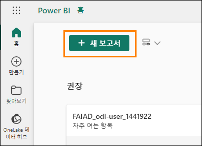

5. **첫 번째 보고서 화면 만들기**로 이동됩니다. 데이터를 수동으로 입력하고 보고서를 작성하거나 게시된 의미 체계 모델을 선택하는 옵션이 있습니다. 이전 랩에서 의미 체계 모델을 만들♘습니다. 그 모델을 사용해보겠습니다. **게시된 의미 체계 모델 선택** 옵션을 선택합니다.

	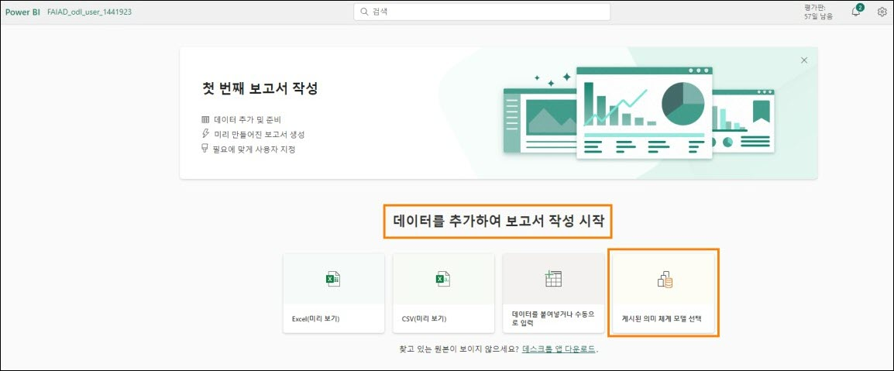

6. 보고서 페이지에서 사용할 데이터 세트를 선택합니다. 네 가지 옵션이 있습니다. **sm_FAIAD**를 선택합니다:  

   a. **sm_FAIAD**: 이것은 우리가 만든 의미 체계 모델이며 보고서를 작성하는 데 사용하고자 합니다.  
   
   b. **lh_FAIAD**: 모든 데이터를 수집한 레이크하우스입니다.  
   
   c. **Units by Supplier**: 이것은 T-SQL을 사용하여 생성한 데이터 세트입니다.  
   
   d. **DataflowsStagingWarehouse**: 기본적으로 생성되는 준비 Warehouse입니다. 데이터를 준비하지 않았기 때문에 사용하지 않았습니다.  
   
   e. **DataflowsStagingLakehouse**: 기본적으로 생성되는 준비 Lakehouse입니다. 데이터를 준비하지 않았기 때문에 사용하지 않았습니다.   

7. **보고서 자동 만들기 버튼** 옆에 있는 화살표를 클릭합니다. 보고서 자동 만들기와 빈 보고서 만들기라는 두 가지 옵션이 있습니다. 자동 만들기를 해보겠습니다. **보고서 자동 만들기**를 선택합니다.

	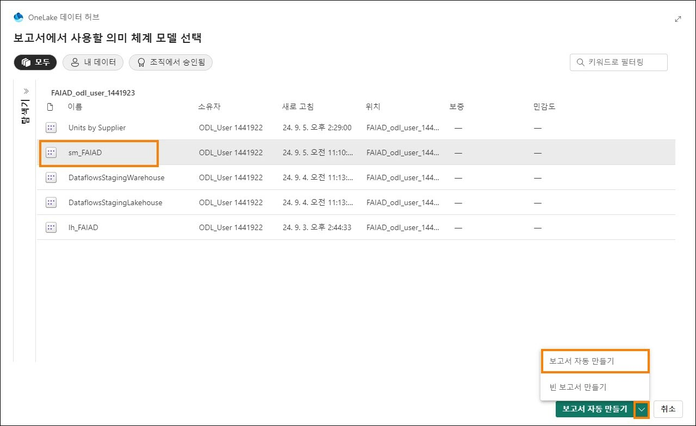

8. **Power BI**가 보고서 자동 만들기를 시작합니다. 원할 경우 데이터를 사전 선택하는 옵션도 있습니다. 보고서가 준비되면 화면 오른쪽 상단에 대화 상자가 나타납니다. **지금 보고서를 보거나 몇 초 후에 자동으로 로드**를 선택합니다.

	

	**체크포인트:** 아래 스크린샷과 같은 보고서가 생성됩니다. 몇 가지 KPI와 몇 가지 추세 시각적 개체가 있습니다. 새 모델을 분석하고 빠른 시작이 필요한 경우 이것이 좋은 방법입니다.

	참고: 상단 메뉴에는 보고서를 편집하거나 일부 데이터를 표로 볼 수 있는 옵션이 있습니다. 이들 옵션을 자유롭게 탐색해보십시오.

9. 이 보고서를 저장해 보겠습니다. 상단 메뉴에서 **저장**을 선택합니다.
 
10. 보고서 저장 대화 상자가 열립니다. 보고서 이름을 **rpt_Sales_Auto_Report**로 지정합니다.

	**참고:** 보고서 이름 앞에는 보고서의 약자인 rpt가 붙습니다.

11. 보고서가 작업 영역, **FAIAD_\<username>** 에 저장되어 있는지 확인합니다.

12. **저장**을 선택합니다.

	

	**참고:** 자동 생성된 보고서는 "자동 생성"되므로 다르게 보일 수 있습니다. 또한 이전 랩(랩

	6)에서 생성한 관계 및 측정값에 따라 달라집니다.

	위 스크린샷은 선택적 관계(랩 6)를 포함하여 모든 관계와 측정값을 생성한 경우 자동 생성된 보고서가 **어떻게** 표시되는지 보여줍니다.

	아래 스크린샷은 선택적 관계(랩 6)와 측정값 생성을 건너뛴 경우 자동 생성된 보고서가
	**어떻게** 표시되는지 보여줍니다.

	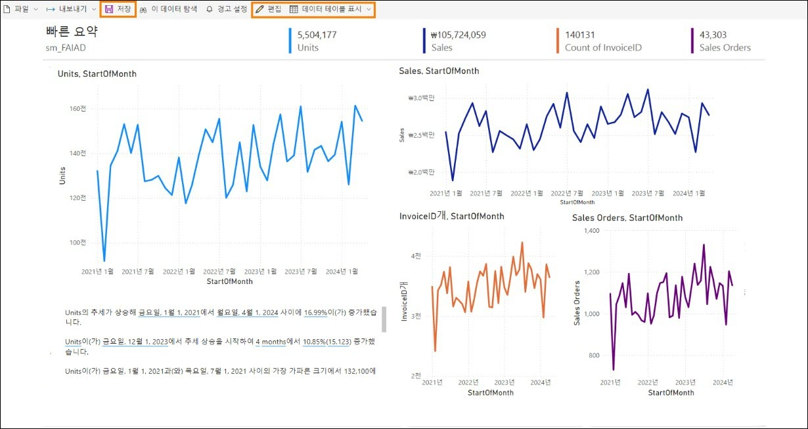

# 작업 2: 새 보고서의 배경 구성

빈 캔버스를 사용하여 새 보고서를 생성해 보겠습니다.

1. **왼쪽 패널**에서 작업 영역 이름 **FAIAD_\<username>** 을 선택하여 작업 영역으로 다시 이동합니다.

2. 상단 메뉴에서 **새로 만들기 -> 보고서**를 선택합니다. 첫 번째 보고서 페이지 만들기로 이동됩니다.

	

3. **게시된 의미 체계 모델 선택**을 선택하면 우리가 만든 모델을 선택할 수 있습니다.

	

4. 보고서에서 사용할 의미 체계 모델을 선택하면 대화 상자가 열립니다. **sm_FAIAD**를 선택합니다.

5. **보고서 자동 만들기 버튼** 옆에 있는 화살표를 클릭합니다. 빈 보고서 만들기를을 선택합니다. 보고서 페이지와 비슷한 모양의 Power BI Desktop 보고서 페이지로 이동합니다.

	
 
6. 아직 열지 않았다면, 랩 환경의 바탕 **화면에서** **Reports** 폴더에 있는 **FAIAD.pbix**를 엽니다.
이 보고서를 기준으로 사용하겠습니다. 캔버스 배경을 추가하는 것부터 시작하겠습니다. 보고서 머리글을 만들고, 몇 가지 KPI를 추가하고, 시간별 매출 선 차트를 만듭니다. 시간 관계상 Power BI Desktop에서 시각적 개체를 구축한 경험이 있다고 가정하고 모든 시각적 개체를 생성하지는 않을 것입니다.

	

7. 브라우저에서 **Power BI 캔버**스로 되돌아갑니다.

8. 시각화 창에서 **페이지 형식 지정 아이콘**을 선택합니다.
 
9. **캔버스 배경 섹션**을 확장합니다.

10. **이미지** 옵션에서 **찾아보기**를 선택합니다. 파일 탐색기 대화 상자가 열립니다.

11. 랩 환경의 **바탕 화면**에 있는 **Reports** 폴더로 이동합니다.

12. **Summary Background.png**를 선택합니다.

13. **이미지 맞**춤 드롭다운을 **맞춤**으로 설정합니다.

14. 투명도를 **0%** 로 설정합니다.

	

# 작업 3: 보고서에 헤더 추가

1. 상단 여백에 헤더를 추가해 보겠습니다. **메뉴**에서 **텍스트 상자**를 선택합니다.

2. 텍스트 상자의 첫 번째 줄에 **Fabrikam Company**를 입력합니다.

3. 텍스트 상자의 두 번째 줄에 **Sales Report**를 입력합니다.

4. **Fabrikam Company**를 강조 표시하고 **글꼴을 Segoe UI로 글꼴 크기를 18, 굵게**로 설정합니다.

5. **Sales Report**를 강조 표시하고 **글꼴을 Segoe UI**로 **글꼴 크기를 14**로 설정합니다.

6. **텍스트 상자를 선택**하고 오른쪽 서식 텍스트 상자 **창에서 효과를 확장**합니다.

7. **배경** 슬라이더를 사용하여 끄기로 설정합니다.

8. **텍스트 상자의 크기를 상단 여백에 맞게 조정합니다**.

	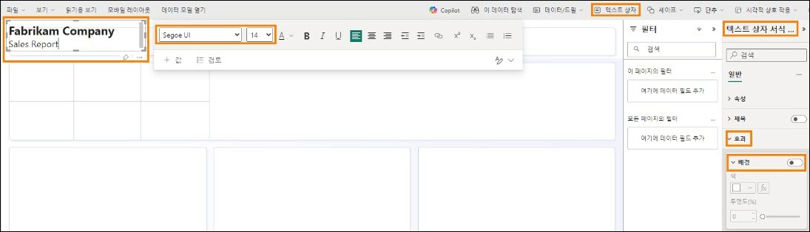

# 작업 4: 보고서에 KPI 추가

1. 매출 KPI를 추가해 보겠습니다. 텍스트 상자에서 벗어나려면 캔버스에서 공백을 선택합니다.

2. **시각화 섹션**에서 **다중행 카드 시각적 개체**를 선택합니다.

3. **데이터 섹션**에서 **Sales 테이**블을 확장합니다.

4. **Sales 측정값**을 선택합니다.

	

5. **다중행 카드 시각적 개체가 선택된** 상태에서 시각화 섹션에서 시각적 개체 서식 지정 아이콘을 선택합니다.

6. **범주 레이블** 섹션을 확장합니다.

7. **글꼴 크기**를 **14**로 높입니다.

8. **색상 드롭다운**을 선택합니다. 색상 팔레트 대화 상자가 열립니다.

9. **다른 색**을 선택합니다.

10. 헥스 값을 **#004753**으로 설정합니다.

	
  
11. **카드** 섹션을 확장합니다.

12. **악센트 바** 슬라이더를 **끄기**로 설정합니다.

	

13. 시각화 창에서 **일반**을 선택합니다.

14. **효과 섹션**을 확장합니다.

15. **배경** 슬라이더를 사용하여 **끄기**로 설정합니다.

16. **시각적 개체**의 크기를 조정하고 **스크린샷과 같이 왼쪽 상자**로 옮깁니다.

	

17. 또 다른 KPI를 추가해 보겠습니다. 방금 만든 **Sales 다중 행 카드**를 선택합니다. 키보드에서 **Ctrl+C**를 선택하여 시각적 개체를 **복사**합니다.

18. 키보드에서 **Ctrl+V**를 선택하여 시각적 개체를 **붙여넣기**합니다. 시각적 개체가 캔버스에 붙여넣기 됐습니다.

19. **새 시각적 개체가 강조표시된** 상태에서 **시각화 창 -> 시각적 개체 빌드 -> 필드** 섹션에서 **Sales** 측정값을 제거합니다.

20. **데이터** 섹션에서 **Sales** 테이블을 확장하고 Units 측정값을 선택합니다.

21. **시각적 개체**의 크기를 조정하고 **Sales 시각적 개체 아래의** 상자에 넣습니다.

	

# 작업 5: 보고서에 꺾은선형 차트 추가

재판매사별로 시간에 따른 매출을 시각화하는 꺾은선형 차트를 만들어 보겠습니다.

1. 다중 행 카드 시각 개체에서 벗어나려면 캔버스에서 **공백**을 선택합니다.

2. **시각화 섹션**에서 **꺾은선형 차트**를 선택합니다.

3. **데이터 섹션**에서 **Date** 테이블을 확장합니다.

4. **Year** 필드를 선택합니다. Year가 기본 설정으로 합산되어 Y축에 추가되어 있습니다. 이 문제를 해결해보겠습니다.

	

# 작업 6: 보고서 저장

모델을 변경하기 위해 보고서에서 벗어나기 전에 보고서를 저장해 보겠습니다.

1. 상단 메뉴에서 **파일 -> 저장**을 선택합니다.

2. 보고서 저장 대화 상자가 열립니다. 보고서 이름을 **rpt_Sales_Report**로 지정합니다.
   
	**참고:** 보고서 이름 앞에는 보고서의 약자인 rpt가 붙습니다.

4. 보고서가 **FAIAD_\<username>** 작업 영역에 저장되어 있는지 확인합니다.

	

5. **저장**을 선택합니다. 보고서가 저장되고 보기 모드가 된 것을 확인할 수 있습니다.

# 작업 7: Date 테이블의 Year 열 구성

1. **상단 메뉴**에서 편집을 선택하여 **편집** 모드로 돌아갑니다.

2. **상단 메뉴**에서 **데이터 모델 열기**를 선택합니다. 새 브라우저 창/탭에서 공지사항 의미 체계 모델이 열립니다.

	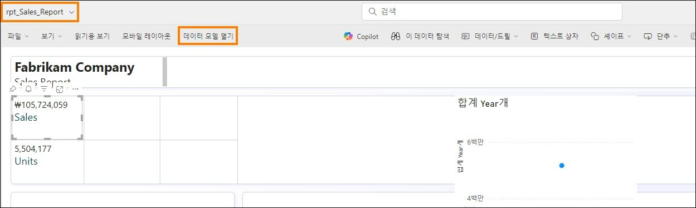

3. 오른쪽의 **데이터 패널에서** 테이블을 선택합니다.

4. **Date** 테이블을 확장합니다.

5. **Year** 열을 선택합니다.

6. 오른쪽 **속성** 창에서 **고급** 섹션을 확장합니다.

7. **요약 기준** 드롭다운에서 **없음**을 선택합니다.

	

8. 브라우저의 **보고서 창/탭**으로 다시 이동합니다.

9. 오른쪽의 **데이터 창**에서 **Date** 테이블을 펼칩니다. Year는 합계 필드가 아닙니다.

10.	**꺾은선형 차트 시각적 개체를 선택한** 상태에서 Y축에서 **Year 합계**를 제거합니다.

11.	**Year** 필드를 선택하면 **X축**에 추가됩니다.
 
12. **Sales** 테이블을 확장하고 **Sales 측정값**을 선택합니다.

	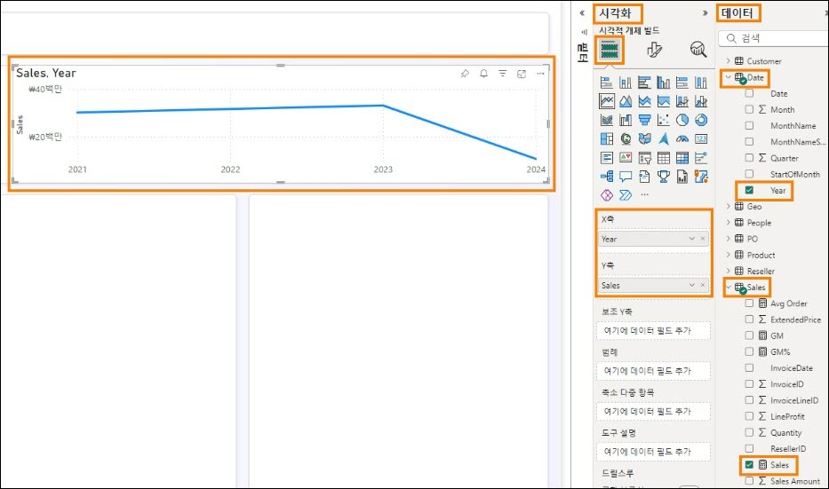

# 작업 8: Date 테이블의 Month Name 열 구성

1. 이 차트에 월을 추가해 보겠습니다. Date 테이블에서 **X축의 Year**아래로 **MonthNameShort** 필드를 끌어옵니다. 이를 **MonthNameShort**으로 정렬해 보겠습니다.

2. 시각적 개체의 오른쪽 상단에서 줄임표(...)를 선택합니다.

3. **축 정렬 -> Year Short_Month_Name**을 선택합니다.

4. 시각적 개체의 오른쪽 상단에서 **줄임표(...)** 를 선택합니다.

5. **축 정렬 -> 오름차순 정렬**을 선택합니다.

	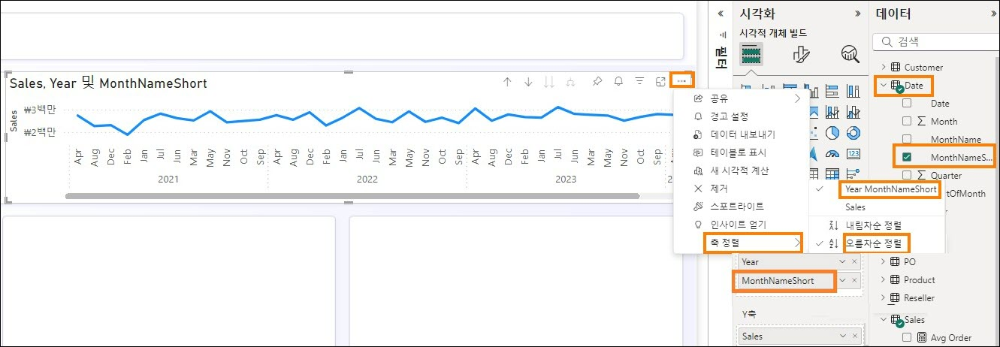

	**참고:** 월이 알파벳순으로 정렬되어 있습니다. 이를 수정해 보겠습니다.

	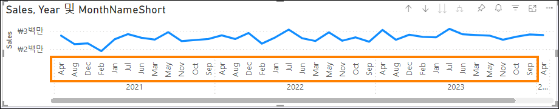

6. 의미 체계 모델이 열려 있는 **브라우저 창/탭**으로 다시 이동합니다.

7. **데이터** 창에서 **Date** 테이블을 확장합니다.

8. **MonthNameShort** 열을 선택합니다.

9. 오른쪽 **속성** 창에서 **고급** 섹션을 확장합니다.

10. **열 기준 정렬** 드롭다운에서 **Month를** 선택합니다.

	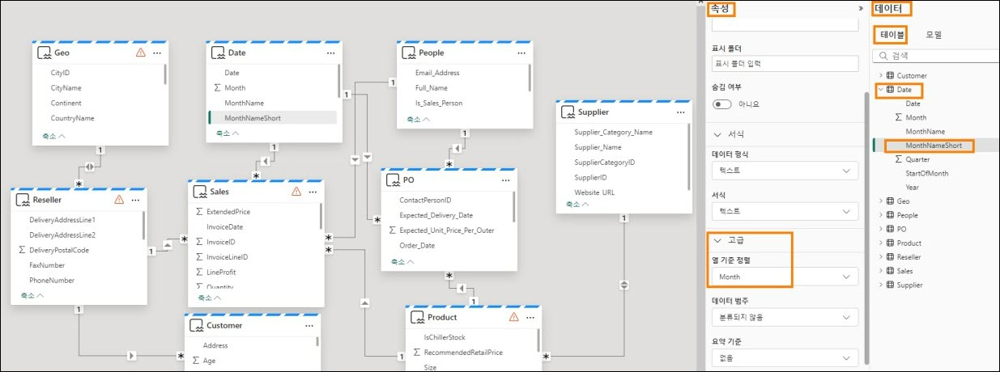

11. 브라우저의 **보고서 창/탭**으로 다시 이동합니다. 이제 월이 올바르게 정렬되어 있습니다.

	

# 작업 9: 꺾은선형 차트 형식 지정

보고서를 작성하는 동안 의미 체계 모델을 업데이트하는 것이 얼마나 쉬운지 확인하십시오. 이는 Power BI Desktop과 같은 원활한 상호 작용을 제공합니다.

1. **꺾은선형 차트 시각적 개체를 선택한** 상태에서 **데이터 섹션에서 Reseller** 테이블을 확장합니다.
 
2. **Reseller -> Reseller Company 필드를 범례** 섹션으로 드래그합니다.

	
	
3. **꺾은선형 차트 시각적 개체를 선택한** 상태에서 시각화 섹션에서 시각적 개체 서식 지정 아이콘 -> 일반을 선택합니다.

4. **제목** 섹션을 확장합니다.

5. **제목** 텍스트를 **시간 경과에 따른 매출**로 설정합니다.

6. **효과 섹션**을 확장합니다.

7. **배경** 슬라이더를 사용하여 끄기로 설정합니다.

	

8. **시각화** 섹션에서 **시각적 개체 서식 지정 아이콘 - > 시각적 개체**를 선택합니다.

9. 줄 섹션을 확장합니다.

10. **설정 적용-> 시리즈 드롭다운에서 Tailspin Toys**를 선택합니다.

11. **색** 섹션을 펼칩니다.

12. **색상을 #F17925**로 설정합니다.

13. **설정 적용-> 시리즈 드롭다운에서 Wingtip Toys**를 선택합니다
 
14. **색상을 #004753**으로 설정합니다.

15. 시각적 개체의 크기를 조정하고 스크린샷과 같이 우측 상단 상자로 옮깁니다.

16. 시각적 개체에서 오른쪽으로 스크롤하면 **2024년 4월까지의 데이터를 확인할 수 있습니다**.

	

17. 보고서를 저장하겠습니다. 메뉴에서 **파일 -> 저장**을 선택합니다. 앞서 언급했듯이 본 랩에서는 모든 시각적 개체를 빌드하지는 않습니다. 시간이 있다면 자유롭게 더 많은 시각적 요소를 빌드해보십시오.

# 작업 10: 의미 체계 모델에 Power BI Desktop 연결

이제 Power BI Desktop을 의미 체계 모델에 연결하고 시각적 개체를 작성하는 것이 얼마나 쉬운지 살펴보겠습니다.

1. 랩 환경의 **바탕 화면**에 있는 **Reports** 폴더에 있는 **FAIADTemplate.pbix**를 엽니다.

2. 리본 메뉴에서 **홈 -> OneLake 데이터 허브 -> Power BI 의미 체계 모델**을 선택합니다.

	
 
3. OneLake 데이터 허브 대화 상자가 열립니다. 생성한 의미 체계 모델인 **sm_FAIAD**를 선택합니다.

4. **연결**을 선택합니다. 데이터 창에 의미 체계 모델의 테이블이 있는 것을 볼 수 있습니다.

	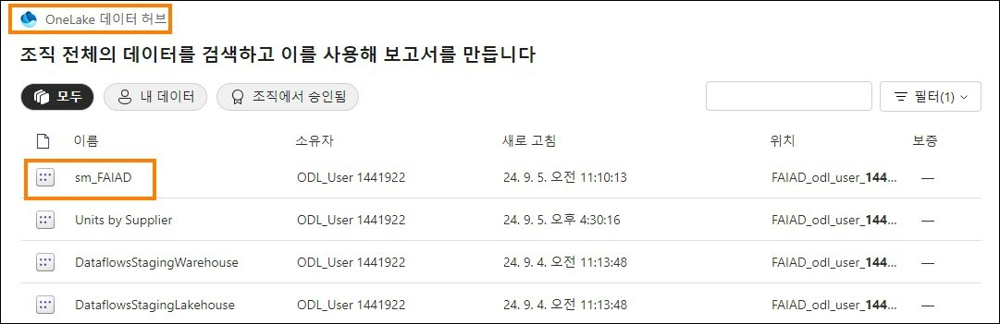

5. **왼쪽 패널**에서 **모델 보기** 아이콘을 선택합니다. 테이블 간의 관계를 볼 수 있습니다.

	
 
6. **왼쪽 패널**에서 보고서 보기를 선택하여 보고서 보기로 다시 이동합니다.

7. 아직 열지 않았다면 랩 환경의 **바탕 화면**에서 **Reports** 폴더에 있는 FAIAD.pbix를 엽니다.

8. **보고서 제목 시각적 개체**를 선택합니다.

9. 리본 메뉴에서 **홈 -> 복사**를 선택합니다.

	

10.	**FAIADTemplate.pbix**로 이동하여 보고서 캔버스를 선택합니다.

11. 리본 메뉴에서 **홈 -> 붙여넣기**를 선택합니다.

	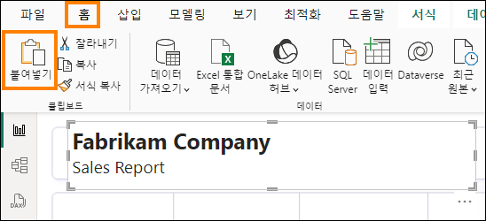

12. 마찬가지로 **Sales 및 Units KPI**를 복사하여 붙여넣습니다. 참고 - 여러 시각적 개체를 복사하여 함께 붙여넣을 수 있습니다.
기존 보고서에서 시각적 개체를 복사하여 의미 체계 모델에 연결되는 보고서에 붙여넣기하는 것이 쉽습니다. 복사 및 붙여넣기가 작동하려면 테이블 이름, 열 이름, 측정값 이름이 동일해야 합니다. 동일하지 않은 경우 오류가 있을 수 있지만 쉽게 해결할 수 있습니다.

	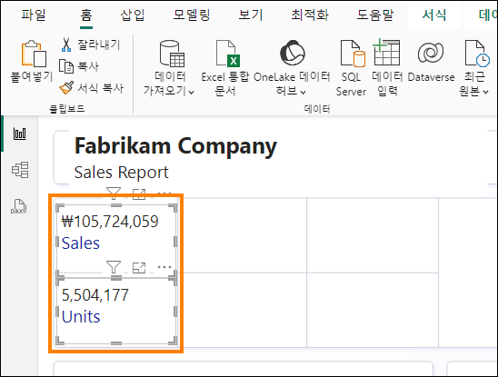

13. **FAIAD.pbix**로 이동하여 시간대별 판매량 꺾은선형 차트를 선택합니다.

14. 리본 메뉴에서 홈 -> 복사를 선택합니다.

15. **FAIADTemplate.pbix**로 이동하여 보고서 캔버스를 선택합니다.

16. 리본 메뉴에서 **홈 -> 붙여넣기**를 선택합니다. 시각적 개체가 렌더링되지 않는다는 점에 유의하세요. 이는 현재 의미 체계 모델이 날짜 필드에서 계층 구조를 생성하지 않기 때문입니다.

17. 이를 수정해 보겠습니다. **시각화** 패널의 **X축** 아래에서 StartOfMonth를 삭제합니다.

	

18. **데이터 창**에서 **Date** 테이블을 확장합니다.

19. **StartOfMonth** 필드를 X축으로 끌어옵니다. 이렇게 하면 시각적 개체가 수정됩니다. 시각적 개체의 형식을 지정해야 할 수도 있습니다.

	

20. 리본 메뉴에서 **파일 -> 저장**을 선택하여 보고서를 저장해 보겠습니다.
 
# 작업 11: Direct Lake 모드를 시뮬레이션하기 위해 새 데이터 추가

일반적으로 Import 모드에서는 원본의 데이터가 새로 고침되면 Power BI 모델을 새로 고침해야 하고 그런 후에 보고서의 데이터가 업데이트됩니다. Direct query 모드를 사용할 경우 원본에서 데이터를 새로 고침되면 Power BI 보고서에서 사용할 수 있습니다. 그러나 Direct query 모드는 일반적으로 느립니다. 이 문제를 해결하기 위해 Microsoft Fabric은 Direct Lake 모드를 도입했습니다. Direct Lake는 레이크의 데이터를 Power BI 엔진으로 직접 로드하여 분석 준비를 하는 빠른 경로입니다.

ADLS Gen2에서 데이터가 업데이트되고 새로 고침을 실행하지 않고도 변경 사항이 Power BI 보고서에 즉시 반영되는 시나리오를 살펴 보겠습니다.

실제 시나리오에서는 데이터가 원본에서 업데이트됩니다. 교육 환경이므로 이를 시뮬레이션해 보겠습니다. 2024년 4월까지의 매출 데이터가 있습니다. ADLS Gen2에서 2024년 5월 파일에 대한 바로 가기를 만들고 Sales 보기를 업데이트하여 2024년 5월의 Sales 데이터를 추가해 보겠습니다.

1. **브라우저**로 돌아갑니다.

2. 왼쪽 메뉴 모음에서 **FAIAD_\<username>** 을 선택하여 작업 영역 홈으로 이동합니다.

3. **lh_FAIAD**를 선택하여 레이크하우스로 이동합니다.

	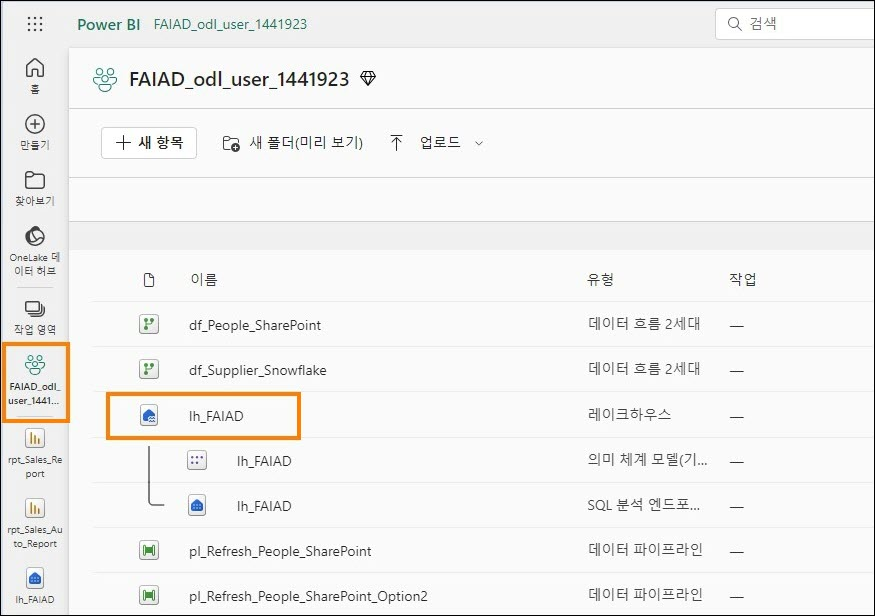

4. **왼쪽 탐색기 창에서 테이블** 옆의 **줄임표**를 선택합니다.

5. **새 바로 가기**를 선택합니다.

	

6. 새 바로 가기 대화 상자가 열립니다. **외부 소스**에서 **Azure Data Lake Storage Gen2**를 선택합니다.

	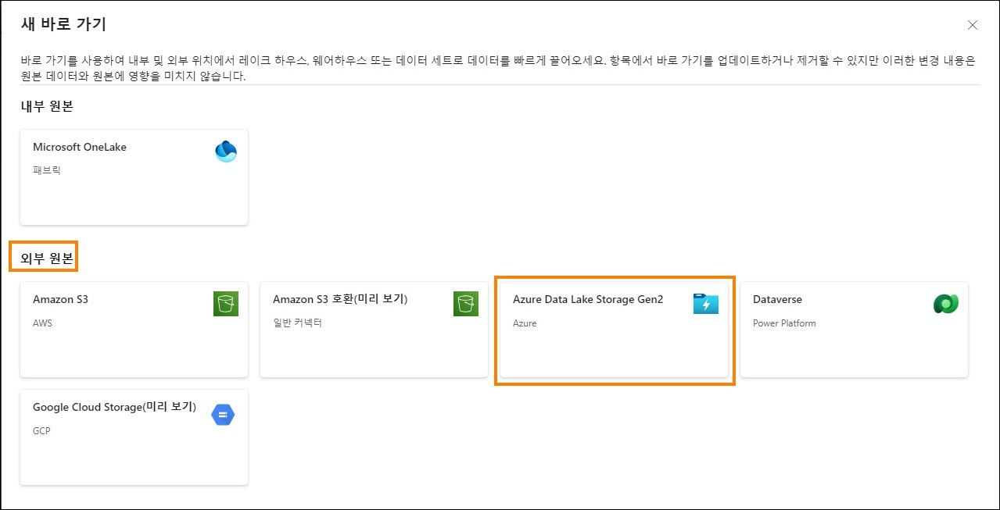

7. 연결 설정 -> URL에서 다음 링크를 입력합니다. https://stvnextblobstorage.dfs.core.windows.net/fabrikam-sales

8. 이전에 연결을 만들♘으므로 인식됩니다. **다음**을 선택합니다.

	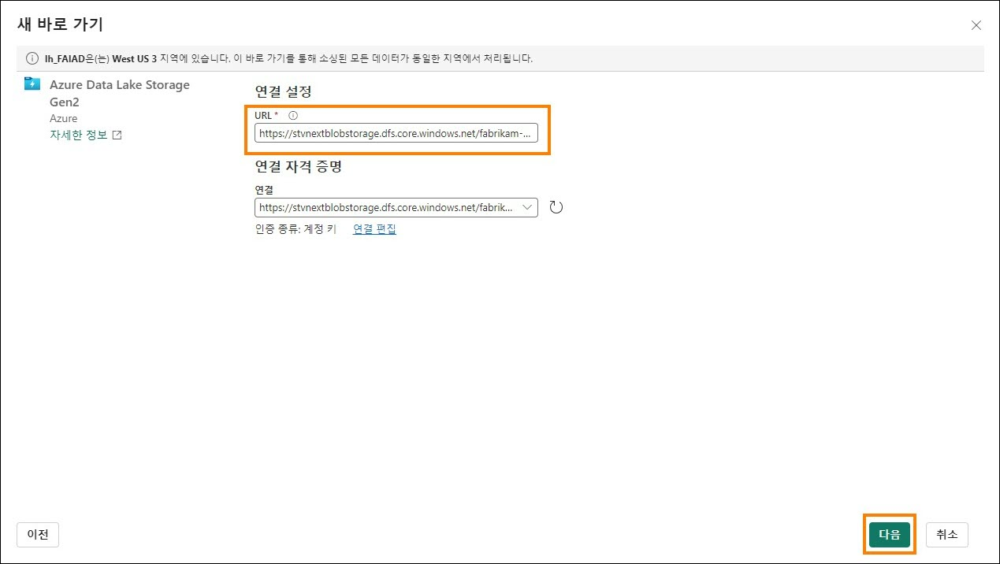

9. 왼쪽 패널에 디렉터리 구조가 표시된 ADLS Gen2에 연결됩니다. **Delta-Parquet-Format- FY25**를 확장합니다.

10. **Sales.Invoices_May**를 선택합니다.

11. **다음**을 선택합니다.

	

12. 이름을 편집할 수 있는 다음 대화 상자로 이동합니다. **Sales.Invoices_May**에 대한 작업에서 편집 아이콘을 선택합니다.

13. **Sales.Invoices_May의 이름을 InvoicesMay**로 변경합니다.

14. 이름 옆의 **확인 표시**를 선택하여 변경 사항을 저장합니다.
 
15. **만들기**를 선택합니다.

	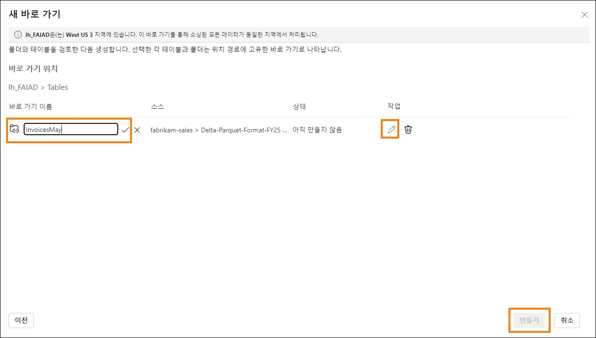

	**왼쪽 탐색기 창에** InvoicesMay 테이블이 있습니다. 이제 Sales 보기를 업데이트해야 합니다.

16. **화면 오른쪽 상단에서 레이크하우스 -> SQL 분석 엔드포인트**를 선택합니다.

	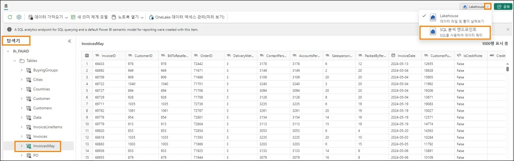

17. 상단 메뉴에서 **홈 - > 새 SQL 쿼리**를 선택합니다. 새 SQL 쿼리 창이 열립니다.

18. 아래 코드를 **복사**하여 SQL 쿼리 창에 **붙여넣습니다**.

```
ALTER VIEW [dbo].[Sales] AS (
  SELECT [$Outer].[InvoiceLineID] AS [InvoiceLineID],
    [$Outer].[InvoiceID] AS [InvoiceID],
    [$Outer].[StockItemID] AS [StockItemID],
    [$Outer].[Quantity] AS [Quantity],
    [$Outer].[UnitPrice] AS [UnitPrice],
    [$Outer].[TaxRate] AS [TaxRate],
    [$Outer].[TaxAmount] AS [TaxAmount],
    [$Outer].[LineProfit] AS [LineProfit],
    [$Outer].[ExtendedPrice] AS [ExtendedPrice],
    [$Outer].[CustomerID] AS [ResellerID],
    [$Outer].[SalespersonPersonID] AS [SalespersonPersonID],
    [$Outer].[InvoiceDate] AS [InvoiceDate],
    [$Outer].[t0_0] AS [Sales Amount]
  FROM (
    SELECT [_].[InvoiceLineID] AS [InvoiceLineID],
      [_].[InvoiceID] AS [InvoiceID],
      [_].[StockItemID] AS [StockItemID],
      [_].[Quantity] AS [Quantity],
      [_].[UnitPrice] AS [UnitPrice],
      [_].[TaxRate] AS [TaxRate],
      [_].[TaxAmount] AS [TaxAmount],
      [_].[LineProfit] AS [LineProfit],
      [_].[ExtendedPrice] AS [ExtendedPrice],
      [_].[CustomerID] AS [CustomerID],
      [_].[SalespersonPersonID] AS [SalespersonPersonID],
      [_].[InvoiceDate] AS [InvoiceDate],
      [_].[ExtendedPrice] - [_].[TaxAmount] AS [t0_0]
    FROM (
      SELECT [$Outer].[InvoiceLineID],
        [$Outer].[InvoiceID],
        [$Outer].[StockItemID],
        [$Outer].[Quantity],
        [$Outer].[UnitPrice],
        [$Outer].[TaxRate],
        [$Outer].[TaxAmount],
        [$Outer].[LineProfit],
        [$Outer].[ExtendedPrice],
        [$Inner].[CustomerID],
        [$Inner].[SalespersonPersonID],
        [$Inner].[InvoiceDate]
      FROM [lh_FAIAD].[dbo].[InvoiceLineItems] AS [$Outer]
      INNER JOIN (
        SELECT [_].[InvoiceID] AS [InvoiceID2],
          [_].[CustomerID],
          [_].[BillToResellerID],
          [_].[OrderID],
          [_].[DeliveryMethodID],
          [_].[ContactPersonID],
          [_].[AccountsPersonID],
          [_].[SalespersonPersonID],
          [_].[PackedByPersonID],
          [_].[InvoiceDate],
          [_].[CustomerPurchaseOrderNumber],
          [_].[IsCreditNote],
          [_].[CreditNoteReason],
          [_].[Comments],
          [_].[DeliveryInstructions],
          [_].[InternalComments],
          [_].[TotalDryItems],
          [_].[TotalChillerItems],
          [_].[DeliveryRun],
          [_].[RunPosition],
          [_].[ReturnedDeliveryData],
          [_].[ConfirmedDeliveryTime],
          [_].[ConfirmedReceivedBy],
          [_].[LastEditedBy] AS [LastEditedBy2],
          [_].[LastEditedWhen] AS [LastEditedWhen2]
        FROM (
          SELECT [$Table].[InvoiceID],
            [$Table].[CustomerID],
            [$Table].[BillToResellerID],
            [$Table].[OrderID],
            [$Table].[DeliveryMethodID],
            [$Table].[ContactPersonID],
            [$Table].[AccountsPersonID],
            [$Table].[SalespersonPersonID],
            [$Table].[PackedByPersonID],
            [$Table].[InvoiceDate],
            [$Table].[CustomerPurchaseOrderNumber],
            [$Table].[IsCreditNote],
            [$Table].[CreditNoteReason],
            [$Table].[Comments],
            [$Table].[DeliveryInstructions],
            [$Table].[InternalComments],
            [$Table].[TotalDryItems],
            [$Table].[TotalChillerItems],
            [$Table].[DeliveryRun],
            [$Table].[RunPosition],
            [$Table].[ReturnedDeliveryData],
            [$Table].[ConfirmedDeliveryTime],
            [$Table].[ConfirmedReceivedBy],
            [$Table].[LastEditedBy],
            [$Table].[LastEditedWhen]
          FROM [lh_FAIAD].[dbo].[Invoices] AS [$Table]
          UNION ALL
          SELECT [$Table].[InvoiceID],
            [$Table].[CustomerID],
            [$Table].[BillToResellerID],
            [$Table].[OrderID],
            [$Table].[DeliveryMethodID],
            [$Table].[ContactPersonID],
            [$Table].[AccountsPersonID],
            [$Table].[SalespersonPersonID],
            [$Table].[PackedByPersonID],
            [$Table].[InvoiceDate],
            [$Table].[CustomerPurchaseOrderNumber],
            [$Table].[IsCreditNote],
            [$Table].[CreditNoteReason],
            [$Table].[Comments],
            [$Table].[DeliveryInstructions],
            [$Table].[InternalComments],
            [$Table].[TotalDryItems],
            [$Table].[TotalChillerItems],
            [$Table].[DeliveryRun],
            [$Table].[RunPosition],
            [$Table].[ReturnedDeliveryData],
            [$Table].[ConfirmedDeliveryTime],
            [$Table].[ConfirmedReceivedBy],
            [$Table].[LastEditedBy],
            [$Table].[LastEditedWhen]
          FROM [lh_FAIAD].[dbo].[InvoicesMay] AS [$Table]
        ) AS [_]
      ) AS [$Inner] ON ([$Outer].[InvoiceID] = [$Inner].[InvoiceID2] OR [$Outer].[InvoiceID] IS NULL AND [$Inner].[InvoiceID2] IS NULL)
    ) AS [_]
  ) AS [$Outer]
  WHERE EXISTS (
    SELECT 1
    FROM (
      SELECT [ResellerID]
      FROM [lh_FAIAD].[dbo].[Reseller] AS [$Table]
    ) AS [$Inner]
    WHERE [$Outer].[CustomerID] = [$Inner].[ResellerID] OR [$Outer].[CustomerID] IS NULL AND [$Inner].[ResellerID] IS NULL
  )
)
```

19. 시각적 개체 쿼리 메뉴에서 **실행**을 선택하여 코드를 실행합니다.

	

	코드가 실행되면 2024년 5월 데이터를 포함하도록 Sales 테이블이 업데이트됩니다.

20. 왼쪽 메뉴 모음에서 **rpt_Sales_Report**를 선택하여 보고서로 다시 이동합니다.
 
21. 상단 메뉴에서 **새로 고침**을 선택합니다. 이제 꺾은선형 차트에 2024년 5월의 데이터가 표시됩니다. 또한 판매 금액과 판매 단위가 증가한 것을 확인할 수 있습니다.

	

	데이터가 변경될 때 데이터 모델을 새로 고치고 보고할 필요가 없습니다. 이것이 바로 Direct Lake와 Direct query의 장점입니다. 문제 설명에 나열된 과제를 다시 살펴보겠습니다.

- **서로 다른 데이터 원본에 대한 서로 다른 업데이트 시간을 설정하려면 데이터 세트를 적어도 하루에 세 번 이상 새로 고쳐야 합니다**.

Direct Lake를 사용하여 이 문제를 해결했습니다. 각 개별 데이터 흐름은 해당 일정에 따라 새로 고침됩니다. 데이터 세트와 보고서를 새로 고침할 필요가 없습니다.

- **소스 시스템에 발생한 업데이트를 캡처하기 위해 매번 전체 새로 고침을 수행해야 하므로 새로 고치는 데 시간이 오래 걸립니다**.

다시 한번 Direct Lake를 사용하여 이 문제를 해결했습니다. 각 개별 데이터 흐름은 해당 일정에 따라 새로 고침됩니다. 데이터 세트와 보고서는 새로 고침할 필요가 없으므로 전체 새로 고침에 대해 걱정할 필요가 없습니다.

- **가져오는 데이터 원본에 오류가 있으면 데이터 세트 새로 고침이 중단됩니다. 직원 파일이 제 시간에 업로드되지 않아 데이터 세트 새로 고침이 중단되는 경우가 많습니다**. 

데이터 파이프라인은 실패 시 다양한 간격으로 새로 고침을 재시도하는 기능을 제공하여 이 문제를 해결하는 데 도움이 됩니다.

- **데이터 크기가 크고 변환이 복잡한 것을 감안하면, Power Query가 미리 보기를 새로 고치는 데 오랜 시간이 걸리는 만큼 데이터 모델을 변경하는 데 매우 오랜 시간이 소요됩니다**.

데이터 흐름과 레이크하우스는 효율적이고 쉽게 변경할 수 있다는 것을 알게 되♘습니다. 일반적으로 데이터 흐름과 레이크하우스의 프리뷰는 로드하는 데 시간이 오래 걸리지 않습니다.

- **회사 표준은 Mac이지만 Power BI Desktop을 사용하려면 Windows PC가 필요합니다**. 

Microsoft Fabric은 SaaS 제품입니다. 필요한 것은 서비스에 액세스하기 위한 브라우저뿐입니다. 데스크톱에 소프트웨어를 설치할 필요가 없습니다.
 
# 랩 환경 정리

랩 환경을 정리할 준비가 되면 아래 단계를 따릅니다.

1. 왼쪽 패널에서 **FAIAD_\<username>** 작업 영역을 선택하여 작업 영역 홈으로 이동합니다.

2. 메뉴에서 **작업 영역 설정**을 선택합니다.

	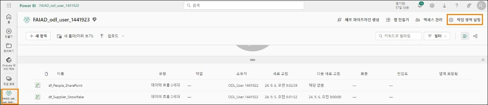

3. 작업 영역 설정 대화 상자가 열립니다. **일반** 섹션에서 아래로 스크롤합니다.

4. **이 작업 영역 제거**를 선택합니다.

5. 작업 영역 삭제 대화 상자가 열립니다. **삭제**를 클릭합니다.

	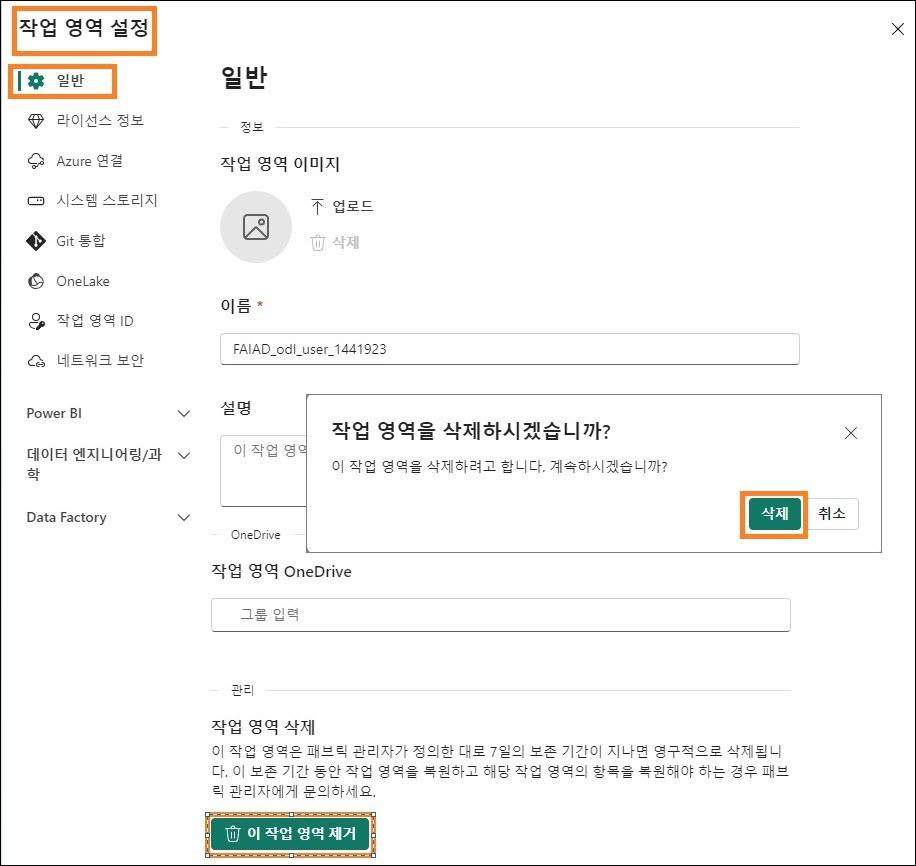
   
	이렇게 하면 작업 영역과 작업 영역에 포함된 모든 항목이 삭제됩니다.

## 참조

Fabric Analyst in a Day(FAIAD)는 Microsoft Fabric에서 사용할 수 있는 몇 가지 주요 기능을 소개합니다. 서비스의 메뉴에 있는 도움말(?) 섹션에는 유용한 리소스로 연결되는 링크가 있습니다.


아래는 Microsoft Fabric의 다음 단계에 도움이 되는 몇 가지 추가 자료입니다.
- [Microsof t Fabric GA 발표](https://www.microsoft.com/en-us/microsoft-fabric/blog/2023/11/15/prepare-your-data-for-ai-innovation-with-microsoft-fabric-now-generally-available/) 전문을 블로그 포스트로 읽기
- [가이드 투어](https://guidedtour.microsoft.com/en-us/guidedtour/microsoft-fabric/microsoft-fabric/1/1)로 Fabric 탐색
- [Microsof t Fabric 무료 평가판](https://www.microsoft.com/en-us/microsoft-fabric/getting-started) 신청
- [Microsof t Fabric 웹사이트](https://www.microsoft.com/en-in/microsoft-fabric) 방문
- [Fabric 학습 모듈](https://learn.microsoft.com/en-us/training/browse/?products=fabric&resource_type=module)을 탐색해서 새로운 기술 익히기
- [Fabric 기술 문서](https://learn.microsoft.com/en-us/fabric/) 검토
- [Fabric 시작하기 무료 e북 ](https://info.microsoft.com/ww-landing-unlocking-transformative-data-value-with-microsoft-fabric.html)읽기
- [Fabric 커뮤니티](https://community.fabric.microsoft.com/)에 가입하여 질문을 게시하고 피드백을 공유하며 다른 사람들로부터 배우기
 
더 많은 심층 Fabric 환경 발표 블로그 포스트 읽기:
- [Fabric 블로그의 Data Factory 환경](https://aka.ms/Fabric-Data-Factory-Blog)
- [Fabric 블로그의 Synapse Data Engineering 환경](https://aka.ms/Fabric-DE-Blog)
- [Fabric 블로그의 Synapse Data Science 환경](https://aka.ms/Fabric-DS-Blog)
- [Fabric 블로그의 Synapse Data Warehousing 환경](https://aka.ms/Fabric-DW-Blog)
- [Fabric 블로그의 Synapse Real-Time Analytics 환경](https://aka.ms/Fabric-RTA-Blog)
- [Power BI 발표 블로그](https://aka.ms/Fabric-PBI-Blog)
- [Fabric 블로그의 Data Activator 환경](https://aka.ms/Fabric-DA-Blog)
- [Fabric 블로그의 관리 및 거버넌스](https://aka.ms/Fabric-Admin-Gov-Blog)
- [Fabric 블로그의 OneLake](https://aka.ms/Fabric-OneLake-Blog)
- [Dataverse 및 Microsof t Fabric 통합 블로그](https://aka.ms/Dataverse-Fabric-Blog)


© 2023 Microsoft Corporation. All rights reserved.
이 데모/랩을 사용하면 다음 조건에 동의하게 됩니다.
이 데모/랩에 설명된 기술/기능은 학습 환경을 제공하고 사용자 의견을 얻기 위해 Microsoft Corporation에서 제공합니다. 데모/랩을 통해서만 이러한 기술적 특성과 기능을 평가하고 사용자 의견을 Microsoft에 제시할 수 있습니다. 다른 용도로는 사용할 수 없습니다. 이 데모/랩 또는 그 일부에 대해 수정, 복사, 배포, 전송, 표시, 수행, 재현, 게시, 라이선스 허여, 파생 작업 생성, 양도 또는 판매할 수 없습니다.

추가 복제 또는 재배포를 위한 다른 서버 또는 위치에 대한 데모/랩(또는 그 일부)의 복사 또는 재현은 명시적으로 금지됩니다.

이 데모/랩은 위에서 명시한 목적을 위해 복잡한 설정 또는 설치가 없는 시뮬레이션된 환경에서 잠재적인 새로운 기능과 개념을 포함하여 특정 소프트웨어 기술/제품의 특성 및 기능을 제공합니다. 이 데모/랩에서 서술된 기술/개념은 전체 기능을 나타내지 않을 수 있으며, 최종 버전이 작동하지 않을 수도 있습니다. 또한 해당 기능 또는 개념의 최종 버전을 릴리스하지 않을 수도 있습니다. 또한 실제 환경에서 이러한 특성과 기능을 사용한 경험이 다를 수도 있습니다.
 

**피드백**. 이 데모/랩에서 서술된 기술적 특성, 기능 및/또는 개념에 대한 사용자 의견을
Microsoft에 제시하면 Microsoft는 이 사용자 의견을 어떤 방식과 목적으로든 무료로 사용, 공유 및 상용화할 수 있습니다. 또한 제품, 기술 및 서비스에서 사용자 의견이 포함된
Microsoft 소프트웨어 또는 서비스의 특정 부분을 사용하거나 인터페이스하는 데 필요한 모든 특허권을 제3자에게 무료로 제공합니다. Microsoft에서 사용자 의견을 포함하기 때문에 Microsoft에서 해당 소프트웨어 또는 설명서의 사용을 인가해야 하는 라이선스에 종속된 사용자 의견은 제공할 수 없습니다. 이러한 권리는 본 계약에 의거하여 유효합니다.

Microsoft Corporation은 이에 따라 명시적, 묵시적 또는 법적 특정 목적에의 적합성, 권리 및 비침해 여부에 관계없이 모든 보증과 조건을 포함하여 데모/랩과 관련된 모든 보증 및 조건을 부인합니다. Microsoft는 어떤 목적으로든 결과의 정확성, 데모/랩의 사용으로 파생된 출력 또는 데모/랩에 포함된 정보의 적합성과 관련하여 어떠한 보증이나 진술도 하지 않습니다.

**고지 사항**
이 데모/랩에는 Microsoft Power BI의 새로운 기능 및 향상된 기능 중 일부만 포함되어 있습니다. 일부 기능은 제품의 향후 릴리스에서 변경될 수 있습니다. 이 데모/랩에서는 새로운 기능 모두가 아닌 일부에 대해 학습하게 됩니다.