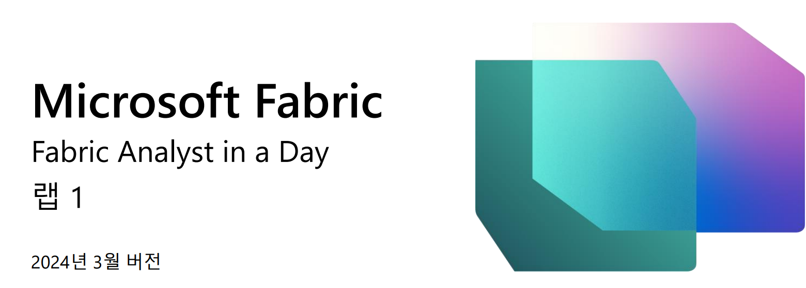

## 목차

문서 구조

시나리오/문제 설명

Power BI Desktop 보고 개요

- 작업 1: 랩 환경에서 Power BI Desktop 을 설정하는 방법

- 작업 2: Power BI Desktop 보고서 분석

- 작업 3: Power Query 검토

참조

## 문서 구조
이 랩에서는 사용자가 수행해야 하는 단계를 보조 시각 자료의 관련 스크린샷과 함께 확인할 수 있습니다. 스크린샷에서 주황색 상자로 강조 표시된 섹션은 사용자가 특히 주목해야 하는 영역입니다.

## 시나리오/문제 설명
Fabrikam, Inc.는 신제품 도매 유통업체입니다. 도매업체로서 Fabrikam의 고객은 대부분 개인에게 재판매하는 회사들입니다. Fabrikam은 전문 매장, 슈퍼마켓, 컴퓨터 매장, 관광 명소 상점 등 미국 전역의 소매업체에 제품을 판매합니다. 또한 Fabrikam은 Fabrikam을 대신하여 제품을 홍보하는 대리인 네트워크를 통해 다른 도매업체에 판매합니다. Fabrikam의 모든 고객은 현재 미국에 기반을 두고 있지만 회사는 다른 국가/지역으로 확장을 추진할 계획입니다.

영업팀에 데이터 분석가가 있습니다. 비즈니스 문제를 해결하기 위해 데이터 세트를 수집, 정리 및 해석합니다. 이 분석가는 또한 차트 및 그래프와 같은 시각화 자료를 모아서 보고서를 작성하고 이를 조직의 의사 결정자에게 제시합니다.
데이터에서 가치 있는 인사이트를 도출하려면 여러 시스템에서 데이터를 가져와서 정리하고 함께 매쉬업해야 합니다. 다음 소스에서 데이터를 가져옵니다.

- **판매 데이터:** 이 데이터는 ERP 시스템에서 제공되며 ADLS Gen2 데이터베이스 또는
<<<<<<< HEAD
    Databricks에 저장됩니다. 매일 정오/오후 12시에 업데이트됩니다.

=======
    Databricks에 저장됩니다. 매일 정오/오후 12시에 업데이트됩니다.
>>>>>>> c3ea5c1d146cb9cff964cef98d08a4445bfb997c
- **공급업체 데이터:** 이 데이터는 다양한 공급업체에서 제공되며 Snowflake
<<<<<<< HEAD
데이터베이스에 저장됩니다.  이는 매일 자정/오전 12시에 업데이트됩니다.

- **고객 데이터:** 이 데이터는 Customer Insights에서 제공되며 Dataverse에 저장됩니다. 데이터는 항상 최신 상태입니다.

- **직원 데이터:** 이 데이터는 HR 시스템에서 제공되며, SharePoint 폴더에 내보내기 파일로 저장됩니다. 이는 매일 오전 9시에 업데이트됩니다.

=======
데이터베이스에 저장됩니다.  이는 매일 자정/오전 12시에 업데이트됩니다.
- **고객 데이터:** 이 데이터는 Customer Insights에서 제공되며 Dataverse에 저장됩니다. 데이터는 항상 최신 상태입니다.
- **직원 데이터:** 이 데이터는 HR 시스템에서 제공되며, SharePoint 폴더에 내보내기 파일로 저장됩니다. 이는 매일 오전 9시에 업데이트됩니다.
>>>>>>> c3ea5c1d146cb9cff964cef98d08a4445bfb997c
 
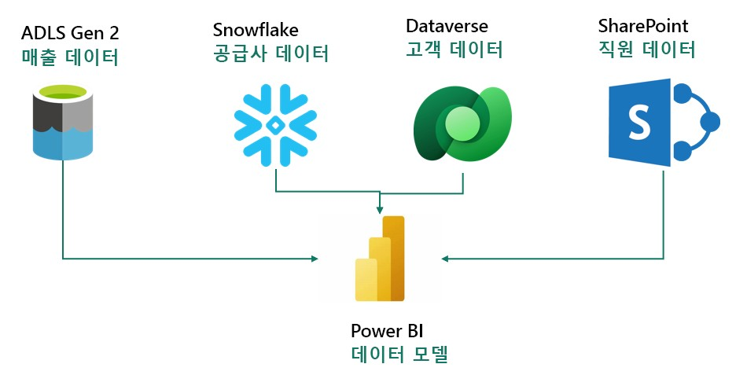

현재 상기 소스 시스템에서 데이터를 가져오는 Power BI Premium에서 데이터 세트를 구축하고 있으며, 이는 보고 요구 사항을 충족하고 최종 사용자에게 셀프 서비스 기능을 제공하기 위한 것입니다. Power Query를 사용해서 모델을 업데이트합니다.

### 다음과 같은 문제가 있습니다.

- 서로 다른 데이터 원본에 대한 서로 다른 업데이트 시간을 설정하려면 데이터 세트를 적어도 하루에 세 번 이상 새로 고쳐야 합니다.
<<<<<<< HEAD

- 소스 시스템에 발생한 업데이트를 캡처하기 위해 매번 전체 새로 고침을 수행해야 하므로 새로 고치는 데 시간이 오래 걸립니다.

- 가져오는 데이터 원본에 오류가 있으면 데이터 세트 새로 고침이 중단됩니다. 직원 파일이 제 시간에 업로드되지 않아 데이터 세트 새로 고침이 중단되는 경우가 많습니다.

- 데이터 크기가 크고 변환이 복잡한 것을 감안하면, Power Query가 미리 보기를 새로 고치는 데 오랜 시간이 걸리는 만큼 데이터 모델을 변경하는 데 매우 오랜 시간이 소요됩니다.

- 회사 표준은 Mac이지만 Power BI Desktop을 사용하려면 Windows PC가 필요합니다.

=======
- 소스 시스템에 발생한 업데이트를 캡처하기 위해 매번 전체 새로 고침을 수행해야 하므로 새로 고치는 데 시간이 오래 걸립니다.
- 가져오는 데이터 원본에 오류가 있으면 데이터 세트 새로 고침이 중단됩니다. 직원 파일이 제 시간에 업로드되지 않아 데이터 세트 새로 고침이 중단되는 경우가 많습니다.
- 데이터 크기가 크고 변환이 복잡한 것을 감안하면, Power Query가 미리 보기를 새로 고치는 데 오랜 시간이 걸리는 만큼 데이터 모델을 변경하는 데 매우 오랜 시간이 소요됩니다.
- 회사 표준은 Mac이지만 Power BI Desktop을 사용하려면 Windows PC가 필요합니다.
>>>>>>> c3ea5c1d146cb9cff964cef98d08a4445bfb997c
Microsoft Fabric에 대해 들어봤기 때문에 그것이 문제를 해결할 수 있는지 알아보기로 결정하였습니다.
 
## Power BI Desktop 보고 개요

Fabric을 시작하기 전에 Power BI Desktop의 현재 보고서를 살펴보고 변환과 모델을 이해해 보겠습니다.
<<<<<<< HEAD

### 작업 1: 랩 환경에서 Power BI Desktop을 설정하는 방법

1. 랩 환경에 **C:\FAIAD\Reports** 폴더에 있는 **FAIAD.pbix**를 엽니다. 파일이 Power BI Desktop으로 열립니다. 
=======
작업 1: 랩 환경에서 Power BI Desktop을 설정하는 방법
1.랩 환경에서 **C:\FAIAD\Reports** 폴더에 있는 **FAIAD.pbix**를 엽니다. 파일이 Power BI Desktop으로 열립니다.
>>>>>>> c3ea5c1d146cb9cff964cef98d08a4445bfb997c
 
<<<<<<< HEAD
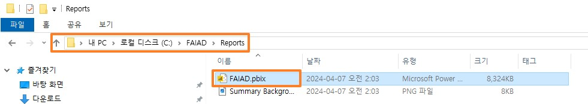
=======
 
>>>>>>> c3ea5c1d146cb9cff964cef98d08a4445bfb997c

<<<<<<< HEAD
2. 이메일 주소 입력 대화 상자가 열립니다. 랩 환경의 오른쪽 패널에 있는 **환경 세부 정보
=======
2.이메일 주소 입력 대화 상자가 열립니다. 랩 환경의 오른쪽 패널에 있는 **환경 세부 정보
>>>>>>> c3ea5c1d146cb9cff964cef98d08a4445bfb997c
탭** 으로 이동합니다.
<<<<<<< HEAD
=======
3.**사용자 이름**을 복사하여 대화 상자의 이메일 텍스트 상자에 붙여넣습니다.
4.**계속**을 선택합니다.
>>>>>>> c3ea5c1d146cb9cff964cef98d08a4445bfb997c

<<<<<<< HEAD
3. **사용자 이름**을 복사하여 대화 상자의 이메일 텍스트 상자에 붙여넣습니다.
=======
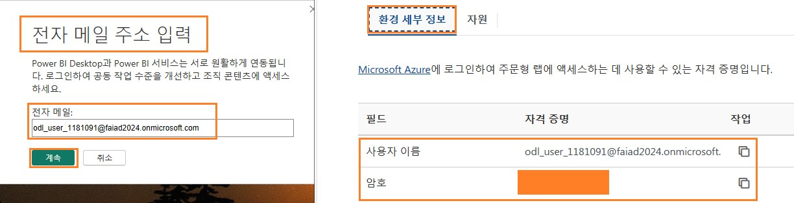
>>>>>>> c3ea5c1d146cb9cff964cef98d08a4445bfb997c

<<<<<<< HEAD
4. **계속**을 선택합니다.

5. 로그인 대화상자를 열어보겠습니다. **회사 또는 학교 계정**을 선택합니다.

6. **계속**을 선택합니다.
=======
5.로그인 대화상자를 열어보겠습니다. **회사 또는 학교 계정**을 선택합니다.
6.**계속**을 선택합니다.
>>>>>>> c3ea5c1d146cb9cff964cef98d08a4445bfb997c
 
<<<<<<< HEAD
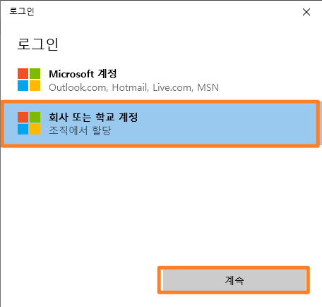
=======
 
>>>>>>> c3ea5c1d146cb9cff964cef98d08a4445bfb997c

<<<<<<< HEAD
7. 로그인 대화 상자가 열립니다. **환경 세부 정보** 탭에서 복사하여 사용자 이름을 다시 입력합니다.
=======
7.로그인 대화 상자가 열립니다. **환경 세부 정보** 탭에서 복사하여 사용자 이름을 다시 입력합니다.
8.**다음**을 선택합니다.
>>>>>>> c3ea5c1d146cb9cff964cef98d08a4445bfb997c

<<<<<<< HEAD
8. **다음**을 선택합니다.
=======
 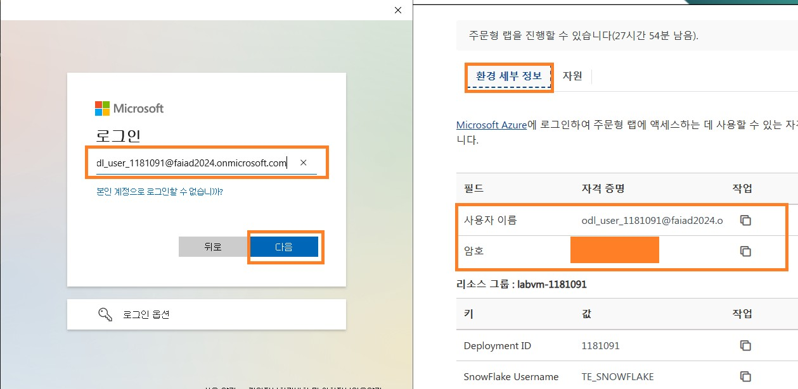
>>>>>>> c3ea5c1d146cb9cff964cef98d08a4445bfb997c

<<<<<<< HEAD

=======
9.다음 대화 상자에서 **환경 세부 정보 탭에서 복사한** 사용자 이름 **자격 증명**을 입력합니다.
10.**로그인**을 선택합니다.
11.다단계 인증 설정을 요청하는 조치 필요 대화 상자가 열립니다. 이는 랩 환경이므로 설정할 필요가 없습니다. **Ask Later**를 선택합니다.
     
   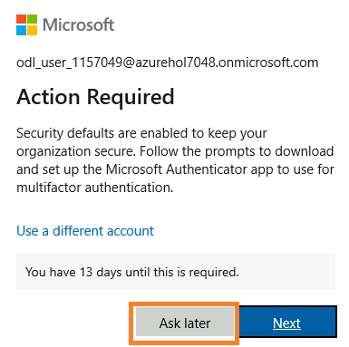
>>>>>>> c3ea5c1d146cb9cff964cef98d08a4445bfb997c

<<<<<<< HEAD

9. 다음 대화 상자에서 **환경 세부 정보 탭에서 복사한** 사용자 이름 **자격 증명**을 입력합니다.

10. **로그인**을 선택합니다.

11. 다단계 인증 설정을 요청하는 조치 필요 대화 상자가 열립니다. 이는 랩 환경이므로 설정할 필요가 없습니다. **Ask Later**를 선택합니다.
 

=======
12.다음 대화 상자에서 **아니요, 앱에만 로그인**을 선택합니다. 이제 Power BI Desktop이 열립니다.
>>>>>>> c3ea5c1d146cb9cff964cef98d08a4445bfb997c

<<<<<<< HEAD

### 작업 2: Power BI Desktop 보고서 분석

=======
## 작업 2: Power BI Desktop 보고서 분석
>>>>>>> c3ea5c1d146cb9cff964cef98d08a4445bfb997c
아래 보고서는 Fabrikam의 매출을 분석합니다. KPI는 페이지 왼쪽 상단에 나열됩니다. 나머지 시각적 개체는 지역, 제품 그룹, 재판매사별 시간 경과에 따른 매출을 부각합니다.

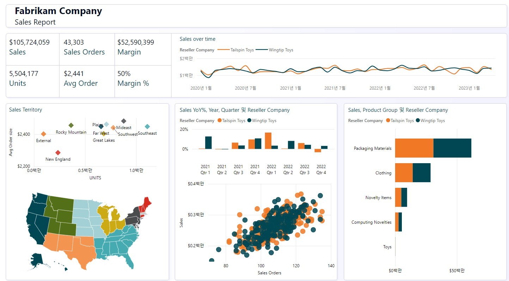
 
**참고:** 이 교육에서는 Fabric에서 사용할 수 있는 도구를 사용한 데이터 수집, 변환 및 모델링에 중점을 둡니다. 보고서 개발이나 탐색은 중점 사항이 아닙니다. 몇 분 동안 보고서를 살펴보고 다음 단계로 넘어가겠습니다.
<<<<<<< HEAD

1.	판매 지역별로 데이터를 분석해 보겠습니다. 판매 지역에서 **뉴잉글랜드**(산점도) 시각적 개체를 선택합니다. 시간 경과에 따른 매출에 따르면, Reseller Tailspin Toys는 뉴잉글랜드의 Wingtip Toys에 비해 매출이 더 많다는 점에 유의합니다. 전년대비(YoY%) Sales 막대형 차트를 보면 지난 1년 동안 Wingtip Toys 매출 성장이 낮았고 분기별로 감소했음을 알
=======
1.판매 지역별로 데이터를 분석해 보겠습니다. 판매 지역에서 **뉴잉글랜드**(산점도) 시각적 개체를 선택합니다. 시간 경과에 따른 매출에 따르면, Reseller Tailspin Toys는 뉴잉글랜드의 Wingtip Toys에 비해 매출이 더 많다는 점에 유의합니다. 전년대비(YoY%) Sales 막대형 차트를 보면 지난 1년 동안 Wingtip Toys 매출 성장이 낮았고 분기별로 감소했음을 알
>>>>>>> c3ea5c1d146cb9cff964cef98d08a4445bfb997c
수 있습니다. 3분기에 소폭 반등한 후 4분기에 다시 하락세를 보였습니다.

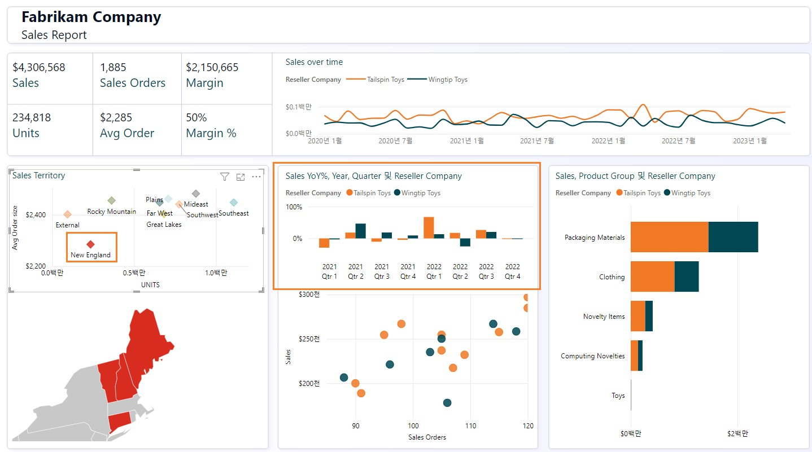

<<<<<<< HEAD
2. 이것을 록키산맥 지역과 비교해 보겠습니다. 판매 지역에서 **로키 산맥** (산점도) 시각적 개체를 선택합니다. 전년대비 막대형 차트를 보면 Wingtip Toys의 매출이 지난 2분기 동안 저점에 있다가 2022년 4분기에 급격하게 증가한 것을 알 수 있습니다.
=======
2.이것을 록키산맥 지역과 비교해 보겠습니다. 판매 지역에서 **로키 산맥** (산점도) 시각적 개체를 선택합니다. 전년대비 막대형 차트를 보면 Wingtip Toys의 매출이 지난 2분기 동안 저점에 있다가 2022년 4분기에 급격하게 증가한 것을 알 수 있습니다.
>>>>>>> c3ea5c1d146cb9cff964cef98d08a4445bfb997c

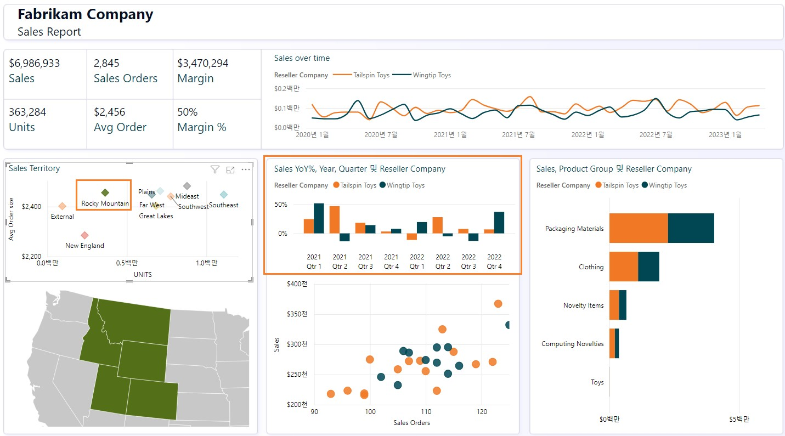 

3.판매 지역에서 **로키 산맥**(산점도)을 선택하여 필터를 제거합니다.
4.화면 하단 중앙에 있는 산점도 시각적 개체(매출별 판매 주문)에서 오른쪽 상단(4사분면)에 있는 이상값을 선택합니다. 마진(%)이 평균 50%보다 높은 52%입니다. 또한 2022년 마지막 2분기 동안 전년대비(YoY%) 매출이 증가했습니다.

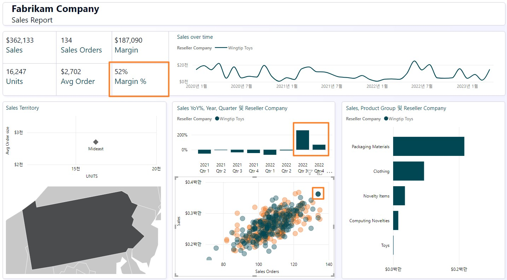 

<<<<<<< HEAD
5. **필터를 제거**하려면 산점도 시각적 개체에서 이상값 Reseller를 선택합니다.
=======
5.**필터를 제거**하려면 산점도 시각적 개체에서 이상값 Reseller를 선택합니다.
>>>>>>> c3ea5c1d146cb9cff964cef98d08a4445bfb997c
 
<<<<<<< HEAD
6. Product Group 및 Reseller별 제품 상세 정보를 살펴보겠습니다. Product Groups 및 재판매사 매출 막대 그래프에서 **Tailspin Toys의 포장 재료 막대를 마우스 우클릭하고 대화 상자에서 드릴스루 -> 제품 상세 정보**를 선택합니다.
=======
6.Product Group 및 Reseller별 제품 상세 정보를 살펴보겠습니다. Product Groups 및 재판매사 매출 막대 그래프에서 **Tailspin Toys의 포장 재료 막대를 마우스 우클릭하고 대화 상자에서 드릴스루 -> 제품 상세 정보**를 선택합니다.
>>>>>>> c3ea5c1d146cb9cff964cef98d08a4445bfb997c

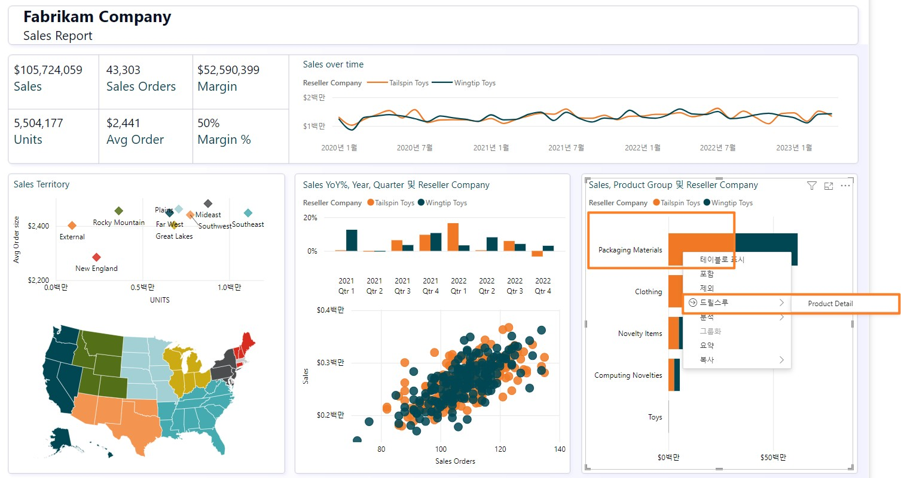

제품 상세 정보를 제공하는 페이지로 이동하게 됩니다. 향후 주문도 일부 있음을 확인합니다.
<<<<<<< HEAD

7.	이 페이지를 검토한 후 페이지 오른쪽 상단에 있는 **Ctrl+뒤로 화살표**를 선택하여 판매 보고서로 다시 이동합니다.
=======
7.이 페이지를 검토한 후 페이지 오른쪽 상단에 있는 **Ctrl+뒤로 화살표**를 선택하여 판매 보고서로 다시 이동합니다.
>>>>>>> c3ea5c1d146cb9cff964cef98d08a4445bfb997c

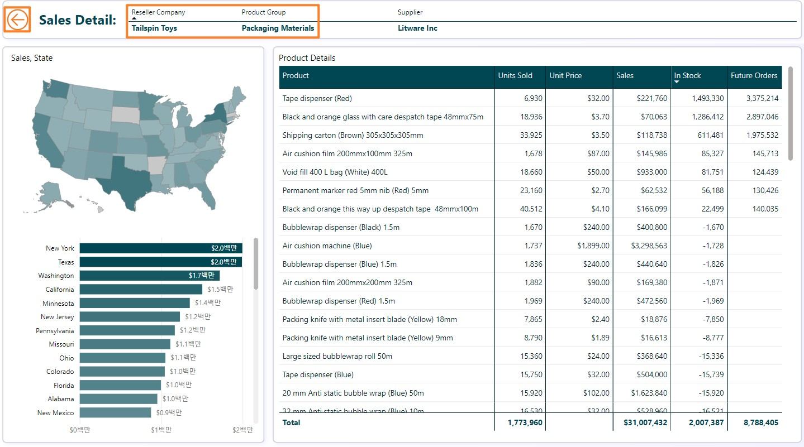
 
<<<<<<< HEAD
8. 보고서를 자유롭게 더 분석합니다. 준비가 되♘으면 모델 보기를 살펴보겠습니다. 왼쪽 패널에서 **모델 보기 아이**콘을 선택합니다. Sales와 PO라는 두 개의 팩트 테이블이 있습니다.
=======
8.보고서를 자유롭게 더 분석합니다. 준비가 되♘으면 모델 보기를 살펴보겠습니다. 왼쪽 패널에서 **모델 보기 아이**콘을 선택합니다. Sales와 PO라는 두 개의 팩트 테이블이 있습니다.
>>>>>>> c3ea5c1d146cb9cff964cef98d08a4445bfb997c

<<<<<<< HEAD
&nbsp; &nbsp; &nbsp; &nbsp; &nbsp;a.매출 데이터의 세분화는 Date, Reseller, Product 및 People별로 이루어집니다. Date, Reseller, Product, People이 Sales에 연결됩니다.
=======
a.매출 데이터의 세분화는 Date, Reseller, Product 및 People별로 이루어집니다. Date, Reseller, Product, People이 Sales에 연결됩니다.
>>>>>>> c3ea5c1d146cb9cff964cef98d08a4445bfb997c

<<<<<<< HEAD
&nbsp; &nbsp; &nbsp; &nbsp; &nbsp;b. PO 데이터의 세분화는 Date, Product 및 People별로 이루어집니다. Date, Product, People이 PO에 연결됩니다.

&nbsp; &nbsp; &nbsp; &nbsp; &nbsp;c.Product별 Supplier 데이터가 있습니다. Supplier는 Product에 연결됩니다.

&nbsp; &nbsp; &nbsp; &nbsp; &nbsp;d.Geo별 Reseller 위치 데이터가 있습니다. Geo가 Reseller에 연결됩니다.

&nbsp; &nbsp; &nbsp; &nbsp; &nbsp;e.Reseller별 고객 정보가 있습니다. Customer가 Reseller에 연결됩니다.

=======
b.PO 데이터의 세분화는 Date, Product 및 People별로 이루어집니다. Date, Product, People이 PO에 연결됩니다.

c.Product별 Supplier 데이터가 있습니다. Supplier는 Product에 연결됩니다.

d.Geo별 Reseller 위치 데이터가 있습니다. Geo가 Reseller에 연결됩니다.

e.Reseller별 고객 정보가 있습니다. Customer가 Reseller에 연결됩니다.

>>>>>>> c3ea5c1d146cb9cff964cef98d08a4445bfb997c
## 작업 3: Power Query 검토
<<<<<<< HEAD
=======
1.Power Query를 보면서 데이터 원본을 파악해보겠습니다. 리본 메뉴에서 홈 -> **데이터 변환**을 선택합니다.
>>>>>>> c3ea5c1d146cb9cff964cef98d08a4445bfb997c

<<<<<<< HEAD
1. Power Query를 보면서 데이터 원본을 파악해보겠습니다. 리본 메뉴에서 홈 -> **데이터 변환**을 선택합니다.

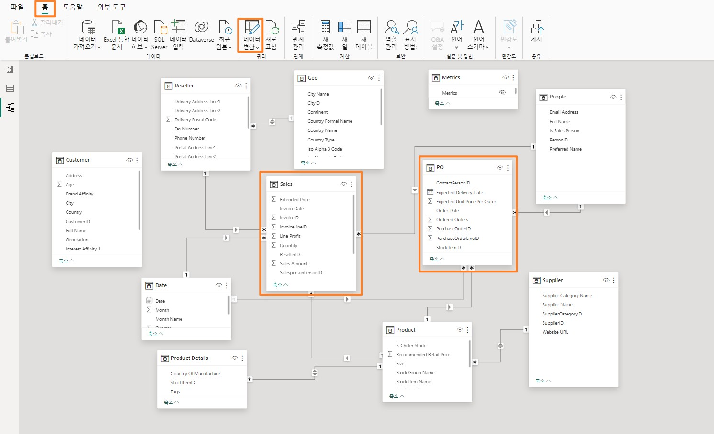
=======

>>>>>>> c3ea5c1d146cb9cff964cef98d08a4445bfb997c
 
<<<<<<< HEAD
2. Power Query 창이 열립니다. 리본 메뉴에서 홈 -> **데이터 원본 설정**을 선택합니다. 데이터 원본 설정 대화 상자가 열립니다. 목록을 스크롤하면 문제 설명에 언급된 대로 네 가지 데이터 원본이 있음을 알 수 있습니다.
=======
2.Power Query 창이 열립니다. 리본 메뉴에서 홈 -> **데이터 원본 설정**을 선택합니다. 데이터 원본 설정 대화 상자가 열립니다. 목록을 스크롤하면 문제 설명에 언급된 대로 네 가지 데이터 원본이 있음을 알 수 있습니다.
>>>>>>> c3ea5c1d146cb9cff964cef98d08a4445bfb997c

<<<<<<< HEAD
&nbsp; &nbsp; &nbsp; &nbsp; &nbsp;a.Snowflake
=======
a.Snowflake
>>>>>>> c3ea5c1d146cb9cff964cef98d08a4445bfb997c

<<<<<<< HEAD
&nbsp; &nbsp; &nbsp; &nbsp; &nbsp;b.SharePoint

&nbsp; &nbsp; &nbsp; &nbsp; &nbsp;c.ADLS Gen2

&nbsp; &nbsp; &nbsp; &nbsp; &nbsp;d.Dataverse

3. **닫기**를 선택하여 데이터 원본 설정 대화 상자를 닫습니다.

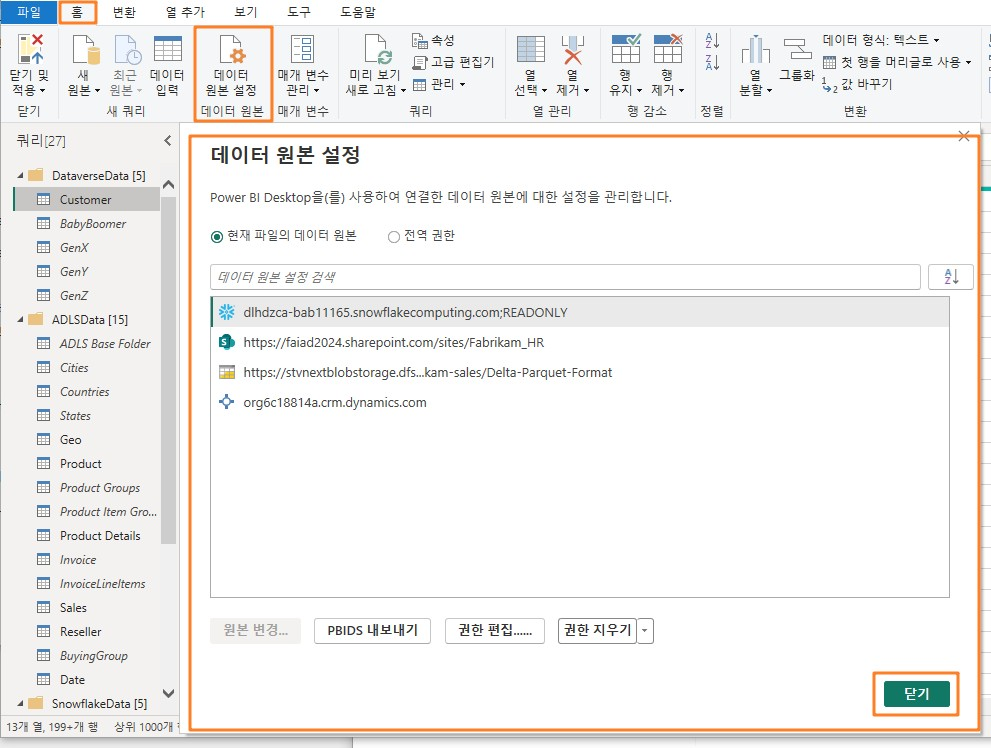

4. 왼쪽 쿼리 패널에서 쿼리가 데이터 원본별로 그룹화되어 있는지 확인합니다.

5. **DataverseData** 폴더에는 BabyBoomer, GenX, GenY, 및 GenZ의 네 가지 쿼리에서 사용할 수 있는 고객 데이터가 있습니다. 이 네 가지 쿼리는 Customer 쿼리를 생성하기 위해 추가됩니다.

6. **환경 변**수 탭(랩 가이드 옆)에 있는 **사용자 이**름 및 **암호**를 입력하여 Dataverse 데이터 원본에 대한 자격 증명을 입력할 수 있습니다. Microsoft 계정 옵션을 선택합니다.
=======
b.SharePoint

c.ADLS Gen2

d.Dataverse

3.**닫기**를 선택하여 데이터 원본 설정 대화 상자를 닫습니다.

4.왼쪽 쿼리 패널에서 쿼리가 데이터 원본별로 그룹화되어 있는지 확인합니다.
5.**DataverseData** 폴더에는 BabyBoomer, GenX, GenY, 및 GenZ의 네 가지 쿼리에서 사용할 수 있는 고객 데이터가 있습니다. 이 네 가지 쿼리는 Customer 쿼리를 생성하기 위해 추가됩니다.
6.**환경 변**수 탭(랩 가이드 옆)에 있는 **사용자 이**름 및 **암호**를 입력하여 Dataverse 데이터 원본에 대한 자격 증명을 입력할 수 있습니다. Microsoft 계정 옵션을 선택합니다.
>>>>>>> c3ea5c1d146cb9cff964cef98d08a4445bfb997c
 
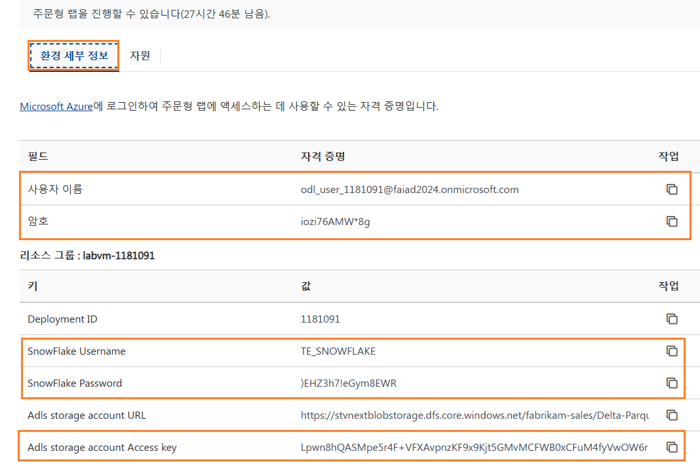

<<<<<<< HEAD
7. ADLS 데이터 원본의 경우 **계정 키** 옵션을 선택하고 **환경 변수** 탭(랩 가이드 옆)에 있는 **Adls
=======
7.ADLS 데이터 원본의 경우 **계정 키** 옵션을 선택하고 **환경 변수** 탭(랩 가이드 옆)에 있는 **Adls
>>>>>>> c3ea5c1d146cb9cff964cef98d08a4445bfb997c
스토리지 계정 액세스 키**를 입력합니다.
<<<<<<< HEAD

8. **ADLSData** 폴더에는 Geo, Product, Reseller, Date 등 다양한 차원(dimension)이 있습니다. Sales 팩트도 있습니다.

&nbsp; &nbsp; &nbsp; &nbsp; &nbsp; a.**Geo 차원**은 Cities, Countries, 및 States 쿼리의 데이터를 병합하여 생성됩니다.

&nbsp; &nbsp; &nbsp; &nbsp; &nbsp;b.**Product 차원**은 Product Groups 및 Product Item Group 쿼리의 데이터를 병합하여 생성됩니다.

&nbsp; &nbsp; &nbsp; &nbsp; &nbsp;c.**Reseller 차원**은 BuyingGroup 쿼리를 사용하여 필터링됩니다.

&nbsp; &nbsp; &nbsp; &nbsp; &nbsp;d.**Sales 팩트**는 InvoiceLineItems를 Invoice 쿼리와 병합하여 생성됩니다.

9. Snowflake 데이터 원본의 경우, **환경 변수** 탭(랩 가이드 옆)에 있는 **Snowflake 사용자 이름**
=======
8.ADLSData 폴더에는 Geo, Product, Reseller, Date 등 다양한 차원(dimension)이 있습니다. Sales
팩트도 있습니다.

a.**Geo 차원**은 Cities, Countries, 및 States 쿼리의 데이터를 병합하여 생성됩니다.

b.**Product 차원**은 Product Groups 및 Product Item Group 쿼리의 데이터를 병합하여 생성됩니다.

c.**Reseller 차원**은 BuyingGroup 쿼리를 사용하여 필터링됩니다.

d.**Sales 팩트**는 InvoiceLineItems를 Invoice 쿼리와 병합하여 생성됩니다.

9.Snowflake 데이터 원본의 경우, **환경 변수** 탭(랩 가이드 옆)에 있는 **Snowflake 사용자 이름**
>>>>>>> c3ea5c1d146cb9cff964cef98d08a4445bfb997c
및 **Snowflake 암호**를 사용합니다.
<<<<<<< HEAD

10. **SnowflakeData** 폴더에는 Supplier 차원과 PO(주문/지출) 팩트가 있습니다.

&nbsp; &nbsp; &nbsp; &nbsp; &nbsp;a.**Supplier 차원**은 Suppliers 쿼리와 SupplierCategories 쿼리를 병합하여 생성됩니다.

&nbsp; &nbsp; &nbsp; &nbsp; &nbsp;b.**PO 팩트**는 PO와 PO Line Items 쿼리를 병합하여 생성됩니다.

11. SharePoint 데이터 원본의 경우, **환경 변수** 탭(랩 가이드 옆)에 있는 **사용자 이름** 및 **암호**를 입력합니다. Microsoft 계정 옵션을 선택합니다.

12.	**SharepointData** 폴더에는 People 차원이 있습니다.
=======
10.**SnowflakeData** 폴더에는 Supplier 차원과 PO(주문/지출) 팩트가 있습니다.

a.**Supplier 차원**은 Suppliers 쿼리와 SupplierCategories 쿼리를 병합하여 생성됩니다.

b.**PO 팩트**는 PO와 PO Line Items 쿼리를 병합하여 생성됩니다.

11.	SharePoint 데이터 원본의 경우, **환경 변수** 탭(랩 가이드 옆)에 있는 **사용자 이름** 및 **암호**를 입력합니다. Microsoft 계정 옵션을 선택합니다.
12.**SharepointData** 폴더에는 People 차원이 있습니다.
>>>>>>> c3ea5c1d146cb9cff964cef98d08a4445bfb997c
 
<<<<<<< HEAD
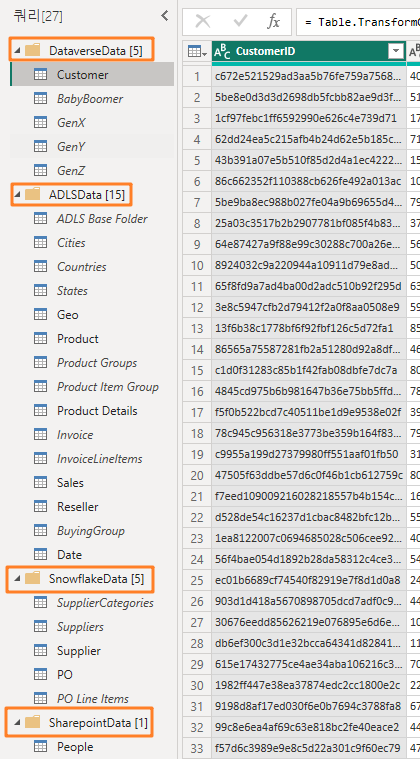
=======
  
>>>>>>> c3ea5c1d146cb9cff964cef98d08a4445bfb997c

이로써 학습이 끝났습니다. 다음 랩에서는 Dataflow Gen2와 Lakehouse를 사용한 모델을 사용하여 유사한 Power Query 모델을 만듭니다.
 
## 참조

Fabric Analyst in a Day(FAIAD)는 Microsoft Fabric에서 사용할 수 있는 몇 가지 주요 기능을 소개합니다. 서비스의 메뉴에 있는 도움말(?) 섹션에는 유용한 리소스로 연결되는 링크가 있습니다.

아래는 Microsoft Fabric의 다음 단계에 도움이 되는 몇 가지 추가 자료입니다.
<<<<<<< HEAD

- [Microsoft Fabric GA 발표](https://www.microsoft.com/en-us/microsoft-fabric/blog/2023/11/15/prepare-your-data-for-ai-innovation-with-microsoft-fabric-now-generally-available/) 발표 전문을 블로그 포스트로 읽기  
-	 [가이드 투어](https://guidedtour.microsoft.com/en-us/guidedtour/microsoft-fabric/microsoft-fabric/1/1)로 Fabric 탐색 
-	 [Microsof t Fabric 무료 평가판](https://www.microsoft.com/en-us/microsoft-fabric/getting-started)신청   
-	[Microsof t Fabric 웹사이트](https://www.microsoft.com/en-in/microsoft-fabric) 방문  
-	[Fabric 학습 모듈](https://learn.microsoft.com/en-us/training/browse/?products=fabric&resource_type=module)을 탐색해서 새로운 기술 익히기 
-	[Fabric 기술 문서 ](https://learn.microsoft.com/en-us/fabric/)검토
-	[Fabric 시작하기 무료 e북](https://info.microsoft.com/ww-landing-unlocking-transformative-data-value-with-microsoft-fabric.html)읽기
-	[Fabric 커뮤니티](https://community.fabric.microsoft.com/)에 가입하여 질문을 게시하고 피드백을 공유하며 다른 사람들로부터 배우기 
=======
- [Microsof t Fabric GA 발표](https://www.microsoft.com/en-us/microsoft-fabric/blog/2023/11/15/prepare-your-data-for-ai-innovation-with-microsoft-fabric-now-generally-available/) 전문을 블로그 포스트로 읽기
- [가이드 투어](https://guidedtour.microsoft.com/en-us/guidedtour/microsoft-fabric/microsoft-fabric/1/1)로 Fabric 탐색
- [Microsof t Fabric 무료 평가판](https://www.microsoft.com/en-us/microsoft-fabric/getting-started) 신청
- [Microsof t Fabric 웹사이트](https://www.microsoft.com/en-in/microsoft-fabric) 방문
- [Fabric 학습 모듈](https://learn.microsoft.com/en-us/training/browse/?products=fabric&resource_type=module)을 탐색해서 새로운 기술 익히기
- [Fabric 기술 문서](https://learn.microsoft.com/en-us/fabric/) 검토
- [Fabric 시작하기 무료 e북 ](https://info.microsoft.com/ww-landing-unlocking-transformative-data-value-with-microsoft-fabric.html)읽기
- [Fabric 커뮤니티](https://community.fabric.microsoft.com/)에 가입하여 질문을 게시하고 피드백을 공유하며 다른 사람들로부터 배우기
>>>>>>> c3ea5c1d146cb9cff964cef98d08a4445bfb997c
 
더 많은 심층 Fabric 환경 발표 블로그 포스트 읽기:
<<<<<<< HEAD
=======
- [Fabric 블로그의 Data Factory 환경](https://aka.ms/Fabric-Data-Factory-Blog)
- [Fabric 블로그의 Synapse Data Engineering 환경](https://aka.ms/Fabric-DE-Blog)
- [Fabric 블로그의 Synapse Data Science 환경](https://aka.ms/Fabric-DS-Blog)
- [Fabric 블로그의 Synapse Data Warehousing 환경](https://aka.ms/Fabric-DW-Blog)
- [Fabric 블로그의 Synapse Real-Time Analytics 환경](https://aka.ms/Fabric-RTA-Blog)
- [Power BI 발표 블로그](https://aka.ms/Fabric-PBI-Blog)
- [Fabric 블로그의 Data Activator 환경](https://aka.ms/Fabric-DA-Blog)
- [Fabric 블로그의 관리 및 거버넌스](https://aka.ms/Fabric-Admin-Gov-Blog)
- [Fabric 블로그의 OneLake](https://aka.ms/Fabric-OneLake-Blog)
- [Dataverse 및 Microsof t Fabric 통합 블로그](https://aka.ms/Dataverse-Fabric-Blog)
>>>>>>> c3ea5c1d146cb9cff964cef98d08a4445bfb997c

-	[Fabric 블로그의 Data Factory 환경](https://blog.fabric.microsoft.com/en-us/blog/introducing-data-factory-in-microsoft-fabric/)
-	[Fabric 블로그의 Synapse Data Engineering 환경](https://blog.fabric.microsoft.com/en-us/blog/introducing-synapse-data-engineering-in-microsoft-fabric/)
-	[Fabric 블로그의 Synapse Data Science 환경](https://blog.fabric.microsoft.com/en-us/blog/introducing-synapse-data-science-in-microsoft-fabric/)
-	[Fabric 블로그의 Synapse Data Warehousing 환경](https://blog.fabric.microsoft.com/en-us/blog/introducing-synapse-data-warehouse-in-microsoft-fabric/)
-	[Fabric 블로그의 Synapse Real-Time Analytics 환경](https://blog.fabric.microsoft.com/en-us/blog/sense-analyze-and-generate-insights-with-synapse-real-time-analytics-in-microsoft-fabric/)
-	[Power BI 발표 블로그](https://powerbi.microsoft.com/en-us/blog/empower-power-bi-users-with-microsoft-fabric-and-copilot/)
-	[Fabric 블로그의 Data Activator 환경](https://blog.fabric.microsoft.com/en-us/blog/driving-actions-from-your-data-with-data-activator/)
-	[Fabric 블로그의 관리 및 거버넌스](https://blog.fabric.microsoft.com/en-us/blog/administration-security-and-governance-in-microsoft-fabric/)
-	[Fabric 블로그의 OneLake](https://blog.fabric.microsoft.com/en-us/blog/microsoft-onelake-in-fabric-the-onedrive-for-data/)
-	[Dataverse 및 Microsof t Fabric 통합 블로그](https://cloudblogs.microsoft.com/dynamics365/it/2023/05/24/new-dataverse-enhancements-and-ai-powered-productivity-with-microsoft-365-copilot/)

© 2023 Microsoft Corporation. All rights reserved.
이 데모/랩을 사용하면 다음 조건에 동의하게 됩니다.
이 데모/랩에 설명된 기술/기능은 학습 환경을 제공하고 사용자 의견을 얻기 위해 Microsoft Corporation에서 제공합니다. 데모/랩을 통해서만 이러한 기술적 특성과 기능을 평가하고 사용자 의견을 Microsoft에 제시할 수 있습니다. 다른 용도로는 사용할 수 없습니다. 이 데모/랩 또는 그 일부에 대해 수정, 복사, 배포, 전송, 표시, 수행, 재현, 게시, 라이선스 허여, 파생 작업 생성, 양도 또는 판매할 수 없습니다.
추가 복제 또는 재배포를 위한 다른 서버 또는 위치에 대한 데모/랩(또는 그 일부)의 복사 또는 재현은 명시적으로 금지됩니다.
이 데모/랩은 위에서 명시한 목적을 위해 복잡한 설정 또는 설치가 없는 시뮬레이션된 환경에서 잠재적인 새로운 기능과 개념을 포함하여 특정 소프트웨어 기술/제품의 특성 및 기능을 제공합니다. 이 데모/랩에서 서술된 기술/개념은 전체 기능을 나타내지 않을 수 있으며, 최종 버전이 작동하지 않을 수도 있습니다. 또한 해당 기능 또는 개념의 최종
버전을 릴리스하지 않을 수도 있습니다. 또한 실제 환경에서 이러한 특성과 기능을 사용한 경험이 다를 수도 있습니다.
 
**피드백.** 이 데모/랩에서 서술된 기술적 특성, 기능 및/또는 개념에 대한 사용자 의견을
Microsoft에 제시하면 Microsoft는 이 사용자 의견을 어떤 방식과 목적으로든 무료로 사용, 공유 및 상용화할 수 있습니다. 또한 제품, 기술 및 서비스에서 사용자 의견이 포함된
Microsoft 소프트웨어 또는 서비스의 특정 부분을 사용하거나 인터페이스하는 데 필요한 모든 특허권을 제3자에게 무료로 제공합니다. Microsoft에서 사용자 의견을 포함하기 때문에 Microsoft에서 해당 소프트웨어 또는 설명서의 사용을 인가해야 하는 라이선스에 종속된 사용자 의견은 제공할 수 없습니다. 이러한 권리는 본 계약에 의거하여 유효합니다.
Microsoft Corporation은 이에 따라 명시적, 묵시적 또는 법적 특정 목적에의 적합성, 권리 및 비침해 여부에 관계없이 모든 보증과 조건을 포함하여 데모/랩과 관련된 모든 보증 및 조건을 부인합니다. Microsoft는 어떤 목적으로든 결과의 정확성, 데모/랩의 사용으로 파생된 출력 또는 데모/랩에 포함된 정보의 적합성과 관련하여 어떠한 보증이나 진술도 하지 않습니다.

**고지 사항**
이 데모/랩에는 Microsoft Power BI의 새로운 기능 및 향상된 기능 중 일부만 포함되어 있습니다. 일부 기능은 제품의 향후 릴리스에서 변경될 수 있습니다. 이 데모/랩에서는 새로운 기능 모두가 아닌 일부에 대해 학습하게 됩니다.

