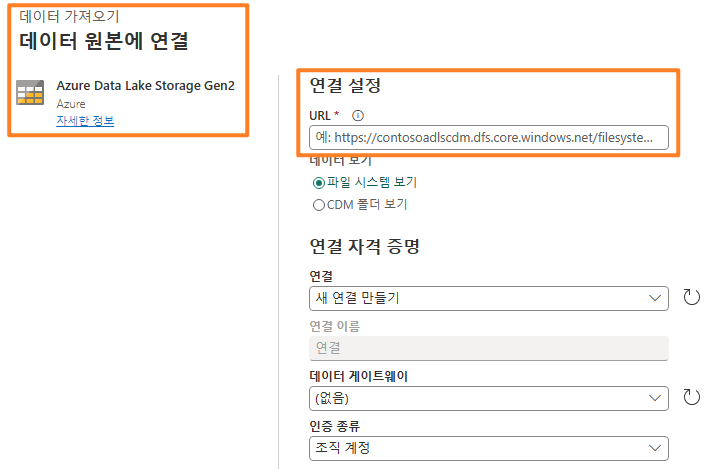
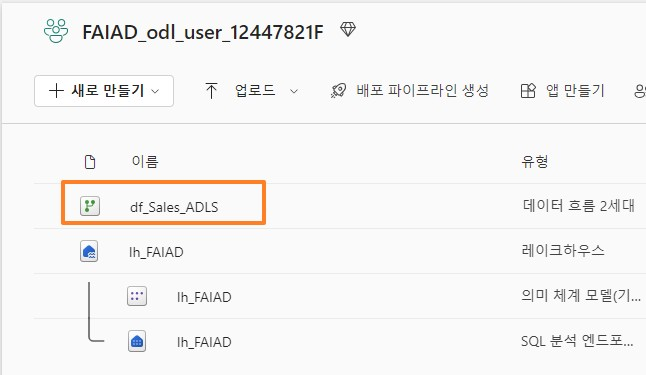
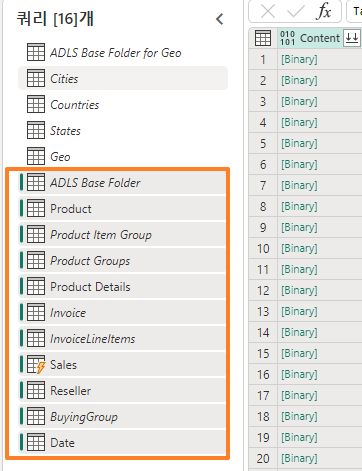

## 목차
- 서문
- 데이터 흐름 2 세대
  - 작업 1: 데이터 흐름 2 세대 만들기
  - 작업 2: ADLS Gen2 에 대한 연결 만들기
  - 작업 3: 기본 ADLS Gen2 폴더 쿼리 만들기
  - 작업 4: Cities 쿼리 만들기
  - 작업 5: Countries 쿼리 만들기
  - 작업 6: 복사를 사용하여 States 생성 - 옵션 1
  - 작업 7: 복사로 Geo 쿼리 만들기 - 옵션 2
  - 작업 8: Geo 쿼리를 위한 데이터 대상 구성
  - 작업 9: 데이터 흐름 게시
  - 작업 10: 데이터 흐름 이름 바꾸기
  - 작업 11: 데이터 흐름에서 나머지 쿼리 빌드
  - 작업 12: 나머지 쿼리를 위한 데이터 대상 구성
- 참조

## 서문
우리 시나리오에서 매출 데이터는 ERP 시스템에서 제공되며 ADLS Gen2에 저장됩니다. 매일 정오/오후 12시에 업데이트됩니다. 이 데이터를 Lakehouse로 변환하고 수집하여 모델에서 사용해야 합니다.
데이터를 수집할 수 있는 방법은 다양합니다. 
- **바로 가기:** 이는 데이터를 변환하는 방법을 제공하지 않습니다. 
- **Notebooks:** 이를 위해서는 코드를 작성해야 합니다. 이는 개발자 친화적인 방식입니다.
- **데이터 흐름 2세대:** 아마도 Power Query 또는 데이터 흐름 1세대에 익숙할 것입니다. 데이터 흐름 2세대는 이름에서 알 수 있듯이 데이터 흐름의 최신 버전입니다. 이는 데이터를 여러 데이터 원본으로 변환하고 수집하는 추가 기능과 함께 Power Query / 데이터 흐름 1세대의 모든 기능을 제공합니다. 다음 두 랩에서 이것을 소개할 것입니다. 
- **데이터 파이프라인:** 이는 오케스트레이션 도구입니다. 데이터를 추출, 변환, 수집하도록 활동을 조정할 수 있습니다. 데이터 파이프라인을 사용하여 데이터 흐름 2세대 활동을 실행하여 추출, 변환, 수집이 수행되도록 할 수 있습니다. 
데이터 흐름 2세대부터 시작하여 데이터 원본에 대한 연결과 필요한 변환을 만듭니다. 그런 다음 데이터 파이프라인을 사용하여 데이터 흐름 2세대를 조정/실행하겠습니다. 
이 랩을 마치면 다음 사항을 알게 됩니다. 
- 데이터 흐름 2세대를 만드는 방법
- 데이터 흐름 2세대를 사용하여 ADLS Gen2에 연결하고 데이터를 변환하는 방법
- Lakehouse에 데이터를 수집하는 방법

## 데이터 흐름 2세대
작업 1: 데이터 흐름 2세대 만들기
1.다시 랩 2, 작업 9에서 만든 **Fabric 작업 영역**으로 되돌아가 보겠습니다.
2.이전 랩에서 다른 곳으로 이동하지 않은 경우 Lakehouse 화면이 표시됩니다. 다른 곳으로 이동해도 괜찮습니다. 화면 왼쪽 아래에 있는 **Fabric 환경 선택기** 아이콘을 선택합니다.
 
3.열린 Fabric 환경 대화 상자에서 **Data Factory**를 선택합니다. Data Factory에는 데이터를 추출, 변환 및 수집하는 데 필요한 워크로드가 있습니다.

   

4.Data Factory 홈 페이지로 이동됩니다. 새로 만들기에서 **데이터 흐름 2세대를 선택합니다.**

   

**데이터 흐름 페이지**로 이동됩니다. 이 화면은 데이터 흐름 1세대 또는 Power Query에서와 같이 익숙할 것입니다. 데이터 변환 기능과 함께 다양한 데이터 원본에 연결하는 옵션을 사용할
수 있습니다. ADLS Gen2 데이터 원본에 연결하고 몇 가지 변환을 수행해 보겠습니다.
 
## 작업 2: ADLS Gen2에 대한 연결 만들기
1.리본 메뉴에서 **홈 -> 데이터 가져오기 -> 자세히...** 를 선택합니다.

   

2.**데이터 가져오기 데이터 원본 선택** 대화 상자로 이동됩니다. 검색창에 입력하여 데이터 원본을 검색할 수 있습니다. 왼쪽 패널에는 빈 테이블 또는 빈 쿼리를 사용하는 옵션이 있습니다. 또한 파일 업로드에 대한 새로운 옵션도 찾을 수 있습니다. 이 옵션은 이후 랩에서 살펴보겠습니다. 지금은 화면 오른쪽에 구석에 있는 **자세히 보기 ->**를 클릭합니다.

    
 
이제 사용 가능한 모든 데이터 원본을 볼 수 있습니다. 파일, 데이터베이스, Microsoft Fabric, Power Platform, Azure 등을 기준으로 데이터 원본을 필터링할 수 있는 옵션이 있습니다.

   

3.Azure 데이터 원본으로 필터링하려면 상단 필터 옵션에서 **Azure**를 선택합니다.
4.**Azure Data Lake Storage Gen2**를 선택합니다.

   

5.데이터 원본에 연결하기 대화 상자로 이동됩니다. ADLS Gen2 데이터 원본에 대한 연결을 만들어야 합니다. **연결 설정 -> URL**에서 다음 링크를 입력합니다.
https://stvnextblobstorage.dfs.core.windows.net/fabrikam-sales/Delta-Parquet-Format
 
   

6.인증 종류 드롭다운에서 **계정 키**를 선택합니다.
7.**환경 변수 탭**(랩 가이드 탭 옆)의 **Adls 스토리지 계정 액세스 키**를 복사하여 **계정 키 텍스트 상자**에 붙여넣습니다.

   

8.화면 오른쪽 하단에서 **다음**을 선택합니다.
 
## 작업 3: 기본 ADLS Gen2 폴더 쿼리 만들기
1.연결이 설정되면 **폴더 데이터 미리 보기** 화면으로 이동됩니다. ADLS Gen2 폴더에는 많은 파일이 있습니다. 우리는 그들 중 몇몇의 데이터가 필요합니다. **만들기**를 선택하여 폴더에 대한 연결을 만듭니다.

   

2.**Power Query** 대화 상자로 돌아왔습니다. 이는 ADLS Gen2의 루트 폴더에 대한 연결이 됩니다. 후속 쿼리에서 이 쿼리를 참조합니다. 쿼리 이름을 바꿔 보겠습니다. **오른쪽 패널의 쿼리 설정 -> 속성 -> 이름**에서 이름을 **Geo용 ADLS Base Folder**로 변경합니다.
3.데이터 흐름 2세대의 모든 쿼리는 기본적으로 스테이징 Lakehouse에 로드됩니다. 이 랩의 일환으로 데이터를 스테이징하지 않습니다. 이 로드를 비활성화하려면 **왼쪽 패널**에서

**ADLS Base Folder** 쿼리를 마우스 우클릭합니다.

**참고:** 스테이징은 데이터를 사용하기 위해서 준비하기 전에 추가 변환에 사용할 데이터를 스테이징할 때 사용됩니다.

4.**스테이징 사용** 옵션을 선택 취소합니다.

   
 
폴더에는 **json** 및 **parquet**의 두 가지 파일 형식이 있습니다.

- **Parquet:** 이는 플랫 컬럼형 스토리지 데이터 형식을 처리하기 위해 구축된 오픈 소스 파일 형식입니다. Parquet는 대용량의 복잡한 데이터에 잘 작동하며 뛰어난 데이터 압축과 다양한 인코딩 유형을 처리하는 능력으로 잘 알려져 있습니다.
- **Json:** 이 형식의 파일은 스키마와 같은 메타데이터, parquet 파일의 데이터 유형을 포함합니다.
5.우리는 Parquet 파일만 필요한데 그것은 이 파일에 필요한 데이터가 있기 때문입니다. **확장 열 드롭다운 화살표를** 선택합니다.
6.**.json**을 **선택 취소**하여 .parquet 파일로 필터링합니다.
7.**확인**을 선택합니다.

     

이제 기본 쿼리가 설정되♘습니다. 모든 Geo 쿼리에 대해 이를 참조할 수 있습니다.

## 작업 4: Cities 쿼리 만들기
매출 데이터는 Geo, Product, Sales Person, 그리고 Date별로 세분화됩니다.. 먼저 Geo 차원을 가져오는 쿼리를 만들어 보겠습니다. Geo 데이터는 다음 하위 폴더에 있는 세 가지 파일로 제공됩니다.
- Cities: Application.Cities
- Countries: Application.Countries
- State: Application.StateProvinces 
 
Geo 차원을 생성하려면 이 세 파일의 도시, 주, 국가 데이터를 결합해야 합니다.
1.도시부터 시작하겠습니다. 왼쪽 패널에서 **Geo용 ADLS Base Folder**를 마우스 우클릭합니다. Geo용 ADLS Base Folder 쿼리를 참조하는 새 쿼리를 만들려면 **참조**를 선택합니다.

   

2.**폴더 경로 열 드롭다운 화살표**를 선택합니다.

   

3.**텍스트 필터 -> 포함…** 을 선택합니다.

   
 
4.**필터 행** 대화 상자에 **Application.Cities**를 입력합니다.

**참고:** 이 대화 상자는 대소문자를 구분합니다.

5.**확인**을 선택합니다.

   

6.데이터가 단일 행으로 필터링됩니다. **콘텐츠** 열**에서 Binary**를 선택합니다.

   

7.	든 도시 상세 정보가 표시됩니다. **오른쪽 패널의 쿼리 설정 -> 속성 -> 이름**에서 이름을

**Cities**로 변경합니다.

**참고:** 스크린샷 오른쪽 하단에서 쿼리에 4개의 적용된 단계가 있는지 확인하고 쿼리 로드가 완료될 때까지 기다립니다. 이 작업은 몇 분 정도 걸릴 수 있습니다.

  

오른쪽 패널의 **적용된 단계** 아래에 모든 단계가 등록되어 있는 것을 확인합니다. 이 동작은
Power Query와 유사합니다. 이제 유사한 프로세스에 따라 **국가** 쿼리를 생성해 보겠습니다.
 
## 작업 5: Countries 쿼리 만들기
1.왼쪽 패널에서 **Geo용 ADLS Base Folder**를 마우스 우클릭합니다. Geo용 ADLS Base Folder
쿼리를 참조하는 새 쿼리를 만들려면 **참조**를 선택합니다.

   

2.**폴더 경로 열 드롭다운**을 선택합니다.

3.**텍스트 필터 -> 포함…** 을 선택합니다.

   

4.**필터 열 대화 상자에 Application.Countries**를 입력합니다.

**참고:** 이 대화 상자는 대소문자를 구분합니다.
 
5.**확인**을 선택합니다.

      
  
6.데이터가 단일 행으로 필터링됩니다. **콘텐츠** 열**에서 Binary**를 선택합니다.

   

7.모든 국가 상세 정보가 표시됩니다. **오른쪽 패널의 쿼리 설정 -> 속성 -> 이름**에서 이름을

**Countries**로 변경합니다.

**참고:** 스크린샷 오른쪽 하단에서 쿼리에 4개의 적용된 단계가 있는지 확인하고 쿼리 로드가 완료될 때까지 기다립니다. 이 작업은 몇 분 정도 걸릴 수 있습니다. 

   

다음으로 주(state)를 가져와야 하는데 단계가 반복적입니다. Power BI Desktop 파일에 이미 쿼리가 있습니다. 거기에서 쿼리를 복사할 수 있는지 살펴보겠습니다.
 
## 작업 6: 복사를 사용하여 States 생성 - 옵션 1
1.아직 열지 않았다면 랩 환경의 **C:\FAIAD\Reports** 폴더에 있는 **FAIAD.pbix**를 엽니다.
2.리본 메뉴에서 **홈 -> 데이터 변환**을 선택합니다. Power Query 창이 열립니다. 이전 랩에서 알아본 것 처럼 왼쪽 패널의 쿼리는 데이터 원본별로 구성됩니다.
  
   

3.왼쪽 패널의 ADLSData 폴더 아래에서 **States 쿼리를 마우스 우클릭하고 복사**를 선택합니다.

4.**브라우저**로 돌아갑니다. 작업 중이던 데이터 흐름에 있어야 합니다.
5.왼쪽 패널에서 **쿼리** 패널을 선택하고 **Ctrl+V**를 입력합니다(현재 마우스 우클릭 붙여넣기는 지원되지 않습니다). MAC 디자이스를 사용하는 경우 Cmd+V를 사용하여 붙여넣습니다. 
 
**참고:** 랩 환경에서 작업하는 경우 화면 오른쪽 상단에 있는 줄임표를 선택합니다. 슬라이더를 사용하여 **VM 네이티브 클립보드**를 **활성화**합니다. 대화 상자에서 확인을 선택합니다. 쿼리 붙여넣기가 완료되면 이 옵션을 비활성화할 수 있습니다.

   

   

ADLS Base Folder도 복사됩니다. 이는 States 쿼리가 Power BI Desktop의 ADLS Base Folder를 참조하지만 이미 유사한 쿼리가 있기 때문입니다. 이 문제를 해결해보겠습니다.

6.**States** 쿼리를 선택합니다.
7.**오른쪽 패널의 적용된 단계**에서 **Source**를 선택합니다.
8.수식 입력줄에서 #"ADLS Base Folder"를 **#"Geo용 ADLS Base Folder"** 로 변경합니다.

   

9.수식 입력줄 옆에 있는 **확인 표시**를 클릭하거나 **Enter** 키를 누릅니다.

   
 
10.이제 ADLS Base Folder를 제거할 수 있습니다. 왼쪽 패널의 **쿼리** 섹션에서 **ADLS Base Folder
쿼리를 마우스 우클릭하고 삭제**를 선택합니다.

   

11.쿼리 삭제 대화 상자가 나타납니다. **삭제**를 선택하여 삭제합니다.

**참고:** 쿼리에 4개의 적용된 단계가 있는지 확인하고 쿼리 로드가 완료될 때까지 기다립니다. 이 작업은 몇 분 정도 걸릴 수 있습니다.

## 작업 7: 복사로 Geo 쿼리 만들기 - 옵션 2
이제 이들 쿼리를 병합하여 Geo 차원을 생성해야 합니다. Power BI Desktop 파일에서 쿼리를 다시 복사해 보겠습니다. 이번에는 고급 편집기에서 코드를 복사해 보겠습니다.

1.Power BI Desktop 파일의 **Power Query 창**으로 되돌아갑니다.
2.왼쪽 패널의 **쿼리** 아래에서 ADLSData 폴더의 **Geo** 쿼리를 선택합니다.
3.	리본 메뉴에서 **홈 -> 고급 편집기**를 선택합니다.
 
   

4.고급 편집기 창이 열립니다. 고급 편집기에서 **모든 텍스트를 강조**합니다.
5.**마우스 우클릭**하고 **Copy**를 선택합니다.

   

6.창 오른쪽 상단의 **X**를 선택하거나 **완료**를 선택하여 고급 편집기 창을 닫습니다.
7.브라우저에서 **데이터 흐**름 창으로 다시 이동합니다.
8.리본 메뉴에서 **데이터 가져오기 -> 빈 쿼리**를 선택합니다.
 
   

9.데이터 가져오기, 데이터 원본에 연결 고급 편집기 대화 상자가 열립니다. 고급 편집기에서
**모든 텍스트를 강조**합니다.
10.모든 텍스트를 삭제하려면 키보드에서 **삭제**를 선택합니다.
11.고급 편집기는 비어 있어야 합니다. 이제 **Ctrl+V**를 입력하여 Power BI Desktop의 고급 편집기에서 복사한 내용을 붙여넣습니다.
12.**다음**을 선택합니다.

   

13.이제 Geo 차원이 생겼습니다. 쿼리 이름을 바꿔 보겠습니다. **오른쪽 패널의 쿼리 설정 ->
속성 -> 이름**에서 이름을 **Geo**으로 변경합니다. 

**참고:** 쿼리 로드가 완료될 때까지 기다립니다. 이 작업은 몇 분 정도 걸릴 수 있습니다. 
 
Geo가 어떻게 생성되♘는지 단계별로 살펴보겠습니다. 오른쪽 패널의 적용된 단계에서 **원본**을 선택합니다. 수식 입력줄을 보거나 설정을 클릭하면 이 쿼리의 원본이 Cities와 States를 결합한 것임을 알 수 있습니다. 단계를 진행하면서 첫 번째 결합의 결과가 이어서 Countries와 결합되는 것을 확인할 수 있습니다. 따라서 세 가지 쿼리가 모두 Geo 차원을 생성하는 데 사용되는 것입니다.

   

## 작업 8: Geo 쿼리를 위한 데이터 대상 구성 
이제 차원이 있으므로 이 데이터를 Lakehouse에 수집해 보겠습니다. 이는 Dataflow Gen2에서 사용할 수 있는 새로운 기능입니다.
1.	앞서 언급했듯이 우리는 이 데이터를 스테이징하지 않습니다. 따라서 **Cities** 쿼리를 **마우스 우클릭**하고 **스테이징 사용**을 선택하여 확인 표시를 제거합니다.

   

2.**Countries 및 Geo** 쿼리에 대해서 동일한 단계를 수행하여 **스테이징 사용 옆의 확인 표시를 제거합니다**.
3.**Geo** 쿼리를 선택합니다.
4.오른쪽 하단에서 **데이터 대상** 옆에 있는 "+"를 선택합니다.
 
5.대화 상자에서 **Lakehouse**를 선택합니다.

   

6.데이터 대상에 연결 대화 상자가 열립니다. Lakehouse에 대한 새로운 연결을 생성해야 합니다. **연결 드롭다운**에서 **새 연결 만들기**를 선택하고 **조직 계정에 인증 종류**를 설정하여 **다음**을 선택합니다.

   

7.연결이 생성되면 목적지 대상 선택 대화 상자가 열립니다. 새 테이블을 만드는 중이므로 **새 테이블 라디오 버튼**이 선택되어 있는지 확인합니다.
8.앞서 만든 Lakehouse에 테이블을 만들고자 합니다. 왼쪽 패널에서 **Lakehouse -> FAIAD_<username>**(으)로 이동합니다.
9.**lh_FAIAD**를 선택합니다.
10.테이블 이름을 **Geo**로 둡니다.
11.**다음**을 선택합니다.
 
   

12.대상 설정 선택 대화 상자가 열립니다. **슬라이더**를 사용하여 **자동 설정을 비활성화**합니다.
옵션을 확인해 보겠습니다.

기존 테이블에 **데이터를 추가**하거나 **교체**하는 옵션이 있습니다.

또한 **게시 시 스키마 옵션**이 있습니다. 스키마를 고정된 상태로 유지하는 옵션이 있으며, 시간이 지남에 따라 변경되는 경우에는 동적 스키마 옵션이 있습니다.
"일부 열 이름에 지원되지 않는 문자가 포함되어 있습니다. 문제를 해결하시겠습니까?"라는 경고가 표시됩니다. Lakehouse 는 공백이 포함된 열 이름을
지원하지 않습니다. 수정을 선택하면 열 이름의 공백을 대체하기 위해 밑줄이 추가됩니다.

**참고:** 소스 열 오른쪽에 있는 확인란을 사용하면 Lakehouse 에 로드하려는 열만 선택할 수 있습니다.

   
 
13.시나리오에서는 자동 설정을 사용하겠습니다. **자동 설정 사용** 슬라이더를 활성화합니다. 대상 열 이름이 밑줄로 자동 수정되는 것을 확인할 수 있습니다.
14.열 매핑을 사용하여 데이터 흐름 열을 기존 열에 매핑할 수 있습니다. 우리의 경우에는 새 테이블입니다. 따라서 기본값을 사용할 수 있습니다. **설정 저장**을 선택합니다.

   

## 작업 9: 데이터 흐름 게시
1.**Power Query 창**으로 이동합니다. 오른쪽 하단에서 **데이터 대상이 Lakehouse로 설정된 것을**
확인합니다.
2.Lakehouse를 검토할 수 있도록 이들 쿼리를 게시해 보겠습니다. 더 많은 쿼리를 추가하기 위해 다시 돌아오겠습니다. 오른쪽 하단에서 **게시**를 선택합니다.

   
 
3.**FAIAD_<username> 작업 영역**으로 되돌아갑니다. 데이터 흐름이 게시되는 데 몇 분 정도 걸릴 수 있습니다. 완료되면 가운데 창이나 왼쪽 패널에서 **lh_FAIAD Lakehouse**를 선택합니다.

   

4.**Lakehouse 탐색기 화면**으로 이동합니다. 왼쪽 패널에서 **lh_FAIAD -> 테이블**을 확장합니다.
5.이제 Lakehouse에 Geo 테이블이 있습니다. **Geo**를 확장하여 모든 열을 확인합니다.
6.**Geo** 테이블을 선택하면 오른쪽 패널에 데이터 미리보기가 열립니다.

   

이 테이블을 쿼리하는 데 사용할 수 있는 SQL 엔드포인트도 있습니다. 이 옵션은 이후 랩에서 살펴보겠습니다. 이제 Geo 데이터가 Lakehouse에 생성된 것을 알았으므로 ADLS Gen2에서 나머지 데이터를 가져와 보겠습니다.
 
## 작업 10: 데이터 흐름 이름 바꾸기
1.왼쪽 메뉴 표시줄에서 **FAIAD_<username>**을 선택하여 **작업 영역**으로 다시 이동합니다.
2.Dataflow 1로 작업 중입니다. 계속하기 전에 이름을 바꿔 보겠습니다. Dataflow 1 옆에 있는
**줄임표(...)** 를 클릭합니다. 속성을 클릭합니다.

   

3.데이터 흐름 속성 대화 상자가 열립니다. 이름을 **df_Sales_ADLS**로 변경합니다. 

**참고:** Dataflow 이름 앞에 **"df"** 를 추가합니다. 이렇게 하면 검색과 정렬이 쉬워집니다.

4.**설명** 텍스트 상자에 **ADLS에서 Lakehouse로 매출 데이터를 수집하는 데이터 흐름**을 추가합니다.
5.**저장**을 선택합니다.
 
   

## 작업 11: 데이터 흐름에서 나머지 쿼리 빌드
1.**FAIAD_<username> 작업 영역**으로 되돌아갑니다. 데이터 흐름 **df_Sales_ADLS**를 선택하여 데이터 흐름으로 다시 이동합니다.

   

작업을 쉽게 하기 위해서 Power BI Desktop에서 쿼리를 복사할 수 있는지 살펴보겠습니다.
2.아직 열지 않았다면 랩 환경의 **C:\FAIAD\Reports** 폴더에 있는 **FAIAD.pbix**를 엽니다.
3.리본 메뉴에서 **홈 -> 데이터 변환**을 선택합니다. Power Query 창이 열립니다.
 
4.왼쪽의 **쿼리** 패널에서 **ADLSData**로부터 다음 쿼리를 **Ctrl+선택**합니다.

a.	Product

b.	Product Groups

c.	Product Item Group

d.	Product Details

e.	Invoice

f.	InvoiceLineItems

g.	Sales

h.	BuyingGroup

i.	Reseller

j.	Date

5.	**마우스 우클릭**하고 **복사**를 선택합니다.

   

6.브라우저의 **df_Sales_ADLS** 데이터 흐름 창으로 다시 이동합니다.
7.	왼쪽 패널에서 쿼리 패널을 선택하고 **Ctrl+V**를 입력합니다(현재 마우스 우클릭 붙여넣기는 지원되지 않습니다). MAC 디자이스를 사용하는 경우 Cmd+V를 사용하여 붙여넣습니다. 
**참고:** 랩 환경에서 작업하는 경우 화면 오른쪽 상단에 있는 줄임표를 선택합니다. 슬라이더를 사용하여 **VM 네이티브 클립보드**를 **활성화**합니다. 대화 상자에서 확인을 선택합니다. 쿼리 붙여넣기가 완료되면 이 옵션을 비활성화할 수 있습니다.

   

8.앞서 언급했듯이 우리는 이 데이터를 스테이징하지 않습니다. 따라서 다음 쿼리를 **마우스 우클릭**하고 **스테이징 사용**을 선택하여 확인 표시를 제거합니다.

a.	Product

b.	제품 상세 정보

c.	Reseller

d.	영업

e.	Date

**참고:** Power BI Desktop에서 로드가 비활성화된 경우 데이터 흐름에서 스테이징을 비활성화할 필요가 없습니다. 따라서 Product Item Group, Product Groups 등에 대한 스테이징을 비활성화할 필요가 없습니다.

    

**모든 쿼리가 처리되♘는지** 확인합니다. 완료되면 이 데이터를 Lakehouse에 수집해 보겠습니다.
 
## 작업 12: 나머지 쿼리를 위한 데이터 대상 구성
1.**Product** 쿼리를 선택합니다.
2.리본에서 **홈 -> 데이터 추가 대상 -> Lakehouse**를 선택합니다.

  

3.데이터 대상에 연결 대화 상자가 열립니다. **연결 드롭다운**에서 **Lakehouse(없음)** 를 선택합니다.
4.**다음**을 선택합니다.

  
 
5.대상 대상 선택 대화 상자가 열립니다. 새 테이블을 만드는 중이므로 **새 테이블 라디오 버튼**이 선택되어 있는지 확인합니다.
6.앞서 만든 Lakehouse에 테이블을 만들고자 합니다. 왼쪽 패널에서 **Lakehouse -> FAIAD_<username>**(으)로 이동합니다.
7.**lh_FAIAD**를 선택합니다.
8.테이블 이름을 **Product**로 둡니다.
9.**다음**을 선택합니다.

  

10.대상 설정 선택 대화 상자가 열립니다. 이번에는 데이터가 완전히 업데이트되므로 자동 설정을 사용하겠습니다. 또한 필요에 따라 열 이름을 바꿉니다. **설정 저장**을 선택합니다.

   
 
11.**Power Query 창**으로 이동합니다. **오른쪽 하단에**서 데이터 대상이 **Lakehouse**로 설정된 것을 확인합니다.
12.마찬가지로 다음 쿼리에 대해 **데이터 대상**을 설정합니다.

a.	Product Details

b.	Reseller

c.	영업

d.	Date

13.	ADLS의 데이터를 Lakehouse로 수집하는 데이터 흐름이 있습니다. 계속해서 이 데이터 흐름을 게시해 보겠습니다. 오른쪽 하단에서 **게시**를 선택합니다.

   

**FAIAD_<username> 작업 영역**으로 되돌아갑니다. 데이터 흐름이 새로 고침되려면 몇 분 정도 걸립니다.

다음 랩에서는 다른 데이터 원본에서 데이터를 수집해 보겠습니다.
 
## 참조
Fabric Analyst in a Day(FAIAD)는 Microsoft Fabric에서 사용할 수 있는 몇 가지 주요 기능을 소개합니다. 서비스의 메뉴에 있는 도움말(?) 섹션에는 유용한 리소스로 연결되는 링크가 있습니다.

  

아래는 Microsoft Fabric의 다음 단계에 도움이 되는 몇 가지 추가 자료입니다.
- [Microsof t Fabric GA 발표](https://aka.ms/Fabric-Hero-Blog-Ignite23) 전문을 블로그 포스트로 읽기
- [가이드 투어](https://aka.ms/Fabric-GuidedTour)로 Fabric 탐색
- [Microsof t Fabric 무료 평가판](https://aka.ms/try-fabric)신청
- [Microsof t Fabric 웹사이트](https://aka.ms/microsoft-fabric)방문
- [Fabric 학습 모듈](https://aka.ms/learn-fabric)을 탐색해서 새로운 기술 익히기
- [Fabric 기술 문서](https://aka.ms/fabric-docs) 검토
- [Fabric 시작하기 무료 e북](https://aka.ms/fabric-get-started-ebook) 읽기
- [Fabric 커뮤니티](https://aka.ms/fabric-community)에 가입하여 질문을 게시하고 피드백을 공유하며 다른 사람들로부터 배우기
 
더 많은 심층 Fabric 환경 발표 블로그 포스트 읽기:
- [Fabric 블로그의 Data Factory 환경](https://aka.ms/Fabric-Data-Factory-Blog)
- [Fabric 블로그의 Synapse Data Engineering 환경](https://aka.ms/Fabric-DE-Blog)
- [Fabric 블로그의 Synapse Data Science 환경](https://aka.ms/Fabric-DS-Blog)
- [Fabric 블로그의 Synapse Data Warehousing 환경](https://aka.ms/Fabric-DW-Blog)
- [Fabric 블로그의 Synapse Real-Time Analytics 환경](https://aka.ms/Fabric-RTA-Blog)
- [Power BI 발표 블로그](https://aka.ms/Fabric-PBI-Blog)
- [Fabric 블로그의 Data Activator 환경](https://aka.ms/Fabric-DA-Blog)
- [Fabric 블로그의 관리 및 거버넌스](https://aka.ms/Fabric-Admin-Gov-Blog)
- [Fabric 블로그의 OneLake](https://aka.ms/Fabric-OneLake-Blog)
- [Dataverse 및 Microsof t Fabric 통합 블로그](https://aka.ms/Dataverse-Fabric-Blog)

© 2023 Microsoft Corporation. All rights reserved.
이 데모/랩을 사용하면 다음 조건에 동의하게 됩니다.
이 데모/랩에 설명된 기술/기능은 학습 환경을 제공하고 사용자 의견을 얻기 위해 Microsoft Corporation에서 제공합니다. 데모/랩을 통해서만 이러한 기술적 특성과 기능을 평가하고 사용자 의견을 Microsoft에 제시할 수 있습니다. 다른 용도로는 사용할 수 없습니다. 이 데모/랩 또는 그 일부에 대해 수정, 복사, 배포, 전송, 표시, 수행, 재현, 게시, 라이선스 허여, 파생 작업 생성, 양도 또는 판매할 수 없습니다.
추가 복제 또는 재배포를 위한 다른 서버 또는 위치에 대한 데모/랩(또는 그 일부)의 복사 또는 재현은 명시적으로 금지됩니다.
이 데모/랩은 위에서 명시한 목적을 위해 복잡한 설정 또는 설치가 없는 시뮬레이션된 환경에서 잠재적인 새로운 기능과 개념을 포함하여 특정 소프트웨어 기술/제품의 특성 및 기능을 제공합니다. 이 데모/랩에서 서술된 기술/개념은 전체 기능을 나타내지 않을 수 있으며, 최종 버전이 작동하지 않을 수도 있습니다. 또한 해당 기능 또는 개념의 최종
버전을 릴리스하지 않을 수도 있습니다. 또한 실제 환경에서 이러한 특성과 기능을 사용한 경험이 다를 수도 있습니다.
 
피드백. 이 데모/랩에서 서술된 기술적 특성, 기능 및/또는 개념에 대한 사용자 의견을
Microsoft에 제시하면 Microsoft는 이 사용자 의견을 어떤 방식과 목적으로든 무료로 사용, 공유 및 상용화할 수 있습니다. 또한 제품, 기술 및 서비스에서 사용자 의견이 포함된
Microsoft 소프트웨어 또는 서비스의 특정 부분을 사용하거나 인터페이스하는 데 필요한 모든 특허권을 제3자에게 무료로 제공합니다. Microsoft에서 사용자 의견을 포함하기 때문에 Microsoft에서 해당 소프트웨어 또는 설명서의 사용을 인가해야 하는 라이선스에 종속된 사용자 의견은 제공할 수 없습니다. 이러한 권리는 본 계약에 의거하여 유효합니다.
Microsoft Corporation은 이에 따라 명시적, 묵시적 또는 법적 특정 목적에의 적합성, 권리 및 비침해 여부에 관계없이 모든 보증과 조건을 포함하여 데모/랩과 관련된 모든 보증 및 조건을 부인합니다. Microsoft는 어떤 목적으로든 결과의 정확성, 데모/랩의 사용으로 파생된 출력 또는 데모/랩에 포함된 정보의 적합성과 관련하여 어떠한 보증이나 진술도 하지 않습니다.
고지 사항
이 데모/랩에는 Microsoft Power BI의 새로운 기능 및 향상된 기능 중 일부만 포함되어 있습니다. 일부 기능은 제품의 향후 릴리스에서 변경될 수 있습니다. 이 데모/랩에서는 새로운 기능 모두가 아닌 일부에 대해 학습하게 됩니다.
