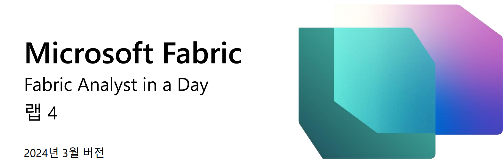
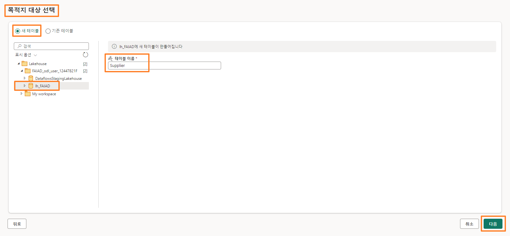
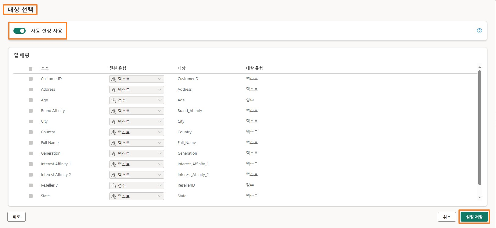

## 목차
- 서문	
- 데이터 흐름 2 세대	
  - 작업 1: Snowflake 쿼리를 데이터 흐름에 복사
  - 작업 2: Snowflake 에 대한 연결 만들기	
  - 작업 3: Supplier 및 PO 쿼리를 위한 데이터 대상 구성
  - 작업 4: Snowflake 데이터 흐름 이름 바꾸기 및 게시
  - 작업 5: Dataverse 쿼리를 데이터 흐름에 복사
  - 작업 6: Dataverse 에 대한 연결 만들기
  - 작업 7: Customer 쿼리를 위한 데이터 대상 만들기
  - 작업 8: Dataverse 데이터 흐름 이름 바꾸기 및 게시
  - 작업 9: SharePoint 쿼리를 데이터 흐름에 복사
  - 작업 10: SharePoint 연결 만들기
  - 작업 11: People 쿼리를 위한 데이터 대상 구성
  - 작업 12: SharePoint 데이터 흐름 이름 바꾸기 및 게시
- 참조	

## 서문

우리 시나리오에서 공급사 데이터는 Snowflake에 있고 고객 데이터는 Dataverse에 있으며 직원 데이터는 SharePoint에 있습니다. 이들 모든 데이터 원본은 서로 다른 시간에 업데이트됩니다. 데이터 흐름의 데이터 새로 고침 횟수를 최소화하기 위해 이들 각 데이터 원본에 대해 개별 데이터 흐름을 만들어보겠습니다.
참고: 단일 데이터 흐름에서는 복수의 데이터 원본이 지원됩니다. 이 랩을 마치면 다음 사항을 알게 됩니다.

- 데이터 흐름 2세대를 사용하여 Snowflake에 연결하고 Lakehouse에 데이터를 수집하는 방법

- 데이터 흐름 2세대를 사용하여 SharePoint에 연결하고 Lakehouse에 데이터를 수집하는 방법

- 데이터 흐름 2세대를 사용하여 Dataverse에 연결하고 Lakehouse에 데이터를 수집하는 방법

## 데이터 흐름 2세대

### 작업 1: Snowflake 쿼리를 데이터 흐름에 복사

1. 다시 랩 2, 작업 9에서 만든 Fabric 작업 영역, **FAIAD_<username>**(으)로 되돌아가 보겠습니다.

2. 메뉴에서 **새로 만들기 -> 데이터 흐름 2세대**를 선택합니다.

**데이터 흐름 페이지**로 이동됩니다. 이제 데이터 흐름에 익숙해졌으므로 **Power BI Desktop에서 데이터** 흐름으로 쿼리를 복사해 보겠습니다.
 
3. 아직 열지 않았다면 랩 환경의 **C:\FAIAD\Reports** 폴더에 있는 **FAIAD.pbix**를 엽니다.

4. 리본 메뉴에서 **홈 -> 데이터 변환**을 선택합니다. Power Query 창이 열립니다. 이전 랩에서 알아본 것 처럼 왼쪽 패널의 쿼리는 데이터 원본별로 구성됩니다.

5. Power Query 창이 열립니다. 왼쪽 패널의 SnowflakeData 폴더에서 다음 쿼리를 **Ctrl+선택**또는 Shift+선택합니다.

&nbsp; &nbsp; &nbsp; &nbsp; &nbsp;a.	SupplierCategories

&nbsp; &nbsp; &nbsp; &nbsp; &nbsp;b.	Suppliers

&nbsp; &nbsp; &nbsp; &nbsp; &nbsp;c.	Supplier

&nbsp; &nbsp; &nbsp; &nbsp; &nbsp;d.	PO

&nbsp; &nbsp; &nbsp; &nbsp; &nbsp;e.	PO Line Items

6. **마우스 우클릭**하고 **복사**를 선택합니다.

7. **브라우저**로 돌아갑니다.
8.**데이터 흐름 창에**서 **중앙 창**을 선택하고 **Ctrl+V**을 입력합니다(현재 마우스 우클릭 붙여넣기는 지원되지 않습니다). MAC 디자이스를 사용하는 경우 Cmd+V를 사용하여 붙여넣습니다.

**참고:** 랩 환경에서 작업하는 경우 화면 오른쪽 상단에 있는 줄임표를 선택합니다. 슬라이더를 사용하여 **VM 네이티브 클립보드**를 **활성화**합니다. 대화 상자에서 확인을 선택합니다. 쿼리 붙여넣기가 완료되면 이 옵션을 비활성화할 수 있습니다.
 
 

### 작업 2: Snowflake에 대한 연결 만들기

5개의 쿼리가 붙여넣기 되어 있고 이제 왼쪽에 쿼리 패널이 표시됩니다. Snowflake에 대해 생성된 연결이 없으므로 연결 구성을 요청하는 경고 메시지가 표시됩니다.

1. **연결 구성**을 선택합니다.

2. 데이터 원본에 연결 대화 상자가 열립니다. **연결** 드롭다운에서 **새 연결 만들기**가 선택되어 있는지 확인합니다.

3. **인증 종류**는 **Snowflake**여야 합니다.

4. 환경 변수 탭(랩 가이드 옆)에 있는 **Snowflake 사용자 이름 및 암호**를 입력합니다.

5. **연결**을 선택합니다.

 
 연결이 설정되고 미리보기 패널에서 데이터를 볼 수 있습니다. 쿼리의 적용된 단계를 자유롭게 탐색하세요. 기본적으로 Suppliers 쿼리에는 공급사의 상세 정보가 있으며 이름에서 알 수 있듯이SupplierCategories에는 공급사 범주가 있습니다. 이 두 테이블은 결합하여 필요한 열이 포함된 Supplier 차원을 생성합니다. 마찬가지로 PO Line Items을 PO와 병합하여 PO 팩트를 생성합니다. 이제 Supplier 및 PO 데이터를 Lakehouse에 수집해야 합니다.

6. 앞서 언급했듯이 우리는 이 데이터를 스테이징하지 않습니다. 따라서 쿼리 창에 있는
**Supplier** 쿼리를 **마우스 우클릭**하고 **스테이징 사용**을 선택하여 확인 표시를 제거합니다.

7. 마찬가지로 **PO** 쿼리를 마우스 우클릭합니다. **스테이징 사용**을 선택하여 확인 표시를 제거합니다.

**참고:** (쿼리를 복사해온)Power BI Desktop에서 로드 사용이 미사용으로 설정되어 있기 때문에 다른 세 가지 쿼리에 대해서는 스테이징을 스테이징 미사용을 할 필요가 없습니다.

### 작업 3: Supplier 및 PO 쿼리를 위한 데이터 대상 구성

1. **Supplier** 쿼리를 선택합니다.

2. 리본에서 **홈 -> 데이터 추가 대상 -> Lakehouse**를 선택합니다.

 
3. 데이터 대상에 연결 대화 상자가 열립니다. **연결 드롭다운에서 Lakehouse(없음)** 를 선택합니다.

4. **다음**을 선택합니다.

5. 대상 대상 선택 대화 상자가 열립니다. 새 테이블을 만드는 중이므로 **새 테이블 라디오 버튼**이 선택되어 있는지 확인합니다.

6. 앞서 만든 Lakehouse에 테이블을 만들고자 합니다. 왼쪽 패널에서 **Lakehouse -> FAIAD_<username>**(으)로 이동합니다.

7. **lh_FAIAD**를 선택합니다.

8. 테이블 이름을 **Supplier**로 둡니다.

9. **다음**을 선택합니다.

 
10. 대상 설정 선택 대화 상자가 열립니다. 이번에는 데이터가 완전히 업데이트되므로 자동 설정을 사용하겠습니다. 또한 필요에 따라 열 이름을 바꿉니다. **설정 저장**을 선택합니다.

11. **Power Query 창**으로 이동합니다. **오른쪽 하단**에서 데이터 대상이 **Lakehouse**로 설정된 것을 확인합니다. 마찬가지로 **PO 쿼리를 위한 데이터 대상을 설정**합니다. 완료되면  린샷과 같이 **데이터 대상을 Lakehouse**로 설정해야 합니다.

 
### 작업 4: Snowflake 데이터 흐름 이름 바꾸기 및 게시

1. 화면 상단에서 **데이터 흐름 2 옆에 있는 화살표**를 선택하여 이름을 바꿉니다.

2. 대화 상자에서 이름을 **df_Supplier_Snowflake**로 변경합니다.

3. 이름 변경 사항을 저장하려면 **Enter**를 클릭합니다.

4. 오른쪽 하단에서 **게시**를 선택합니다.

**FAIAD_<username> 작업 영역**으로 되돌아갑니다. 데이터 흐름이 게시되는 데 몇 분 정도 걸릴 수 있습니다. 이제 Dataverse에서 데이터를 가져오는 데이터 흐름을 만들어 보겠습니다.
 
### 작업 5: Dataverse 쿼리를 데이터 흐름에 복사

1. 메뉴에서 **새로 만들기 -> 데이터 흐름 2세대**를 선택합니다.

**데이터 흐름 페이지**로 이동됩니다. 이제 데이터 흐름에 익숙해졌으므로 Power BI Desktop에서 데이터 흐름으로 쿼리를 복사해 보겠습니다.

2. 아직 열지 않았다면 랩 환경의 **C:\FAIAD\Reports** 폴더에 있는 **FAIAD.pbix**를 엽니다.

3. 리본 메뉴에서 **홈 -> 데이터 변환**을 선택합니다. Power Query 창이 열립니다. 이전 랩에서 알아본 것 처럼 왼쪽 패널의 쿼리는 데이터 원본별로 구성됩니다.

4. Power Query 창이 열립니다. 왼쪽 패널, DataverseData 폴더에서 다음 쿼리를
**Ctrl+선택**합니다.

&nbsp; &nbsp; &nbsp; &nbsp; &nbsp;a.	BabyBoomer

&nbsp; &nbsp; &nbsp; &nbsp; &nbsp;b.	GenX

&nbsp; &nbsp; &nbsp; &nbsp; &nbsp;c.	GenY

&nbsp; &nbsp; &nbsp; &nbsp; &nbsp;d.	GenZ

&nbsp; &nbsp; &nbsp; &nbsp; &nbsp;e.	Customer

5. **마우스 우클릭**하고 **복사**를 선택합니다.

 
6. 브라우저에서 **데이터 흐름 페이지**로 다시 이동합니다.

7. **데이터 흐름 창**에서 **Ctrl+V**를 입력합니다(현재 마우스 우클릭 붙여넣기는 지원되지 않습니다). MAC 디자이스를 사용하는 경우 Cmd+V를 사용하여 붙여넣습니다.

**참고:** 랩 환경에서 작업하는 경우 화면 오른쪽 상단에 있는 줄임표를 선택합니다. 슬라이더를 사용하여 **VM 네이티브 클립보드**를 **활성화**합니다. 대화 상자에서 확인을 선택합니다. 쿼리 붙여넣기가 완료되면 이 옵션을 비활성화할 수 있습니다.

### 작업 6: Dataverse에 대한 연결 만들기

5개의 쿼리가 붙여넣기 되어 있고 이제 왼쪽에 쿼리 패널이 표시됩니다. Dataverse에 대해 생성된 연결이 없으므로 연결 구성을 요청하는 경고 메시지가 표시됩니다.

1. **연결 구성**을 선택합니다.

2. 데이터 원본에 연결 대화 상자가 열립니다. **연결 드롭다운**에서 **새 연결 만들기**가 **선택**되어 있는지 확인합니다.

3. **인증 종류는 조직 계정**이어야 합니다.

4. **연결**을 선택합니다.

 
### 작업 7: Customer 쿼리를 위한 데이터 대상 만들기

연결이 설정되고 미리보기 패널에서 데이터를 볼 수 있습니다. 쿼리의 적용된 단계를 자유롭게 탐색하세요. 고객 데이터는 BabyBoomer,GenX, GenY, 및 GenZ 카테고리별로 제공됩니다. 이 네 가지 쿼리는 Customer 쿼리를 만들기 위해 추가됩니다. 이제 고객 데이터를 Lakehouse에 수집해야 합니다.

1. 앞서 언급했듯이 우리는 이 데이터를 스테이징하지 않습니다. 따라서 쿼리 창에 있는 **Customer** 쿼리를 **마우스 우클릭**하고 **스테이징 사용**을 선택하여 확인 표시를 제거합니다.

2. **Customer** 쿼리를 선택합니다.

3. 리본에서 **홈 -> 데이터 추가 대상 -> Lakehouse**를 선택합니다.

4. 데이터 대상에 연결 대화 상자가 열립니다. **연결 드롭다운**에서 **Lakehouse(없음)** 를 선택합니다.

5. **다음**을 선택합니다.

 
 
6. 대상 대상 선택 대화 상자가 열립니다. 새 테이블을 만드는 중이므로 **새 테이블 라디오 버튼**이 선택되어 있는지 확인합니다.

7. 앞서 만든 Lakehouse에 테이블을 만들고자 합니다. 왼쪽 패널에서 **Lakehouse -> FAIAD_<username>**(으)로 이동합니다.

8. **lh_FAIAD**를 선택합니다.

9. 테이블 이름을 **Customer**으로 둡니다.

10. **다음**을 선택합니다.

11. 대상 설정 선택 대화 상자가 열립니다. 이번에는 데이터가 완전히 업데이트되므로 자동 설정을 사용하겠습니다. 또한 필요에 따라 열 이름을 바꿉니다. **설정 저장**을 선택합니다.

### 작업 8: Dataverse 데이터 흐름 이름 바꾸기 및 게시

1. **Power Query 창**으로 이동합니다. **오른쪽 하단**에서 **데이터 대상**이 **Lakehouse**로 설정된 것을 확인합니다.

2. 오른쪽 하단에서 **게시**를 선택합니다.

**참고: FAIAD_<username> 작업 영역**으로 되돌아갑니다. 데이터 흐름이 게시되는 데 몇 분 정도 걸릴 수 있습니다.
 
3. 데이터 흐름 2가 작업 중인 데이터 흐름입니다. 계속하기 전에 이름을 바꿔 보겠습니다. Dataflow 2 옆에 있는 **줄임표(...)** 를 클릭합니다. **속성**을 클릭합니다.

4. 데이터 흐름 속성 대화 상자가 열립니다. **이름**을 **df_Customer_Dataverse**로 변경합니다.

5. **설명** 텍스트 상자에서 **Dataverse에서 Lakehouse로 고객 데이터를 수집하는 데이터 흐름**을 추가합니다.

6. **저장**을 선택합니다.

**FAIAD_<username> 작업 영역**으로 되돌아갑니다. 이제 SharePoint에서 데이터를 가져오는 데이터 흐름을 만들어 보겠습니다.
 
### 작업 9: SharePoint 쿼리를 데이터 흐름에 복사

1. 메뉴에서 **새로 만들기 -> 데이터 흐름 2세대**를 선택합니다.

**데이터 흐름 페이지**로 이동됩니다. 이제 데이터 흐름에 익숙해졌으므로 Power BI Desktop에서 데이터 흐름으로 쿼리를 복사해 보겠습니다.

2. 아직 열지 않았다면 랩 환경의 **C:\FAIAD\Reports** 폴더에 있는 **FAIAD.pbix**를 엽니다.

3. 리본 메뉴에서 **홈 -> 데이터 변환**을 선택합니다. Power Query 창이 열립니다. 이전 랩에서 알아본 것 처럼 왼쪽 패널의 쿼리는 데이터 원본별로 구성됩니다.

4. Power Query 창이 열립니다. 왼쪽 패널의 SharepointData 폴더에서 **People** 쿼리를
**선택**합니다.

5. **마우스 우클릭**하고 **복사**를 선택합니다.

 
 
6. 브라우저에서 **데이터 흐름 화면**으로 다시 이동합니다.

7. **데이터 흐름 창**에서 **Ctrl+V**를 입력합니다(현재 마우스 우클릭 붙여넣기는 지원되지 않습니다).

**참고:** 랩 환경에서 작업하는 경우 화면 오른쪽 상단에 있는 줄임표를 선택합니다. 슬라이더를 사용하여 **VM 네이티브 클립보드**를 **활성화**합니다. 대화 상자에서 확인을 선택합니다. 쿼리 붙여넣기가 완료되면 이 옵션을 비활성화할 수 있습니다.

붙여넣은 쿼리가 왼쪽 패널에 있는지 확인합니다. SharePoint에 대해 생성된 연결이 없으므로 연결 구성을 요청하는 경고 메시지가 표시됩니다.
 
### 작업 10: SharePoint 연결 만들기

1. **연결 구성**을 선택합니다.

2. 데이터 원본에 연결 대화 상자가 열립니다. **연결** 드롭다운에서 **새 연결 만들기**가 선택되어 있는지 확인합니다.

3. **인증 종류는 조직 계정**이어야 합니다.

4. **연결**을 선택합니다.

 
### 작업 11: People 쿼리를 위한 데이터 대상 구성

연결이 설정되고 미리보기 패널에서 데이터를 볼 수 있습니다. 쿼리의 적용된 단계를 자유롭게 탐색하세요. 이제 People 데이터를 Lakehouse에 수집해야 합니다.

1. 앞서 언급했듯이 우리는 이 데이터를 스테이징하지 않습니다. 따라서 쿼리 창에 있는**People** 쿼리를 **마우스 우클릭**하고 **스테이징 사용**을 선택하여 확인 표시를 제거합니다.

2. **People** 쿼리를 선택합니다.

3. 리본에서 **홈 -> 데이터 추가 대상 -> Lakehouse**를 선택합니다.

4. 데이터 대상에 연결 대화 상자가 열립니다. **연결 드롭다운**에서 **Lakehouse(없음)** 를 선택합니다.

5. **다음**을 선택합니다.

 
6. 대상 대상 선택 대화 상자가 열립니다. 새 테이블을 만드는 중이므로 **새 테이블 라디오 버튼**이 선택되어 있는지 확인합니다.

7. 앞서 만든 Lakehouse에 테이블을 만들고자 합니다. 왼쪽 패널에서 **Lakehouse -> FAIAD_<username>**(으)로 이동합니다.

8. **lh_FAIAD**를 선택합니다.

9. 테이블 이름을 **People**으로 둡니다.

10. **다음**을 선택합니다.

 
11. 대상 설정 선택 대화 상자가 열립니다. 이번에는 데이터가 완전히 업데이트되므로 자동 설정을 사용하겠습니다. 또한 필요에 따라 열 이름을 바꿉니다. **설정 저장**을 선택합니다.

### 작업 12: SharePoint 데이터 흐름 이름 바꾸기 및 게시

1. **Power Query 창**으로 이동합니다. **오른쪽 하단**에서 데이터 대상이 **Lakehouse**로 설정된 것을 확인합니다.

2. 오른쪽 하단에서 **게시**를 선택합니다.

**참고: FAIAD_<username> 작업 영역**으로 되돌아갑니다. 데이터 흐름이 게시되는 데 몇 분 정도 걸릴 수 있습니다.
 
3. 데이터 흐름 2가 작업 중인 데이터 흐름입니다. 계속하기 전에 이름을 바꿔 보겠습니다. Dataflow 2 옆에 있는 **줄임표(...)** 를 클릭합니다. **속성**을 클릭합니다.

4. 데이터 흐름 속성 대화 상자가 열립니다. **이름을 df_People_SharePoint**로 변경합니다.

5. **설명** 텍스트 상자에서 **SharePoint에서 Lakehouse로 People 데이터를 수집하는 데이터 흐름**을 추가합니다.

6. **저장**을 선택합니다.

  
**FAIAD_<username> 작업 영역**으로 되돌아갑니다. 이제 모든 데이터가 Lakehouse에 수집되었습니다. 다음 랩에서는 데이터 흐름 새로 고침을 예약하겠습니다.
 
## 참조

Fabric Analyst in a Day(FAIAD)는 Microsoft Fabric에서 사용할 수 있는 몇 가지 주요 기능을 소개합니다. 서비스의 메뉴에 있는 도움말(?) 섹션에는 유용한 리소스로 연결되는 링크가 있습니다.

아래는 Microsoft Fabric의 다음 단계에 도움이 되는 몇 가지 추가 자료입니다.
- [Microsoft Fabric GA 발표](https://aka.ms/Fabric-Hero-Blog-Ignite23) 전문을 블로그 포스트로 읽기
- [가이드 투어](https://aka.ms/Fabric-GuidedTour)로 Fabric 탐색
- [Microsoft Fabric 무료 평가판](https://aka.ms/try-fabric) 신청
- [Microsoft Fabric 웹사이트](https://aka.ms/microsoft-fabric) 방문
- [Fabric 학습 모듈](https://aka.ms/learn-fabric)을 탐색해서 새로운 기술 익히기
- [Fabric 기술 문서](https://aka.ms/fabric-docs) 검토
- [Fabric 시작하기 무료 e북](https://aka.ms/fabric-get-started-ebook) 읽기
- [Fabric 커뮤니티](https://aka.ms/fabric-community)에 가입하여 질문을 게시하고 피드백을 공유하며 다른 사람들로부터 배우기
 
더 많은 심층 Fabric 환경 발표 블로그 포스트 읽기:
- [Fabric 블로그의 Data Factory 환경](https://aka.ms/Fabric-Data-Factory-Blog)
- [Fabric 블로그의 Synapse Data Engineering 환경](https://aka.ms/Fabric-DE-Blog)
- [Fabric 블로그의 Synapse Data Science 환경](https://aka.ms/Fabric-DS-Blog)
- [Fabric 블로그의 Synapse Data Warehousing 환경](https://aka.ms/Fabric-DW-Blog)
- [Fabric 블로그의 Synapse Real-Time Analytics 환경](https://aka.ms/Fabric-RTA-Blog)
- [Power BI 발표 블로그](https://aka.ms/Fabric-PBI-Blog)
- [Fabric 블로그의 Data Activator 환경](https://aka.ms/Fabric-DA-Blog)
- [Fabric 블로그의 관리 및 거버넌스](https://aka.ms/Fabric-Admin-Gov-Blog)
- [Fabric 블로그의 OneLake](https://aka.ms/Fabric-OneLake-Blog)
- [Dataverse 및 Microsoft Fabric 통합 블로그](https://aka.ms/Dataverse-Fabric-Blog)

© 2023 Microsoft Corporation. All rights reserved.
이 데모/랩을 사용하면 다음 조건에 동의하게 됩니다.
이 데모/랩에 설명된 기술/기능은 학습 환경을 제공하고 사용자 의견을 얻기 위해 Microsoft Corporation에서 제공합니다. 데모/랩을 통해서만 이러한 기술적 특성과 기능을 평가하고 사용자 의견을 Microsoft에 제시할 수 있습니다. 다른 용도로는 사용할 수 없습니다. 이 데모/랩 또는 그 일부에 대해 수정, 복사, 배포, 전송, 표시, 수행, 재현, 게시, 라이선스 허여, 파생 작업 생성, 양도 또는 판매할 수 없습니다.
추가 복제 또는 재배포를 위한 다른 서버 또는 위치에 대한 데모/랩(또는 그 일부)의 복사 또는 재현은 명시적으로 금지됩니다.
이 데모/랩은 위에서 명시한 목적을 위해 복잡한 설정 또는 설치가 없는 시뮬레이션된 환경에서 잠재적인 새로운 기능과 개념을 포함하여 특정 소프트웨어 기술/제품의 특성 및 기능을 제공합니다. 이 데모/랩에서 서술된 기술/개념은 전체 기능을 나타내지 않을 수 있으며, 최종 버전이 작동하지 않을 수도 있습니다. 또한 해당 기능 또는 개념의 최종
버전을 릴리스하지 않을 수도 있습니다. 또한 실제 환경에서 이러한 특성과 기능을 사용한 경험이 다를 수도 있습니다.
 
피드백. 이 데모/랩에서 서술된 기술적 특성, 기능 및/또는 개념에 대한 사용자 의견을
Microsoft에 제시하면 Microsoft는 이 사용자 의견을 어떤 방식과 목적으로든 무료로 사용, 공유 및 상용화할 수 있습니다. 또한 제품, 기술 및 서비스에서 사용자 의견이 포함된
Microsoft 소프트웨어 또는 서비스의 특정 부분을 사용하거나 인터페이스하는 데 필요한 모든 특허권을 제3자에게 무료로 제공합니다. Microsoft에서 사용자 의견을 포함하기 때문에 Microsoft에서 해당 소프트웨어 또는 설명서의 사용을 인가해야 하는 라이선스에 종속된 사용자 의견은 제공할 수 없습니다. 이러한 권리는 본 계약에 의거하여 유효합니다.
Microsoft Corporation은 이에 따라 명시적, 묵시적 또는 법적 특정 목적에의 적합성, 권리 및 비침해 여부에 관계없이 모든 보증과 조건을 포함하여 데모/랩과 관련된 모든 보증 및 조건을 부인합니다. Microsoft는 어떤 목적으로든 결과의 정확성, 데모/랩의 사용으로 파생된 출력 또는 데모/랩에 포함된 정보의 적합성과 관련하여 어떠한 보증이나 진술도 하지 않습니다.
고지 사항
이 데모/랩에는 Microsoft Power BI의 새로운 기능 및 향상된 기능 중 일부만 포함되어 있습니다. 일부 기능은 제품의 향후 릴리스에서 변경될 수 있습니다. 이 데모/랩에서는 새로운 기능 모두가 아닌 일부에 대해 학습하게 됩니다.

