## 목차

- 서문

- Dataflow Gen2

    - 작업 1: 매출 데이터 흐름에 대한 예약된 새로 고침 구성

    - 작업 2: Supplier 및 고객 데이터 흐름에 대한 예약된 새로 고침 구성	

- 데이터 파이프라인

    - 작업 3: 데이터 파이프라인 생성

    - 작업 4: 간단한 데이터 파이프라인 구축

    - 작업 5: 새 데이터 파이프라인 생성

    - 작업 6: Until 작업 만들기

    - 작업 7: 변수 만들기

    - 작업 8: Until 작업 구성

    - 작업 9: 데이터 흐름 작업 구성

    - 작업 10: 첫 번째 변수 설정 활동 구성

    - 작업 11: 두 번째 변수 설정 활동 구성

    - 작업 12: 세 번째 변수 설정 활동 구성

    - 작업 13: 대기 작업 구성

    - 작업 14: 데이터 파이프라인에 대한 예약 새로 고침 구성

- 참조

## 서문

우리는 다양한 데이터 원본의 데이터를 Lakehouse로 수집했습니다. 본 랩에서는 데이터 원본에 대한 새로 고침 일정을 설정합니다. 요구 사항을 요약하면 다음과 같습니다.

- **매출 데이터:** ADLS에서 매일 정오/오후 12시에 업데이트됩니다.

- **공급사 데이터:** Snowflake에서 매일 자정/오전 12시에 업데이트됩니다.

- **고객 데이터:** Dataverse에서 항상 최신 상태로 유지됩니다. 하루에 네 번, 자정/오전
12시, 오전 6시, 정오/오후 12시, 오후 6시에 새로 고쳐야 합니다.

- **직원 데이터:** SharePoint에서 매일 오전 9시에 업데이트됩니다. 그러나 때로는 5~15분 정도 지연되는 경우도 있습니다. 이에 대응하려면 새로 고침 일정을 만들어야 합니다.

이 랩을 마치면 다음 사항을 알게 됩니다.

- Dataflow Gen2의 예정된 새로 고침을 구성하는 방법

- 데이터 파이프라인을 만드는 방법

- 데이터 파이프라인의 예정된 새로 고침을 구성하는 방법

## Dataflow Gen2

### 작업 1: 매출 데이터 흐름에 대한 예약된 새로 고침 구성

먼저 매출 데이터 흐름의 예약된 새로 고침을 구성해 보겠습니다.

1.	다시 랩 2, 작업 9에서 만든 Fabric 작업 영역 **FAIAD_<username>**(으)로 되돌아가 보겠습니다.

2.	생성한 모든 아티팩트가 여기에 나열됩니다. 화면 오른쪽에 있는 **검색 창에 df**를 입력합니다. 그러면 아티팩트가 데이터 흐름으로 필터링됩니다.

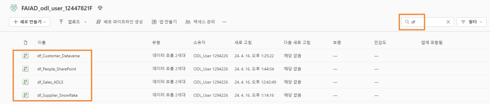

3.	마우스를 **df_Sales_ADLS** 열로 가져갑니다. 익숙한 **새로 고침 및 새로 고침 예약 아이콘**을 사용할 수 있습니다. **줄임표**를 선택합니다.
 
4.	데이터 흐름을 삭제, 편집, 내보내기할 수 있는 옵션이 있습니다. 속성을 사용하여 데이터 흐름의 이름과 설명을 업데이트할 수 있습니다. 곧 새로 고침 기록을 살펴보겠습니다. **설정**을 선택합니다.

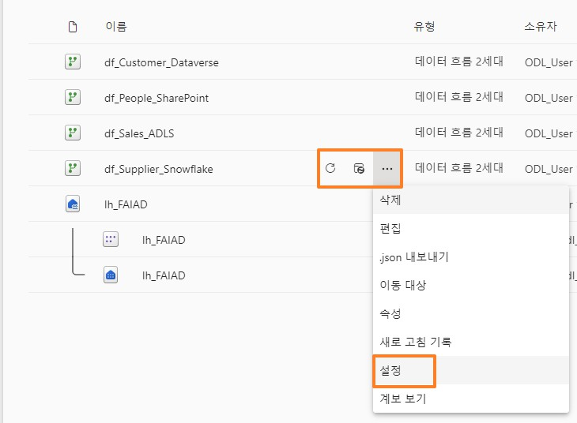

**참고:** 설정 페이지가 열립니다. 왼쪽 패널에는 나열된 모든 데이터 흐름이 있습니다.

5.	가운데 창에서 **새로 고침 기록** 링크를 선택합니다.

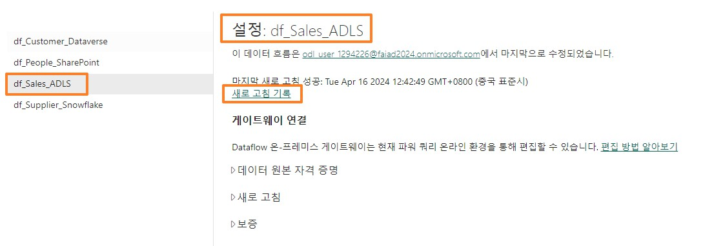

6.	기록 새로 고침 대화 상자가 열립니다. 몇 가지 새로 고침이 나열됩니다. 이는 데이터 흐름이 게시될 때 발생한 새로 고침입니다. **시작 시간** 링크를 선택합니다.

**참고:** 시작 시간은 상황에 따라 다릅니다.

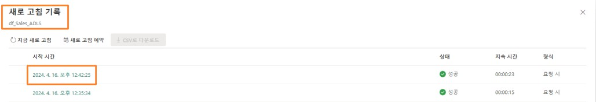

    상세 정보 화면이 열립니다. 그러면 새로 고침에 대한 상세 정보가 제공되며 시작, 종료 시간 및 기간이 나열됩니다. 또한 새로 고침된 테이블/활동도 나열됩니다. 오류가 있는 경우 테이블/활동 이름을 클릭하여 추가 조사를 할 수 있습니다.

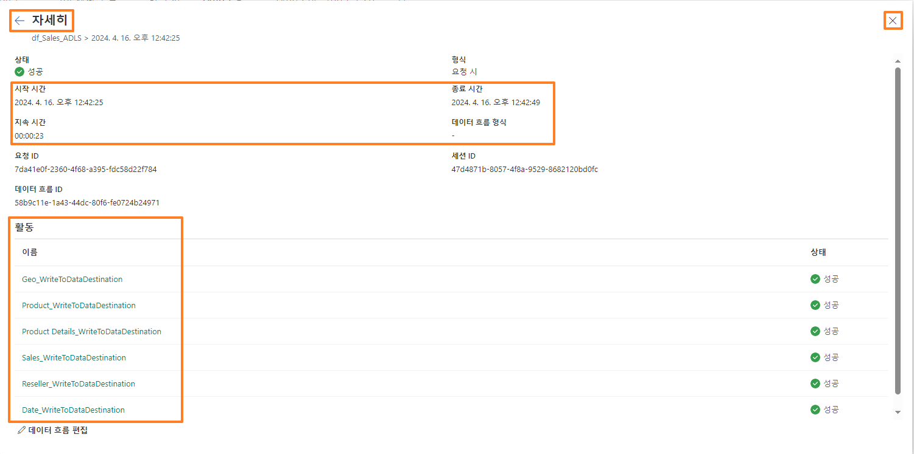

7.	오른쪽 상단에서 **X**를 클릭하면 화면이 닫힙니다. **데이터 흐름 설정 페이지**로 되돌아갑니다.

8.	게이트웨이 연결에서 **데이터 원본 자격 증명**을 확장합니다. 데이터 흐름에 사용된 연결 목록이 표시됩니다. 이 경우에는 Lakehouse와 ADLS가 있습니다.

    a.	**Lakehouse:** 이는 데이터 흐름에서 데이터를 수집하기 위한 연결입니다.

    b.	**ADLS:** 이는 ADLS 원본 데이터에 대한 연결입니다.

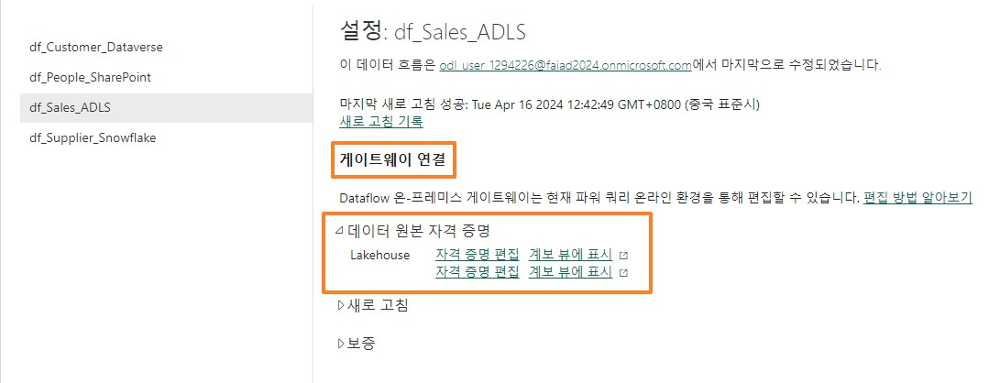

9.	**새로 고침**을 확장합니다.

10.	**새로 고침 일정** 구성 슬라이더를 **켜기**로 설정합니다.

11.	**새로 고침 빈도 드롭다운**을 **매일**로 설정합니다. 매주로 설정할 수 있는 옵션도 있습니다.
 
12.	**시간대**를 원하는 시간대로 설정합니다.

**참고:** 이는 랩 환경이므로 시간대를 원하는 시간대로 설정할 수 있습니다. 실제 시나리오에서는 사용자/데이터 원본 위치를 기반으로 시간대를 설정하게 됩니다.

13.	**다른 시간 추가** 링크를 클릭합니다. **시간** 옵션이 표시됩니다.

14.	**시간**을 **정오**로 설정합니다. 1시간마다 또는 30분마다 새로 고침을 설정할 수 있습니다.

15.	이 설정을 저장하려면 **적용** 을 선택합니다.

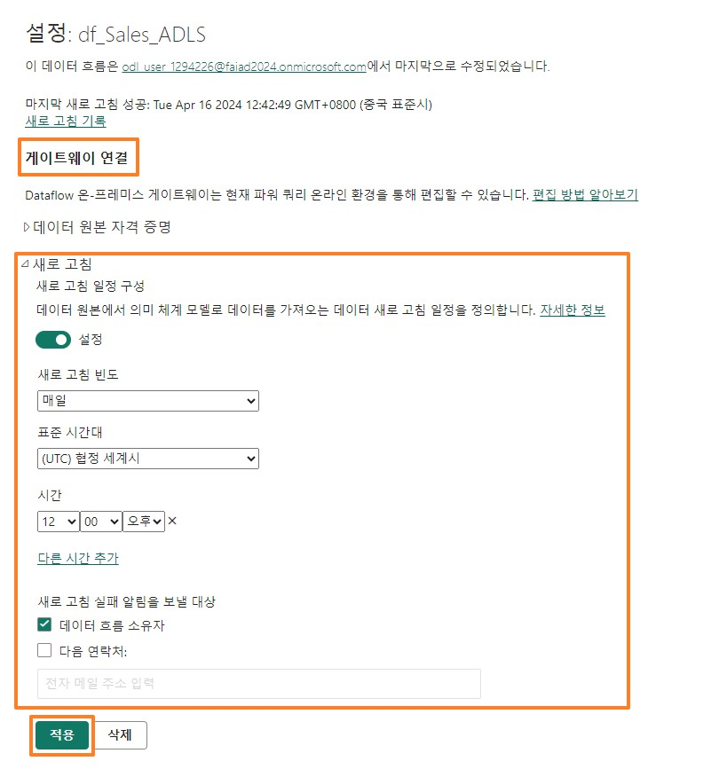

**참고:** 다른 시간 추가 링크를 클릭하면 새로 고침 시간을 여러 개 추가할 수 있습니다. 데이터 흐름 소유자 및 기타 연락처에게 실패 알림을 보낼 수도 있습니다.
 
### 작업 2: Supplier 및 고객 데이터 흐름에 대한 예약된 새로 고침 구성

1.	왼쪽 패널에서 **df_Supplier_Snowflake**을 선택합니다.

2.	**매일 자정/오전 12시**에 새로 고침되도록 새로 고침 일정을 구성합니다.

3.	이 설정을 저장하려면 **적용**을 선택합니다.

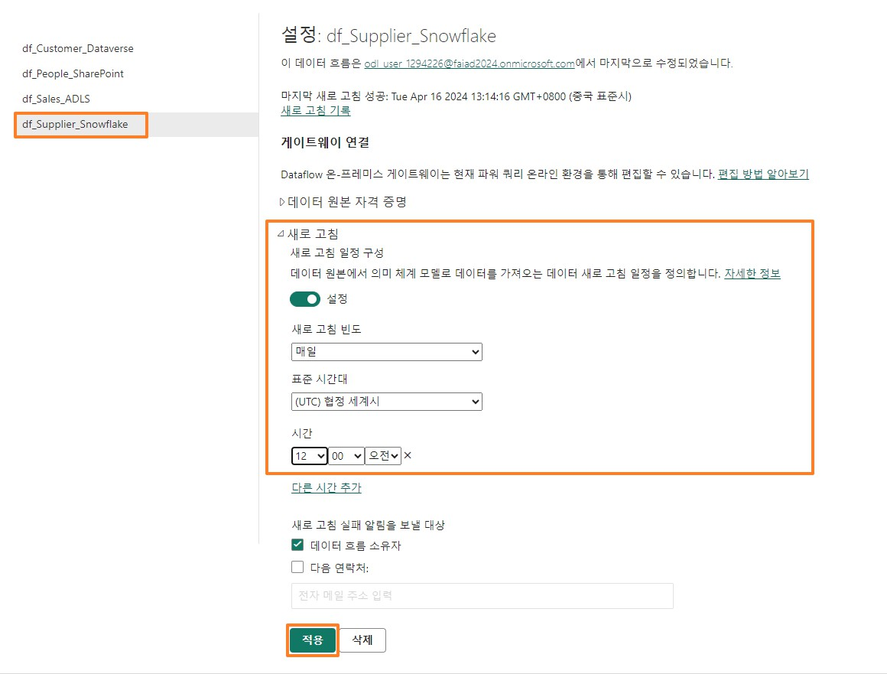

4.	왼쪽 패널에서 **df_Customer_Dataverse**를 선택합니다.

5.	하루에 네 번, **자정/오전 12시, 오전 6시, 정오/오후 12시, 오후 6시**에 새로 고침되도록 새로 고침 일정을 구성합니다.

6.	이 설정을 저장하려면 **적용**을 선택합니다.

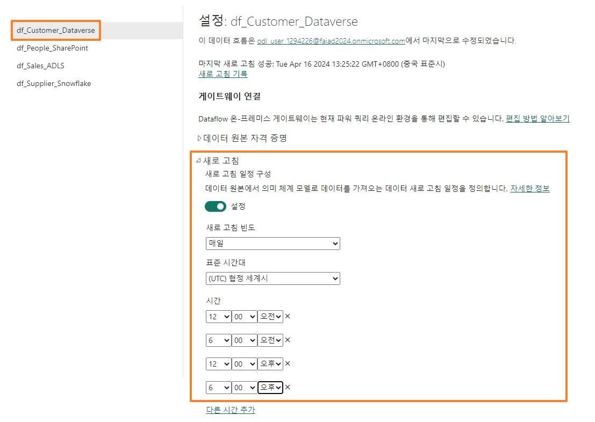 
 
앞서 언급했듯이 SharePoint의 직원 파일이 제때에 전달되지 않는 경우에 대응하기 위한 사용자 정의 로직을 구축해야 합니다. 데이터 파이프라인을 사용하여 이 문제를 해결해 보겠습니다.
 
## 데이터 파이프라인

### 작업 3: 데이터 파이프라인 생성

1.	화면 왼쪽 아래에 있는 **Fabric 환경 선택기** 아이콘을 선택합니다.

2.	Microsoft Fabric 대화 상자가 열립니다. **Data Factory**를 선택합니다. Data Factory 홈 페이지로 이동됩니다.

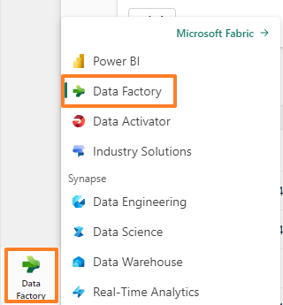

3.	상단 패널에서 **데이터 파이프라인**을 선택하여 새 파이프라인을 만듭니다.

4.	새 파이프라인 대화 상자가 열립니다. 파이프라인 이름을 **pl_Refresh_People_SharePoint**로 지정합니다.

5.	**만들기**를 선택합니다.

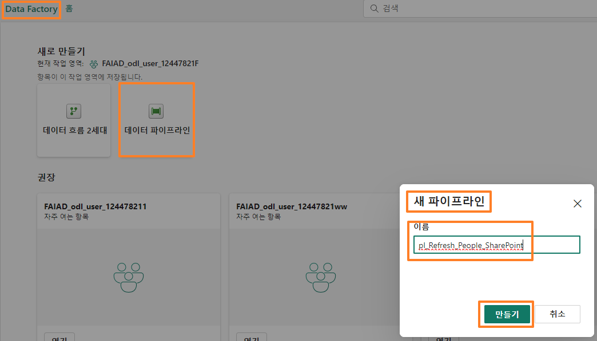
 
**데이터 파이프라인 페이지**로 **이동되었습니다**. Azure Data Factory를 사용해 본 적이 있다면 이 화면이 익숙할 것입니다. 레이아웃에 대한 간략한 개요를 살펴보겠습니다.

현재 **홈** 화면에 있습니다. 상단 메뉴를 보면 일반적으로 사용되는 활동을 추가하는 옵션(파이프라인 유효성 검사 및 실행, 실행 기록 보기)을 찾을 수 있습니다. 또한 가운데 창에는 파이프라인 구축을 시작하는 빠른 옵션이 있습니다.

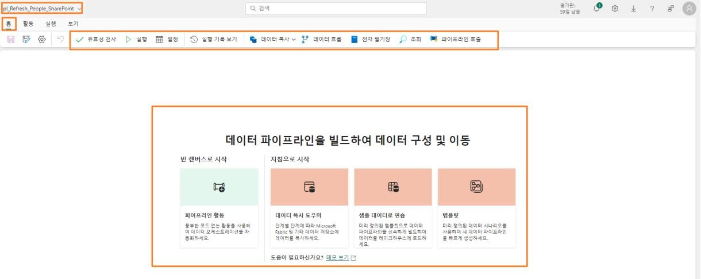

6.	상단 메뉴에서 **활동**을 선택합니다. 이제 메뉴에서 일반적으로 사용되는 활동 목록을 찾을 수 있습니다.

7.	사용 가능한 다른 모든 활동을 보려면 메뉴 오른쪽의 **줄임표(…)** 를 선택합니다. 랩에서 이러한 활동 중 몇 가지를 사용할 것입니다.

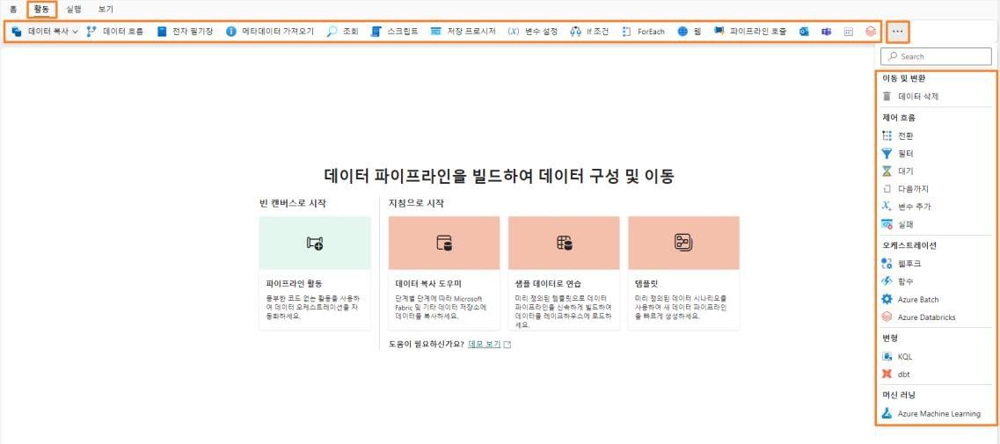

8.	상단 메뉴에서 **실행**을 클릭합니다. 파이프라인 실행하고 예약하는 옵션을 찾을
수 있습니다. 실행 기록 보기를 사용하여 실행 기록을 보는 옵션도 찾을 수 있습니다.

9.	상단 메뉴에서 **보기**를 선택합니다. 여기서는 JSON 형식으로 코드를 볼 수 있는 옵션을 찾을 수 있습니다. 활동 형식을 지정하는 옵션도 있습니다.

 **참고:** 랩을 마치고 JSON 배경 지식이 있으면 JSON 코드 보기를 자유롭게 선택할 수 있습니다. 여기에서는 디자인 보기를 사용하여 수행하는 모든 오케스트레이션이 JSON으로도 작성될 수 있음을 알 수 있습니다.

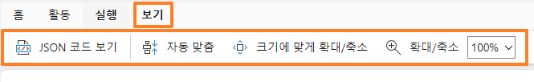

## 작업 4: 간단한 데이터 파이프라인 구축

파이프라인 구축을 시작해 보겠습니다. 데이터 흐름을 새로 고치려면 활동이 필요합니다. 우리가 사용할 수 있는 활동을 찾아보겠습니다.

1.	상단 메뉴에서 **활동 -> 데이터 흐름**을 선택합니다. 데이터 흐름 활동이 중앙 설계 창에 추가됩니다. 하단 창에 데이터 흐름 활동의 구성 옵션이 있습니다.

2.	df_People_SharePoint 활동에 연결하도록 활동을 구성하겠습니다. **하단 창**에서 **설정**을 선택합니다.

3.	**작업 영역**이 Fabric 작업 영역 **FAIAD_<username>**(으)로 설정되어 있는지 확인합니다.

4.	**데이터 흐름 드롭다운에서 df_People_SharePoint**를 선택합니다. 이 데이터 흐름 활동이 실행되면 **df_People_SharePoint가 새로 고침됩니다**. 참 쉽죠? ●¨v

**참고:** 알림 옵션은 현재 회색으로 표시되어 있습니다. 이 기능은 곧 활성화될 예정입니다. 이 활동의성공 및 실패에 대한 알림을 구성할 수 있습니다.
우리 시나리오에서는 직원 데이터가 일정에 따라 업데이트되지 않습니다. 때로는 지연이 있습니다. 우리가 이런 상황에 대응할 수 있는지 알아보겠습니다.

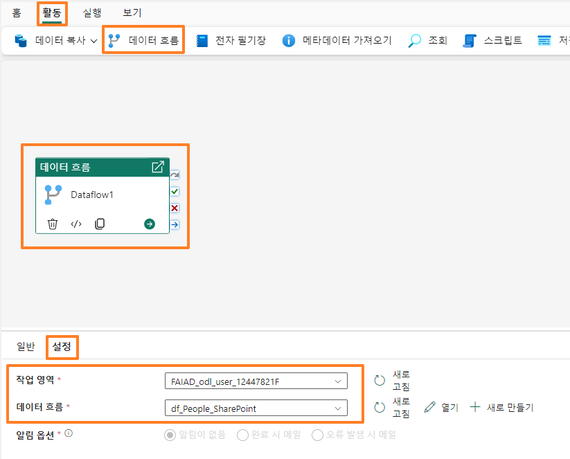
 
 
5.	**하단 창**에서 **일반**을 선택합니다. 활동에 이름과 설명을 지정해 보겠습니다.

6.	**이름** 필드에 **dfactivity_People_SharePoint**를 입력합니다.

7.	**설명** 필드에 **df_People_Sharepoint 데이터 흐름을 새로 고치는 데이터 흐름 활동**을 입력합니다.

8.	활동을 비활성화하는 옵션이 있습니다. 이 기능은 테스트 또는 디버깅 중에 유용합니다 **활성화됨** 상태로 둡니다.

9.	**시간 초과**를 설정하는 옵션이 있습니다. **기본값**을 그대로 두겠습니다. 그러면 데이터 흐름을 새로 고치는 데 충분한 시간이 될 것입니다.

**참고:** 일정에 따라 데이터를 사용할 수 없는 경우 10분마다 3번씩 활동이 다시 실행되도록 설정해 보겠습니다. 세 번째 시도에서도 실패하면 실패를 보고합니다.

10.	**다시 시도**를 **3회**로 설정합니다.

11.	**고급** 섹션을 확장합니다.

12.	**다시 시도 간격(초)**을 **600초**로 설정합니다.

13.	메뉴에서 **홈 -> 저장** 아이콘을 선택하여 파이프라인을 저장합니다.

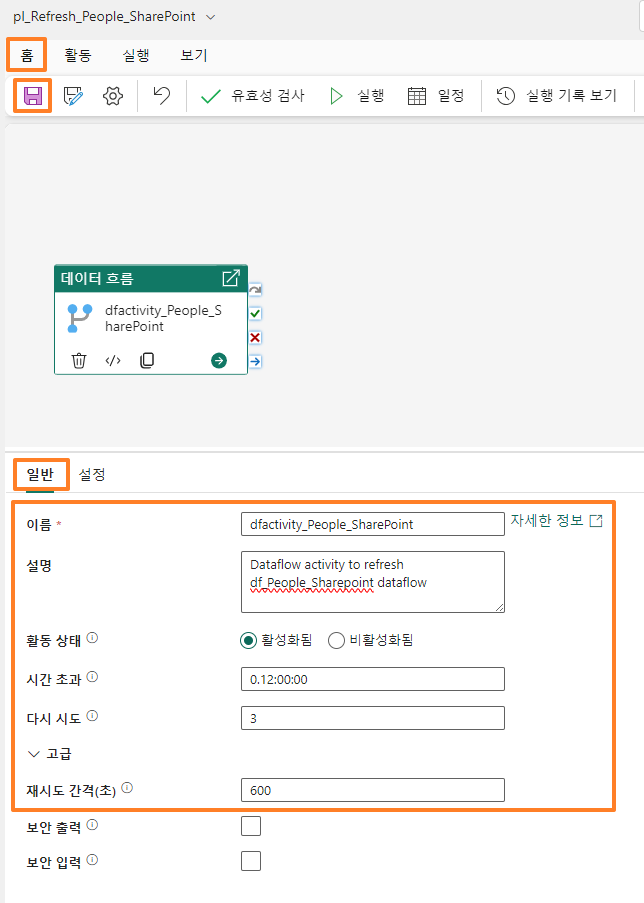
 
(이전 데이터 흐름에서 했던 것처럼) 예약된 새로 고침 시 데이터 흐름을 설정하는 것과 비교하여 데이터 파이프라인을 사용하면 다음과 같은 이점이 있습니다.

- 파이프라인은 새로 고침이 실패하기 전에 여러 번 재시도할 수 있는 옵션을 제공합니다.

- 파이프라인은 몇 초 내에 새로 고침하는 기능을 제공하는 반면, 데이터 흐름에서는 예약된 새로 고침이 30분마다 수행됩니다.

### 작업 5: 새 데이터 파이프라인 생성

시나리오에 좀 더 복잡함을 추가해 보겠습니다. 오전 9시에 데이터를 사용할 수 없는 경우 일반적으로 5분 이내에 데이터를 사용할 수 있다는 것을 확인했습니다. 해당 기간을 놓친 경우 파일을 사용할 수 있을 때까지 15분이 소요됩니다. 재시도를 5분과 15분으로 예약하려고 합니다. 새로운 데이터 파이프라인을 생성하여 이를 어떻게 달성할 수 있는지 살펴보겠습니다.

1.	왼쪽 패널에서 **FAIAD_<username>**을(를) 클릭하여 작업 영역 홈으로 이동합니다.

2.	상단 메뉴에서 **새로 만들기**를 클릭하고 **드롭다운**에서 **데이터 파이프라인**을 클릭합니다.
 
3.	새 파이프라인 대화 상자가 열립니다. 파이프라인 **이름**을 **pl_Refresh_People_SharePoint_Option2**로 지정합니다.

4.	**만들기**를 선택합니다.

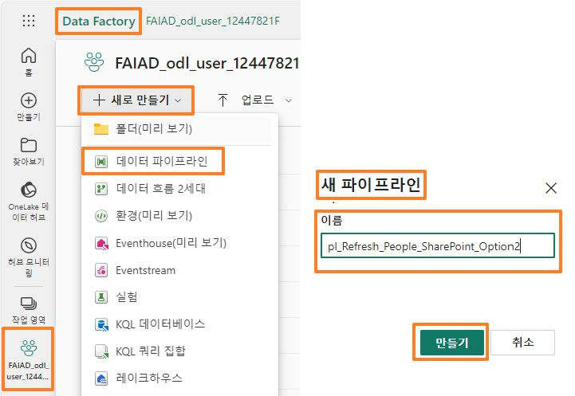

### 작업 6: Until 작업 만들기

1.	데이터 파이프라인 화면으로 이동합니다. 메뉴에서 **활동**을 선택합니다.

2.	오른쪽에서 **줄임표(...)** 를 클릭합니다.

3.	활동 목록에서 **Until(다음까지)** 을 클릭합니다.

**Until:** 이는 특정 조건이 만족될 때까지 반복하는 데 사용되는 활동입니다.
우리 시나리오에서는 성공할 때까지 또는 세 번 시도할 때까지 데이터 흐름을 반복하고 새로 고칠 것입니다.

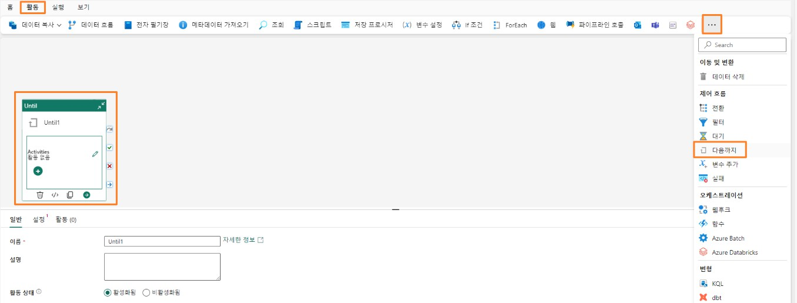

### 작업 7: 변수 만들기

1.	상태를 반복하고 설정하는 데 사용할 변수를 생성해야 합니다. 파이프라인 설계 창에서 **빈 영역**을 선택합니다.

2.	하단 창의 메뉴가 변경되는 것을 확인합니다. **변수**를 선택합니다.

3.	**새로 만들기**를 선택하여 새 변수를 추가합니다.

4.	행이 나타나는지 확인합니다. **이름 텍스트 상자에 varCounter**를 입력합니다. 이 변수를 사용하여 세 번 반복합니다.

5.	**유형 드롭다운에서 정수**를 선택합니다.

6.	**기본값**으로 **0**을 입력합니다.

**참고:** 변수 이름 앞에 var를 추가하므로 쉽게 찾을 수 있으며 이는 모범적인 방식입니다.

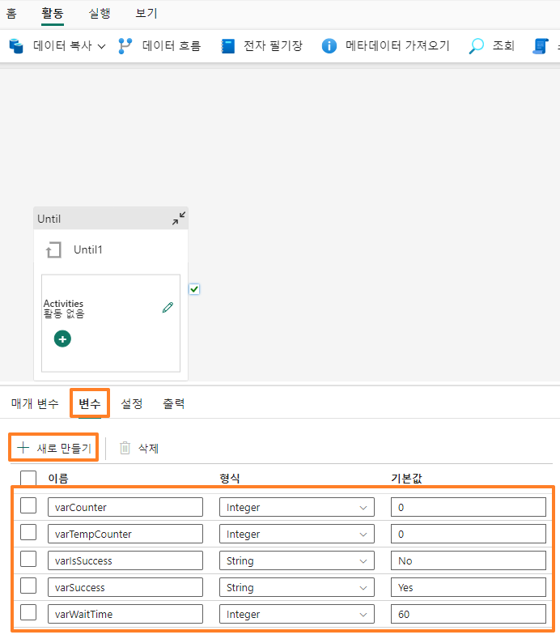

7.	**새로 만들기**를 선택하여 또 다른 새 변수를 추가합니다.

8.	행이 나타나는지 확인합니다. **이름 텍스트 상자에 varTempCounter**를 입력합니다. 우리는 이 변수 증분 varCounter 변수를 사용할 것입니다.

9.	**유형 드롭다운**에서 **정수**를 선택합니다.

10.	**기본값**으로 **0**을 입력합니다.
 
11.	유사한 단계에 따라 변수를 세 개 더 추가합니다.

- **varIsSuccess** of type **String** and default value **No.** 이 변수는 데이터 흐름 새로 고침이 성공했는지 여부를 나타내는 데 사용됩니다.

- **varSuccess** of type **String** and default value **Yes.** 이 변수는 데이터 흐름 새로 고침이 성공한 경우 varIsSuccess 값을 설정하는 데 사용됩니다.

- **varWaitTime** of type **Integer** and default value **60.** 이 변수는 데이터 흐름이 실패할 경우 대기 시간을 설정하는 데 사용됩니다. (5분/300초 또는 15분/900초 중 하나입니다.)

### 작업 8: Until 작업 구성

1.	**Until** 작업을 선택합니다.

2.	**하단 창**에서 **일반**을 선택합니다.

3.	**이름**을 **Iterator**로서 입력합니다.

4.	**설명**을 **다음과 같이 입력합니다**. 데이터 흐름 새로 고침하는 반복기. **최대 3번가지 재시도됩니다.**

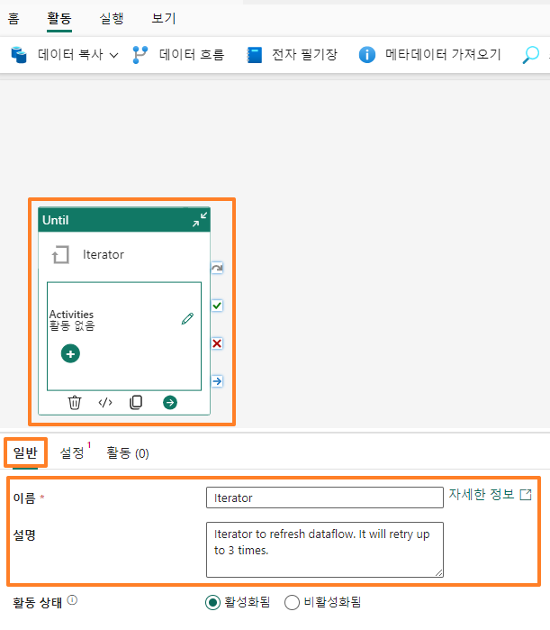

5.	하단 창에서 **설정**을 선택합니다.
 
6.	**식 텍스트 상자**를 선택합니다. 이 텍스트 상자에 true 또는 false로 평가되는 식을 입력해야 합니다. 이 식이 false로 평가되는 동안 Until 작업이 반복됩니다. 식이 true로 평가되면 Until 작업이 중지됩니다.

7.	텍스트 상자 아래에 나타나는 **동적 콘텐츠 추가** 링크를 선택합니다.

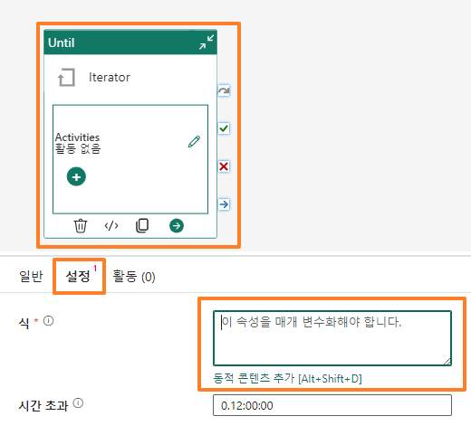

**varCounter 값이 3** 이거나 값 **varIsSuccess가 Yes가 될 때까지 실행되는 식을 작성해야 합니다.**
(varCounter 및 varIsSuccess는 방금 우리가 생성한 변수입니다.)

8.	**파이프라인 식 작성기** 대화상자가 열립니다. 대화 상자 하단에 다음과 같은 메뉴가 있습니다.

- **매개변수:** 어떤 식에서든 파이프라인이 사용할 수 있는 데이터 팩터리 전체의 상수입니다.

- **시스템 변수:** 이들 변수는 서비스 내에서 엔터티를 정의할 때 식에 사용할 수 있습니다. 예를 들면, 파이프라인 ID, 파이프라인 이름, 트리거 이름 등.

- **함수:** 식 내에서 함수를 호출할 수 있습니다. 함수는 Collection, Conversion, Date, Logical, Math, 및 String 함수로 분류됩니다. 예를 들면, concat은 String 함수이고 add는 Math 함수 등입니다.

- **변수:** 파이프라인 변수는 파이프라인 실행 중에 설정하고 수정할 수 있는 값입니다. 파이프라인 수준에서 정의되고 파이프라인 실행 중에 변경할 수 없는 파이프라인 매개 변수와 달리 파이프라인 변수는 변수 설정 활동을 사용하여 파이프라인 내에서 설정하고 수정할 수 있습니다. 곧 변수 설정 활동을 사용할 예정입니다.
 
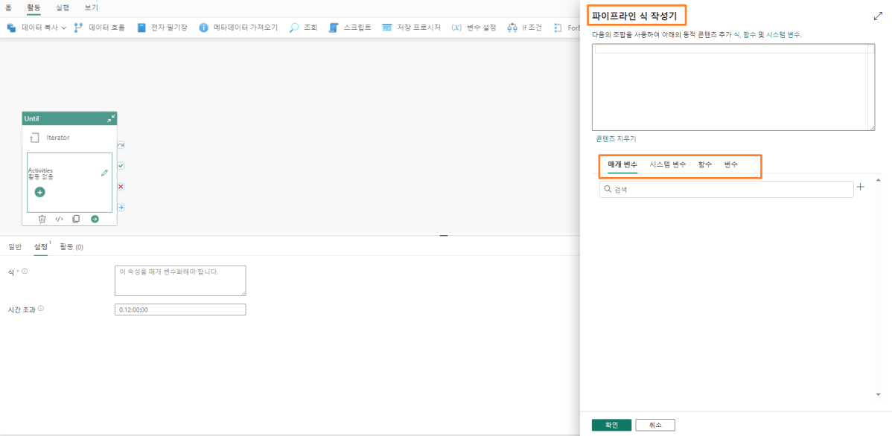
 
9.	하단 메뉴에서 **함수**를 클릭합니다.

10.	**Logical 함수** 섹션에서 **or 함수**를 선택합니다. **@or()** 가 동적 식 텍스트 상자에 추가됩니다. or
함수는 두 개의 매개변수를 취하며, 우리는 첫 번째 매개변수에 대해 작업하고 있습니다.

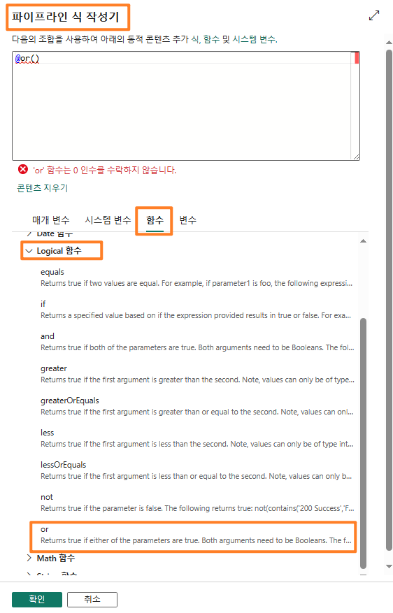
 
11.	커서를 **@o**r 함수의 **괄호 사이**로 가져갑니다.

12.	**Logical** 함수 섹션에서 **equals** 함수를 선택합니다. 이는 동적 식 텍스트 상자에 추가됩니다.

**참고:** 함수는 **@or(equals())** 와 같아야 합니다. equals 함수도 두 개의 매개변수를 사용합니다. varCounter 변수가 3인지 확인하겠습니다.

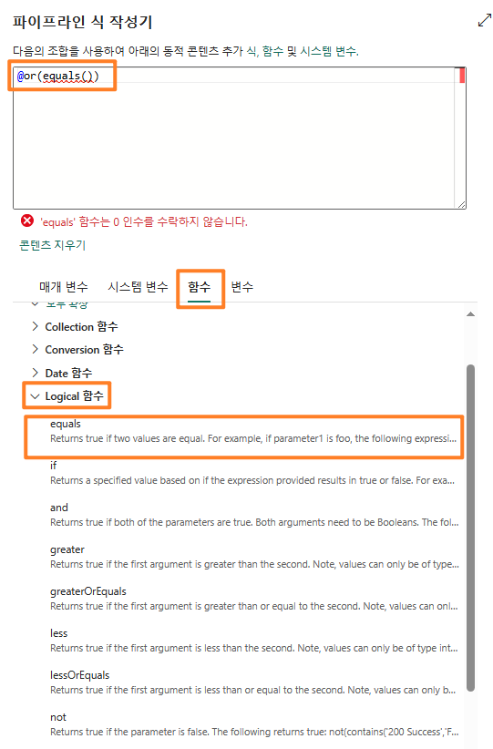

13.	이제 커서를 **@equals** 함수의 **괄호 사이**로 가져가서 매개변수를 추가합니다.

14.	하단 메뉴에서 **변수**를 선택합니다.

15.	첫 번째 매개변수가 될 **varCounter**를 선택합니다.

16.	3을 equals 함수의 두 번째 매개변수로 입력합니다. 아래 스크린샷처럼 현재 식은

    **@or(equals(variables('varCounter'),3))** 가 됩니다.

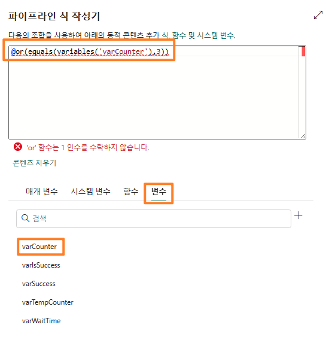
 
17.	or 함수에 두 번째 매개변수를 추가해야 합니다. 두 괄호의 끝 사이에 **쉼표 하나를 추가합**니다. 이번에는 함수 이름을 입력해 보겠습니다. **equ**를 입력하기 시작하면 사용 가능한 함수의 드롭다운이 표시됩니다(IntelliSense라고 함). **equals** 함수를 선택합니다.

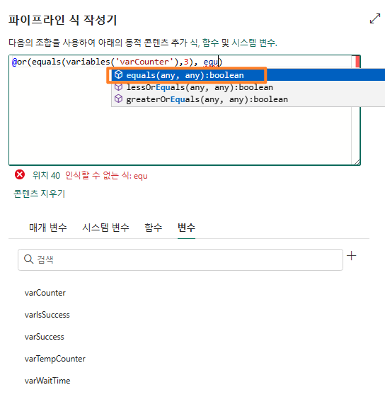

18.	equals 함수의 첫 번째 매개 변수는 변수입니다. **쉼표 앞으로 커서**를 가져갑니다.

19.	**variables**(를 입력하기 시작합니다.

20.	IntelliSense의 도움으로 **variables('varIsSuccess')** 를 선택합니다.

21.	쉼표 다음에는 두 번째 매개 변수를 입력해 보겠습니다. **variables**(를 입력하기 시작합니다.
 
22.	IntelliSense의 도움으로 **variables('varSuccess')** 를 선택합니다. 여기서는 varIsSuccess 값을
varSuccess 값과 비교합니다. (varSuccess의 기본값은 Yes입니다.)

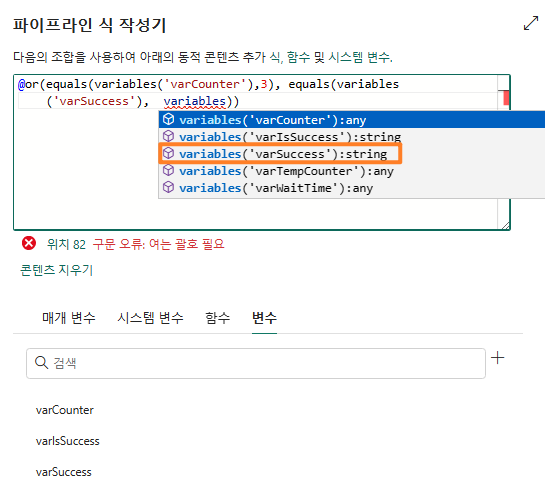

23.	식은 다음과 같아야 합니다.

    **@or(equals(variables('varCounter'),3),equals(variables('varIsSuccess'), variables('varSuccess')))**

24.	**확인**을 선택합니다.

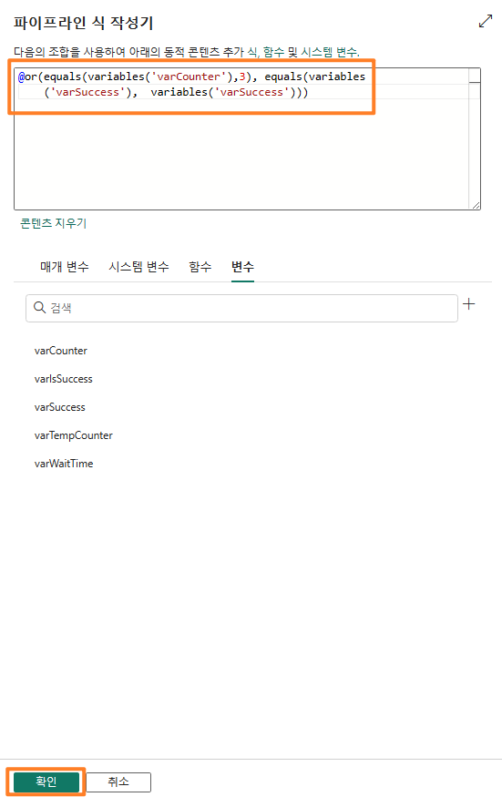
 
### 작업 9: 데이터 흐름 작업 구성

1.	설계 화면으로 되돌아갑니다. **Until 작업**을 선택한 상태에서 **하단 창**에서 **활동**을 선택합니다. 이제 실행해야 할 활동을 추가하겠습니다.

2.	첫 번째 행에서 **수정 아이콘**을 선택합니다. 빈 반복기 설계 화면으로 되돌아갑니다.

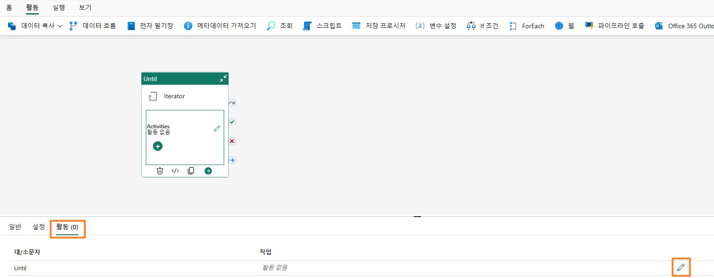

3.	상단 메뉴에서 **활동 -> 데이터 흐름**을 선택합니다. 데이터 흐름 활동이 설계 창에 추가됩니다.

4.	**데이터 흐름 활동이 선택된** 상태에서 하단 창에서 **일반**을 선택합니다. 활동에 이름과 설명을 지정해 보겠습니다.

5.	**이름** 필드에 **dfactivity_People_SharePoint**를 입력합니다.

6.	**설명** 필드에 **df_People_Sharepoint 데이터 흐름을 새로 고치는 데이터 흐**름 활동을 입력합니다.

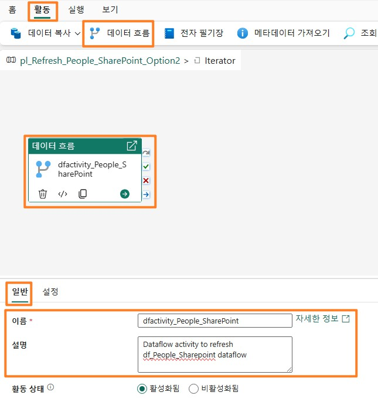
 
7.	하단 창에서 **설정**을 선택합니다.

8.	**작업 영역**이 현재 작업 영역 **FAIAD_<username>**(으)로 설정되어 있는지 확인합니다.

9.	**데이터 흐름 드롭다운**에서 **df_People_SharePoint**를 선택합니다. 이 데이터 흐름 활동이 실행되면 **df_People_SharePoint**가 새로 고침됩니다.

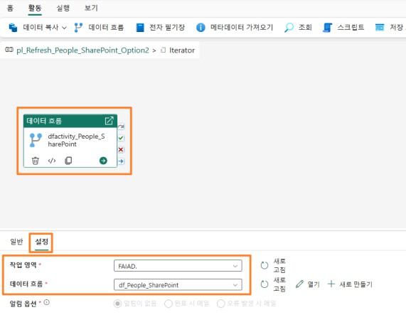

### 작업 10: 첫 번째 변수 설정 활동 구성

이전 랩에서 했던 것처럼 데이터 흐름 활동을 구성했습니다. 이제 새로운 로직을 추가하겠습니다. 데이터 흐름 새로 고침이 성공하면 Until 반복기를 벗어나야 합니다. 반복기가 존재하기 위한 조건 중 하나는 varIsSuccess 변수의 값을 Yes로 설정하는 것입니다.

1.	상단 메뉴에서 **활동 - > 변수 설정**을 선택합니다. 변수 설정 활동이 설계 캔버스에 추가됩니다.

2.	**변수 설정 활동**이 선택된 상태에서 하단 창에서 일반을 선택합니다. 활동에 이름과 설명을 지정해 보겠습니다.

3.	**이름** 필드에 **set_varIsSuccess**를 입력합니다.

4.	**설명** 필드에 **변수 varIsSuccess를 Yes로 설정**을 입력합니다.

**참고: 데이터 흐름 활동**으로 마우스를 가져갑니다. 활동 상자 오른쪽에는 4개의 아이콘이 있습니다. 활동 결과에 따라 다음 활동에 연결하는 데 사용할 수 있습니다.

&nbsp; &nbsp; &nbsp; &nbsp; &nbsp;a.	**회색 곡선 화살표** 아이콘은 활동을 건너뛰는 데 사용됩니다.

&nbsp; &nbsp; &nbsp; &nbsp; &nbsp;b.	**녹색 확인 표시** 아이콘은 활동 성공 시 사용됩니다.

&nbsp; &nbsp; &nbsp; &nbsp; &nbsp;c.	**빨간색 X 표시** 아이콘은 활동 실패 시 사용됩니다.

&nbsp; &nbsp; &nbsp; &nbsp; &nbsp;d.	**파란색 직선 화살표** 아이콘은 활동 완료 시 사용됩니다.
 
5.	dfactivity_People_SharePoint 데이터 흐름 활동에서 **녹색 확인 표시**를 클릭하여 새로운 **set_varIsSuccess 변수 설정 활동**으로 드래그하여 연결합니다. 따라서 데이터 흐름 새로 고침이 성공하면 변수 설정 활동을 실행하고자 합니다.

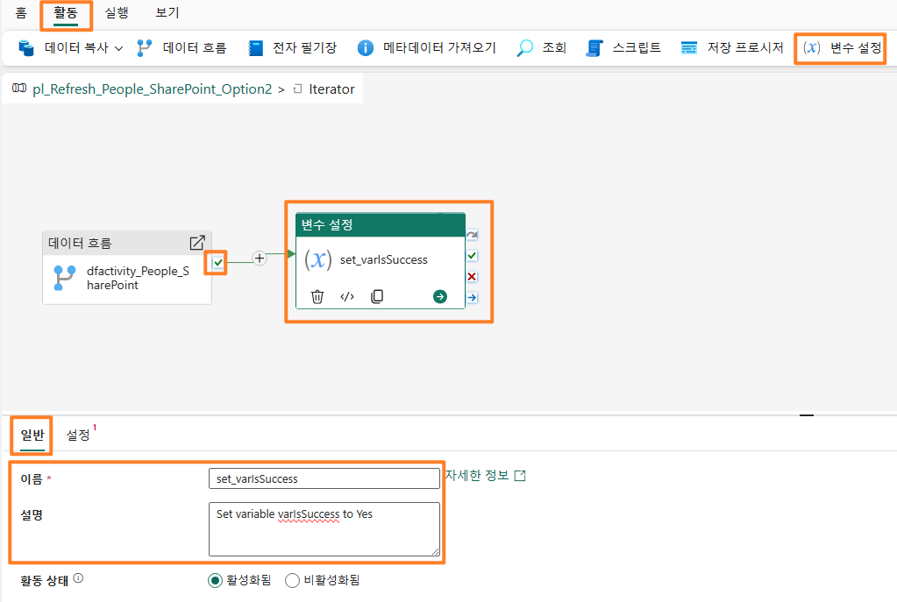

6.	**변수 설정 활동**을 선택하고 하단 메뉴에서 **설정**을 클릭합니다.

7.	하단 창에서 **변수 유형**이 **파이프라인 변수**인지 확인합니다.

8.	**이름** 필드에서 **varIsSuccess를 선택합니다.** 이것이 우리가 설정할 값의 변수입니다.

9.	**값** 필드에서 **텍스트 상자**를 선택합니다. **동적 콘텐츠 추가** 링크를 선택합니다.

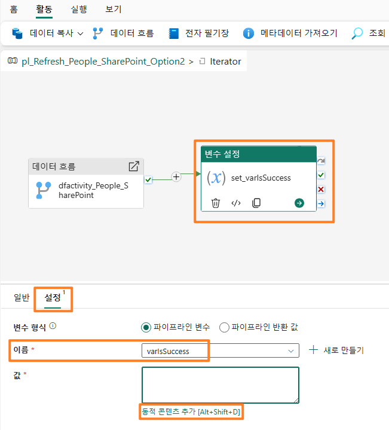
 
10.	파이프라인 식 작성기 대화상자가 열립니다. **식, 함수 및 시스템 변수의 조합을 사용하여 아래에 동적 콘텐츠 추가 텍스트 영역**을 선택합니다.

11.	하단 메뉴에서 **변수 -> varSuccess**를 선택합니다. @variables('varSuccess')가 "아래에 동적 콘텐츠 추가 텍스트 영역"에 입력되어 있습니다. 변수를 생성할 때 varSuccess 변수의 값을 Yes로 미리 설정했음을 기억하십시오. 따라서 varIsSuccess 변수에 Yes 값을 할당합니다.

12.	**확인**을 선택합니다. **반복기 설계 창**으로 되돌아갑니다.

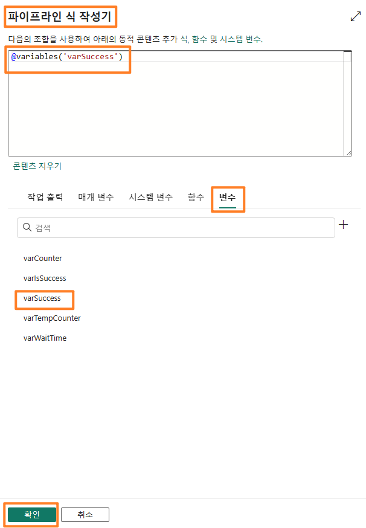

이제 데이터 흐름 활동이 실패할 경우 카운터를 설정해야 합니다. 데이터 파이프라인에서는 변수를 자체 참조할 수 없습니다. 이는 카운터 변수 varCounter의 값에 1을 추가하여 증가시킬 수 없음을 의미합니다(varCounter = varCounter + 1). 따라서 varTempCounter 변수를 사용합니다.

### 작업 11: 두 번째 변수 설정 활동 구성

1.	상단 메뉴에서 **활동 - > 변수 설정**을 선택합니다. 변수 설정 활동이 설계 캔버스에 추가됩니다.

2.	**변수 설정 활동**이 선택된 상태에서 하단 창에서 **일반**을 선택합니다. 활동에 이름과 설명을 지정해 보겠습니다.

3.	**이름** 필드에 **set_varTempCounter**를 입력합니다.

4.	**설명** 필드에 **증분 변수 varTempCounter**를 입력합니다.
 
5.	데이터 흐름 활동에서 새로운 변수 설정 활동까지 이어진 **빨간색 x 표시**를 클릭합니다. 따라서 데이터 흐름 새로 고침이 실패하면 이 변수 설정 활동을 실행하고자 합니다.

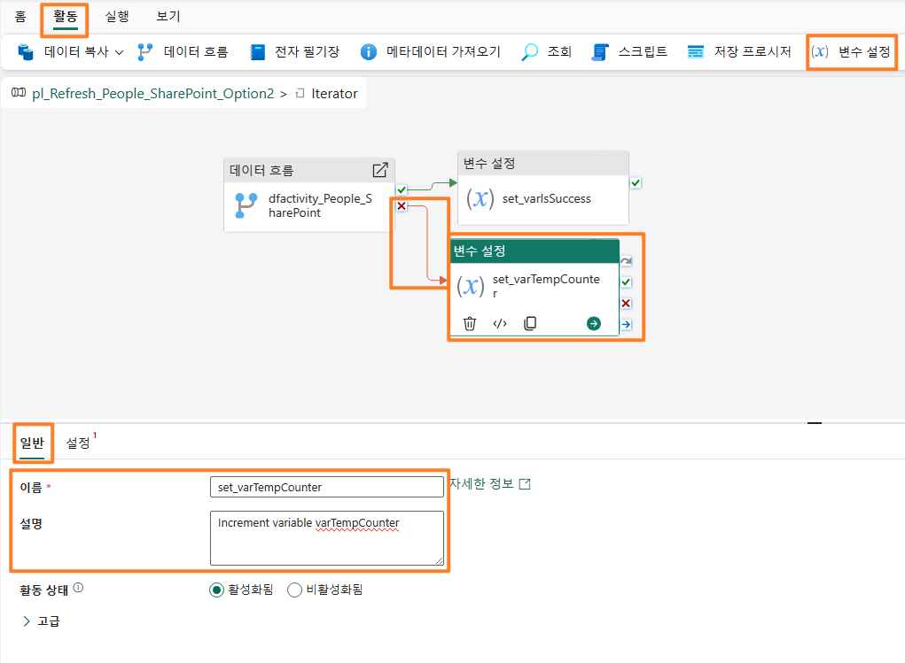

6.	**변수 설정 활동**을 선택하고 하단 메뉴에서 **설정**을 선택합니다.

7.	하단 창에서 **변수 유형**이 **파이프라인 변수**인지 확인합니다.

8.	**이름** 필드에서 **varTempCounter**를 선택합니다. 이것이 우리가 설정할 값의 변수입니다.

9.	**값** 필드에서 **텍스트 상자**를 선택합니다. **동적 콘텐츠 추가**링크를 선택합니다.

10.	파이프라인 식 작성기 대화 상자가 열립니다. **@add(variables('varCounter'),1)** 를 입력합니다.

**참고:** 이 식을 자유롭게 입력하거나, 메뉴를 사용하여 함수를 선택하거나, 복사하여 붙여넣습니다.

**참고:** 이 함수는 변수 varTempCounter의 값을 변수 varCounter에 1을 더한 값(varTempCounter = varCounter + 1)으로 설정합니다.

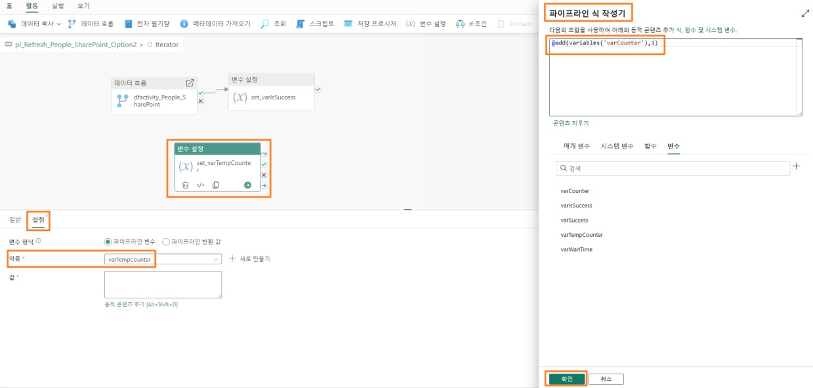

이제 varCounter 변수의 값을 varTempCounter의 값으로 설정해야 합니다.

### 작업 12: 세 번째 변수 설정 활동 구성

1.	상단 메뉴에서 **활동 - > 변수 설정**을 선택합니다. 변수 설정 활동이 설계 캔버스에 추가됩니다.

2.	**변수 설정 활동**이 선택된 상태에서 하단 창에서 **일반**을 선택합니다. 활동에 이름과 설명을 지정해 보겠습니다.

3.	**이름** 필드에 **set_varCounter**를 입력합니다.

4.	**설명** 필드에 증분 변수 **varCounter**를 입력합니다.

5.	set_varTempCounter 변수 설정 활동에서 **녹색 확인 표시**를 클릭하여 새로운 **set_varCounter 변수 설정 활동**으로 드래그하여 연결합니다.
 
    
 
6.	**set_varCounter 변수 설정 활동**을 선택하고 하단 메뉴에서 **설정**을 클릭합니다.

7.	하단 창에서 **변수 유형**이 **파이프라인 변수**인지 확인합니다.

8.	**이름** 필드에서 varCounter를 선택합니다. 이것이 우리가 설정할 값의 변수입니다.

9.	**값** 필드에서 **텍스트 상자**를 선택합니다. **동적 콘텐츠 추가** 링크를 선택합니다.

10.	파이프라인 식 작성기 대화 상자가 열립니다. **@variables('varTempCounter')** 를 입력합니다. 이 식을 자유롭게 입력하거나, 메뉴를 사용하여 함수를 선택하거나, 복사하여 붙여넣습니다.

**참고:** 이 함수는 변수 varCounter의 값을 변수 varTempCounter의 값(varCounter = varTempCounter)으로 설정합니다. 각 반복이 끝나면 varCounter와 varTempCounter는 모두 동일한 값을 갖습니다.

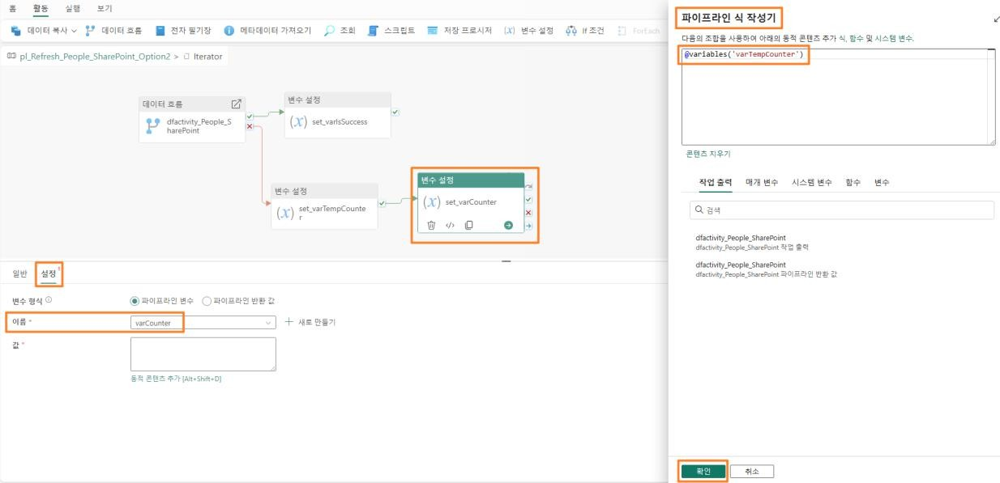

### 작업 13: 대기 작업 구성

다음으로, 다시 시도하기 전에 데이터 흐름 새로 고침이 처음 실패할 경우 5분/300초 동안 기다려야 합니다. 데이터 흐름 새로 고침이 두 번째로 실패할 경우 15분/900초 동안 기다린 후에 다시 시도해야 합니다. 대기 작업과 변수 varWaitTime을 사용하여 대기 시간을 설정하겠습니다.

1.	상단 메뉴에서 **활동 - > 줄임표(…) -> 대기**를 선택합니다. Wait 작업이 설계 캔버스에 추가됩니다.

2.	**대기 작업이 선택된** 상태에서 하단 창에서 **일반**을 선택합니다. 활동에 이름과 설명을 지정해 보겠습니다.

3.	**이름** 필드에서 **wait_onFailure**를 입력합니다.

4.	**설명** 필드에 **두 번째 시도에서는 300초, 세 번째 시도에서는 900초 동안 대기**를 입력합니다.

5.	set_varCounter 변수 설정 활동에서 **녹색 확인 표시**를 클릭하여 새로운 **wait_onFailure Wait
작업**으로 드래그하여 연결합니다.
 
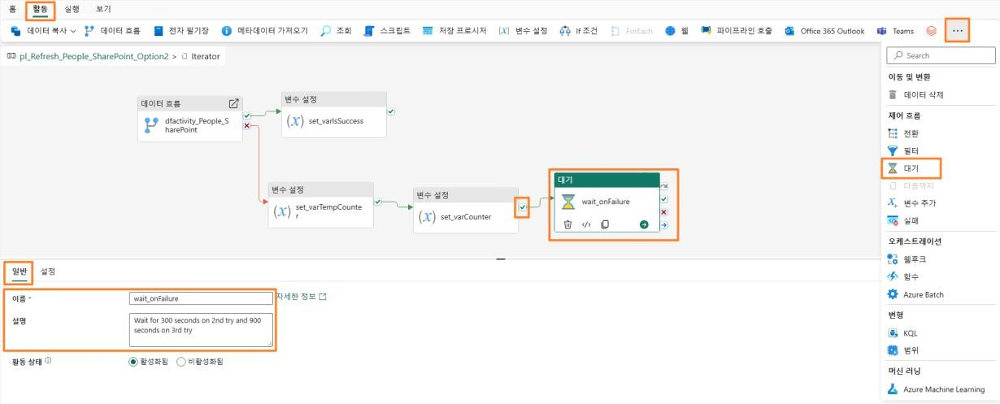
 
6.	**대기 작업**을 선택하고 하단 메뉴에서 **설정** 을 클릭합니다.

7.	**대기 시간(초)** 필드에서 **텍스트 상자**를 선택하고 **동적 콘텐츠 추가** 링크를 선택합니다.

8.	파이프라인 식 작성기 대화상자가 열립니다. 입력

**@if(
greater(variables(‘varCounter’), 1),
if(equals(variables(‘varCounter’), 2), mul(variables(‘varWaitTime’),15 ), mul(variables(‘varWaitTime’), 0)
),
mul(variables(‘varWaitTime’),5 )
)**

이 식을 자유롭게 입력하거나, 메뉴를 사용하여 함수를 선택하거나, 복사하여 붙여넣습니다.

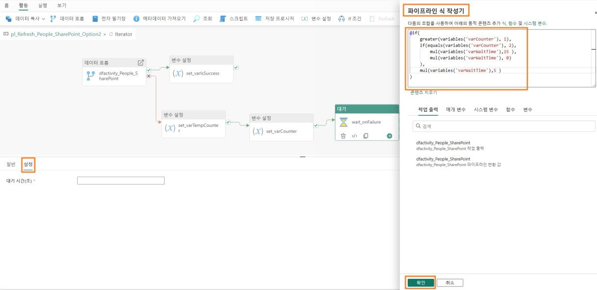
 
여기서는 두 가지 새로운 함수를 사용하고 있습니다.

- **greater:** 두 개의 숫자를 매개 변수로 사용하여 어느 것이 더 큰지 비교합니다.

- **mul:** 이것은 곱하기 함수로, 곱하기 위해 두 개의 매개변수를 사용합니다.

식은 중첩된 if 문입니다. varCounter 변수의 값이 1보다 큰지 확인합니다. true인 경우 varCounter
변수의 값이 2인지 확인합니다. true인 경우 대기 시간을 varWaitTime의 15배로 설정합니다. varWaitTime 값이 60으로 기본 설정되어 있다는 점을 기억하세요. 따라서 60*15 = 900초가
됩니다. varCounter 변수의 값이 2가 아닌 경우(2보다 큰 경우, 이는 데이터 흐름 새로 고침이 3번 실패했음을 의미하며 반복이 완료되었음을 의미합니다. 더 이상 기다릴 필요가 없습니다.) 대기 시간은 varWaitTime * 0으로 설정됩니다. 따라서 0으로 설정됩니다. varCounter 변수의 값이 1이면 varWaitTime * 5로 곱합니다. 그러면 60*5 = 300초가 됩니다.

9.	**확인**을 선택합니다.

**체크포인트:** Until 반복기가 아래 스크린샷과 같아야 합니다.

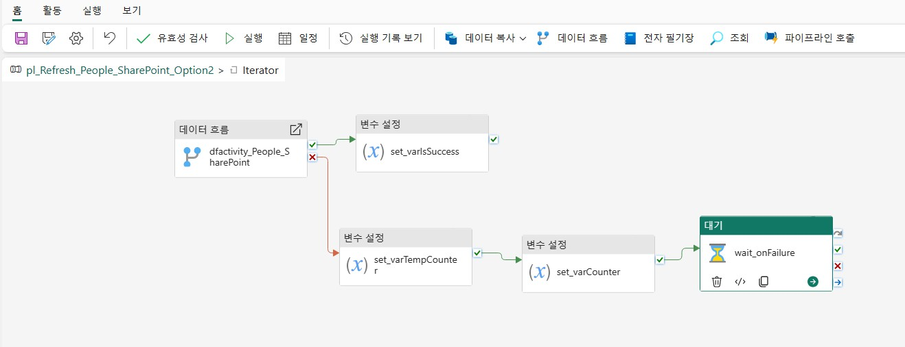

10.	설계 캔버스의 왼쪽 상단에서 **pl_Refresh_People_Sharepoint_Option2**를 선택하여 Until
반복기에서 빠져나옵니다.

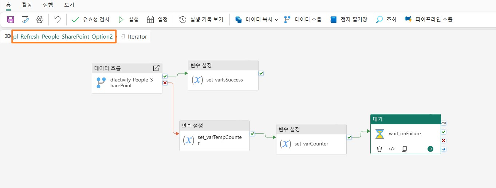

11.	데이터 파이프라인 생성이 완료되었습니다. 상단 메뉴에서 **홈 -> 저장 아이콘**을 선택하여 데이터 파이프라인을 저장합니다.

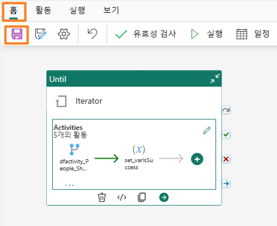

### 작업 14: 데이터 파이프라인에 대한 예약 새로 고침 구성

1.	**홈 -> 실행을** 선택하여 데이터 파이프라인을 테스트할 수 있습니다.

**참고:** 데이터 파이프라인의 새로 고침이 완료되는 데 몇 분 정도 걸릴 수 있습니다. 이것은 교육 환경이므로 SharePoint의 파일을 항상 사용할 수 있습니다. 따라서 현재 데이터 파이프라인은 결코 실패하지 않습니다.

2.	일정에 따라 실행되도록 데이터 파이프라인을 설정할 수 있습니다. 상단 메뉴에서 **홈 - >
일정**을 선택합니다. 일정 대화 상자가 열립니다.
 
3.	**예약된 실행** 라디오 버튼을 **켜기**로 설정합니다.

4.	**반복 드롭다운**을 **매일**로 설정합니다.

5.	**시간**을 **오전 9시**로 설정합니다.

6.	**시작 날짜 및 시간**을 **오늘**으로 설정합니다.

7.	**종료일 및 시간**을 **미래 날짜**로 설정합니다.

8.	해당 **시간대**를 설정합니다.

**참고:** 이는 랩 환경이므로 시간대를 원하는 시간대로 설정할 수 있습니다. 실제 시나리오에서는 사용자/데이터 원본 위치를 기반으로 시간대를 설정하게 됩니다.

9.	**적용**을 선택합니다.

10.	대화 상자의 오른쪽 상단에 있는 **X** 표시를 선택하여 닫습니다.

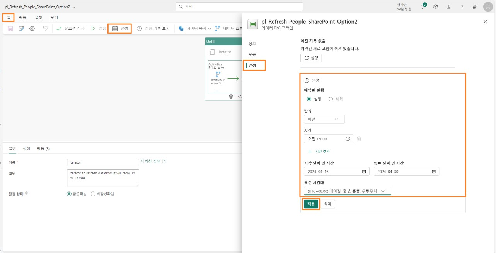

11.	왼쪽 패널에서 Fabric 작업 영역 **FAIAD_<username>**을(를) 선택하여 작업 영역으로 이동합니다.

**참고:** 일정 화면에는 성공 또는 실패를 알리는 옵션(예: 데이터 흐름 일정)이 없습니다. 데이터 파이프라인에 활동을 추가하여 알림을 수행할 수 있습니다. 이 랩은 실습 환경이므로 해당 활동을 수행하지 않습니다.
다양한 데이터 원본에 대한 새로 고침을 예약했습니다. 다음 랩에서는 관계, 측정값을 생성하고 기타 모델링 활동을 수행할 것입니다.
 
## 참조
Fabric Analyst in a Day(FAIAD)는 Microsoft Fabric에서 사용할 수 있는 몇 가지 주요 기능을 소개합니다. 서비스의 메뉴에 있는 도움말(?) 섹션에는 유용한 리소스로 연결되는 링크가 있습니다.

아래는 Microsoft Fabric의 다음 단계에 도움이 되는 몇 가지 추가 자료입니다.
- [Microsoft Fabric GA 발표](https://aka.ms/Fabric-Hero-Blog-Ignite23) 전문을 블로그 포스트로 읽기
- [가이드 투어](https://aka.ms/Fabric-GuidedTour)로 Fabric 탐색
- [Microsoft Fabric 무료 평가판](https://aka.ms/try-fabric) 신청
- [Microsoft Fabric 웹사이트](https://aka.ms/microsoft-fabric) 방문
- [Fabric 학습 모듈](https://aka.ms/learn-fabric)을 탐색해서 새로운 기술 익히기
- [Fabric 기술 문서](https://aka.ms/fabric-docs) 검토
- [Fabric 시작하기 무료 e북](https://aka.ms/fabric-get-started-ebook) 읽기
- [Fabric 커뮤니티](https://aka.ms/fabric-community)에 가입하여 질문을 게시하고 피드백을 공유하며 다른 사람들로부터 배우기
 
더 많은 심층 Fabric 환경 발표 블로그 포스트 읽기:
- [Fabric 블로그의 Data Factory 환경](https://aka.ms/Fabric-Data-Factory-Blog)
- [Fabric 블로그의 Synapse Data Engineering 환경](https://aka.ms/Fabric-DE-Blog)
- [Fabric 블로그의 Synapse Data Science 환경](https://aka.ms/Fabric-DS-Blog)
- [Fabric 블로그의 Synapse Data Warehousing 환경](https://aka.ms/Fabric-DW-Blog)
- [Fabric 블로그의 Synapse Real-Time Analytics 환경](https://aka.ms/Fabric-RTA-Blog)
- [Power BI 발표 블로그](https://aka.ms/Fabric-PBI-Blog)
- [Fabric 블로그의 Data Activator 환경](https://aka.ms/Fabric-DA-Blog)
- [Fabric 블로그의 관리 및 거버넌스](https://aka.ms/Fabric-Admin-Gov-Blog)
- [Fabric 블로그의 OneLake](https://aka.ms/Fabric-OneLake-Blog)
- [Dataverse 및 Microsoft Fabric 통합 블로그](https://aka.ms/Dataverse-Fabric-Blog)

© 2023 Microsoft Corporation. All rights reserved.
이 데모/랩을 사용하면 다음 조건에 동의하게 됩니다.
이 데모/랩에 설명된 기술/기능은 학습 환경을 제공하고 사용자 의견을 얻기 위해 Microsoft Corporation에서 제공합니다. 데모/랩을 통해서만 이러한 기술적 특성과 기능을 평가하고 사용자 의견을 Microsoft에 제시할 수 있습니다. 다른 용도로는 사용할 수 없습니다. 이 데모/랩 또는 그 일부에 대해 수정, 복사, 배포, 전송, 표시, 수행, 재현, 게시, 라이선스 허여, 파생 작업 생성, 양도 또는 판매할 수 없습니다.
추가 복제 또는 재배포를 위한 다른 서버 또는 위치에 대한 데모/랩(또는 그 일부)의 복사 또는 재현은 명시적으로 금지됩니다.
이 데모/랩은 위에서 명시한 목적을 위해 복잡한 설정 또는 설치가 없는 시뮬레이션된 환경에서 잠재적인 새로운 기능과 개념을 포함하여 특정 소프트웨어 기술/제품의 특성 및 기능을 제공합니다. 이 데모/랩에서 서술된 기술/개념은 전체 기능을 나타내지 않을 수 있으며, 최종 버전이 작동하지 않을 수도 있습니다. 또한 해당 기능 또는 개념의 최종
버전을 릴리스하지 않을 수도 있습니다. 또한 실제 환경에서 이러한 특성과 기능을 사용한 경험이 다를 수도 있습니다.
 
피드백. 이 데모/랩에서 서술된 기술적 특성, 기능 및/또는 개념에 대한 사용자 의견을
Microsoft에 제시하면 Microsoft는 이 사용자 의견을 어떤 방식과 목적으로든 무료로 사용, 공유 및 상용화할 수 있습니다. 또한 제품, 기술 및 서비스에서 사용자 의견이 포함된
Microsoft 소프트웨어 또는 서비스의 특정 부분을 사용하거나 인터페이스하는 데 필요한 모든 특허권을 제3자에게 무료로 제공합니다. Microsoft에서 사용자 의견을 포함하기 때문에 Microsoft에서 해당 소프트웨어 또는 설명서의 사용을 인가해야 하는 라이선스에 종속된 사용자 의견은 제공할 수 없습니다. 이러한 권리는 본 계약에 의거하여 유효합니다.
Microsoft Corporation은 이에 따라 명시적, 묵시적 또는 법적 특정 목적에의 적합성, 권리 및 비침해 여부에 관계없이 모든 보증과 조건을 포함하여 데모/랩과 관련된 모든 보증 및 조건을 부인합니다. Microsoft는 어떤 목적으로든 결과의 정확성, 데모/랩의 사용으로 파생된 출력 또는 데모/랩에 포함된 정보의 적합성과 관련하여 어떠한 보증이나 진술도 하지 않습니다.
고지 사항
이 데모/랩에는 Microsoft Power BI의 새로운 기능 및 향상된 기능 중 일부만 포함되어 있습니다. 일부 기능은 제품의 향후 릴리스에서 변경될 수 있습니다. 이 데모/랩에서는 새로운 기능 모두가 아닌 일부에 대해 학습하게 됩니다.

