# Microsoft Fabric
## Fabric Analyst in a Day
## 랩 6
2024년 3월 버전

## 목차
서문	3
Lakehouse	3
작업 1: SQL 을 사용한 데이터 쿼리    	3 
작업 2: T-SQL 결과 시각화	      5 
작업 3: 시각적 쿼리 만들기	      8 
작업 4: 쿼리 결과 시각화       	13 
작업 5: 관계 만들기	       14 
작업 6: 측정값 만들기	    17 
작업 7: 선택 섹션 – 관계 만들기	   19 
작업 8: 선택 섹션 – 측정값 만들기   	23 
참조	    24 

## 서문
우리는 다양한 데이터 원본의 데이터를 Lakehouse로 수집했습니다. 본 랩에서는 데이터 모델을 사용합니다. 일반적으로 우리는 Power BI Desktop에서 관계 생성, 측정값 추가 등과 같은 모델링 활동을 수행했습니다. 여기서는 서비스에서 이러한 모델링 활동을 수행하는 방법을 알아봅니다.
이 랩을 마치면 다음 사항을 알게 됩니다.  
•	Lakehouse 탐색 방법  
•	Lakehouse의 SQL 보기 탐색 방법  
•	Lakehouse에서 데이터 모델링 탐색 방법  

## Lakehouse
작업 1: SQL을 사용한 데이터 쿼리
1.	다시 랩 2, 작업 9에서 만든 Fabric 작업 영역, **FAIAD_<username>**(으)로 되돌아가 보겠습니다.
2.	lh_FAIAD의 세 가지 유형(Lakehouse, 의미 체계 모델 및 SQL 엔드포인트)을 보게 됩니다. 이전 랩에서 Lakehouse 옵션을 탐색했습니다. **lh_FAIAD SQL 분석 엔드포인트** 옵션을 선택하여 SQL 옵션을 탐색합니다. 탐색기의 **SQL 보기**로 이동합니다.

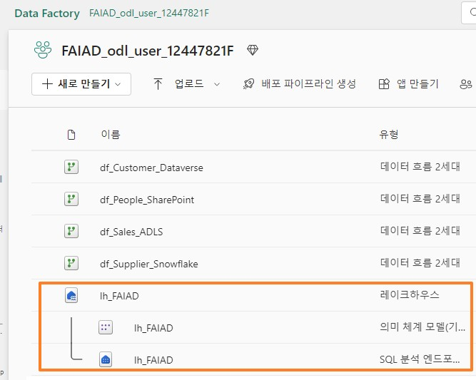

데이터 모델을 만들기 전에 데이터를 탐색하려면 SQL을 사용하면 됩니다. SQL을 사용하는 두 가지 옵션을 살펴보겠습니다. 첫 번째 옵션은 개발자 친화적이고 두 번째 옵션은 분석가를 위한 것입니다.
 
SQL을 사용하여 Supplier가 판매한 제품을 빠르게 찾고 싶다고 가정해 보겠습니다. SQL 문을 작성하거나 시각적 개체를 사용하여 SQL 문을 만드는 두 가지 옵션이 있습니다.
왼쪽 패널에서 테이블을 볼 수 있습니다. 테이블을 확장하면 테이블을 구성하는 열을 볼 수 있습니다. 또한 SQL 보기, 함수 및 저장 프로시저를 생성하는 옵션도 있습니다. SQL에 대한 배경 지식이 있다면 자유롭게 다음 옵션을 살펴보세요. 간단한 SQL 쿼리를 작성해 보겠습니다.
3.	**상단 메뉴에서 새 SQL 쿼리를** 선택하거나, **왼쪽 패널 하단에서 쿼리를** 선택합니다. SQL 쿼리 보기로 이동합니다.

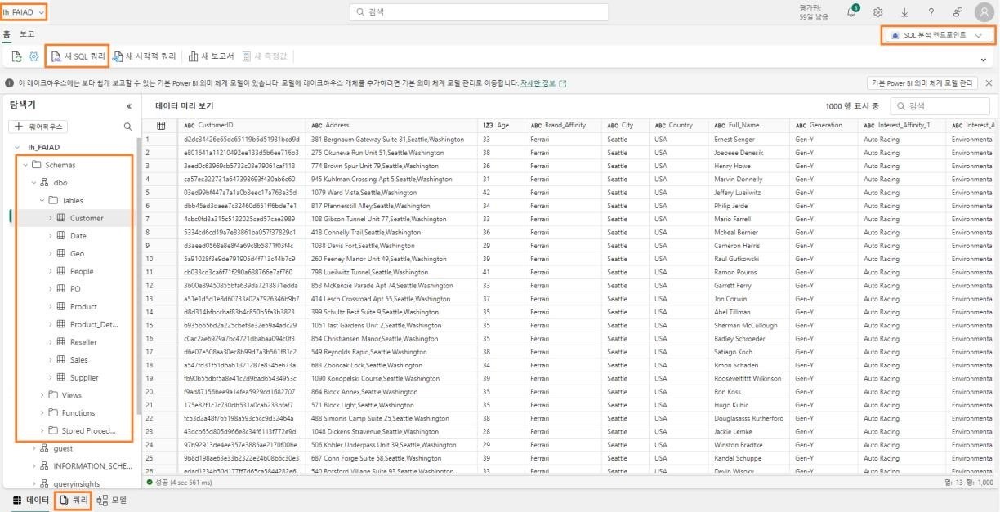

4.	**아래 SQL 쿼리를 쿼리 창**에 붙여넣습니다. 이 쿼리는 Supplier 이름별로 unit을 반환합니다. 이를 달성하기 위해 Sales 테이블을 Product 및 Supplier 테이블과 결합합니다.

SELECT su.Supplier_Name, SUM(Quantity) as Units  
FROM dbo.Sales s  
JOIN dbo.Product p on p.StockItemID = s.StockItemID   JOIN dbo.Supplier su on su.SupplierID = p.SupplierID   GROUP BY su.Supplier_Name  

5.	결과를 보려면 **실행**을 클릭합니다.
6.	**보기로 저장**을 선택하여 이 쿼리를 뷰로 저장할 수 있는 옵션이 있습니다.
 
7.	**왼쪽 탐색기** 패널의 **쿼리** 섹션에서 이 쿼리가 **내 쿼리** 아래에 **SQL query 1**으로 저장되어 있습니다. 이는 쿼리 이름을 바꾸고 나중에 사용할 수 있도록 저장하는 옵션을 제공합니다. **공유 쿼리** 폴더를 사용하여 나와 공유된 쿼리를 볼 수 있는 옵션도 있습니다.

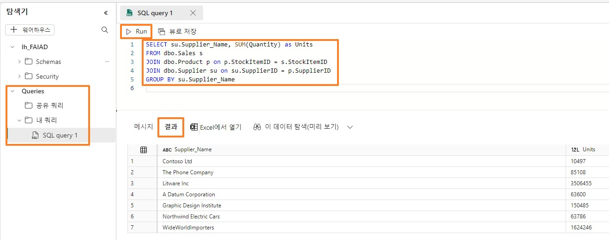

## 작업 2: T-SQL 결과 시각화
1.	이 쿼리의 결과를 시각화할 수도 있습니다. 쿼리 창에서 **쿼리를 강조 표시하고 결과 창**을 선택한 다음 **이 데이터 탐색**을 선택합니다.

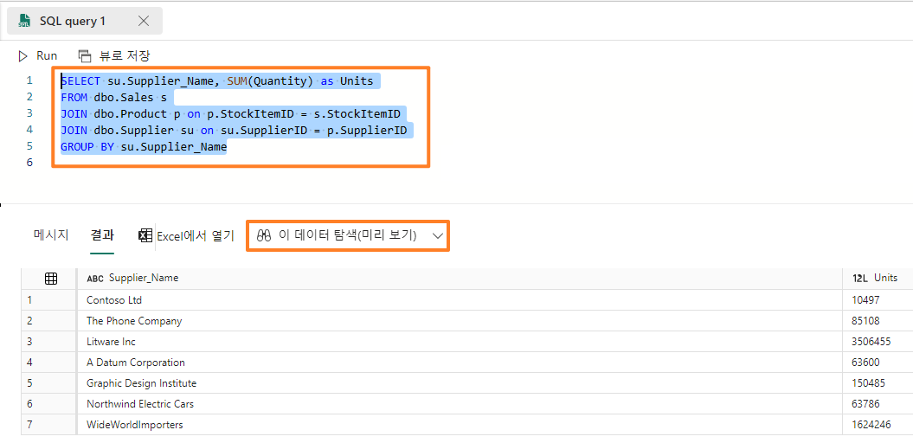

2.	**SQL 쿼리 탐색** 대화 상자가 열립니다. **데이터** 창에서 **SQL query 1**을 확장합니다.
3.	**Supplier_Name** 및 **Units 필드를** 선택합니다. 묶은 가로 막대형 차트가 생성됩니다.
4.	**시각화 섹션에서 누적 세로 막대형 차트를** 선택하여 시각적 개체 유형을 변경합니다.
 
 

5.	**매트릭스를 확장하여 데이터를** 매트릭스로 봅니다.

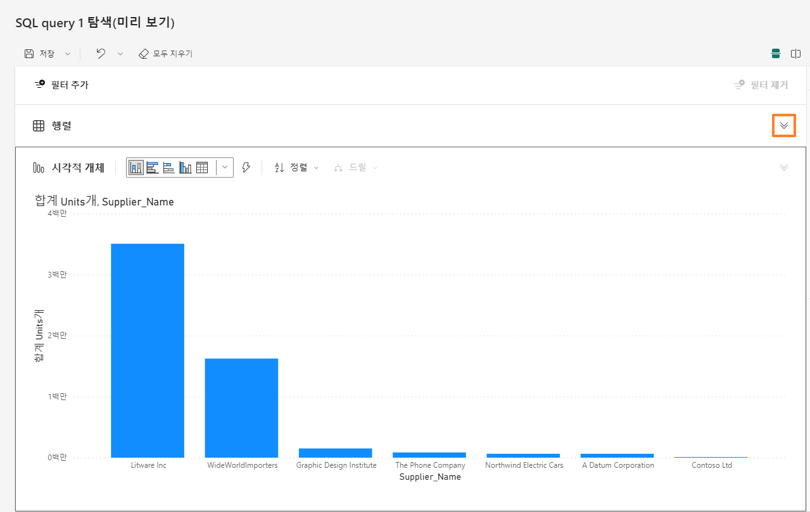
 
6.	화면의 오른쪽 상단에서 **저장 -> 보고서로 저장**을 선택합니다.

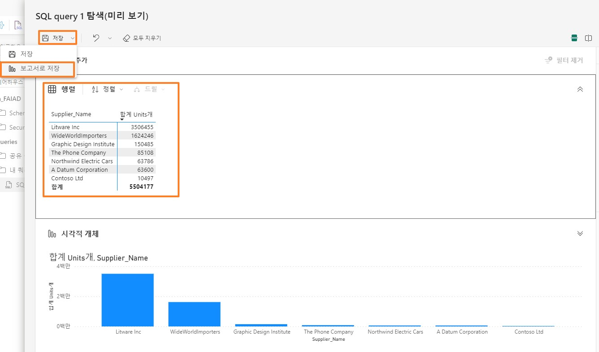

7.	보고서 저장 대화 상자가 열립니다. **보고서 텍스트 상자 이름 입력에 Units by Supplier를** 입력합니다.
8.	대상 작업 영역이 Fabric 작업 영역 **FAIAD_<username>**(으)로 설정되어 있는지 확인합니다.
9.	**저장**을 선택합니다.

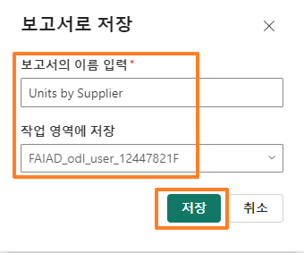

전체 보고서 환경으로 이동합니다. 시각적 형식을 지정하는 옵션이 있습니다. 다음 랩에서는 이러한 옵션을 살펴보겠습니다.
10.	왼쪽 패널에서 **lh_FAIAD 를** 선택합니다.
 
 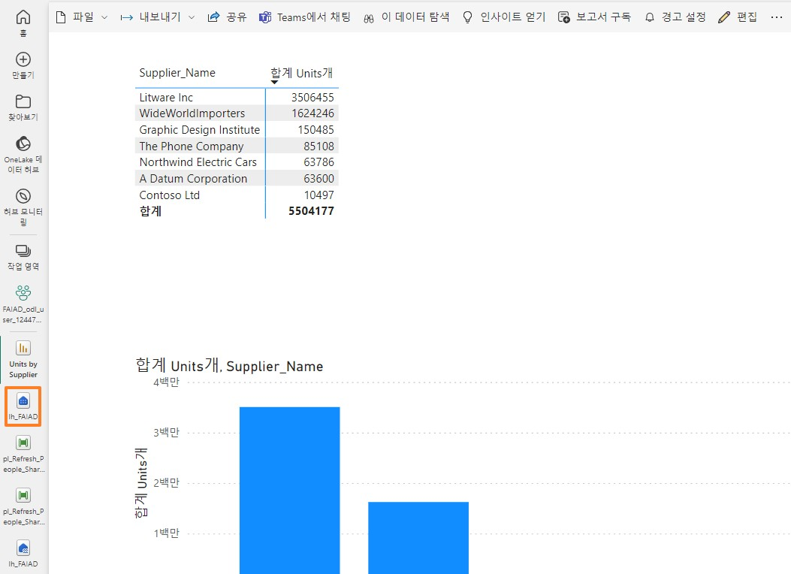

## 작업 3: 시각적 쿼리 만들기
**SQL 분석 엔드포인트 뷰**로 이동합니다. SQL에 익숙하지 않은 경우 새 시각적 쿼리를 사용하여 유사한 쿼리를 실행할 수 있습니다.
1.	상단 메뉴에서 **새 시각적 쿼리를** 선택합니다. 시각적 쿼리 창이 열립니다.
2.	**탐색기** 창에서 **Schemas -> dbo -> Tables**로 확장합니다.
3.	**Sales, Product 및 Supplier** 테이블을 시각적 쿼리 창으로 끌어다 놓습니다.

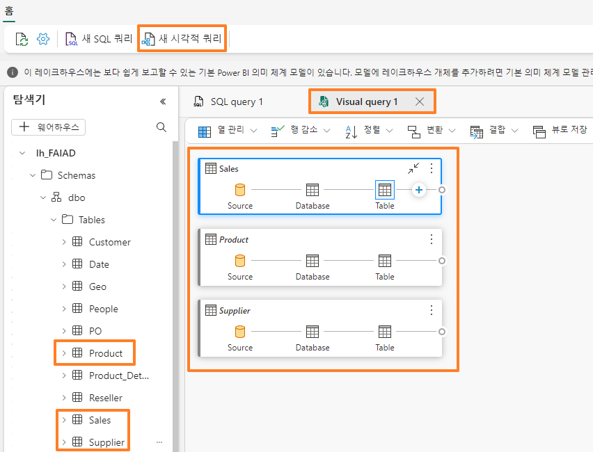
 
4.	**Sales** 테이블을 선택하고 시각적 쿼리 창 메뉴에서 **결합 -> 쿼리 병합**을 선택합니다.

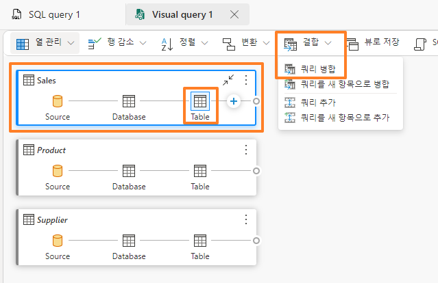

5.	병합 대화 상자가 열립니다. **병합할 오른쪽 테이블 드롭다운** 에서 **Product**을 선택합니다.
6.	**Sales** 및 **Product** 테이블에서 **StockItemID**을 선택합니다. 이는 Product 테이블과 Sales
테이블을 병합하는 것입니다.
7.	**결합 종류**에서 **왼쪽 우선 외부를** 선택합니다.
8.	**확인**을 선택합니다.

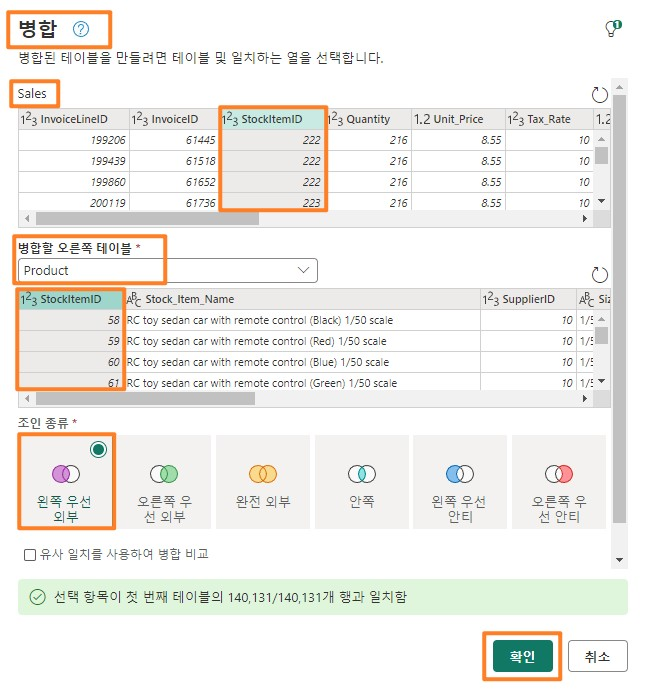

9.	**결과** 창에서 **Product** 열 옆에 있는 **이중 화살표를** 클릭합니다.
10.	대화 상자가 열리면 대화 상자에서 **SupplierID를** 선택합니다.
 
11.	**확인**을 선택합니다. **병합된 쿼리 및 확장된 제품** 단계는 **Sales** 테이블에서 생성됩니다.

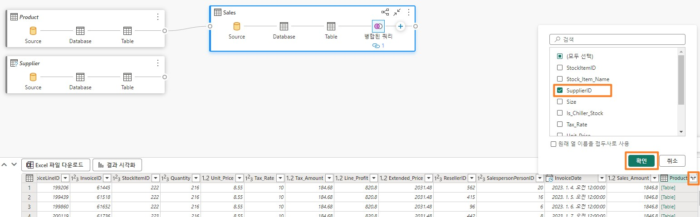

12.	마찬가지로, Supplier 테이블을 병합해 보겠습니다. **Sales** 테이블 내에서 **"+"**(확장된 제품 뒤에 위치)를 선택하여 새 단계를 추가합니다. 대화 상자가 열립니다.
13.	**결합 -> 쿼리 병합**을 선택합니다.

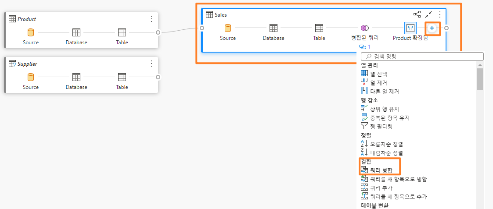

14.	병합 대화 상자가 열립니다. **병합할 오른쪽 테이블 드롭다운**에서 **Supplier**를 선택합니다.
15.	**Sales** 및 **Supplier** 테이블에서 SupplierID를 선택합니다. 이는 Supplier 테이블과 Sales
테이블을 병합하는 것입니다.
16.	**결합 종류**에서 **왼쪽 우선 외부를** 선택합니다.
17.	**확인**을 선택합니다.
 
 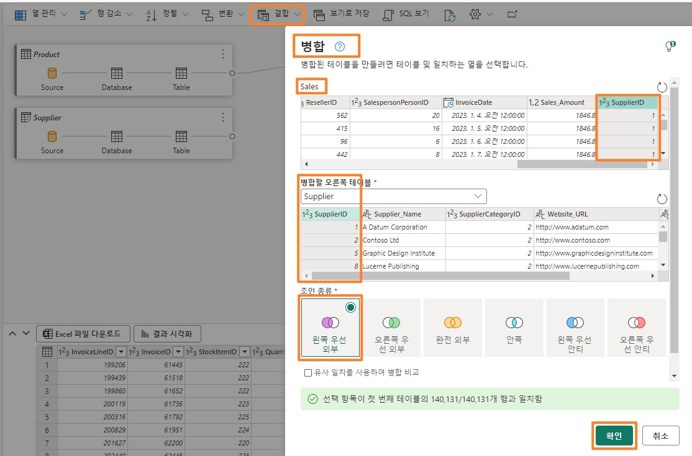

18.	**결과** 창에서 **Supplier** 열 옆에 있는 **이중 화살표를** 클릭합니다.
19.	대화 상자가 열리면 대화 상자에서 **Supplier_Name**을 선택합니다.
20.	**확인**을 선택합니다. Sales 테이블에서 **병합된 쿼리가** 추가되고 **단계는 기록됩니다**.

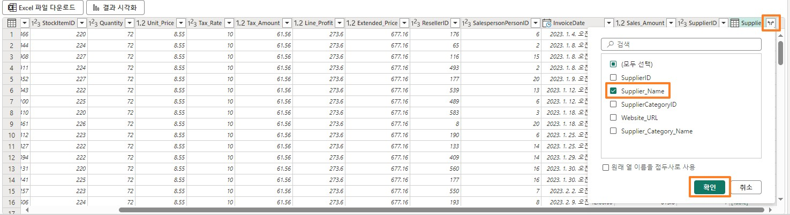

21.	이제 공급업체별 수량을 얻기 위해 공급업체 이름별로 그룹화해 보겠습니다. **Sales** 테이블 내에서 "+"(확장된 공급업체 뒤에 있음)를 선택하여 새 단계를 추가합니다. 대화 상자가 열립니다.
22.	**테이블 변환 -> 그룹화 기준**을 선택합니다. 그룹화 기준 대화 상자가 열립니다.

 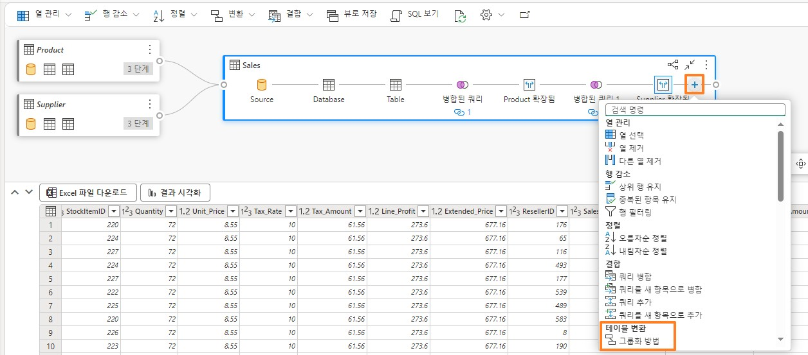
 

23.	**그룹화 기준** 드롭다운에서 **Supplier_Name** 을 선택합니다.
24.	병합 쿼리 대화 상자의 스크린샷으로 **단위를** 입력합니다.
25.	**작업**을 **합계**로 설정합니다.
26.	**열** 드롭다운에서 **수량**을 선택합니다.
27.	**확인**을 선택합니다.

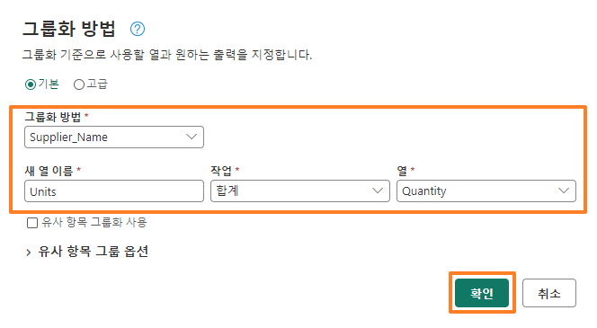

모든 단계가 영업 블록에 기록됩니다. (작업 4 의 첫 번째 스크린샷을 참조합니다.)
 
작업 4: 쿼리 결과 시각화
1.	이제 쿼리가 준비되♘으므로 결과를 살펴보겠습니다. 결과 창에서 결과 시각화를 선택합니다.

2.	결과 시각화 대화 상자가 열립니다. 오른쪽의 데이터 창에서 시각적 쿼리1을 확장합니다.
3.	Supplier_Name 및 Units 필드를 선택합니다.
4.	결과는 이전의 SQL 쿼리 결과와 유사합니다. 원하는 경우 이 보고서를 저장할 수 있습니다. 앞서 유사한 보고서를 저장했으므로 취소를 선택하겠습니다.

 
작업 5: 관계 만들기
이제 모델을 구축하고, 테이블 간의 관계를 구축하고, 측정값을 생성할 준비가 되♘습니다.
1.	하단 창에서 모델을 선택합니다. 가운데 창은 Power BI Desktop에서 볼 수 있는 모델 뷰와 비슷합니다.
2.	필요에 따라 테이블의 크기를 조정하고 재배치합니다.
3.	Sales 테이블과 Reseller 테이블 간의 관계를 만들어 보겠습니다. Sales 테이블에서
ResellerID를 선택하여 Reseller 테이블의 ResellerID로 드래그합니다.

4.	새 관계 대화 상자가 열립니다. Table 1이 Sales이고 열이 ResellerID인지 확인합니다.
5.	Table 2가 Reseller이고 열이 ResellerID인지 확인합니다.
6.	카디널리티가 다대일(*:1)인지 확인합니다.
7.	교차 필터 방향이 단일인지 확인합니다.
8.	확인을 선택합니다.
 
 

9.	마찬가지로 Sales 테이블과 Date 테이블 간의 관계를 만듭니다. Sales 테이블에서
InvoiceDate를 선택하여 Date 테이블의 Date로 드래그합니다.
10.	새 관계 대화 상자가 열립니다. Table 1이 Sales이고 열이 InvoiceDate인지 확인합니다.
11.	Table 2가 Date이고 열이 Date인지 확인합니다.
12.	카디널리티가 다대일(*:1)인지 확인합니다.
13.	교차 필터 방향이 단일인지 확인합니다.
14.	확인을 선택합니다.

15.	비슷하게, Sales 와 Product 테이블 사이에 다대일 관계를 만듭니다. Sales 테이블에서
StockItemID 를 그리고 Product 테이블에서 StockItemID 를 선택합니다.
 
16.	상단 메뉴에서 보고 -> 의미 체계 모델을 자동으로 업데이트를 선택하여 모델을 저장하고 업데이트합니다.

체크포인트: 현재 모델은 아래 스크린샷에 표시된 것처럼 Sales와 Reseller 테이블 간 및 Sales와 Date 그리고 Sales와 Product 테이블 간의 세 가지 관계가 있어야 합니다.

시간 관계상 모든 관계를 생성하지는 않습니다. 시간이 허락한다면 랩 마지막에 선택 섹션을 완료할 수 있습니다. 선택 섹션에서는 나머지 관계를 만드는 단계를 안내합니다.
 
작업 6: 측정값 만들기
매출 대시보드를 생성하는 데 필요한 몇 가지 측정값을 추가해 보겠습니다.
1.	모델 뷰에서 Sales 테이블을 선택합니다. Sales 테이블에 측정값을 추가하려고 합니다.
2.	상단 메뉴에서 홈 - > 새 측정값을 선택합니다. 수식 입력줄이 표시됩니다.
3.	수식 입력줄에 Sales = SUM(Sales[Sales_Amount])을 입력합니다.
4.	수식 입력줄 왼쪽의 체크 표시 를 클릭하거나 Enter 버튼을 클릭합니다.
5.	오른쪽 속성 패널에서 서식 섹션을 확장합니다.
6.	서식 드롭다운 목록에서 정수를 선택합니다.

7.	상단 메뉴에서 Sales 테이블 을 선택한 상태에서 홈 -> 새 측정값을 선택합니다. 수식 입력줄이 표시됩니다.
8.	수식 입력줄에 Units = SUM(Sales[Quantity])을 입력합니다.
9.	수식 입력줄 왼쪽의 체크 표시 를 클릭하거나 Enter 버튼을 클릭합니다.
10.	오른쪽의 속성 패널에서 서식 적용 섹션을 확장합니다(속성 패널을 로드하는 데 몇 분 정도 걸릴 수 있습니다).
11.	서식 드롭다운 목록에서 정수를 선택합니다.
 
 

12.	상단 메뉴에서 Sales 테이블 을 선택한 상태에서 홈 -> 새 측정값을 선택합니다. 수식 입력줄이 표시됩니다.
13.	수식 입력줄에 Orders = DISTINCTCOUNT(Sales[InvoiceID])를 입력합니다.
14.	수식 입력줄 왼쪽의 체크 표시 를 클릭하거나 Enter 버튼을 클릭합니다.
15.	오른쪽 속성 패널에서 서식 섹션을 확장합니다.
16.	서식 드롭다운 목록에서 정수를 선택합니다.

다시 시간 관계상 모든 측정값을 생성하지는 않습니다. 시간이 허락한다면 랩 마지막에 선택 섹션을 완료할 수 있습니다. 선택 섹션에서는 나머지 측정값을 만드는 단계를 안내합니다.
데이터 모델을 만들♘으니, 다음 단계는 보고서를 만드는 것입니다. 그 작업은 다음 랩에서 하도록 하겠습니다.
 
작업 7: 선택 섹션 – 관계 만들기
나머지 관계를 추가해 보겠습니다.
1.	마찬가지로 Sales과 People 테이블 사이에 다대일 관계를 만듭니다. Sales에서 SalespersonPersonID를 그리고 People에서 PersonID를 선택합니다.
체크포인트: 현재 모델이 아래 스크린샷과 유사해야 합니다.

2.	이제 Product와 Supplier 간의 관계를 만들어 보겠습니다. Product 테이블에서 SupplierID를 선택하여 Supplier 테이블의 SupplierID로 드래그합니다.
3.	새 관계 대화 상자가 열립니다. Table 1이 Product이고 열이 SupplierID인지 확인합니다.
4.	Table 2가 Supplier이고 열이 SupplierID인지 확인합니다.
5.	카디널리티가 다대일(*:1)인지 확인합니다.
6.	교차 필터 방향이 모두인지 확인합니다.
7.	확인을 선택합니다.
 
 

8.	마찬가지로 Product_Details과 Product 간의 교차 필터 방향을 모두로 설정한 다대일 관계를 생성합니다. Product_Details에서 StockItemID를 그리고 Product에서 StockItemID를 선택합니다.
9.	이제 Reseller과 Geo 간의 관계를 만들어 보겠습니다. Reseller 테이블에서 PostalCityID를 선택하여 Geo 테이블의 CityID로 드래그합니다.
10.	새 관계 대화 상자가 열립니다. Table 1이 Reseller이고 열이 PostalCityID인지 확인합니다.
11.	Table 2가 Geo이고 열이 CityID인지 확인합니다.
12.	카디널리티가 다대일(*:1)인지 확인합니다.
13.	교차 필터 방향이 모두인지 확인합니다.
14.	확인을 선택합니다.

15.	이제 Customer와 Reseller 간의 관계를 만들어 보겠습니다. Customer 테이블에서
ResellerID를 선택하여 Reseller 테이블의 ResellerID로 드래그합니다.
16.	새 관계 대화 상자가 열립니다. Table 1이 Customer이고 열이 ResellerID인지 확인합니다.
17.	Table 2가 Reseller이고 열이 ResellerID인지 확인합니다.
 
18.	카디널리티가 다대일(*:1)인지 확인합니다.
19.	교차 필터 방향이 Single인지 확인합니다.
20.	확인을 선택합니다.

체크포인트: 현재 모델이 아래 스크린샷과 유사해야 합니다.

21.	이제 PO와 Date 간의 관계를 만들어 보겠습니다. PO 테이블에서 Order_Date를 선택하여
Date 테이블의 Date로 드래그합니다.
22.	새 관계 대화 상자가 열립니다. Table 1이 PO이고 열이 Order_Date인지 확인합니다.
23.	Table 2가 Date이고 열이 Date인지 확인합니다.
24.	카디널리티가 다대일(*:1)인지 확인합니다.
 
25.	교차 필터 방향이 단일인지 확인합니다.
26.	확인을 선택합니다.

27.	마찬가지로 PO와 Product 테이블 사이에 다대일 관계를 만듭니다. PO에서 StockItemID를 그리고 Product에서 StockItemID를 선택합니다.
28.	마찬가지로 PO와 People 테이블 사이에 다대일 관계를 만듭니다. PO에서 ContactPersonID를 그리고 People에서 PersonID를 선택합니다.
모든 관계의 생성이 완료되♘습니다.
체크포인트: 현재 모델이 아래 스크린샷과 유사해야 합니다.

 
작업 8: 선택 섹션 – 측정값 만들기
나머지 측정값을 추가해 보겠습니다.
1.	상단 메뉴에서 Sales테이블을 선택한 상태에서 테이블 도구 -> 새 측정값을 선택합니다.
2.	수식 입력줄에 Avg Order = DIVIDE([Sales], [Orders]) 를 입력합니다.
3.	수식 입력줄의 체크 표시를 클릭하거나 Enter 버튼을 클릭합니다.
4.	측정값이 저장되면 상단 메뉴에서 측정 도구 옵션을 확인합니다. 측정 도구를 클릭합니다.
5.	형식 드롭다운에서 10진수를 클릭합니다.

6.	비슷한 단계에 따라 다음 측정값을 추가합니다.
a.	GM = SUM(Sales[Line_Profit]) - 10진수 형식.
b.	GM% = DIVIDE([GM], [Sales]) - 백분율 형식.
c.	No of Customers = COUNTROWS(Customer) formatted as Whole Number
 
참조
Fabric Analyst in a Day(FAIAD)는 Microsoft Fabric에서 사용할 수 있는 몇 가지 주요 기능을 소개합니다. 서비스의 메뉴에 있는 도움말(?) 섹션에는 유용한 리소스로 연결되는 링크가 있습니다.

아래는 Microsoft Fabric의 다음 단계에 도움이 되는 몇 가지 추가 자료입니다.
•	Microsof t Fabric GA 발표 전문을 블로그 포스트로 읽기
•	가이드 투어로 Fabric 탐색
•	Microsof t Fabric 무료 평가판 신청
•	Microsof t Fabric 웹사이트 방문
•	Fabric 학습 모듈을 탐색해서 새로운 기술 익히기
•	Fabric 기술 문서 검토
•	Fabric 시작하기 무료 e북 읽기
•	Fabric 커뮤니티에 가입하여 질문을 게시하고 피드백을 공유하며 다른 사람들로부터 배우기
 
더 많은 심층 Fabric 환경 발표 블로그 포스트 읽기:
•	Fabric 블로그의 Data Factory 환경
•	Fabric 블로그의 Synapse Data Engineering 환경
•	Fabric 블로그의 Synapse Data Science 환경
•	Fabric 블로그의 Synapse Data Warehousing 환경
•	Fabric 블로그의 Synapse Real-Time Analytics 환경
•	Power BI 발표 블로그
•	Fabric 블로그의 Data Activator 환경
•	Fabric 블로그의 관리 및 거버넌스
•	Fabric 블로그의 OneLake
•	Dataverse 및 Microsof t Fabric 통합 블로그

© 2023 Microsoft Corporation. All rights reserved.
이 데모/랩을 사용하면 다음 조건에 동의하게 됩니다.
이 데모/랩에 설명된 기술/기능은 학습 환경을 제공하고 사용자 의견을 얻기 위해 Microsoft Corporation에서 제공합니다. 데모/랩을 통해서만 이러한 기술적 특성과 기능을 평가하고 사용자 의견을 Microsoft에 제시할 수 있습니다. 다른 용도로는 사용할 수 없습니다. 이 데모/랩 또는 그 일부에 대해 수정, 복사, 배포, 전송, 표시, 수행, 재현, 게시, 라이선스 허여, 파생 작업 생성, 양도 또는 판매할 수 없습니다.
추가 복제 또는 재배포를 위한 다른 서버 또는 위치에 대한 데모/랩(또는 그 일부)의 복사 또는 재현은 명시적으로 금지됩니다.
이 데모/랩은 위에서 명시한 목적을 위해 복잡한 설정 또는 설치가 없는 시뮬레이션된 환경에서 잠재적인 새로운 기능과 개념을 포함하여 특정 소프트웨어 기술/제품의 특성 및 기능을 제공합니다. 이 데모/랩에서 서술된 기술/개념은 전체 기능을 나타내지 않을 수 있으며, 최종 버전이 작동하지 않을 수도 있습니다. 또한 해당 기능 또는 개념의 최종
버전을 릴리스하지 않을 수도 있습니다. 또한 실제 환경에서 이러한 특성과 기능을 사용한 경험이 다를 수도 있습니다.
 
피드백. 이 데모/랩에서 서술된 기술적 특성, 기능 및/또는 개념에 대한 사용자 의견을
Microsoft에 제시하면 Microsoft는 이 사용자 의견을 어떤 방식과 목적으로든 무료로 사용, 공유 및 상용화할 수 있습니다. 또한 제품, 기술 및 서비스에서 사용자 의견이 포함된
Microsoft 소프트웨어 또는 서비스의 특정 부분을 사용하거나 인터페이스하는 데 필요한 모든 특허권을 제3자에게 무료로 제공합니다. Microsoft에서 사용자 의견을 포함하기 때문에 Microsoft에서 해당 소프트웨어 또는 설명서의 사용을 인가해야 하는 라이선스에 종속된 사용자 의견은 제공할 수 없습니다. 이러한 권리는 본 계약에 의거하여 유효합니다.
Microsoft Corporation은 이에 따라 명시적, 묵시적 또는 법적 특정 목적에의 적합성, 권리 및 비침해 여부에 관계없이 모든 보증과 조건을 포함하여 데모/랩과 관련된 모든 보증 및 조건을 부인합니다. Microsoft는 어떤 목적으로든 결과의 정확성, 데모/랩의 사용으로 파생된 출력 또는 데모/랩에 포함된 정보의 적합성과 관련하여 어떠한 보증이나 진술도 하지 않습니다.
고지 사항
이 데모/랩에는 Microsoft Power BI의 새로운 기능 및 향상된 기능 중 일부만 포함되어 있습니다. 일부 기능은 제품의 향후 릴리스에서 변경될 수 있습니다. 이 데모/랩에서는 새로운 기능 모두가 아닌 일부에 대해 학습하게 됩니다.

