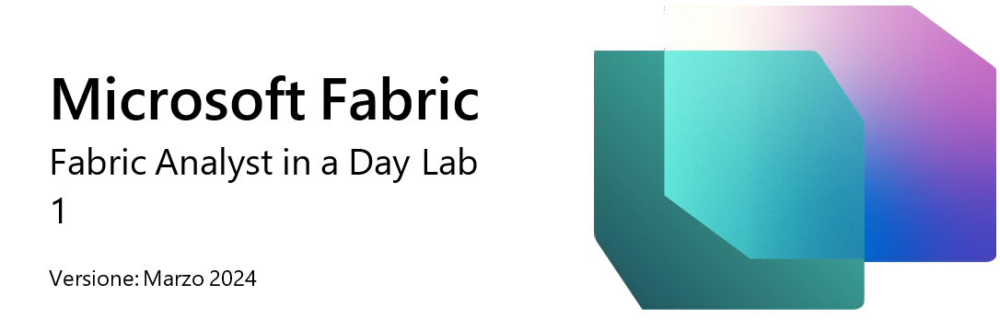
 
## Struttura del documento
Il lab include i passaggi che l'utente deve seguire con gli screenshot associati che forniscono un aiuto visivo. In ogni screenshot vi sono sezioni evidenziate con riquadri arancioni che indicano le aree su
cui l'utente deve concentrarsi.

## Scenario/Esposizione del problema
Fabrikam, Inc. è un distributore di oggettistica all'ingrosso. Poiché Fabrikam è un grossista, i suoi clienti sono soprattutto aziende che rivendono ai consumatori. Fabrikam vende a rivenditori al dettaglio in tutti gli Stati Uniti, inclusi negozi specializzati, supermercati, negozi di informatica e di souvenir per turisti. Fabrikam vende anche ad altri grossisti attraverso una rete di agenti che promuovono i prodotti per conto di Fabrikam. Sebbene tutti i clienti di Fabrikam abbiano sede negli Stati Uniti, l'azienda desidera espandersi in altri paesi/aree geografiche.
In qualità di analista dei dati del team di vendita, si raccolgono, puliscono e interpretano set di dati per risolvere i problemi aziendali. Si compongono anche visualizzazioni come grafici e diagrammi, si scrivono report e li presentano ai decision-maker dell'organizzazione.
Per ottenere informazioni utili, si estraggono, puliscono e organizzano insieme dati provenienti da più sistemi. Si ottengono dati dalle seguenti origini: 
•	**Dati di vendita:** provengono dal sistema ERP e sono archiviati in un database ADLS Gen2 o Databricks. Vengono aggiornati alle 12.00 ogni giorno. 
•	**Dati sui fornitori:** provengono da diversi fornitori e sono archiviati in un database Snowflake. Vengono aggiornati alle 00.00 ogni giorno. 
•	**Dati sui clienti:** provengono da Customer Insights e sono archiviati in Dataverse. I dati sono sempre aggiornati. 
•	**Dati sui dipendenti:** provengono dal sistema HR e sono archiviati in un file di esportazione in una cartella di SharePoint. Vengono aggiornati ogni mattina alle 9.00. 

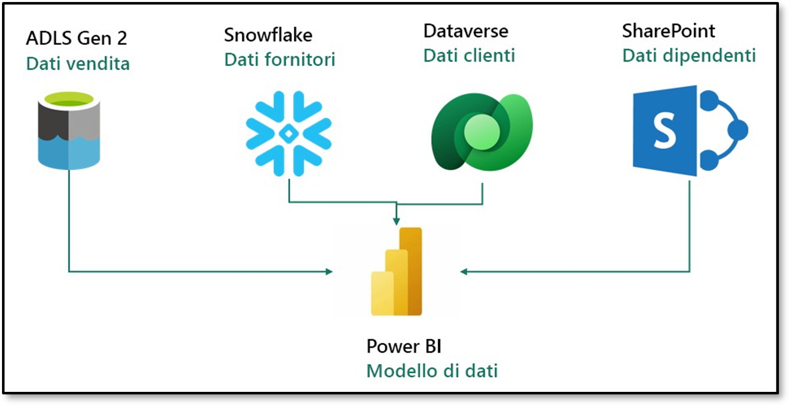
 
Attualmente si sta creando un set di dati in Power BI Premium che estrae i dati dai sistemi di origine sopraelencati per soddisfare le esigenze di reporting e per fornire agli utenti finali possibilità di uso self-service. Si usa Power Query per aggiornare il modello.

## Si devono affrontare le seguenti problematiche:

•	È necessario aggiornare il set di dati almeno tre volte al giorno per adattarsi ai diversi tempi di aggiornamento delle diverse origini dati.
•	Gli aggiornamenti richiedono molto tempo in quanto è necessario eseguire un aggiornamento completo ogni volta per acquisire eventuali aggiornamenti dei sistemi di origine.
•	Se si verificano errori in qualsiasi delle origini dati da cui si estraggono i dati, l'aggiornamento del set di dati si interrompe. Spesso il file dei dipendenti non viene caricato in tempo e ciò causa l'interruzione dell'aggiornamento del set di dati.
•	Eventuali modifiche al modello di dati richiedono molto tempo in quanto Power Query
richiede molto tempo per l'aggiornamento delle anteprime, date le dimensioni elevate dei dati e le trasformazioni complesse.
•	È necessario un PC Windows per usare Power BI Desktop anche se lo standard aziendale è Mac.
Si è sentito parlare di Microsoft Fabric e si è deciso di provarlo per verificare se può risolvere queste problematiche.

## Panoramica del report di Power BI Desktop
Prima di iniziare con Fabric, esaminiamo l'attuale report in Power BI Desktop per comprendere le trasformazioni e il modello.

### Attività 1 - Impostazione di Power BI Desktop nell'ambiente lab

1.	Aprire il file **FAIAD.pbix** contenuto nella cartella **C:\FAIAD\Reports** nell'ambiente lab. Il file si aprirà in Power BI Desktop.

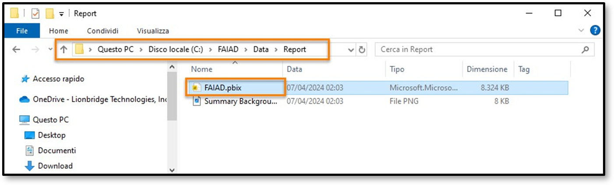
  	
2.	Si apre la finestra di dialogo Immettere l'indirizzo e-mail. Andare alla scheda Environment Details sul pannello di destra nell'ambiente lab.
   
3.	Copiare il **Nome utente** e incollarlo nella casella di testo E-mail della finestra di dialogo.
   
4.	Selezionare **Continua**.

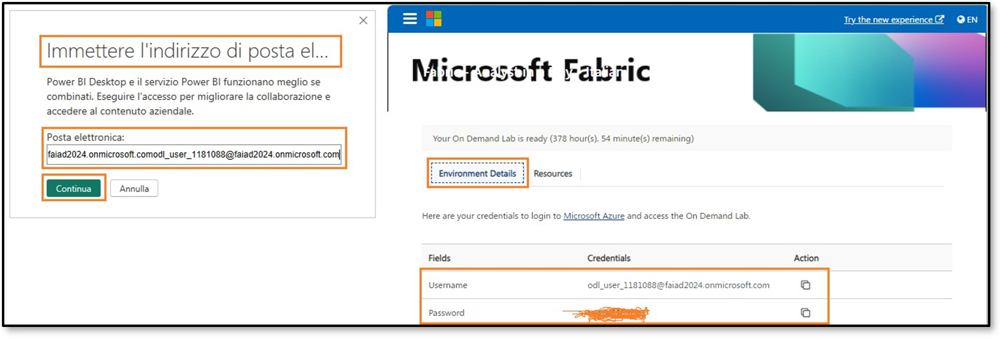
  	
5.	Si apre la finestra di dialogo Effettua l'accesso. Selezionare Account aziendale o dell'istituto di **istruzione**.
   
6.	Selezionare **Continua**.

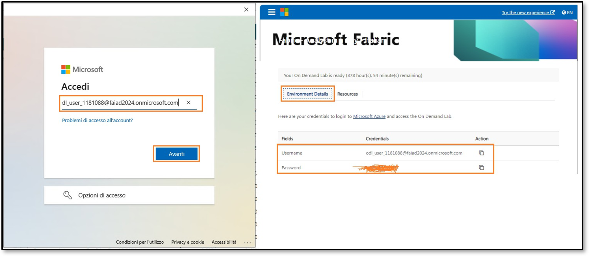
  	
7.	Si apre la finestra di dialogo Accedi. Immettere nuovamente il Nome utente copiandolo nella scheda **Dettagli ambiente**.
   
8.	Selezionare **Avanti**.

     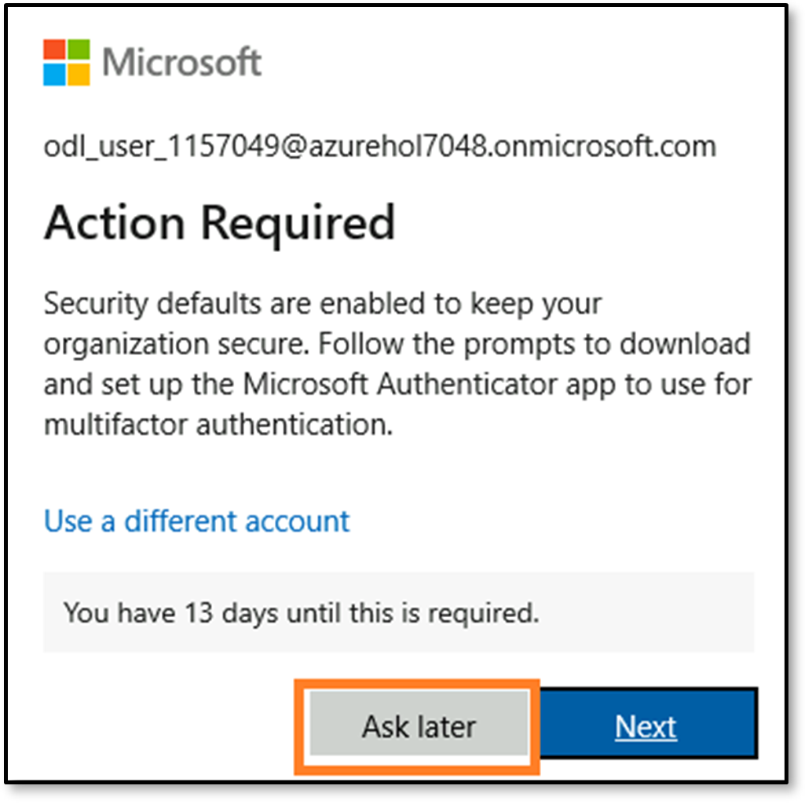
 
11.	Nella finestra di dialogo successiva immettere le Credenziali e la Password copiandole dalla scheda **Dettagli ambiente**.
12.	Selezionare **Accedi**.
13.	Si apre la finestra di dialogo Azione richiesta che richiede di impostare l'autenticazione a più fattori. Non è necessario impostarla poiché si tratta di un ambiente lab. Selezionare **Ask later**.

    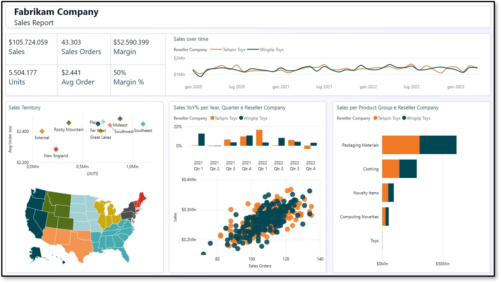

14.	Selezionare **No, accedi solo all'app** nella finestra di dialogo successiva. Si aprirà Power BI Desktop.
 
### Attività 2 - Analisi del report di Power BI Desktop
Il report seguente analizza le vendite per Fabrikam. I KPI sono elencati in alto a sinistra nella pagina. Gli oggetti visivi rimanenti evidenziano le vendite nel tempo, per area, gruppo di prodotti e azienda rivenditrice.

**Nota**: in questo corso di formazione ci concentreremo sull'acquisizione, la trasformazione e la modellazione dei dati mediante gli strumenti disponibili in Fabric. Non ci concentreremo sullo sviluppo di report né sullo spostamento al loro interno. Dedichiamo qualche minuto alla comprensione del report prima di procedere ai passaggi successivi.

1.	Analizziamo i dati per area di vendita. Selezionare **New England nel grafico a dispersione Sales Territory**. In Sales over time notare che il rivenditore Tailspin Toys presenta più vendite di Wingtip Toys in New England. Se si considera l'istogramma % vendite rispetto all'anno precedente, si noterà che la crescita delle vendite di Wingtip Toys è stata bassa ed è calata di trimestre nello scorso anno. Dopo un leggero rialzo nel terzo trimestre è nuovamente calata nel quarto.
 
    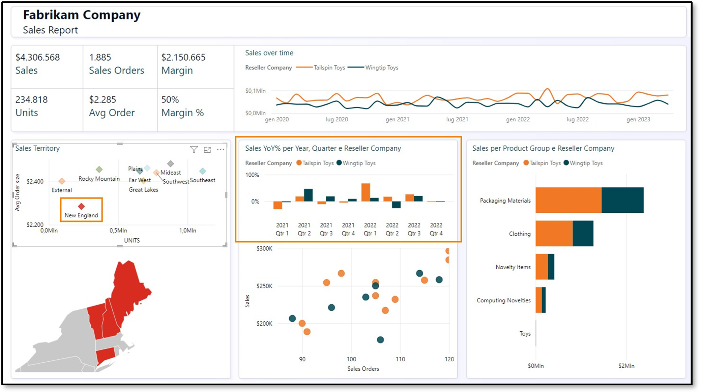
 
2.	Confrontiamo questi dati con l'area delle Montagne Rocciose. Selezionare **Rocky Mountain nel****grafico a dispersione Sales Territory**. Dall'istogramma % vendite rispetto all'anno precedente risulta che le vendite per Wingtip Toys sono aumentate notevolmente nel quarto trimestre del 2022 dopo essere state basse nei due trimestri precedenti.

    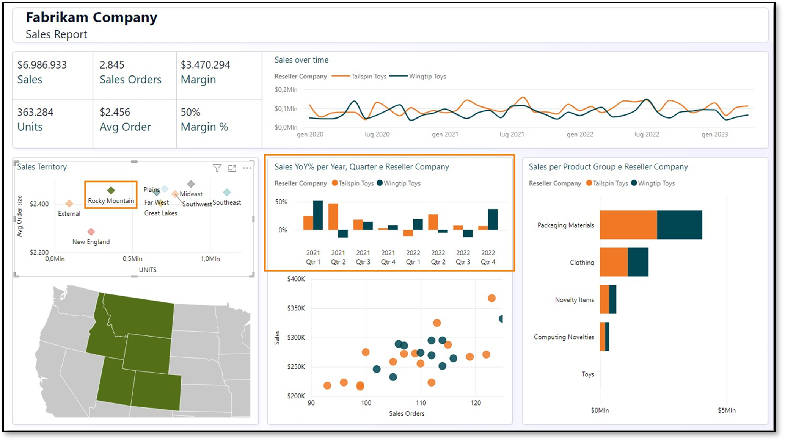

4.	Selezionare **Rocky Mountain in Sales Territory** per rimuovere il filtro.
   
6.	Nel grafico a dispersione in basso al centro della schermata (ordini cliente rispetto alle vendite)
selezionare l'outlier in alto a destra (4° quadrante). Notare che la percentuale di margine è il 52%, superiore alla media del 50%. Anche, la percentuale di vendite rispetto all'anno precedente è aumentata negli ultimi due trimestri del 2022.

    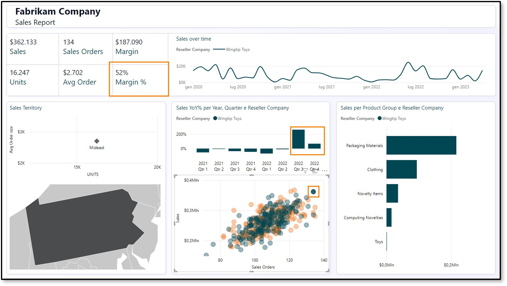
 
7.	Selezionare il rivenditore outlier nel grafico a dispersione per rimuovere il filtro.
8.	Otteniamo i dettagli del prodotto per gruppo di prodotti e rivenditore. Nel grafico a barre Vendite per gruppo di prodotti e azienda rivenditrice **fare clic con il pulsante destro del mouse sulla barra Packaging Materials per Tailspin Toys**x e nella finestra di dialogo selezionare **Drill-through -> Product Detail**.

    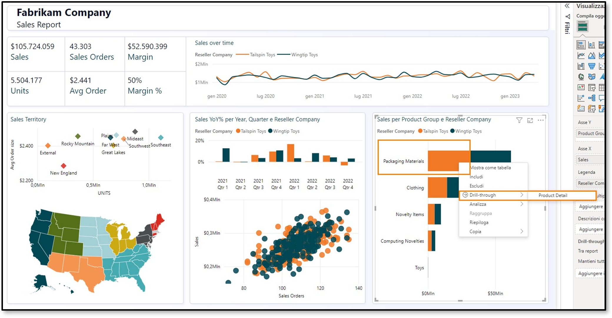

Si passerà alla pagina che fornisce i dettagli del prodotto. Notare che sono anche presenti alcuni ordini futuri.
 
7.	Dopo aver esaminato questa pagina, selezionare **CTRL + freccia indietro** in alto nella pagina per tornare al report vendite.

    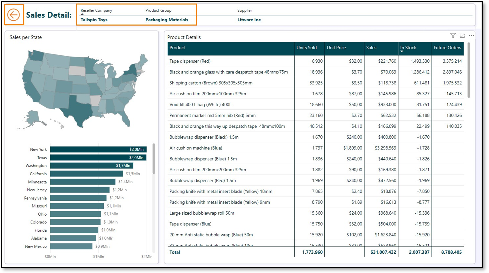

9.	Se lo si desidera, analizzare ulteriormente il report, dopodiché esamineremo la vista modello. Nel pannello a sinistra selezionare l'**icona della vista modello**. Notare che vi sono due tabelle dei fatti Sales e PO.
      a.	La granularità dei dati di Sales è per Date, Reseller, Product e People. Date, Reseller, Product e People si collegano a Sales.
      b.	La granularità dei dati di PO è per Date, Product e People. Date, Product e People si collegano a PO.
      c.	Abbiamo dati di Supplier per Product. Supplier si collega a Product.
      d.	Abbiamo dati località di Reseller per Geo. Geo si collega a Reseller.
      e.	Abbiamo informazioni di Customer per Reseller. Customer si collega a Reseller.
 
### Attività 3 - Analisi delle query in Power Query
1.	Osserviamo Power Query per comprendere le origini dati. Nella barra multifunzione selezionare
**Home -> Trasforma dati**.

     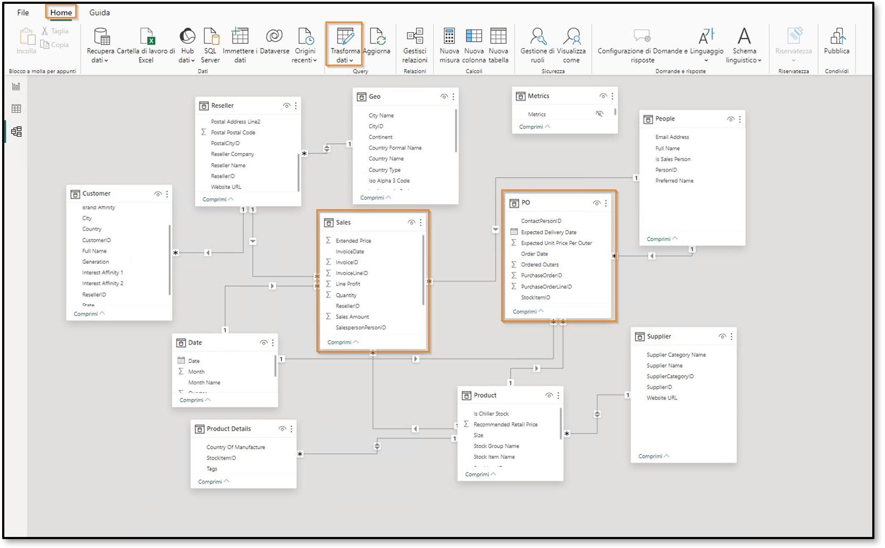

3.	Si apre la finestra Power Query. Nella barra multifunzione selezionare Home -> Impostazioni origine dati. Scorrendo l'elenco si noterà che vi sono quattro **origini dati**, come indicato
nell'esposizione del problema:
    a.	Snowflake
    b.	SharePoint
    c.	ADLS Gen2
    d.	Dataverse

5.	Selezionare **Chiudi** per chiudere la finestra di dialogo Impostazioni origine dati.

     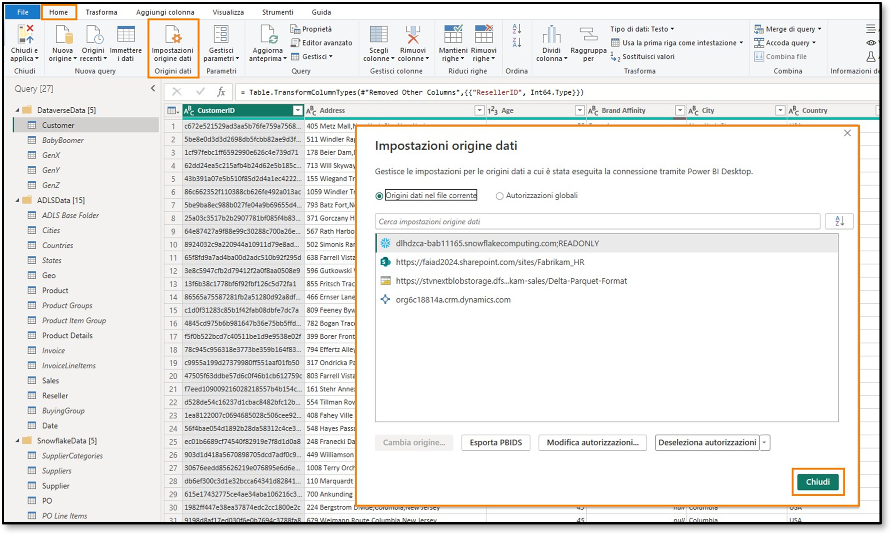
 
6.	Nel pannello Query a sinistra, notare che le query sono raggruppate per origine dati.
7.	Notare che la cartella **DataverseData** contiene dati sul cliente disponibili in quattro query
diverse: BabyBoomer, GenX, GenY e GenZ. Queste quattro query vengono aggiunte per creare la query Customer.
8.	È possibile immettere le credenziali per l'origine dati Dataverse immettendo **Nome utente** e **Password** disponibili nella scheda **Variabili di ambiente** (accanto alla guida al lab). Selezionare l'opzione dell'account Microsoft.

     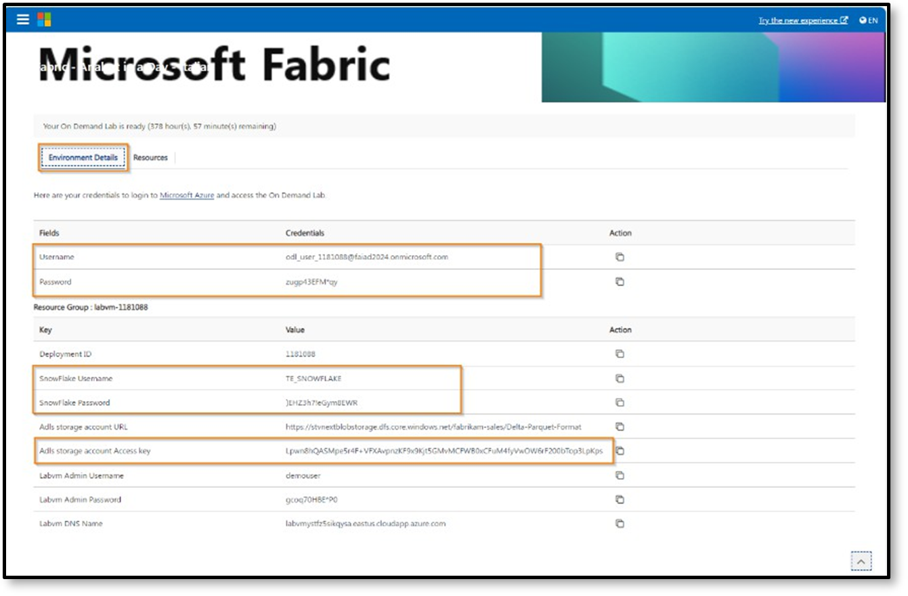
 
9.	Per l'origine dati ADLS, usare l'opzione **Chiave account** e immettere la **chiave di accesso**
**dell'account di archiviazione ADLS**, disponibile nella scheda **Variabili di ambiente** (accanto alla guida al lab).
10.	Notare che la cartella **ADLSData** include più dimensioni: Geo, Product, Reseller e Date. Include anche il fatto Sales.
a.	La **dimensione Geo** è creata unendo i dati dalle query Cities, Countries e States.
b.	La **dimensione Product** è creata unendo i dati dalle query Product Groups e Product Item Group.
c.	La **dimensione Reseller** è filtrata usando la query BuyingGroup.
d.	Il **fatto Sales** è creato unendo le query InvoiceLineItems e Invoice.
11.	Per l'origine dati Snowflake, usare il **Nome utente Snowflake** e la **Password Snowflake** disponibili nella scheda Variabili di ambiente (accanto alla guida al lab).
12.	Notare che la cartella **SnowflakeData** include la dimensione Supplier e il fatto PO (ordine/spesa).
a.	La **dimensione Supplier** è creata unendo le query Suppliers e SupplierCategories.
b.	Il **fatto PO** è creato unendo le query PO e PO Line Items.
13.	Per l'origine dati SharePoint, immettere il **Nome utente** e **la Password** disponibili nella scheda
Variabili di ambiente**** (accanto alla guida al lab). Selezionare l'opzione dell'account Microsoft.
14.	Notare che la cartella **SharepointData** include la dimensione People.

    
    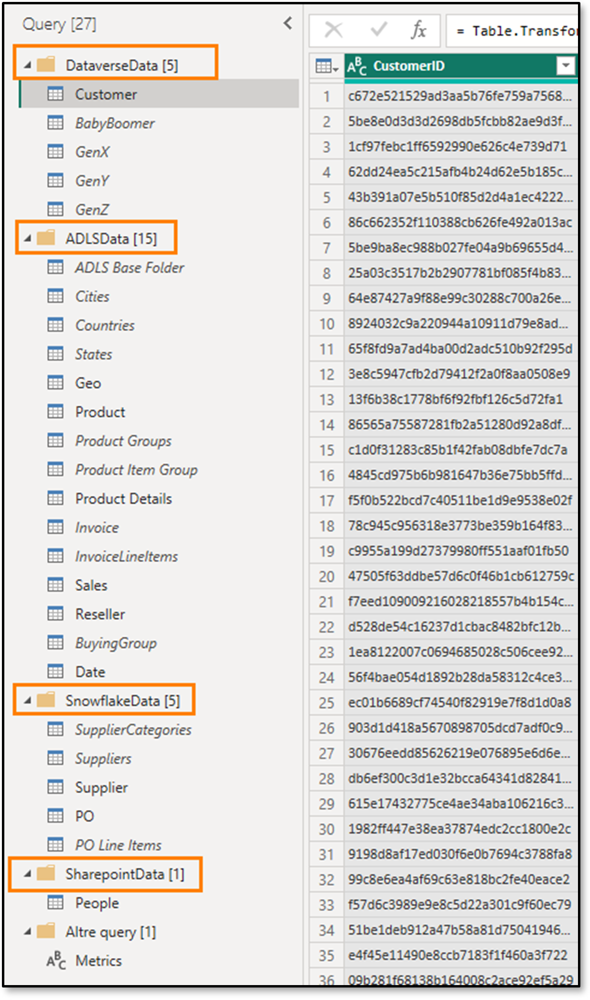
 
Ora conosciamo gli elementi con cui dobbiamo lavorare. Nel lab seguenti creeremo una query di Power Query analoga usando Flusso di dati Gen2 e un modello mediante Lakehouse.
 
## Riferimenti
Fabric Analyst in a Day (FAIAD) presenta alcune delle funzionalità chiave disponibili in Microsoft Fabric. Nel menu di servizio, la sezione Guida (?) include collegamenti ad alcune risorse utili.

   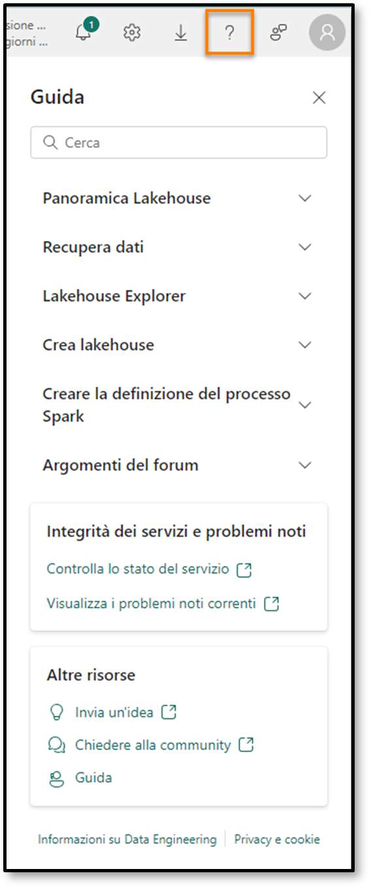
     
Di seguito sono riportate ulteriori risorse utili che consentiranno di progredire nell'uso di Microsoft Fabric. 
- Vedere il post di blog per leggere l'[annuncio completo sulla disponibilità generale di Microsof t Fabric](https://aka.ms/Fabric-Hero-Blog-Ignite23) 
- Esplorare Fabric attraverso la [Presentazione guidata](https://aka.ms/Fabric-GuidedTour) 
- Iscriversi alla [versione di valutazione gratuita di Microsof t Fabric](https://aka.ms/try-fabric) 
- Visitare il [sito Web di Microsof t Fabric](https://aka.ms/microsoft-fabric) 
- Acquisire nuove competenze esplorando i [moduli di apprendimento su Fabric](https://aka.ms/learn-fabric) 
- Consultare la [documentazione tecnica di Fabric](https://aka.ms/fabric-docs) 
- Leggere l'[e-book gratuito introduttivo a Fabric](https://aka.ms/fabric-get-started-ebook) 
- Unirsi alla [community di Fabric](https://aka.ms/fabric-community) per pubblicare domande, condividere feedback e imparare dagli altri 

Leggere i blog di annunci più approfonditi sull'esperienza in Fabric:

- [Blog sull'esperienza Data Factory in Fabric](https://aka.ms/Fabric-Data-Factory-Blog) 
- [Blog sull'esperienza Synapse Data Engineering in Fabric](https://aka.ms/Fabric-DE-Blog) 
- [Blog sull'esperienza Synapse Data Science in Fabric](https://aka.ms/Fabric-DS-Blog) 
- [Blog sull'esperienza Synapse Data Warehousing in Fabric](https://aka.ms/Fabric-DW-Blog) 
- [Blog sull'esperienza Synapse Real-Time Analytics in Fabric](https://aka.ms/Fabric-RTA-Blog) 
- [Blog di annunci di Power BI](https://aka.ms/Fabric-PBI-Blog) 
- [Blog sull'esperienza Data Activator in Fabric](https://aka.ms/Fabric-DA-Blog) 
- [Blog su amministrazione e governance in Fabric](https://aka.ms/Fabric-Admin-Gov-Blog) 
- [Blog su OneLake in Fabric](https://aka.ms/Fabric-OneLake-Blog) 
- [Blog sull'integrazione di Dataverse e Microsof t Fabric](https://aka.ms/Dataverse-Fabric-Blog) 

© 2023 Microsoft Corporation. Tutti i diritti sono riservati.
L'uso della demo/del lab implica l'accettazione delle seguenti condizioni:
La tecnologia/le funzionalità descritte nella demo/nel lab sono fornite da Microsoft Corporation allo scopo di ottenere feedback dall'utente e offrire un'esperienza di apprendimento. L'utilizzo della demo/del lab è consentito solo per la valutazione delle caratteristiche e delle funzionalità di tale tecnologia e per l'invio di feedback a Microsoft. L'utilizzo per qualsiasi altro scopo non è consentito. È vietato modificare, copiare, distribuire, trasmettere, visualizzare, eseguire,
riprodurre, pubblicare, concedere in licenza, usare per la creazione di lavori derivati, trasferire o vendere questa demo/questo lab o parte di essi.
SONO ESPLICITAMENTE PROIBITE LA COPIA E LA RIPRODUZIONE DELLA DEMO/DEL LAB (O DI QUALSIASI PARTE DI ESSI) IN QUALSIASI ALTRO SERVER O IN QUALSIASI ALTRA POSIZIONE PER ULTERIORE RIPRODUZIONE O RIDISTRIBUZIONE.
QUESTA DEMO/QUESTO LAB RENDONO DISPONIBILI TECNOLOGIE SOFTWARE/FUNZIONALITÀ DI PRODOTTO SPECIFICHE, INCLUSI NUOVI CONCETTI E NUOVE FUNZIONALITÀ POTENZIALI, IN UN AMBIENTE SIMULATO, CON UN'INSTALLAZIONE E UNA CONFIGURAZIONE PRIVE DI COMPLESSITÀ, PER GLI SCOPI DESCRITTI IN PRECEDENZA. LA TECNOLOGIA/I CONCETTI RAPPRESENTATI IN QUESTA DEMO/IN QUESTO LAB POTREBBERO NON CONTENERE LE FUNZIONALITÀ COMPLETE E IL LORO FUNZIONAMENTO POTREBBE NON ESSERE LO STESSO DELLA VERSIONE FINALE. È ANCHE POSSIBILE CHE UNA VERSIONE FINALE DI TALI FUNZIONALITÀ O CONCETTI NON VENGA RILASCIATA. L'ESPERIENZA D'USO DI TALI CARATTERISTICHE E FUNZIONALITÀ PUÒ INOLTRE RISULTARE DIVERSA IN UN AMBIENTE FISICO.
FEEDBACK. L'invio a Microsoft di feedback sulle caratteristiche, sulle funzionalità e/o sui concetti della tecnologia descritti in questa demo/questo lab implica la concessione a Microsoft, a titolo gratuito, del diritto di utilizzare, condividere e commercializzare tale feedback in qualsiasi modo e per qualsiasi scopo. Implica anche la concessione a titolo gratuito a terze parti del diritto di utilizzo di eventuali brevetti necessari per i loro prodotti, le loro tecnologie e i loro servizi al fine di utilizzare o interfacciarsi ai componenti software o ai servizi Microsoft specifici che includono il feedback. L'utente si impegna a non inviare feedback la cui inclusione all'interno di software o
documentazione Microsoft imponga a Microsoft di concedere in licenza a terze parti tale software o documentazione. Questi diritti sussisteranno anche dopo la scadenza del presente contratto.
 
CON LA PRESENTE MICROSOFT CORPORATION NON RICONOSCE ALCUNA GARANZIA O CONDIZIONE RELATIVAMENTE ALLA DEMO/AL LAB, INCLUSE TUTTE LE GARANZIE E CONDIZIONI DI COMMERCIABILITÀ, DI FATTO ESPRESSE, IMPLICITE O PRESCRITTE DALLA LEGGE, ADEGUATEZZA PER UNO SCOPO SPECIFICO, TITOLARITÀ E NON VIOLABILITÀ. MICROSOFT NON OFFRE GARANZIE O RAPPRESENTAZIONI IN RELAZIONE ALL'ACCURATEZZA DEI RISULTATI E DELL'OUTPUT DERIVANTI DALL'USO DELLA DEMO/DEL LAB O ALL'ADEGUATEZZA DELLE INFORMAZIONI CONTENUTE NELLA DEMO/NEL LAB PER QUALSIASI SCOPO.
CLAUSOLA DI RESPONSABILITÀ
Questa demo/questo lab contiene solo una parte delle nuove funzionalità e dei miglioramenti in Microsoft Power BI. Alcune funzionalità potrebbero cambiare nelle versioni future del prodotto. In questa demo/in questo lab si apprendono alcune delle nuove funzionalità, ma non tutte.

