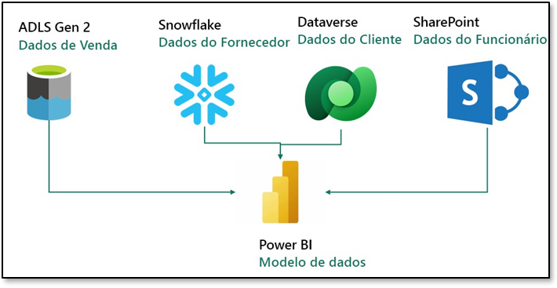

## Sumário
Estrutura do documento
Cenário/Declaração do problema
Visão geral do relatório do Power BI Desktop
  - Tarefa 1: Configurar o Power BI Desktop no ambiente de laboratório
  - Tarefa 2: Analisar relatório do Power BI Desktop
  - Tarefa 3: Revisar Power Queries
Referências

## Estrutura do documento
O laboratório inclui etapas a serem seguidas pelo usuário juntamente com as capturas de tela associadas que fornecem auxílio visual. Em cada captura de tela, as seções estão destacadas com caixas laranjas para indicar as áreas nas quais o usuário deve se concentrar.
## Cenário/Declaração do problema
A Fabrikam, Inc. é distribuidora atacadista de produtos inovadores. Como atacadista, os clientes da Fabrikam são principalmente empresas que revendem para pessoas físicas. A Fabrikam vende para clientes de varejo nos Estados Unidos, incluindo lojas especializadas, supermercados, lojas de informática e lojas de atrações turísticas. A Fabrikam também vende para outros atacadistas por meio de uma rede de agentes que promovem os produtos em nome da Fabrikam. Embora todos
os clientes da Fabrikam estejam atualmente nos Estados Unidos, a empresa pretende impulsionar a expansão para outros países/regiões.

Você é um Analista de Dados na equipe de Vendas. Você coleta, limpa e interpreta conjuntos de dados para resolver problemas de negócios. Você também reúne visualizações, como tabelas e gráficos, escreve relatórios e os apresenta aos tomadores de decisão na organização.

Para obter insights valiosos dos dados, você extrai dados de vários sistemas, limpa-os e combina-os. Você extrai dados das seguintes fontes:
  - **Dados de Venda:** são obtidos do sistema ERP e armazenados em um banco de dados ADLS Gen2 ou Databricks. Eles são atualizados ao meio-dia/12h, todos os dias.
  - **Dados do Fornecedor:** são obtidos de diferentes fornecedores e armazenados em um banco de dados Snowflake. São atualizados à meia-noite/24h, todos os dias.
  - **Dados do Cliente:** são obtidos do Customer Insights e armazenados no Dataverse. Os dados estão sempre atualizados.
  - **Dados do Funcionário:** são obtidos do sistema de RH e armazenados como um arquivo de exportação em uma pasta do SharePoint. São atualizados todas as manhãs, às 9h.

