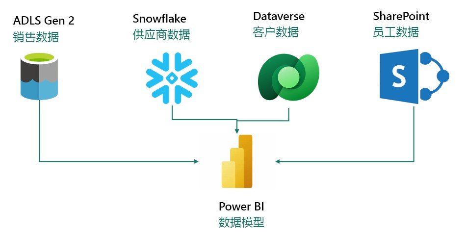
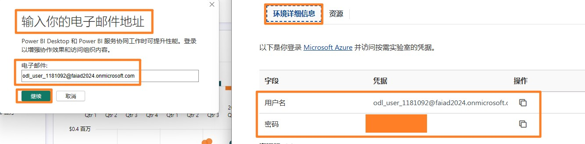

## 目录

- 文档结构

- 应用场景/问题陈述

- Power BI Desktop 报表概览

    - 任务 1：在实验环境中设置Power BI Desktop	

    - 任务 2：分析Power BI Desktop 报表	

    - 任务 3：查看Power Queries	
 
- 参考	

## 文档结构

本实验包含用户需要遵循的步骤以及可提供直观协助的关联屏幕截图。在每个屏幕截图中，以 橙色框突出显示的部分指出了用户应注意的区域。

## 应用场景/问题陈述
Fabrikam, Inc. 是一家经营创意商品的批发分销商。作为批发商，Fabrikam 的客户主要是向个人售卖商品的公司。Fabrikam  向美国各地的零售客户销售产品，这些客户包括专卖店、超市、计算 存储和景区商店。Fabrikam 还通过代表 Fabrikam 推广产品的代理商网络向其他批发商销售产 品。虽然 Fabrikam 的所有客户目前都位于美国，但该公司正打算将业务拓展到其他国家/地区。

您是销售团队的数据分析师。您收集、清理和解释数据集以解决业务问题。还整理图表和图形 等可视化对象，撰写报表，并呈现给组织中的决策者。

为了从数据中获得有价值的见解，您需要从多个系统中提取数据，对其进行清理并整理在一 起。您可以从以下来源提取数据：

- **销售数据**：来自 ERP 系统，数据存储在ADLS Gen2 数据库或 Databricks 中。每天中午
12 点更新。

- **供应商数据**：来自不同的供应商，数据存储在Snowflake 数据库中。每天凌晨12 点更新。

- **客户数据**：来自 Customer Insights，数据存储在 Dataverse 中。此数据随时更新。

-**员工数据**：来自HR 系统；作为导出文件存储在SharePoint 文件夹中。每天早上9 点更新。

您正在 Power BI Premium 上构建一个数据集，该数据集从上述源系统中提取数据，以满足您的报告需求并为最终用户提供自助服务功能。您使用Power Query 更新模型。

### 您面临以下几个挑战：

- 您每天要刷新数据集至少 3  次，以适应不同数据源的不同更新时间

- 刷新需要很长时间，因为您每次都需要完全刷新，以捕获源系统中的所有更新。

- 用于提取数据的任何数据源中一旦发生任何错误，都将导致数据集刷新中断。很多时 候，员工文件没有按时上传，导致数据集刷新中断。

- 由于数据量大且转换复杂，对数据模型进行任何更改都需要很长时间，因为Power Query 需要很长时间刷新预览。

- 您需要使用Windows PC 才能使用 Power BI Desktop，但企业标配的是 Mac。

您听说过 Microsoft  Fabric，并决定尝试一下，看看它能否解决您的挑战。

## Power BI Desktop 报表概览

在开始使用Fabric 之前，我们先来看看Power BI Desktop 中的当前报表，以了解转换和模型。

### 任务 1：在实验环境中设置Power BI Desktop

1.	打开 **FAIAD.pbix**，它位于您的实验环境的 **C:\FAIAD\Reports** 文件夹中。文件将在Power BI Desktop 中打开。

2.	“输入你的电子邮件地址”对话框随即打开。导航到实验环境右侧面板上的**环境详细信**息 选项卡。

3.	复制**用户名**，并将其粘贴到对话框的电子邮件地址文本框中。

4.	选择**继续**。

5.	“为您登录”对话框随即打开。选择**工作或学校帐户**。

6.	选择**继续**。

7.	登录对话框随即打开。通过从**环境详细信息**选项卡复制**用户名**的方式重新输入用户名。

8.	选择**下一步**。