> **Microsoft Fabric**
>
> Fabric Analyst in a Day Laboratorio 1
>
> Versión: Marzo de 2024
>
> Contenido

[Estructura del documento 3](#estructura-del-documento)

[Escenario/planteamiento del problema 3](#escenarioplanteamiento-del-problema)

[Información general del informe de Power BI Desktop 4](#información-general-del-informe-de-power-bi-desktop)

[Tarea 1: Configurar Power BI Desktop en un entorno de laboratorio 4](#tarea-1-configurar-power-bi-desktop-en-un-entorno-de-laboratorio)

[Tarea 2: Analizar el informe de Power BI Desktop 7](#tarea-2-analizar-el-informe-de-power-bi-desktop)

[Tarea 3: Revisar consultas de Power Query 11](#tarea-3-revisar-consultas-de-power-query)

[Referencias 15](#referencias)

# Estructura del documento

El laboratorio incluye pasos que el usuario debe seguir junto con capturas de pantalla asociadas que sirven de ayuda visual. En cada captura de pantalla, las secciones se resaltan con cuadros de color

naranja para indicar en qué áreas debe centrarse el usuario.

# Escenario/planteamiento del problema

Fabrikam, Inc. es un distribuidor mayorista de artículos novedosos. Como mayorista, los clientes de Fabrikam son en su mayoría empresas que revenden a particulares. Fabrikam vende a clientes minoristas en todo Estados Unidos, incluidas tiendas especializadas, supermercados, tiendas de

informática y tiendas de atracciones turísticas. Fabrikam también vende a otros mayoristas a través de una red de agentes que promocionan los productos en nombre de Fabrikam. Si bien todos los

clientes de Fabrikam tienen su sede actualmente en los Estados Unidos, la compañía tiene la intención de impulsar la expansión a otros países y regiones.

Es analista de datos en el equipo de ventas. Usted recopila, limpia e interpreta conjuntos de datos

para resolver problemas comerciales. También reúne visualizaciones como cuadros y gráficos, escribe informes y los presenta a los encargados de tomar decisiones de la organización.

Para extraer información valiosa de los datos, se extraen datos de varios sistemas, se limpian y se combinan. Extrae datos de los siguientes orígenes:

-   **Datos de ventas:** estos datos provienen del sistema ERP y los datos se almacenan en una base de datos ADLS Gen2 o Databricks. Se actualiza a mediodía/12:00 todos los días.

-   **Datos de proveedores:** estos datos provienen de diferentes proveedores y se almacenan en una base de datos de Snowflake. Se actualiza a medianoche/00:00 todos los días.

-   **Datos del cliente:** estos datos provienen de Customer Insights y se almacenan en Dataverse. Los datos siempre están actualizados.

-   **Datos de los empleados:** estos datos provienen del sistema de recursos humanos; se almacenan como un archivo de exportación en una carpeta de SharePoint. Se actualiza a todas las mañanas a las 9:00.

    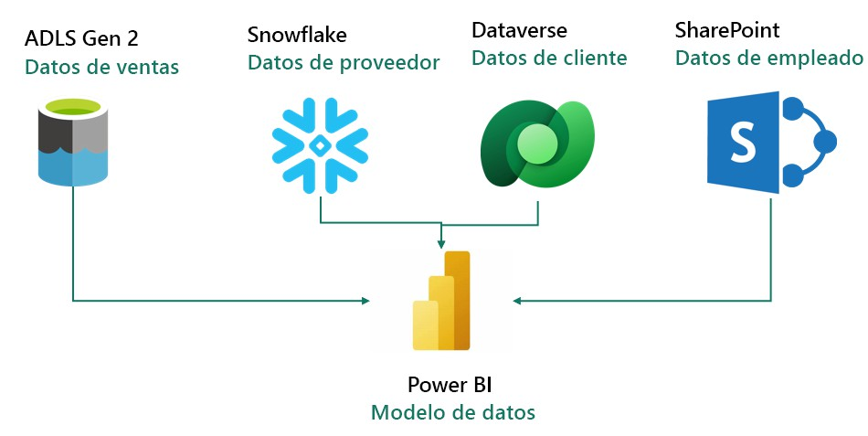

Actualmente está creando un conjunto de datos en Power BI Premium que extrae los datos de los sistemas de origen anteriores para satisfacer sus necesidades de informes y ofrecer a los usuarios finales la capacidad de autoservicio. Use Power Query para actualizar su modelo.

### Se enfrenta a lo siguiente:

-   Debe actualizar su conjunto de datos al menos tres veces al día para adaptarse a los diferentes tiempos de actualización para los diferentes orígenes de datos.

-   Sus actualizaciones tardan mucho tiempo, ya que necesita hacer una actualización completa cada vez para capturar cualquier actualización que haya ocurrido en los sistemas de origen.

-   Cualquier error en cualquiera de los orígenes de datos de los que extrae provocará que se interrumpa la actualización del conjunto de datos. Muchas veces, el archivo del empleado no se carga a tiempo, lo que provoca que se interrumpa la actualización del conjunto de datos.

-   Se necesita mucho tiempo para hacer cambios en su modelo de datos, ya que Power Query tarda mucho en actualizar sus versiones preliminares, dado el gran tamaño de los datos y las transformaciones complejas.

-   Necesita que un PC con Windows use Power BI Desktop aunque el estándar corporativo es Mac. Oyó hablar sobre Microsoft Fabric y decidió probar para ver si abordaba sus desafíos.

# Información general del informe de Power BI Desktop

Antes de comenzar con Fabric, veamos el informe actual en Power BI Desktop para comprender las transformaciones y el modelo.

## Tarea 1: Configurar Power BI Desktop en un entorno de laboratorio

1.  Abra **FAIAD.pbix** que se encuentra en la carpeta **C:\\FAIAD\\Reports** de su entorno de laboratorio. El archivo se abrirá en Power BI Desktop.

    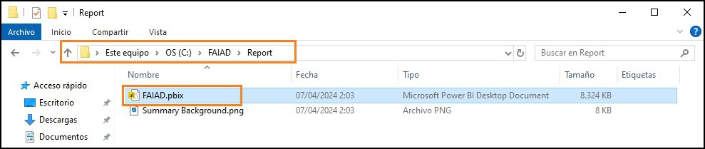

2.  Se abre el cuadro de diálogo Escriba su dirección de correo electrónico. Navegue a la pestaña

    **Detalles del ambiente** en el panel derecho del entorno de laboratorio.

3.  Copie las credenciales de **Nombre de usuario** y péguelas en el cuadro de texto Correo electrónico del cuadro de diálogo.

4.  Seleccione **Continuar**.

    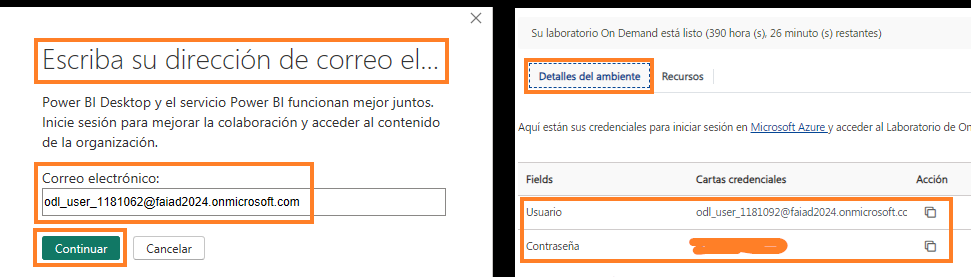

5.  Se abre el cuadro de diálogo Vamos a iniciar sesión. Seleccione **Cuenta profesional o educativa**.

6.  Seleccione **Continuar**.

    

7.  Se abre el cuadro de diálogo Iniciar sesión. Vuelva a introducir el **Nombre de usuario** copiándolo de la pestaña **Detalles del entorno**.

8.  Seleccione **Siguiente**.

    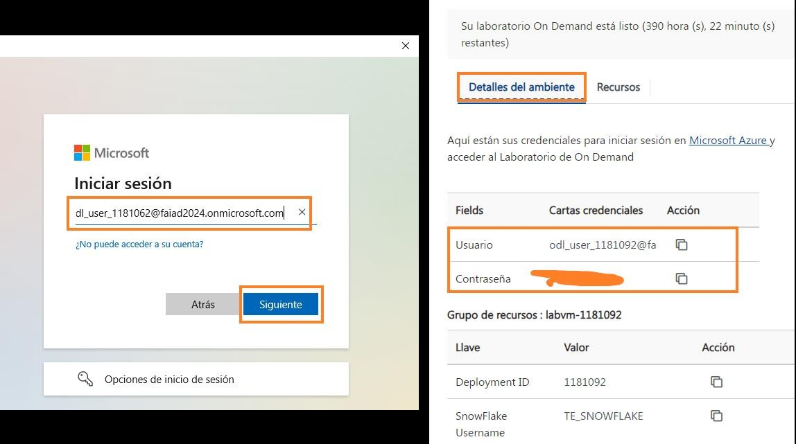

9.  En el siguiente cuadro de diálogo, introduzca las **Credenciales** de **Contraseña** de la pestaña **Detalles del entorno.**

10. Seleccione **Iniciar sesión**.

11. Se abre el cuadro de diálogo Action Required, que solicita configurar la autenticación multifactor. No necesitamos configurar esto, ya que se trata de un entorno de laboratorio. Seleccione **Ask later**.

    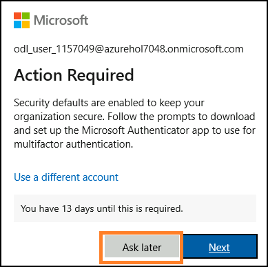

12. Seleccione **No, iniciar sesión solo en la aplicación** en el siguiente cuadro de diálogo. Ahora se abrirá Power BI Desktop.

## Tarea 2: Analizar el informe de Power BI Desktop

El siguiente informe analiza las ventas de Fabrikam. Los KPI se enumeran en la parte superior izquierda de la página. Los objetos visuales restantes resaltan Sales a lo largo del tiempo, por territorio, grupo de productos y empresa revendedora.

  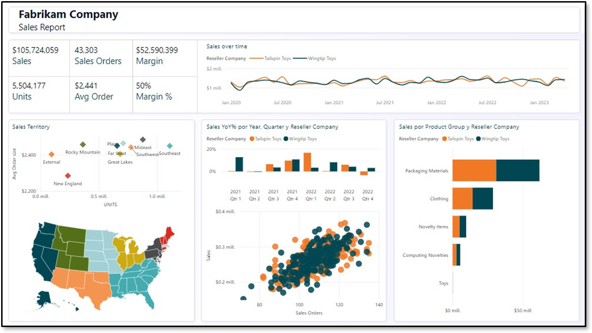

**Nota:** En esta capacitación, nos centraremos en la adquisición, transformación y modelado de datos mediante las herramientas disponibles en Fabric. No nos centraremos en el desarrollo de informes ni en la navegación. Dediquemos un par de minutos a comprender el informe y avancemos a los siguientes pasos.

1.  Analicemos los datos por zona de ventas. Seleccione **New England en el objeto visual Sales Territory** (gráfico de dispersión). Vea que en las Ventas a lo largo del tiempo, el revendedor
    Tailspin Toys tiene más ventas en comparación con Wingtip Toys en New England. Si observa el gráfico de columnas de YoY% de ventas, notará que el crecimiento de las ventas de Wingtip Toys ha sido bajo y ha disminuido trimestre tras trimestre durante el año pasado. Tras un pequeño repunte en el tercer trimestre, volvió a bajar en el cuarto.

    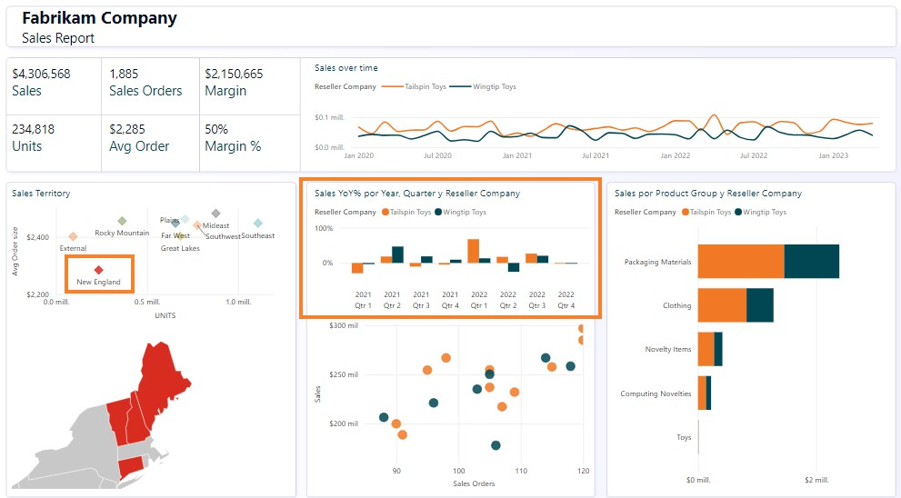

2.  Comparemos esto con la zona de las Rocky Mountains. Seleccione **Rocky Mountains en el objeto visual Sales Territory** (gráfico de dispersión). Observe que en el gráfico de columnas YoY% de ventas, las ventas de Wingtip Toys aumentaron drásticamente en el cuarto trimestre de 2022 después de haber sido bajas durante los dos trimestres anteriores.

    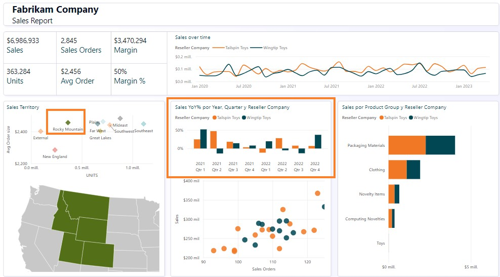  

3.  Seleccione **Rocky Mountains en el objeto visual Sales Territory** para eliminar el filtro.

4.  Desde el objeto visual Gráfico de dispersión en la parte inferior central de la pantalla (Pedidos de venta por Sales), seleccione el valor atípico en la parte superior derecha (4.^º^ cuadrante). Observe que el porcentaje de margen es del 52 %, que está por encima del promedio del 50 %. Además, el YoY% de ventas ha aumentado en los dos últimos trimestres de 2022.

    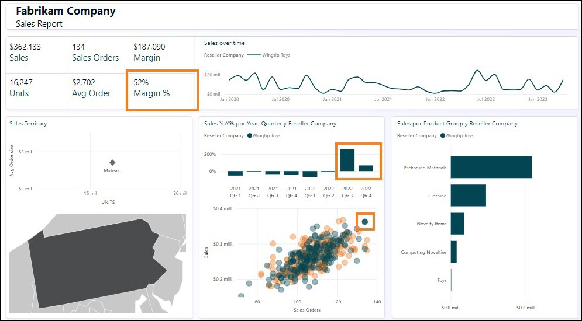

5.  Seleccione el revendedor atípico en el objeto visual del gráfico de dispersión para **eliminar el filtro**.

6.  Obtengamos los detalles del producto por grupo de productos y revendedor. En el objeto visual del gráfico de barras de Sales por Product Group y Reseller Company, **haga clic en la barra de Packaging Materials de Tailspin Toys** y, en el cuadro de diálogo, seleccione **Obtener detalles -\> Product Detail**.

    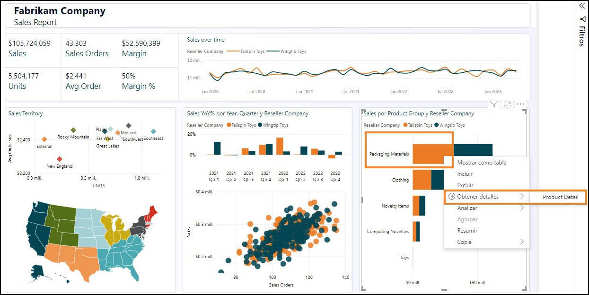

Se le dirigirá a la página que proporciona los detalles del producto. Tenga en cuenta que también hay algunos pedidos futuros.

7.  Una vez que haya terminado de revisar esta página, seleccione **Ctrl+flecha hacia atrás** en la parte superior derecha de la página para volver al informe de ventas.

    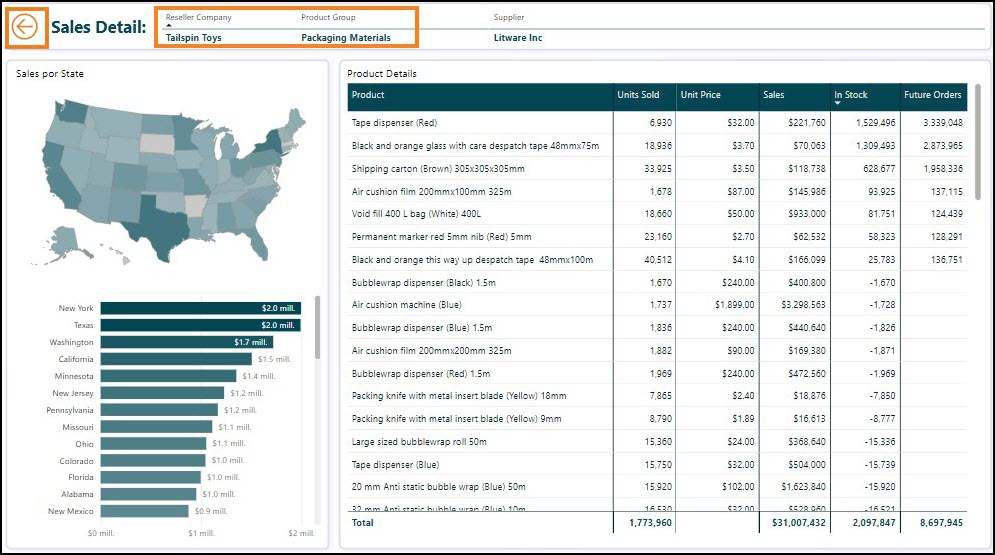

8.  Analice el informe a su gusto. Una vez listo, veamos la vista del modelo. En el panel de la izquierda, seleccione el icono **Vista del modelo**. Observe que hay dos tablas de hechos, Sales y PO.

    a.  La granularidad de Sales de ventas se organiza por Date,
        Reseller, Product y People. Date, Reseller, Product y People se
        conectan con Sales.

    b.  La granularidad de los datos de PO se organiza por Date, Product
        y People. Date, Product y People se conectan con PO.

    c.  Disponemos de datos de Supplier por Product. Supplier se conecta
        con Product.

    d.  Contamos con datos de ubicación de Reseller por Geo. Geo se
        conecta con Reseller.

    e.  Disponemos de información de Customer por Reseller. Customer se
        conecta con Reseller.

## Tarea 3: Revisar consultas de Power Query

1.  Echemos un vistazo a Power Query para entender los orígenes de datos. En la cinta de opciones, seleccione **Inicio -\> Transformar datos**.

    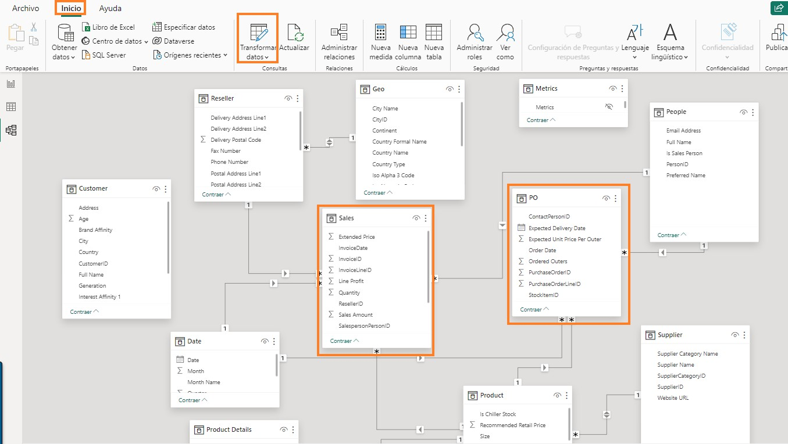

2.  Se abre la ventana de Power Query. En la cinta de opciones, seleccione **Inicio -\> Configuración de origen de datos**. Se abre el cuadro de diálogo Configuración de origen de datos. A medida que se desplaza por la lista, verá que hay cuatro orígenes de datos, como se menciona en el

    planteamiento del problema:

      a.  Snowflake

      b.  SharePoint

      c.  ADLS Gen2

      d.  Dataverse

3.  Seleccione **Cerrar** para cerrar el cuadro de diálogo Configuración del origen de datos.

    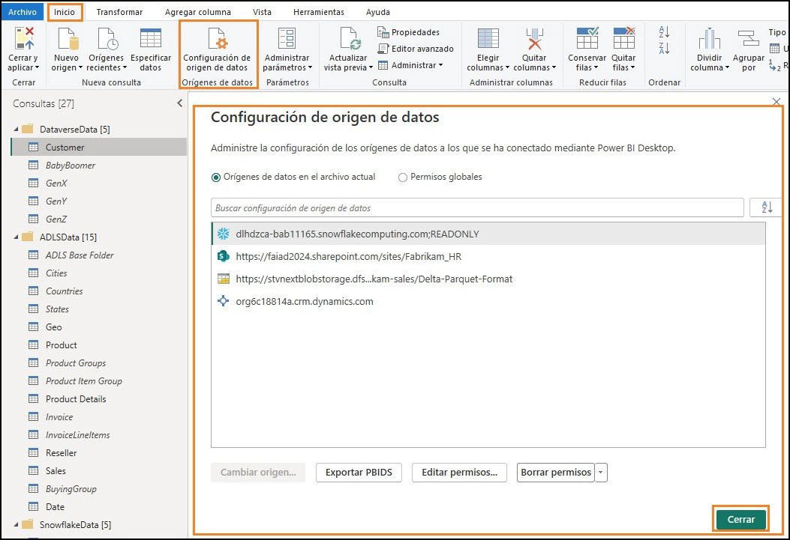

4.  En el panel Consultas de la izquierda, observe que las consultas están agrupadas por origen de datos.

5.  Vea que la carpeta **DataverseData** tiene datos del cliente disponibles en cuatro consultas diferentes: BabyBoomer, GenX, GenY y GenZ. Estas cuatro consultas se adjuntan para crear la consulta Customer.

6.  Puede introducir las credenciales para el origen de datos de Dataverse si escribe el **Nombre de usuario** y **Contraseña** disponibles en la pestaña **Variables de entorno** (junto a la Guía de laboratorio). Seleccione la opción de cuenta de Microsoft.

    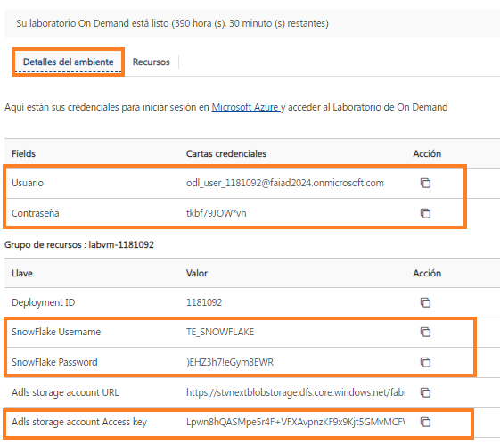

7.  Para el origen de datos ADLS, utilice la opción **Clave de cuenta** e introduzca la **Clave de acceso de la cuenta de almacenamiento de ADLS** que está disponible en las **Variables de entorno** (al lado de la Guía de laboratorio).

8.  Observe que la carpeta **ADLSData** tiene varias dimensiones: Geo, Product, Reseller y Date. También tiene datos de Sales.

    a. **Dimensión Geo** se crea mediante la combinación de datos de la consulta de Cities, Countries y States.

    b. **Dimensión de Product** se crea mediante la combinación de datos de la consulta Product Groups y Product Item Group.

    c. **Dimensión de Reseller** se filtra mediante la consulta BuyingGroup.

    d. **Datos de Sales** se crea mediante la combinación de InvoiceLineItems con la consulta Invoice.

9.  Para el origen de datos Snowflake, use el **SnowFlake Username** y la **SnowFlake Password**

    disponibles en la pestaña **Variables de entorno** (junto a la Guía de laboratorio).

10. Observe que la carpeta **SnowflakeData** tiene la dimensión Supplier y los datos de PO (pedido/gasto).

    a.  **Dimensión de Supplier** se crea mediante la combinación de la consulta de proveedores con la consulta SupplierCategories.

    b.  **Datos de PO** se crea mediante la combinación de PO con la consulta PO Line Items.

11. Para el origen de datos SharePoint, introduzca el **nombre de usuario** y la **contraseña** disponibles en la pestaña **Variables de entorno** (junto a la Guía de laboratorio). Seleccione la opción de cuenta de Microsoft.

12. Observe que la carpeta **SharepointData** tiene la dimensión People.

    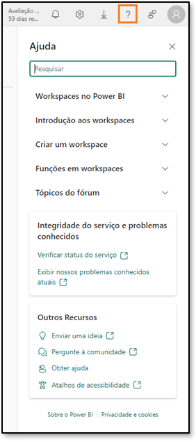

Ahora sabemos a qué nos enfrentamos. En los siguientes laboratorios, crearemos una consulta

de Power Query similar mediante el flujo de datos de segunda generación y un modelo mediante lakehouse.

# Referencias

Fabric Analyst in a Day (FAIAD) le presenta algunas funciones clave disponibles en Microsoft Fabric. En el menú del servicio, la sección Ayuda (?) tiene vínculos a algunos recursos excelentes.

  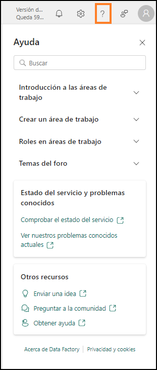

Estos son algunos recursos más que podrán ayudarle a seguir avanzando con Microsoft Fabric.

-   Vea la publicación del blog para leer el [anuncio de disponibilidad general de Microsoft Fabric](https://aka.ms/Fabric-Hero-Blog-Ignite23) completo.

-   Explore Fabric a través de la [Visita guiada](https://aka.ms/Fabric-GuidedTour)

-   Regístrese en la [prueba gratuita de Microsoft Fabric](https://aka.ms/try-fabric)

-   Visite el [sitio web de Microsoft Fabric](https://aka.ms/microsoft-fabric)

-   Adquiera nuevas capacidades mediante la exploración de los [módulos de aprendizaje de Fabric](https://aka.ms/learn-fabric)

-   Explore la [documentación técnica de Fabric](https://aka.ms/fabric-docs)

-   Lea el [libro electrónico gratuito sobre cómo empezar a usar Fabric](https://aka.ms/fabric-get-started-ebook)

-   Únase a la [comunidad de Fabric](https://aka.ms/fabric-community) para publicar sus preguntas, compartir sus comentarios y aprender de otros.

Obtenga más información en los blogs de anuncios de la experiencia Fabric:

-   [Experiencia de Data Factory en el blog de Fabric](https://aka.ms/Fabric-Data-Factory-Blog)

-   [Experiencia de Synapse Data Engineering en el blog de Fabric](https://aka.ms/Fabric-DE-Blog)

-   [Experiencia de Synapse Data Science en el blog de Fabric](https://aka.ms/Fabric-DS-Blog)

-   [Experiencia de Synapse Data Warehousing en el blog de Fabric](https://aka.ms/Fabric-DW-Blog)

-   [Experiencia de Synapse Real-Time Analytics en el blog de Fabric](https://aka.ms/Fabric-RTA-Blog)

-   [Blog de anuncios de Power BI](https://aka.ms/Fabric-PBI-Blog)

-   [Experiencia de Data Activator en el blog de Fabric](https://aka.ms/Fabric-DA-Blog)

-   [Administración y gobernanza en el blog de Fabric](https://aka.ms/Fabric-Admin-Gov-Blog)

-   [OneLake en el blog de Fabric](https://aka.ms/Fabric-OneLake-Blog)]

-   [Blog de integración de Dataverse y Microsoft Fabric](https://aka.ms/Dataverse-Fabric-Blog)

© 2023 Microsoft Corporation. Todos los derechos reservados.

Al participar en esta demostración o laboratorio práctico, acepta las siguientes condiciones:

Microsoft Corporation pone a su disposición la tecnología o funcionalidad descrita en esta demostración/laboratorio práctico con el fin de obtener comentarios por su parte y de facilitarle una experiencia de aprendizaje. Esta demostración/laboratorio práctico solo se puede usar para evaluar las características de tal tecnología o funcionalidad y para proporcionar comentarios a Microsoft. No se puede usar para ningún otro propósito. Ninguna parte de esta demostración/laboratorio práctico se puede modificar, copiar, distribuir, transmitir, mostrar, realizar, reproducir, publicar, licenciar, transferir ni vender, ni tampoco crear trabajos derivados de ella.

LA COPIA O REPRODUCCIÓN DE ESTA DEMOSTRACIÓN/LABORATORIO PRÁCTICO (O PARTE DE ELLA) EN CUALQUIER OTRO SERVIDOR O UBICACIÓN PARA SU REPRODUCCIÓN O DISTRIBUCIÓN POSTERIOR QUEDA EXPRESAMENTE PROHIBIDA.

ESTA DEMOSTRACIÓN/LABORATORIO PRÁCTICO PROPORCIONA CIERTAS FUNCIONES Y CARACTERÍSTICAS DE PRODUCTOS O TECNOLOGÍAS DE SOFTWARE (INCLUIDOS POSIBLES NUEVOS CONCEPTOS Y CARACTERÍSTICAS) EN UN ENTORNO SIMULADO SIN INSTALACIÓN O

CONFIGURACIÓN COMPLEJA PARA EL PROPÓSITO ARRIBA DESCRITO. LA TECNOLOGÍA/CONCEPTOS DESCRITOS EN ESTA DEMOSTRACIÓN/LABORATORIO PRÁCTICO NO REPRESENTAN LA

FUNCIONALIDAD COMPLETA DE LAS CARACTERÍSTICAS Y, EN ESTE SENTIDO, ES POSIBLE QUE NO FUNCIONEN DEL MODO EN QUE LO HARÁN EN UNA VERSIÓN FINAL. ASIMISMO, PUEDE QUE NO SE PUBLIQUE UNA VERSIÓN FINAL DE TALES CARACTERÍSTICAS O CONCEPTOS. DE IGUAL MODO, SU EXPERIENCIA CON EL USO DE ESTAS CARACTERÍSTICAS Y FUNCIONALIDADES EN UN ENTORNO FÍSICO PUEDE SER DIFERENTE.

**COMENTARIOS**. Si envía comentarios a Microsoft sobre las características, funcionalidades

o conceptos de tecnología descritos en esta demostración/laboratorio práctico, acepta otorgar a Microsoft, sin cargo alguno, el derecho a usar, compartir y comercializar sus comentarios de

cualquier modo y para cualquier fin. También concederá a terceros, sin cargo alguno, los derechos de patente necesarios para que sus productos, tecnologías y servicios usen o interactúen con cualquier parte específica de un software o servicio de Microsoft que incluya los comentarios.

No enviará comentarios que estén sujetos a una licencia que obligue a Microsoft a conceder su software o documentación bajo licencia a terceras partes porque incluyamos sus comentarios en ellos. Estos derechos seguirán vigentes después del vencimiento de este acuerdo.

MICROSOFT CORPORATION RENUNCIA POR LA PRESENTE A TODAS LAS GARANTÍAS Y CONDICIONES RELATIVAS A LA DEMOSTRACIÓN/LABORATORIO PRÁCTICO, INCLUIDA CUALQUIER GARANTÍA Y CONDICIÓN DE COMERCIABILIDAD (YA SEA EXPRESA, IMPLÍCITA O ESTATUTARIA), DE IDONEIDAD PARA UN FIN DETERMINADO, DE TITULARIDAD Y DE AUSENCIA DE INFRACCIÓN.

MICROSOFT NO DECLARA NI GARANTIZA LA EXACTITUD DE LOS RESULTADOS, EL RESULTADO DERIVADO DE LA REALIZACIÓN DE LA DEMOSTRACIÓN/LABORATORIO PRÁCTICO NI LA

IDONEIDAD DE LA INFORMACIÓN CONTENIDA EN ELLA CON NINGÚN PROPÓSITO.

### DECLINACIÓN DE RESPONSABILIDADES

Esta demostración/laboratorio práctico contiene solo una parte de las nuevas características y mejoras realizadas en Microsoft Power BI. Puede que algunas de las características cambien en versiones futuras del producto. En esta demostración/laboratorio práctico, conocerá algunas de estas nuevas características, pero no todas.
