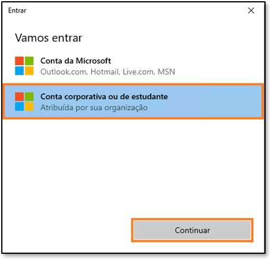

## Sumário
Estrutura do documento
Cenário/Declaração do problema
Visão geral do relatório do Power BI Desktop
  - Tarefa 1: Configurar o Power BI Desktop no ambiente de laboratório
  - Tarefa 2: Analisar relatório do Power BI Desktop
  - Tarefa 3: Revisar Power Queries
Referências

## Estrutura do documento
O laboratório inclui etapas a serem seguidas pelo usuário juntamente com as capturas de tela associadas que fornecem auxílio visual. Em cada captura de tela, as seções estão destacadas com caixas laranjas para indicar as áreas nas quais o usuário deve se concentrar.
## Cenário/Declaração do problema
A Fabrikam, Inc. é distribuidora atacadista de produtos inovadores. Como atacadista, os clientes da Fabrikam são principalmente empresas que revendem para pessoas físicas. A Fabrikam vende para clientes de varejo nos Estados Unidos, incluindo lojas especializadas, supermercados, lojas de informática e lojas de atrações turísticas. A Fabrikam também vende para outros atacadistas por meio de uma rede de agentes que promovem os produtos em nome da Fabrikam. Embora todos
os clientes da Fabrikam estejam atualmente nos Estados Unidos, a empresa pretende impulsionar a expansão para outros países/regiões.

Você é um Analista de Dados na equipe de Vendas. Você coleta, limpa e interpreta conjuntos de dados para resolver problemas de negócios. Você também reúne visualizações, como tabelas e gráficos, escreve relatórios e os apresenta aos tomadores de decisão na organização.

Para obter insights valiosos dos dados, você extrai dados de vários sistemas, limpa-os e combina-os. Você extrai dados das seguintes fontes:
  - **Dados de Venda:** são obtidos do sistema ERP e armazenados em um banco de dados ADLS Gen2 ou Databricks. Eles são atualizados ao meio-dia/12h, todos os dias.
  - **Dados do Fornecedor:** são obtidos de diferentes fornecedores e armazenados em um banco de dados Snowflake. São atualizados à meia-noite/24h, todos os dias.
  - **Dados do Cliente:** são obtidos do Customer Insights e armazenados no Dataverse. Os dados estão sempre atualizados.
  - **Dados do Funcionário:** são obtidos do sistema de RH e armazenados como um arquivo de exportação em uma pasta do SharePoint. São atualizados todas as manhãs, às 9h.

No momento, você está criando um conjunto de dados no Power BI Premium que extrai os dados dos sistemas de origem acima para que você possa gerar relatórios e fornecer aos usuários finais o recurso de autoatendimento. Você usa o Power Query para atualizar seu modelo.

### Você está enfrentando os seguintes desafios:
  - Você precisa atualizar seu conjunto de dados pelo menos três vezes por dia para acomodar os diferentes horários de atualização para as diferentes fontes de dados.
  - As atualizações podem demorar, pois é sempre necessário fazer uma atualização completa para capturar tudo o que foi atualizado nos sistemas de origem.
  - Os erros detectados em qualquer uma das fontes das quais você está extraindo dados
resultarão na interrupção da atualização do conjunto de dados. Muitas vezes o arquivo do funcionário não é carregado no prazo, resultando na interrupção da atualização do conjunto de dados.
  - As alterações no modelo de dados demoram muito tempo, pois o Power Query leva tempo para atualizar as versões preliminares devido aos tamanhos de dados grandes e às
transformações complexas.
  - Você precisa de um computador com Windows para usar o Power BI Desktop mesmo que o padrão corporativo seja Mac.

Você ouviu falar do Microsoft Fabric e decidiu tentar ver se ele resolverá seus desafios.
## Visão geral do relatório do Power BI Desktop
Antes de começarmos com o Fabric, vamos dar uma olhada no Relatório atual no Power BI Desktop para entender as transformações e o modelo.
### Tarefa 1: Configurar o Power BI Desktop no ambiente de laboratório
1.	Abra o arquivo **FAIAD.pbix** que está na pasta **C:\FAIAD\Reports** do seu ambiente de laboratório. O arquivo será aberto no Power BI Desktop.

2.	Insira seu endereço de email na caixa de diálogo aberta. Navegue até a guia **Environment Details**.
no painel direito do ambiente de laboratório.
3.	Copie os dados de **Username** e cole na caixa de texto Email da caixa de diálogo.
4.	Selecione **Continue**.

5.	A caixa de diálogo Vamos entrar é aberta. Selecione **Conta corporativa ou de estudante.**
6.	Selecione **Continuar.**

7.	A caixa de diálogo Sign in é aberta. Insira novamente os dados de **Username** copiando-os da guia **Environment Details.**
8.	Selecione **Next**.

9.	Na próxima caixa de diálogo, insira os dados de **Password Credentials** copiando-os da guia **Environment Details.**
10.	Selecione **Sign in**.
11.	A caixa de diálogo Action Required é aberta solicitando a configuração da autenticação multifator. Não precisamos configurar isso, pois estamos em um ambiente de laboratório. Selecione **Ask later**.

12.	Selecione **No, sign in the app only** na próxima caixa de diálogo. O Power BI Desktop será aberto.
### Tarefa 2: Analisar relatório do Power BI Desktop
O relatório abaixo analisa as Sales da Fabrikam. Os KPIs estão listados no canto superior esquerdo da página. Os visuais restantes destacam as Sales over time, por Territory, Product Group e Reseller Company.

**Observação:** Neste treinamento, estamos nos concentrando na aquisição, transformação e
modelagem de dados usando as ferramentas disponíveis no Fabric. Não nos concentraremos no desenvolvimento ou na navegação de relatórios. Vamos reservar alguns minutos para entender o relatório e passar para as próximas etapas.
1.	Vamos analisar os dados por Sales Territory. Selecione o visual **New England from the Sales
Territory** (gráfico de dispersão). Observe que em Sales over time, Reseller Tailspin Toys tem mais vendas em comparação com Wingtip Toys em New England. Se você olhar o gráfico de colunas Sales YoY%, notará que o crescimento das vendas da Wingtip Toys foi baixo e diminuiu trimestre após trimestre durante o ano passado. Depois de uma pequena recuperação no terceiro
trimestre, caiu novamente no quarto.
