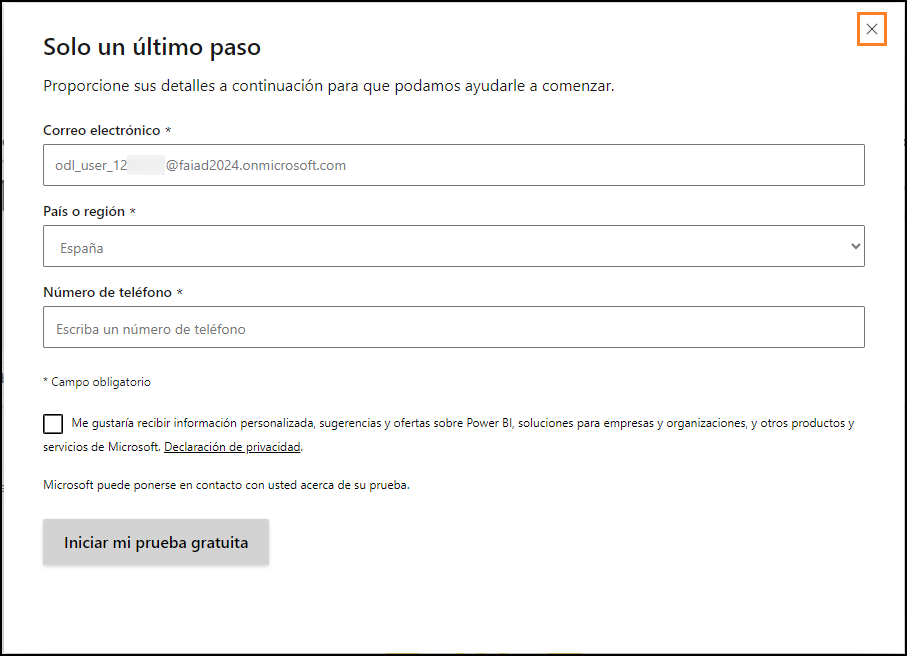
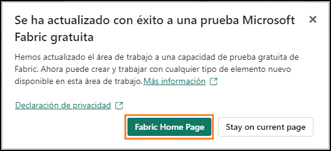
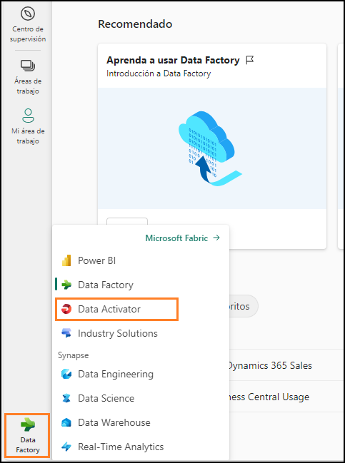
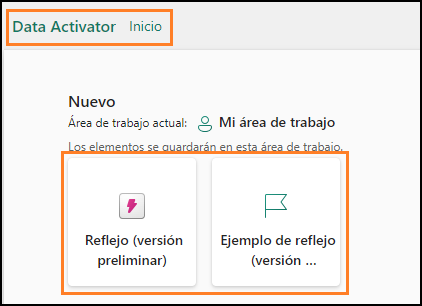
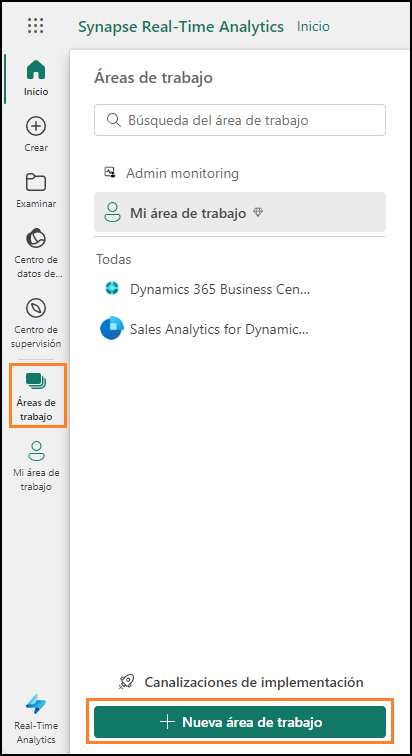
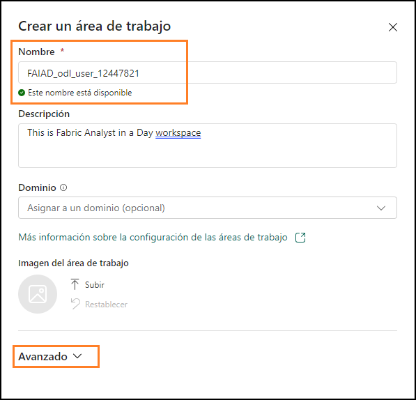
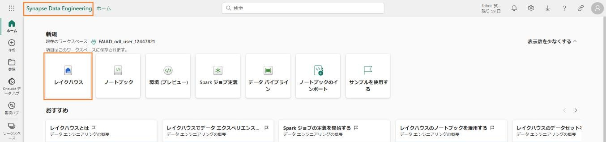

## Introduzione
 
Oggi si apprenderanno alcune funzionalità chiave di Microsoft Fabric. Questo è un workshop
introduttivo che ha lo scopo di presentare le diverse esperienze di uso del prodotto e i vari elementi disponibili in Fabric. Al termine del workshop, si imparerà a usare le funzionalità Lakehouse, Flusso di dati Gen2, Pipeline di dati e DirectLake.
In questo lab si imparerà a:
•	Creare un'area di lavoro Fabric
•	Creare un lakehouse

## Licenza di Fabric
## Attività 1 - Abilitazione di una licenza di valutazione per Microsoft Fabric
1.	Aprire il **browser** e andare all'indirizzo https://app.powerbi.com/. Si aprirà la pagina di accesso. **Nota**: se non si usa l'ambiente lab e si dispone di un account Power BI esistente, può essere opportuno usare il browser in modalità privata o in incognito.
2.	Immettere il **nome utente** disponibile nella scheda **Variabili di ambiente** (accanto alla Guida al lab) in **Email**, quindi fare clic su **Submit**.
3.	Si aprirà la schermata **Password**. Immettere la **Password** disponibile nella scheda **Variabili di ambiente** (accanto alla Guida al lab) fornita dall'istruttore.

   
   
4.	Fare clic su **Sign in** e seguire le istruzioni per accedere a Fabric.

   
   
5.	Si aprirà la **home page abituale del servizio Power BI**.
6.	Si presuppone che si abbia familiarità con il layout del servizio Power BI. Per eventuali domande, rivolgersi all'istruttore.A questo punto, ci si trova nell'Area di lavoro 
   personale. Per lavorare con gli elementi di Fabric, sono necessarie una licenza di valutazione e un'area di lavoro con licenza di Fabric. Avviare la configurazione.

   
  
8.	Nell'angolo in alto a destra della schermata selezionare l'**icona utente**.
9.	Selezionare **Start trial**.

   
    
10.	Si apre la finestra di dialogo Esegui l'aggiornamento a una versione di valutazione gratuita Microsoft Fabric. Selezionare **Avvia versione di valutazione**.

    
 
11.	Selezionare la **"X"** nell'angolo in alto a destra della finestra di dialogo **Solo un ultimo passaggio** per chiudere la finestra di dialogo. Non forniremo questi dettagli poiché si tratta di un ambiente lab.

    
    
12.	Si apre la finestra di dialogo Aggiornamento a una versione di valutazione gratuita Microsoft Fabric completato. Selezionare **Fabric Home Page**.

    
 
13.	Si aprirà la **home page** di **Microsoft Fabric**.

## Panoramica delle esperienze in Fabric
### Attività 2 - Esperienza Data Factory
1.	Selezionare l'icona di **Microsoft Fabric** (selettore esperienza in Fabric) in basso a sinistra della schermata. Si apre una finestra di dialogo contenente l'elenco delle esperienze in Fabric. Si noti che Power BI, Data Factory, Data Activator e Industry Solutions sono esperienze indipendenti. Data Engineering, Data Science, Data Warehouse e Real-Time Analytics sono esperienze di
   
Synapse e si basano su Synapse. Procediamo a esaminarle.
2.	Selezionare **Data Factory**.

   
 
3.	Si apre la **home page** di **Data Factory**. La pagina contiene tre sezioni principali.
       a.	**New**: elenca gli elementi disponibili in Data Factory, ossia Dataflow Gen2 e Data pipeline.
       i.	Dataflow Gen2 è la nuova generazione di Flusso di dati.
       ii.	Data pipeline si usa per l'orchestrazione dei dati.
       b.	**Recommended**: questa sezione fornisce accesso alla documentazione di apprendimento per l'avvio rapido.
       c.	**Quick access**: questa sezione elenca gli elementi preferiti o usati di recente.

   
   
### Attività 3 - Esperienza Data Activator
1.	Selezionare l'icona **selettore esperienza in Fabric** (attualmente impostata su Data Factory) in basso a sinistra della schermata. Si apre la finestra di dialogo delle esperienze in Fabric.

   
 
2.	Selezionare **Data Activator**00 nella finestra di dialogo. Si apre la **home page di Data Activator**. Data Activator è un'esperienza senza codice in Microsoft Fabric che consente di effettuare automaticamente azioni quando vengono rilevati schemi o condizioni nei dati che cambiano. Notare che le tre sezioni sono analoghe all'esperienza Data Factory. Nella sezione Nuovo osservare gli elementi: 
     a.	**Reflex**: consente di monitorare set di dati, query e flussi di eventi per individuare schemi. 
     b.	**Esempio di Reflex**: soluzione di esempio. 

   

### Attività 4 - Esperienza Industry Solutions
1.	Selezionare l'icona **selettore esperienza in Fabric** (attualmente impostata su Data Activator) in basso a sinistra della schermata. Si apre la finestra di dialogo delle esperienze in Fabric.
2.	Selezionare **Industry Solutions** nella finestra di dialogo. Si apre la **home page di Industry Solutions**. Microsoft Fabric include soluzioni di dati specifiche del settore che offrono una piattaforma affidabile per la gestione dei dati, l'analisi e il processo decisionale. Queste soluzioni di dati risolvono le problematiche specifiche affrontate da diversi settori, permettendo alle aziende di ottimizzare le operazioni, integrare dati provenienti da origini diverse e usare analisi avanzate. Si noti che le tre sezioni sono analoghe alle esperienze precedenti. Nella sezione Nuovo osservare gli elementi: 
        a.	Soluzioni per la sostenibilità: supporta l'inserimento, la standardizzazione e l'analisi di dati ambientali, sociali e di governance (ESG). 
        b.	Soluzioni retail: permette di gestire grandi volumi di dati, di integrare dati provenienti da origini varie e di fornire analisi in tempo reale per un processo decisionale 
           rapido etempestivo. I rivenditori possono usare queste soluzioni per l'ottimizzazione delle scorte, la segmentazione dei clienti, la previsione delle vendite, la 
           determinazione dinamica  dei prezzi e il rilevamento delle frodi. 
         
   

### Attività 5 - Esperienza Synapse Data Engineering
1.	Selezionare l'icona **selettore esperienza in Fabric** (attualmente impostata su Industry Solutions) in basso a sinistra della schermata. Si apre la finestra di dialogo delle esperienze in Fabric.
2.	Selezionare **Data Engineering**. Si apre la **home page di Data Engineering**. Anche in questo caso, la pagina contiene tre sezioni principali. Nella sezione New osservare gli elementi:
      a.	**Lakehouse**: permette di archiviare Big Data per operazioni di pulizia, query, reporting e condivisione. 
      b.	**Notebook**: usato per l'inserimento, la preparazione, l'analisi e altre attività correlate ai dati usando linguaggi vari come Python, R e Scala. 
      c.	**Environment**: usato per configurare librerie condivise, impostazioni di calcolo Spark e risorse per notebook e definizioni di processi Spark. 
      d.	**Spark Job Definition**: permette di definire, pianificare e gestire i processi Apache. 
      e.	**Data pipeline**: permette di orchestrare la soluzione di dati. 
      f.	**Import notebook**: permette di importare notebook dal computer locale. 
      g.	**Use a sample**: soluzione di esempio. 
 
   

### Attività 6 - Esperienza Synapse Data Science
1.	Selezionare l'icona selettore esperienza in Fabric (attualmente impostata su Data Engineering) in basso a sinistra della schermata. Si apre la finestra di dialogo delle esperienze in Fabric.
2.	Selezionare Data Science. Si apre la home page di Data Science. Anche in questo caso sono presenti tre sezioni. Nella sezione New osservare gli elementi:
    a.	**ML model**: consente di creare modelli di Machine Learning.
    b.	**Experiment**: consente di creare, eseguire e monitorare lo sviluppo di più modelli.
    c.	**Notebook**: permette di esplorare dati e creare soluzioni di Machine Learning.
    d.	**Environment**: usato per configurare librerie condivise, impostazioni di calcolo Spark e risorse per notebook e definizioni di processi Spark.
    e.	**Import notebook**: permette di importare notebook dal computer locale.
    f.	**Use a sample**: soluzione di esempio.
**Nota**: elementi come Notebook, Environment, Data pipeline e così via sono disponibili in più esperienze poiché sono rilevanti in ciascuna di esse.
 
   

### Attività 7 - Esperienza Synapse Data Warehouse
1.	Selezionare l'icona **selettore esperienza in Fabric** (attualmente impostata su Data Science) in basso a sinistra della schermata. Si apre la finestra di dialogo delle esperienze in Fabric.
2.	Selezionare **Data Warehouse**. Si apre la **home page di Data Warehouse**. Anche in questo caso sono presenti tre sezioni. Nella sezione Nuovo osservare gli elementi:
      a.	**Data warehouse**: permette di creare un Data Warehouse.
      b.	**Pipeline di dati**: permette di orchestrare la soluzione di dati.
 
   

### Attività 8 - Esperienza Real-Time Analytics
1.	Selezionare l'icona **selettore esperienza in Fabric** (attualmente impostata su Data Warehouse) in basso a sinistra della schermata. Si apre la finestra di dialogo delle esperienze in Fabric.
2.	Selezionare **Real-Time Analytics**. Si apre la **home page di Real-Time Analytics**. Anche in questo caso sono presenti tre sezioni. Nella sezione Nuovo osservare gli elementi:
         a.	**Casa eventi**: permette di creare un'area di lavoro di database, che è possibile condividere tra progetti.
         b.	**Database KQL**: permette di caricare rapidamente e di archiviare dati strutturati, non strutturati e in streaming per l'esecuzione di query.
         c.	**Set di query KQL**: consente di eseguire query sui dati per produrre tabelle e oggetti visivi condivisibili.
         d.	**Eventstream**: permette di acquisire, trasformare e instradare il flusso di eventi in tempo reale.
         e.	**Usare un esempio**: soluzione di esempio.
 
   

## Area di lavoro di Fabric
### Attività 9 - Creazione di un'area di lavoro di Fabric
1.	Ora creeremo un'area di lavoro con licenza di Fabric. Selezionare** Aree di lavoro** nella barra di spostamento a sinistra. Si apre una finestra di dialogo.
2.	Selezionare **Nuova area di lavoro**.

   
 
3.	Si apre la finestra di dialogo **Crea un'area di lavoro** sul lato destro del browser.
4.	Nel campo **Nome** immettere **FAIAD_<nome utente>**
**Nota**: il nome dell'area di lavoro deve essere univoco. Tuttavia, il nome dell'area di lavoro usato deve essere diverso. Assicurarsi che sotto il campo Nome sia presente un segno di spunta verde e che sia indicato **"Questo nome è disponibile".**
5.	Se lo si desidera, è possibile immettere una Descrizione per l'area di lavoro. Questo campo è facoltativo.

   
   
7.	Fare clic su **Avanzate** per espandere la sezione.
8.	In **License mode** assicurarsi che si sia selezionato **Trial** (deve essere selezionato per impostazione predefinita).

   
 
10.	Selezionare **Apply** per creare una nuova area di lavoro.
Viene creata una nuova area di lavoro e si passa a tale area di lavoro. Importeremo dati da diverse origini dati in Lakehouse e useremo i dati da Lakehouse per creare il modello e il report relativi. Il primo passaggio consiste nel creare un Lakehouse.

### Attività 10 - Creazione di un Lakehouse
1.	Selezionare l'icona **selettore esperienza in Fabric** (attualmente impostata su Real-Time Analytics) in basso a sinistra della schermata. Si apre la finestra di dialogo delle esperienze in Fabric.
2.	Selezionare **Data Engineering** per andare alla home page di Data Engineering.

   
 
3.	Selezionare **Lakehouse**.

   
     
4.	Si apre la finestra di dialogo New lakehouse. Digitare **lh_FAIAD** nella casella di testo Name.
   
 **Nota**: lh indica Lakehouse. Aggiungiamo il prefisso lh per agevolarne l'identificazione e la ricerca.

   
   
6.	Selezionare **Create**.
Dopo qualche istante viene creato un lakehouse e si passerà all'interfaccia di Lakehouse.
Nel **pannello sinistro** notare che sotto all'area di lavoro è ancora presente l'icona di Lakehouse. È possibile passare agevolmente a Lakehouse facendo clic su questa icona in qualsiasi momento.

   
     
Nell'interfaccia di esplorazione di Lakehouse si noteranno **Tables e Files**. Lakehouse può esporre file di Azure Data Lake Storage Gen2 nella sezione file oppure un flusso di dati può caricare dati nelle tabelle di Lakehouse. Sono disponibili varie opzioni. Mostreremo alcune di queste opzioni nei lab seguenti.
In questo lab abbiamo esplorato l'interfaccia di Fabric, creato uno spazio di lavoro di Fabric e un
lakehouse. Nel prossimo lab si imparerà a usare Flusso di dati Gen2 per connettersi ad ADLS Gen2 per estrarre, trasformare e inserire dati nel lakehouse.
 
## Riferimenti
Fabric Analyst in a Day (FAIAD) presenta alcune delle funzionalità chiave disponibili in Microsoft Fabric. Nel menu di servizio, la sezione Guida (?) include collegamenti ad alcune risorse utili.

  

Di seguito sono riportate ulteriori risorse utili che consentiranno di progredire nell'uso di Microsoft Fabric. 
- Vedere il post di blog per leggere l'[annuncio completo sulla disponibilità generale di Microsof t Fabric](https://aka.ms/Fabric-Hero-Blog-Ignite23) 
- Esplorare Fabric attraverso la [Presentazione guidata](https://aka.ms/Fabric-GuidedTour) 
- Iscriversi alla [versione di valutazione gratuita di Microsof t Fabric](https://aka.ms/try-fabric) 
- Visitare il [sito Web di Microsof t Fabric](https://aka.ms/microsoft-fabric) 
- Acquisire nuove competenze esplorando i [moduli di apprendimento su Fabric](https://aka.ms/learn-fabric) 
- Consultare la [documentazione tecnica di Fabric](https://aka.ms/fabric-docs) 
- Leggere l'[e-book gratuito introduttivo a Fabric](https://aka.ms/fabric-get-started-ebook) 
- Unirsi alla [community di Fabric](https://aka.ms/fabric-community) per pubblicare domande, condividere feedback e imparare dagli altri 

Leggere i blog di annunci più approfonditi sull'esperienza in Fabric:

- [Blog sull'esperienza Data Factory in Fabric](https://aka.ms/Fabric-Data-Factory-Blog) 
- [Blog sull'esperienza Synapse Data Engineering in Fabric](https://aka.ms/Fabric-DE-Blog) 
- [Blog sull'esperienza Synapse Data Science in Fabric](https://aka.ms/Fabric-DS-Blog) 
- [Blog sull'esperienza Synapse Data Warehousing in Fabric](https://aka.ms/Fabric-DW-Blog) 
- [Blog sull'esperienza Synapse Real-Time Analytics in Fabric](https://aka.ms/Fabric-RTA-Blog) 
- [Blog di annunci di Power BI](https://aka.ms/Fabric-PBI-Blog) 
- [Blog sull'esperienza Data Activator in Fabric](https://aka.ms/Fabric-DA-Blog) 
- [Blog su amministrazione e governance in Fabric](https://aka.ms/Fabric-Admin-Gov-Blog) 
- [Blog su OneLake in Fabric](https://aka.ms/Fabric-OneLake-Blog) 
- [Blog sull'integrazione di Dataverse e Microsof t Fabric](https://aka.ms/Dataverse-Fabric-Blog) 

© 2023 Microsoft Corporation. Tutti i diritti sono riservati.
L'uso della demo/del lab implica l'accettazione delle seguenti condizioni:
La tecnologia/le funzionalità descritte nella demo/nel lab sono fornite da Microsoft Corporation allo scopo di ottenere feedback dall'utente e offrire un'esperienza di apprendimento. L'utilizzo della demo/del lab è consentito solo per la valutazione delle caratteristiche e delle funzionalità di tale tecnologia e per l'invio di feedback a Microsoft. L'utilizzo per qualsiasi altro scopo non è
consentito. È vietato modificare, copiare, distribuire, trasmettere, visualizzare, eseguire, riprodurre, pubblicare, concedere in licenza, usare per la creazione di lavori derivati, trasferire o vendere questa demo/questo lab o parte di essi.
SONO ESPLICITAMENTE PROIBITE LA COPIA E LA RIPRODUZIONE DELLA DEMO/DEL LAB (O DI QUALSIASI PARTE DI ESSI) IN QUALSIASI ALTRO SERVER O IN QUALSIASI ALTRA POSIZIONE PER ULTERIORE RIPRODUZIONE O RIDISTRIBUZIONE.
QUESTA DEMO/QUESTO LAB RENDONO DISPONIBILI TECNOLOGIE SOFTWARE/FUNZIONALITÀ DI PRODOTTO SPECIFICHE, INCLUSI NUOVI CONCETTI E NUOVE FUNZIONALITÀ POTENZIALI, IN UN
AMBIENTE SIMULATO, CON UN'INSTALLAZIONE E UNA CONFIGURAZIONE PRIVE DI COMPLESSITÀ, PER GLI SCOPI DESCRITTI IN PRECEDENZA. LA TECNOLOGIA/I CONCETTI RAPPRESENTATI IN
QUESTA DEMO/IN QUESTO LAB POTREBBERO NON CONTENERE LE FUNZIONALITÀ COMPLETE E
IL LORO FUNZIONAMENTO POTREBBE NON ESSERE LO STESSO DELLA VERSIONE FINALE. È ANCHE POSSIBILE CHE UNA VERSIONE FINALE DI TALI FUNZIONALITÀ O CONCETTI NON VENGA
RILASCIATA. L'ESPERIENZA D'USO DI TALI CARATTERISTICHE E FUNZIONALITÀ PUÒ INOLTRE RISULTARE DIVERSA IN UN AMBIENTE FISICO.
FEEDBACK. L'invio a Microsoft di feedback sulle caratteristiche, sulle funzionalità e/o sui concetti della tecnologia descritti in questa demo/questo lab implica la concessione a Microsoft, a titolo gratuito, del diritto di utilizzare, condividere e commercializzare tale feedback in qualsiasi modo e per qualsiasi scopo. Implica anche la concessione a titolo gratuito a terze parti del diritto di utilizzo di eventuali brevetti necessari per i loro prodotti, le loro tecnologie e i loro servizi al fine di utilizzare o interfacciarsi ai componenti software o ai servizi Microsoft specifici che includono il feedback. L'utente si impegna a non inviare feedback la cui inclusione all'interno di software o documentazione Microsoft imponga a Microsoft di concedere in licenza a terze parti tale software o documentazione. Questi diritti sussisteranno anche dopo la scadenza del presente contratto.
 
CON LA PRESENTE MICROSOFT CORPORATION NON RICONOSCE ALCUNA GARANZIA O CONDIZIONE RELATIVAMENTE ALLA DEMO/AL LAB, INCLUSE TUTTE LE GARANZIE E CONDIZIONI DI COMMERCIABILITÀ, DI FATTO ESPRESSE, IMPLICITE O PRESCRITTE DALLA LEGGE, ADEGUATEZZA PER UNO SCOPO SPECIFICO, TITOLARITÀ E NON VIOLABILITÀ. MICROSOFT NON OFFRE GARANZIE O RAPPRESENTAZIONI IN RELAZIONE ALL'ACCURATEZZA DEI RISULTATI E DELL'OUTPUT DERIVANTI DALL'USO DELLA DEMO/DEL LAB O ALL'ADEGUATEZZA DELLE INFORMAZIONI CONTENUTE NELLA DEMO/NEL LAB PER QUALSIASI SCOPO.
CLAUSOLA DI RESPONSABILITÀ
Questa demo/questo lab contiene solo una parte delle nuove funzionalità e dei miglioramenti in Microsoft Power BI. Alcune funzionalità potrebbero cambiare nelle versioni future del prodotto. In questa demo/in questo lab si apprendono alcune delle nuove funzionalità, ma non tutte.
