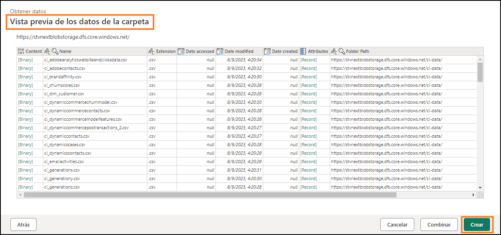
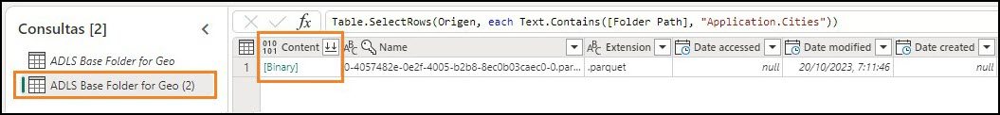
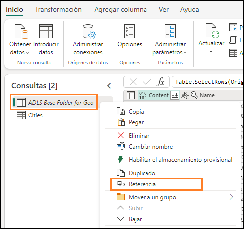
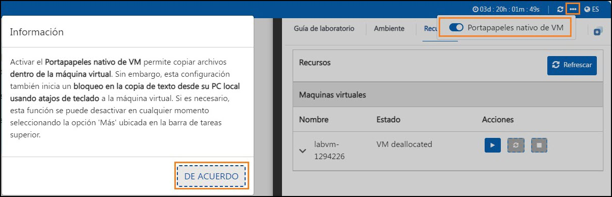
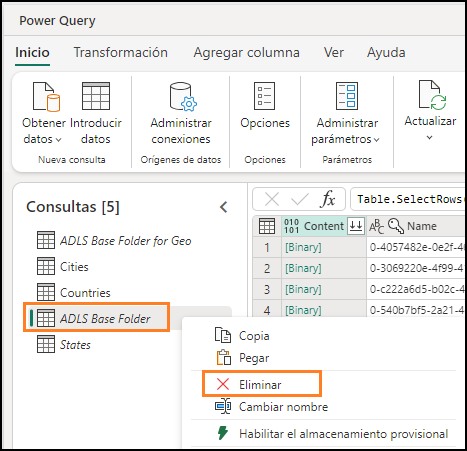
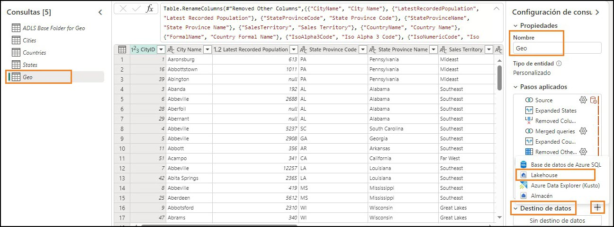
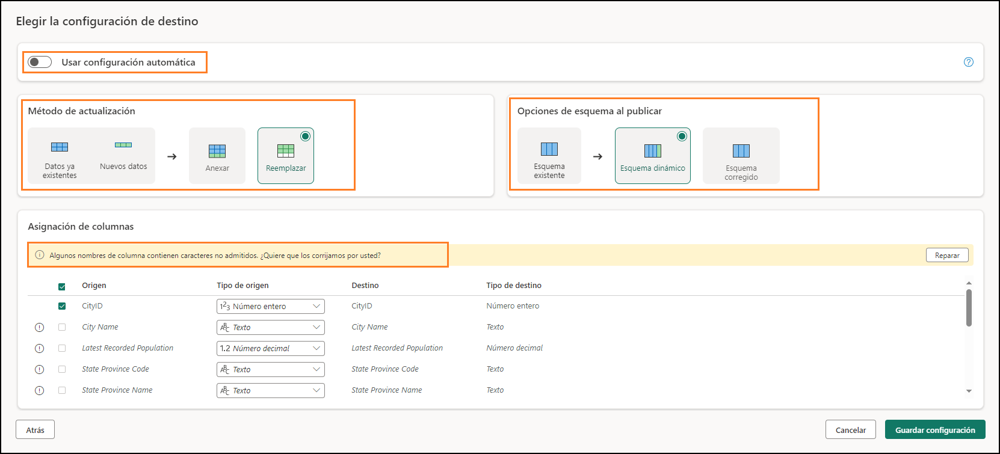
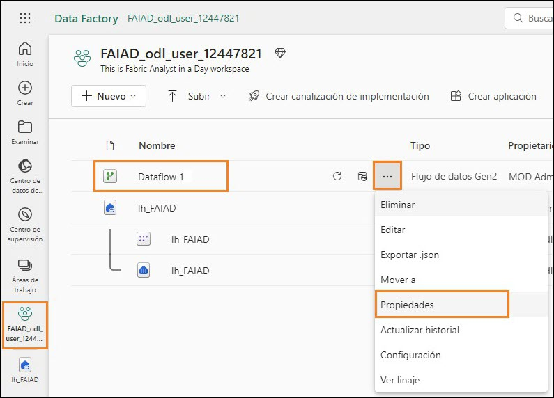
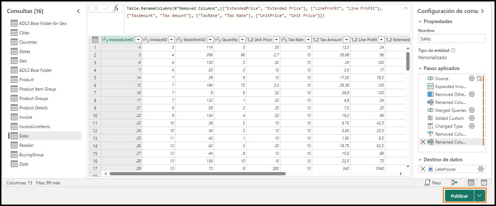

	  	 
 
## Sommaire
- Introduction
- Dataflow Gen2
    - Tâche 1 : créer un flux de données Gen2
    - Tâche 2 : créer une connexion à ADLS Gen2
    - Tâche 3 : créer une requête de dossier de base ADLS Gen2
    - Tâche 4 : créer une requête Cities
    - Tâche 5 : créer une requête Countries
    - Tâche 6 : créer la requête States à l’aide de la copie - Option 1
    - Tâche 7 : créer une requête Geo par copie - Option 2
    - Tâche 8 : configurer la destination des données pour la requête Geo
    - Tâche 9 : publier le flux de données
    - Tâche 10 : renommer le flux de données
    - Tâche 11 : créer les requêtes restantes dans Dataflow
    - Tâche 12 : configurer la destination des données pour les requêtes restantes
- Références

 
## Introduction
Dans notre scénario, les données Sales proviennent du système ERP et sont stockées dans une
ADLS Gen2. Elles sont mises à jour au quotidien à midi. Nous devons transformer et ingérer ces données dans Lakehouse et les utiliser dans notre modèle.

Plusieurs moyens permettent d’ingérer ces données.

- **Raccourcis :** ce moyen ne permet pas de transformer les données.

- **Notebooks :** ce moyen nous oblige à écrire du code. Il s’agit d’une approche conviviale pour les développeurs.

- **Dataflow Gen2 :** vous connaissez probablement Power Query ou Dataflow Gen1. Dataflow Gen2, comme son nom l’indique, est la version la plus récente de Dataflow. Elle offre toutes les fonctionnalités de Power Query/Dataflow Gen1 avec la possibilité
supplémentaire de transformer et d’ingérer des données dans plusieurs sources de données. Nous allons aborder cela dans les prochains labos.

- **Pipeline de données :** il s’agit d’un outil d’orchestration. Les activités peuvent être
orchestrées pour extraire, transformer et ingérer des données. Le pipeline de données va nous permettre d’exécuter l’activité Dataflow Gen2 qui à son tour effectue l’extraction, la transformation et l’ingestion.

Nous allons commencer par Dataflow Gen2 pour créer une connexion à la source de données et les transformations nécessaires. Ensuite, nous allons orchestrer/exécuter Dataflow Gen2 à l’aide du pipeline de données.

À la fin de ce labo, vous saurez :

- comment créer un flux de données Gen2 ;

- comment vous connecter à ADLS Gen2 à l’aide de Dataflow Gen2 et transformer des données ;

- comment ingérer des données dans Lakehouse.

## Dataflow Gen2
### Tâche 1 : créer un flux de données Gen2

1. Revenons à l’**espace de travail Fabric** que vous avez créé dans le labo 2, tâche 9.

2. Si vous ne l’avez pas quitté après le labo précédent, vous vous trouvez sur l’écran Lakehouse. Sélectionnez l’icône du **sélecteur de l’expérience Fabric** en bas à gauche de votre écran.
3. Cliquez sur **Data Factory** dans la boîte de dialogue Expérience Fabric ouverte. Data Factory dispose des charges de travail nécessaires pour extraire, transformer et ingérer des données.
 
    

4. Vous êtes alors redirigé vers la page d’accueil de Data Factory. Sous Nouveau, cliquez sur **Flux de données Gen2**.

    

Vous êtes alors redirigé vers la **page Dataflow**. Cet écran vous semblera familier, car il ressemble à Flux de données Gen1 ou Power Query. Notez que les options de connexion à diverses sources de données sont disponibles, ainsi que la possibilité de transformer des données. Connectons-nous à la source de données ADLS Gen2 et effectuons quelques transformations.
 
### Tâche 2 : créer une connexion à ADLS Gen2
1. Dans le ruban, cliquez sur **Accueil -> Obtenir les données, puis sélectionnez Plus…**

    

2. Vous êtes alors redirigé vers la boîte de dialogue **Obtenir les données Choisir une source de données**. Vous pouvez rechercher la source de données en tapant dans la zone de recherche. Notez que dans le volet gauche, des options permettent d’utiliser une table vide ou une requête vide. Il comporte également une nouvelle option permettant de charger un fichier. Nous allons explorer cette option dans un labo ultérieur. Dans l’immédiat, cliquons sur **Voir plus ->** dans le coin droit de votre écran.

    
 
    Vous pouvez désormais afficher toutes les sources de données disponibles. Vous pouvez filtrer les sources de données par fichier, base de données, Microsoft Fabric, Power Platform, Azure, etc.

    

3. Sélectionnez **Azure** dans les options de filtre supérieures pour filtrer jusqu’aux sources de données Azure.
4. Sélectionnez **Azure Data Lake Storage Gen2**.

    

5. Vous êtes alors redirigé vers la boîte de dialogue Connexion à une source de données. Vous devez créer une connexion à la source de données ADLS Gen2. Sous **Paramètres de connexion -> URL**, saisissez ce lien : [https://stvnextblobstorage.dfs.core.windows.net/fabrikam- sales/Delta-Parquet-Format](https://stvnextblobstorage.dfs.core.windows.net/)

    

6. Sélectionnez **Clé de compte** dans la liste déroulante Type d’authentification.

7. Copiez la **clé d’accès du compte de stockage Adls** depuis **l’onglet Variables d’environnement**
(en regard de l’onglet Guide du labo) et collez-la dans la **zone de texte Clé de compte**.

    

8. Cliquez sur **Suivant** en bas de l’écran à droite.
 
### Tâche 3 : créer une requête de dossier de base ADLS Gen2
1. Une fois la connexion établie, vous êtes redirigé vers l’écran **Prévisualiser les données du dossier**. Le dossier ADLS Gen2 comporte de nombreux fichiers. Nous avons besoin des données de certains d’entre eux. Cliquez sur **Créer** pour créer une connexion au dossier.

    

2. Vous êtes de retour dans la boîte de dialogue **Power Query**. Il s’agit de la connexion au dossier racine d’ADLS Gen2. Nous allons référencer cette requête dans les requêtes suivantes. Renommons la requête. Dans le **volet droit**, sous **Paramètres de requête -> Propriétés -> Nom**, redéfinissez le nom sur **ADLS Base Folder for Geo**.

3. Toutes les requêtes de Dataflow Gen2 sont alors chargées dans une lakehouse intermédiaire par défaut. Dans le cadre de ce labo, nous n’allons pas stocker de données. Pour désactiver ce
chargement, dans le **volet gauche, cliquez avec le bouton droit sur la requête ADLS Base Folder**.

**Remarque :** la mise en lots est utilisée lorsque nous devons préparer les données pour les utiliser dans une transformation ultérieure avant qu’elles ne soient prêtes à l’emploi.

4. Décochez l’option **Activer la mise en scéne**.

    

    Notez que le dossier comporte deux formats de fichiers : **json et parquet**.

    - **Parquet :** format de fichier open source conçu pour gérer les formats de données de
    stockage en colonnes plates. Parquet fonctionne bien avec des données complexes en gros volumes et est connu à la fois pour sa compression de données performante et sa capacité à gérer un large éventail de types de codages.
    
    - **Json :** le fichier comporte des métadonnées telles que le schéma, le type de données du fichier parquet.

5. Nous n’avons besoin que du fichier parquet, car il comporte les données dont nous avons besoin. Cliquez sur la **flèche déroulante de colonne Extension**.
6. **Décochez .json** afin de filtrer le dossier pour afficher uniquement les fichiers .parquet.

7. Cliquez sur **OK**.

Nous disposons maintenant de la requête de base configurée. Nous pouvons référencer cette requête pour toutes les requêtes Geo.

### Tâche 4 : créer une requête Cities
La granularité des données Sales est disponible par granularité Geography, Product, Sales Person et Date. Créons d’abord une requête pour obtenir la dimension Geo. Les données Geo sont disponibles dans trois fichiers différents situés dans les sous-dossiers suivants :

- **Cities :** Application.Cities
- **Countries :** Application.Countries
- **States :** Application.StateProvinces

Nous devons combiner les données Cities, States et Countries de ces trois fichiers pour créer la dimension Geo.
 
1. Commençons par les données Cities. Dans le volet gauche, **cliquez avec le bouton droit sur ADLS Base Folder for Geo**. Cliquez sur **Référence** pour créer une requête faisant référence à la requête ADLS Base Folder for Geo.

    

2. Cliquez sur la **flèche déroulante de colonne Folder Path**.

    
 
3. Cliquez sur **Filtres de texte -> Contient…**

    

4. Dans la boîte de dialogue **Filtrer les lignes**, saisissez **Application.Cities**

    **Remarque :** cette valeur respecte la casse.

5. Cliquez sur **OK**.

    

6. Les données sont alors filtrées sur une seule ligne. Sélectionnez **Binary** sous la **colonne Content**.

    

7. Notez que vous verrez tous les détails Cities. Dans le **volet droit**, sous P**aramètres de requête -> Propriétés -> Nom**, redéfinissez le nom sur **Cities**.

**Remarque :** dans le coin inférieur droit de la capture d’écran, assurez-vous que la requête comporte quatre étapes appliquées et attend que la requête termine son chargement. Cette opération peut prendre quelques minutes.

Dans le volet droit, sous **Étapes appliquées**, notez que toutes les étapes sont enregistrées. Ce comportement est similaire à celui dans Power Query. Suivons maintenant un processus similaire pour créer la requête **Countries**.

### Tâche 5 : créer une requête Countries

1. Dans le volet gauche, **cliquez avec le bouton droit sur ADLS Base Folder for Geo**. Cliquez sur **Référence** pour créer une requête faisant référence à la requête ADLS Base Folder for Geo.

    

2. Cliquez sur la **liste déroulante de colonne Folder Path**.

    

3. Cliquez sur **Filtres de texte -> Contient…**

    

4. Dans la boîte de dialogue **Filtrer les lignes**, saisissez **Application.Countries**.

**Remarque :** cette valeur respecte la casse.
 
5. Cliquez sur **OK**.

    

6. Les données sont alors filtrées sur une seule ligne. Sélectionnez **Binary** sous la **colonne Content**.

    

7. Notez que vous verrez tous les détails Countries. Dans le **volet droit**, sous **Paramètres de requête -> Propriétés -> Nom**, redéfinissez le nom sur **Countries**.

**Remarque :** dans le coin inférieur droit de la capture d’écran, assurez-vous que la requête comporte quatre étapes appliquées et attend que la requête termine son chargement. Cette opération peut prendre quelques minutes.

Nous devons ensuite faire intégrer la valeur States, mais les étapes deviennent répétitives. Nous disposons déjà des requêtes dans le fichier Power BI Desktop. Voyons si nous pouvons copier les requêtes à partir de là.
 
### Tâche 6 : créer la requête States à l’aide de la copie - Option 1
1. Si vous ne l’avez pas encore ouvert, ouvrez le fichier **FAIAD.pbix** situé dans le dossier **C:\FAIAD\Reports** de votre environnement de labo.

2. Dans le ruban, cliquez sur **Accueil -> Transformer les données**. Une fenêtre Power Query s’ouvre alors. Comme vous l’avez remarqué dans le labo précédent, les requêtes du volet gauche sont organisées par source de données.

    

3. Dans le volet gauche, sous le dossier ADLSData, **cliquez avec le bouton droit sur la requête**
States et sélectionnez **Copier**.

    

4. Revenez au **navigateur**. Vous devriez vous trouver dans le flux de données sur lequel nous travaillions.

5. Dans le volet gauche, cliquez sur le volet **Requêtes** et appuyez sur **Ctrl + V**. (À l’heure actuelle, le clic droit sur Coller n’est pas pris en charge.) Si vous utilisez un appareil MAC, utilisez Cmd+V pour coller.
 
**Remarque :** si vous travaillez dans un environnement de labo, sélectionnez les points de suspension en haut à droite de l’écran. Utilisez le curseur pour **activer le Presse-papiers natif de la machine virtuelle**. Cliquez sur OK dans la boîte de dialogue. Une fois que vous avez collé la requête, vous pouvez désactiver cette option.

Notez que ADLS Base Folder est également copié. En effet, la requête States fait référence à ADLS Base Folder dans Power BI Desktop, mais nous disposons déjà d’une requête similaire. Résolvons ce problème.

6. Cliquez sur la requête **States**.

7. Dans le **volet droit**, sous **Étapes appliquées**, cliquez sur **Source**.

8. Dans la barre de formule, remplacez #”ADLS Base Folder” par **#”ADLS Base Folder for Geo”**

    
 
9. Cochez la **case** en regard de la barre de formule ou appuyez sur **Entrée**.

    

10. Nous pouvons maintenant supprimer ADLS Base Folder. Dans le volet gauche, sous la section **Requêtes, cliquez avec le bouton droit sur la requête ADLS Base Folder** et sélectionnez **Supprimer**.

    

11. La boîte de dialogue Supprimer la requête s’affiche alors. Cliquez sur **Supprimer** pour confirmer.

**Remarque :** veuillez vous assurer que la requête comporte quatre étapes appliquées et attendez que le chargement de la requête soit terminé. Cette opération peut prendre quelques minutes.

### Tâche 7 : créer une requête Geo par copie - Option 2
Nous devons maintenant fusionner ces requêtes pour créer la dimension Geo. Copions à nouveau la requête du fichier Power BI Desktop. Cette fois-ci, copions le code depuis l’Éditeur avancé.

1. Revenez à la **fenêtre Power Query** du fichier Power BI Desktop.

2. Dans le volet gauche, sous **Requêtes**, sélectionnez la requête **Geo** dans le dossier ADLSData.
 
3. Dans le ruban, cliquez sur **Accueil -> Éditeur avancé.**

    

4. La fenêtre Éditeur avancé s’ouvre alors. **Mettez en surbrillance tout le texte** dans l’Éditeur avancé.
5. **Cliquez avec le bouton droit** et sélectionnez **Copier**.

    

6. Cliquez sur le **X** dans le coin supérieur droit de la fenêtre ou sur **Terminé** pour fermer la fenêtre Éditeur avancé.
7. Revenez à la fenêtre **Dataflow** dans le navigateur.
8. Dans le ruban, cliquez sur **Obtenir les données -> Requête vide**.

    
 
9. La boîte de dialogue de l’Éditeur avancé Obtenir les données - Se connecter à la source de données s’ouvre alors. **Mettez en surbrillance tout le texte** dans l’éditeur.

10. Appuyez sur la touche **Supprimer** de votre clavier pour supprimer tout le texte.

11. L’Éditeur avancé devrait être vide. Appuyez maintenant sur **Ctrl + V** pour coller le contenu que vous avez copié depuis l’Éditeur avancé de Power BI Desktop.

12. Cliquez sur **Suivant**.

    

13. Nous disposons maintenant de la dimension Geo. Renommons la requête. Dans le **volet droit**, sous **Paramètres de requête -> Propriétés -> Nom**, redéfinissez le nom sur **Geo**.

**Remarque :** veuillez attendre la fin du chargement de la requête. Cette opération peut prendre quelques minutes.

Passons en revue les étapes pour comprendre comment la dimension Geo a été créée. Dans le volet droit, sous Étapes appliquées, cliquez sur **Source**. Si vous regardez la barre de formule ou cliquez sur Paramètres, notez que la Source de cette requête est une jointure entre Cities et States. Au fur et à mesure que vous parcourez les étapes, notez que le résultat de la première jointure est à son tour joint à Countries. Ainsi, les trois requêtes permettent de créer la dimension Geo.

### Tâche 8 : configurer la destination des données pour la requête Geo
Maintenant que nous disposons d’une dimension, ingérons ces données dans Lakehouse. Il s’agit de la nouvelle fonctionnalité disponible dans Dataflow Gen2.
1. Comme indiqué précédemment, nous ne mettons en lots aucune de ces données. Par conséquent, **cliquez avec le bouton droit** sur la requête **Cities** et sélectionnez **Activer la mise en scéne** pour supprimer la coche.

    

2. Suivez les mêmes étapes pour les requêtes **Countries et Geo** pour s**upprimer la coche en regard d’Activer la mise en lots**.
3. Cliquez sur la requête **Geo**.
4. Dans le coin inférieur droit, cliquez sur **« + »** en regard de **Destination des données**.
5. Cliquez sur **Lakehouse** dans la boîte de dialogue.

    

6. La boîte de dialogue Se connecter à la destination des données s’ouvre alors. Nous devons **créer une connexion** à la lakehouse. Avec l’option Créer une **connexion** sélectionnée dans la liste déroulante Connexion et le champ **Type d’authentification** défini sur **Compte professionnel**, cliquez sur **Suivant**.
 
    

7. Une fois la connexion créée, la boîte de dialogue Choisir la cible de destination s’ouvre. Assurez- vous que le bouton radio **Nouvelle table** est coché, car nous créons une table.

8. Nous souhaitons créer la table dans la lakehouse que nous avons créée plus tôt. Dans le volet gauche, accédez à **Lakehouse -> FAIAD_<username>**.
9. Sélectionnez **lh_FAIAD**.
10. Laissez le champ Nom de la table défini sur **Geo**.
11. Cliquez sur **Suivant**.

    

12. La boîte de dialogue Choisir les paramètres de destination s’ouvre alors. Utilisez le **curseur** pour
**désactiver les paramètres automatiques**. Examinons les options.

Notez qu’il existe des options pour **Ajouter des données** à une table existante ou **Remplacer**.
    
Notez également les **Options de schéma lors de la publication**. Vous avez la possibilité de garder le schéma fixe ou, s’il est appelé à changer au fil du temps, d’opter pour un schéma dynamique.
    
Lakehouse ne prend pas en charge les noms de colonne comportant des espaces. Si vous sélectionnez Corriger, il ajoutera des traits de soulignement pour remplacer les espaces dans les noms de colonnes.

**Remarque :** la case à cocher à droite de la colonne Source vous permet de sélectionner uniquement les colonnes que vous souhaitez charger dans la Lakehouse.

13. Dans notre scénario, nous allons utiliser les paramètres automatiques. Curseur **Activer l’utilisation des paramètres automatiques**. Notez que cela corrige automatiquement les noms de colonnes de destination avec un trait de soulignement.

14. Le mappage de colonnes permet de mapper des colonnes de flux de données à des colonnes existantes. Dans notre cas, il s’agit d’une Nouvelle table. Par conséquent, nous pouvons utiliser les valeurs par défaut. Cliquez sur **Enregistrer les paramètres**.

    
 
### Tâche 9 : publier le flux de données
1. Vous êtes redirigé vers la **fenêtre Power Query**. Dans le coin inférieur droit, notez que la liste déroulante **Destination des données est définie sur Lakehouse**.

2. Publions ces requêtes afin de pouvoir examiner la lakehouse. Nous reviendrons pour ajouter d’autres requêtes. Dans le coin inférieur droit, cliquez sur **Publier**.

    

3. Vous êtes alors redirigé vers l’**écran Data Factory**. La publication du flux de données peut prendre quelques instants. Ensuite, cliquez sur la **lakehouse lh_FAIAD**.

    
 
4. Vous êtes alors dirigé vers l’**écran Explorateur Lakehouse**. Dans le volet gauche, développez **lh_FAIAD -> Tables**.

5. Notez que nous disposons maintenant d’une table Geo dans la lakehouse. Développez **Geo** et notez toutes les colonnes.

6. **Cliquez sur la table Geo** et l’aperçu des données s’ouvre alors dans le volet droit.

Il existe également un point de terminaison SQL, qui permet d’interroger cette table. Nous allons examiner cette option dans un labo ultérieur. Maintenant que nous savons que les données Geo sont intégrées à Lakehouse, introduisons le reste des données d’ADLS Gen2.

### Tâche 10 : renommer le flux de données
1. Dans la barre de menu gauche, cliquez sur **FAIAD_<username>** pour revenir à l’**espace de travail**.
2. Nous utilisons le flux de données Dataflow 1. Renommons-le avant de continuer. Cliquez sur les **points de suspension (…)** en regard de Dataflow 1. Sélectionnez **Propriétés**.

    
 
3. La boîte de dialogue des propriétés du flux de données s’ouvre alors. Redéfinissez le nom sur **df_Sales_ADLS**.

**Remarque :** nous ajoutons le préfixe **« df »** au nom du flux de données, afin de simplifier la recherche et le tri.

4. Dans la zone de texte **Description**, ajoutez **Dataflow to ingest Sales Data from ADLS to Lakehouse**.
5. Cliquez sur **Enregistrer**.

    

### Tâche 11 : créer les requêtes restantes dans Dataflow
1. Vous êtes alors redirigé vers l’espace de travail **FAIAD_<username>**. Sélectionnez le flux de données **df_Sales_ADLS** pour revenir dans le flux de données.

    

    Pour nous faciliter la tâche, voyons si nous pouvons copier les requêtes à partir de Power BI Desktop.

2. Si vous ne l’avez pas encore ouvert, ouvrez le fichier **FAIAD.pbix** situé dans le dossier **C:\FAIAD\Reports** de votre environnement de labo.

3. Dans le ruban, cliquez sur **Accueil - Transformer**. Une fenêtre Power Query s’ouvre alors.
 
4. Dans le volet gauche **Requêtes**, appuyez sur la touche **Ctrl et sélectionnez** les requêtes suivantes depuis **ADLSData :**
    
    a.	Product
    
    b.	Product Groups
    
    c.	Product Item Group
    
    d.	Product Details
    
    e.	Invoice
    
    f.	InvoiceLineItems
    
    g.	Sales
    
    h.	BuyingGroup
    
    i.	Reseller
     
    j.	Date

5. **Cliquez avec le bouton droit** et sélectionnez **Copier**.

    

6. Revenez à la fenêtre Flux de données **df_Sales_ADLS** du navigateur.
7. Dans le volet gauche, cliquez sur le volet **Requêtes** et appuyez sur **Ctrl + V**. (À l’heure actuelle, le clic droit sur Coller n’est pas pris en charge.) Si vous utilisez un appareil MAC, utilisez Cmd+V pour coller.

**Remarque :** si vous travaillez dans un environnement de labo, sélectionnez les points de suspension en haut à droite de l’écran. Utilisez le curseur pour **activer le Presse-papiers natif de la machine virtuelle**. Cliquez sur OK dans la boîte de dialogue. Une fois que vous avez collé les requêtes, vous pouvez désactiver cette option.
    
 

8. Comme indiqué précédemment, nous ne mettons en lots aucune de ces données. Par conséquent, **cliquez avec le bouton droit** sur les requêtes suivantes et sélectionnez **Activer la mise en scéne** pour supprimer la coche.

    a.	Product

    b.	Product Details

    c.	Reseller

    d.	Sales

    e.	Date

**Remarque :** si le chargement est désactivé dans Power BI Desktop, nous n’avons pas besoin de désactiver la mise en lots dans Dataflow. Par conséquent, nous n’avons pas besoin de désactiver la mise en lots pour Product Item Group, Product Groups, etc.

Assurez-vous que **toutes les requêtes sont traitées**. Ensuite, ingérons ces données dans Lakehouse.
 
### Tâche 12 : configurer la destination des données pour les requêtes restantes
1. Cliquez sur la requête **Product**.
2. Dans le ruban, cliquez sur **Accueil -> Ajouter une destination de données -> Lakehouse**.

    

3. La boîte de dialogue Se connecter à la destination des données s’ouvre alors. Dans la liste déroulante **Connexion**, sélectionnez **Lakehouse (aucun)**.

4. Cliquez sur **Suivant**.

    

5. La boîte de dialogue Choisir la cible de destination s’ouvre alors. Assurez-vous que le bouton radio **Nouvelle table** est coché, car nous créons une table.

6.	Nous souhaitons créer la table dans la lakehouse que nous avons créée plus tôt. Dans le volet gauche, accédez à **Lakehouse -> FAIAD_<username>**.

7. Sélectionnez **lh_FAIAD**.

8. Laissez le champ Nom de la table défini sur **Product**.
 
9. Cliquez sur **Suivant**.

    

10. Cette fois-ci, nous utiliserons les paramètres automatiques, pour permettre une mise à jour complète des données. De plus, les colonnes seront renommées si nécessaire. Cliquez sur **Enregistrer les paramètres**.

    

11. Vous êtes redirigé vers la **fenêtre Power Query**. Dans le **coin inférieur droit**, notez que la liste déroulante Destination des données est définie sur **Lakehouse**.

12. De même, définissez la liste déroulante **Destination des données** pour les requêtes suivantes :

    a. Product Details

    b. Reseller

    c. Sales

    d. Date
 
13. Nous disposons d’un flux de données qui ingère des données d’ADLS vers Lakehouse. Publions ce flux de données. Cliquez sur **Publier** dans le coin inférieur droit.

Vous êtes alors redirigé vers l’espace de travail **FAIAD_<username>**. L’actualisation du flux de données peut prendre quelques minutes.

Dans le prochain labo, nous allons ingérer des données des autres sources de données.
 
### Références
Fabric Analyst in a Day (FAIAD) vous présente certaines des fonctions clés de Microsoft Fabric. Dans le menu du service, la section Aide (?) comporte des liens vers d’excellentes ressources.

Voici quelques autres ressources qui vous aideront lors de vos prochaines étapes avec Microsoft Fabric :
- Consultez le billet de blog pour lire l’intégralité de l’[annonce de la GA de Microsoft Fabric](https://aka.ms/Fabric-Hero-Blog-Ignite23).
- Explorez Fabric grâce à la [visite guidée](https://aka.ms/Fabric-GuidedTour).
- Inscrivez-vous pour bénéficier d’un [essai gratuit de Microsoft Fabric](https://aka.ms/try-fabric).
- Rendez-vous sur le [site web Microsoft Fabric](https://aka.ms/microsoft-fabric).
- Acquérez de nouvelles compétences en explorant les [modules d’apprentissage Fabric](https://aka.ms/learn-fabric).
- Explorez la [documentation technique Fabric](https://aka.ms/fabric-docs).
- Lisez le [livre électronique gratuit sur la prise en main de Fabric](https://aka.ms/fabric-get-started-ebook).
- Rejoignez la [communauté Fabric](https://aka.ms/fabric-community) pour publier vos questions, partager vos commentaires et apprendre des autres.

Lisez les blogs d’annonces plus détaillés sur l’expérience Fabric :

- [Blog Expérience Data Factory dans Fabric](https://aka.ms/Fabric-Data-Factory-Blog)
- [Blog Expérience Synapse Data Engineering dans Fabric](https://aka.ms/Fabric-DE-Blog)
- [Blog Expérience Synapse Data Science dans Fabric](https://aka.ms/Fabric-DS-Blog)
- [Blog Expérience Synapse Data Warehousing dans Fabric](https://aka.ms/Fabric-DW-Blog)
- [Blog Expérience Synapse Real-Time Analytics dans Fabric](https://aka.ms/Fabric-RTA-Blog)
- [Blog Annonce Power BI](https://aka.ms/Fabric-PBI-Blog)
- [Blog Expérience Data Activator dans Fabric](https://aka.ms/Fabric-DA-Blog)
- [Blog Administration et gouvernance dans Fabric](https://aka.ms/Fabric-Admin-Gov-Blog)
- [Blog OneLake dans Fabric](https://aka.ms/Fabric-OneLake-Blog)
- [Blog Intégration de Dataverse et Microsoft Fabric](https://aka.ms/Dataverse-Fabric-Blog)

© 2023 Microsoft Corporation. Tous droits réservés.
En effectuant cette démonstration/ce labo, vous acceptez les conditions suivantes :

La technologie/fonctionnalité décrite dans cette démonstration/ces travaux pratiques est fournie par Microsoft Corporation en vue d’obtenir vos commentaires et de vous fournir une expérience d’apprentissage. Vous pouvez utiliser cette démonstration/ces ateliers uniquement pour évaluer ces technologies et fonctionnalités, et pour fournir des commentaires à Microsoft. Vous ne pouvez pas l’utiliser à d’autres fins. Vous ne pouvez pas modifier, copier, distribuer, transmettre, afficher, effectuer, reproduire, publier, accorder une licence, créer des œuvres dérivées, transférer ou vendre tout ou une partie de cette démonstration/ces ateliers.

LA COPIE OU LA REPRODUCTION DE CETTE DÉMONSTRATION/CES TRAVAUX PRATIQUES (OU DE TOUTE PARTIE DE CEUX-CI) SUR TOUT AUTRE SERVEUR OU AUTRE EMPLACEMENT EN VUE D’UNE AUTRE REPRODUCTION OU REDISTRIBUTION EST EXPRESSÉMENT INTERDITE.
CETTE DÉMONSTRATION/CES TRAVAUX PRATIQUES FOURNISSENT CERTAINES FONCTIONNALITÉS DE PRODUIT/TECHNOLOGIES LOGICIELLES, NOTAMMENT D’ÉVENTUELS NOUVEAUX CONCEPTS ET FONCTIONNALITÉS, DANS UN ENVIRONNEMENT SIMULÉ SANS INSTALLATION OU CONFIGURATION
COMPLEXE AUX FINS DÉCRITES CI-DESSUS. LES TECHNOLOGIES/CONCEPTS REPRÉSENTÉS DANS CETTE DÉMONSTRATION/CES TRAVAUX PRATIQUES PEUVENT NE PAS REPRÉSENTER LES FONCTIONNALITÉS COMPLÈTES ET PEUVENT NE PAS FONCTIONNER DE LA MÊME MANIÈRE QUE DANS UNE VERSION FINALE. IL EST ÉGALEMENT POSSIBLE QUE NOUS NE PUBLIIONS PAS DE VERSION FINALE DE CES FONCTIONNALITÉS OU CONCEPTS. VOTRE EXPÉRIENCE D’UTILISATION DE CES FONCTIONNALITÉS DANS UN ENVIRONNEMENT PHYSIQUE PEUT ÉGALEMENT ÊTRE DIFFÉRENTE.

**COMMENTAIRES.** Si vous envoyez des commentaires sur les fonctionnalités, technologies et/ou concepts décrits dans ces ateliers/cette démonstration à Microsoft, vous accordez à Microsoft, sans frais, le droit d’utiliser, de partager et de commercialiser vos commentaires de quelque
manière et à quelque fin que ce soit. Vous accordez également à des tiers, sans frais, les droits de brevet nécessaires pour leurs produits, technologies et services en vue de l’utilisation ou
de l’interface avec des parties spécifiques d’un logiciel ou d’un service Microsoft incluant les commentaires. Vous n’enverrez pas de commentaires soumis à une licence exigeant que
Microsoft accorde une licence pour son logiciel ou sa documentation à des tiers du fait que nous y incluons vos commentaires. Ces droits survivent à ce contrat.

MICROSOFT CORPORATION DÉCLINE TOUTES LES GARANTIES ET CONDITIONS EN CE
QUI CONCERNE CETTE DÉMONSTRATION/CES TRAVAUX PRATIQUES, Y COMPRIS TOUTES LES GARANTIES ET CONDITIONS DE QUALITÉ MARCHANDE, QU’ELLES SOIENT EXPLICITES,
IMPLICITES OU LÉGALES, D’ADÉQUATION À UN USAGE PARTICULIER, DE TITRE ET D’ABSENCE
DE CONTREFAÇON. MICROSOFT N’OFFRE AUCUNE GARANTIE OU REPRÉSENTATION EN CE QUI CONCERNE LA PRÉCISION DES RÉSULTATS, LA CONSÉQUENCE QUI DÉCOULE DE L’UTILISATION
DE CETTE DÉMONSTRATION/CES ATELIERS, OU L’ADÉQUATION DES INFORMATIONS CONTENUES DANS CETTE DÉMONSTRATION/CES ATELIERS À QUELQUE FIN QUE CE SOIT.
 
**CLAUSE D’EXCLUSION DE RESPONSABILITÉ**
Cette démonstration/Ce labo comporte seulement une partie des nouvelles fonctionnalités et améliorations disponibles dans Microsoft Power BI. Certaines fonctionnalités sont susceptibles
de changer dans les versions ultérieures du produit. Dans ce labo/cette démonstration, vous allez découvrir comment utiliser certaines nouvelles fonctionnalités, mais pas toutes.

