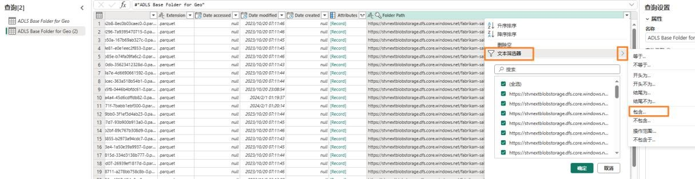

## 目录

简介	

数据流 Gen2	

- 任务 1：创建数据流Gen2	

- 任务 2：创建与ADLS Gen2 的连接	

- 任务 3：创建基ADLS Gen2 文件夹查询	

- 任务 4：创建 Cities 查询	

- 任务 5：创建 Countries 查询

- 任务 6：使用复制创建 States - 选项1	

- 任务 7：通过复制创建Geo 查询- 选项 2	

- 任务 8：为Geo 查询配置数据目标

- 任务 9：发布数据流	2

- 任务 10：重命名数据流	

- 任务 11：在数据流中生成剩余查询	

- 任务 12：为剩余查询配置数据目标	

参考

## 简介

在我们的应用场景中，销售数据来自ERP 系统，存储在ADLS Gen2 中。每天中午 12 点更新。我们需要将这些数据转换并引入到 Lakehouse 中，并在我们的模型中使用这些数据。引入此数据的方法有多种。

-	**快捷方式** ：这不是转换数据的方法。

- **笔记本**：这需要我们编写代码。这种方法适合开发人员。

- **数据流 Gen2：** 您可能熟悉 Power Query 或数据流Gen1。数据流Gen2 顾名思义是数据流的新版本。它提供Power Query/数据流 Gen1 的所有功能，并添加了将数据转换和引入到多个数据源的功能。我们将在下面几个实验中进行介绍。

- **数据管道：** 这是一个编排工具。可以编排活动来提取、转换和引入数据。我们将使用数据管道执行数据流Gen2 活动，该活动又将执行提取、转换和引入。

我们将从数据流Gen2 开始，创建与数据源的连接和必要的转换。然后我们将使用数据管道来编排/执行数据流 Gen2。

本实验结束后，您将学会：

- 如何创建数据流Gen2

- 如何使用数据流Gen2 连接到 ADLS Gen2 并转换数据

- 如何将数据引入 Lakehouse

## 数据流 Gen2

### 任务 1：创建数据流 Gen2

1.	让我们导航回到您在实验 2 任务 9 中创建的 Fabric **工作区**。

2.	如果您在上一个实验之后尚未离开，您将位于 Lakehouse 屏幕中。如果您已离开，没有关系。选择屏幕左下角的 **Fabric 体验选择器**图标。

3.	从打开的 Fabric 体验对话框中选择 **Data Factory**。Data Factory 具有提取、转换和引入数据所需的工作负载。

4.	您将导航到 Data Factory 主页。在“新建”下，选择**数据流 Gen2。**

您将导航到**数据流页面**。此屏幕看起来很熟悉，因为它与数据流Gen1 或Power Query 相似。您会注意到这里提供了连接到各种数据源的选项以及转换数据的功能。我们连接到ADLS Gen2数据源并执行一些转换。

### 任务 2：创建与ADLS Gen2 的连接

1.	从功能区中选择主页 -> 获取数据 -> 更多…
    

2.	您将导航到**获取数据选择数据源** 对话框。您可以通过在搜索框中键入内容来搜索数据源。请注意，左侧面板上有使用空白表或空白查询的选项。您还会看到一个新的“上传文件”选项。我们将在稍后的实验中探索该选项。现在，我们点击屏幕右上角的**查看更多->。**

    

现在您可以查看所有可用的数据源。您可以选择按文件、数据库 Microsoft Fabric、Power Platform、Azure 等筛选数据源。

3.	从顶部筛选选项中选择 **Azure** 以筛选到Azure 数据源。

4.	选择 **Azure Data Lake Storage Gen2。**

5.	您将导航到“连接到数据源”对话框。您需要创建与ADLS Gen2 数据源的连接。在连接设置-> URL 下，输入链接

    https://stvnextblobstorage.dfs.core.windows.net/fabrikam-sales/Delta-Parquet-Format

6.	从“身份验证种类”下拉列表中选择**帐户密钥。**

7.	从 **“环境变量”** **选项卡**（位于“实验指南”选项卡旁边）复制 **Adls 存**储帐户访问密钥，并将其粘贴到**帐户密钥文本框中**。

    

8.	选择屏幕右下角的**下一步。**

### 任务 3：创建基ADLS Gen2 文件夹查询

1.	建立连**接后，您将导**航到预览文件夹数据屏幕。ADLS Gen2 文件夹中有很多文件。我们需要其中一些文件的数据。选择**创建**以创建与文件夹的连接。

    

2.	您已返回到 Power Query 对话框。这将连接到ADLS Gen2 根文件夹。我们将在后续查询中引用该查询。我们为该查询重命名。在**右侧面板**中的**查询设置 -> 属性-> 名称下**，将名称更改为 **ADLS Base Folder for Geo**

3.	默认情况下，来自数据流Gen2 的所有查询都会加载到暂存 Lakehouse。在本实验中，我们不会暂存数据。要禁用此加载，请在**左侧面板**中 **右键单击ADLS Base Folder** 查询。

**注意：** 当我们需要在准备使用数据之前暂存数据以供进一步转换时，请使用暂存。

4.	**取消选中启用暂存**选项。

请注意，该文件夹中有两种文件格式：**json 和 parquet。**

- **Parquet：** 是一种开放源代码文件格式，旨在处理平面列式存储数据格式。Parquet 能够很好地处理大量复杂数据，并以其高性能数据压缩和处理各种编码类型的能力而闻名。

- **Json：** 文件包含 parquet 文件的架构、数据类型等元数据。

5.	我们只需要 parquet 文件，因为它包含我们需要的数据。选择 **Extension 列下拉箭头。**

6.	**取消选中 .json**，以便将其进一步筛选到 .parquet 文件。

7.	选择**确定**。

现在我们已经设置了基本查询。我们可以针对所有Geo 查询引用此查询。

### 任务 4：创建 Cities 查询

Sales 数据按 Geography、Product、Sales Person 和 Date 粒度提供。我们首先创建一个查询来获取Geo 维度。Geo 数据位于以下子文件夹中的三个不同文件中：

- **Cities:** Application.Cities

- **Countries:** Application.Countries

- **State**: Application.State Provinces

我们需要组合这三个文件中的 City、State 和 Country 数据来创建Geo 维度。

1.	我们从 City 开始。在左侧面板上，**右键单击 ADLS Base Folder for Geo。** 选择引用，创建**引用**ADLS Base Folder for Geo 查询的新查询。

    

2.	选择 **Folder Path 列下拉箭头**。

    

3.	选择**文本筛选器 -> 包含…**

    

4.	在**筛选行**对话框中，输入 **Application.Cities**

**注意**：区分大小写。

5.	选择**确定**

6.	数据将筛选到单行。在 **Content 列**下选择 **Binary。**

    

7.	请注意，您将看到所有城市详细信息。在右侧面板中的**查询设置 -> 属性-> 名称**中，将名称更改为 **Cities**

**注意：** 在屏幕截图的右下角，请确保查询有四个应用的步骤并等待查询加载完成。这可能需要几分钟时间。

在右侧面板中的**已应用步骤下**，请注意所有步骤均已登记。此行为与Power Query 中的行为类似。现在，我们按照相似的流程来创建 **Country** 查询。

### 任务 5：创建 Countries 查询

1.	在左侧面板上，**右键单击ADLS Base Folder for Geo。** 选择**引用**，创建引用 ADLS Base Folder for Geo 查询的新查询。

2.	选择 **Folder Path 列下拉箭头**。

3.	选择**文本筛选器 -> 包含…**

4.	在**筛选行对话框中输入 Application.Countries**

**注意：** 区分大小写。

