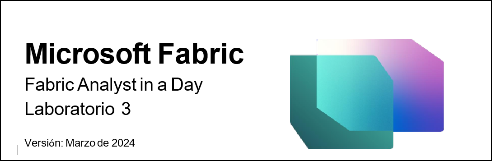
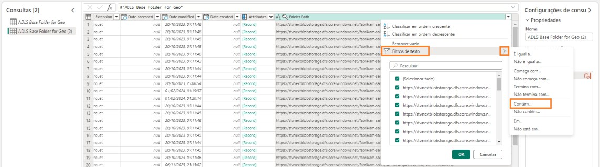
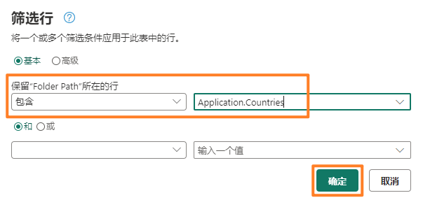
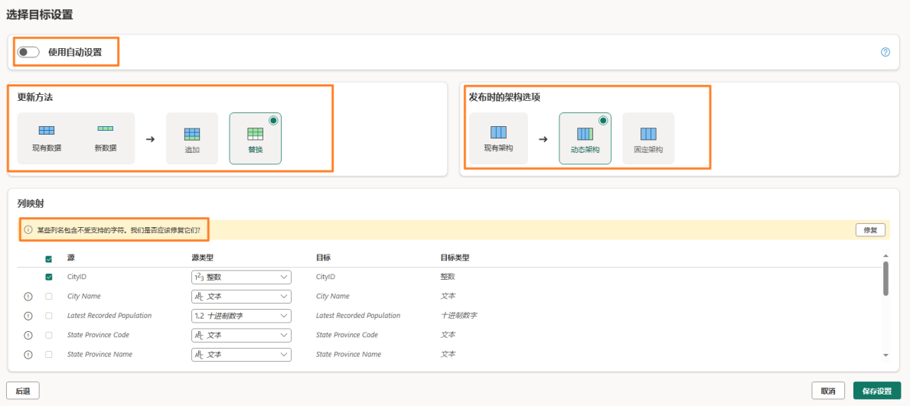
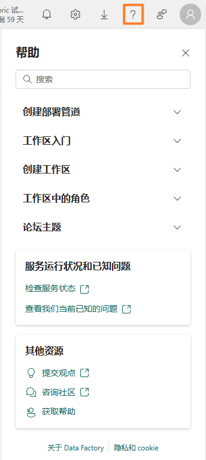
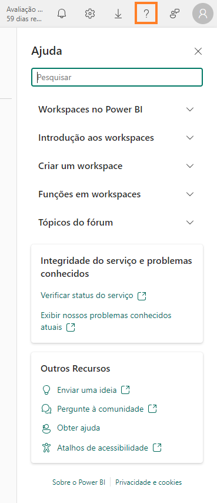

## Sumário
- Introdução
- Fluxo de Dados Gen2
  - Tarefa 1: Criar o Fluxo de Dados Gen2
  - Tarefa 2: Criar conexão com o ADLS Gen2
  - Tarefa 3: Criar consulta de pasta Base do ADLS Gen2
  - Tarefa 4: Criar consulta Cities
  - Tarefa 5: Criar consulta Countries	
  - Tarefa 6: Criar States usando Copiar – Opção 1	
  - Tarefa 7: Criar consulta Geo por Copiar – Opção 2	
  - Tarefa 8: Configurar destino de dados para a consulta Geo	
  - Tarefa 9: Publicar fluxo de dados	
  - Tarefa 10: Renomear fluxo de dados	
  - Tarefa 11: Criar consultas restantes no Dataflow	
  - Tarefa 12: Configurar destino de dados para as consultas restantes	
- Referências	

## Introdução
Em nosso cenário, os Dados de Venda são obtidos do sistema ERP e armazenados em um ADLS Gen2. Eles são atualizados ao meio-dia/12h, todos os dias. Precisamos transformar e ingerir esses dados no Lakehouse e usá-los em nosso modelo.

Há várias maneiras de ingerir esses dados.
  - **Atalhos:** isso não fornece uma maneira de transformar dados.
  - **Cadernos:** isso exige que escrevamos código. É uma abordagem para desenvolvedores.
  - **Fluxo de Dados Gen2:** você provavelmente conhece o Power Query ou o Fluxo de Dados Gen1. O Fluxo de Dados Gen2, como o nome indica, é a versão mais recente do Fluxo de Dados. Ele oferece todos os recursos do Power Query/Fluxo de Dados Gen1 com o recurso
adicional de transformar e ingerir dados em diversas fontes de dados. Apresentaremos isso nos próximos laboratórios.
  - **Pipeline de Dados:** é uma ferramenta de orquestração. As atividades podem ser orquestradas para extrair, transformar e ingerir dados. Usaremos o Pipeline de Dados
para executar a atividade do Fluxo de Dados Gen2 que, por sua vez, realizará a extração, a transformação e a ingestão.

Começaremos com o Fluxo de Dados Gen2 para criar uma conexão com a fonte de dados e as
transformações necessárias. Em seguida, usaremos o Pipeline de Dados para orquestrar/executar o Fluxo de Dados Gen2.

Ao final deste laboratório, você terá aprendido:
  - Como criar o Fluxo de dados Gen2
  - Como conectar ao ADLS Gen2 usando o Fluxo de Dados Gen2 e transformar dados
  - Como ingerir dados no Lakehouse

## Fluxo de Dados Gen2
### Tarefa 1: Criar o Fluxo de Dados Gen2
1. Vamos voltar ao **workspace do Fabric** que você criou no Laboratório 2, Tarefa 9.
2. Se você não saiu do laboratório anterior, estará na tela Lakehouse. Caso contrário, não tem problema. Selecione o ícone **Fabric experience selector** na parte inferior esquerda da tela.
3. Selecione **Data Factory** na caixa de diálogo de experiência do Fabric aberta. O Data Factory tem as cargas de trabalho necessárias para extrair, transformar e ingerir dados.

   
 
 
4.	Você será direcionado para a Página Inicial do Data Factory. Em Novo, selecione **Fluxo de dados Gen2.**

   

Você será direcionado para a **página do Fluxo de Dados.** Esta tela parecerá familiar, pois é semelhante ao Fluxo de Dados Gen1 ou Power Query. Você notará que as opções para se conectar a várias fontes de dados estão disponíveis, junto com o recurso para transformar dados. Vamos conectar à fonte de dados ADLS Gen2 e realizar algumas transformações.
 
### Tarefa 2: Criar conexão com o ADLS Gen2
1. Na faixa de opções, selecione **Página Inicial -> Obter Dados -> Mais...**

   

2. Você será direcionado para a caixa de diálogo **Obter dados Escolher fonte de dados.** Você pode procurar a fonte de dados digitando na caixa de pesquisa. No painel esquerdo, há opções para usar uma Tabela em branco ou uma Consulta em branco. Você também encontrará uma nova opção para carregar arquivo. Exploraremos essa opção em um laboratório posterior. Por enquanto, vamos clicar em **Exibir mais ->** no canto direito da tela.

   

Agora você pode exibir todas as fontes de dados disponíveis. Você tem a opção de filtrar as fontes de dados por Arquivo, Banco de Dados, Microsoft Fabric, Power Platform, Azure, etc.

  
 
3. Selecione **Azure** nas principais opções de filtro para filtrar as fontes de dados do Azure.
4.	Selecione **Azure Data Lake Storage Gen2.**

  

5. Você será direcionado para a caixa de diálogo Conectar-se à fonte de dados. Você precisa criar uma conexão com a fonte de dados ADLS Gen2. Em **Configurações de conexão -> URL**, insira este link https://stvnextblobstorage.dfs.core.windows.net/fabrikam-sales/Delta-Parquet-Format

   

6. Selecione **Chave de conta** no menu suspenso Tipo de autenticação.
7. Copie a **Adls storage account e Chave de acesso** da guia **Variáveis de Ambiente** (ao lado do Guia de Laboratório) e cole-a na **caixa de texto Chave de conta.**

   
 
8. Selecione **Próximo** na parte inferior direita da tela.

### Tarefa 3: Criar consulta de pasta Base do ADLS Gen2
1. Assim que a conexão for estabelecida, você será direcionado para a tela **Visualizar os dados da pasta.** Existem muitos arquivos na pasta ADLS Gen2. Precisamos de dados de alguns deles.
Selecione Criar para **criar** uma conexão com a pasta.

   

2. Você está de volta à caixa de diálogo **Power Query.** Esta será a conexão com a pasta raiz do ADLS Gen2. Faremos referência a essa consulta em consultas subsequentes. Vamos renomear a
consulta. No **painel direito,** em **Configurações de consulta -> Propriedades -> Nome,** altere o nome para **ADLS Base Folder for Geo.**
 
3. Todas as consultas do Fluxo de Dados Gen2 são carregadas em um Staging Lakehouse por padrão. Como parte deste laboratório, não prepararemos os dados. Para desabilitar esse
carregamento, no **painel esquerdo, clique com o botão direito na consulta ADLS Base Folder.**

    **Observação:** O preparo é usado quando precisamos preparar dados para serem usados em transformações adicionais antes que estejam prontos para consumo.

4. Desmarque a opção **Habilitar o preparo.**

   

Observe que há dois formatos de arquivo na pasta, **json** e **parquet.**
  - **Parquet:** é um formato de arquivo de código aberto criado para lidar com formatos de dados de armazenamento colunares simples. O Parquet funciona bem com dados complexos em
grandes volumes e é conhecido por sua compactação de dados de alto desempenho e sua capacidade de lidar com uma ampla variedade de tipos de codificação.
  - **Json:** o arquivo contém metadados, como esquema, tipo de dados do arquivo parquet.
5. Precisamos apenas do arquivo parquet, pois ele contém os dados necessários. Selecione a **seta suspensa da coluna Extension.**
6. **Desmarque .json** para que ele seja filtrado em arquivos .parquet.
7. Selecione **OK.**

   

Agora temos a consulta Base configurada. Podemos fazer referência a essa consulta para todas as consultas Geo.
 
### Tarefa 4: Criar consulta Cities
Dados de Sales estão disponíveis pela granularidade Geography, Product, Sales Person e Date. Vamos primeiro criar uma consulta para obter a dimensão Geo. Os dados de Geo estão disponíveis em três arquivos diferentes, localizados nas seguintes subpastas:
  - **Cities:** Application.Cities
  - **Countries:** Application.Countries
  - **State:** Application.StateProvinces

Precisamos combinar os dados de City, State e Country desses três arquivos para criar a dimensão Geo.
1. Vamos começar com City. No painel esquerdo, **clique com o botão direito em ADLS Base Folder for Geo.** Selecione **Referência** para criar uma nova consulta que faça referência à consulta ADLS Base Folder for Geo.

   

2. Selecione a **seta suspensa da coluna Folder Path.**

   

3. Selecione **Filtros de texto -> Contém…**

   

4. Na caixa de diálogo **Filtrar linhas,** insira **Application.Cities** 

    **Observação:** Diferencia maiúsculas e minúsculas.
5.	Selecione **OK.**

    

6. Os dados serão filtrados em uma única linha. Selecione **Binary** na **coluna Content.**

   

7. Observe que você verá todos os detalhes de City. No **painel direito,** em **Configurações de consulta -> Propriedades -> Nome,** altere o nome para **Cities.**

    **Observação:** No canto inferior direito da captura de tela, verifique se a consulta tem quatro etapas aplicadas e aguarde o término do carregamento da consulta. Isso pode levar alguns minutos.

   

No painel direito, em **Etapas aplicadas,** observe que todas as etapas estão registradas. Esse
comportamento é semelhante ao do Power Query. Agora vamos seguir um processo semelhante para criar a consulta **Country.**
 
### Tarefa 5: Criar consulta Countries
1. No painel esquerdo, **clique com o botão direito em ADLS Base Folder for Geo.** Selecione
**Referência** para criar uma nova consulta que faça referência à consulta ADLS Base Folder for Geo.

   

2. Selecione a **seta suspensa da coluna Folder Path.**

   

3. Selecione **Filtros de texto -> Contém…**

   

4. Na caixa de diálogo **Filtrar linhas,** insira **Application.Countries.**

    **Observação:** Diferencia maiúsculas de minúsculas.

5. Selecione **OK.**

   

6. Os dados serão filtrados em uma única linha. Selecione **Binary** na **coluna Content.**

   

7. Observe que você verá todos os detalhes de Country. No **painel direito,** em **Configurações de consulta -> Propriedades -> Nome,** altere o nome para **Countries.**

    **Observação:** No canto inferior direito da captura de tela, verifique se a consulta tem quatro etapas aplicadas e aguarde o término do carregamento da consulta. Isso pode levar alguns minutos.

   

Precisamos mostrar State em seguida, mas as etapas estão ficando repetitivas. Já temos as consultas no arquivo Power BI Desktop. Vamos ver se podemos copiar as consultas de lá.

### Tarefa 6: Criar States usando Copiar – Opção 1
1. Se você ainda não tiver aberto, abra o arquivo **FAIAD.pbix** que está na pasta **C:\FAIAD\Reports**
do seu ambiente de laboratório.
2.	Na faixa de opções, selecione **Página Inicial -> Transformar dados.** A janela do Power Query é aberta. Como você observou no laboratório anterior, as consultas no painel esquerdo são organizadas por fonte de dados.

    

3. No painel esquerdo, na pasta ADLSData, **clique com o botão direito na consulta States** e selecione **Copiar.**

   

4. Volte para para o **navegador.** Você deve estar no Fluxo de Dados em que estávamos trabalhando.
5. No painel esquerdo, selecione o painel **Consultas** e pressione **Ctrl+V** (no momento, não é possível clicar com o botão direito do mouse em Colar). Se você estiver usando o dispositivo MAC, use Cmd+V para colar.

**Observação:** se você estiver trabalhando no ambiente de laboratório, selecione as reticências no canto superior direito da tela. Use o controle deslizante para **habilitar VM Native Clipboard.** Selecione OK na caixa de diálogo. Depois que terminar de colar a consulta, você poderá desabilitar essa opção.

   

   
 
Observe que a ADLS Base Folder também é copiada. Isso ocorre porque a consulta States se refere à ADLS Base Folder no Power BI Desktop, mas já temos uma consulta semelhante. Vamos resolver isso.

6.	Selecione a consulta **States.**
7.	No **painel direito,** em **Etapas aplicadas,** selecione **Source.**
8.	Na barra de fórmulas, altere de **#"ADLS Base Folder" para #”ADLS Base Folder for Geo”.**

    

9.	Clique na **marca de verificação** ao lado da barra de fórmulas ou pressione **Enter.**

    

10.	Agora podemos remover a ADLS Base Folder. No painel esquerdo, na seção **Consultas, clique com o botão direito do mouse na consulta ADLS Base Folder** e selecione **Excluir.**

    

11.	A caixa de diálogo Excluir consulta é exibida. Selecione **Excluir** para confirmar.

**Observação:** Verifique se a consulta tem quatro etapas aplicadas e aguarde o término do carregamento da consulta. Isso pode levar alguns minutos.
 
### Tarefa 7: Criar consulta Geo por Copiar – Opção 2
Agora precisamos mesclar essas consultas para criar a dimensão Geo. Vamos copiar a consulta novamente do arquivo Power BI Desktop. Desta vez, vamos copiar o código do Editor Avançado.

1. Volte para a **janela Power Query** do arquivo Power BI Desktop.
2. No painel esquerdo, em **Consultas,** selecione a consulta **Geo** na pasta ADLSData.
3. Na faixa de opções, selecione **Página Inicial -> Editor Avançado.**

   

4. A janela Editor Avançado é aberta. **Realce todo o texto** no Editor Avançado.
5. **Clique com o botão direito do mouse** e selecione **Copiar.**

   

6.	Selecione **X** no canto superior direito da janela ou selecione **Concluído** para fechar a janela Editor Avançado.
7.	Volte para a janela Dataflow no navegador.
8.	Na faixa de opções, selecione **Obter dados -> Consulta em branco.**

    

9.	A caixa de diálogo Obter dados, Conectar-se à fonte de dados, Editor Avançado é aberta. **Realce todo o texto** no editor.
10.	Selecione **Delete** no teclado para excluir todo o texto.
11.	O Editor Avançado deve estar em branco. Agora, pressione **Ctrl+V** para colar o conteúdo que você copiou do Editor Avançado do Power BI Desktop.
12.	Selecione **Próximo.**

      
 
13.	Agora temos a dimensão Geo. Vamos renomear a consulta. No **painel direito,** em **Configurações de consulta -> Propriedades -> Nome, altere o nome** para **Geo.**

**Observação:** Aguarde até que a consulta termine de carregar. Isso pode levar alguns minutos.

Vamos seguir as etapas para entender como a dimensão Geo foi criada. No painel direito, em Etapas aplicadas, selecione **Source.** Se você olhar na barra de fórmulas ou clicar em Configurações, notará que a Source desta consulta é uma junção entre Cities e States. Ao percorrer as etapas, você
observará que o resultado da primeira junção é, por sua vez, unido a Countries. Portanto, todas as três consultas são usadas para criar a dimensão Geo.

   

### Tarefa 8: Configurar destino de dados para a consulta Geo
Agora que temos uma dimensão, vamos ingerir esses dados no Lakehouse. Este é o novo recurso disponível no Fluxo de Dados Gen2.
1. Conforme mencionado anteriormente, não estamos preparando nenhum desses dados. Portanto, **clique com o botão direito do mouse** na consulta **Cities** e selecione **Habilitar o preparo** para remover a marca de seleção.

   

2. Siga as mesmas etapas para as consultas **Countries e Geo** para **remover a marca de seleção ao lado de Habilitar o preparo.**
3. Selecione a consulta **Geo.**
4. No canto inferior direito, selecione "+" ao lado de **Destino de dados.**
5. Selecione **Lakehouse** na caixa de diálogo.
 
   

6. A caixa de diálogo Conectar ao destino de dados é aberta. Precisamos criar uma nova Conexão com o Lakehouse. Com a opção **Criar nova conexão** selecionada na **lista suspensa Conexão** e **Tipo de autenticação** definido como **Conta organizacional,** selecione **Próximo.**

   

7. Depois que a conexão é criada, a caixa de diálogo Escolher alvo de destino é aberta. Verifique se o botão de opção **Nova tabela** está selecionado, pois estamos criando uma nova tabela.
8. Queremos criar a tabela no Lakehouse que criamos anteriormente. No painel esquerdo, navegue para **Lakehouse -> FAIAD_<nome de usuário>.**
9. Selecione **lh_FAIAD.**
10. Deixe o nome da tabela como **Geo.**
11. Selecione **Próximo.**

     

12. A caixa de diálogo Escolher configurações de destino é aberta. Use o **controle deslizante** para **desabilitar as configurações automáticas.** Vamos verificar as opções. 
Observe que há opções para **Acrescentar dados** à tabela existente ou **Substituir.** 
Além disso, observe que há **Opções de esquema ao publicar.** Você tem a opção de manter o esquema fixo ou, se ele vai mudar com o tempo, há uma opção de esquema dinâmico.
Observe que há um aviso "Alguns nomes de colunas contêm caracteres sem suporte. Devemos corrigi-los para você?". O Lakehouse não aceita nomes de coluna com espaço. Se você optar por selecionar Corrigir, serão adicionados sublinhados para substituir o espaço nos nomes de coluna.

**Observação:** a caixa de seleção à direita da coluna Origem permite que você selecione somente as colunas que deseja carregar para o Lakehouse.

   

13.	Em nosso cenário, usaremos configurações automáticas. Habilite o controle deslizante **Usar configurações automáticas.** Os nomes das colunas de destino são corrigidos automaticamente com um sublinhado.
 
14.	O mapeamento de colunas pode ser usado para mapear colunas de fluxo de dados para colunas existentes. No nosso caso, é uma Nova Tabela. Portanto, podemos usar os valores padrão. Selecione **Salvar configurações.**

    

### Tarefa 9: Publicar fluxo de dados
1. Você será direcionado de volta à **janela Power Query.** No canto inferior direito, **Destino de dados está definido como Lakehouse.**
2. Vamos publicar essas consultas para que possamos revisar o Lakehouse. Voltaremos para adicionar mais consultas. No canto inferior direito, selecione **Publicar.**

   

3. Você será direcionado de volta para o **workspace FAIAD_<nome de usuário>.** Pode levar alguns instantes para que Fluxo de Dados seja publicado. Quando concluído, selecione o **Lakehouse lh_FAIAD** no painel central ou no painel esquerdo.

   

4. Você será direcionado à **tela Explorador do Lakehouse.** No painel esquerdo, expanda **lh_FAIAD -> Tables.**
5. Agora temos a tabela Geo no Lakehouse. Expanda **Geo** e observe todas as colunas.
6. **Selecione a tabela Geo** e a pré-visualização dos dados será aberta no painel direito.

   

Também existe um Ponto de Extremidade SQL, que pode ser usado para consultar esta tabela.
Veremos essa opção em um laboratório posterior. Agora que sabemos que os dados de Geo estão no Lakehouse, vamos trazer o restante dos dados do ADLS Gen2.
 
### Tarefa 10: Renomear fluxo de dados
1. Na barra de menus à esquerda, selecione **FAIAD_<nome de usuário>** para ser direcionado de volta ao **workspace.**
2. Estamos trabalhando com o Dataflow 1. Vamos renomeá-lo antes de continuar. Clique nas **reticências (…)** ao lado de Dataflow 1. Selecione **Propriedades.**

   

3. A caixa de diálogo Propriedades do fluxo de dados é aberta. Altere o nome para **df_Sales_ADLS**

    **Observação:** Estamos acrescentando "**df"** ao nome do Dataflow. Isso facilitará a pesquisa e a classificação.

4.	Na caixa de texto **Descrição,** adicione **Dataflow to ingest Sales Data from ADLS to Lakehouse**
5.	Selecione **Salvar.**
 
    

### Tarefa 11: Criar consultas restantes no Dataflow
1. Você será direcionado de volta para o **workspace FAIAD_<nome de usuário>.** Selecione o Fluxo de Dados **df_Sales_ADLS** para voltar ao fluxo de dados.

   

Para facilitar, vamos ver se podemos copiar as consultas do Power BI Desktop.

2. Se você ainda não tiver aberto, abra o arquivo **FAIAD.pbix** que está na pasta **C:\FAIAD\Reports**
do seu ambiente de laboratório.
3. Na faixa de opções, selecione **Página Inicial -> Transformar.** A janela do Power Query é aberta.
 
4.	No painel **Consultas** à esquerda, pressione **Ctrl+Select** seguindo as consultas de **ADLSData.** 
a. Product 
b. Product Groups 
c. Product Item Group 
d. Product Details 
e. Invoice 
f. InvoiceLineItems 
g. Sales 
h. BuyingGroup 
i. Reseller 
j. Date 
5. **Clique com o botão direito do mouse** e selecione **Copiar.**

   

6.	Volte para a janela de Dataflow **df_Sales_ADLS** do navegador.
7.	No painel esquerdo, selecione o painel **Consultas** e pressione **Ctrl+V** (no momento, não
é possível clicar com o botão direito do mouse em Colar). Se você estiver usando o dispositivo MAC, use Cmd+V para colar.

**Observação:** se você estiver trabalhando no ambiente de laboratório, selecione as reticências no canto superior direito da tela. Use o controle deslizante para **habilitar VM Native Clipboard.**
Selecione OK na caixa de diálogo. Depois que terminar de colar as consultas, você poderá desabilitar essa opção.
 
    

8.	Conforme mencionado anteriormente, não estamos preparando nenhum desses dados. Portanto, **clique com o botão direito do mouse** nas consultas a seguir e selecione **Habilitar o preparo** para remover a marca de seleção. 
a. Product 
b. Product Details 
c. Reseller 
d. Sales 
e. Date 

**Observação:** Se o carregamento estiver desabilitado no Power BI Desktop, não será necessário desabilitar o preparo no Repetition. Portanto, não precisamos desabilitar o preparo para Product Item Group, Product Groups, etc.

   

Verifique se **todas as consultas são processadas.** Quando terminar, vamos ingerir esses dados no Lakehouse.
 
### Tarefa 12: Configurar destino de dados para as consultas restantes
1.	Selecione a consulta **Product.**
2.	Na faixa de opções, selecione **Página Inicial -> Adicionar destino de dados -> Lakehouse.**

    

3.	A caixa de diálogo Conectar ao destino de dados é aberta. Na lista suspensa **Conexão,** selecione **Lakehouse (nenhum).**
4.	Selecione **Próximo.**

     

5.	A caixa de diálogo Escolher alvo de destino é aberta. Verifique se o botão de opção **Nova tabela **está selecionado, pois estamos criando uma nova tabela.
6.	Queremos criar a tabela no Lakehouse que criamos anteriormente. No painel esquerdo, navegue para **Lakehouse -> FAIAD_<nome de usuário>.**
7.	Selecione **lh_FAIAD.**
8.	Deixe o nome da tabela como **Product.**
9.	Selecione **Próximo.**

    

10.	A caixa de diálogo Escolher configurações de destino é aberta. Desta vez, usaremos as configurações automáticas, pois assim será feita uma atualização completa dos dados. Além disso, as colunas serão renomeadas conforme necessário. Selecione **Salvar configurações.**

    
 
11.	Você será direcionado de volta à **janela Power Query.** No **canto inferior direito,** Destino de dados está definido como **Lakehouse.**
12.	Da mesma forma, defina o **Destino de dados** para as seguintes consultas: 
a. Product Details 
b. Reseller 
c. Sales 
d. Date
13.	Temos um fluxo de dados que ingere dados do ADLS no Lakehouse. Vamos continuar e **publicar** este fluxo de dados. Selecione Publicar no canto inferior direito.

    

Você será direcionado de volta para o **workspace FAIAD_<nome de usuário>.** Levará alguns minutos para o fluxo de dados atualizar.
No próximo laboratório, ingeriremos dados de outras fontes de dados.

## Referências
O Fabric Analyst in a Day (FAIAD) apresenta algumas das principais funções disponíveis no Microsoft Fabric. No menu do serviço, a seção Ajuda (?) tem links para ótimos recursos.

  

Veja aqui mais alguns recursos que ajudarão você com as próximas etapas do Microsoft Fabric.
  - Veja a postagem do blog para ler o [anúncio completo de GA do Microsoft Fabric](https://aka.ms/Fabric-Hero-Blog-Ignite23)
  - Explore o Fabric por meio do [Tour Guiado](https://aka.ms/Fabric-GuidedTour)
  - Inscreva-se para a [avaliação gratuita do Microsoft Fabric](https://aka.ms/try-fabric)
  - Visite o [site do Microsoft Fabric](https://aka.ms/microsoft-fabric)
  - Aprenda novas habilidades explorando os [módulos de Aprendizagem do Fabric](https://aka.ms/learn-fabric)
  - Explore a [documentação técnica do Fabric](https://aka.ms/fabric-docs)
  - Leia o [livro eletrônico gratuito sobre como começar a usar o Fabric](https://aka.ms/fabric-get-started-ebook)
  - Participe da [comunidade do Fabric](https://aka.ms/fabric-community) para postar suas perguntas, compartilhar seus comentários e aprender com outras pessoas

Leia os blogs de comunicados de experiências do Fabric em mais detalhes:
  - [Experiência do Data Factory no blog do Fabric](https://aka.ms/Fabric-Data-Factory-Blog)
  - [Experiência do Synapse Data Engineering no blog do Fabric](https://aka.ms/Fabric-DE-Blog)
  - [Experiência do Synapse Data Science no blog do Fabric](https://aka.ms/Fabric-DS-Blog)
  - [Experiência do Synapse Data Warehousing no blog do Fabric](https://aka.ms/Fabric-DW-Blog)
  - [Experiência do Synapse Real-Time Analytics no blog do Fabric](https://aka.ms/Fabric-RTA-Blog)
  - [Blog de comunicado do Power BI](https://aka.ms/Fabric-PBI-Blog)
  - [Experiência do Data Activator no blog do Fabric](https://aka.ms/Fabric-DA-Blog)
  - [Administração e governança no blog do Fabric](https://aka.ms/Fabric-Admin-Gov-Blog)
  - [OneLake no blog do Fabric](https://aka.ms/Fabric-OneLake-Blog)
  - [Blog de integração do Dataverse e Microsoft Fabric](https://aka.ms/Dataverse-Fabric-Blog)

  © 2023 Microsoft Corporation. Todos os direitos reservados.

Ao usar esta demonstração/este laboratório, você concorda com os seguintes termos:

A tecnologia/funcionalidade descrita nesta demonstração/neste laboratório é fornecida pela
Microsoft Corporation para obter seus comentários e oferecer uma experiência de aprendizado.
Você pode usar a demonstração/o laboratório somente para avaliar tais funcionalidades e
recursos de tecnologia e fornecer comentários à Microsoft. Você não pode usá-los para nenhuma outra finalidade. Você não pode modificar, copiar, distribuir, transmitir, exibir, executar,
reproduzir, publicar, licenciar, criar obras derivadas, transferir nem vender esta demonstração/este laboratório ou qualquer parte deles.

A CÓPIA OU A REPRODUÇÃO DA DEMONSTRAÇÃO/DO LABORATÓRIO (OU DE QUALQUER PARTE DELES) EM QUALQUER OUTRO SERVIDOR OU LOCAL PARA REPRODUÇÃO OU REDISTRIBUIÇÃO ADICIONAL É EXPRESSAMENTE PROIBIDA.

ESTA DEMONSTRAÇÃO/ESTE LABORATÓRIO FORNECE DETERMINADOS RECURSOS E
FUNCIONALIDADES DE PRODUTO/TECNOLOGIA DE SOFTWARE, INCLUINDO NOVOS RECURSOS E CONCEITOS POTENCIAIS, EM UM AMBIENTE SIMULADO SEM CONFIGURAÇÃO NEM
INSTALAÇÃO COMPLEXA PARA A FINALIDADE DESCRITA ACIMA. A TECNOLOGIA/OS CONCEITOS REPRESENTADOS NESTA DEMONSTRAÇÃO/NESTE LABORATÓRIO PODEM NÃO REPRESENTAR A
FUNCIONALIDADE COMPLETA DOS RECURSOS E PODEM NÃO FUNCIONAR DA MESMA MANEIRA QUE UMA VERSÃO FINAL. ALÉM DISSO, PODEMOS NÃO LANÇAR UMA VERSÃO FINAL DE TAIS RECURSOS OU CONCEITOS. SUA EXPERIÊNCIA COM O USO DE TAIS RECURSOS E
FUNCIONALIDADES EM UM AMBIENTE FÍSICO TAMBÉM PODE SER DIFERENTE.

**COMENTÁRIOS.** Caso você forneça comentários sobre os recursos de tecnologia, as funcionalidades e/ou os conceitos descritos nesta demonstração/neste laboratório à Microsoft, você concederá à Microsoft, sem encargos, o direito de usar, compartilhar e comercializar seus comentários de qualquer forma e para qualquer finalidade. Você também concede a terceiros, sem encargos, quaisquer direitos de patente necessários para que seus produtos, suas tecnologias e seus serviços usem ou interajam com partes específicas de um software ou um
serviço da Microsoft que inclua os comentários. Você não fornecerá comentários que estejam sujeitos a uma licença que exija que a Microsoft licencie seu software ou sua documentação para terceiros em virtude da inclusão de seus comentários neles. Esses direitos continuarão em vigor após o término do contrato.

POR MEIO DESTE, A MICROSOFT CORPORATION SE ISENTA DE TODAS AS GARANTIAS E CONDIÇÕES REFERENTES À DEMONSTRAÇÃO/AO LABORATÓRIO, INCLUINDO TODAS AS
GARANTIAS E CONDIÇÕES DE COMERCIALIZAÇÃO, SEJAM ELAS EXPRESSAS, IMPLÍCITAS OU ESTATUTÁRIAS, E DE ADEQUAÇÃO A UMA FINALIDADE ESPECÍFICA, TÍTULO E NÃO VIOLAÇÃO.
A MICROSOFT NÃO DECLARA NEM GARANTE A PRECISÃO DOS RESULTADOS DERIVADOS DO USO DA DEMONSTRAÇÃO/DO LABORATÓRIO NEM A ADEQUAÇÃO DAS INFORMAÇÕES CONTIDAS NA DEMONSTRAÇÃO/NO LABORATÓRIO A QUALQUER FINALIDADE.

**AVISO DE ISENÇÃO DE RESPONSABILIDADE**

Esta demonstração/este laboratório contém apenas uma parte dos novos recursos e aprimoramentos do Microsoft Power BI. Alguns dos recursos podem ser alterados em versões futuras do produto. Nesta demonstração/neste laboratório, você aprenderá sobre alguns dos novos recursos, mas não todos.
