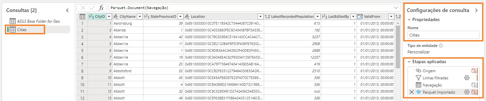
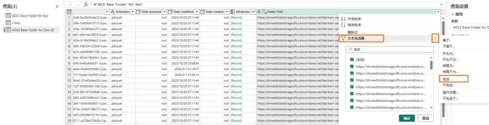
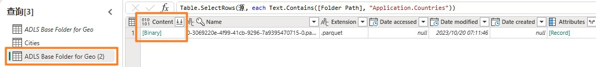
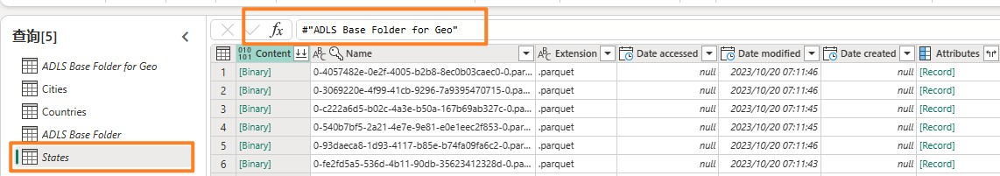

## 目录

简介	

数据流 Gen2	

- 任务 1：创建数据流Gen2	

- 任务 2：创建与ADLS Gen2 的连接	

- 任务 3：创建基ADLS Gen2 文件夹查询	

- 任务 4：创建 Cities 查询	

- 任务 5：创建 Countries 查询

- 任务 6：使用复制创建 States - 选项1	

- 任务 7：通过复制创建Geo 查询- 选项 2	

- 任务 8：为Geo 查询配置数据目标

- 任务 9：发布数据流	2

- 任务 10：重命名数据流	

- 任务 11：在数据流中生成剩余查询	

- 任务 12：为剩余查询配置数据目标	

参考

## 简介

在我们的应用场景中，销售数据来自ERP 系统，存储在ADLS Gen2 中。每天中午 12 点更新。我们需要将这些数据转换并引入到 Lakehouse 中，并在我们的模型中使用这些数据。引入此数据的方法有多种。

- **快捷方式** ：这不是转换数据的方法。

- **笔记本**：这需要我们编写代码。这种方法适合开发人员。

- **数据流 Gen2：** 您可能熟悉 Power Query 或数据流Gen1。数据流Gen2 顾名思义是数据流的新版本。它提供Power Query/数据流 Gen1 的所有功能，并添加了将数据转换和引入到多个数据源的功能。我们将在下面几个实验中进行介绍。

- **数据管道：** 这是一个编排工具。可以编排活动来提取、转换和引入数据。我们将使用数据管道执行数据流Gen2 活动，该活动又将执行提取、转换和引入。

我们将从数据流Gen2 开始，创建与数据源的连接和必要的转换。然后我们将使用数据管道来编排/执行数据流 Gen2。

本实验结束后，您将学会：

- 如何创建数据流Gen2

- 如何使用数据流Gen2 连接到 ADLS Gen2 并转换数据

- 如何将数据引入 Lakehouse

## 数据流 Gen2

### 任务 1：创建数据流 Gen2

1.	让我们导航回到您在实验 2 任务 9 中创建的 Fabric **工作区**。

2.	如果您在上一个实验之后尚未离开，您将位于 Lakehouse 屏幕中。如果您已离开，没有关系。选择屏幕左下角的 **Fabric 体验选择器**图标。

3.	从打开的 Fabric 体验对话框中选择 **Data Factory**。Data Factory 具有提取、转换和引入数据所需的工作负载。

4.	您将导航到 Data Factory 主页。在“新建”下，选择**数据流 Gen2。**

您将导航到**数据流页面**。此屏幕看起来很熟悉，因为它与数据流Gen1 或Power Query 相似。您会注意到这里提供了连接到各种数据源的选项以及转换数据的功能。我们连接到ADLS Gen2数据源并执行一些转换。

### 任务 2：创建与ADLS Gen2 的连接

1. 从功能区中选择主页 -> 获取数据 -> 更多…

    

2. 您将导航到**获取数据选择数据源** 对话框。您可以通过在搜索框中键入内容来搜索数据源。请注意，左侧面板上有使用空白表或空白查询的选项。您还会看到一个新的“上传文件”选项。我们将在稍后的实验中探索该选项。现在，我们点击屏幕右上角的**查看更多->。**

现在您可以查看所有可用的数据源。您可以选择按文件、数据库 Microsoft Fabric、Power Platform、Azure 等筛选数据源。

3. 从顶部筛选选项中选择 **Azure** 以筛选到Azure 数据源。

4. 选择 **Azure Data Lake Storage Gen2。**

5. 您将导航到“连接到数据源”对话框。您需要创建与ADLS Gen2 数据源的连接。在连接设置-> URL 下，输入链接

https://stvnextblobstorage.dfs.core.windows.net/fabrikam-sales/Delta-Parquet-Format

6.	从“身份验证种类”下拉列表中选择**帐户密钥。**

7.	从 **“环境变量”** **选项卡**（位于“实验指南”选项卡旁边）复制 **Adls 存**储帐户访问密钥，并将其粘贴到**帐户密钥文本框中**。

8.	选择屏幕右下角的**下一步。**

### 任务 3：创建基ADLS Gen2 文件夹查询

1.	建立连**接后，您将导**航到预览文件夹数据屏幕。ADLS Gen2 文件夹中有很多文件。我们需要其中一些文件的数据。选择**创建**以创建与文件夹的连接。

2.	您已返回到 Power Query 对话框。这将连接到ADLS Gen2 根文件夹。我们将在后续查询中引用该查询。我们为该查询重命名。在**右侧面板**中的**查询设置 -> 属性-> 名称下**，将名称更改为 **ADLS Base Folder for Geo**

3.	默认情况下，来自数据流Gen2 的所有查询都会加载到暂存 Lakehouse。在本实验中，我们不会暂存数据。要禁用此加载，请在**左侧面板**中 **右键单击ADLS Base Folder** 查询。

**注意：** 当我们需要在准备使用数据之前暂存数据以供进一步转换时，请使用暂存。

4.	**取消选中启用暂存**选项。

请注意，该文件夹中有两种文件格式：**json 和 parquet。**

- **Parquet：** 是一种开放源代码文件格式，旨在处理平面列式存储数据格式。Parquet 能够很好地处理大量复杂数据，并以其高性能数据压缩和处理各种编码类型的能力而闻名。

- **Json：** 文件包含 parquet 文件的架构、数据类型等元数据。

5.	我们只需要 parquet 文件，因为它包含我们需要的数据。选择 **Extension 列下拉箭头。**

6.	**取消选中 .json**，以便将其进一步筛选到 .parquet 文件。

7.	选择**确定**。

现在我们已经设置了基本查询。我们可以针对所有Geo 查询引用此查询。

### 任务 4：创建 Cities 查询

Sales 数据按 Geography、Product、Sales Person 和 Date 粒度提供。我们首先创建一个查询来获取Geo 维度。Geo 数据位于以下子文件夹中的三个不同文件中：

- **Cities:** Application.Cities

- **Countries:** Application.Countries

- **State**: Application.State Provinces

我们需要组合这三个文件中的 City、State 和 Country 数据来创建Geo 维度。

1.	我们从 City 开始。在左侧面板上，**右键单击 ADLS Base Folder for Geo。** 选择引用，创建**引用**ADLS Base Folder for Geo 查询的新查询。

2.	选择 **Folder Path 列下拉箭头**。

3.	选择**文本筛选器 -> 包含…**

4.	在**筛选行**对话框中，输入 **Application.Cities**

**注意**：区分大小写。

5.	选择**确定**

6.	数据将筛选到单行。在 **Content 列**下选择 **Binary。**

7.	请注意，您将看到所有城市详细信息。在右侧面板中的**查询设置 -> 属性-> 名称**中，将名称更改为 **Cities**

**注意：** 在屏幕截图的右下角，请确保查询有四个应用的步骤并等待查询加载完成。这可能需要几分钟时间。

在右侧面板中的**已应用步骤下**，请注意所有步骤均已登记。此行为与Power Query 中的行为类似。现在，我们按照相似的流程来创建 **Country** 查询。

### 任务 5：创建 Countries 查询

1.	在左侧面板上，**右键单击ADLS Base Folder for Geo。** 选择**引用**，创建引用 ADLS Base Folder for Geo 查询的新查询。

2.	选择 **Folder Path 列下拉箭头**。

3.	选择**文本筛选器 -> 包含…**

4.	在**筛选行对话框中输入 Application.Countries**

**注意：** 区分大小写。

5.	选择**确定**

6.	数据将筛选到单行。在 Content 列下选择 Binary。

6.	数据将筛选到单行。在 **Content 列**下选择 **Binary。**

7.	请注意，您将看到所有国家/地区详细信息。在**右侧面板** 中的**查询设置 -> 属性 -> 名**称中，将名称更改为 **Countries**

**注意：** 在屏幕截图的右下角，请确保查询有四个应用的步骤并等待查询加载完成。这可能需要几分钟时间。

接下来我们需要引入州/省，但这些步骤都是一样的。Power BI Desktop 文件中已经有查询。我们来看看能否从那里复制查询。

### 任务 6：使用复制创建States - 选项 1

1.	如果您还未打开**FAIAD.pbix**，请打开它。它位于您的实验环境的**C:\FAIAD\Reports** 文件夹中。

2.	从功能区中选择**主页 -> 转换数据**。Power Query 窗口随即打开。您在之前的实验中注意到，左侧面板中的查询是按数据源整理的。

3.	在左侧面板的ADLSData 文件夹下，**右键单击 States** 查询，并选择**复制。**

   

4.	导航回到**浏览器**。您应该位于我们正在处理的数据流中。

5.	在左侧面板中选择**查询**面板，然后输入 **Ctrl+V**（目前不支持右键单击粘贴）。如果您使用的是MAC 设备，请使用 Cmd+V 进行粘贴。

**注意：**如果您在实验环境中工作，请选择屏幕右上角的省略号。使用滑块**启用 VM 本地剪贴板。**在对话框上，选择“确定”。粘贴查询后，您可以禁用此选项。

请注意，ADLS Base Folder 也被复制。这是因为 States 查询引用了Power BI Desktop 中的 ADLS Base Folder，但我们已经有了相似的查询。我们来解决一下吧。

6.	选择 **States** 查询。

7.	在右侧面板的已应用步骤下，选择 Source。

8.	在编辑栏中，将#“ADLS Base Folder”更改为 #**“ADLS Base Folder for Geo”**

9.	点击编辑栏旁边的**复选标记**或按下 **Enter 键。**

10.	现在我们可以删除ADLS Base Folder。在左侧面板的查询部分下，**右键单击 ADLS Base Folder** 查询，并选择删除。

11.	“删除查询”对话框随即打开。选择**删除**进行确认。

**注意：**请确保查询有四个应用的步骤，并等待查询加载完成。这可能需要几分钟时间。

### 任务 7：通过复制创建 Geo 查询- 选项 2

现在我们需要合并这些查询以创建Geo 维度。让我们再次从Power BI Desktop 文件复制查询。这次我们从高级编辑器复制代码。

1.	导航回到 Power BI Desktop 文件的 **Power Query 窗口**。

2.	在左侧面板的**查询**下，选择 ADLSData 文件夹中的 Geo 查询。

3.	从功能区中选择**主页 -> 高级编辑器**。

4.	高级编辑器窗口随即打开。在高级编辑器中**突出显示所有文本。**

5.	**右键单击**并选择 **Copy。**

6.	选择窗口右上角的 **X**，或选择**完成**以关闭*高级*编辑器窗口。

7.	导航回到浏览器中的**数据流**窗口。

8.	从功能区中选择获**取数据-> 空白查询。**

9.	“获取数据，连接到数据源”高级编辑器对话框随即打开。在编辑器中**突出显示所有文本。**

10.	选择键盘上的 **Delete** 以删除所有文本。

11.	高级编辑器应该为空。现在输入**Ctrl+V**，以粘贴您从Power BI Desktop 高级编辑器复制的内容。

12.	选择**下一步**。

13.	现在我们有了Geo 维度。我们为该查询重命名。在**右侧面板**中的**查询设置 -> 属性-> 名称** 下，将名称更改为 Geo

**注意：**请等待查询加载完成。这可能需要几分钟时间。

让我们逐步完成这些步骤，了解Geo 是如何创建的。在右侧面板的“已应用步骤”下，选择 **Source。**如果您查看编辑栏或点击“设置”，您会注意到此查询的源是 Cities 和 States 之间的联接。当您完成这些步骤后，您会注意到第一次联接的结果又与 Countries 联接。因此，所有三个查询都用于创建Geo 维度。

### 任务 8：为 Geo 查询配置数据目标

现在我们有了一个维度，我们将这些数据引入到 Lakehouse 中。这是数据流Gen2 中提供的新功能。
1.	如前所述，我们不会暂存任何此类数据。因此**右键单击 Cities** 查询并选择**启用暂存**以删除复选标记。

2.	按照相同的步骤操**作 Countries 和Geo** 查询，以**删除启用暂存旁边的复选标记。**

3.	选择 **Geo** 查询。

4.	在右下角选择数据目标旁边的“+”。

5.	在对话框中选择**湖屋**。

6.	“连接到数据目标”对话框随即打开。我们需要创建一个到湖屋的新连接。在**连接下拉列表**中选择创建新连接并将身份验证种类设置为组织帐户后，选择**下一步。**

7.	创建连接后，“选择目标”对话框随即打开。务必选中**新建表单选按钮**，因为我们要创建一个新表。

8.	我们想要在之前创建的湖屋中创建表。在左侧面板中，导航到**湖屋 -> FAIAD_<username>。**

9.	选择 **lh_FAIAD**

10.	将表名称保留为 **Geo**

11.	选择**下一步。**

12.	“选择目标设置”对话框随即打开。使用滑块禁用自动设置。让我们看看这些选项。请注意，选项有追加数据到现有表或**替换。**

另请注意，**发布时有架构选项**。您可以选择让架构保持固定，或者如果架构随时间而改变，则可以选择动态架构。

请注意，有一条警告“某些列名包含不受支持的字符。我们是否应该修复它们？”湖屋不支持包含空格的列名称。如果您选择修复它，它将添加下划线来替换列名中的空格。

**注意**：使用“源”列右侧的复选框可以仅选择要加载到 Lakehouse 的列。

13.	在我们的应用场景中，我们将使用自动设置。**启用“使用自动设置”** 滑块。请注意，它会自动用下划线修复目标列名。

14.	可使用列映射将数据流列映射到现有列。在我们的案例中，它是一个新表。因此，我们可以使用默认值。选择**保存设置**。

### 任务 9：发布数据流

1.	您将会导航回到 **Power Query 窗口。** 请注意，右下角的**数据目标设置为湖屋。**

2.	让我们发布这些查询，以便我们可以检查湖屋。我们将稍后回来添加更多查询。在右下角，选择**发布。**

3.	您将导航回到 **FAIAD_<username> 工作区**。发布数据流可能需要一些时间。完成后，从中间窗格或左侧面板选择 **lh_FAIAD Lakehouse**。

4.	您将导航到 **Lakehouse Explorer 屏幕**。在左侧窗格中，展开 **lh_FAIAD -> 表。**

5.	请注意，现在 Lakehouse 中有 Geo 表。展开 **Geo** 并注意所有列。

6.	**选择 Geo** 表，右侧面板中将打开数据预览。

还有一个 SQL 终结点可用于查询该表。我们将在稍后的实验中探索该选项。现在我们知道了
Lakehouse 中的地理数据，让我们引入ADLS Gen2 中的其余数据。

### 任务 10：重命名数据流

1.	在左侧菜单栏中，选择 **FAIAD_<username>** 以导航回到**工作区。**

2.	我们正在使用 Dataflow 1。在继续下面的步骤之前，我们先将其重命名。点击 Dataflow 1
旁边的省**略号 (…)**。选择**属性。**

3.	“数据流属性”对话框随即打开。将名称更改为 df_Sales_ADLS

**注意：** 我们在数据流名称前面添加“df”。这是为了方便搜索和排序。

4.	在**说明**文本框中，添加 **Dataflow to ingest Sales Data from ADLS to Lakehouse**

5.	选择**保存**。

### 任务 11：在数据流中生成剩余查询

1.	您将导航回到 **FAIAD_<username> 工作区**。选择数据流 **df_Sales_ADLS**以导航回到数据流。

为了方便，我们来看看能否从Power BI Desktop 复制查询。

2.	如果您还未打开**FAIAD.pbix**，请打开它。它位于您的实验环境的**C:\FAIAD\Reports** 文件夹中。

3.	从功能区中选择**主页 -> 转换**。Power Query 窗口随即打开。

4.	在左侧的查询面板中，按 Ctrl+ 选择来自 ADLSData 的以下查询。

&nbsp;  &nbsp; &nbsp; &nbsp; &nbsp; &nbsp; &nbsp;a. Product

&nbsp;  &nbsp; &nbsp; &nbsp; &nbsp; &nbsp; &nbsp;b.	Product Groups

&nbsp;  &nbsp; &nbsp; &nbsp; &nbsp; &nbsp; &nbsp;c.	Product Item Group

&nbsp;  &nbsp; &nbsp; &nbsp; &nbsp; &nbsp; &nbsp;d.	Product Details

&nbsp;  &nbsp; &nbsp; &nbsp; &nbsp; &nbsp; &nbsp;e.	Invoice

&nbsp;  &nbsp; &nbsp; &nbsp; &nbsp; &nbsp; &nbsp;f.	InvoiceLineItems

&nbsp;  &nbsp; &nbsp; &nbsp; &nbsp; &nbsp; &nbsp;g.	Sales

&nbsp;  &nbsp; &nbsp; &nbsp; &nbsp; &nbsp; &nbsp;h.	BuyingGroup

&nbsp;  &nbsp; &nbsp; &nbsp; &nbsp; &nbsp; &nbsp;i.	Reseller

&nbsp;  &nbsp; &nbsp; &nbsp; &nbsp; &nbsp; &nbsp;j.	Date

5.	右键单击并选择复制。

6.	导航回到浏览器中的 **df_Sales_ADLS** 数据流窗口。

7.	在左侧面板下，选择**查询**面板，然后输入 **Ctrl+V**（目前不支持右键单击粘贴）。如果您使用的是 MAC 设备，请使用 Cmd+V 进行粘贴。

**注意：** 如果您在实验环境中工作，请选择屏幕右上角的省略号。使用滑**块启用 VM 本地剪贴板。** 在对话框上，选择“确定”。粘贴查询后，您可以禁用此选项。

8.	如前所述，我们不会暂存任何此类数据。因此右键单击以下查询并选择启用暂存以删除复选标记。

&nbsp;  &nbsp; &nbsp; &nbsp; &nbsp; &nbsp; &nbsp; a.	Product

&nbsp;  &nbsp; &nbsp; &nbsp; &nbsp; &nbsp; &nbsp;b.	Product Details

&nbsp;  &nbsp; &nbsp; &nbsp; &nbsp; &nbsp; &nbsp;c.	Reseller

&nbsp;  &nbsp; &nbsp; &nbsp; &nbsp; &nbsp; &nbsp;d.	Sales

&nbsp;  &nbsp; &nbsp; &nbsp; &nbsp; &nbsp; &nbsp;e.	Date

**注意**：如果在 Power BI Desktop 中禁用加载，我们不必在数据流中禁用暂存。因此，我们不必为 Product Item Group、Product Groups 等禁用暂存。

确保**所有查询均已处理**。完成后，我们将这些数据引入到 Lakehouse 中。

### 任务 12：为剩余查询配置数据目标

1.	选择 **Product**查询。

2.	在功能区中，选择**主页-> 添加数据目标-> 湖屋**。

3.	“连接到数据目标”对话框随即打开。从**连接下拉菜单**中选择 **Lakehouse（无）**。

4.	选择**下一步。**

5.	“选择目标”对话框随即打开。务必选中**新建表单选按钮**，因为我们要创建一个新表。

6.	我们想要在之前创建的 Lakehouse 中创建表。在左侧面板中，导航到**湖屋-> FAIAD_<username>**。

7.	选择 **lh_FAIAD**

8.	将表名称保留为 **Product**

9.	选择**下一步。**

10.	“选择目标设置”对话框随即打开。这次我们将使用自动设置，因为这将对数据进行全面更新。此外，它还会根据需要重命名列。选择**保存**设置。

11.	您将会导航回到 Power Query 窗口。请注意，右下角的数据目标设置为湖屋。

12.	同样，为以下查询设置数据目标：

&nbsp;  &nbsp; &nbsp; &nbsp; &nbsp; &nbsp; &nbsp;a.	Product Details

&nbsp;  &nbsp; &nbsp; &nbsp; &nbsp; &nbsp; &nbsp;b.	Reseller

&nbsp;  &nbsp; &nbsp; &nbsp; &nbsp; &nbsp; &nbsp;c.	Sales

&nbsp;  &nbsp; &nbsp; &nbsp; &nbsp; &nbsp; &nbsp;d.	Date

13. 我们有一个数据流将数据从ADLS 引入到湖屋。我们接下来发布此数据流。在右下角选择 **发布。** 您将导航回到**FAIAD_<username>** 工作区。刷新数据流可能需要几分钟时间。

在下一个实验中，我们将从其他数据源引入数据。

### 参考

Fabric Analyst in a Day (FAIAD) 介绍了Microsoft Fabric 中提供的一些主要功能。在服务菜单中， “帮助 (?)”部分包含指向一些优质资源的链接。

以下更多参考资源可帮助您进行 Microsoft Fabric 相关的后续步骤。

- 请参阅博客文章以阅读完整的[Microsof t Fabric GA 公告](https://aka.ms/Fabric-Hero-Blog-Ignite23)

- 通过[引导式教程](https://aka.ms/Fabric-GuidedTour)探索 Fabric

- 注册 [Microsoft Fabric 免费试用版](https://aka.ms/try-fabric)

- 通过探索[Microsoft Fabric 网站](https://aka.ms/microsoft-fabric)

- 通过探索 [Fabric 学习模块](https://aka.ms/learn-fabric)学习新技能

- 探索 [Fabric 技术文档](https://aka.ms/fabric-docs)

- 阅读[有关Fabric 入门指南的免费电子书](https://aka.ms/fabric-get-started-ebook)

- 加入[Fabric 社区](https://aka.ms/fabric-community)发布问题、分享反馈并向他人学习

阅读更多深度Fabric 体验公告博客：

- [Fabric 中的Data Factory 体验博客](https://aka.ms/Fabric-Data-Factory-Blog)

- [Fabric 中的Synapse Data Engineering 体验博客](https://aka.ms/Fabric-DE-Blog)

- [Fabric 中的Synapse Data Science 体验博客](https://aka.ms/Fabric-DS-Blog)

- [Fabric 中的Synapse Data Warehousing 体验博客](https://aka.ms/Fabric-DW-Blog)

- [Fabric 中的Synapse Real-Time Analytics 体验博客](https://aka.ms/Fabric-RTA-Blog)

- [Power BI 公告博客](https://aka.ms/Fabric-PBI-Blog)

- [Fabric 中的Data Activator 博客](https://aka.ms/Fabric-DA-Blog)

- [Fabric 中的管理和治理博客](https://aka.ms/Fabric-Admin-Gov-Blog)

- [Fabric 中的OneLake 博客](https://aka.ms/Fabric-OneLake-Blog)

- [Dataverse 和Microsof t Fabric 集成博客](https://aka.ms/Dataverse-Fabric-Blog)

© 2023 Microsoft Corporation.保留所有权利。

© 2023 Microsoft Corporation.保留所有权利。使用此演示/实验即表示您已同意以下条款: 
本演示/实验中的技术/功能由 Microsoft Corporation 出于获取反馈和提供学习体验的目的提供。只能将本演示/实验用于评估这些技术特性和功能以及向Microsoft 提供反馈。不得用于任何其他用途。不得对此演示/实验或其任何部分进行修改、复制、分发、传送、显示、 执行、复制、公布、许可、转让、销售或基于以上内容创建衍生作品。
严禁将本演示/实验（或其任何部分）复制到任何其他服务器或位置以便进一步复制或再  分发。

本演示/实验出于上述目的，在不涉及复杂设置或安装操作的模拟环境中提供特定软件技术
/产品特性和功能，包括潜在的新功能和概念。本演示/实验中展示的技术/概念可能不是完 整的功能，可能会以不同于最终版本的工作方式工作。我们也可能不会发布此类功能或概念的最终版本。在物理环境中使用此类特性和功能的体验可能也有所不同。

**反馈**。如您针对本演示/实验中所述的技术特性、功能和/或概念向 Microsoft 提供反馈，则意味着您向Microsoft  无偿提供以任何方式、出于任何目的使用和分享您的反馈并将其商业化的权利。您同样无偿为第三方提供其产品、技术和服务使用或配合使用包含此反馈的
Microsoft 软件或服务的任何特定部分所需的任何专利权。如果根据某项许可的规定，
Microsoft  由于在其软件或文档中包含了您的反馈需要向第三方授予该软件或文档的许可， 请不要提供这样的反馈。这些权利在本协议终止后继续有效。
反馈。如您针对本演示/实验中所述的技术特性、功能和/或概念向 Microsoft 提供反馈，则意味着您向Microsoft  无偿提供以任何方式、出于任何目的使用和分享您的反馈并将其商业化的权利。您同样无偿为第三方提供其产品、技术和服务使用或配合使用包含此反馈的
Microsoft 软件或服务的任何特定部分所需的任何专利权。如果根据某项许可的规定，
Microsoft  由于在其软件或文档中包含了您的反馈需要向第三方授予该软件或文档的许可， 请不要提供这样的反馈。这些权利在本协议终止后继续有效。

对于本演示/实验，Microsoft Corporation 不提供任何明示、暗示或法定的保证和条件，包括有关适销性、针对特定目的的适用性、所有权和不侵权的所有保证和条件。对于使用本 演示/实验产生的结果或输出内容的准确性，或者出于任何目的包含本演示/实验中的信息的适用性，Microsoft 不做任何保证或陈述。

**免责声明**

本演示/实验仅包含 Microsoft Power BI 的部分新功能和增强功能。在产品的后续版本中， 部分功能可能有所更改。在本演示/实验中，可了解部分新功能，但并非全部新功能。

