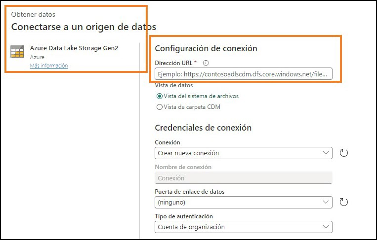
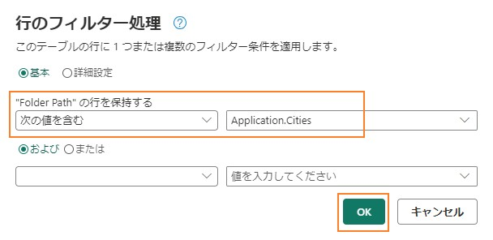
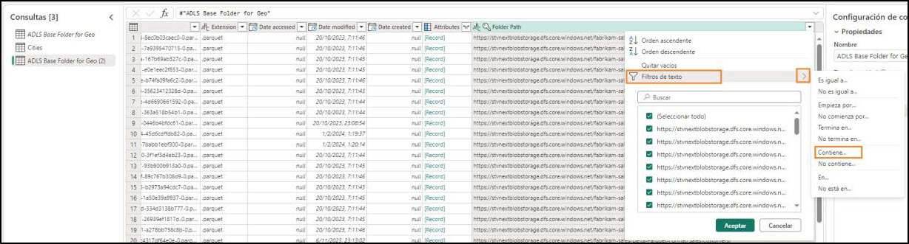
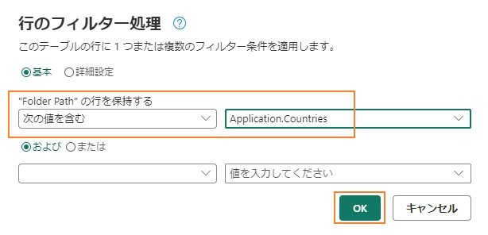
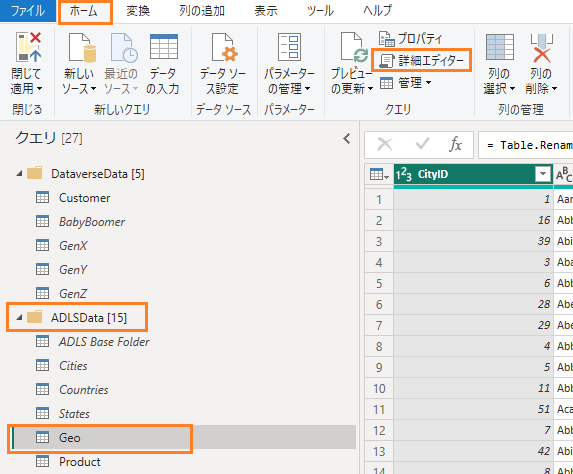
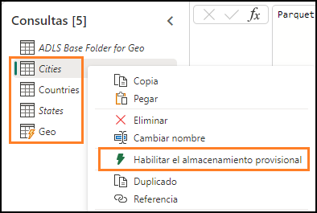
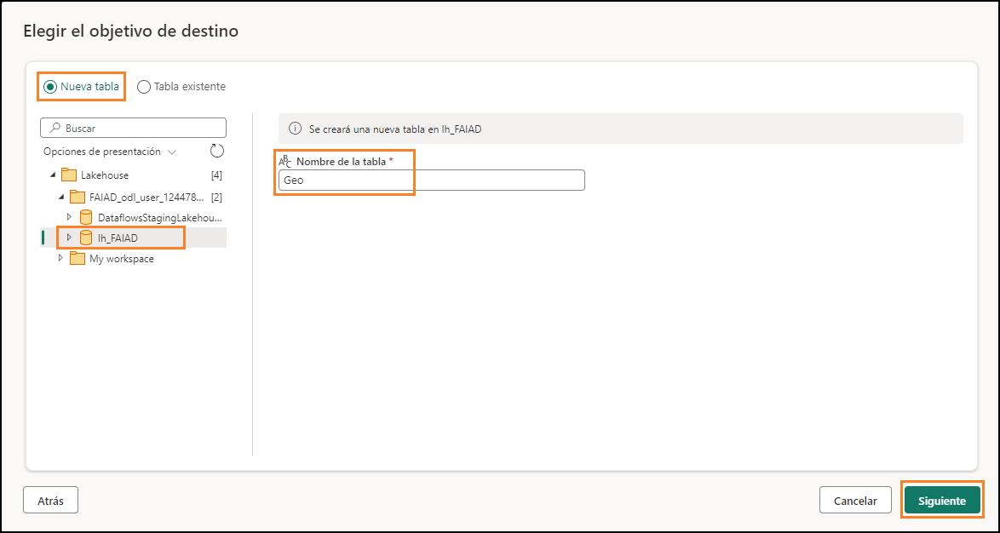
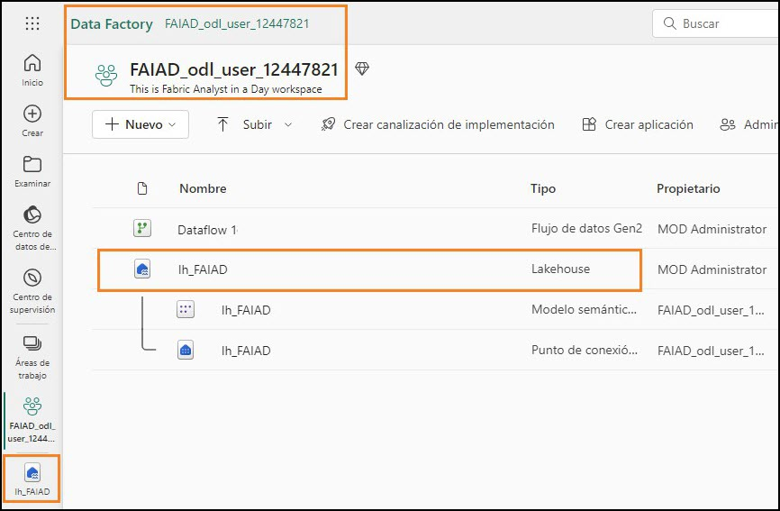
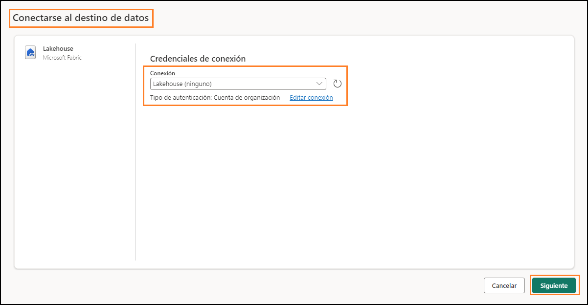

 	 
 
## 目次
概要	3 
Dataflow Gen2	4 
タスク 1: Dataflow Gen2 を作成する	4 
タスク 2: ADLS Gen2 への接続を作成する	5 
タスク 3: ADLS Gen2 フォルダーの基本クエリを作成する	8 
タスク 4: Cities クエリを作成する	10 
タスク 5: Countries クエリを作成する	13 
タスク 6: コピーを使用して States を作成する – オプション1	15 
タスク 7: コピーを使用して Geo クエリを作成する – オプション 2	17 
タスク 8: Geo クエリのデータ送信先を構成する	20 
タスク 9: Dataflow を公開する	24 
タスク 10: Dataflow の名前を変更する	25 
タスク 11: Dataflow 内の残りのクエリを構築する	27 
タスク 12: 残りのクエリのデータ送信先を構成する	29 
リファレンス	33 

 
# 概要

このシナリオでは、ERP システムから入ってきた Sales データがADLS Gen2 に格納されています。毎日正午 (午後 0 時) に更新されます。このデータを変換して Lakehouse に取り込み、モデルで使用する必要があります。

このデータは複数の方法で取り込むことができます。

- **ショートカットを用使する。** この方法ではデータを変換できません。
- **Notebooks を使用する。** この場合はコードを書く必要があります。開発者にとってやりやすいアプローチです。
- **Dataflow Gen2 を使用する。** Power Query や Dataflow Gen1 についてはおそらくなじみがあることと思います。Dataflow Gen2 はその名前が示すように、新しいバージョン
  の Dataflow です。Power Query と Dataflow Gen1 のすべての機能に加え、データを変換して複数のデータ ソースに取り込む機能が追加されています。これについては以降のラボで紹介します。
- **データ パイプラインを使用する。** データ パイプラインはオーケストレーション ツー
  ルです。アクティビティに調整を加え、データを抽出、変換して取り込むことができます。ここではデータパイプラインを使用して Dataflow Gen2 のアクティビティを実行し、抽出、変換、取り込みを行います。

まずは Dataflow Gen2 から始め、データ ソースへの接続を作成し、必要な変換を行います。その後、データ パイプラインを使用して Dataflow Gen2 に調整を加え、実行します。

このラボを終了すると、次のことが学べます。
- Dataflow Gen2 の作成方法
- Dataflow Gen2 を使用して ADLS Gen2 に接続し、データを変換する方法
- データを Lakehouse に取り込む方法
 
## Dataflow Gen2

## タスク 1: Dataflow Gen2 を作成する
1.	ラボ 2 のタスク 9 で作成した **Fabric ワークスペース**に戻ります。

2.	前のラボの終了後に別の場所に移動していない場合は、Lakehouse    の画面が表示されて
    います。別の場所に移動した場合でも問題ありません。画面の左下の **Fabric エクスペリエンス セレクター** アイコンを選択します。

3.	開いているFabric エクスペリエンスダイアログから Data Factory を選択します。**Data Factory** にはデータの抽出、変換、取り込みに必要なワークロードがあります。

    

    
 
4.	Data Factory のホーム ページが表示されます。[新規] で、**データフロー (Gen2) を選択します。**

    **Dataflow のページ**が表示されます。この画面は Dataflow Gen1 やPower Query の画面と似て
    いるため、見覚えがあることと思います。データを変換する機能とともに、さまざまなデー タソースに接続するためのオプションを利用できます。ADLS Gen2 データソースに接続
    し、いくつかの変換を実行してみましょう。

## タスク 2:  ADLS Gen2 への接続を作成する
1.	リボンで**ホーム -> データを取得 -> 詳細**の順に選択します。

     
 
2.	**データを取得のデータ   ソースの選択**ダイアログが表示されます。検索ボックスに入力す
    ることでデータ ソースを検索できます。左パネルには、空のテーブルまたは空のクエリを使用するオプションがあります。ファイルをアップロードするための新しいオプショ

    

    ンもあります。このオプションについては、後続のラボで詳しく見ていきます。ここで は、画面右隅にある**詳細表示** -> をクリックしてみましょう。
    これで、利用可能なすべてのデータ ソースが表示されます。データ ソースをファイル、データベース、Microsoft Fabric、Power Platform、Azure などでフィルター処理するオプションがあります。

     

3.	上部のフィルター オプションから **Azure** を選択して、Azure のデータ ソースに絞り込みます。
 
4.	**Azure Data Lake Storage Gen2** を選択します。

    

5.	[データ ソースへの接続] ダイアログが表示されます。ADLS Gen2 データ ソースへの接続を作成する必要があります。**接続設定 -> URL** にリンク
    <https://stvnextblobstorage.dfs.core.windows.net/fabrikam-sales/Delta-Parquet-Format> を
    入力します。

    

6.	[認証の種類] ドロップダウンから、**アカウント** **キー**を選択します。
 
7. **環境変数**タブ ([ラボ ガイド] タブの横) から **ADLS ストレージアカウントのアクセス キー**

     

     をコピーし、**アカウント キー** テキストボックスに貼り付けます。

8.	画面右下の**次へ**を選択します。

## タスク 3: ADLS Gen2 フォルダーの基本クエリを作成する

   

1.	接続が確立されると、**フォルダー データのプレビュー**画面が表示されます。ADLS  Gen2 フォルダーには多数のファイルがあります。その中のいくつかのファイルのデータが必 要です。**作成**を選択して、フォルダーへの接続を作成します。
 
2.	**Power Query** のダイアログに戻ります。これがADLS Gen2 のルート フォルダーへの接続
    になります。このクエリは後続のクエリで参照します。クエリの名前を変更しましょ う。**右パネルのクエリの設定 ->プロパティ-> 名前**で、名前を **ADLS Base Folder for Geo** に変更します。

3.	Dataflow Gen2 からのすべてのクエリは、デフォルトでステージング Lakehouse に読み込
    まれます。このラボではデータをステージングすることはありません。この読み込みを 無効にするには、**左パネルで ADLS Base Folder クエリを右クリック**します。
    **注:** ステージングは、データを使用する準備が整う前に、さらに変換するためにデータをステージングする必要がある場合に使用されます。

4.	**ステージングを有効にする**オプションをオフにします。

    

    フォルダー内には、**json と parquet** という 2 つのファイル形式があります。

- **Parquet**  は、フラット カラムナストレージデータ形式を処理するために構築されたオープンソースファイル形式です。Parquet  は大量の複雑なデータを処理するのに適しており、データ圧縮のパフォーマンスが高く、幅広い種類のエンコーディングを処理できることで知られています。
- **Json** ファイルには、スキーマ (parquet ファイルのデータ型) などのメタデータが含まれています。

5.	必要なのは、必要なデータが含まれている parquet  ファイルのみです。**拡張子列**の**ド
    ロップダウン矢印**を選択します。
 
6.	**.json** のチェックを外して、.parquet ファイルに絞り込みます。

7.	**OK** を選択します。

    

これで、基本クエリが設定されました。すべてのGeo クエリでこのクエリを参照できます。

## タスク 4: Cities クエリを作成する
Sales データは、Geography、Product、SalesPerson、Date の細分性で入手できます。まず Geo ディメンションを取得するクエリを作成しましょう。Geo データは、次のサブフォルダーにある 3 つの異なるファイルで利用できます。 
- **Cities:** Application.Cities 
- **Countries:** Application.Countries 
- **State:** Application.StateProvinces 
これら 3 つのファイルの City、State、Country のデータを組み合わせて Geo ディメンションを作成する必要があります。

1.	まずは City から始めましょう。左パネルで、**ADLS Base Folder for Geo を右クリックします。参照**を選択して、ADLS Base Folder for Geo クエリを参照する新しいクエリを作成します。
 
     

2.	**Folder Path 列のドロップダウン矢印**を選択します。

    

3.	**テキスト フィルター-> 次の値を含む...** を選択します。

    

4. **行のフィルター処理**ダイアログに、**Application.Cities** と入力します。

     **注:** 大文字と小文字が区別されます。
 
5.	**OK** を選択します。

    

6.	データは 1 つの行に絞り込まれます。**Content 列のBinary** を選択します。

    

7.	City のすべての詳細が表示されます。**右パネルのクエリの設定 -> プロパティ-> 名前**で、名前を **Cities** に変更します。

    **注:** スクリーンショットの右下隅で、クエリに適用されたステップが 4 つあることを確認し、クエリの読み込みが完了するのを待ちます。数分かかる場合があります。

    

    右パネルの**適用されたステップ**に、すべてのステップが登録されています。この動作は
    Power Query と似ています。次は、同様のプロセスに従って、**Country** クエリを作成しましょう。
 
## タスク 5: Countries クエリを作成する
1.	左パネルで、**ADLS Base Folder for Geo を右クリックします。参照**を選択して、ADLS Base Folder for Geo クエリを参照する新しいクエリを作成します。

    

2.	**Folder Path 列**の**ドロップダウン**を選択します。

    

3.	**テキスト フィルター-> 次の値を含む...** を選択します。

    

4.	**行のフィルター処理ダイアログに、Application.Countries** と入力します。

    **注:** 大文字と小文字が区別されます。
 
5.	**OK** を選択します。

    

6.	データは 1 つの行に絞り込まれます。**Content 列**の **Binary** を選択します。

    

7.	Country のすべての詳細が表示されます **。右パネルのクエリの設定 -> プロパティ-> 名前**
    で、名前を **Countries** に変更します。

    **注:** スクリーンショットの右下隅で、クエリに適用されたステップが 4 つあることを確認し、クエリの読み込みが完了するのを待ちます。数分かかる場合があります。

    

次はState を取り込む必要がありますが、同じステップの繰り返しです。Power BI Desktop ファイルには既にクエリがあります。そこからクエリをコピーできるかどうかを見てみましょう。
 
## タスク 6: コピーを使用してStates を作成する– オプション 1
1.	まだ開いていない場合は、自分のラボ環境の **C:\FAIAD\Reports**  フォルダーにある
    **FAIAD.pbix** を開きます。

2.	リボンから**ホーム -> データの変換**を選択します。Power Query ウィンドウが開きます。前のラボで確認したように、左パネルのクエリはデータ ソースごとに整理されています。

    

3.	左パネルの ADLSData フォルダーにある **States クエリを右クリック**し、**コピー**を選択します。

    

4.	ブ**ラウザー**に戻ります。作業中の Dataflow が表示されます。

5.	左パネルで**クエリ** パネルを選択し、**Ctrl+V** を押します (現時点では右クリックの貼り付けには対応していません)。MAC デバイスを使用している場合は、Cmd + V キーを使用し
    て貼り付けてください。
 
    **注:**  ラボ環境で作業している場合は、画面の右側にある省略記号を選択してください。スライダーを使用して **VM ネイティブクリップボードを有効**にします。ダイアログで[OK] を選択します。クエリの貼り付けが済んだら、このオプションを無効にし       てかまいません。

    

    ADLS Base Folder もコピーされることに注意してください。これは、States クエリがPower BI Desktop のADLS Base Folder を参照しているものの、似たクエリが既に存在するためです。これを解決しましょう。

6.	**States** クエリを選択します。

7.	**右側のパネル**の**適用されたステップ**で、**ソース**を選択します。

8.	数式バーで、#"ADLS Base Folder" を **#"ADLS Base Folder for Geo"** に変更します。

    
 
9.	数式バーの横にある**チェック マークをク**リックするか、**Enter**  キーを押します。

    

10.	これで ADLS Base Folder を削除できます。左パネルの**クエリ** セクションで **ADLS Base Folder** クエリを**右クリック**し、**削除**を選択します。

    

11.	[クエリの削除] ダイアログが表示されます。**削除**を選択して確定します。

    **注:** クエリに適用されたステップが 4 つあることを確認し、クエリの読み込みが完了するまで待ちます。数分かかる場合があります。

## タスク 7: コピーを使用して Geo クエリを作成する– オプション 2
次は、これらのクエリをマージして Geo ディメンションを作成する必要があります。Power BI Desktop ファイルからクエリを再度コピーしてみましょう。今回は詳細エディターからコードをコピーします。
1.	Power BI Desktop ファイルの **Power Query のウィンドウ**に戻ります。

2.	左パネルの**クエリ**で、ADLSData フォルダーにある **Geo** クエリを選択します。
 
3.	リボンから**ホーム -> 詳細エディター**を選択します。

    

4.	詳細エディターのウィンドウが開きます。詳細エディターで**すべてのテキストを強調表 示**します。

5.	**右クリック**して **Copy** を選択します。

    

6.	ウィンドウの右上隅にある **X** を選択するか、**完了**を選択して、詳細エディターのウィンドウを閉じます。

7.	ブラウザーの **Dataflow** のウィンドウに戻ります。
 
8.	リボンから**データを取得 -> 空のクエリ**を選択します。

    

9.	[データを取得] の[データソースへの接続] 詳細エディター ダイアログが開きます。エディターで**すべてのテキストを強調表示**します。

10.	すべてのテキストを削除するには、キーボードで **Delete**  キーを押します。

11.	詳細エディターは空にする必要があります。次に、**Ctrl+V** を押して、Power BI Desktop の詳細エディターからコピーしたコンテンツを貼り付けます。

12.	**次へ**を選択します。

    
 
13.	これで、Geo ディメンションが作成されました。クエリの名前を変更しましょう。**右パネルのクエリの設定 -> プロパティ-> 名前**で、名前を **Geo** に変更します。

    **注:** クエリの読み込みが完了するまで待ちます。数分かかる場合があります。

    Geo がどのように作成されたかを理解するために、そのステップを一通り見てみましょう。右側のパネルの適用したステップで、**ソース**を選択します。数式バーを見るか、[設定] をクリックすると、このクエリのソースが Cities と States の結合であること      がわかります。ス
    テップを進めていくと、最初の結合結果が今度は Countries  と結合されていることがわかります。したがって、3 つのクエリはすべて Geo ディメンションの作成に使用されています。

     

## タスク 8: Geo クエリのデータ送信先を構成する
これでディメンションが作成されました。次は、このデータを Lakehouse に取り込みましょう。これは Dataflow Gen2 で利用できるようになった新機能です。

   

1.	前述したように、ここではこのデータを一切ステージングしません。そのため、**Cities** クエリを**右クリック**し、**ステージングを有効にする**を選択してチェックマークを外します。
 
2.	**Countries** クエリと **Geo** クエリでも同じステップを実行し、**ステージングを有効にするの横にあるチェック マークを外します。**

3.	**Geo** クエリを選択します。

4.	右下隅の**データ同期先**の横にある + を選択します。

5.	ダイアログで**レイクハウス**を選択します。

    

6.	[データ変換先に接続] ダイアログが開きます。Lakehouse への新しい接続を作成する必要があります。**接続ドロップダウン**で**新しい接続の作成**を選択し、**認証の種類を組織アカ**
    **ウント**に設定して、**次へ**を選択します。

    

7.	接続が作成されると、[宛先ターゲットの選択] ダイアログが開きます。新しいテーブルを作成しているため、**新しいテーブル ラジオ ボタ**ンがオンになっていることを確認してください。
 
8.	先ほど作成した Lakehouse  にテーブルを作成する必要があります。左パネルで、
    **Lakehouse -> FAIAD_<ユーザー名>** に移動します。

9.	**lh_FAIAD** を選択します。

10.	テーブル名は **Geo** のままにします。

11.	**次へ**を選択します。

     

12.	[宛先の設定を選択する] ダイアログが開きます。**スライダ**ーを使用して**自動設定を無効にします。** オプションを確認しましょう。
    既存のテーブルに**データを追加する**オプションまたは置き換えるオプションがあること に注意してください。
    また、**公開時のスキーマ   オプション**があります。スキーマを固定したままにするオプ
    ションがあります。または、時間が経つと変化する場合は、動的スキーマのオプション があります。
    "一部の列名には、サポートされていない文字が含まれています。問題を解決する必要が ありますか?" という警告が表示されます。レイクハウスでは列名にスペースを使用できません。[修正する] を選択すると、アンダースコアが追加されて列名のスペースが      置き換えられます。
**注:** [ソース] 列の右側のチェック ボックスを使用すると、レイクハウスに読み込む列だけを選択できます。

    
 
13.	このシナリオでは、自動設定を使用します。**自動設定を使用する**スライダーを有効にし ます。宛先列の名前がアンダースコアで自動的に修正されることに注意してください。

14.	列マッピングを使用して、データフロー列を既存の列にマップできます。この場合、 それは新しいテーブルです。そのため、既定値を使用できます。**設定の保存**を選択し ます。

    

 
## タスク 9: Dataflow を公開する
1.	**Power Query のウィンドウ**に戻ります。右下隅を見ると、**データの同期先がレイクハウスに設定されています。**

    

2.	Lakehouse を確認できるように、これらのクエリを公開しましょう。後で戻ってきてさらにクエリを追加する予定です。右下隅の**公開**を選択します。

3.	**FAIAD_<ユーザー名> ワークスペース**に自動的に戻ります。Dataflow が公開されるまで、しばらくかかる場合があります。済んだら、中央のペインまたは左側のパネルから
    **lh_FAIAD レイクハウス**を選択します。

    
 
4.	**Lakehouse のエクスプローラー画面**が表示されます。左パネルで、**lh_FAIAD -> テーブル**
    を展開します。

5.	現在、Lakehouse には Geo テーブルがあります。**Geo** を展開し、すべての列を確認します。

6.	**Geo** テーブルを選択すると、右パネルにデータ プレビューが開きます。

    

このテーブルのクエリに使用できる SQL エンドポイントもあります。このオプションについては、後続のラボで見ていきます。Geo  データが Lakehouse  に到達したことがわかったので、残りのデータを ADLS Gen2 から取り込みましょう。

## タスク 10: Dataflow の名前を変更する
1.	左のメニュー バーで、**FAIAD_<ユーザー名>**  を選択して、**ワークスペース**に戻ります。

2.	ここでは Dataflow 1 を操作しています。先に進む前に名前を変更しましょう。Dataflow 1
    の横にある **省略記号 (…)** をクリックします。**プロパティ**を選択します。
 
    

3.	[Dataflow のプロパティ] ダイアログが開きます。名前を **df_Sales_ADLS** に変更します。

    **注:** Dataflow 名の前に **df** を追加します。これにより、検索と並び替えが容易になります。

4.	**説明**テキスト ボックスに、**Dataflow to ingest Sales Data from ADLS to Lakehouse** と入力します。

    

5.	**保存**を選択します。
 
## タスク 11: Dataflow 内の残りのクエリを構築する
1.	**FAIAD_<ユーザー名>  ワークスペース**に自動的に戻ります。データフロー **df_Sales_ADLS**
    を選択して、データフローに戻ります。

    

    容易に進められるように、Power BI Desktop からクエリをコピーできるかどうかを見てみましょう。

2.	まだ開いていない場合は、自分のラボ環境の **C:\FAIAD\Reports**  フォルダーにある
    **FAIAD.pbix** を開きます。

3.	リボンから**ホーム -> 変換**を選択します。Power Query ウィンドウが開きます。

4.	左の**クエリ** パネルで、**ADLSData** から次のクエリを **Ctrl+Select** を押しながら選択します。 
    a.	Product 
    b.	Product Groups 
    c.	Product Item Group 
    d.	Product Details 
    e.	Invoice 
    f.	InvoiceLineItems 
    g.	Sales 
    h.	BuyingGroup 
    i.	Reseller 
    j.	Date 
 
5.	**右クリック**して**コピー**を選択します。

    

6.	ブラウザーの Dataflow **df_Sales_ADLS** のウィンドウに戻ります。

7.	左パネルで**クエリ** パネルを選択し、**Ctrl+V** を押します (現時点では右クリックの貼り付けには対応していません)。MAC デバイスを使用している場合は、Cmd + V キーを使用して貼り付けてください。
    **注:**  ラボ環境で作業している場合は、画面の右側にある省略記号を選択してください。スライダーを使用して **VM ネイティブクリップボード**を**有効**にします。ダイアログで[OK] を選択します。クエリの貼り付けが済んだら、このオプションを無効にしてかまい 
    ません。

    
 
8.	前述したように、ここではこのデータを一切ステージングしません。そのため、次のクエ
    リを**右クリック**し、**ステージングを有効にする**を選択してチェック マークを外します。 
    a.	Product 
    b.	Product Details 
    c.	Reseller 
    d.	Sales 
    e.	Date 

    **注:** Power BI Desktop で読み込みが無効になっている場合、Dataflow のステージングを無
    効にする必要はありません。したがって、Product Item Group、Product Groups などのステージングを無効にする必要はありません。
   
    
 
    **すべてのクエリが処理されていること**を確認してください。完了したら、このデータを 

    Lakehouse に取り込みましょう。

## タスク 12: 残りのクエリのデータ送信先を構成する
1.	**Product** クエリを選択します。

2.	リボンから**ホーム -> データ同期先の追加 -> レイクハウス**を選択します。

    

3.	[データ変換先に接続] ダイアログが開きます。**接続ドロップダウン**から **Lakehouse (なし)**
    を選択します。

4.	**次へ**を選択します。

    

5.	[宛先ターゲットの選択] ダイアログが開きます。新しいテーブルを作成しているため、
   **新しいテーブル ラジオ ボタン**がオンになっていることを確認してください。

6.	先ほど作成した Lakehouse  にテーブルを作成する必要があります。左パネルで、
    **Lakehouse -> FAIAD_<ユーザー名>** に移動します。

7.	**lh_FAIAD** を選択します。

8.	テーブル名は **Product** のままにします。

    
 
9.	**次へ**を選択します。

10.	[宛先の設定を選択する] ダイアログが開きます。今度は、自動設定を使用し、それによってデータの完全な更新が行われます。また、必要に応じて列の名前も変更されま す。**設定の保存**を選択します。

    

11.	**Power Query のウィンドウ**に戻ります。**右下隅**を見ると、データ同期先が**レイクハウス**
    に設定されています。

12.	同様に、次のクエリの**データ同期先**を設定します。 
    a.	Product Details 
    b.	Reseller 
    c.	Sales 
    d.	Date 

    
 
13.	ADLS から Lakehouse にデータを取り込むデータ フローがあります。このデータフローを公開してみましょう。右下隅の**公開**を選択します。 

    **FAIAD_<ユーザー名> ワークスペース**に自動的に戻ります。データフローが更新されるまでに、数分かかる場合があります。
    次のラボでは、他のデータ ソースからデータを取り込みます。
 
# リファレンス

Fabric Analyst in a Day (FAIAD) では、Microsoft Fabric で使用できる主要な機能の一部をご紹介します。サービスのメニューにあるヘルプ (?) セクションには、いくつかの優れたリソースへのリンクがあります。

   

Microsoft Fabric の次のステップに役立つリソースをいくつか以下に紹介します。

- ブログ記事で [Microsoft-Fabric-のGA-に関するお知らせ](https://aka.ms/Fabric-Hero-Blog-Ignite23) の全文を確認する
- [ガイド付きツアー](https://aka.ms/Fabric-GuidedTour) を通じて Fabric を探索する
- [Microsoft Fabric の無料試用版](https://www.microsoft.com/en-us/microsoft-fabric/getting-started) にサインアップする
- [Microsoft Fabric のWeb サイト](https://www.microsoft.com/en-in/microsoft-fabric) にアクセスする
- [Fabric の学習モジュール](https://learn.microsoft.com/en-us/training/browse/?products=fabric&resource_type=module)で新しいスキルを学ぶ
- [Fabric の技術ドキュメント](https://learn.microsoft.com/en-us/fabric/) を参照する
- [Fabric 入門編の無料のe-book](https://info.microsoft.com/ww-landing-unlocking-transformative-data-value-with-microsoft-fabric.html) を読む
- [Fabric コミュニティ](https://community.fabric.microsoft.com/)に参加し、質問の投稿やフィードバックの共有を行い、他のユーザーから学びを得る

より詳しい Fabric  エクスペリエンスのお知らせに関するブログを参照してください。

- [Fabric の Data Factory エクスペリエンスに関するブログ](https://blog.fabric.microsoft.com/en-us/blog/introducing-data-factory-in-microsoft-fabric/)
- [Fabric のSynapse Data Engineering エクスペリエンスに関するブログ](https://blog.fabric.microsoft.com/en-us/blog/introducing-synapse-data-engineering-in-microsoft-fabric/)
- [Fabric のSynapse Data Science エクスペリエンスに関するブログ](https://blog.fabric.microsoft.com/en-us/blog/introducing-synapse-data-science-in-microsoft-fabric/)
- [Fabric のSynapse Data Warehousing エクスペリエンスに関するブログ](https://blog.fabric.microsoft.com/en-us/blog/introducing-synapse-data-warehouse-in-microsoft-fabric/)
- [Fabric のSynapse Real-Time Analytics エクスペリエンスに関するブログ](https://blog.fabric.microsoft.com/en-us/blog/sense-analyze-and-generate-insights-with-synapse-real-time-analytics-in-microsoft-fabric/)
- [Power BI のお知らせに関するブログ](https://powerbi.microsoft.com/en-us/blog/empower-power-bi-users-with-microsoft-fabric-and-copilot/)
- [Fabric の Data Activator エクスペリエンスに関するブログ](https://blog.fabric.microsoft.com/en-us/blog/driving-actions-from-your-data-with-data-activator/)
- [Fabric の管理とガバナンスに関するブログ](https://blog.fabric.microsoft.com/en-us/blog/administration-security-and-governance-in-microsoft-fabric/)
- [Fabric の OneLake に関するブログ](https://blog.fabric.microsoft.com/en-us/blog/microsoft-onelake-in-fabric-the-onedrive-for-data/) 
- [Dataverse とMicrosof t Fabric の統合に関するブログ](https://cloudblogs.microsoft.com/dynamics365/it/2023/05/24/new-dataverse-enhancements-and-ai-powered-productivity-with-microsoft-365-copilot/)

© 2023 Microsoft Corporation. All rights reserved.

このデモ/ラボを使用すると、次の条件に同意したことになります。

このデモ/ラボで説明するテクノロジまたは機能は、ユーザーのフィードバックを取得 し、学習エクスペリエンスを提供するために、Microsoft Corporation によって提供されます。ユーザーは、このようなテクノロジおよび機能を評価し、Microsoft にフィードバックを提供するためにのみデモ/ラボを使用できます。それ以外の目的には使用できませ ん。このデモ/ラボまたはその一部を、変更、コピー、配布、送信、表示、実行、再現、 発行、ライセンス、著作物の作成、転送、または販売することはできません。
複製または再頒布のために他のサーバーまたは場所にデモ/ラボ (またはその一部) をコピーまたは複製することは明示的に禁止されています。
 
このデモ/ラボは、前に説明した目的のために複雑なセットアップまたはインストールを 必要としないシミュレーション環境で潜在的な新機能や概念などの特定のソフトウェアテクノロジ/製品の機能を提供します。このデモ/ラボで表されるテクノロジ/概念は、フル機能を表していない可能性があり、最終バージョンと動作が異なることがあります。また、そのような機能や概念の最終版がリリースされない場合があります。物理環境でこのような機能を使用するエクスペリエンスが異なる場合もあります。
**フィードバック。** このデモ/ラボで説明されているテクノロジ、機能、概念に関する フィードバックをMicrosoft に提供する場合、ユーザーは任意の方法および目的でユー
ザーのフィードバックを使用、共有、および商品化する権利を無償で Microsoft に提供するものとします。また、ユーザーは、フィードバックを含む Microsoft のソフトウェアまたはサービスの特定部分を使用したり特定部分とインターフェイスを持ったりする製 品、テクノロジ、サービスに必要な特許権を無償でサード パーティに付与します。ユーザーは、フィードバックを含めるために Microsoft がサード パーティにソフトウェアま たはドキュメントをライセンスする必要があるライセンスの対象となるフィードバックを提供しません。これらの権限は、本契約の後も存続します。
Microsoft Corporation は、明示、黙示、または法律上にかかわらず、商品性のすべての保証および条件、特定の目的、タイトル、非侵害に対する適合性など、デモ/ラボに関する すべての保証および条件を拒否します。Microsoft は、デモ/ラボから派生する結果、出力の正確さ、任意の目的に対するデモ/ラボに含まれる情報の適合性に関して、いかなる 保証または表明もしません。

**免責事項**

このデモ/ラボには、Microsoft Power BI の新機能と機能強化の一部のみが含まれています。一部の機能は、製品の将来のリリースで変更される可能性があります。このデモ/ラ ボでは、新機能のすべてではなく一部について学習します。
