## Introduzione
Nel nostro scenario i dati di vendita provengono dal sistema ERP e sono archiviati in un ADLS Gen2. Vengono aggiornati alle 12.00 ogni giorno. Dobbiamo trasformare e inserire questi dati in Lakehouse e usarli nel nostro modello.
Vi sono più modi per inserire questi dati. 
•	**Collegamenti**: non forniscono un modo per trasformare i dati. 
•	**Notebook**: richiedono la scrittura di codice. È un approccio pensato per gli sviluppatori. 
•	**Flusso di dati Gen2**: probabilmente si ha familiarità con Power Query o Flusso di dati Gen1. Flusso di dati Gen2, come indica il nome, è la versione più recente di Flusso di dati. Fornisce tutte le funzionalità di Power Query/Flusso di dati Gen1 con la possibilità aggiuntiva di trasformare e inserire dati in più origini dati. Ne parleremo nei prossimi due lab.
•	**Pipeline di dati**: questo è uno strumento di orchestrazione. Le attività possono essere. 
orchestrate per estrarre, trasformare e acquisire dati. Useremo Pipeline di dati per eseguire l'attività di Flusso di dati Gen2 che a sua volta eseguirà l'estrazione, la trasformazione e
l'acquisizione. 

Inizieremo con Flusso di dati Gen2 per creare una connessione all'origine dati e le trasformazioni necessarie. Quindi useremo Pipeline di dati per orchestrare/eseguire Flusso di dati Gen2. 
In questo lab si imparerà a: 
•	Creare Flusso di dati Gen2 
•	Connettere ADLS Gen2 mediante Flusso di dati Gen2 e trasformare i dati 
•	Inserire dati in lakehouse 

## Flusso di dati Gen2
### Attività 1 - Creazione di Flusso di dati Gen2
1.	Torniamo all'**area di lavoro di Fabric** creata nel Lab 2, attività 9.
2.	Se non si è usciti dopo il lab precedente, ci si trova nella schermata Lakehouse. Se si è usciti, non c'è problema. Selezionare l'icona **selettore esperienza in Fabric** in basso a sinistra della schermata.
3.	Selezionare **Data Factory** dalla finestra delle esperienze in Fabric aperta. Data Factory offre i carichi di lavoro necessari per estrarre, trasformare e inserire dati.
 
   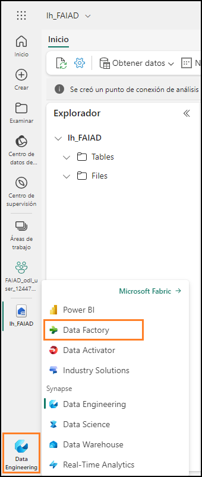
  	
4.	Si apre la home page di Data Factory. In Nuovo selezionare **Flusso di dati Gen2**.

   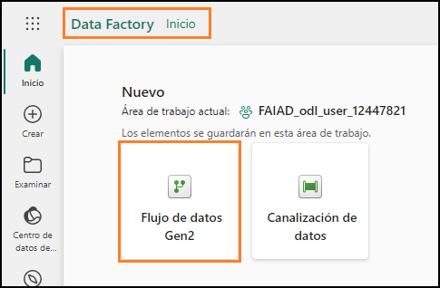

Si apre la pagina **Flusso di dati**. Questa schermata sembrerà familiare poiché è simile a quella di Flusso di dati Gen1 o Power Query. Sono disponibili opzioni per connettersi alle varie origini dati e per trasformare i dati. Effettuiamo la connessione all'origine dati ADLS Gen2 ed eseguiamo alcune trasformazioni.
 
### Attività 2 - Creazione della connessione ad ADLS Gen2
1.	Nella barra multifunzione selezionare **Home -> Recupera -> Altro…**

   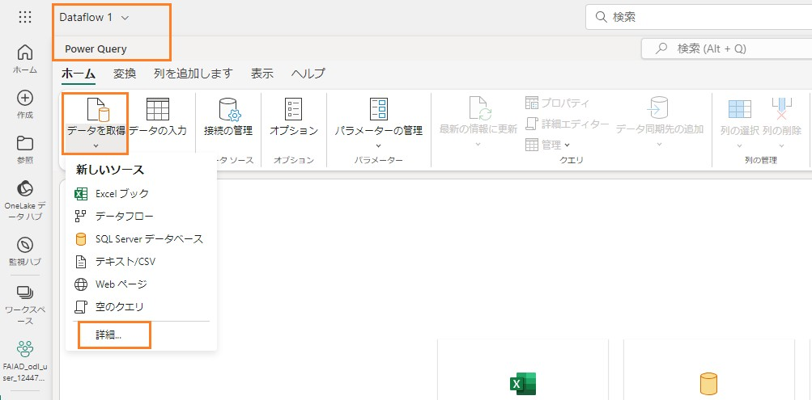

2.	Si apre la finestra di dialogo **Recupera dati Scegli origine dati**. È possibile cercare l'origine dati digitando nella casella di ricerca. Notare che nel pannello di sinistra sono disponibili opzioni per usare una tabella vuota o una query vuota. Si troverà anche una nuova opzione per caricare il file. Esamineremo questa opzione in un lab successivo. Per il momento, facciamo clic su
**Visualizza altro** -> nell'angolo destro dello schermo.

 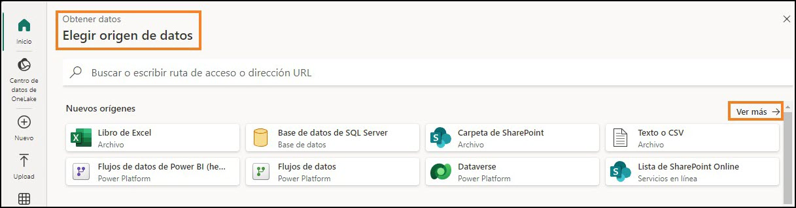

 
  
  
Ora è possibile visualizzare tutte le origini dati disponibili. Si ha la possibilità di filtrare le origini dati per file, database, Microsoft Fabric, Power Platform, Azure e così via.

3.	Selezionare **Azure** dalle opzioni di filtro in alto per filtrare in base alle origini dati di Azure.
4.	Selezionare **Azure Data Lake Storage Gen2**.

   

5.	Si apre la finestra di dialogo Connetti all'origine dati. È necessario creare una connessione all'origine dati ADLS Gen2. In **Impostazioni connessione -> URL** immettere il seguente
collegamento: https://stvnextblobstorage.dfs.core.windows.net/fabrikam-sales/Delta- Parquet-Format
 
   

6.	Selezionare **Chiave account** dal menu a discesa Tipo di autenticazione.
7.	Copiare la c**hiave di accesso dell'account di archiviazione ADLS** nella scheda **Variabili di
ambiente** (accanto alla scheda Guida al lab) e incollarla nella casella di testo **Chiave account**.

   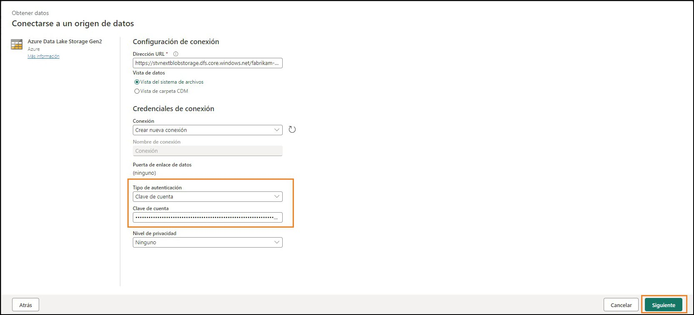

8.	Selezionare **Avanti** nella parte inferiore destra della schermata.
 
### Attività 3 - Creazione di una query della cartella ADLS Gen2 di base
1.	Una volta stabilita la connessione, si aprirà la schermata **Anteprima dati cartella**. La cartella ADLS Gen2 contiene molti file. Abbiamo bisogno di dati da alcuni di essi. Selezionare **Crea** per creare una connessione alla cartella.

   

2.	Si torna alla finestra di dialogo **Power Query**. Questa sarà la connessione alla cartella radice di ADLS Gen2. Faremo riferimento a questa query nelle query successive. Nel **pannello di destra**, in **Impostazioni query -> Proprietà -> Nome**, cambiare il nome in **ADLS Base Folder for Geo**

3.	Per impostazione predefinita, tutte le query di Flusso di dati Gen2 vengono caricate per impostazione predefinita in un lakehouse di staging. Nell'ambito di questo lab, non effettueremo lo staging dei dati. Per disabilitare questo carico, nel **pannello di sinistra fare clic con il pulsante destro del mouse sulla query ADLS Base Folder.**

**Nota**: si usa lo staging quando è necessario effettuare un'ulteriore trasformazione dei dati da usare in prima che siano pronti per il consumo.

4.	Disabilitare l'opzione **Abilita staging**.

   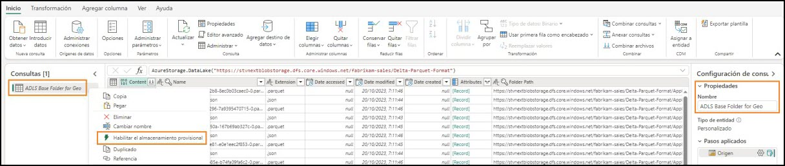
 
Notare che vi sono due formati di file nella cartella: **JSON e Parquet**.

- **Parquet**: è un formato di file open source creato per gestire formati di dati di archiviazione a colonne flat. Il formato Parquet funziona bene con dati complessi in grandi volumi, offre prestazioni elevate nella compressione dei dati e consente di gestire di un'ampia varietà di tipi di codifica.

- **JSON**: è un formato di file che contiene metadati quali schema e tipo di dati del file Parquet.

5.	Abbiamo bisogno solo del file Parquet poiché contiene i dati di cui abbiamo bisogno. Selezionare la **freccia a discesa della colonna Estensione**.

6.	**Deselezionare JSON** in modo da filtrare i file Parquet.

7.	Selezionare **OK**.

   
   
Ora abbiamo impostato la query Base. Possiamo fare riferimento a questa query per tutte le query Geo.

### Attività 4 - Creazione della query Cities
I dati di vendita sono disponibili per granularità Geography, Product, Sales Person e Date. Creiamo
innanzitutto una query per ottenere la dimensione Geo. I dati geografici sono disponibili in tre diversi file situati nelle seguenti sottocartelle:
   •	**Cities**: Application.Cities
   •	**Countries**: Application.Countries
   •	**State**: Application.StateProvinces
Dobbiamo combinare i dati di città, stato/provincia e Paese da questi tre file per creare la dimensione Geo.

1.	Iniziamo con la città. Nel pannello di sinistra **fare clic con il pulsante destro del mouse su ADLS Base Folder for Geo**. Selezionare **Riferimento** per creare una nuova query che faccia riferimento alla query ADLS Base Folder for Geo.
 
   

2.	Selezionare la **freccia a discesa della colonna Percorso cartella**.

   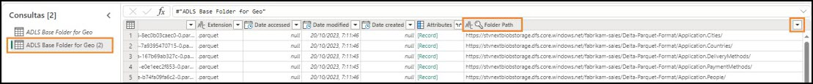
  	
4.	Selezionare **Filtri testo -> Contiene…**
 	
6.	Nella finestra di dialogo **Filtra righe** immettere **Application.Cities** Nota: questo campo fa distinzione tra maiuscole e minuscole.

   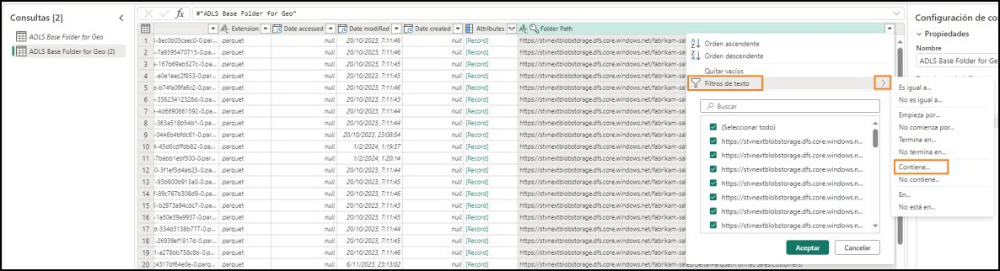
 
7.	Selezionare **OK**.

   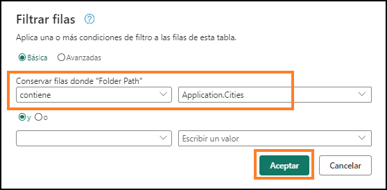
  	
9.	I dati verranno filtrati per un'unica riga. Selezionare **Binary** nella **colonna Content**.

   
  	
11.	Verranno visualizzati tutti i dettagli della città. Nel **pannello di destra**, in **Impostazioni query -> Proprietà -> Nome**, modificare il nome in **Cities**.

  **Nota**: nell'angolo inferiore destro della schermata, assicurarsi che alla query siano applicati quattro passaggi e attendere che termini il caricamento della query. L'operazione può richiedere alcuni minuti.

   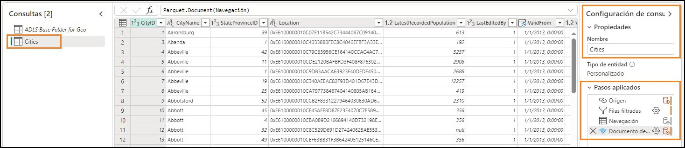
   
Nel pannello di destra, in **Passaggi applicati** verificare che tutti i passaggi siano registrati. Questo comportamento è analogo a Power Query. Ora seguiamo un processo simile per creare la query Country.
 
### Attività 5 - Creazione della query Countries
1.	Nel pannello di sinistra **fare clic con il pulsante destro del mouse su ADLS Base Folder for Geo**. Selezionare **Riferimento** per creare una nuova query che faccia riferimento alla query ADLS Base Folder for Geo.

   
    
2.	Selezionare la **freccia a discesa della colonna Percorso cartella**.

   
   
3.	Selezionare **Filtri testo -> Contiene…**

   
 
4.	Nella finestra di dialogo **Filtra righe** immettere **Application.Countries**

>**Nota**: questo campo fa distinzione tra maiuscole e minuscole.
  	
5.	Selezionare **OK**.

   
    
6.	I dati verranno filtrati per un'unica riga. Selezionare **Binario** nella **colonna Contenuto**.

   

7.	Verranno visualizzati tutti i dettagli del Paese. Nel **pannello di destra**, in **Impostazioni query -> Proprietà -> Nome**, modificare il nome in **Countries**

   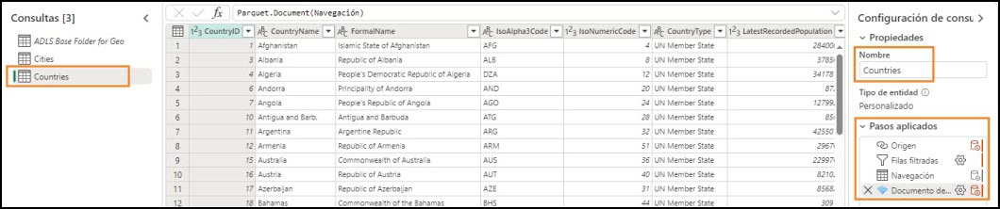

>**Nota**: nell'angolo inferiore destro della schermata, assicurarsi che alla query siano applicati quattro passaggi e attendere che termini il caricamento della query. L'operazione può richiedere alcuni minuti.

Successivamente dobbiamo inserire stato/provincia, ma i passaggi sono ripetitivi. Abbiamo già le query nel file Power BI Desktop. Verifichiamo se possiamo a copiare le query da tale file.

### Attività 6 - Creazione della query States mediante Copia – opzione 1
1.	Se non lo si è ancora aperto, aprire il file **FAIAD.pbix** nella cartella **C:\FAIAD\Reports**
dell'ambiente lab.
2.	Nella barra multifunzione selezionare **Home -> Trasforma dati**. Si apre la finestra Power Query.
Come si è notato nel lab precedente, le query nel pannello di sinistra sono organizzate per origine dati.
 
   
  
3.	Dal pannello di sinistra, nella cartella ADLSData, **fare clic con il pulsante destro del mouse sulla query States** e selezionare **Copia**.

   

4.	Tornare al **browser**. Ci si dovrebbe trovare nel flusso di dati su cui stavamo lavorando.
5.	Nel pannello di sinistra selezionare il pannello **Query** e premere **CTRL+V** (l'opzione Incolla del menu del pulsante destro non è attualmente supportata). Se si usa un dispositivo MAC, usare Cmd+V per incollare.

>**Nota**: se si lavora in un ambiente lab, selezionare i puntini di sospensione in alto a destra della schermata. Usare il dispositivo di scorrimento per **abilitare Appunti nativi VM**. Nella finestra di dialogo selezionare OK. Dopo aver incollato la query è possibile disabilitare questa opzione.

   

   
 
Si copia anche ADLS Base Folder. Questo perché la query States fa riferimento ad ADLS Base Folder in Power BI Desktop, ma abbiamo già una query simile. Risolviamo questo aspetto.

6.	Selezionare la query **States**.
7.	Nel **pannello di destra**, in **Passaggi applicati**, selezionare **Source**.
8.	Nella barra della formula modificare **#**"ADLS Base Folder" in **#"ADLS Base Folder for Geo"**

   

9. Fare clic sul **segno di spunta** accanto alla barra della formula o premere **INVIO**.

    
   
    
   
10. Ora possiamo rimuovere ADLS Base Folder. Nel pannello di sinistra, nella sezione **Query, fare clic con il pulsante destro del mouse sulla query ADLS Base Folder** e selezionare **Elimina**.

    
   	
11. Si apre la finestra di dialogo Elimina query. Selezionare **Elimina** per confermare.

>**Nota**: assicurarsi che alla query siano applicati quattro passaggi e attendere che termini il caricamento della query. L'operazione può richiedere alcuni minuti.

### Attività 7 - Creazione della query Geo mediante Copia – opzione 2
Ora dobbiamo unire queste query per creare la dimensione Geo. Copiamo nuovamente la query dal file Power BI Desktop. Questa volta copiamo il codice dall'Editor avanzato.

1.	Tornare alla **finestra di Power Query** del file Power BI Desktop.
2.	Dal pannello di sinistra, in **Query** selezionare la query Geo nella cartella ADLSData.
3.	Nella barra multifunzione selezionare **Home -> Editor avanzato**.
 
   

4.	Si apre la finestra dell'Editor avanzato. **Evidenziare tutto il testo** nell'Editor avanzato.
5.	**Fare clic con il pulsante destro del mouse** e selezionare **Copia**.

   

6.	Selezionare la **X** nell'angolo in alto a destra della finestra o selezionare **Fatto** per chiudere la finestra dell'Editor avanzato.
7.	Tornare alla finestra **Flusso di dati** nel browser.
8.	Nella barra multifunzione selezionare **Recupera dati -> Query vuota**.
 
   

9.	Si apre la finestra di dialogo Recupera dati, Connetti all'origine dati dell'Editor avanzato. **Evidenziare tutto il testo** nell'editor.
10. Premere **CANC** sulla tastiera per eliminare tutto il testo.
11. L'Editor avanzato dovrebbe essere vuoto. Ora premere **CTRL+V** per incollare il contenuto che copiato dall'Editor avanzato di Power BI Desktop.

12. Selezionare **Avanti**.

    
   	
13. Ora abbiamo la dimensione Geo. Rinominiamo la query. Nel **pannello di destra**, in **Impostazioni query -> Proprietà -> Nome,** cambiare il nome in **Geo**

>**Nota**: attendere che termini il caricamento della query. L'operazione può richiedere alcuni minuti.

 
Esaminiamo i passaggi per capire come si è creata la query Geo. Nel pannello di destra, in Passaggi applicati, selezionare Source. Se si esamina la barra della formula o si fa clic su Impostazioni, si noterà che l'origine di questa query è un join tra Cities e States. Esaminando i passaggi, si noterà che il risultato del primo join è a sua volta unito a Countries. Pertanto, tutte e tre le query vengono usate per creare la dimensione Geo.

   

### Attività 8 - Configurazione della destinazione dei dati per la query Geo
Ora che abbiamo una dimensione, inseriamo questi dati in Lakehouse. Questa è la nuova funzionalità disponibile in Flusso di dati Gen2.

1.	Come indicato in precedenza, non effettuiamo lo staging di questi dati. Quindi, f**are clic con il
pulsante destro del mouse** sulla query **Cities** e selezionare **Abilita staging** per rimuovere il segno di spunta.

  
  	
2.	Eseguire gli stessi passaggi per le query **Countries e Geo** per **rimuovere il segno di spunta** **accanto a Abilita staging**.
3.	Selezionare la query **Geo**.
4.	Nell'angolo inferiore destro selezionare "+" accanto a **Destinazione dati**.
5.	Selezionare **Lakehouse** dalla finestra di dialogo.

   
 
6.	Si apre la finestra di dialogo Connetti alla destinazione dati. Dobbiamo **creare una nuova connessione** a Lakehouse. Con l'opzione Crea nuova connessione selezionata nel menu a discesa **Connessione e Tipo di autenticazione** impostato su **Account aziendale**, selezionare **Avanti**.

   
  	
7. Una volta creata la connessione, si apre la finestra di dialogo Scegliere il target di destinazione. Assicurarsi che il pulsante di opzione Nuova tabella sia selezionato, poiché si sta creando una **nuova tabella**.

8.	 Vogliamo creare la tabella nel Lakehouse creato in precedenza. Nel pannello di sinistra andare a **Lakehouse -> FAIAD_<nomeutente>**.

9. Selezionare **lh_FAIAD**
10. Lasciare il nome della tabella **Geo**.
11. Selezionare **Avanti**.
    
    
 
12. Si apre la finestra di dialogo Scegli le impostazioni di destinazione. Usare il **dispositivo di scorrimento** per **disabilitare le impostazioni automatiche**. Diamo un'occhiata alle opzioni. Sono presenti opzioni per **aggiungere dati** alla tabella esistente o per sostituirli.

Si notino inoltre le **opzioni dello schema alla pubblicazione**. Si ha la possibilità di mantenere lo schema fisso oppure, se cambierà nel tempo, esiste un'opzione di schema dinamico.

Notare che compare l'avviso: "Alcuni nomi di colonna contengono caratteri non supportati. È necessario correggerli automaticamente?" Lakehouse non supporta i nomi di colonne che contengono spazi. Se si sceglie di selezionare Correggi, si aggiungeranno caratteri di sottolineatura per sostituire gli spazi nei nomi di colonna.

>**Nota**: la casella di controllo a destra della colonna Source permette di selezionare solo le colonne da caricare nel Lakehouse.

  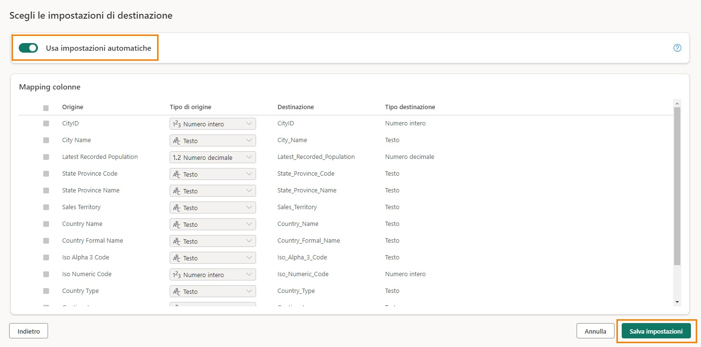
   	
13.	Nel nostro scenario useremo le impostazioni automatiche. Abilitare il dispositivo di scorrimento
**Usa impostazioni** automatiche. I nomi delle colonne di destinazione vengono corretti con caratteri di sottolineatura.
 
14.	È possibile usare il mapping delle colonne per mappare le colonne del flusso di dati alle colonne esistenti. Nel nostro caso, si tratta di una nuova tabella. Pertanto possiamo usare le impostazioni predefinite. Selezionare Salva impostazioni.

   

### Attività 9 - Pubblicazione del flusso di dati
1.	Si apre nuovamente la **finestra di Power Query**. Nell'angolo in basso a destra notare che la **Destinazione dati è impostata su Lakehouse**.
   
2.	Pubblichiamo queste query in modo da poter esaminare il Lakehouse. Torneremo per aggiungere ulteriori query. Nell'angolo inferiore destro selezionare **Pubblica**.

   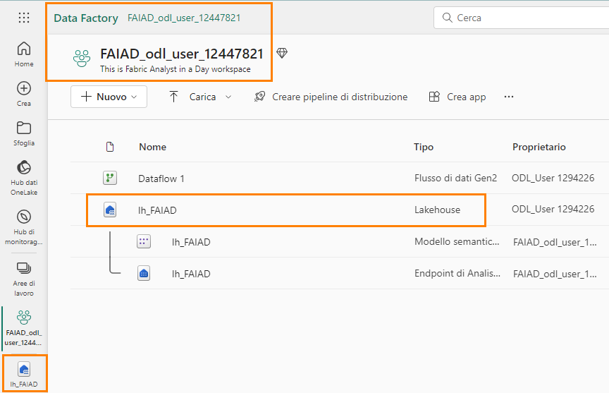

3.	Si tornerà all'area di lavoro **FAIAD_<nome utente>**. La pubblicazione del flusso di dati potrebbe richiedere alcuni istanti. Al termine, selezionare **lh_FAIAD Lakehouse** dal riquadro centrale o dal pannello di sinistra.
 
   

4.	Si aprirà la **schermata Explorer di Lakehouse**. Nel pannello di sinistra espandere **lh_FAIAD -> Tables**.
5.	Notare che ora abbiamo una tabella Geo in Lakehouse. Espandere **Geo** e osservare tutte le colonne visualizzate.
6.	Selezionare la tabella **Geo**, l'anteprima si aprirà nel pannello di destra.

  	
  	
È anche presente un endpoint SQL che è possibile usare per eseguire query su questa tabella.
Esamineremo questa opzione in un lab successivo. Ora che sappiamo che i dati geografici sono stati inseriti in Lakehouse, importiamo il resto dei dati da ADLS Gen2.
 
### Attività 10 - Ridenominazione del flusso di dati
1.	Nella barra dei menu a sinistra selezionare **FAIAD_<nomeutente>** per tornare all'**area di lavoro**.
2.	Stiamo lavorando con Flusso di dati 1. Rinominiamolo prima di continuare. Fare clic sui **puntini di sospensione (…)** accanto a Flusso di dati 1. Selezionare **Proprietà**.

   
  	
3.	Si apre la finestra di dialogo Proprietà flusso di dati. Modificare il nome in **df_Sales_ADLS**

   **Nota**: aggiungiamo "**df**" all'inizio del nome del flusso di dati per semplificare ricerca e ordinamento.

4.	Nella casella di testo **Descrizione** aggiungere **Flusso di dati per inserire i dati di vendita da ADLS in Lakehouse**
5.	Selezionare **Salva**.

   
 
### Attività 11 - Creazione delle query rimanenti nel flusso di dati
1.	Si tornerà all'area di lavoro **FAIAD_<nome utente>**. Selezionare il flusso di dati **df_Sales_ADLS**
per tornare al flusso di dati.

   
  	
Per semplificare la procedura, verifichiamo se possiamo copiare le query da Power BI Desktop.
2.	Se non lo si è ancora aperto, aprire il file **FAIAD.pbix** nella cartella **C:\FAIAD\Reports**
dell'ambiente lab.
3.	Nella barra multifunzione selezionare **Home -> Trasforma**. Si apre la finestra Power Query.
4.	Dal pannello Query a sinistra, selezionare le seguenti query tenendo premuto il tasto 1.037 da **ADLSData**.
a.	Product
b.	Product Groups
c.	Product Item Group
d.	Product Details
e.	Invoice
f.	InvoiceLineItems
g.	Sales
h.	BuyingGroup
i.	Reseller
j.	Date
 
5.	**Fare clic con il pulsante destro del mouse** e selezionare **Copia**.

   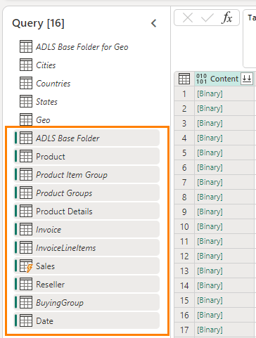
   
6.	Tornare alla finestra del browser del flusso di dati **df_Sales_ADLS**.
7.	Nel pannello di sinistra illustrato di seguito selezionare il pannello **Query** e premere **CTRL+V** (l'opzione Incolla del menu del pulsante destro non è attualmente supportata). Se si usa un dispositivo MAC, usare Cmd+V per incollare.

>**Nota**: se si lavora in un ambiente lab, selezionare i puntini di sospensione in alto a destra della schermata. Usare il dispositivo di scorrimento per **abilitare Appunti nativi VM**. Nella finestra di dialogo selezionare OK. Dopo aver incollato le query è possibile disabilitare questa opzione.

   
   
9.	Come indicato in precedenza, non effettuiamo lo staging di questi dati. Quindi, **fare clic con il pulsante destro del mouse** sulle query seguenti e selezionare **Abilita staging** per rimuovere il segno di spunta.
a.	Product
b.	Product Details
c.	Reseller
d.	Sales
e.	Date

>**Nota**: se il caricamento è disabilitato in Power BI Desktop, non è necessario disabilitare lo staging nel flusso di dati. Pertanto, non dobbiamo disabilitare lo staging per Product Item Group, Product Groups e così via.

  
   
Assicurarsi che vengano elaborate tutte le query. Al termine, inserire i dati in Lakehouse.

### Attività 12 - Configurazione della destinazione dei dati per le query rimanenti
1.	Selezionare la query **Product**.
2.	Nella barra multifunzione selezionare **Home -> Aggiungi destinazione dati -> Lakehouse**.

   
  	
3.	Si apre la finestra di dialogo Connetti alla destinazione dati. Nel menu a discesa Connessione selezionare **Lakehouse (nessuno)**.
4.	Selezionare **Avanti**.

   

5.	Si apre la finestra di dialogo Scegliere il target di destinazione. Assicurarsi che il pulsante di opzione Nuova tabella sia selezionato, poiché si sta creando una **nuova tabella**.
6.	Vogliamo creare la tabella nel Lakehouse creato in precedenza. Nel pannello di sinistra andare a **Lakehouse -> FAIAD_<nomeutente>**.
7.	Selezionare **lh_FAIAD**
8.	Lasciare il nome della tabella **Product**
9.	Selezionare **Avanti**.

   

10. Questa volta useremo le impostazioni automatiche perché i dati verranno aggiornati completamente. Inoltre, le colonne verranno rinominate secondo necessità. Selezionare **Salva impostazioni**.

    
 
11.	Si apre nuovamente la **finestra di Power Query**. Nell'**angolo in basso a destra**notare che la Destinazione dati è impostata su **Lakehouse**.
12. Analogamente, impostare la **Destinazione dati** per le seguenti query:
   
   a.	Product Details
   
   b.	Reseller
   
   c.	Sales
   
   d.	Date

13. Abbiamo un flusso di dati che inserisce dati da ADLS in Lakehouse. Procediamo con la
pubblicazione di questo flusso di dati. Selezionare **Pubblica** nell'angolo inferiore destro.

Si tornerà all'area di lavoro **FAIAD_<nome utente>**. L'aggiornamento del flusso di dati potrebbe richiedere alcuni minuti.L'aggiornamento del flusso di dati potrebbe richiedere alcuni minuti.

Nel prossimo lab inseriremo i dati dalle altre origini dati.
 
### Riferimenti
Fabric Analyst in a Day (FAIAD) presenta alcune delle funzionalità chiave disponibili in Microsoft Fabric. Nel menu di servizio, la sezione Guida (?) include collegamenti ad alcune risorse utili.

  
 
Di seguito sono riportate ulteriori risorse utili che consentiranno di progredire nell'uso di Microsoft Fabric. 
- Vedere il post di blog per leggere l'[annuncio completo sulla disponibilità generale di Microsof t Fabric](https://aka.ms/Fabric-Hero-Blog-Ignite23) 
- Esplorare Fabric attraverso la [Presentazione guidata](https://aka.ms/Fabric-GuidedTour) 
- Iscriversi alla [versione di valutazione gratuita di Microsof t Fabric](https://aka.ms/try-fabric) 
- Visitare il [sito Web di Microsof t Fabric](https://aka.ms/microsoft-fabric) 
- Acquisire nuove competenze esplorando i [moduli di apprendimento su Fabric](https://aka.ms/learn-fabric) 
- Consultare la [documentazione tecnica di Fabric](https://aka.ms/fabric-docs) 
- Leggere l'[e-book gratuito introduttivo a Fabric](https://aka.ms/fabric-get-started-ebook) 
- Unirsi alla [community di Fabric](https://aka.ms/fabric-community) per pubblicare domande, condividere feedback e imparare dagli altri 

Leggere i blog di annunci più approfonditi sull'esperienza in Fabric:

- [Blog sull'esperienza Data Factory in Fabric](https://aka.ms/Fabric-Data-Factory-Blog) 
- [Blog sull'esperienza Synapse Data Engineering in Fabric](https://aka.ms/Fabric-DE-Blog) 
- [Blog sull'esperienza Synapse Data Science in Fabric](https://aka.ms/Fabric-DS-Blog) 
- [Blog sull'esperienza Synapse Data Warehousing in Fabric](https://aka.ms/Fabric-DW-Blog) 
- [Blog sull'esperienza Synapse Real-Time Analytics in Fabric](https://aka.ms/Fabric-RTA-Blog) 
- [Blog di annunci di Power BI](https://aka.ms/Fabric-PBI-Blog) 
- [Blog sull'esperienza Data Activator in Fabric](https://aka.ms/Fabric-DA-Blog) 
- [Blog su amministrazione e governance in Fabric](https://aka.ms/Fabric-Admin-Gov-Blog) 
- [Blog su OneLake in Fabric](https://aka.ms/Fabric-OneLake-Blog) 
- [Blog sull'integrazione di Dataverse e Microsof t Fabric](https://aka.ms/Dataverse-Fabric-Blog) 

© 2023 Microsoft Corporation. Tutti i diritti sono riservati.
L'uso della demo/del lab implica l'accettazione delle seguenti condizioni:
La tecnologia/le funzionalità descritte nella demo/nel lab sono fornite da Microsoft Corporation allo scopo di ottenere feedback dall'utente e offrire un'esperienza di apprendimento. L'utilizzo della demo/del lab è consentito solo per la valutazione delle caratteristiche e delle funzionalità di tale tecnologia e per l'invio di feedback a Microsoft. L'utilizzo per qualsiasi altro scopo non
è consentito. È vietato modificare, copiare, distribuire, trasmettere, visualizzare, eseguire,
riprodurre, pubblicare, concedere in licenza, usare per la creazione di lavori derivati, trasferire o vendere questa demo/questo lab o parte di essi.
SONO ESPLICITAMENTE PROIBITE LA COPIA E LA RIPRODUZIONE DELLA DEMO/DEL LAB (O DI QUALSIASI PARTE DI ESSI) IN QUALSIASI ALTRO SERVER O IN QUALSIASI ALTRA POSIZIONE PER ULTERIORE RIPRODUZIONE O RIDISTRIBUZIONE.
QUESTA DEMO/QUESTO LAB RENDONO DISPONIBILI TECNOLOGIE SOFTWARE/FUNZIONALITÀ DI PRODOTTO SPECIFICHE, INCLUSI NUOVI CONCETTI E NUOVE FUNZIONALITÀ POTENZIALI, IN UN AMBIENTE SIMULATO, CON UN'INSTALLAZIONE E UNA CONFIGURAZIONE PRIVE DI COMPLESSITÀ, PER GLI SCOPI DESCRITTI IN PRECEDENZA. LA TECNOLOGIA/I CONCETTI RAPPRESENTATI IN
QUESTA DEMO/IN QUESTO LAB POTREBBERO NON CONTENERE LE FUNZIONALITÀ COMPLETE E IL LORO FUNZIONAMENTO POTREBBE NON ESSERE LO STESSO DELLA VERSIONE FINALE. È ANCHE POSSIBILE CHE UNA VERSIONE FINALE DI TALI FUNZIONALITÀ O CONCETTI NON VENGA
RILASCIATA. L'ESPERIENZA D'USO DI TALI CARATTERISTICHE E FUNZIONALITÀ PUÒ INOLTRE RISULTARE DIVERSA IN UN AMBIENTE FISICO.
FEEDBACK. L'invio a Microsoft di feedback sulle caratteristiche, sulle funzionalità e/o sui concetti della tecnologia descritti in questa demo/questo lab implica la concessione a Microsoft, a titolo gratuito, del diritto di utilizzare, condividere e commercializzare tale feedback in qualsiasi modo e per qualsiasi scopo. Implica anche la concessione a titolo gratuito a terze parti del diritto di utilizzo di eventuali brevetti necessari per i loro prodotti, le loro tecnologie e i loro servizi al fine di utilizzare o interfacciarsi ai componenti software o ai servizi Microsoft specifici che includono il feedback. L'utente si impegna a non inviare feedback la cui inclusione all'interno di software o
documentazione Microsoft imponga a Microsoft di concedere in licenza a terze parti tale software o documentazione. Questi diritti sussisteranno anche dopo la scadenza del presente contratto.
 
CON LA PRESENTE MICROSOFT CORPORATION NON RICONOSCE ALCUNA GARANZIA O CONDIZIONE RELATIVAMENTE ALLA DEMO/AL LAB, INCLUSE TUTTE LE GARANZIE E CONDIZIONI DI COMMERCIABILITÀ, DI FATTO ESPRESSE, IMPLICITE O PRESCRITTE DALLA LEGGE, ADEGUATEZZA PER UNO SCOPO SPECIFICO, TITOLARITÀ E NON VIOLABILITÀ. MICROSOFT NON OFFRE GARANZIE O RAPPRESENTAZIONI IN RELAZIONE ALL'ACCURATEZZA DEI RISULTATI E DELL'OUTPUT DERIVANTI DALL'USO DELLA DEMO/DEL LAB O ALL'ADEGUATEZZA DELLE INFORMAZIONI CONTENUTE NELLA DEMO/NEL LAB PER QUALSIASI SCOPO.
CLAUSOLA DI RESPONSABILITÀ
Questa demo/questo lab contiene solo una parte delle nuove funzionalità e dei miglioramenti in Microsoft Power BI. Alcune funzionalità potrebbero cambiare nelle versioni future del prodotto. In questa demo/in questo lab si apprendono alcune delle nuove funzionalità, ma non tutte.
