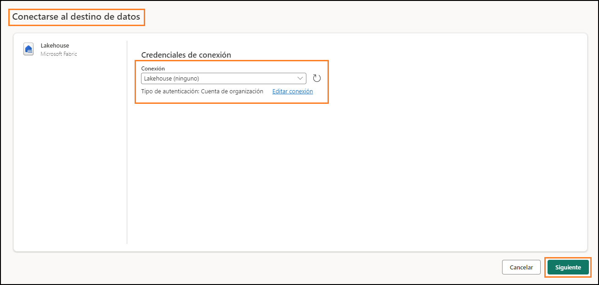
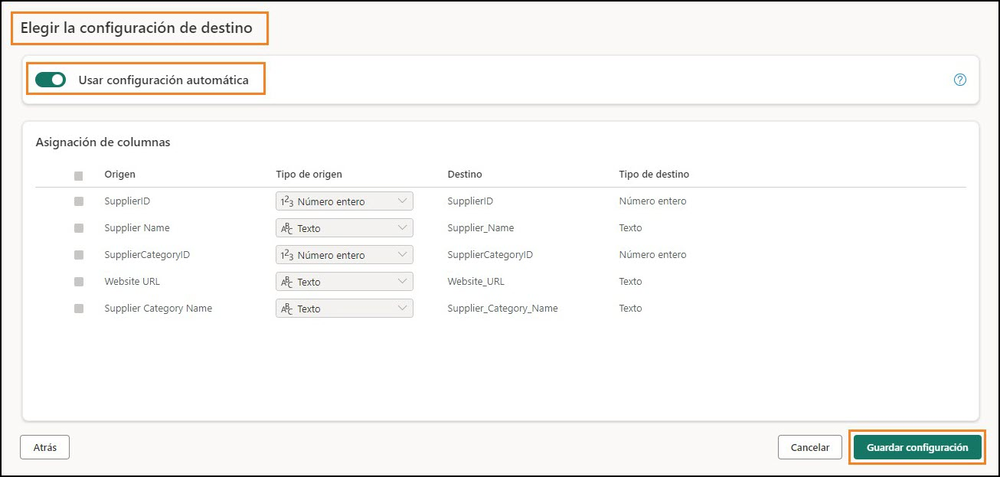
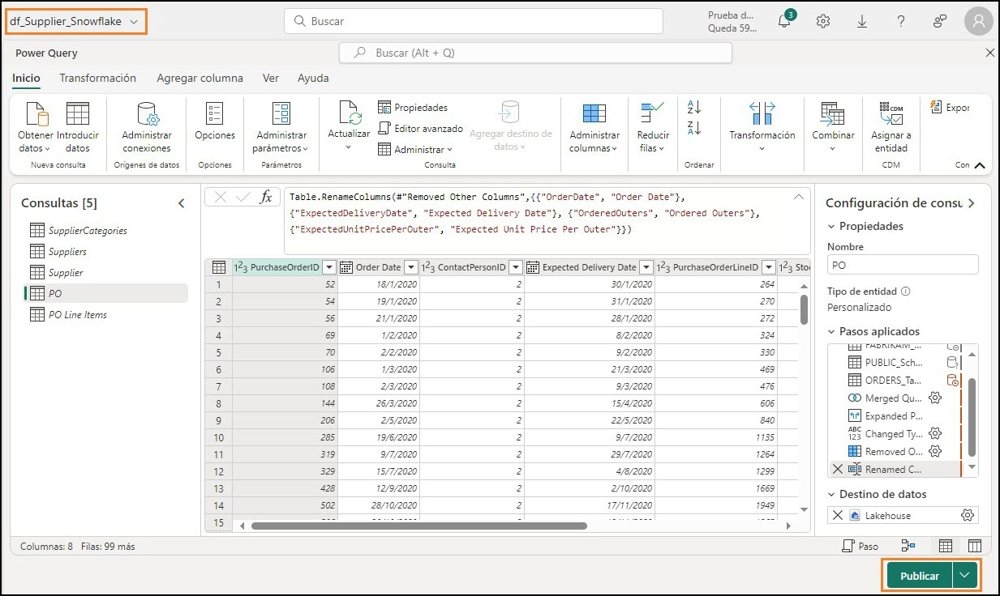
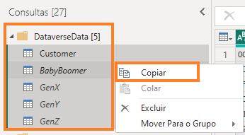
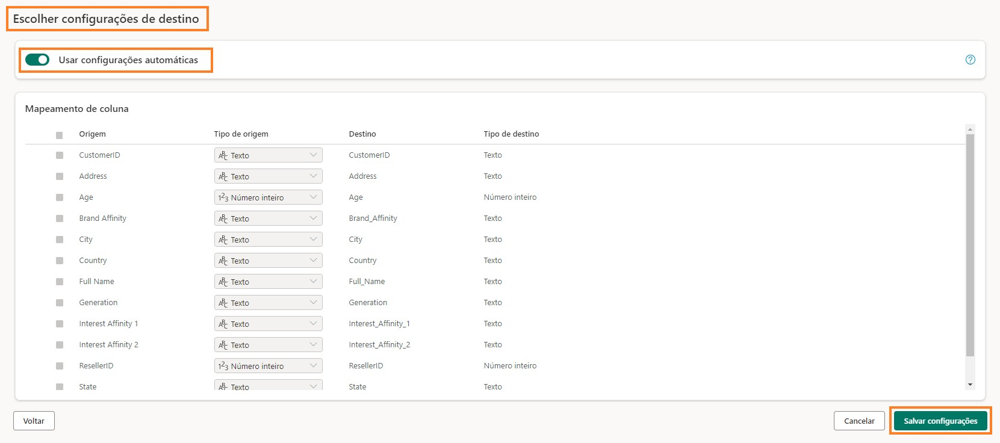
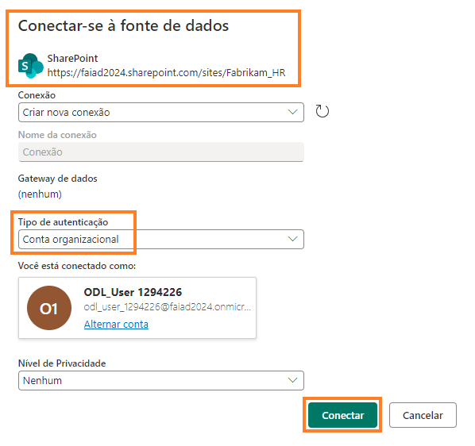
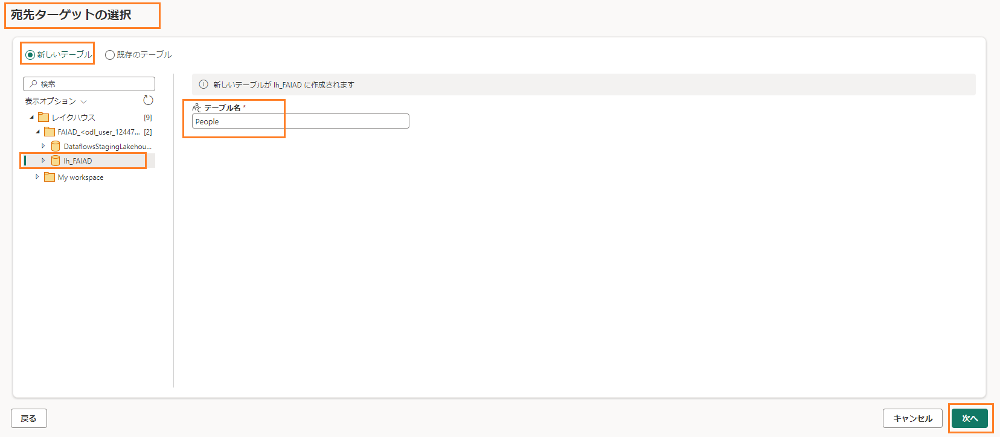
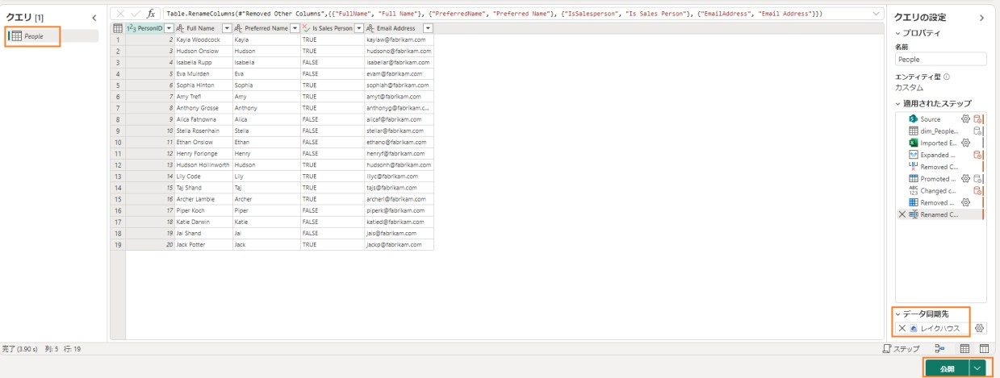

 
## 目次
概要	3 
Dataflow Gen2	3 
タスク 1: Snowflake のクエリを Dataflow にコピーする	3 
タスク 2: Snowflake への接続を作成する	5 
タスク 3: Supplier クエリと PO クエリのデータ送信先を構成する	7 
タスク 4: Snowflake のDataflow の名前を変更して公開する	9 
タスク 5: Dataverse のクエリを Dataflow にコピーする	10 
タスク 6: Dataverse への接続を作成する	12 
タスク 7: Customer クエリのデータ送信先を作成する	12 
タスク 8: Dataverse の Dataflow を公開して名前を変更する	15 
タスク 9: SharePoint のクエリを Dataflow にコピーする	17 
タスク 10: SharePoint への接続を作成する	19 
タスク 11: People クエリのデータ送信先を構成する	19 
タスク 12: SharePoint の Dataflow を公開して名前を変更する	22 
リファレンス	24 

 
## 概要
このシナリオでは、Supplier データが Snowflake に、Customer データが Dataverse に、Employee データが SharePoint にあります。これらのデータ ソースはすべて、異なるタイミングで更新されます。Dataflow のデータ更新回数を最小限に抑えるために、データ ソースごとに個別の Dataflow を作成します。

**注:** 1 つの Dataflow は複数のデータ ソースに対応します。このラボを終了すると、次のことが学べます。
- Dataflow Gen2 を使用して Snowflake に接続し、データを Lakehouse に取り込む方法
- Dataflow Gen2 を使用して SharePoint に接続し、データを Lakehouse に取り込む方法
- Dataflow Gen2 を使用して Dataverse に接続し、データを Lakehouse  に取り込む方法

## Dataflow Gen2
## タスク 1: Snowflake のクエリをDataflow にコピーする
1.	ラボ 2 のタスク 9 で作成した Fabric ワークスペース **FAIAD_<ユーザー名>** に戻りましょう。

2.	トップ メニューから、**新規 -> データフロー(Gen2)** を選択します。

    
 

    **Dataflow のページ**が表示されます。ここまで Dataflow について説明してきました。次は、 
    Power BI Desktop から Dataflow にクエリをコピーしましょう。

3.	まだ開いていない場合は、自分のラボ環境の **C:\FAIAD\Reports**  フォルダーにある
    **FAIAD.pbix** を開きます。

4.	リボンから**ホーム-> データの変換**を選択します。Power Query ウィンドウが開きます。前のラボで確認したように、左パネルのクエリはデータソースごとに整理されています。

5.	Power Query ウィンドウが開きます。左パネルで、SnowflakeData フォルダーにある次のクエリを **Ctrl+Select** または Shift+Select を押しながら選択します。 
    a.	SupplierCategories 
    b.	Suppliers 
    c.	Supplier 
    d.	PO 
    e.	PO Line Items 

6.	**右クリック**して**コピ**ーを選択します。

    
   
7.	**ブラウザー**に戻ります。

8.	**Dataflow のペインで中央のペイン**を選択し、**Ctrl+V** を押します(現時点では右クリックの貼り付けには対応していません)。MAC デバイスを使用している場合は、Cmd + V キーを
    使用して貼り付けてください。
 
    **注:**  ラボ環境で作業している場合は、画面の右側にある省略記号を選択してください。スライダーを使用して **VM ネイティブクリップボードを有効**にします。ダイアログで[OK] を選択します。クエリの貼り付けが済んだら、このオプションを無効にしてかまいません。

    

## タスク 2: Snowflake への接続を作成する
5 つのクエリが貼り付けられ、左側に [クエリ] パネルが表示されています。Snowflake 用の接続が作成されていないため、接続を構成するよう求める警告メッセージが表示されます。
1.	**接続の構成**を選択します。

    
   
2.	[データ ソースへの接続] ダイアログが開きます。**接続**ドロップダウンで、**新しい接続の作成**が選択されていることを確認します。

3.	**認証の種類**は Snowflake にします。

4.	[環境変数] タブ ([ラボ ガイド] タブの横) で確認できる **Snowflake のユーザー名とパスワード**を入力します。

5.	**接続**を選択します。

    
   

    接続が確立され、プレビュー パネルにデータが表示されます。クエリの [適用されたステップ] を自由に見て回ってみましょう。基本的に、Suppliers クエリには仕入先の詳細が、SupplierCategories  にはその名前が示すように仕入先のカテゴリがあります。これら 2  つの テーブルを結合され、必要な列がある Supplier ディメンションが作成されます。同様に、PO Line Items とPO がマージされ、PO ファクトが作成されます。次は、Supplier とPO のデータを Lakehouse に取り込む必要があります。

6.	前述したように、ここではこのデータを一切ステージングしません。そのため、[クエリ] ペインの **Supplier** クエリを**右クリック**し、**ステージングを有効にする**を選択してチェックマークを外します。

    
   
7.	同様に、**PO**  クエリを右クリックします。**ステージングを有効にする**を選択してチェックマークを外します。
   **注:** 他の 3 つのクエリのステージングを無効にする必要はありません (これらのクエリのコピー元である Power BI Desktop で[読み込みを有効にする] がオフになっているため)。
 
## タスク 3: Supplier クエリと PO クエリのデータ送信先を構成する
1.	**Supplier** クエリを選択します。

2.	リボンから**ホーム -> データ同期先の追加 -> レイクハウス**を選択します。

    
   
3.	[データ変換先に接続] ダイアログが開きます。**接続ドロップダウン**から **Lakehouse (なし)**
    を選択します。

4.	**次へ**を選択します。

    
   
5.	[宛先ターゲットの選択] ダイアログが開きます。新しいテーブルを作成しているため、
    **新しいテーブル ラジオ ボタンがオン**になっていることを確認してください。

6.	先ほど作成した Lakehouse  にテーブルを作成する必要があります。左パネルで、
    **Lakehouse -> FAIAD_<ユーザー名>** に移動します。
 
7.	**lh_FAIAD** を選択します。

8.	テーブル名は **Supplier** のままにします。

9.	**次へ**を選択します。

    
   
10.	[宛先の設定を選択する] ダイアログが開きます。今度は、自動設定を使用し、それによってデータの完全な更新が行われます。また、必要に応じて列の名前も変更されま す。**設定の保存**を選択します。

    
    
11.	**Power Query のウィンドウ**に戻ります。**右下隅を見ると、データ同期先がレイクハウスに**設定されています。同様に、**PO クエリのデータ同期先を設定します。** 完了すると、以下のスクリーンショットに示すように、PO クエリの**データ同期先がレイクハウスに**
    設定されます。

    
   

## タスク 4: Snowflake のDataflow の名前を変更して公開する
1.	画面上部で、**Dataflow 2 の横にある矢印**を選択して名前を変更します。

2.	ダイアログで、名前を **df_Supplier_Snowflake** に変更します。

3.	**Enter** キーを押して名前の変更を保存します。

    
    
4.	右下隅の**公開**を選択します。

    **FAIAD_<ユーザー名> ワークスペース**に自動的に戻ります。Dataflow が公開されるまで、しばらくかかる場合があります。次は、Dataverse  からデータを取り込むデータフローを作成しましょう。

    
   

## タスク 5: Dataverse のクエリをDataflow にコピーする
1.	トップ メニューから、**新規 -> データフロー(Gen2)** を選択します。

    
    
    **Dataflow のページ**が表示されます。ここまで Dataflow について説明してきました。次は、
    Power BI Desktop から Dataflow にクエリをコピーしましょう。

2.	まだ開いていない場合は、自分のラボ環境の **C:\FAIAD\Reports**  フォルダーにある
    **FAIAD.pbix** を開きます。

3.	リボンから**ホーム -> データの変換**を選択します。Power Query ウィンドウが開きます。前のラボで確認したように、左パネルのクエリはデータ ソースごとに整理されています。

4.	Power Query ウィンドウが開きます。左パネルで、DataverseData フォルダーにある次のクエリを **Ctrl+Select** を押しながら選択します。
    a.	BabyBoomer
    b.	GenX
    c.	GenY
    d.	GenZ
    e.	Customer

5.	**右クリック**して**コピー**を選択します。

    
   
6.	ブラウザーの **Dataflow のページ**に戻ります。

7.	**Dataflow のペイン**で、**Ctrl+V** を押します(現時点では右クリックの貼り付けには対応して
    いません)。MAC デバイスを使用している場合は、Cmd + V キーを使用して貼り付けてください。
    **注:**  ラボ環境で作業している場合は、画面の右側にある省略記号を選択してください。スライダーを使用して **VM ネイティブクリップボード**を**有効**にします。ダイアログで[OK] を選択します。クエリの貼り付けが済んだら、このオプションを無効にしてかまい      ません。
 
## タスク 6: Dataverse への接続を作成する
5 つのクエリが貼り付けられ、左側に [クエリ] パネルが表示されています。Dataverse 用の接続が作成されていないため、接続を構成するよう求める警告メッセージが表示されます。
1. **接続の構成**を選択します。

    
   
2.	[データ ソースへの接続] ダイアログが開きます。**接続ドロップダウン**で、**新しい接続の作成**が**選択されている**ことを確認します。

3.	**認証の種類**は**組織アカウント**にします。

4.	**接続**を選択します。

    
   
## タスク 7: Customer クエリのデータ送信先を作成する
接続が確立され、プレビュー パネルにデータが表示されます。クエリの [適用されたステップ] を自由に見て回ってみましょう。Customer のデータは、カテゴリ別 (BabyBoomer、
GenX、GenY、GenZ) に入手できます。これら 4 つのクエリをアペンドして、Customer クエリを作成します。次は、Customer のデータを Lakehouse に取り込む必要があります。
 
1.	前述したように、ここではこのデータを一切ステージングしません。そのため、[クエ リ] ペインの **Customer** クエリを**右クリック**し、**ステージングを有効にする**を選択して チェック マークを外します。

    
   
2.	**Customer** クエリを選択します。

3.	リボンから**ホーム -> データ同期先の追加 -> レイクハウス**を選択します。

    
   
4.	[データ変換先に接続] ダイアログが開きます。**接続ドロップダウン**から **Lakehouse (なし)**
    を選択します。

5.	**次へ**を選択します。

    
   
6.	[宛先ターゲットの選択] ダイアログが開きます。新しいテーブルを作成しているため、
    **新しいテーブル** **ラジオ ボタン**がオンになっていることを確認してください。

7.	先ほど作成した Lakehouse  にテーブルを作成する必要があります。左パネルで、
    **Lakehouse -> FAIAD_<ユーザー名>** に移動します。

8.	**lh_FAIAD** を選択します。

9.	テーブル名は **Customer** のままにします。

10.	**次へ**を選択します。

    
    
11.	[宛先の設定を選択する] ダイアログが開きます。今度は、自動設定を使用し、それに
    
    
    
    よってデータの完全な更新が行われます。また、必要に応じて列の名前も変更されま す。**設定の保存**を選択します。
   

## タスク 8: Dataverse のDataflow を公開して名前を変更する
1.	**Power Query のウィンドウ**に戻ります。**右下隅**を見ると、**データ同期先がレイクハウスに**設定されています。

2.	右下隅の**公開**を選択します。

    
   
    **注: FAIAD_<ユーザー名>** ワークスペースに自動的に戻ります。Dataflow が公開されるまで、しばらくかかる場合があります。

    
    
3.	ここで操作しているデータフローは Dataflow 2 です。先に進む前に名前を変更しましょう。Dataflow 2 の横にある **省略記号(…)** をクリックします。**プロパティ**を選択します。

4.	[Dataflow のプロパティ] ダイアログが開きます。**名前**を **df_Customer_Dataverse** に変更します。

5.	**説明**テキスト ボックスに、**Dataflow to ingest Customer data from Dataverse to Lakehouse**
    と入力します。

6.	**保存**を選択します。

    
   
    **FAIAD_<ユーザー名> ワークスペース**に自動的に戻ります。次は、SharePoint からデータを取り込むデータフローを作成しましょう。
 
## タスク 9: SharePoint のクエリをDataflow にコピーする
1.	トップ メニューから、**新規 -> データフロー(Gen2)** を選択します。

    
   
    **Dataflow のページ**が表示されます。ここまで Dataflow について説明してきました。次は、
    Power BI Desktop から Dataflow にクエリをコピーしましょう。

2.	まだ開いていない場合は、自分のラボ環境の **C:\FAIAD\Reports**  フォルダーにある
    **FAIAD.pbix** を開きます。

3.	リボンから**ホーム-> データの変換**を選択します。Power Query ウィンドウが開きます。前のラボで確認したように、左パネルのクエリはデータソースごとに整理されています。

4.	Power Query ウィンドウが開きます。左パネルの SharepointData フォルダーにある **People**
    クエリを**選択**します。

5.	**右クリック**して**コピー**を選択します。
 
 
    
   

6.	ブラウザーの **Dataflow の画面**に戻ります。

7.	**Dataflow のペイン**で、**Ctrl+V** を押します(現時点では右クリックの貼り付けには対応していません)。

    **注:**  ラボ環境で作業している場合は、画面の右側にある省略記号を選択してください。スライダーを使用して **VM ネイティブクリップボード**を**有効**にします。ダイアログで[OK] を選択します。クエリの貼り付けが済んだら、このオプションを無効にしてかまい 
    ません。
    クエリが貼り付けられ、左パネルで使用できます。SharePoint への接続が作成されていないため、接続を構成するよう求める警告メッセージが表示されます。
     
## タスク 10: SharePoint への接続を作成する
1.	**接続の構成**を選択します。

    
   
2.	[データ ソースへの接続] ダイアログが開きます。**接続**ドロップダウンで、**新しい接続の作成**が選択されていることを確認します。

3.	**認証の種類**は**組織アカウント**にします。

4.	**接続**を選択します。

    
   

## タスク 11: People クエリのデータ送信先を構成する
接続が確立され、プレビュー パネルにデータが表示されます。クエリの [適用されたステップ] を自由に見て回ってみましょう。次は、People のデータを Lakehouse に取り込む必要があります。
 
1.	前述したように、ここではこのデータを一切ステージングしません。そのため、[クエリ] ペインの **People** クエリを**右クリック**し、**ステージングを有効にする**を選択してチェックマークを外します。

    
   
2.	**People** クエリを選択します。

3.	リボンから**ホーム -> データ同期先の追加 -> レイクハウス**を選択します。

    
   
4.	[データ変換先に接続] ダイアログが開きます。**接続ドロップダウン**から **Lakehouse (なし)**
    を選択します。

    
   
5.	**次へ**を選択します。
 
6.	[宛先ターゲットの選択] ダイアログが開きます。新しいテーブルを作成しているため、

    **新しいテーブル ラジオ ボタン**がオンになっていることを確認してください。

7.	先ほど作成した Lakehouse  にテーブルを作成する必要があります。左パネルで、
   
     **Lakehouse -> FAIAD_<ユーザー名>** に移動します。

8.	**lh_FAIAD** を選択します。

9.	テーブル名は **People** のままにします。

10.	**次へ**を選択します。

    
   
11.	[宛先の設定を選択する] ダイアログが開きます。今度は、自動設定を使用し、それによってデータの完全な更     新が行われます。また、必要に応じて列の名前も変更されま す。**設定の保存**を選択します。

    
   
 
## タスク 12: SharePoint のDataflow を公開して名前を変更する
1.	**Power Query のウィンドウ**に戻ります。**右下隅**を見ると、データ同期先が**レイクハウス**
    に設定されています。

2.	右下隅の**公開**を選択します。

    
   
    **注: FAIAD_<ユーザー名>** ワークスペースに自動的に戻ります。Dataflow が公開されるまで、しばらくかかる場合があります。

3.	ここで操作しているデータフローは Dataflow 2 です。先に進む前に名前を変更しましょう。Dataflow 2 の横にある **省略記号(…)** をクリックします。**プロパティ**を選択します。

    
   
4.	[Dataflow のプロパティ] ダイアログが開きます。**名前**を **df_People_SharePoint** に変更します。

5.	**説明**テキスト ボックスに、**Dataflow to ingest People data from SharePoint to Lakehouse** と入力します。

6.	**保存**を選択します。

   
   
**FAIAD_<ユーザー名>** ワークスペースに自動的に戻ります。これで、すべてのデータが
Lakehouse に取り込まれました。次のラボでは、Dataflow の更新スケジュールを設定します。
 
# リファレンス

Fabric Analyst in a Day (FAIAD) では、Microsoft Fabric で使用できる主要な機能の一部をご紹介します。サービスのメニューにあるヘルプ (?) セクションには、いくつかの優れたリソースへのリンクがあります。

   
   
Microsoft Fabric の次のステップに役立つリソースをいくつか以下に紹介します。

- ブログ記事で [Microsoft-Fabric-のGA-に関するお知らせ](https://aka.ms/Fabric-Hero-Blog-Ignite23) の全文を確認する
- [ガイド付きツアー](https://aka.ms/Fabric-GuidedTour) を通じて Fabric を探索する
- [Microsoft Fabric の無料試用版](https://www.microsoft.com/en-us/microsoft-fabric/getting-started) にサインアップする
- [Microsoft Fabric のWeb サイト](https://www.microsoft.com/en-in/microsoft-fabric) にアクセスする
- [Fabric の学習モジュール](https://learn.microsoft.com/en-us/training/browse/?products=fabric&resource_type=module)で新しいスキルを学ぶ
- [Fabric の技術ドキュメント](https://learn.microsoft.com/en-us/fabric/) を参照する
- [Fabric 入門編の無料のe-book](https://info.microsoft.com/ww-landing-unlocking-transformative-data-value-with-microsoft-fabric.html) を読む
- [Fabric コミュニティ](https://community.fabric.microsoft.com/)に参加し、質問の投稿やフィードバックの共有を行い、他のユーザーから学びを得る

より詳しい Fabric  エクスペリエンスのお知らせに関するブログを参照してください。

- [Fabric の Data Factory エクスペリエンスに関するブログ](https://blog.fabric.microsoft.com/en-us/blog/introducing-data-factory-in-microsoft-fabric/)
- [Fabric のSynapse Data Engineering エクスペリエンスに関するブログ](https://blog.fabric.microsoft.com/en-us/blog/introducing-synapse-data-engineering-in-microsoft-fabric/)
- [Fabric のSynapse Data Science エクスペリエンスに関するブログ](https://blog.fabric.microsoft.com/en-us/blog/introducing-synapse-data-science-in-microsoft-fabric/)
- [Fabric のSynapse Data Warehousing エクスペリエンスに関するブログ](https://blog.fabric.microsoft.com/en-us/blog/introducing-synapse-data-warehouse-in-microsoft-fabric/)
- [Fabric のSynapse Real-Time Analytics エクスペリエンスに関するブログ](https://blog.fabric.microsoft.com/en-us/blog/sense-analyze-and-generate-insights-with-synapse-real-time-analytics-in-microsoft-fabric/)
- [Power BI のお知らせに関するブログ](https://powerbi.microsoft.com/en-us/blog/empower-power-bi-users-with-microsoft-fabric-and-copilot/)
- [Fabric の Data Activator エクスペリエンスに関するブログ](https://blog.fabric.microsoft.com/en-us/blog/driving-actions-from-your-data-with-data-activator/)
- [Fabric の管理とガバナンスに関するブログ](https://blog.fabric.microsoft.com/en-us/blog/administration-security-and-governance-in-microsoft-fabric/)
- [Fabric の OneLake に関するブログ](https://blog.fabric.microsoft.com/en-us/blog/microsoft-onelake-in-fabric-the-onedrive-for-data/) 
- [Dataverse とMicrosof t Fabric の統合に関するブログ](https://cloudblogs.microsoft.com/dynamics365/it/2023/05/24/new-dataverse-enhancements-and-ai-powered-productivity-with-microsoft-365-copilot/)

© 2023 Microsoft Corporation. All rights reserved.

このデモ/ラボを使用すると、次の条件に同意したことになります。

このデモ/ラボで説明するテクノロジまたは機能は、ユーザーのフィードバックを取得 し、学習エクスペリエンスを提供するために、Microsoft Corporation によって提供されます。ユーザーは、このようなテクノロジおよび機能を評価し、Microsoft にフィードバックを提供するためにのみデモ/ラボを使用できます。それ以外の目的には使用できませ ん。このデモ/ラボまたはその一部を、変更、コピー、配布、送信、表示、実行、再現、 発行、ライセンス、著作物の作成、転送、または販売することはできません。
複製または再頒布のために他のサーバーまたは場所にデモ/ラボ (またはその一部) をコピーまたは複製することは明示的に禁止されています。
 
このデモ/ラボは、前に説明した目的のために複雑なセットアップまたはインストールを 必要としないシミュレーション環境で潜在的な新機能や概念などの特定のソフトウェアテクノロジ/製品の機能を提供します。このデモ/ラボで表されるテクノロジ/概念は、フル機能を表していない可能性があり、最終バージョンと動作が異なることがあります。また、そのような機能や概念の最終版がリリースされない場合があります。物理環境でこのような機能を使用するエクスペリエンスが異なる場合もあります。
**フィードバック。** このデモ/ラボで説明されているテクノロジ、機能、概念に関する フィードバックをMicrosoft に提供する場合、ユーザーは任意の方法および目的でユー
ザーのフィードバックを使用、共有、および商品化する権利を無償で Microsoft に提供するものとします。また、ユーザーは、フィードバックを含む Microsoft のソフトウェアまたはサービスの特定部分を使用したり特定部分とインターフェイスを持ったりする製 品、テクノロジ、サービスに必要な特許権を無償でサード パーティに付与します。ユーザーは、フィードバックを含めるために Microsoft がサード パーティにソフトウェアま たはドキュメントをライセンスする必要があるライセンスの対象となるフィードバックを提供しません。これらの権限は、本契約の後も存続します。
Microsoft Corporation は、明示、黙示、または法律上にかかわらず、商品性のすべての保証および条件、特定の目的、タイトル、非侵害に対する適合性など、デモ/ラボに関する すべての保証および条件を拒否します。Microsoft は、デモ/ラボから派生する結果、出力の正確さ、任意の目的に対するデモ/ラボに含まれる情報の適合性に関して、いかなる 保証または表明もしません。

**免責事項**

このデモ/ラボには、Microsoft Power BI の新機能と機能強化の一部のみが含まれています。一部の機能は、製品の将来のリリースで変更される可能性があります。このデモ/ラ ボでは、新機能のすべてではなく一部について学習します。

