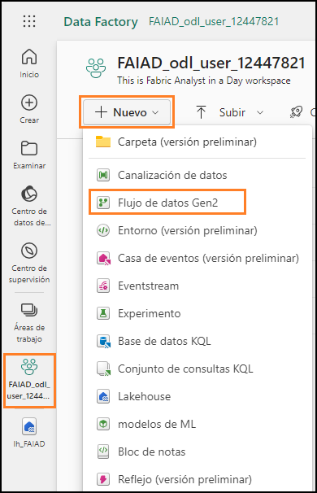
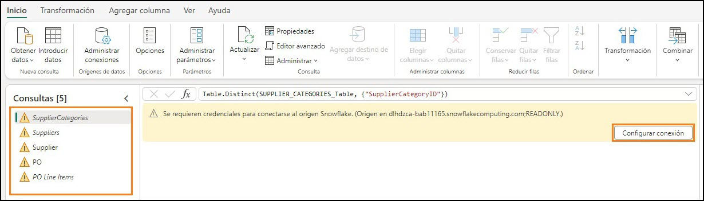
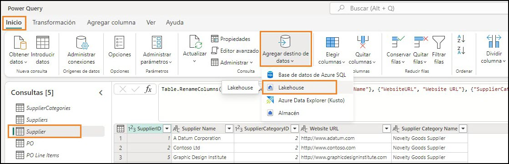
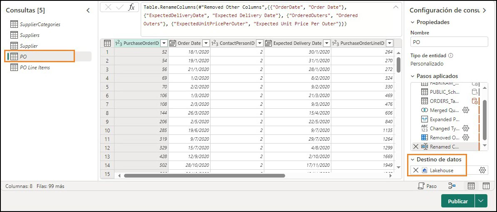
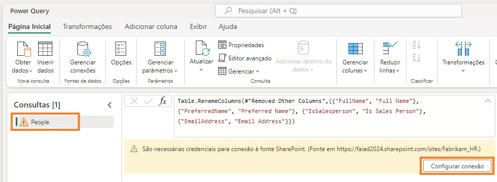
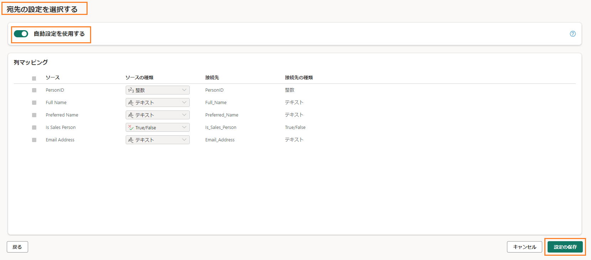

	 	 
 
# Sommaire
- Introduction
- Dataflow Gen2
    - Tâche 1 : copier des requêtes Snowflake dans Dataflow
    - Tâche 2 : créer une connexion à Snowflake
    - Tâche 3 : configurer la destination des données pour les requêtes Supplier et PO
    - Tâche 4 : renommer et publier le flux de données Snowflake
    - Tâche 5 : copier des requêtes Dataverse dans Dataflow
    - Tâche 6 : créer une connexion à Dataverse
    - Tâche 7 : créer la destination des données pour la requête Customer
    - Tâche 8 : publier et renommer le flux de données Dataverse
    - Tâche 9 : copier des requêtes SharePoint dans Dataflow
    - Tâche 10 : créer une connexion SharePoint
    - Tâche 11 : configurer la destination des données pour la requête People
    - Tâche 12 : publier et renommer le flux de données SharePoint
- Références

 
## Introduction
Dans notre scénario, les données fournisseur se trouvent dans Snowflake, les données client dans Dataverse et les données collaborateur dans SharePoint. Toutes ces sources de données sont mises à jour à des moments différents. Pour réduire le nombre d’actualisations de données des flux de
données, nous allons créer des flux de données individuels pour chacune de ces sources de données.

**Remarque :** plusieurs sources de données sont prises en charge dans un seul flux de données.

À la fin de ce labo, vous saurez :
- comment vous connecter à Snowflake à l’aide de Dataflow Gen2 et ingérer des données dans Lakehouse ;
- comment vous connecter à SharePoint à l’aide de Dataflow Gen2 et ingérer des données dans Lakehouse ;
- comment vous connecter à Dataverse à l’aide de Dataflow Gen2 et ingérer des données dans Lakehouse.

## Dataflow Gen2
### Tâche 1 : copier des requêtes Snowflake dans Dataflow
1. Revenons à l’espace de travail Fabric **FAIAD_<username>** que vous avez créé dans le labo 2, tâche 9.

2. Dans le menu supérieur, cliquez sur **Nouveau, puis sélectionnez Flux de données Gen2**.

    

    Vous êtes alors redirigé vers la **page Dataflow.** Maintenant que nous connaissons Dataflow, copions les requêtes de Power BI Desktop dans Dataflow.
 
3. Si vous ne l’avez pas encore ouvert, ouvrez le fichier **FAIAD.pbix** situé dans le dossier **C:\FAIAD\Reports** de votre environnement de labo.
4. Dans le ruban, cliquez sur **Accueil -> Transformer les données**. Une fenêtre Power Query s’ouvre alors. Comme vous l’avez remarqué dans le labo précédent, les requêtes du volet gauche sont organisées par source de données.
5. Une fenêtre Power Query s’ouvre alors. Dans le volet gauche, sous le dossier SnowflakeData, appuyez sur la touche **Ctrl** ou Maj et sélectionnez les requêtes suivantes :

    a. SupplierCategories

    b. Suppliers

    c. Supplier

    d. PO

    e. PO Line Items

6. **Cliquez avec le bouton droit** et sélectionnez **Copier**.

    

7. Revenez au **navigateur**.
8. Dans le **volet Dataflow**, cliquez sur le **volet central** et appuyez sur **Ctrl + V**. (À l’heure actuelle, le clic droit sur Coller n’est pas pris en charge.) Si vous utilisez un appareil MAC, utilisez Cmd+V pour coller.

**Remarque :** si vous travaillez dans un environnement de labo, sélectionnez les points de suspension en haut à droite de l’écran. Utilisez le curseur **pour activer le Presse-papiers natif de la machine virtuelle**. Cliquez sur OK dans la boîte de dialogue. Une fois que vous avez collé les requêtes, vous pouvez désactiver cette option.

 
 
### Tâche 2 : créer une connexion à Snowflake
Notez que les cinq requêtes sont collées et que vous disposez désormais du volet Requêtes à gauche. Comme nous n’avons pas de connexion créée pour Snowflake, un message d’avertissement s’affiche pour vous demander de configurer la connexion.
1. Cliquez sur **Configurer la connection.**

    

2. La boîte de dialogue Connexion à une source de données s’ouvre alors. Dans la liste déroulante **Connexion**, assurez-vous que l’option **Créer une connexion** est sélectionnée.

3. Le champ Type d’authentification doit être défini sur **Snowflake**.
4. Saisissez le **Nom d’utilisateur et le Mot de passe Snowflake** disponibles dans l’onglet Variables d’environnement (en regard de l’onglet Guide du labo).
 
5. Cliquez sur **Connexion**.

    

La connexion est alors établie et vous pouvez afficher les données dans le volet d’aperçu. N’hésitez pas à parcourir les étapes appliquées des requêtes. En substance, la requête Suppliers comporte les détails des fournisseurs et la requête SupplierCategories, comme son nom l’indique, comporte des catégories de fournisseurs. Ces deux tables sont jointes pour créer la dimension Supplier, avec les colonnes dont nous avons besoin. De même, nous avons fusionné la requête PO Line Items avec la requête PO pour créer le fait PO. Nous devons maintenant ingérer les données Supplier et PO dans Lakehouse.

6. Comme indiqué précédemment, nous ne mettons en lots aucune de ces données. Par conséquent, **cliquez avec le bouton droit** sur la requête **Supplier** dans le volet Requêtes et sélectionnez **Activer la mise en scéne** pour supprimer la coche.

    

7. De même, cliquez avec le bouton droit sur la requête **PO**. Sélectionnez **Activer la mise en scéne** pour supprimer la coche.

**Remarque :** nous n’avons pas besoin de désactiver la mise en lots pour les trois autres requêtes, car l’option Activer le chargement a été désactivée dans Power BI Desktop (d’où ces requêtes ont été copiées).
 
### Tâche 3 : configurer la destination des données pour les requêtes Supplier et PO
1. Sélectionnez la requête **Supplier**.
2. Dans le ruban, cliquez sur **Accueil -> Ajouter une destination de données -> Lakehouse**.

    

3. La boîte de dialogue Se connecter à la destination des données s’ouvre alors. Dans la liste déroulante **Connexion**, sélectionnez **Lakehouse (aucun)**.

4. Cliquez sur **Suivant**.

    

5. La boîte de dialogue Choisir la cible de destination s’ouvre alors. Assurez-vous que le **bouton radio Nouvelle table** est **coché**, car nous créons une table.

6. Nous souhaitons créer la table dans la lakehouse que nous avons créée plus tôt. Dans le volet gauche, accédez à **Lakehouse -> FAIAD_<username>**.

7. Sélectionnez **lh_FAIAD**.

8. Laissez le champ Nom de la table défini sur **Supplier**.
 
9. Cliquez sur **Suivant**.

    

10. Cette fois-ci, nous utiliserons les paramètres automatiques, pour permettre une mise à jour complète des données. De plus, les colonnes seront renommées si nécessaire. Cliquez sur **Enregistrer les paramètres**.

    

11.	Vous êtes redirigé vers la **fenêtre Power Query**. Dans le **coin inférieur droit**, notez que la liste déroulante Destination des données est définie sur **Lakehouse**. De même, **configurez la
destination des données pour la requête PO**. Ensuite, la liste déroulante **Destination desdonnées** de votre requête PO devrait être définie sur **Lakehouse**, comme illustré dans la capture d’écran ci-dessous.
 
    

### Tâche 4 : renommer et publier le flux de données Snowflake
1. En haut de l’écran, cliquez sur la **flèche en regard de Dataflow 2** pour le renommer.
2. Dans la boîte de dialogue, redéfinissez le nom sur **df_Supplier_Snowflake**.
3. Appuyez sur **Entrée** pour enregistrer le changement de nom.

    

4. Dans le coin inférieur droit, cliquez sur **Publier**.

    

    Vous êtes alors redirigé vers l’espace de travail **FAIAD_<username>**. La publication du flux de données peut prendre quelques instants. Créons maintenant un flux de données permettant d’importer les données depuis Dataverse.

### Tâche 5 : copier des requêtes Dataverse dans Dataflow

1. Dans le menu supérieur, cliquez sur **Nouveau, puis sélectionnez Flux de données Gen2**.

    

    Vous êtes alors redirigé vers la **page Dataflow**. Maintenant que nous connaissons Dataflow, copions les requêtes de Power BI Desktop dans Dataflow.
 
2. Si vous ne l’avez pas encore ouvert, ouvrez le fichier **FAIAD.pbix** situé dans le dossier **C:\FAIAD\Reports** de votre environnement de labo.

3. Dans le ruban, cliquez sur **Accueil -> Transformer les données**. Une fenêtre Power Query s’ouvre alors. Comme vous l’avez remarqué dans le labo précédent, les requêtes du volet gauche sont organisées par source de données.

4. Une fenêtre Power Query s’ouvre alors. Dans le volet gauche, sous le dossier DataverseData, appuyez sur la touche **Ctrl et sélectionnez** les requêtes suivantes :

    a. BabyBoomer

    b. GenX

    c. GenY

    d. GenZ

    e. Customer

5. **Cliquez avec le bouton droit** et sélectionnez **Copier**.

    

6. Revenez à la **page Dataflow** dans votre navigateur.

7. Dans le **volet Dataflow**, appuyez sur **Ctrl + V**. (À l’heure actuelle, le clic droit sur Coller n’est pas pris en charge.) Si vous utilisez un appareil MAC, utilisez Cmd+V pour coller.

**Remarque :** si vous travaillez dans un environnement de labo, sélectionnez les points de suspension en haut à droite de l’écran. Utilisez le curseur pour **activer le Presse-papiers natif de la machine virtuelle**. Cliquez sur OK dans la boîte de dialogue. Une fois que vous avez collé les requêtes, vous pouvez désactiver cette option.

### Tâche 6 : créer une connexion à Dataverse
Notez que les cinq requêtes sont collées et que vous disposez désormais du volet Requêtes à gauche. Comme nous n’avons pas de connexion créée pour Dataverse, un message d’avertissement s’affiche pour vous demander de configurer la connexion.

1. Cliquez sur **Configurer la connexion**.

    
 
2. La boîte de dialogue Connexion à une source de données s’ouvre alors. Dans la **liste déroulante Connexion**, assurez-vous que l’option C**réer une connexion** est **sélectionnée**.

3. Le champ **Type d’authentification** devrait être défini sur **Compte professionnel**.

4. Cliquez sur **Connexion**.

    

### Tâche 7 : créer la destination des données pour la requête Customer
La connexion est alors établie et vous pouvez afficher les données dans le volet d’aperçu. N’hésitez pas à parcourir les étapes appliquées des requêtes. Les données client sont disponibles par
catégorie : BabyBoomer, GenX, GenY et GenZ. Ces quatre requêtes sont ajoutées pour créer la requête Customer. Nous devons maintenant ingérer les données Customer dans Lakehouse.

1. Comme indiqué précédemment, nous ne mettons en lots aucune de ces données. Par conséquent, **cliquez avec le bouton droit** sur la requête **Customer** dans le volet Requêtes et sélectionnez **Activer la mise en scéne** pour supprimer la coche.

    

2. Sélectionnez la requête **Customer**.

3. Dans le ruban, cliquez sur **Accueil -> Ajouter une destination de données -> Lakehouse**.

    

4. La boîte de dialogue Se connecter à la destination des données s’ouvre alors. Dans la liste déroulante **Connexion**, sélectionnez **Lakehouse (aucun)**.

5. Cliquez sur **Suivant**.

    

6. La boîte de dialogue Choisir la cible de destination s’ouvre alors. Assurez-vous que le bouton radio **Nouvelle table** est coché, car nous créons une table.
7. Nous souhaitons créer la table dans la lakehouse que nous avons créée plus tôt. Dans le volet gauche, accédez à **Lakehouse -> FAIAD_<username>**.
8. Sélectionnez **lh_FAIAD**.
9. Laissez le champ Nom de la table défini sur **Customer**.
 
10. Cliquez sur **Suivant**.

    

11. La boîte de dialogue Choisir les paramètres de destination s’ouvre alors. Cette fois-ci, nous utiliserons les paramètres automatiques, pour permettre une mise à jour complète des données. De plus, les colonnes seront renommées si nécessaire. Cliquez sur **Enregistrer les paramètres**.

    

### Tâche 8 : publier et renommer le flux de données Dataverse
1. Vous êtes redirigé vers la **fenêtre Power Query**. Dans le **coin inférieur droit**, notez que la liste déroulante **Destination des données** est définie sur **Lakehouse**.
2. Dans le coin inférieur droit, cliquez sur **Publier**.

    
 
**Remarque :** vous êtes alors redirigé vers l’espace de travail **FAIAD_<username>**. La publication du flux de données peut prendre quelques instants.

3. Dataflow 2 est le flux de données dans lequel nous travaillions. Renommons-le avant de continuer. Cliquez sur les **points de suspension (…)** en regard de Dataflow 2. Sélectionnez **Propriétés**.

    

4. La boîte de dialogue des propriétés du flux de données s’ouvre alors. Redéfinissez le champ **Nom**
sur **df_Customer_Dataverse**.

5. Dans la zone de texte **Description**, ajoutez **Dataflow to ingest Customer data from Dataverse to Lakehouse**.

6. Cliquez sur **Enregistrer**.

 
Vous êtes alors redirigé vers l’espace de travail **FAIAD_<username>**. Créons maintenant un flux de données permettant d’importer les données de SharePoint.

### Tâche 9 : copier des requêtes SharePoint dans Dataflow
1. Dans le menu supérieur, cliquez sur **Nouveau, puis sélectionnez Flux de données Gen2**.

    

Vous êtes alors redirigé vers la **page Dataflow**. Maintenant que nous connaissons Dataflow, copions les requêtes de Power BI Desktop dans Dataflow.

2. Si vous ne l’avez pas encore ouvert, ouvrez le fichier **FAIAD.pbix** situé dans le dossier **C:\FAIAD\Reports** de votre environnement de labo.
 
3. Dans le ruban, cliquez sur **Accueil -> Transformer les données**. Une fenêtre Power Query s’ouvre alors. Comme vous l’avez remarqué dans le labo précédent, les requêtes du volet gauche sont organisées par source de données.

4. Une fenêtre Power Query s’ouvre alors. Dans le volet gauche, sous le dossier SharepointData, **sélectionnez** la requête **People**.

5. **Cliquez avec le bouton droit** et sélectionnez **Copier**.

    

6. Revenez à l’**écran Dataflow** dans le navigateur.
7. Dans le **volet Dataflow**, appuyez sur **Ctrl + V**. (À l’heure actuelle, le clic droit sur Coller n’est pas pris en charge.)

**Remarque :** si vous travaillez dans un environnement de labo, sélectionnez les points de suspension en haut à droite de l’écran. Utilisez le curseur pour **activer le Presse-papiers natif de la machine virtuelle**. Cliquez sur OK dans la boîte de dialogue. Une fois que vous avez collé les requêtes, vous
pouvez désactiver cette option.

Notez que la requête est collée et disponible dans le volet gauche. Comme nous n’avons pas de connexion créée pour SharePoint, un message d’avertissement s’affiche pour vous demander de configurer la connexion.
 
### Tâche 10 : créer une connexion SharePoint
1. Cliquez sur **Configurer la connexion**.

    

2. La boîte de dialogue Connexion à une source de données s’ouvre alors. Dans la liste déroulante **Connexion**, assurez-vous que l’option **Créer une connexion** est sélectionnée.

3. Le champ **Type d’authentification** devrait être défini sur **Compte professionnel**.

4. Cliquez sur **Connexion.**

    

### Tâche 11 : configurer la destination des données pour la requête People
La connexion est alors établie et vous pouvez afficher les données dans le volet d’aperçu. N’hésitez pas à parcourir les étapes appliquées des requêtes. Nous devons maintenant ingérer les données People dans Lakehouse.
1. Comme indiqué précédemment, nous ne mettons en lots aucune de ces données. Par conséquent, **cliquez avec le bouton droit** sur la requête **People** dans le volet Requêtes et sélectionnez **Activer la mise en scéne** pour supprimer la coche.

    

2. Sélectionnez la requête **People.**
3. Dans le ruban, cliquez sur **Accueil -> Ajouter une destination de données -> Lakehouse.**

    

4. La boîte de dialogue Se connecter à la destination des données s’ouvre alors. Dans la liste déroulante **Connexion**, sélectionnez **Lakehouse (aucun)**.
5. Cliquez sur **Suivant**.
 
    

6. La boîte de dialogue Choisir la cible de destination s’ouvre alors. Assurez-vous que le bouton radio **Nouvelle table** est coché, car nous créons une table.
7. Nous souhaitons créer la table dans la lakehouse que nous avons créée plus tôt. Dans le volet gauche, accédez à **Lakehouse -> FAIAD_<username>.**
8. Sélectionnez **lh_FAIAD**.
9. Laissez le champ Nom de la table défini sur **People**.
10. Cliquez sur **Suivant**.

    

11. Cette fois-ci, nous utiliserons les paramètres automatiques, pour permettre une mise à jour complète des données. De plus, les colonnes seront renommées si nécessaire. Cliquez sur **Enregistrer les paramètres**.

    
 
### Tâche 12 : publier et renommer le flux de données SharePoint
1. Vous êtes redirigé vers la **fenêtre Power Query**. Dans le **coin inférieur droit**, notez que la liste déroulante Destination des données est définie sur **Lakehouse**.
2. Dans le coin inférieur droit, cliquez sur **Publier**.

    

**Remarque :** vous êtes alors redirigé vers l’espace de travail **FAIAD_<username>**. La publication du flux de données peut prendre quelques instants.

3. Dataflow 2 est le flux de données dans lequel nous travaillions. Renommons-le avant de continuer. Cliquez sur les **points de suspension (…)** en regard de Dataflow 2. Sélectionnez **Propriétés**.
 
    
 
4. La boîte de dialogue Propriétés du flux de données s’ouvre alors. Redéfinissez le champ **Nom** sur **df_People_SharePoint**.

5. Dans la zone de texte **Description**, ajoutez **Dataflow to ingest People data from SharePoint to Lakehouse**.

6. Cliquez sur **Enregistrer**.

Vous êtes alors redirigé vers l’espace de travail **FAIAD_<username>**. Nous avons maintenant ingéré toutes les données dans Lakehouse. Dans le prochain labo, nous allons planifier l’actualisation de Dataflow.
 
### Références
Fabric Analyst in a Day (FAIAD) vous présente certaines des fonctions clés de Microsoft Fabric. Dans le menu du service, la section Aide (?) comporte des liens vers d’excellentes ressources.

Voici quelques autres ressources qui vous aideront lors de vos prochaines étapes avec Microsoft Fabric :
- Consultez le billet de blog pour lire l’intégralité de l’[annonce de la GA de Microsoft Fabric](https://aka.ms/Fabric-Hero-Blog-Ignite23).
- Explorez Fabric grâce à la [visite guidée](https://aka.ms/Fabric-GuidedTour).
- Inscrivez-vous pour bénéficier d’un [essai gratuit de Microsoft Fabric](https://aka.ms/try-fabric).
- Rendez-vous sur le [site web Microsoft Fabric](https://aka.ms/microsoft-fabric).
- Acquérez de nouvelles compétences en explorant les [modules d’apprentissage Fabric](https://aka.ms/learn-fabric).
- Explorez la [documentation technique Fabric](https://aka.ms/fabric-docs).
- Lisez le [livre électronique gratuit sur la prise en main de Fabric](https://aka.ms/fabric-get-started-ebook).
- Rejoignez la [communauté Fabric](https://aka.ms/fabric-community) pour publier vos questions, partager vos commentaires et apprendre des autres.

Lisez les blogs d’annonces plus détaillés sur l’expérience Fabric :

- [Blog Expérience Data Factory dans Fabric](https://aka.ms/Fabric-Data-Factory-Blog)
- [Blog Expérience Synapse Data Engineering dans Fabric](https://aka.ms/Fabric-DE-Blog)
- [Blog Expérience Synapse Data Science dans Fabric](https://aka.ms/Fabric-DS-Blog)
- [Blog Expérience Synapse Data Warehousing dans Fabric](https://aka.ms/Fabric-DW-Blog)
- [Blog Expérience Synapse Real-Time Analytics dans Fabric](https://aka.ms/Fabric-RTA-Blog)
- [Blog Annonce Power BI](https://aka.ms/Fabric-PBI-Blog)
- [Blog Expérience Data Activator dans Fabric](https://aka.ms/Fabric-DA-Blog)
- [Blog Administration et gouvernance dans Fabric](https://aka.ms/Fabric-Admin-Gov-Blog)
- [Blog OneLake dans Fabric](https://aka.ms/Fabric-OneLake-Blog)
- [Blog Intégration de Dataverse et Microsoft Fabric](https://aka.ms/Dataverse-Fabric-Blog)

© 2023 Microsoft Corporation. Tous droits réservés.
En effectuant cette démonstration/ce labo, vous acceptez les conditions suivantes :

La technologie/fonctionnalité décrite dans cette démonstration/ces travaux pratiques est fournie par Microsoft Corporation en vue d’obtenir vos commentaires et de vous fournir une expérience d’apprentissage. Vous pouvez utiliser cette démonstration/ces ateliers uniquement pour évaluer ces technologies et fonctionnalités, et pour fournir des commentaires à Microsoft. Vous ne pouvez pas l’utiliser à d’autres fins. Vous ne pouvez pas modifier, copier, distribuer, transmettre, afficher, effectuer, reproduire, publier, accorder une licence, créer des œuvres dérivées, transférer ou vendre tout ou une partie de cette démonstration/ces ateliers.

LA COPIE OU LA REPRODUCTION DE CETTE DÉMONSTRATION/CES TRAVAUX PRATIQUES (OU DE TOUTE PARTIE DE CEUX-CI) SUR TOUT AUTRE SERVEUR OU AUTRE EMPLACEMENT EN VUE D’UNE AUTRE REPRODUCTION OU REDISTRIBUTION EST EXPRESSÉMENT INTERDITE.
CETTE DÉMONSTRATION/CES TRAVAUX PRATIQUES FOURNISSENT CERTAINES FONCTIONNALITÉS DE PRODUIT/TECHNOLOGIES LOGICIELLES, NOTAMMENT D’ÉVENTUELS NOUVEAUX CONCEPTS ET FONCTIONNALITÉS, DANS UN ENVIRONNEMENT SIMULÉ SANS INSTALLATION OU CONFIGURATION
COMPLEXE AUX FINS DÉCRITES CI-DESSUS. LES TECHNOLOGIES/CONCEPTS REPRÉSENTÉS DANS CETTE DÉMONSTRATION/CES TRAVAUX PRATIQUES PEUVENT NE PAS REPRÉSENTER LES FONCTIONNALITÉS COMPLÈTES ET PEUVENT NE PAS FONCTIONNER DE LA MÊME MANIÈRE QUE DANS UNE VERSION FINALE. IL EST ÉGALEMENT POSSIBLE QUE NOUS NE PUBLIIONS PAS DE VERSION FINALE DE CES FONCTIONNALITÉS OU CONCEPTS. VOTRE EXPÉRIENCE D’UTILISATION DE CES FONCTIONNALITÉS DANS UN ENVIRONNEMENT PHYSIQUE PEUT ÉGALEMENT ÊTRE DIFFÉRENTE.

**COMMENTAIRES.** Si vous envoyez des commentaires sur les fonctionnalités, technologies et/ou concepts décrits dans ces ateliers/cette démonstration à Microsoft, vous accordez à Microsoft, sans frais, le droit d’utiliser, de partager et de commercialiser vos commentaires de quelque
manière et à quelque fin que ce soit. Vous accordez également à des tiers, sans frais, les droits de brevet nécessaires pour leurs produits, technologies et services en vue de l’utilisation ou
de l’interface avec des parties spécifiques d’un logiciel ou d’un service Microsoft incluant les commentaires. Vous n’enverrez pas de commentaires soumis à une licence exigeant que
Microsoft accorde une licence pour son logiciel ou sa documentation à des tiers du fait que nous y incluons vos commentaires. Ces droits survivent à ce contrat.

MICROSOFT CORPORATION DÉCLINE TOUTES LES GARANTIES ET CONDITIONS EN CE
QUI CONCERNE CETTE DÉMONSTRATION/CES TRAVAUX PRATIQUES, Y COMPRIS TOUTES LES GARANTIES ET CONDITIONS DE QUALITÉ MARCHANDE, QU’ELLES SOIENT EXPLICITES,
IMPLICITES OU LÉGALES, D’ADÉQUATION À UN USAGE PARTICULIER, DE TITRE ET D’ABSENCE
DE CONTREFAÇON. MICROSOFT N’OFFRE AUCUNE GARANTIE OU REPRÉSENTATION EN CE QUI CONCERNE LA PRÉCISION DES RÉSULTATS, LA CONSÉQUENCE QUI DÉCOULE DE L’UTILISATION
DE CETTE DÉMONSTRATION/CES ATELIERS, OU L’ADÉQUATION DES INFORMATIONS CONTENUES DANS CETTE DÉMONSTRATION/CES ATELIERS À QUELQUE FIN QUE CE SOIT.
 
**CLAUSE D’EXCLUSION DE RESPONSABILITÉ**
Cette démonstration/Ce labo comporte seulement une partie des nouvelles fonctionnalités et améliorations disponibles dans Microsoft Power BI. Certaines fonctionnalités sont susceptibles
de changer dans les versions ultérieures du produit. Dans ce labo/cette démonstration, vous allez découvrir comment utiliser certaines nouvelles fonctionnalités, mais pas toutes.
