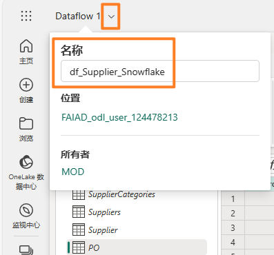
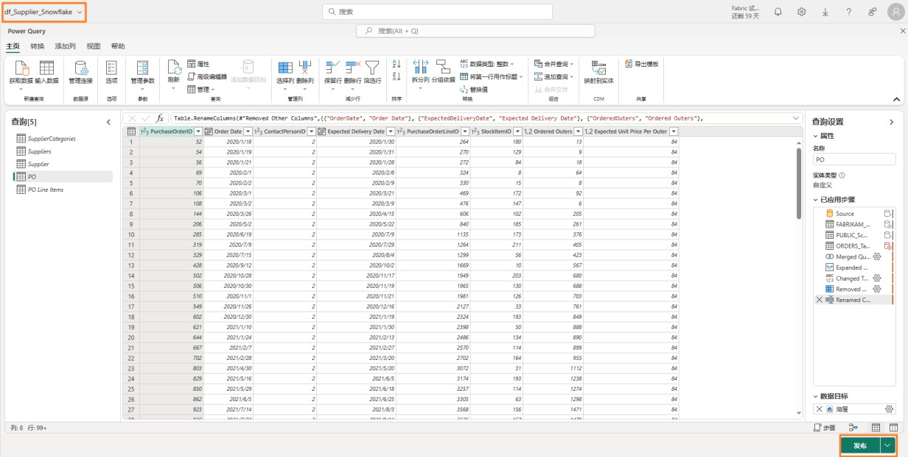

## 目录

简介

数据流 Gen2

- 任务 1：将Snowflake 查询复制到数据流

- 任务 2：创建与Snowflake 的连接

- 任务 3：为Supplier 和PO 查询配置数据目标

- 任务 4：重命名并发布 Snowflake 数据流

- 任务 5：将Dataverse 查询复制到数据流

- 任务 6：创建与 Dataverse 的连接	

- 任务 7：为Customer 查询创建数据目标

- 任务 8：发布并重命名 Dataverse 数据流

- 任务 9：将SharePoint 查询复制到数据流

- 任务 10：创建 SharePoint 连接	

- 任务 11：为People 查询配置数据目标	

- 任务 12：发布并重命名 SharePoint 数据流	

参考

## 简介

在我们的应用场景中，供应商数据位于Snowflake 中，客户数据位于 Dataverse 中，员工数据位于 SharePoint 中。所有这些数据源都会在不同时间更新。为了最大限度地减少数据流的数据刷新次数，我们将为每个数据源创建单独的数据流。

**注意**：单个数据流支持多个数据源。

本实验结束后，您将学会：

- 如何使用数据流Gen2 连接到 Snowflake 并将数据引入 Lakehouse

- 如何使用数据流Gen2 连接到 SharePoint 并将数据引入 Lakehouse

- 如何使用数据流Gen2 连接到 Dataverse 并将数据引入 Lakehouse

## 数据流 Gen2

### 任务 1：将Snowflake 查询复制到数据流

1.	让我们导航回到您在实验 2  任务 9 中创建的 Fabric 工作区 **FAIAD_<username>**。

2.	在顶部菜单中，选择**新建-> 数据流 Gen2**。

您将导航到**数据流页面**。现在我们已经熟悉了数据流，我们接下来从Power BI Desktop 复制查询到数据流。

3.	如果您还未打开FAIAD.pbix，请打开它。它位于您的实验环境的C:\FAIAD\Reports 文件夹中。

4.	从功能区中选择主页 -> 转换数据。Power Query 窗口随即打开。您在之前的实验中注意到，左侧面板中的查询是按数据源整理的。

5.	Power Query 窗口随即打开。从左侧面板中的 SnowflakeData 文件夹下，按 Ctrl+ 选择或
Shift+ 选择以下查询:

&nbsp; &nbsp; &nbsp; &nbsp; &nbsp; &nbsp; a.	SupplierCategories

&nbsp; &nbsp; &nbsp; &nbsp; &nbsp; &nbsp; b.	Suppliers

&nbsp; &nbsp; &nbsp; &nbsp; &nbsp; &nbsp; c.	Supplier

&nbsp; &nbsp; &nbsp; &nbsp; &nbsp; &nbsp; d.	PO

&nbsp; &nbsp; &nbsp; &nbsp; &nbsp; &nbsp; e.	PO Line Items

6.	**右键单击**并选择**复制。**

7.	导航回到**浏览器**。

8.	在**数据流窗格**中，选择**中间窗格**，然后输入  **Ctrl+V**（目前不支持右键单击粘贴）。如果您使用的是 MAC 设备，请使用 Cmd+V 进行粘贴。

**注意**：如果您在实验环境中工作，请选择屏幕右上角的省略号。使用滑块**启用 VM 本地剪贴板**。在对话框上，选择“确定”。粘贴查询后，您可以禁用此选项

### 任务 2：创建与Snowflake 的连接

请注意，五个查询已粘贴，现在左侧显示“查询”面板。由于我们没有为Snowflake 创建连接，因此您将看到一条警告消息，要求您配置连接。

1.	选择**配置连接**。

2.	“连接到数据源”对话框随即打开。在**连接**下拉列表中，确保选择**创建新连接**。

3.	**身份验证种类**应为 **Snowflake**。

4.	输**入Snowflake 用户名和密码**，其位于“环境变量”选项卡中（“实验指南”选项卡旁边）。

5.	选择**连接**

连接已建立，您可以在预览面板中查看数据。请自行浏览查询的应用步骤。Suppliers 查询基本上包含供应商的详细信息，SupplierCategories 顾名思义包含供应商的类别。这两个表与我们需要的列联接，以创建 Supplier 维度。同样，我们将PO Line Items 与PO 合并，以创建PO 事
实。现在我们需要将 Supplier 和PO 数据引入到 Lakehouse。

6.	如前所述，我们不会暂存任何此类数据。因此**右键单击**查询窗格中的 **Supplier** 查询，并选择**启用暂存**以删除复选标记。

7.	同样，右键单击 PO 查询。选择启用暂存以删除复选标记。

**注意**：我们不必为其他三个查询禁用暂存，因为在 Power BI Desktop（这些查询是从这里复制而来）中已经禁用了“启用加载”

### 任务 3：为Supplier 和 PO 查询配置数据目标

1.	选择 **Supplier** 查询。

2.	在功能区中，选择**主页-> 添加数据目标-> 湖屋。**

3.	“连接到数据目标”对话框随即打开。从**连接下拉菜单**中选择  **Lakehouse（无）。**

4.	选择**下一步**。

5.	“选择目标”对话框随即打开。务必**选中新建表单选按钮**，因为我们要创建一个新表。

6.	我们想要在之前创建的 Lakehouse 中创建表。在左侧面板中，导航到**湖屋-> FAIAD_<username>。**

7.	选择 **lh_FAIAD**

8.	将表名称保留为 **Supplier**

9.	选择**下一步**

10.	“选择目标设置”对话框随即打开。这次我们将使用自动设置，因为这将对数据进行全面 更新。此外，它还会根据需要重命名列。选择**保存设置**

11.	您将会导航回到**Power Query 窗口**。请注意，**右下角的数据目标**设置为**湖屋**。同样，**为PO 查询设置数据目标**。完成后，您的PO 查询应将**数据**目标设置为**湖屋**，如下面的屏幕截图所示

### 任务 4：重命名并发布Snowflake 数据流

1.	从屏幕顶部，选择 **Dataflow 2 旁边的箭头** 重命名。

2.	在对话框中，将名称更改为 **df_Supplier_Snowflake**

3.	点击 **Enter** 键以保存名称更改。

4.	在右下角，选择**发布**

您将导航回到 **FAIAD_<username> 工作区**。发布数据流可能需要一些时间。现在我们创建一个从 Dataverse 引入数据的数据流。

### 任务 5：将Dataverse 查询复制到数据流

1.	在顶部菜单中，选择**新建-> 数据流 Gen2**。

您将导航到**数据流页面**。现在我们已经熟悉了数据流，我们接下来从Power BI Desktop 复制查询到数据流。

2.	如果您还未打开**FAIAD.pbix**，请打开它。它位于您的实验环境的**C:\FAIAD\Reports**文件夹中。

3.	从功能区中选择**主页 -> 转换数据。**Power Query 窗口随即打开。您在之前的实验中注意到，左侧面板中的查询是按数据源整理的。

4.	Power Query 窗口随即打开。在左侧面板中的DataverseData 文件夹下，按Ctrl+ 选择以下查询：

