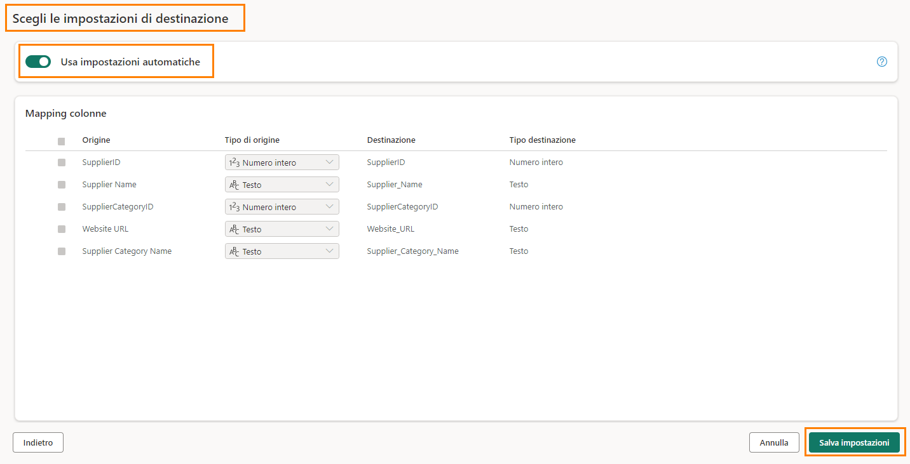
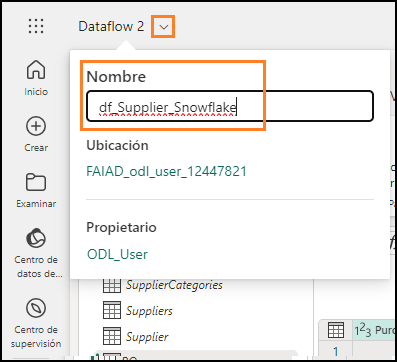
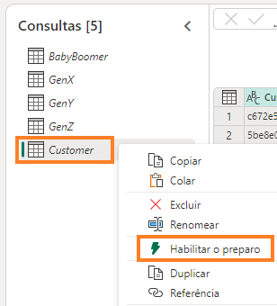
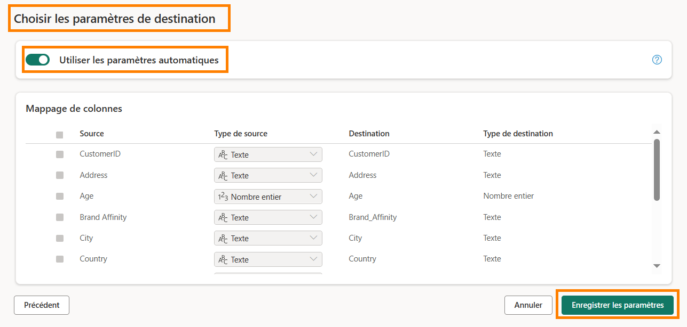
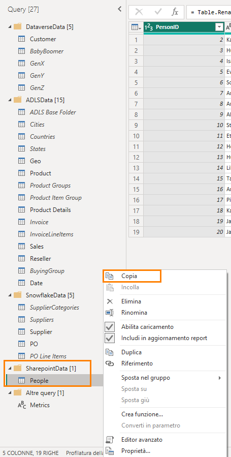
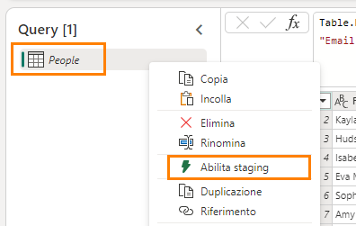
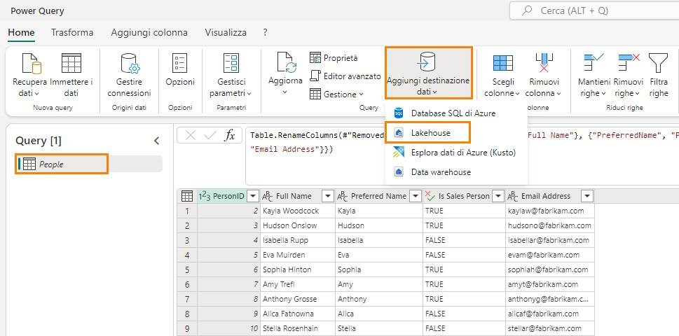
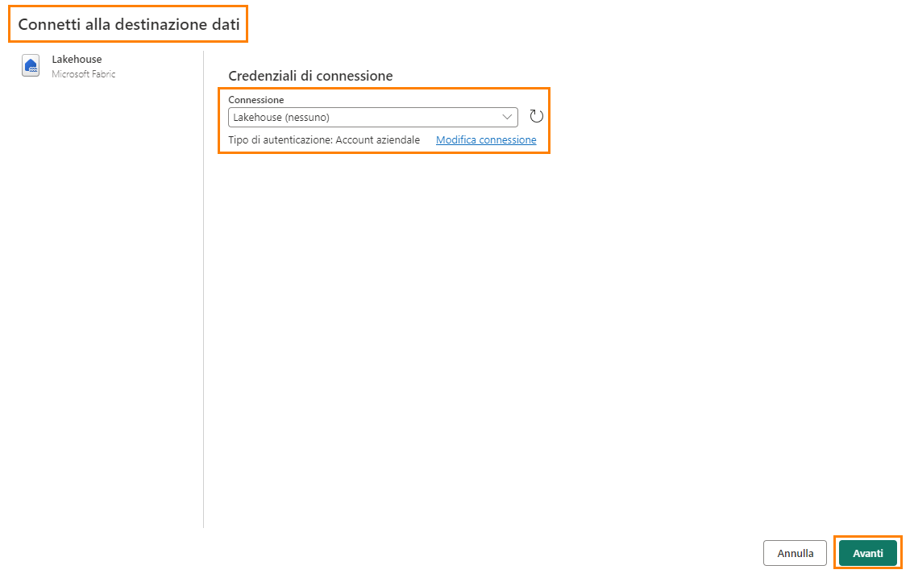
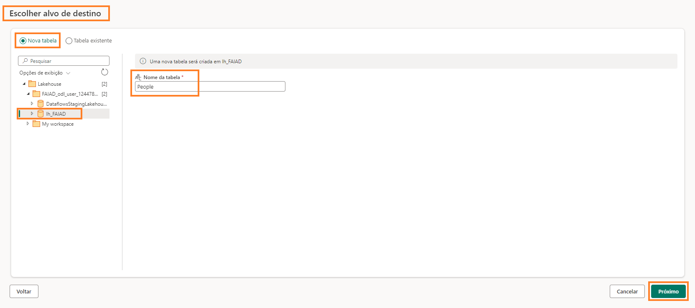
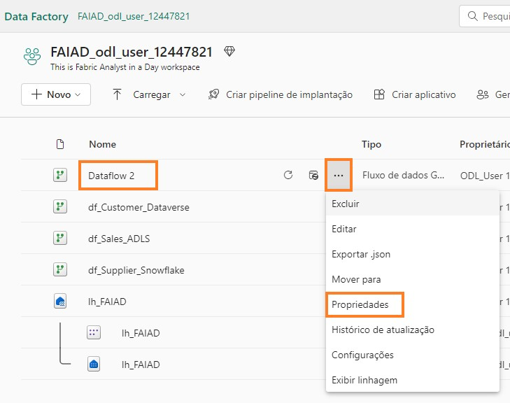

# Introduzione
Nel nostro scenario, i dati sui fornitori si trovano in Snowflake, i dati sui clienti si trovano in Dataverse e i dati sui dipendenti si trovano in SharePoint. Tutte queste origini dati vengono aggiornate in momenti diversi. Per ridurre al minimo il numero di aggiornamenti dei dati dei flussi di dati, creeremo flussi di dati individuali per ciascuna di queste origini dati.

>**Nota**: è supportata la presenza di più origini dati in un unico flusso di dati. In questo lab si imparerà a:
- Connettersi a Snowflake mediante Flusso di dati Gen2 e inserire dati in lakehouse

- Connettersi a SharePoint mediante Flusso di dati Gen2 e inserire dati in lakehouse

- Connettersi a Dataverse mediante Flusso di dati Gen2 e inserire dati in lakehouse

## Flusso di dati Gen2
### Attività 1 - Copia di query di Snowflake nel flusso di dati
1.	Torniamo all'area di lavoro di Fabric **FAIAD_<nome utente>** creata nel Lab 2, attività 9.

2.	Nel menu in alto selezionare **Nuovo -> Flusso di dati Gen2**.

   
   
Si apre la pagina **Flusso di dati**. Ora che abbiamo familiarità con Flusso di dati, procediamo con la copia delle query da Power BI Desktop a Flusso di dati.

3.	Se non lo si è ancora aperto, aprire il file **FAIAD.pbix** contenuto nella cartella **C:\FAIAD\Reports**
dell'ambiente lab.
4.	Nella barra multifunzione selezionare **Home -> Trasforma dati**.
 Si apre la finestra Power Query.
Come si è notato nel lab precedente, le query nel pannello di sinistra sono organizzate per origine dati.
 
5.	Si apre la finestra Power Query. Nel pannello di sinistra selezionare le seguenti query nella cartella SnowflakeData tenendo premuto il tasto **CTRL MAIUSC**:
 a. SupplierCategories 
b.	Suppliers 
c.	Supplier 
d.	PO 
e.	PO Line Items 
6.	Fare clic con il pulsante destro del mouse e selezionare Copia. 

   
   
7.	Tornare al **browser**.

8.	Nel **riquadro Flusso di dati** selezionare il **riquadro centrale** e premere **CTRL+V** (l'opzione Incolla del menu del pulsante destro non è attualmente supportata). Se si usa un dispositivo MAC, usare Cmd+V per incollare.
Nota: se si lavora in un ambiente lab, selezionare i puntini di sospensione in alto a destra della schermata. Usare il dispositivo di scorrimento per **abilitare Appunti nativi VM**. Nella finestra di dialogo selezionare OK. Dopo aver incollato le query è possibile disabilitare questa opzione.

   
 
### Attività 2 - Creazione della connessione a Snowflake
Notare che le cinque query vengono incollate e sulla sinistra è visualizzato il pannello Query. Poiché non abbiamo creato una connessione a Snowflake, compare un messaggio di avviso che chiede di configurare la connessione.

1.	Selezionare **Configura connessione**.
   
   
  	
2.	Si apre la finestra di dialogo Connetti a origine dati. Assicurarsi che nel menu a discesa **Connessione** sia selezionato **Crea nuova connessione**.

3.	Il **Tipo di autenticazione** dovrebbe essere impostato su **Snowflake**.

4.	Immettere **nome utente e password di Snowflake** disponibili nella scheda Variabili di ambiente (accanto alla scheda Guida al lab).

5.	Selezionare **Connetti**.
   
   

Viene stabilita la connessione ed è possibile visualizzare i dati nel pannello di anteprima. Esplorare i Passaggi applicati delle query. In genere, la query Suppliers contiene i dettagli sui fornitori e SupplierCategories contiene le categorie di fornitori. Queste due tabelle vengono unite per creare la dimensione Supplier, con le colonne necessarie. Analogamente, PO Line Items viene unita con PO per creare il fatto PO. Ora dobbiamo inserire i dati di Supplier e PO in Lakehouse.

6.	Come indicato in precedenza, non effettuiamo lo staging di questi dati. Quindi **fare clic con ilpulsante destro del mouse** sulla query **Supplier** nel riquadro Query e selezionare **Abilita staging** per rimuovere il segno di spunta.
 
   

7.	Allo stesso modo, fare clic con il pulsante destro del mouse sulla query PO. Selezionare Abilita staging per rimuovere il segno di spunta.
**Nota**: non è necessario disabilitare lo staging per le altre tre query poiché l'opzione Abilita caricamento era disattivata in Power BI Desktop (da cui sono state copiate le query).

### Attività 3 - Configurazione della destinazione dei dati per le query Supplier e PO
1.	Seleziona la query **Supplier**.
2.	Nella barra multifunzione selezionare **Home -> Aggiungi destinazione dati -> Lakehouse**.

   
   
3.	Si apre la finestra di dialogo Connetti alla destinazione dati. Nel menu a discesa Connessione selezionare **Lakehouse (nessuno)**. 

4.	Selezionare **Avanti**.

   
   
5.	Si apre la finestra di dialogo Scegliere il target di destinazione. Assicurarsi che il pulsante di opzione **Nuova tabella** sia selezionato, poiché si sta creando una nuova tabella.

6.	Vogliamo creare la tabella nel Lakehouse creato in precedenza. Nel pannello di sinistra andare a **Lakehouse -> FAIAD_<nomeutente>**.

7.	Selezionare **lh_FAIAD**

8.	Lasciare il nome della tabella **Supplier**

9. Selezionare Avanti.

    
 
10. Questa volta useremo le impostazioni automatiche perché i dati verranno aggiornati completamente. Inoltre, le colonne verranno rinominate secondo necessità. Selezionare
    **Salva impostazioni**.

11. Si apre nuovamente la **finestra di Power Query**. Nell'angolo in basso a destra notare che la Destinazione dati è impostata su **Lakehouse**. Allo stesso modo, impostare la 
    **Destinazione dati per la query PO**. Al termine, la Destinazione dati della query PO dovrebbe essere impostata su **Lakehouse** come illustrato nello screenshot.

    
 
### Attività 4 - Ridenominazione e pubblicazione del flusso di dati Snowflake
1.	Nella parte superiore dello schermo selezionare la **freccia accanto a Flusso di dati 2** per rinominarlo.
2.	Nella finestra di dialogo cambiarne il nome in **df_Supplier_Snowflake**
3.	Premere **INVIO** per salvare la modifica del nome.

   

4.	Nell'angolo inferiore destro selezionare **Pubblica**.

   
  	
Si tornerà all'area di lavoro **FAIAD_<nome utente>**. La pubblicazione del flusso di dati potrebbe richiedere alcuni istanti. Ora creeremo un flusso di dati per importare dati da Dataverse.
 
### Attività 5 - Copia di query Dataverse nel flusso di dati
1.	Nel menu in alto selezionare **Nuovo -> Flusso di dati Gen2**.

   
   
Si apre la pagina **Flusso di dati**. Ora che abbiamo familiarità con Flusso di dati, procediamo con la copia delle query da Power BI Desktop a Flusso di dati.

2.	Se non lo si è ancora aperto, aprire il file **FAIAD.pbix** nella cartella **C:\FAIAD\Reports** dell'ambiente lab.
3.	Nella barra multifunzione selezionare **Home -> Trasforma dati**. Si apre la finestra Power Query.
Come si è notato nel lab precedente, le query nel pannello di sinistra sono organizzate per origine dati.
4.	Si apre la finestra Power Query. Dal pannello di sinistra, selezionare le seguenti query nella cartella DataverseData tenendo premuto il tasto **CTR**L:
      a.	BabyBoomer
      b.	GenX
      c.	GenY
      d.	GenZ
      e.	Customer
 
5.	**Fare clic con il pulsante destro del mouse** e selezionare **Copia**.

   
   
6.	Tornare alla pagina **Flusso di dati** nel browser.

7.	Nel riquadro **Flusso di dati** premere **CTRL+V** (l'opzione Incolla del menu del pulsante destro non è attualmente supportata). Se si usa un dispositivo MAC, usare Cmd+V per incollare.
   
>**Nota:** se si lavora in un ambiente lab, selezionare i puntini di sospensione in alto a destra della schermata. Usare il dispositivo di scorrimento per abilitare Appunti nativi VM. Nella finestra di dialogo selezionare OK. Dopo aver incollato le query è possibile disabilitare questa opzione.

### Attività 6 - Creazione della connessione a Dataverse
Notare che le cinque query vengono incollate e sulla sinistra è visualizzato il pannello Query. Poiché non abbiamo creato una connessione a Dataverse, compare un messaggio di avviso che chiede di configurare la connessione.

1.	Selezionare **Configura connessione**.

   
   
2.	Si apre la finestra di dialogo Connetti a origine dati. Assicurarsi che nel **menu a discesa Connessione** sia **selezionato Crea nuova connessione**.

3.	Il **Tipo di autenticazione** dovrebbe essere **Account aziendale**.

4.	Selezionare **Connetti**.
 
   

### Attività 7 - Creazione della destinazione dati per la query Customer
Viene stabilita la connessione ed è possibile visualizzare i dati nel pannello di anteprima. Esplorare i Passaggi applicati delle query. I dati sui clienti sono disponibili per categoria: BabyBoomer, GenX,GenY e GenZ. Queste quattro query vengono aggiunte per creare la query Customer. Ora dobbiamo inserire i dati di Customer in Lakehouse.

1.	Come indicato in precedenza, non effettuiamo lo staging di questi dati. Quindi **fare clic con il pulsante destro del mouse** sulla query Customer nel riquadro Query e selezionare **Abilita staging** per rimuovere il segno di spunta.

   
   
2.	Selezionare la query **Customer**.
 
3.	Nella barra multifunzione selezionare **Home -> Aggiungi destinazione dati -> Lakehouse**.

   
   
4.	Si apre la finestra di dialogo Connetti alla destinazione dati. Nel menu a discesa Connessione selezionare **Lakehouse (nessuno)**.

5.	Selezionare **Avanti**.

   

6.	Si apre la finestra di dialogo Scegliere il target di destinazione. Assicurarsi che il pulsante di opzione Nuova tabella sia selezionato, poiché si sta creando una nuova tabella.

7.	Vogliamo creare la tabella nel Lakehouse creato in precedenza. Nel pannello di sinistra andare a **Lakehouse -> FAIAD_<nomeutente>**

8.	Selezionare **lh_FAIAD**

9.	Lasciare il nome della tabella **Customer** .

10. Selezionare **Avanti**.

   
    
11. Si apre la finestra di dialogo Scegli le impostazioni di destinazione. Questa volta useremo le impostazioni automatiche perché i dati verranno aggiornati completamente. Inoltre, le colonne verranno rinominate secondo necessità. Selezionare **Salva impostazioni.**

   
 
### Attività 8 - Pubblicazione e ridenominazione del flusso di dati Dataverse
1.	Si apre nuovamente la **finestra di Power Query**. Nell'**angolo in basso a destra** notare che la**Destinazione dati** è impostata su **Lakehouse**.

2.	Nell'angolo inferiore destro selezionare **Pubblica**.

   
   
>**Nota**: si tornerà all'**area di lavoro FAIAD_<nome utente>.** La pubblicazione del flusso di dati potrebbe richiedere alcuni istanti.

3.	Stiamo lavorando in Flusso di dati 2. Rinominiamolo prima di continuare. Fare clic sui puntini di **sospensione (…)** accanto a Flusso di dati 2. Selezionare **Proprietà**.

   
   
4.	Si apre la finestra di dialogo Proprietà flusso di dati. Cambiarne il **Nome** in **df_Customer_Dataverse**.

5.	Nella casella di testo **Descrizione** aggiungere **Flusso di dati per inserire i dati sui clienti da Dataverse in Lakehouse**.   

6.	Selezionare **Salva**.

   

Si tornerà all'area di lavoro **FAIAD_<nome utente>**. Ora creiamo un flusso di dati per importare i dati da SharePoint.

### Attività 9 - Copia di query SharePoint nel flusso di dati
1.	Nel menu in alto selezionare **Nuovo -> Flusso di dati Gen2**.

   
   
Si apre la pagina **Flusso di dati**. Ora che abbiamo familiarità con Flusso di dati, procediamo con la copia delle query da Power BI Desktop a Flusso di dati.

2.	Se non lo si è ancora aperto, aprire il file **FAIAD.pbix** contenuto nella cartella **C:\FAIAD\Reports** dell'ambiente lab.
 
3.	Nella barra multifunzione selezionare **Home -> Trasforma dati**. Si apre la finestra Power Query.Come si è notato nel lab precedente, le query nel pannello di sinistra sono organizzate per origine dati.

4.	Si apre la finestra Power Query. Dal pannello di sinistra **selezionare** la query **People** nella cartella SharepointData.

5.	**Fare clic con il pulsante destro del mouse** e selezionare **Copia**.

   
   
6.	Tornare alla schermata **Flusso di dati** nel browser.

7.	Nel riquadro **Flusso di dati** premere **CTRL+V** (l'opzione Incolla del menu del pulsante destro non è attualmente supportata).

>**Nota**: se si lavora in un ambiente lab, selezionare i puntini di sospensione in alto a destra della schermata. Usare il dispositivo di scorrimento per **abilitare Appunti nativi VM**. Nella finestra di dialogo selezionare OK. Dopo aver incollato le query è possibile disabilitare questa opzione.
Notare che la query viene incollata ed è disponibile nel pannello di sinistra. Poiché non abbiamo
creato una connessione a SharePoint, compare un messaggio di avviso che chiede di configurare la connessione.
 
### Attività 10 - Creazione della connessione a SharePoint
1.	Selezionare **Configura connessione**.

  	
  	
3.	Si apre la finestra di dialogo Connetti a origine dati. Assicurarsi che nel menu a discesa **Connessione** sia selezionato **Crea nuova connessione**.

4.	Il **Tipo di autenticazione** dovrebbe essere **Account aziendale**.

5.	Selezionare **Connetti**.

   
 
### Attività 11 - Configurazione della destinazione dei dati per la query People
Viene stabilita la connessione ed è possibile visualizzare i dati nel pannello di anteprima. Esplorare i Passaggi applicati delle query. Ora dobbiamo inserire i dati di People in Lakehouse.
1.	Come indicato in precedenza, non effettuiamo lo staging di questi dati. Quindi **fare clic con il pulsante destro del mouse** sulla query **People** nel riquadro Query e selezionare 
  **Abilita staging** per rimuovere il segno di spunta.

   
  	
2.	Selezionare la query **People**.
   
3.	Nella barra multifunzione selezionare **Home -> Aggiungi destinazione dati -> Lakehouse**.

  	
  	
4.	Si apre la finestra di dialogo Connetti alla destinazione dati. Nel menu a discesa Connessioneselezionare **Lakehouse (nessuno)**.
 
5.	Selezionare **Avanti**.
   
   
  	
6.	Si apre la finestra di dialogo Scegliere il target di destinazione. Assicurarsi che il pulsante di opzione **Nuova tabella** sia selezionato, poiché si sta creando una nuova tabella.
7. Vogliamo creare la tabella nel Lakehouse creato in precedenza. Nel pannello di sinistra andare a**Lakehouse -> FAIAD_<nomeutente>**.

8. Selezionare **lh_FAIAD**.
9. Lasciare il nome della tabella **People**.

10. Selezionare **Avanti**.

    
 
11. Questa volta useremo le impostazioni automatiche perché i dati verranno aggiornati completamente. Inoltre, le colonne verranno rinominate secondo necessità. Selezionare
      **Salva impostazioni**.

    

### Attività 12 - Pubblicazione e ridenominazione del flusso di dati SharePoint
1.	Si apre nuovamente la **finestra di Power Query**. Nell'a**ngolo in basso a destra** notare che la Destinazione dati è impostata su **Lakehouse**.
2.	Nell'angolo inferiore destro selezionare **Pubblica**.

   

>**Nota**: si tornerà all'**area di lavoro FAIAD_<nome utente>**. La pubblicazione del flusso di dati potrebbe richiedere alcuni istanti.
 
3.	Stiamo lavorando in Flusso di dati 2. Rinominiamolo prima di continuare. Fare clic sui puntini di **sospensione (…)** accanto a Flusso di dati 2. Selezionare **Proprietà**.

   
   
4.	Si apre la finestra di dialogo Proprietà flusso di dati. Cambiarne il **Nome** in **df_People_SharePoint**
5.	Nella casella di testo **Descrizione** aggiungere **Flusso di dati per inserire i dati del personale da SharePoint in Lakehouse**.
6.	Selezionare **Salva**.

   
   
Si tornerà all'**area di lavoro FAIAD_<nome utente>**. Ora abbiamo inserito tutti i dati in Lakehouse. Nel prossimo lab pianificheremo l'aggiornamento del flusso di dati.
 
## Riferimenti
Fabric Analyst in a Day (FAIAD) presenta alcune delle funzionalità chiave disponibili in Microsoft Fabric. Nel menu di servizio, la sezione Guida (?) include collegamenti ad alcune risorse utili.

   
   
Di seguito sono riportate ulteriori risorse utili che consentiranno di progredire nell'uso di Microsoft Fabric. 
- Vedere il post di blog per leggere l'[annuncio completo sulla disponibilità generale di Microsof t Fabric](https://aka.ms/Fabric-Hero-Blog-Ignite23) 
- Esplorare Fabric attraverso la [Presentazione guidata](https://aka.ms/Fabric-GuidedTour) 
- Iscriversi alla [versione di valutazione gratuita di Microsof t Fabric](https://aka.ms/try-fabric) 
- Visitare il [sito Web di Microsof t Fabric](https://aka.ms/microsoft-fabric) 
- Acquisire nuove competenze esplorando i [moduli di apprendimento su Fabric](https://aka.ms/learn-fabric) 
- Consultare la [documentazione tecnica di Fabric](https://aka.ms/fabric-docs) 
- Leggere l'[e-book gratuito introduttivo a Fabric](https://aka.ms/fabric-get-started-ebook) 
- Unirsi alla [community di Fabric](https://aka.ms/fabric-community) per pubblicare domande, condividere feedback e imparare dagli altri 

Leggere i blog di annunci più approfonditi sull'esperienza in Fabric:

- [Blog sull'esperienza Data Factory in Fabric](https://aka.ms/Fabric-Data-Factory-Blog) 
- [Blog sull'esperienza Synapse Data Engineering in Fabric](https://aka.ms/Fabric-DE-Blog) 
- [Blog sull'esperienza Synapse Data Science in Fabric](https://aka.ms/Fabric-DS-Blog) 
- [Blog sull'esperienza Synapse Data Warehousing in Fabric](https://aka.ms/Fabric-DW-Blog) 
- [Blog sull'esperienza Synapse Real-Time Analytics in Fabric](https://aka.ms/Fabric-RTA-Blog) 
- [Blog di annunci di Power BI](https://aka.ms/Fabric-PBI-Blog) 
- [Blog sull'esperienza Data Activator in Fabric](https://aka.ms/Fabric-DA-Blog) 
- [Blog su amministrazione e governance in Fabric](https://aka.ms/Fabric-Admin-Gov-Blog) 
- [Blog su OneLake in Fabric](https://aka.ms/Fabric-OneLake-Blog) 
- [Blog sull'integrazione di Dataverse e Microsof t Fabric](https://aka.ms/Dataverse-Fabric-Blog) 

© 2023 Microsoft Corporation. Tutti i diritti sono riservati.
L'uso della demo/del lab implica l'accettazione delle seguenti condizioni:
La tecnologia/le funzionalità descritte nella demo/nel lab sono fornite da Microsoft Corporation allo scopo di ottenere feedback dall'utente e offrire un'esperienza di apprendimento. L'utilizzo della demo/del lab è consentito solo per la valutazione delle caratteristiche e delle funzionalità di tale tecnologia e per l'invio di feedback a Microsoft. L'utilizzo per qualsiasi altro scopo non è consentito. È vietato modificare, copiare, distribuire, trasmettere, visualizzare, eseguire,
riprodurre, pubblicare, concedere in licenza, usare per la creazione di lavori derivati, trasferire o vendere questa demo/questo lab o parte di essi.

SONO ESPLICITAMENTE PROIBITE LA COPIA E LA RIPRODUZIONE DELLA DEMO/DEL LAB (O DI QUALSIASI PARTE DI ESSI) IN QUALSIASI ALTRO SERVER O IN QUALSIASI ALTRA POSIZIONE PER ULTERIORE RIPRODUZIONE O RIDISTRIBUZIONE.
QUESTA DEMO/QUESTO LAB RENDONO DISPONIBILI TECNOLOGIE SOFTWARE/FUNZIONALITÀ DI PRODOTTO SPECIFICHE, INCLUSI NUOVI CONCETTI E NUOVE FUNZIONALITÀ POTENZIALI, IN UN
AMBIENTE SIMULATO, CON UN'INSTALLAZIONE E UNA CONFIGURAZIONE PRIVE DI COMPLESSITÀ, PER GLI SCOPI DESCRITTI IN PRECEDENZA. LA TECNOLOGIA/I CONCETTI RAPPRESENTATI IN
QUESTA DEMO/IN QUESTO LAB POTREBBERO NON CONTENERE LE FUNZIONALITÀ COMPLETE E
IL LORO FUNZIONAMENTO POTREBBE NON ESSERE LO STESSO DELLA VERSIONE FINALE. È ANCHE POSSIBILE CHE UNA VERSIONE FINALE DI TALI FUNZIONALITÀ O CONCETTI NON VENGA
RILASCIATA. L'ESPERIENZA D'USO DI TALI CARATTERISTICHE E FUNZIONALITÀ PUÒ INOLTRE RISULTARE DIVERSA IN UN AMBIENTE FISICO.
**FEEDBACK**. L'invio a Microsoft di feedback sulle caratteristiche, sulle funzionalità e/o sui concetti della tecnologia descritti in questa demo/questo lab implica la concessione a Microsoft, a titolo gratuito, del diritto di utilizzare, condividere e commercializzare tale feedback in qualsiasi modo e per qualsiasi scopo. Implica anche la concessione a titolo gratuito a terze parti del diritto di utilizzo di eventuali brevetti necessari per i loro prodotti, le loro tecnologie e i loro servizi al fine di utilizzare o interfacciarsi ai componenti software o ai servizi Microsoft specifici che includono il feedback. L'utente si impegna a non inviare feedback la cui inclusione all'interno di software o documentazione Microsoft imponga a Microsoft di concedere in licenza a terze parti tale software o documentazione. Questi diritti sussisteranno anche dopo la scadenza del presente contratto.
 
CON LA PRESENTE MICROSOFT CORPORATION NON RICONOSCE ALCUNA GARANZIA O CONDIZIONE RELATIVAMENTE ALLA DEMO/AL LAB, INCLUSE TUTTE LE GARANZIE E CONDIZIONI DI COMMERCIABILITÀ, DI FATTO ESPRESSE, IMPLICITE O PRESCRITTE DALLA LEGGE, ADEGUATEZZA PER UNO SCOPO SPECIFICO, TITOLARITÀ E NON VIOLABILITÀ. MICROSOFT NON OFFRE GARANZIE O RAPPRESENTAZIONI IN RELAZIONE ALL'ACCURATEZZA DEI RISULTATI E DELL'OUTPUT DERIVANTI DALL'USO DELLA DEMO/DEL LAB O ALL'ADEGUATEZZA DELLE INFORMAZIONI CONTENUTE NELLA DEMO/NEL LAB PER QUALSIASI SCOPO.
CLAUSOLA DI RESPONSABILITÀ
Questa demo/questo lab contiene solo una parte delle nuove funzionalità e dei miglioramenti in Microsoft Power BI. Alcune funzionalità potrebbero cambiare nelle versioni future del prodotto. In questa demo/in questo lab si apprendono alcune delle nuove funzionalità, ma non tutte.

