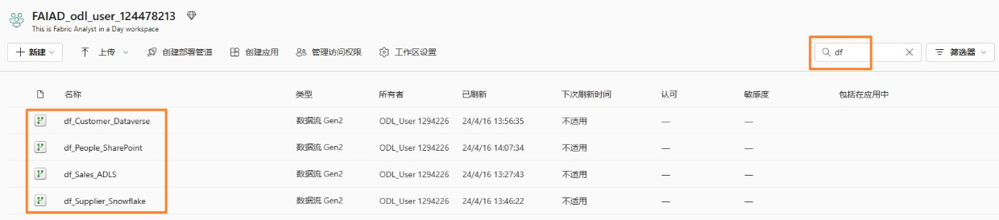
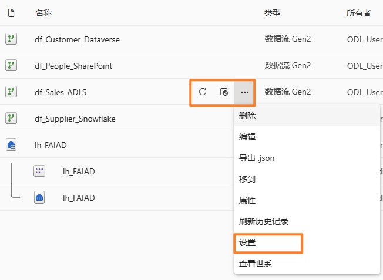
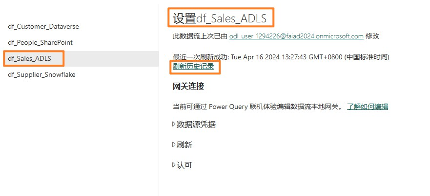
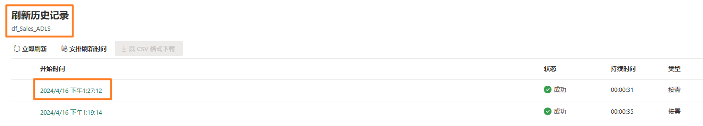
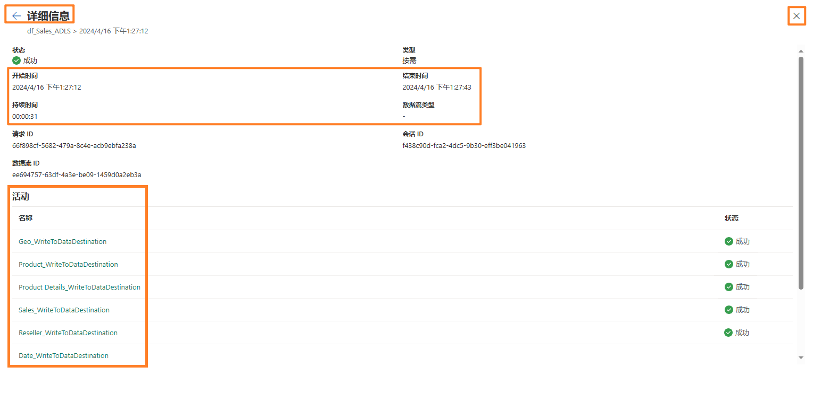
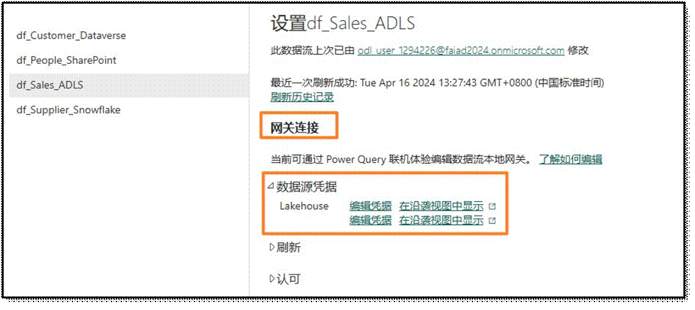
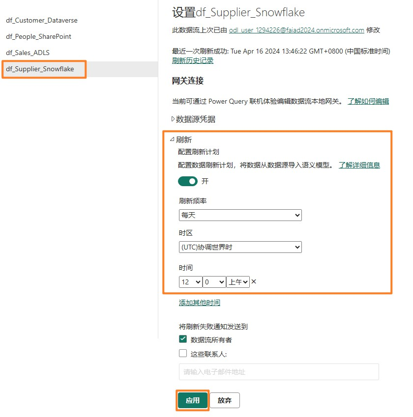
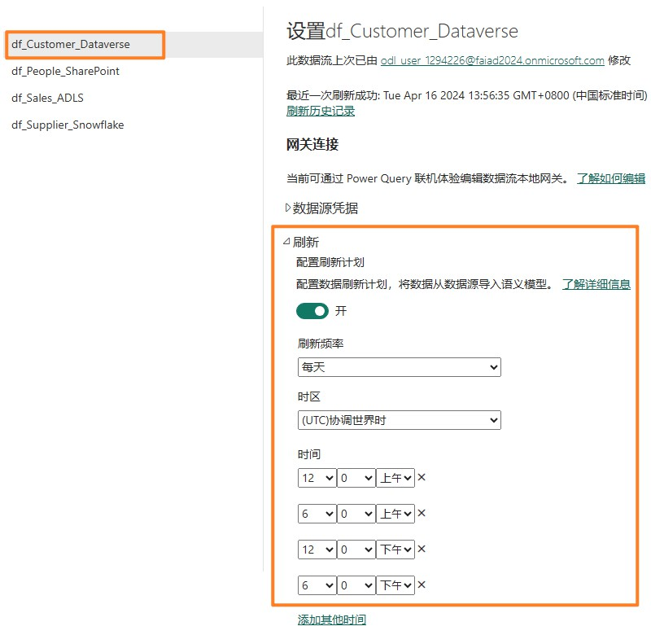

## 目录

- 简介

- 数据流 Gen2

    - 任务 1：为销售数据流配置计划刷新

    - 任务 2：为供应商和客户数据流配置计划刷新	

- 数据管道

    - 任务 3：创建数据管道

    - 任务 4：生成简单的数据管道	

    - 任务 5：创建新数据管道

    - 任务 6：创建截止活动

    - 任务 7：创建变量

    - 任务 8：配置截止活动

    - 任务 9：配置数据流活动

    - 任务 10：配置第1 个设置变量活动	

    - 任务 11：配置第2 个设置变量活动	

    - 任务 12：配置第3 个设置变量活动	

    - 任务 13：配置等待活动

    - 任务 14：为数据管道配置计划刷新	

参考

## 简介

我们已将来自不同数据源的数据引入到Lakehouse。在本实验中，您将为数据源设置刷新计划。简单回顾一下要求：

- **销售数据**：存储在 ADLS 中，每天中午 12 点更新。

- **供应商数据**：存储在 Snowflake 中，每天半夜/凌晨 12 点更新。

- **客户数据**：存储在 Dataverse 中，随时更新。我们每天需要刷新四次，分别在半夜/凌晨 12 点、上午 6 点、中午 12 点和下午 6 点。

- **员工数据**：存储在 SharePoint 中，每天上午 9 点更新。但我们注意到有时会有 5 至 15
分钟的延迟。我们需要创建一个刷新计划来进行调整。

本实验结束后，您将学会：

- 如何为数据流Gen2 配置计划刷新

- 如何创建数据管道

- 如何为数据管道配置计划刷新

## 数据流Gen2

### 任务 1：为销售数据流配置计划刷新

我们首先配置销售数据流的计划刷新。

1.	让我们导航回到您在实验 2 任务 9 中创建的 Fabric 工作区 **FAIAD_<username>。**

2.	此处列出了您创建的所有项目。在屏幕右侧的**搜索框**中，输入**df**。这会将项目筛选到数据流。

3.	将光标悬停在 **df_Sales_ADLS** 行上。请注意，这里显示熟悉的**刷新**和**计划刷新图标**。选择
省略号 (…)。
 
4.	请注意，有“删除”、“编辑”和“导出数据流”选项。我们可以使用“属性”来更新数据流的名称和描述。我们稍后会查看刷新历史记录。选择**设置。**

**注意：**设置页面打开。在左侧面板中，您将看到所有列出的数据流。

5.	在中间窗格中，选择**刷新历史记录**链接。

6.	“刷新历史记录”对话框随即打开。您将看到列出了几次刷新。这是发布数据流时发生的刷新。选择**开始**时间链接。

**注意**：您的开始时间会有所不同。

详细信息屏幕将打开。这将提供刷新的详细信息，其中列出了开始时间、结束时间和持续时间。还列出了刷新的表/活动。如果出现故障，您可以点击表/活动的名称进一步调查。

7.	我们点击右上角的 X 离开此页面。您将导航回到数据**流设置页面**。

8.	在“网关连接”下，展开**数据源凭据**。将显示数据流中使用的连接列表。在本例中，是
Lakehouse 和 ADLS。

    a. **Lakehouse**：这是从数据流引入数据的连接。

    b.	**ADLS**：这是与 ADLS 源数据的连接。

9.	展开**刷新**。

10.	将**配置刷新计划**滑块设置为**开。**

11.	将**刷新频率下拉列表**设置为**每天**。请注意，此处还有一个“设置为每周”的选项。
 
12.	将**时区**设置为您的首选时区。

    **注意**：由于这是实验环境，因此您可以将时区设置为您的首选时区。在实际应用场景中，您将根据您本人/数据源的位置设置时区。

13.	点击**添加其他时间**链接。请注意，**时间**选项已显示。

14.	将**时间**设置为**中午**。请注意，您可以将刷新设置为一小时或半小时。

15.	选择应用以保存此设置。

**注意**：通过点击“添加其他时间”链接，您可以添加多个刷新时间。

您还可以向数据流所有者和其他联系人发送失败通知。

## 任务 2：为供应商和客户数据流配置计划刷新

1.	在左侧面板中，选择 **df_Supplier_Snowflake**。

2.	将刷新计划配置为**每天半夜/凌晨 12 点**刷新。

3.	选择**应用**以保存此设置。

4.	在左侧面板中，选择 **df_Customer_Dataverse。**

5.	将刷新计划配置为每天刷新四次：**半夜/凌晨 12 点、上午 6 点、中午 12 点和下午 6 点。**

6.	选择**应用**以保存此设置。

前面提到，我们需要构建一个自定义逻辑来处理 SharePoint 中的员工文件未按时送达的应用场景。我们使用数据管道来解决此问题。

## 数据管道

任务 3：创建数据管道

1.	选择屏幕左下角的 Fabric 体验选择器图标。

2.	Microsoft Fabric 对话框随即打开。选择 Data Factory。您将导航到 Data Factory 主页。

