	  	 
 
## Sommaire
- Introduction
- Dataflow Gen2
    - Tâche 1 : configurer l’actualisation planifiée pour le flux de données Ventes
    - Tâche 2 : configurer l’actualisation planifiée pour le flux de données fournisseur et client
    Pipeline de données
    - Tâche 3 : créer un pipeline de données
    - Tâche 4 : créer un pipeline de données simple
    - Tâche 5 : créer un pipeline de données
    - Tâche 6 : créer une activité Until
    - Tâche 7 : créer des variables
    - Tâche 8 : configurer l’activité Until
    - Tâche 9 : configurer l’activité Flux de données
    - Tâche 10 : configurer une 1re activité Définir une variable
    - Tâche 11 : configurer une 2e activité Définir une variable
    - Tâche 12 : configurer une 3e activité Définir une variable
    - Tâche 13 : configurer l’activité Attendre
    - Tâche 14 : configurer l’actualisation planifiée pour le pipeline de données
- Références
 
## Introduction
Nous avons ingéré des données provenant de différentes sources de données dans Lakehouse. Dans ce labo, vous allez configurer un calendrier d’actualisation pour les sources de données. Voici un résumé du besoin :

- **Données commerciales :** stockées dans ADLS et mises à jour au quotidien à midi.
- **Données fournisseur :** stockées dans Snowflake et mises à jour au quotidien à minuit.
- **Données client :** stockées dans Dataverse et systématiquement à jour. Nous devons les actualiser quatre fois par jour : à minuit, 6 h, midi et 18 h.
- **Données collaborateur :** stockées dans SharePoint et mises à jour au quotidien à 9 h. Cependant, nous avons remarqué qu’il y a parfois un retard de 5 à 15 minutes. Nous devons créer un calendrier d’actualisation pour en tenir compte.

À la fin de ce labo, vous saurez :

- comment configurer une actualisation planifiée de Dataflow Gen2 ;
- comment créer un pipeline de données ;
- comment configurer une actualisation planifiée d’un pipeline de données.


## Dataflow Gen2
### Tâche 1 : configurer l’actualisation planifiée pour le flux de données Ventes
Commençons par configurer une actualisation planifiée du Flux de données Ventes.

1. Revenons à l’espace de travail Fabric **FAIAD_<username>** que vous avez créé dans le labo 2, tâche 9.
2. Tous les artefacts que vous avez créés sont répertoriés ici. Sur le côté droit de l’écran, saisissez **df**
dans la **zone de recherche.** Les artefacts sont alors filtrés vers les flux de données.

    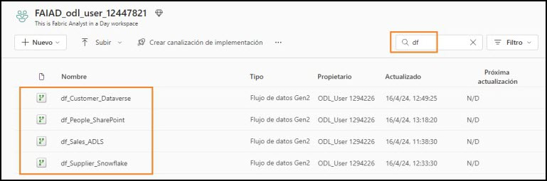

3. Survolez la ligne **df_Sales_ADLS**. Notez que les icônes familières **Actualiser** et **Planifier l’actualisation** sont disponibles. Cliquez sur les **points de suspension (…)**.
4. Notez qu’une option permet de supprimer, de modifier et d’exporter le flux de données. Nous pouvons mettre à jour le nom et la description du flux de données à l’aide des propriétés. Nous allons examiner prochainement l’historique des actualisations. Cliquez sur **Paramètres**.

    
 
    **Remarque :** la page Paramètres s’ouvre alors. Tous les flux de données sont répertoriés dans le volet gauche.

5. Dans le volet central, cliquez sur le lien **Historique des actualisations**.

    

6. La boîte de dialogue Historique des actualisations s’ouvre alors. Quelques actualisations seront répertoriées. Il s’agit d’actualisations qui se sont produites lors de la publication du flux de données. Cliquez sur le lien **Heure de début**.

**Remarque :** l’heure de début est différente pour vous.

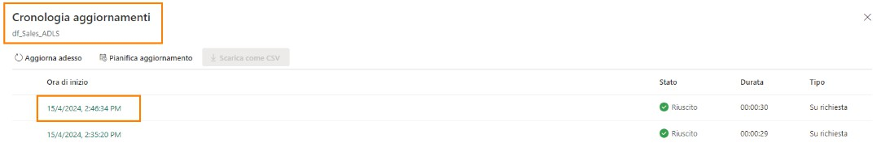

L’écran Détails s’ouvre alors. Il vous fournit des détails sur l’actualisation et répertorie l’heure de début, l’heure de fin et la durée. Il répertorie également les tables/activités actualisées. En cas d’échec, vous pouvez cliquer sur le nom de la table/l’activité pour l’examiner plus en détail.

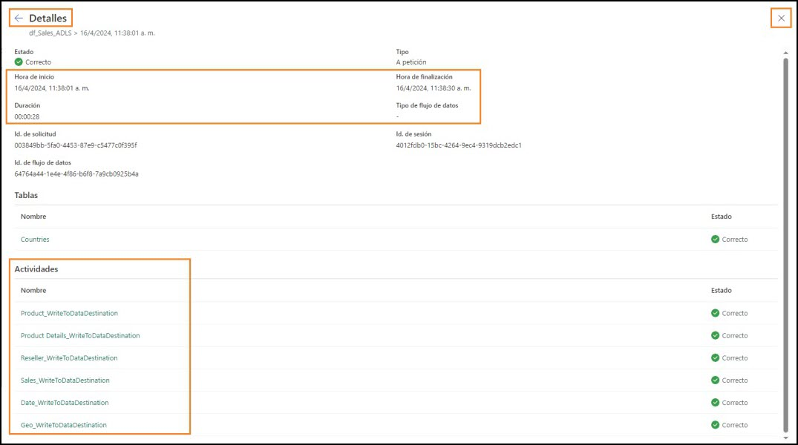 
 
7. Quittons cet écran en cliquant sur le X dans le coin supérieur droit. Vous êtes alors redirigé vers la **page des paramètres du flux de données**.

8. Sous Connexion à la passerelle, développez **Informations d’identification de la source de données**. Une liste des connexions utilisées dans le flux de données s’affiche alors, à savoir Lakehouse et ADLS dans ce cas.

    a. **Lakehouse :** il s’agit de la connexion permettant d’ingérer des données depuis Dataflow.

    b. **ADLS :** il s’agit de la connexion aux données sources ADLS.

    

9. Développez **Actualiser**.

10. Réglez le curseur **Configurer une planification d’actualisation** sur **Activé**.

11.	Définissez la **liste déroulante Fréquence d’actualisation** sur **Tous les jours**. Notez que vous pouvez également la définir sur Toutes les semaines.

12. Définissez le champ **Fuseau horaire** sur votre fuseau horaire préféré.

**Remarque :** comme il s’agit d’un environnement de labo, vous pouvez définir le fuseau horaire sur votre fuseau horaire préféré. Dans un scénario réel, vous définissez le fuseau horaire en fonction de l’emplacement de votre source de données.

13. Cliquez sur le lien **Ajouter un autre horaire**. Notez que l’option **Heure** s’affiche alors.

14. Définissez le champ **Heure** sur **midi**. Notez que vous pouvez définir l’actualisation sur une heure pile ou une demi-heure.

15.	Cliquez sur **Appliquer** pour enregistrer ce paramètre.
 
**Remarque :** en cliquant sur le lien Ajouter un autre horaire, vous pouvez ajouter plusieurs heures d’actualisation.

Vous pouvez également envoyer des notifications d’échec au propriétaire du flux de données et à d’autres contacts.


 
### Tâche 2 : configurer l’actualisation planifiée pour le flux de données fournisseur et client
1. Dans le volet gauche, sélectionnez **df_Supplier_Snowflake**.

2. Configurez la planification d’actualisation pour une actualisation **tous les jours à minuit**.

3. Cliquez sur **Appliquer** pour enregistrer ce paramètre.

    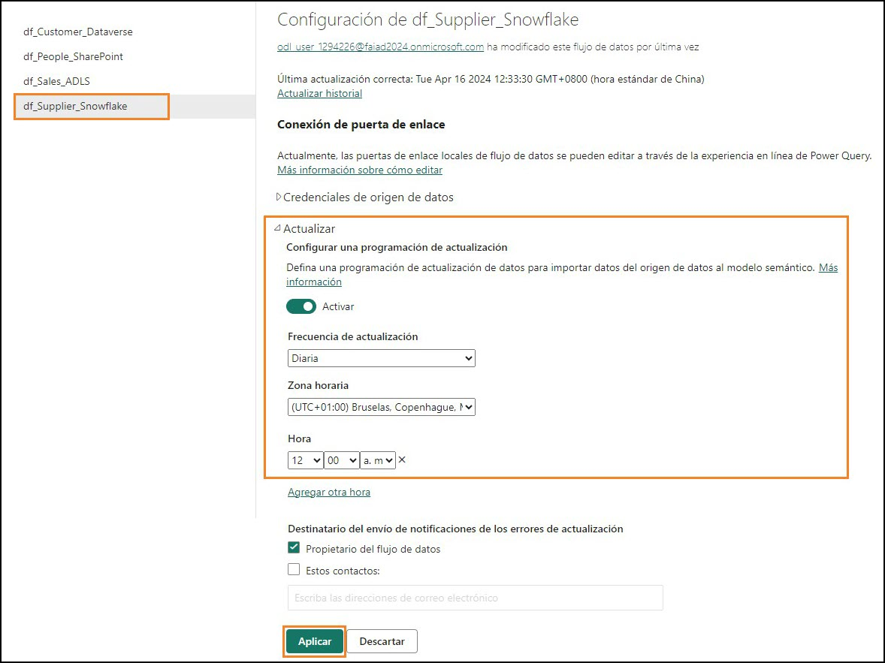

4. Dans le volet gauche, sélectionnez **df_Customer_Dataverse**.

5. Configurez la planification d’actualisation pour une actualisation quatre fois par jour : **à minuit, 6 h, midi et 18 h.**

6. Cliquez sur **Appliquer** pour enregistrer ce paramètre.
 
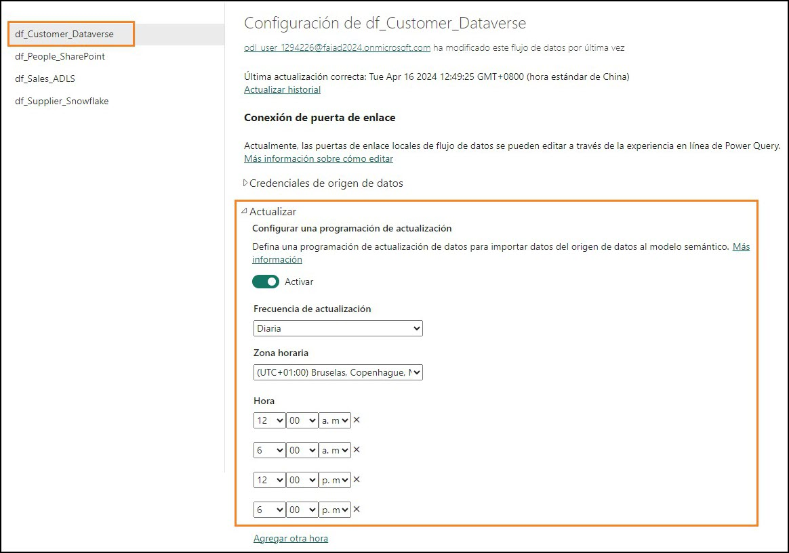

Comme indiqué précédemment, nous devons créer une logique personnalisée pour gérer le scénario dans lequel le fichier collaborateur dans SharePoint n’est pas livré à temps. Résolvons ce problème à l’aide d’un pipeline de données.

## Pipeline de données

### Tâche 3 : créer un pipeline de données
1. Sélectionnez l’icône du **sélecteur de l’expérience Fabric** en bas à gauche de votre écran.

2. La boîte de dialogue Microsoft Fabric s’ouvre alors. Cliquez sur **Data Factory**. Vous êtes alors redirigé vers la page d’accueil de Data Factory.

    

3. Dans le volet supérieur, cliquez sur **Pipeline de données** pour créer un pipeline.

4. La boîte de dialogue Nouveau pipeline s’ouvre alors. Nommez le pipeline **pl_Refresh_People_SharePoint**.
 
5. Cliquez sur **Créer**.

    

    Vous êtes alors redirigé vers la **page Pipeline de données**. Si vous avez utilisé Azure Data Factory, cet écran vous est familier. Présentons rapidement la disposition.

    Vous vous trouvez sur l’écran d’**Accueil**. Le menu supérieur comporte des options permettant
    d’ajouter les activités couramment utilisées : valider et exécuter un pipeline, et afficher l’historique d’exécution. De plus, le volet central comporte des options rapides permettant de commencer à créer le pipeline.

    

6. Dans le menu supérieur, cliquez sur **Activités**. Le menu comporte désormais une liste des activités couramment utilisées.
 
7. Cliquez sur les **points de suspension (…)** à droite dans le menu pour afficher toutes les autres activités disponibles. Nous allons utiliser certaines de ces activités dans le labo.

    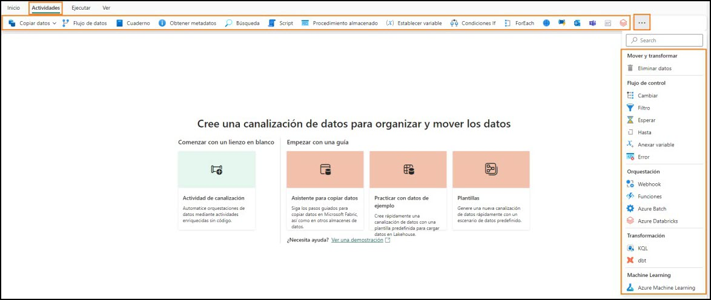

8. Dans le menu supérieur, cliquez sur **Exécuter**. Des options vous permettent d’exécuter et de planifier l’exécution du pipeline. Vous pouvez également afficher l’historique d’exécution à l’aide de l’option Afficher l’historique de l’exécution.

9. Dans le menu supérieur, cliquez sur **Affichage**. Ici, des options vous permettent d’afficher le code au format JSON. En outre, des options vous permettent de mettre en forme les activités.

**Remarque :** Si vous disposez d’un arrière-plan JSON à la fin du labo, n’hésitez pas à cliquer sur
Afficher le code JSON. Ici, notez que toute l’orchestration que vous effectuez à l’aide de la vue de conception peut également être écrite au format JSON.


### Tâche 4 : créer un pipeline de données simple
Commençons à créer le pipeline. Nous avons besoin d’une activité pour actualiser le flux de données. Trouvons une activité que nous pouvons utiliser.

1. Dans le menu supérieur, cliquez sur **Activités -> Flux de données**. L’activité Flux de données est alors ajoutée au volet de conception central. Notez que le volet inférieur comporte désormais des options de configuration de l’activité Flux de données.

2. Nous allons configurer l’activité pour se connecter à l’activité df_People_SharePoint. Dans le
**volet inférieur**, cliquez sur **Paramètres**.

3. Assurez-vous que le champ **Espace de travail** est défini sur votre espace de travail Fabric
**FAIAD_<username>**.

4. Dans la l**iste déroulante Flux de données**, sélectionnez **df_People_SharePoint**. Lorsque cette activité Flux de données est exécutée, elle va actualiser **df_People_SharePoint**. C’était facile, non ?

    **Remarque :** le paramètre Option de notification est actuellement grisé. Cette fonctionnalité sera activée prochainement. Vous pourrez configurer des notifications sur le succès et l’échec de cette activité.

    Dans notre scénario, les données collaborateur ne sont pas mises à jour dans les délais. Parfois, il y a un retard. Voyons si nous pouvons nous adapter à cela.
    
     

5. Dans le **volet inférieur**, cliquez sur **Général**. Donnons un nom et une description à l’activité.

6. Dans le champ **Nom**, saisissez **dfactivity_People_SharePoint**.

7. Dans le champ **Description**, saisissez **Dataflow activity to refresh df_People_Sharepoint dataflow**.

8. Notez qu’une option permet de désactiver une activité. Cette fonctionnalité est utile lors de tests ou d’un débogage. Laissez-la définie sur **Activé**.

9. Une option permet de définir le **Délai d’expiration**. Laissons la **valeur par défaut** telle quelle, ce qui devrait laisser suffisamment de temps au flux de données pour s’actualiser.

**Remarque :** si les données ne sont pas disponibles dans les délais, définissons l’activité afin qu’elle se réexécute toutes les 10 minutes, trois fois. Si elle échoue également à la troisième tentative, un échec est signalé.

10. Définissez le champ **Nombre de nouvelles tentatives** sur **3**.

11. Développer la section **Avancé**.

12. Définissez le champ **Intervalle de nouvelle tentative(s)** sur **600**.

13. Dans le menu, cliquez sur l’icône **Accueil -> Enregistrer** pour enregistrer le pipeline.

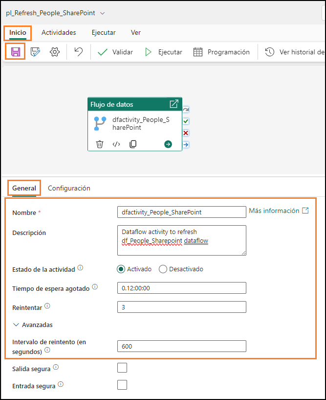 
 
Notez les avantages d’utiliser le pipeline de données par rapport à la définition du flux de données sur une actualisation planifiée (comme nous l’avons fait pour les flux de données précédents) :

- Le pipeline permet d’effectuer plusieurs tentatives avant l’échec de l’actualisation.

- Le pipeline permet d’effectuer une actualisation en quelques secondes, alors qu’avec le flux de données, l’actualisation planifiée a lieu toutes les 30 minutes.

### Tâche 5 : créer un pipeline de données
Ajoutons un peu plus de complexité à notre scénario. Nous avons remarqué que si les données ne sont pas disponibles à 9 h, elles le sont généralement sous cinq minutes. Si la fenêtre temporelle est manquée, le fichier est disponible sous 15 minutes. Nous souhaitons planifier les tentatives à cinq et 15 minutes. Voyons comment nous pouvons y parvenir en créant un pipeline de données.

1. Dans le panneau de gauche, cliquez sur **FAIAD_<username>** pour accéder à la page d’accueil de l’espace de travail.

2. Dans le menu supérieur, cliquez sur **Nouveau**, puis sélectionnez **Pipeline de données** dans la **liste déroulante**.

3. La boîte de dialogue Nouveau pipeline s’ouvre alors. **Nommez** le pipeline **pl_Refresh_People_SharePoint_Option2**.

4. Cliquez sur **Créer**.
 
    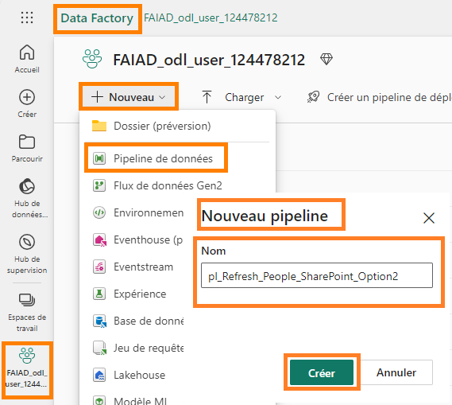

### Tâche 6 : créer une activité Until
1. Vous êtes alors redirigé vers l’écran Pipeline de données. Dans le menu, cliquez sur **Activités**.

2. Cliquez sur les **points de suspension (…)** à droite.

3. Dans la liste des activités, cliquez sur **Until**.

**Until :** activité permettant d’itérer jusqu’à ce qu’une condition soit remplie.

Dans notre scénario, nous allons itérer et actualiser le flux de données jusqu’à ce qu’il réussisse ou nous effectuons trois tentatives.

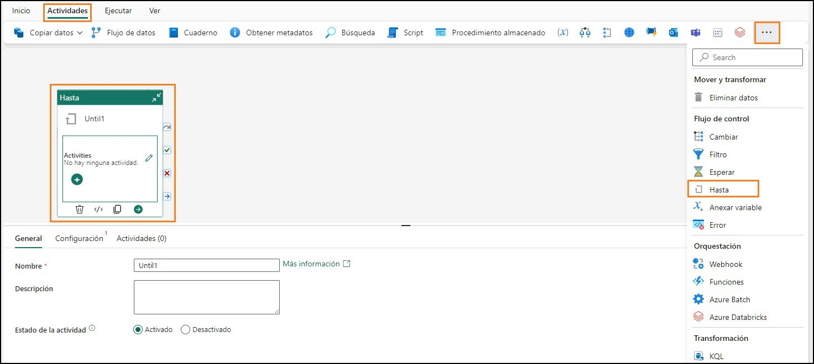

### Tâche 7 : créer des variables
1. Nous devons créer des variables permettant d’itérer et de définir le statut. Cliquez sur la **zone vide** dans le volet de conception du pipeline.

2. Notez que le menu dans le volet inférieur change. Cliquez sur **Variables**.

3. Cliquez sur **Nouveau** pour ajouter une nouvelle variable.

4. Notez qu’une ligne s’affiche. Saisissez **varCounter** dans la zone de texte **Nom**. Nous allons itérer trois fois à l’aide de cette variable.

5. Dans la **liste déroulante Type**, sélectionnez **Integer**.
6. Définissez le champ **Valeur par défaut** sur **0**.

    **Remarque :** nous ajoutons le préfixe var aux noms des variables, afin qu’il soit facile de les trouver, ce qui est une bonne pratique.

    

7. Cliquez sur **Nouveau** pour ajouter une autre nouvelle variable.
8. Notez qu’une ligne s’affiche. Saisissez **varTempCounter** dans la zone de texte **Nom**. Nous allons incrémenter la variable varCounter à l’aide de cette variable.
9. Dans la **liste déroulante Type**, sélectionnez **Integer**.
10. Définissez le champ **Valeur par défaut** sur **0**.
11. Procédez de même pour ajouter trois variables supplémentaires :

    a. **varIsSuccess** de type **String** avec la valeur par défaut **Non**. Cette variable permet d’indiquer si l’actualisation du flux de données a réussi.

    b. **varSuccess** de type **String** avec la valeur par défaut **Oui**. Cette variable permet de définir la valeur de varIsSuccess si l’actualisation du flux de données réussit.

    c. **varWaitTime** de type **Integer** avec la valeur par défaut **60**. Cette variable permet de définir le temps d’attente si l’actualisation du flux de données échoue (soit 5 minutes/300 secondes, soit 15 minutes/900 secondes).
 
### Tâche 8 : configurer l’activité Until
1. Sélectionnez l’activité **Jusqu’au**.
2. Dans le **volet inférieur**, cliquez sur **Général**.
3. Définissez le champ **Nom** sur **Iterator**.
4. Définissez le champ **Description** sur **Iterator to refresh dataflow. It will retry up to 3 times**.

    

5. Dans le volet inférieur, cliquez sur **Paramètres**.
6. Cliquez sur la zone de texte **Expression**. Dans cette zone de texte, nous devons saisir une expression renvoyant true ou false. L’activité Until itère lorsque cette expression renvoie false. Une fois que l’expression renvoie true, l’activité Until arrête l’itération.

7. Cliquez sur le lien **Ajouter du contenu dynamique** qui s’affiche sous la zone de texte.

    

    Nous devons écrire une expression qui s’exécute jusqu’à ce que la valeur de **varCounter soit 3** ou la valeur de **varIsSuccess soit Oui**. (varCounter et varIsSuccess sont les variables que nous venons de créer.)

8. La boîte de dialogue **Générateur d’expressions de pipeline** s’ouvre alors. Dans la moitié inférieure de la boîte de dialogue se trouve un menu :

    a. **Réglages :** constantes dans une fabrique de données qui peuvent être utilisées par un pipeline dans toute expression.
    
    b. **Variables système :** peuvent être utilisées dans des expressions lors de la définition d’entités au sein de l’un ou l’autre de ces services, par ex. ID du pipeline, nom du pipeline, nom du déclencheur, etc.

    c. **Fonctions :** vous pouvez appeler des fonctions dans des expressions. Les fonctions sont classées selon les catégories suivantes : Collection, Conversion, Date, Logique, Mathématique et Chaîne. Par ex., concat est une fonction Chaîne, add est une fonction Mathématique, etc.

    d. **Variables**: les variables de pipeline sont des valeurs qui peuvent être définies et modifiées lors de l’exécution d’un pipeline. Contrairement aux paramètres de pipeline, qui sont définis au niveau du pipeline et ne peuvent pas être modifiés pendant l’exécution d’un pipeline, les variables de pipeline peuvent être définies et modifiées dans un pipeline à l’aide d’une activité Définir une variable. Nous allons prochainement utiliser l’activité Définir une variable.

    

9. Cliquez sur **Fonctions** dans le menu inférieur.
10. Dans la section **Logical Fonctions**, sélectionnez la fonction **or**. Notez que la mention **@or()** est ajoutée à la zone de texte de l’expression dynamique. La fonction or utilise deux paramètres et nous travaillons sur le premier.
 
    

11. Placez le curseur **entre les parenthèses** de la fonction **@or**.
12. Dans la section **Logical Fonctions**, sélectionnez la fonction **equals**. Notez que cette mention est ajoutée à la zone de texte de l’expression dynamique.

    **Remarque :** Votre fonction devrait ressembler à **@or(equals())**. La fonction equals utilise également deux paramètres. Nous allons vérifier si la variable varCounter est égale à 3.

     
 
13. À présent, placez le curseur **entre les parenthèses** de la fonction **@equals** pour ajouter les paramètres.
14. Dans le menu inférieur, cliquez sur **Variables**.
15. Sélectionnez la variable **varCounter** qui sera le premier paramètre.
16. Saisissez **3** comme deuxième paramètre de la fonction equals. Comme dans la capture d’écran ci- dessous, votre expression est **@or(equals(variables('varCounter'),3))**.

    

17. Nous devons ajouter le deuxième paramètre à la fonction or. **Ajoutez une virgule** entre les deux parenthèses finales. Cette fois-ci, nous allons essayer de saisir le nom de la fonction. Commencez à taper **equ** et vous obtenez une liste déroulante des fonctions disponibles. (Il s’agit de ce que l’on appelle IntelliSense.) Sélectionnez la fonction **equals**.

    

18. Le premier paramètre de la fonction equals est une variable. Placez le **curseur avant la virgule**.
19. Commencez à taper **variables(**.
20. À l’aide d’IntelliSense, sélectionnez **variables('varIsSuccess')**.
21. Après la virgule, saisissons le deuxième paramètre. Commencez à taper **variables(**.
22. À l’aide d’IntelliSense, sélectionnez **variables('varSuccess')**. Ici, nous comparons la valeur de varIsSuccess à la valeur de varSuccess. (varSuccess est définie par défaut sur Oui.)

    

23. Votre expression devrait être :
**@or(equals(variables('varCounter'),3),equals(variables('varIsSuccess'), variables('varSuccess')))**
 
24. Cliquez sur **OK**.

    

### Tâche 9 : configurer l’activité Flux de données
1. Vous êtes alors redirigé vers l’écran de conception. Une fois l’activité **Until** sélectionnée, cliquez sur **Activités** dans le **volet inférieur**. Nous allons maintenant ajouter les activités à exécuter.
2. Cliquez sur l’icône **Modifier** sur la première ligne. Vous êtes alors redirigé vers l’écran de conception d’un itérateur vide.

    
 
3. Dans le menu supérieur, cliquez sur **Activités -> Flux de données**. L’activité Flux de données est alors ajoutée au volet de conception.
4. Une fois l’activité **Flux de données** sélectionnée, cliquez sur **Général** dans le volet inférieur. Donnons un nom et une description à l’activité.
5. Dans le champ **Nom**, saisissez **dfactivity_People_SharePoint**.
6. Dans le champ **Description**, saisissez **Dataflow activity to refresh df_People_Sharepoint dataflow**.

    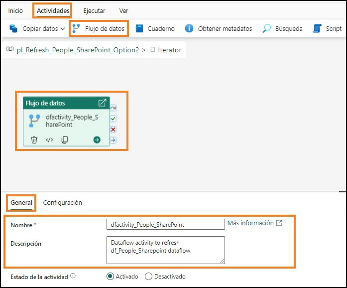

7. Cliquez sur **Paramètres** dans le volet inférieur.

8. Assurez-vous que le champ **Espace de travail** est défini sur votre espace de travail **FAIAD_<username>**.

9. Dans la **liste déroulante Flux de données**, sélectionnez **df_People_SharePoint**. Lorsque cette activité Flux de données est exécutée, elle va actualiser **df_People_SharePoint**.

    

### Tâche 10 : configurer une 1re activité Définir une variable
Nous avons configuré l’activité Flux de données comme nous l’avons fait plus tôt dans le labo. Nous allons maintenant ajouter une nouvelle logique. Si l’actualisation du flux de données réussit, nous devons quitter l’itérateur Until. N’oubliez pas que l’une des conditions pour quitter l’itérateur consiste à définir la valeur de la variable varIsSuccess sur Oui.
1. Dans le menu supérieur, cliquez sur A**ctivités -> Définir une variable**. L’activité Définir une variable est alors ajoutée au canevas de conception.
2. Une fois l’activité **Définir une variable** sélectionnée, cliquez sur **Général** dans le volet inférieur. Donnons un nom et une description à l’activité.
 
3. Dans le champ **Nom**, saisissez **set_varIsSuccess**.
4. Dans le champ **Description**, saisissez **Set variable varIsSuccess** to Yes.

    **Remarque :** survolez l’**activité Flux de données**. À droite de la zone de l’activité se trouvent quatre icônes. Elles permettent de se connecter à l’activité suivante en fonction du résultat de l’activité :

    a. L’icône représentant une **flèche incurvée grise** permet d’ignorer l’activité.

    b. L’icône représentant une **coche verte** est utilisée en cas de réussite de l’activité.

    c. L’icône représentant une **croix rouge** est utilisée en cas d’échec de l’activité.

    d. L’icône représentant une **flèche droite bleue** est utilisée à la fin de l’activité.

5. Cliquez sur la **coche verte** de l’activité Flux de données dfactivity_People_SharePoint et faites-la glisser pour vous connecter à la **nouvelle activité Définir une variable set_varIsSuccess**. Ainsi, en cas de succès de l’actualisation du flux de données, nous souhaitons exécuter l’activité Définir une variable.

    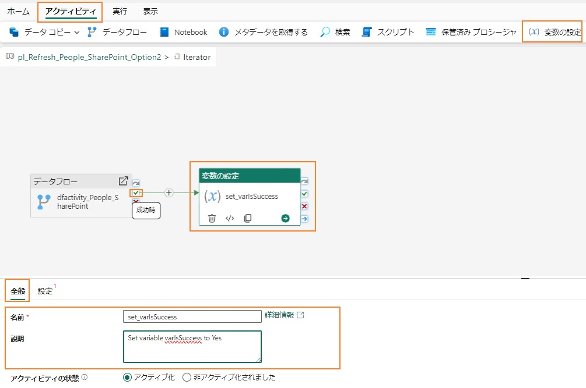

6. Une fois l’activité **Définir une variable** sélectionnée, cliquez sur **Paramètres** dans le menu inférieur.
7. Dans le volet inférieur, assurez-vous que le paramètre **Type de variable** est défini sur **Variable de pipeline**.
8. Dans le champ **Nom**, sélectionnez **varIsSuccess**. Il s’agit de la variable dont nous allons définir la valeur.
9. Dans le champ **Valeur**, cliquez sur la **zone de texte**. Cliquez sur le lien **Ajouter du contenu dynamique**.

    
 
10. La boîte de dialogue Générateur d’expressions de pipeline s’ouvre alors. Cliquez sur la zone de texte **Ajoutez du contenu dynamique ci-dessous en utilisant n’importe quelle combinaison d’expressions, de fonctions et de variables système**.

11. Dans le menu inférieur, cliquez sur V**ariables -> varSuccess**. Notez que la mention
@variables('varSuccess') est saisie dans la zone de texte Ajoutez du contenu dynamique ci- dessous. N’oubliez pas que lorsque nous avons créé des variables, nous avions prédéfini la valeur de la variable varSuccess sur Oui. Nous attribuons donc la valeur Oui à la variable varIsSuccess.
12. Cliquez sur **OK**. Vous êtes alors redirigé vers le **volet de conception de l’itérateur**.


Nous devons maintenant définir le compteur si l’activité Flux de données échoue. Dans le pipeline de données, nous ne pouvons pas auto-référencer une variable. Autrement dit, nous ne pouvons pas
incrémenter la variable de compteur varCounter en ajoutant un à sa valeur (varCounter = varCounter + 1). Nous utilisons donc la variable varTempCounter.
 
### Tâche 11 : configurer une 2e activité Définir une variable
1. Dans le menu supérieur, cliquez sur **Activités -> Définir une variable**. L’activité Définir une variable est alors ajoutée au canevas de conception.
2. Une fois l’activité **Définir une variable** sélectionnée, cliquez sur **Général** dans le volet inférieur. Donnons un nom et une description à l’activité.
3. Dans le champ **Nom**, saisissez **set_varTempCounter**.
4. Dans le champ **Description**, saisissez **Increment variable varTempCounter**.
5. Cliquez sur la **croix rouge** de l’activité Flux de données vers la nouvelle activité Définir une variable. Ainsi, en cas d’échec de l’actualisation du flux de données, nous souhaitons exécuter cette activité Définir une variable.

    

6. Une fois l’activité **Définir une variable** sélectionnée, cliquez sur **Paramètres** dans le menu inférieur.
7. Dans le volet inférieur, assurez-vous que le paramètre **Type de variable** est défini sur **Variable de pipeline**.
8. Dans le champ **Nom**, sélectionnez **varTempCounter**. Il s’agit de la variable dont nous allons définir la valeur.
9. Dans le champ **Valeur**, cliquez sur la **zone de texte**. Cliquez sur le lien Ajouter du contenu **dynamique**.
10. La boîte de dialogue Générateur d’expressions de pipeline s’ouvre alors. Saisissez **@add(variables('varCounter'),1)**

**Remarque :** n’hésitez pas à saisir cette expression, à sélectionner les fonctions à l’aide du menu ou à la copier-coller.
 
**Remarque :** cette fonction définit la valeur de la variable varTempCounter sur la valeur de la variable varCounter plus un (varTempCounter = varCounter + 1).


Nous devons maintenant définir la valeur de la variable varCounter sur la valeur de varTempCounter.


### Tâche 12 : configurer une 3e activité Définir une variable
1. Dans le menu supérieur, cliquez sur **Activités -> Définir une variable**. L’activité Définir une variable est alors ajoutée au canevas de conception.
2. Une fois l’activité **Définir une variable** sélectionnée, cliquez sur **Général** dans le volet inférieur. Donnons un nom et une description à l’activité.
3. Dans le champ **Nom**, saisissez **set_varCounter**.
4. Dans le champ **Description**, saisissez **Increment variable varCounter**.
5. Cliquez sur la **coche verte** de l’activité Définir une variable set_varTempCounter et faites-la glisser pour vous connecter à la nouvelle **activité Définir une variable set_varCounter**.
 
    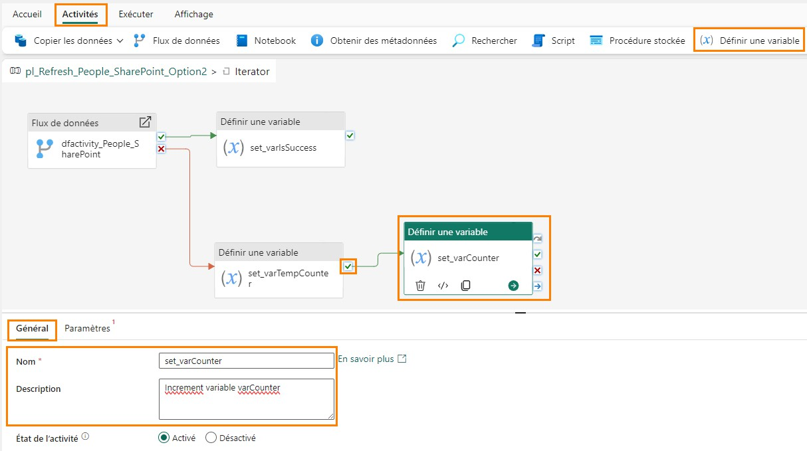

6. Une fois l’activité **Définir une variable set_varCounter** sélectionnée, cliquez sur **Paramètres** dans le menu inférieur.
7. Dans le volet inférieur, assurez-vous que le paramètre **Type de variable** est défini sur **Variable de pipeline**.
8. Dans le champ **Nom**, sélectionnez **varCounter**. Il s’agit de la variable dont nous allons définir la valeur.
9. Dans le champ **Valeur**, cliquez sur la **zone de texte**. Cliquez sur le lien **Ajouter du contenu dynamique**.
10. La boîte de dialogue Générateur d’expressions de pipeline s’ouvre alors. Saisissez **@variables('varTempCounter')**. N’hésitez pas à saisir cette expression, à sélectionner les fonctions à l’aide du menu ou à la copier-coller.

**Remarque :** cette fonction définit la valeur de la variable varCounter sur la valeur de la variable varTempCounter (varCounter = varTempCounter). À la fin de chaque itération, varCounter et varTempCounter ont la même valeur.


 
 
### Tâche 13 : configurer l’activité Attente
Ensuite, nous devons attendre 5 minutes/300 secondes si l’actualisation du flux de données échoue la première fois avant de réessayer. Si l’actualisation du flux de données échoue la seconde fois, nous devons attendre 15 minutes/900 secondes et réessayer. Nous allons définir le temps d’attente à l’aide de l’activité Attente et de la variable varWaitTime.

1. Dans le menu supérieur, cliquez sur **Activités -> points de suspension (…) -> Attente**. L’activité Attente est alors ajoutée au canevas de conception.
2. Une fois l’activité **Attente** sélectionnée, cliquez sur **Général** dans le volet inférieur. Donnons un nom et une description à l’activité.
3. Dans le champ **Nom**, saisissez **wait_onFailure**.
4. Dans le champ **Description**, saisissez **Wait for 300 seconds on 2nd try and 900 seconds on 3rd try**.
5. Cliquez sur la **coche verte** de l’activité Définir une variable set_varCounter et faites-la glisser pour vous connecter à la nouvelle **activité Attente wait_onFailure**.

    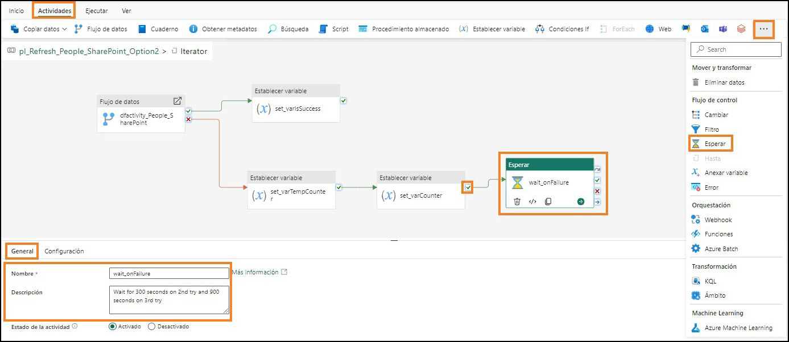

6. Une fois l’activité **Attente** sélectionnée, cliquez sur **Paramètres** dans le menu inférieur.
7. Dans le champ **Temps d’attente en secondes**, cliquez sur la **zone de texte**, puis sur le lien **Ajouter du contenu dynamique**.
8. La boîte de dialogue Générateur d’expressions de pipeline s’ouvre alors. Saisissez

    ```
    @if(
    greater(variables(‘varCounter’), 1),
    if(equals(variables(‘varCounter’), 2), mul(variables(‘varWaitTime’),15 ), mul(variables(‘varWaitTime’), 0)
    ),
    mul(variables(‘varWaitTime’),5 )
    )
    ```
N’hésitez pas à saisir cette expression, à sélectionner les fonctions à l’aide du menu ou à la copier-coller.

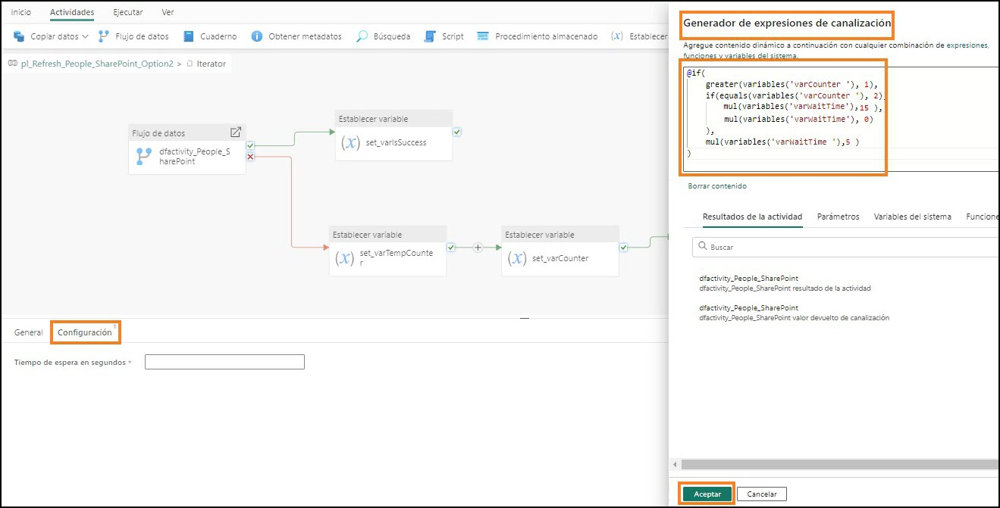

Nous utilisons ici deux nouvelles fonctions :

- **greater :** utilise deux nombres comme paramètres et compare lequel est le plus grand.
- **mul :** il s’agit d’une fonction de multiplication effectuant une multiplication à l’aide de deux paramètres.

L’expression est une instruction if imbriquée. Elle vérifie si la valeur de la variable varCounter est supérieure à 1. Si tel est le cas, elle vérifie si la valeur de la variable varCounter est 2. Si tel est le cas, elle définit le temps d’attente sur la valeur varWaitTime multipliée par 15. N’oubliez pas que nous avions défini par défaut la valeur de la variable varWaitTime sur 60. Le temps d’attente serait donc
60*15 = 900 secondes. Si la valeur de la variable varCounter n’est pas 2 (et donc supérieure à 2, ce qui signifie que l’actualisation du flux de données a échoué trois fois, que nous avons terminé
l’itération et que nous n’avons plus besoin d’attendre), le temps d’attente est défini sur varWaitTime * 0, soit 0. Si la valeur de la variable varCounter est 1, nous multiplions la valeur varWaitTime par 5. Le temps d’attente serait donc 60*5 = 300 secondes.

9. Cliquez sur **OK**.
 
    **Point de contrôle :** votre itérateur Until devrait ressembler à la capture d’écran ci-dessous.

    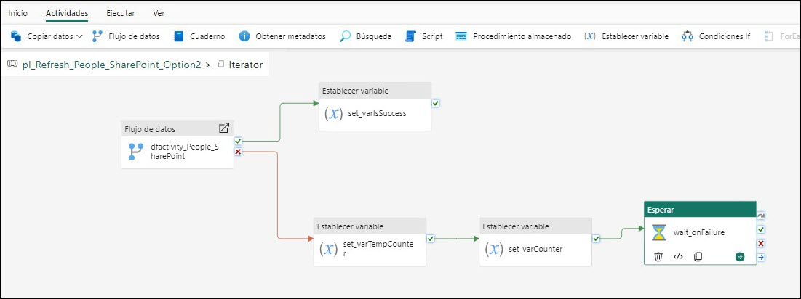

10. En haut du canevas de conception à gauche, cliquez sur **pl_Refresh_People_Sharepoint_Option2**
pour quitter l’itérateur Until.

    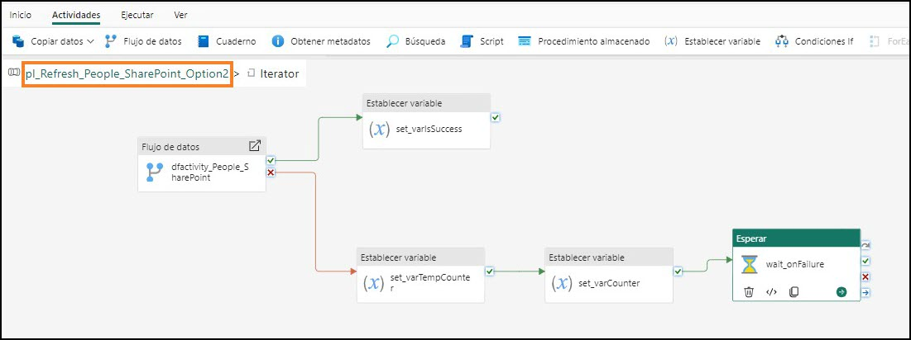

11. Nous avons fini de créer le pipeline de données. Dans le menu supérieur, cliquez sur l’icône **Accueil -> Enregistrer** pour enregistrer le pipeline de données.

    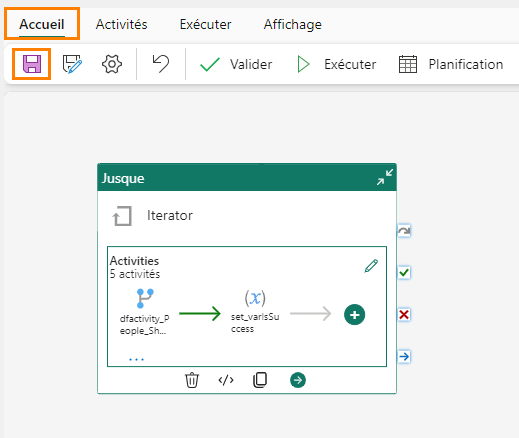
 
### Tâche 14 : configurer l’actualisation planifiée pour le pipeline de données
1. Nous pouvons tester le pipeline de données en cliquant sur **Accueil -> Exécuter**.

**Remarque :** l’actualisation du pipeline de données peut prendre quelques minutes. Il s’agit d’un environnement de formation, donc le fichier est toujours disponible dans SharePoint. Par conséquent, votre pipeline de données n’échoue jamais.

2. Nous pouvons définir le pipeline de données afin qu’il s’exécute selon une planification. Dans le menu supérieur, cliquez sur **Accueil -> Planifier**. La boîte de dialogue Planifier s’ouvre alors.
3. Réglez le bouton radio **Exécution planifiée** sur **Activé**.
4. Définissez la liste déroulante **Répéter** sur **Tous les jours**.
5. Définissez le champ **Heure** sur **9 h**.
6. Définissez le champ **Date et heure de début** sur **la date actuelle**.
7. Définissez le champ **Date et heure de fin** sur une **date future**.
8. Définissez votre **Fuseau horaire**.

**Remarque :** comme il s’agit d’un environnement de labo, vous pouvez définir le fuseau horaire sur votre fuseau horaire préféré. Dans un scénario réel, vous définissez le fuseau horaire en fonction de l’emplacement de votre source de données.

9. Cliquez sur **Appliquer**.
10. Cliquez sur le **X** en haut de la boîte de dialogue à droite pour la fermer.

    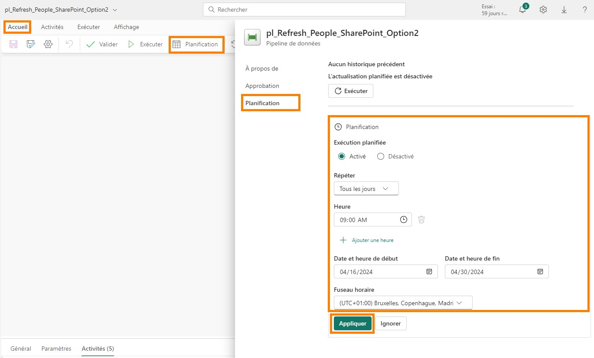

11. Sélectionnez votre espace de travail Fabric **FAIAD_<username>** dans le panneau de gauche pour accéder à l’espace de travail.

**Remarque :** sur l’écran Planifier, aucune option ne permet de notifier le succès ou l’échec (comme Planification de flux de données). La notification peut être effectuée en ajoutant une activité dans le pipeline de données. Nous ne le faisons pas dans ce labo, car il s’agit d’un environnement de labo.
Nous avons planifié des actualisations pour les différentes sources de données. Nous allons créer des relations et des mesures et effectuer d’autres activités de modélisation dans le prochain labo.
 
### Références
Fabric Analyst in a Day (FAIAD) vous présente certaines des fonctions clés de Microsoft Fabric. Dans le menu du service, la section Aide (?) comporte des liens vers d’excellentes ressources.

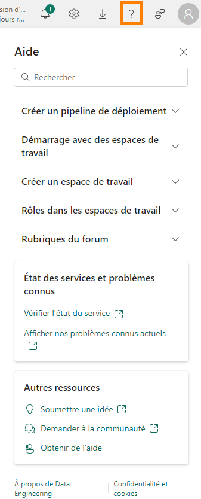

Voici quelques autres ressources qui vous aideront lors de vos prochaines étapes avec Microsoft Fabric :
- Consultez le billet de blog pour lire l’intégralité de l’[annonce de la GA de Microsoft Fabric](https://aka.ms/Fabric-Hero-Blog-Ignite23).
- Explorez Fabric grâce à la [visite guidée](https://aka.ms/Fabric-GuidedTour).
- Inscrivez-vous pour bénéficier d’un [essai gratuit de Microsoft Fabric](https://aka.ms/try-fabric).
- Rendez-vous sur le [site web Microsoft Fabric](https://aka.ms/microsoft-fabric).
- Acquérez de nouvelles compétences en explorant les [modules d’apprentissage Fabric](https://aka.ms/learn-fabric).
- Explorez la [documentation technique Fabric](https://aka.ms/fabric-docs).
- Lisez le [livre électronique gratuit sur la prise en main de Fabric](https://aka.ms/fabric-get-started-ebook).
- Rejoignez la [communauté Fabric](https://aka.ms/fabric-community) pour publier vos questions, partager vos commentaires et apprendre des autres.

Lisez les blogs d’annonces plus détaillés sur l’expérience Fabric :

- [Blog Expérience Data Factory dans Fabric](https://aka.ms/Fabric-Data-Factory-Blog)
- [Blog Expérience Synapse Data Engineering dans Fabric](https://aka.ms/Fabric-DE-Blog)
- [Blog Expérience Synapse Data Science dans Fabric](https://aka.ms/Fabric-DS-Blog)
- [Blog Expérience Synapse Data Warehousing dans Fabric](https://aka.ms/Fabric-DW-Blog)
- [Blog Expérience Synapse Real-Time Analytics dans Fabric](https://aka.ms/Fabric-RTA-Blog)
- [Blog Annonce Power BI](https://aka.ms/Fabric-PBI-Blog)
- [Blog Expérience Data Activator dans Fabric](https://aka.ms/Fabric-DA-Blog)
- [Blog Administration et gouvernance dans Fabric](https://aka.ms/Fabric-Admin-Gov-Blog)
- [Blog OneLake dans Fabric](https://aka.ms/Fabric-OneLake-Blog)
- [Blog Intégration de Dataverse et Microsoft Fabric](https://aka.ms/Dataverse-Fabric-Blog)


© 2023 Microsoft Corporation. Tous droits réservés.
En effectuant cette démonstration/ce labo, vous acceptez les conditions suivantes :

La technologie/fonctionnalité décrite dans cette démonstration/ces travaux pratiques est fournie par Microsoft Corporation en vue d’obtenir vos commentaires et de vous fournir une expérience d’apprentissage. Vous pouvez utiliser cette démonstration/ces ateliers uniquement pour évaluer ces technologies et fonctionnalités, et pour fournir des commentaires à Microsoft. Vous ne pouvez pas l’utiliser à d’autres fins. Vous ne pouvez pas modifier, copier, distribuer, transmettre, afficher, effectuer, reproduire, publier, accorder une licence, créer des œuvres dérivées, transférer ou vendre tout ou une partie de cette démonstration/ces ateliers.

LA COPIE OU LA REPRODUCTION DE CETTE DÉMONSTRATION/CES TRAVAUX PRATIQUES (OU DE TOUTE PARTIE DE CEUX-CI) SUR TOUT AUTRE SERVEUR OU AUTRE EMPLACEMENT EN VUE D’UNE AUTRE REPRODUCTION OU REDISTRIBUTION EST EXPRESSÉMENT INTERDITE.
CETTE DÉMONSTRATION/CES TRAVAUX PRATIQUES FOURNISSENT CERTAINES FONCTIONNALITÉS DE PRODUIT/TECHNOLOGIES LOGICIELLES, NOTAMMENT D’ÉVENTUELS NOUVEAUX CONCEPTS ET FONCTIONNALITÉS, DANS UN ENVIRONNEMENT SIMULÉ SANS INSTALLATION OU CONFIGURATION
COMPLEXE AUX FINS DÉCRITES CI-DESSUS. LES TECHNOLOGIES/CONCEPTS REPRÉSENTÉS DANS CETTE DÉMONSTRATION/CES TRAVAUX PRATIQUES PEUVENT NE PAS REPRÉSENTER LES FONCTIONNALITÉS COMPLÈTES ET PEUVENT NE PAS FONCTIONNER DE LA MÊME MANIÈRE QUE DANS UNE VERSION FINALE. IL EST ÉGALEMENT POSSIBLE QUE NOUS NE PUBLIIONS PAS DE VERSION FINALE DE CES FONCTIONNALITÉS OU CONCEPTS. VOTRE EXPÉRIENCE D’UTILISATION DE CES FONCTIONNALITÉS DANS UN ENVIRONNEMENT PHYSIQUE PEUT ÉGALEMENT ÊTRE DIFFÉRENTE.

**COMMENTAIRES.** Si vous envoyez des commentaires sur les fonctionnalités, technologies et/ou concepts décrits dans ces ateliers/cette démonstration à Microsoft, vous accordez à Microsoft, sans frais, le droit d’utiliser, de partager et de commercialiser vos commentaires de quelque
manière et à quelque fin que ce soit. Vous accordez également à des tiers, sans frais, les droits de brevet nécessaires pour leurs produits, technologies et services en vue de l’utilisation ou
de l’interface avec des parties spécifiques d’un logiciel ou d’un service Microsoft incluant les commentaires. Vous n’enverrez pas de commentaires soumis à une licence exigeant que
Microsoft accorde une licence pour son logiciel ou sa documentation à des tiers du fait que nous y incluons vos commentaires. Ces droits survivent à ce contrat.

MICROSOFT CORPORATION DÉCLINE TOUTES LES GARANTIES ET CONDITIONS EN CE
QUI CONCERNE CETTE DÉMONSTRATION/CES TRAVAUX PRATIQUES, Y COMPRIS TOUTES LES GARANTIES ET CONDITIONS DE QUALITÉ MARCHANDE, QU’ELLES SOIENT EXPLICITES,
IMPLICITES OU LÉGALES, D’ADÉQUATION À UN USAGE PARTICULIER, DE TITRE ET D’ABSENCE
DE CONTREFAÇON. MICROSOFT N’OFFRE AUCUNE GARANTIE OU REPRÉSENTATION EN CE QUI CONCERNE LA PRÉCISION DES RÉSULTATS, LA CONSÉQUENCE QUI DÉCOULE DE L’UTILISATION
DE CETTE DÉMONSTRATION/CES ATELIERS, OU L’ADÉQUATION DES INFORMATIONS CONTENUES DANS CETTE DÉMONSTRATION/CES ATELIERS À QUELQUE FIN QUE CE SOIT.
 
**CLAUSE D’EXCLUSION DE RESPONSABILITÉ**
Cette démonstration/Ce labo comporte seulement une partie des nouvelles fonctionnalités et améliorations disponibles dans Microsoft Power BI. Certaines fonctionnalités sont susceptibles
de changer dans les versions ultérieures du produit. Dans ce labo/cette démonstration, vous allez découvrir comment utiliser certaines nouvelles fonctionnalités, mais pas toutes.

