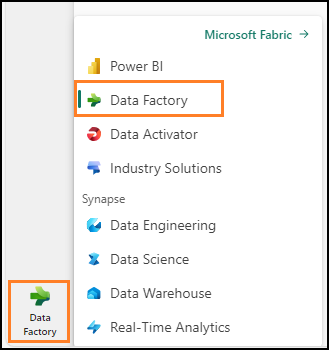
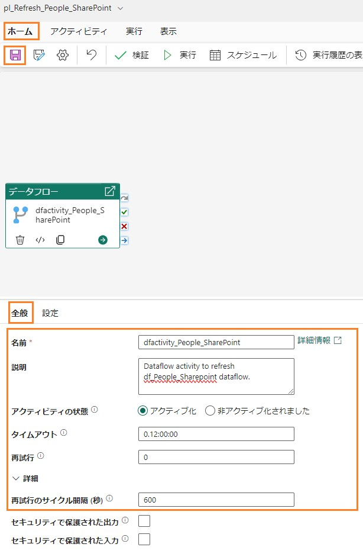
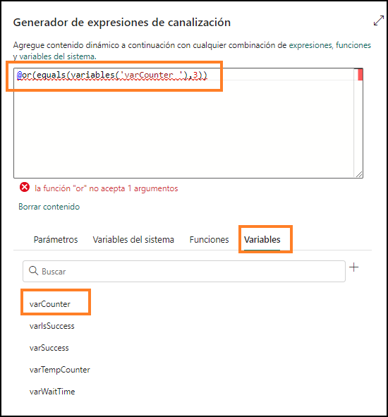
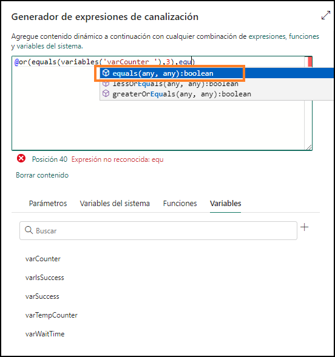
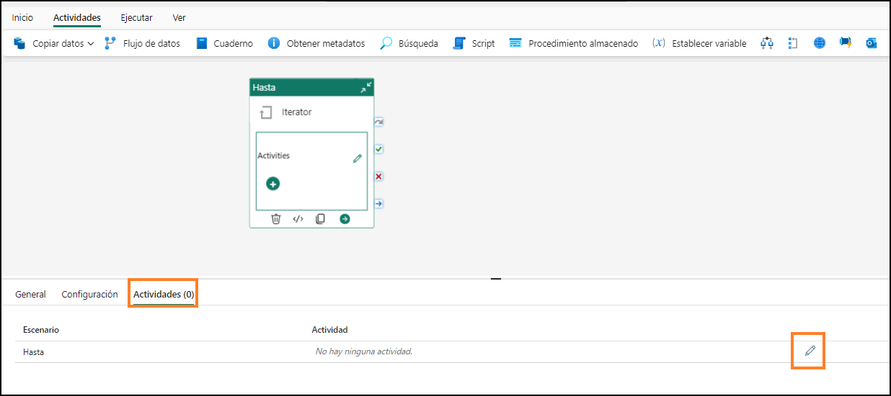
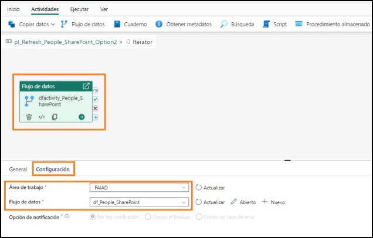
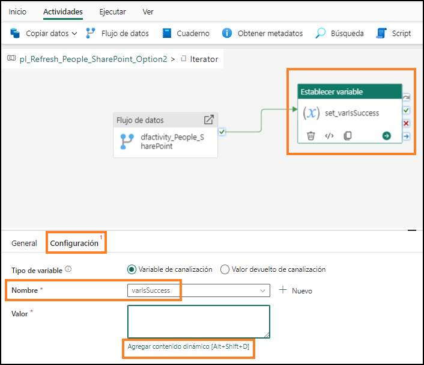
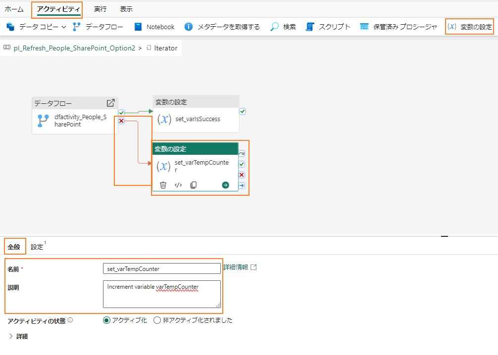
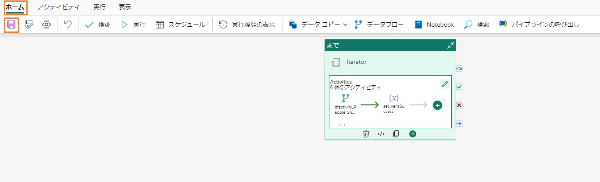
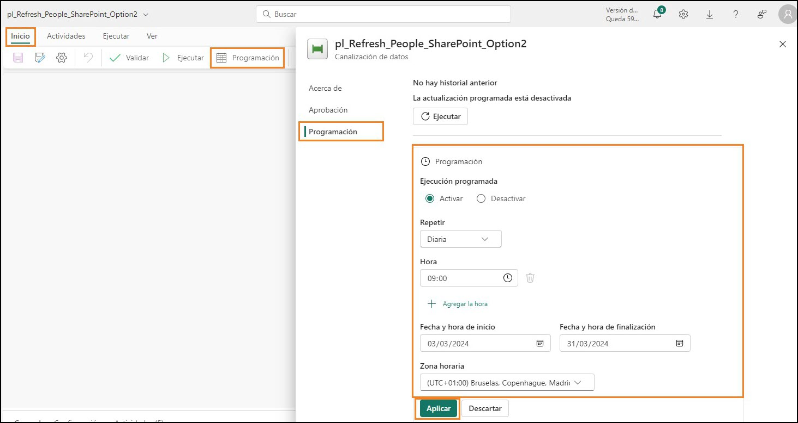

	
 	 
 
# 目次
概要	3 
Dataflow Gen2	3 
タスク 1: Sales データフローのスケジュールされた更新を構成する	3 
タスク 2: Supplier と Customer データフローのスケジュールされた更新を構成する	7 
データ パイプライン	9 
タスク 3: データパイプラインを作成する	9 
タスク 4: シンプルなデータパイプラインを構築する	11 
タスク 5: 新しいデータ パイプラインを作成する	14 
タスク 6: Until アクティビティを作成する	15 
タスク 7: 変数を作成する	15 
タスク 8: Until アクティビティを構成する	17 
タスク 9: データフローアクティビティを構成する	22 
タスク 10: 最初の変数の設定アクティビティを構成する	24 
タスク 11: 2 番目の変数の設定アクティビティを構成する	27 
タスク 12: 3 番目の変数の設定アクティビティを構成する	28 
タスク 13: Wait アクティビティを構成する	30 
タスク 14: データ パイプラインのスケジュールされた更新を構成する	34 
リファレンス	36 

 
# 概要

さまざまなデータ ソースから Lakehouse にデータを取り込みました。このラボでは、データソースの更新スケジュールを設定します。要件を要約しておきましょう。
- 販売データ: ADLS  で、毎日正午 (午後 0  時) に更新されます。
- 仕入先データ: Snowflake で、毎日真夜中 (午前 0 時) に更新されます。
- 顧客データ: Dataverse で、常に最新の状態です。1 日に 4 回更新する必要があります
  (真夜中(午前 0 時)、午前 6 時、正午(午後 0 時)、午後 6 時)。
- 従業員データ: SharePoint で、毎日午前 9 時に更新されます。ただし、5 分から 15 分の遅延が発生する場合があることを確認しています。これに対応できるように更新スケジュールを作成する必要があります。

  このラボを終了すると、次のことが学べます。

- Dataflow Gen2 のスケジュールされた更新を構成する方法
- データ パイプラインを作成する方法
- データ パイプラインのスケジュールされた更新を構成する方法

## Dataflow Gen2
## タスク 1: Sales データフローのスケジュールされた更新を構成する
まず、Sales データフローのスケジュールされた更新を構成しましょう。

1.	ラボ2 のタスク9 で作成したFabric ワークスペースFAIAD_<ユーザー名> に戻りましょう。

2.	作成したすべてのアーティファクトがここに一覧表示されています。画面右側にある検索ボックスに、df と入力します。これにより、アーティファクトがデータフローに絞り込まれます。
 
     

3.	df_Sales_ADLS 行の上にマウスを置きます。見慣れた更新アイコンとスケジュールされている更新アイコンが表示されます。省略記号 (…) を選択します。

4.	データフローを削除、編集、エクスポートするオプションがあることがわかります。[プ
 
     

    ロパティ]  を使用して、データフローの名前と説明を更新することができます。[更新履歴] については後ほど見ていきます。設定を選択します。
    注: 設定ページが開きます。左パネルには、すべてのデータフローが一覧表示されます。

5.	中央のペインで、更新履歴のリンクを選択します。
 
      

 
6.	[更新履歴] ダイアログが開きます。更新が 2 件表示されます。それらは、データフローを公開するときに発生した更新です。開始時刻のリンクを選択します。
    注: 開始時間はお客様によって異なります。
 
      

    [詳細] 画面が開きます。開始時刻、終了時刻、期間など、更新の詳細情報を確認できます。また、更新されたテーブルとアクティビティも一覧表示されます。失敗が発生した場合は、 テーブルやアクティビティの名前をクリックしてさらに調査できます。
 
      
 
7.	右上隅の X をクリックして、他の場所に移動しましょう。データフローの設定ページに戻ります。

8.	[ゲートウェイ接続] の下にあるデータソースの資格情報を展開します。データフローで使用される接続の一覧が表示されます。この場合は、Lakehouse とADLS です。
    a.	Lakehouse: データフローからデータを取り込むための接続です。
    b.	ADLS: ADLS ソース データへの接続です。
 
      

9.	更新を展開します。

10.	更新スケジュールを構成するスライダーをオンに設定します。

11.	更新頻度ドロップダウンを毎日に設定します。[毎週] に設定するオプションもあることに注意してください。

12.	タイム ゾーンを優先するタイム ゾーンに設定します。

注:  これはラボ環境であるため、タイムゾーンは優先するタイムゾーンに設定できます。実際のシナリオでは、データソースの場所に基づいてタイムゾーンを設定します。

13.	別の時刻を追加のリンクをクリックします。時刻オプションが表示されます。

14.	時刻を正午に設定します。1 時間または 30 分単位で更新を設定できることがわかります。

15.	適用を選択してこの設定を保存します。
    注: [別の時刻を追加] リンクをクリックすると、複数の更新時刻を追加できます。
 
    データフロー所有者や他の連絡先に失敗の通知を送信することもできます。
 
      

## タスク 2: Supplier と Customer データフローのスケジュールされた更新を構成する
1.	左パネルで、df_Supplier_Snowflake を選択します。

2.	毎日真夜中(午前 0 時) に更新するように更新スケジュールを構成します。

3.	適用を選択してこの設定を保存します。
 
      

4.	左パネルで、df_Customer_Dataverse を選択します。

5.	1 日 4 回で更新スケジュールを構成します (真夜中(午前 0  時)、午前 6 時、正午 (午後0 時)、午後 6 時)。

6.	適用を選択してこの設定を保存します。
 
      

    前述したように、SharePoint の従業員ファイルが時間どおりに提供されないシナリオを処理するカスタム ロジックを構築する必要があります。データ パイプラインを使ってこれを解決しましょう。
 
# データパイプライン
## タスク 3: データパイプラインを作成する
1.	画面の左下の Fabric エクスペリエンスセレクター アイコンを選択します。

2.	[Microsoft Fabric] ダイアログが開きます。Data Factory を選択します。Data Factory のホームページに移動します。
 
      

3.	上部パネルからデータ   パイプラインを選択して、新しいパイプラインを作成します。

4.	[新しいパイプライン] ダイアログが開きます。パイプラインに
    pl_Refresh_People_SharePoint という名前を付けます

5.	作成を選択します。
 
      
 
    データ パイプラインページに移動します。Azure Data Factory を使用したことがある場合は、この画面に見覚えがあるはずです。レイアウトの概要を簡単に確認してみましょう。
    ホーム画面が表示されています。上部メニューを見ると、よく使うアクティビティ (パイプラインの検証、実行、実行履歴の表示) を追加するオプションがあります。また、中央ペイ
    ンには、パイプラインの構築を開始するためのクイック  オプションがあります。
 
      

6.	上部メニューから、アクティビティを選択します。これで、メニューによく使うアク ティビティのリストが表示されます。

7.	メニューの右側にある省略記号 (…) を選択すると、他の利用可能なアクティビティがすべて表示されます。これらのアクティビティのいくつかをラボで使用します。
 
      
  	
9.	上部メニューの実行をクリックします。パイプライン実行を実行およびスケジュールす るためのオプションが表示されます。[実行履歴を表示する] を使って実行履歴を確認す
    るオプションもあります。
 
10.	上部メニューから、表示を選択します。ここには、コードを JSON 形式で表示するオプションがあります。アクティビティを書式設定するオプションもあります。
    注: ラボの最後に JSON の予備知識をお持ちの場合は、自由に [JSON コードを表示する] を選択してください。ここでわかるように、デザインビューを使って実行しているすべての
    オーケストレーションを、JSON で記述することもできます。
 
     
  	

## タスク 4: シンプルなデータパイプラインを構築する
パイプラインの構築を始めましょう。データフローを更新するアクティビティが必要です。 使えるアクティビティを探してみましょう。
1.	上部メニューから、アクティビティ -> データフローを選択します。データフロー アクティビティが中央デザイン ペインに追加されます。下部ペインにデータフロー アクティビティの構成オプションが表示されることに注目してください。

2.	このアクティビティを構成して、df_People_SharePoint    アクティビティと接続します。
    下部ペインから、設定を選択します。

3.	ワークスペースがご自身の Fabric ワークスペース FAIAD_<ユーザー名> に設定されていることを確認します。

4.	データフロードロップダウンから、df_People_SharePoint を選択します。このデータフローアクティビティを実行すると、df_People_SharePoint が更新されます。簡単ですね。 
    注:  現在、通知オプションはグレー表示になっています。この機能は間もなく有効になる予定です。このアクティビティの成功と失敗に関する通知を設定できるようになります。
 
    このシナリオでは、従業員データがスケジュールどおりに更新されません。遅延が発生する ことがあります。これに対応できるかどうか見てみましょう。
 
     
  	
5.	下部ペインから、全般を選択します。アクティビティの名前と説明を指定しましょう。

6.	名前フィールドに dfactivity_People_SharePoint と入力します

7.	説明フィールドに Dataflow activity to refresh df_People_Sharepoint dataflow と入力します。

8.	アクティビティを非アクティブ化するオプションがあることに注意してください。この 機能は、テスト中やデバッグ中に役立ちます。アクティブ化のままにしておきます。

9.	タイムアウトを設定するオプションがあります。既定値はデータフローを更新するのに
    十分な時間なので、そのままにしておきます。
    注: データをスケジュールどおりに利用できない場合は、10 分ごとに 3 回再実行するようにアクティビティを設定しましょう。3 回目の試行でも失敗した場合は、失敗を報告します。
 
10.	再試行を 3 に設定します

11.	詳細セクションを展開します。

12.	再試行のサイクル間隔 (秒) を 600 に設定します。

13.	メニューからホーム ->  保存アイコンを選択して、パイプラインを保存します。
 
      
  	
(以前のデータフローで行ったように) スケジュールされた更新でデータフローを設定する場合と比較して、データ パイプラインを使用する利点に注目してください。
- パイプラインには、更新が失敗する前に複数回再試行するオプションが用意され ています。
- パイプラインでは数秒以内に更新することができますが、データフローのスケ ジュールされた更新は 30 分ごとです。
 
## タスク 5: 新しいデータパイプラインを作成する
シナリオをもう少し複雑にしてみましょう。午前9  時にデータを取得できない場合でも、通常
は5 分以内に取得できることがわかりました。その時間範囲を超えた場合は、ファイルを取得できるまでに15 分かかります。5 分と 15 分で再試行をスケジュールする必要があります。新しいデータパイプラインを作成して、これをどのように実現できるかを見てみましょう。

1.	左側のパネルで FAIAD_<ユーザー名> をクリックして、ワークスペースのホームに移動します。

2.	上部メニューから新規をクリックし、ドロップダウンからデータ  パイプラインをクリックします。

3.	[新しいパイプライン] ダイアログが開きます。パイプラインに
    pl_Refresh_People_SharePoint_Option2 という名前を付けます

4.	作成を選択します。
 
      
  	
 
## タスク 6: Until アクティビティを作成する
1.	データ  パイプライン画面に戻ります。メニューからアクティビティを選択します。

2.	右側の省略記号 (…) をクリックします。

3.	アクティビティ一覧から Until をクリックします。

    Until: ある条件が満たされるまで反復処理するために使うアクティビティです。
    
    今回のシナリオでは、成功するか 3  回試行するまで繰り返しデータフローを更新します。
 
      
  	

## タスク 7: 変数を作成する
1.	反復処理と状態の設定に使う変数を作成する必要があります。パイプライン デザインペインの空白領域を選択します。

2.	下部ペインのメニューが変化することに注目してください。変数を選択します。

3.	新規を選択して、新しい変数を追加します。

4.	行が表示されます。名前テキスト ボックスに varCounter と入力します。この変数を使って、反復処理を 3 回行います。

5.	種類ドロップダウンから Integer を選択します。

6.	既定値に 0 を入力します。
    注: 変数名の先頭に var を付けて見つけやすくしています。これは良い習慣です。
 
 
     
  	
7.	新規を選択して、別の新しい変数を追加します。

8.	行が表示されます。名前テキストボックスに varTempCounter と入力します。この変数を使ってvarCounter 変数を増分します。

9.	種類ドロップダウンから Integer を選択します。

10.	既定値に 0 を入力します。

11.	同様の手順に従って、さらに 3 つの変数を追加します。 
    a.	varIsSuccess: 種類は String、既定値は No に設定します。この変数を使って、データフローの更新が成功したかどうかを表します。 
    b.	varSuccess: 種類は String、既定値は Yes に設定します。データフローの更新が成功した場合、この変数を使って varIsSuccess の値を設定します。 
    c.	varWaitTime: 種類は Integer、既定値は 60 に設定します。この変数を使って、データフローが失敗した場合の待機時間を設定します。(5 分(300 秒) または 15 分(900 秒) のいずれかです。)  
 
## タスク 8: Until アクティビティを構成する
1.	Until アクティビティを選択します。

2.	下部ペインから、全般を選択します。

3.	名前に Iterator と入力します。

4.	説明に Iterator to refresh dataflow. It will retry up to 3 times と入力します。
 
     
  	
5.	下部ペインから、設定を選択します。

6.	式テキスト ボックスを選択します。このテキスト ボックスに、true または false と評価される式を入力する必要があります。Until アクティビティは、この式がfalse と評価さ
    れている間反復処理を行います。式が true と評価されると、Until アクティビティは反復を停止します。

7.	テキスト  ボックスの下に表示される動的なコンテンツの追加リンクを選択します。
 
     
  	 
次の条件が満たされるまで実行する式を記述する必要があります: varCounter の値が 3 であるか、varIsSuccess の値がYes である。(varCounter とvarIsSuccess は先ほど作成した変数です。)
8.	パイプライン式ビルダー  ダイアログが開きます。ダイアログの下半分にはメニューが表示されます。 
    a.	パラメーター: パイプラインの任意の式で使用できるデータ ファクトリ全体の定数です。 
    b.	システム変数: いずれかのサービス内でエンティティを定義するときに、これらの変数を式で使用できます。例: パイプラインID、パイプライン名、トリガー名
    など。 
    c.	関数: 式内で関数を呼び出すことができます。各関数は、コレクション、変換、日付、論理、数学、文字列の関数に分類されます。たとえば、concat  は文字列関数、add は数学関数です。 
    d.	変数: パイプライン変数は、パイプライン実行中に設定および変更できる値です。パイプライン レベルで定義され、パイプライン実行中に変更できないパイ
    プライン パラメーターとは異なり、パイプライン変数は、変数の設定アクティビティを使って、パイプライン内で設定および変更できます。この後すぐに変数 の設定アクティビティを使用します。 
 
    
  	
 
9.	下部メニューの関数をクリックします。

10.	Logical 関数セクションから、or 関数を選択します。動的な式テキスト ボックスに @or()
    が追加されるのがわかります。or 関数は 2 つのパラメーターを受け取ります。ここでは最初のパラメーターに取り組みます。
 
     
  	
11.	@or 関数のかっこの間にカーソルを置きます。

12.	Logical 関数セクションから、equals 関数を選択します。それが動的な式テキスト ボックスに追加されます。

    注: 関数は @or(equals()) のようになるはずです。equals 関数も 2 つのパラメーターを受け取ります。変数 varCounter が 3 に等しいかどうかを確認します。
 
     
  	 
 

13.	次に、@equals 関数のかっこの間にカーソルを置いて、パラメーターを追加します。

14.	下部メニューから、変数を選択します。

15.	最初のパラメーターとなる varCounter 変数を選択します。

16.	equals 関数の 2 番目のパラメーターとして 3 と入力します。以下のスクリーンショットのように、式は @or(equals(variables('varCounter'),3)) になります
 
     
  	 
17.	or 関数に 2 番目のパラメーターを追加する必要があります。最後の 2 つのかっこの間にコンマを追加します。今回は関数名を入力してみましょう。equ と入力し始めると、使用できる関数のドロップダウンが表示されます (IntelliSense と呼ばれます)。equals 関数
    を選択します。
 
     
  	
18.	equals 関数の最初のパラメーターは変数です。コンマの前にカーソルを置きます。

19.	variables( と入力を開始します

20.	IntelliSense の助けを借りて variables('varIsSuccess') を選択します

21.	コンマの後に 2 番目のパラメーターを入力しましょう。variables( と入力を開始します

22.	IntelliSense の助けを借りて variables('varSuccess') を選択します。ここでは、varIsSuccess の値とvarSuccess の値を比較しています。(varSuccess の既定値はYes です。)
 
     
  	
 
23.	式は次のようになるはずです。
    @or(equals(variables('varCounter'),3),equals(variables('varIsSuccess'), variables('varSuccess')))

24.	OK を選択します。
 
     
  	

## タスク 9: データフローアクティビティを構成する
1.	デザイン画面に戻ります。Until  アクティビティを選択した状態で、下部ペインからアクティビティを選択します。ここでは、実行する必要があるアクティビティを追加します。

2.	最初の行の編集アイコンを選択します。空白の反復処理デザイン画面に戻ります。
 
     
  	
 
3.	上部メニューから、アクティビティ -> データフローを選択します。データフロー アクティビティがデザイン ペインに追加されます。

4.	データフローアクティビティを選択した状態で、下部ペインで全般を選択します。アク ティビティの名前と説明を指定しましょう。

5.	名前フィールドに dfactivity_People_SharePoint と入力します

6.	説明フィールドに Dataflow activity to refresh df_People_Sharepoint dataflow と入力します。
 
     
  	
7.	下部ペインから設定を選択します。

8.	ワークスペースがご自身のワークスペース FAIAD_<ユーザー名> に設定されていることを確認します。

9.	データフロードロップダウンから、df_People_SharePoint を選択します。このデータフロー アクティビティを実行すると、df_People_SharePoint が更新されます。
 
      
  	
 
## タスク 10: 最初の変数の設定アクティビティを構成する
ラボで前に行ったように、データフロー  アクティビティを構成しました。次に、新しいロジックを追加します。データフローの更新が成功した場合は、Until の反復処理から抜ける必要があります。反復処理から抜ける条件の 1 つは、varIsSuccess 変数の値をYes に設定することだったことを思い出してください。
1.	上部メニューから、アクティビティ -> 変数の設定を選択します。変数の設定アクティビティがデザイン キャンバスに追加されます。

2.	変数の設定アクティビティを選択した状態で、下部ペインで全般を選択します。アク ティビティの名前と説明を指定しましょう。

3.	名前 フィールドに、set_varIsSuccess と入力します。

4.	説明フィールドに、Set variable varIsSuccess to Yes と入力します。
    注: データフローアクティビティの上にカーソルを合わせてください。アクティビティ ボックスの右側に 4 つのアイコンがあります。これらを使って、このアクティビティの結果に基づいて次のアクティビティに接続できます。
    a.	アクティビティをスキップするときは灰色の曲がった矢印アイコンを使います。
    b.	アクティビティの成功時は緑色のチェック マーク アイコンを使います。
    c.	アクティビティの失敗時は赤いx  マーク アイコンを使います。
    d.	アクティビティの完了時は青い真っすぐな矢印アイコンを使います。

5.	dfactivity_People_SharePoint データフロー アクティビティから緑色のチェック マークをクリックしてドラッグし、新しい set_varIsSuccess 変数の設定アクティビティに接続します。つまり、データフローの更新が成功したら、変数の設定アクティビテ     ィを実行します。
 
      
  	 
 

6.	変数の設定アクティビティを選択した状態で、下部メニューから設定をクリックします。

7.	下部ペインで、変数の種類がパイプライン変数であることを確認します。

8.	名前フィールドで、varIsSucces を選択します。この変数の値を設定します。

9.	値フィールドで、テキスト  ボックスを選択します。動的なコンテンツの追加リンクを選択します。
 
     
  	
 
10.	パイプライン式ビルダーダイアログが開きます。式、関数、システム変数の任意の組み 合わせを使用して以下に動的コンテンツを追加しますのテキスト領域を選択します。

11.	下部メニューから、変数 -> varSuccess を選択します。以下に動的コンテンツを追加しま
    すのテキスト領域に @variables('varSuccess') と入力されることがわかります。変数を作成したときに、varSuccess 変数の値をあらかじめ Yes に設定したことを思い出してください。そのため、Yes の値がvarIsSuccess 変数に代入されます。

12.	OK を選択します。反復処理デザインペインに戻ります。
 
     
  	
    次に、データフローアクティビティが失敗した場合にカウンターを設定する必要があります。データパイプラインでは、変数を自己参照することはできません。つまり、カウンター変数 varCounter の値に 1 を加えて増分することはできません(varCounter = varCounter + 1)。そこで、varTempCounter 変数を利用します。
 
## タスク 11: 2 番目の変数の設定アクティビティを構成する
1.	上部メニューから、アクティビティ -> 変数の設定を選択します。変数の設定アクティビティがデザイン キャンバスに追加されます。

2.	変数の設定アクティビティを選択した状態で、下部ペインで全般を選択します。アク ティビティの名前と説明を指定しましょう。

3.	名前フィールドに、set_varTempCounter と入力します

4.	説明フィールドに、Increment variable varTempCounter と入力します。

5.	データフローアクティビティの赤いx マークをクリックして、新しい変数の設定アクティビティに接続します。つまり、データフローの更新が失敗したら、この変数の設定
    アクティビティを実行します。
 
      
  	
6.	変数の設定アクティビティを選択した状態で、下部メニューから設定を選択します。

7.	下部ペインで、変数の種類がパイプライン変数であることを確認します。

8.	名前フィールドで、varTempCounter を選択します。この変数の値を設定します。
 
9.	値フィールドで、テキスト  ボックスを選択します。動的なコンテンツの追加リンクを選択します。

10.	パイプライン式ビルダーダイアログが開きます。@add(variables('varCounter'),1) と入力します
    注: この式を入力しても、メニューを使って関数を選択しても、またはコピーして貼り付けても構いません。
    注: この関数は、変数 varTempCounter の値を、変数varCounter の値に 1 を加えたものに設定します (varTempCounter = varCounter + 1)。
 
      
  	
    次に、varCounter 変数の値をvarTempCounter の値に設定する必要があります。

## タスク 12: 3 番目の変数の設定アクティビティを構成する
1.	上部メニューから、アクティビティ -> 変数の設定を選択します。変数の設定アクティビティがデザイン キャンバスに追加されます。

2.	変数の設定アクティビティを選択した状態で、下部ペインで全般を選択します。アク ティビティの名前と説明を指定しましょう。

3.	名前フィールドに、set_varCounter と入力します。

4.	説明フィールドに、Increment variable varCounter と入力します。
 
5.	set_varTempCounter 変数の設定アクティビティから緑色のチェック マークをクリックしてドラッグし、新しい set_varCounter 変数の設定アクティビティに接続します。
 
     
  	
6.	set_varCounter 変数の設定アクティビティを選択した状態で、下部メニューから設定をクリックします。

7.	下部ペインで、変数の種類がパイプライン変数であることを確認します。

8.	名前フィールドで、varCounter を選択します。この変数の値を設定します。

9.	値フィールドで、テキスト  ボックスを選択します。動的なコンテンツの追加リンクを選択します。

10.	パイプライン式ビルダーダイアログが開きます。@variables('varTempCounter') と入力します。この式を入力しても、メニューを使って関数を選択しても、またはコピーして貼り付けても構いません。
 
    注: この関数は、変数varCounter の値を、変数varTempCounter の値に設定します(varCounter =
    varTempCounter)。各反復の終わりには、varCounter とvarTempCounter の両方が同じ値になります。
 
      
  	

## タスク 13: Wait アクティビティを構成する
次に、データフローの更新が初めて失敗した場合は、再試行する前に 5 分 (300 秒) 待機する必要があります。データフローの更新が 2 度目に失敗した場合は、15 分 (900 秒) 待機してから再試行する必要があります。Wait アクティビティと変数varWaitTime を使って待機時間を設定します。
1.	上部メニューから、アクティビティ -> 省略記号(…) -> Wait を選択します。Wait アクティビティがデザインキャンバスに追加されます。

2.	Wait  アクティビティを選択した状態で、下部ペインで全般を選択します。アクティビティの名前と説明を指定しましょう。

3.	名前フィールドに、wait_onFailure と入力します。

4.	説明フィールドに、Wait for 300 seconds on 2nd try and 900 seconds on 3rd try と入力します。
 
5.	set_varCounter 変数の設定アクティビティから緑色のチェック マークをクリックしてドラッグし、新しい wait_onFailure Wait アクティビティに接続します。
 
      
  	
6.	Wait アクティビティを選択した状態で、下部メニューから設定をクリックします。

7.	待機時間 (秒) フィールドで、テキスト ボックスを選択し、動的なコンテンツの追加リンクを選択します。

8.	パイプライン式ビルダーダイアログが開きます。以下を入力します
    @if(
    greater(variables('varCounter'), 1),
    if(equals(variables('varCounter'), 2), mul(variables('varWaitTime'),15 ), mul(variables('varWaitTime'), 0)
    ),
    mul(variables('varWaitTime'),5 )
    )

   この式を入力しても、メニューを使って関数を選択しても、またはコピーして貼り付けても 構いません。
 
    
  	
 
ここでは 2 つの新しい関数を使用しています。

- greater: 2 つの数値をパラメーターとして受け取り、どちらが大きいかを比較します。
- mul: これは乗算関数であり、乗算する 2 つのパラメーターを受け取ります。

この式は入れ子になった if ステートメントです。varCounter 変数の値が 1 より大きいかどうかをチェックします。true の場合は、varCounter 変数の値が 2 であるかどうかをチェックします。true の場合は、待機時間を varWaitTime の 15 倍に設定します。varWaitTime の既定値を 60 に設定したことを思い出してください。これは 60*15 = 900 秒になります。varCounter 変数の値が 2 でない場合 (2 より大きい場合、つまりデータフローの更新が 3 回失敗したことを意味し、反復処理は終了です。もう待機する必要はありません)、待機時間をvarWaitTime * 0 に設定します。つまり、0 です。varCounter 変数の値が 1 の場合、varWaitTime に 5 を掛けます。これは 60*5 = 300 秒になります。

9.	OK を選択します。
    チェックポイント: Until 反復処理は下のスクリーンショットのようになっているはずです。
 
      
  	 
 

10.	デザイン キャンバスの左上で pl_Refresh_People_Sharepoint_Option2 を選択して、Until 反復処理から移動します。
 
      
  	
11.	これで、データ パイプラインの作成が完了しました。上部メニューからホーム -> 保存アイコンを選択して、データ パイプラインを保存します。
 
      
  	
 
## タスク 14:  データパイプラインのスケジュールされた更新を構成する
1.	データ パイプラインをテストするには、ホーム -> 実行を選択します。
    注: データ パイプラインの更新が完了するまでに数分かかる場合があります。これはトレーニング環境であるため、SharePoint のファイルは常に利用可能です。したがって、データ パイプラインが失敗することはありません。

2.	スケジュールに従って実行するようにデータパイプラインを設定できます。上部メニュー から、ホーム-> スケジュールを選択します。[スケジュール] ダイアログが開きます。

3.	スケジュールされた実行のラジオ ボタンをオンに設定します。

4.	繰り返しドロップダウンを毎日に設定します。

5.	時刻を午前 9 時に設定します。

6.	開始日時を今日に設定します。

7.	終了日時を将来の日付に設定します。

8.	タイム ゾーンを設定します。

    注:  これはラボ環境であるため、タイムゾーンは優先するタイムゾーンに設定できます。実際のシナリオでは、データ ソースの場所に基づいてタイム ゾーンを設定します。

9.	適用を選択します。

10.	ダイアログの右上の X マークを選択して、閉じます。
 
      
  	 
11.	左側のパネルで Fabric ワークスペース FAIAD_<ユーザー名> を選択して、ワークスペースに移動します。
    注: [スケジュール] 画面には、(データフローのスケジュールのように) 成功または失敗を通知するオプションはありません。通知は、データ パイプラインにアクティビティを追加す
    ることで実行できます。これはラボ環境であるため、このラボでは実行しません。

さまざまなデータ ソースの更新をスケジュールしました。次のラボでは、リレーションシップとメジャーを作成し、その他のモデリング アクティビティを実行します。
 
リファレンス
Fabric Analyst in a Day (FAIAD) では、Microsoft Fabric で使用できる主要な機能の一部をご紹介します。サービスのメニューにあるヘルプ (?) セクションには、いくつかの優れたリソースへのリンクがあります。
 

  	
Microsoft Fabric の次のステップに役立つリソースをいくつか以下に紹介します。

- ブログ記事で Microsof t Fabric のGA に関するお知らせの全文を確認する
- ガイド付きツアーを通じて Fabric を探索する
- Microsof t Fabric の無料試用版にサインアップする
- Microsof t Fabric のWeb サイトにアクセスする
- Fabric の学習モジュールで新しいスキルを学ぶ
- Fabric の技術ドキュメントを参照する 
- Fabric 入門編の無料のe-book を読む
- Fabric コミュニティに参加し、質問の投稿やフィードバックの共有を行い、他のユーザーから学びを得る
より詳しい Fabric  エクスペリエンスのお知らせに関するブログを参照してください。

- Fabric の Data Factory エクスペリエンスに関するブログ
- Fabric のSynapse Data Engineering エクスペリエンスに関するブログ
- Fabric のSynapse Data Science エクスペリエンスに関するブログ
- Fabric のSynapse Data Warehousing エクスペリエンスに関するブログ
- Fabric のSynapse Real-Time Analytics エクスペリエンスに関するブログ
- Power BI のお知らせに関するブログ
- Fabric の Data Activator エクスペリエンスに関するブログ
- Fabric の管理とガバナンスに関するブログ
- Fabric の OneLake に関するブログ
- Dataverse とMicrosof t Fabric の統合に関するブログ

© 2023 Microsoft Corporation. All rights reserved.

このデモ/ラボを使用すると、次の条件に同意したことになります。

このデモ/ラボで説明するテクノロジまたは機能は、ユーザーのフィードバックを取得 し、学習エクスペリエンスを提供するために、Microsoft Corporation によって提供されます。ユーザーは、このようなテクノロジおよび機能を評価し、Microsoft にフィードバックを提供するためにのみデモ/ラボを使用できます。それ以外の目的には使用できませ ん。このデモ/ラボまたはその一部を、変更、コピー、配布、送信、表示、実行、再現、 発行、ライセンス、著作物の作成、転送、または販売することはできません。
複製または再頒布のために他のサーバーまたは場所にデモ/ラボ (またはその一部) をコピーまたは複製することは明示的に禁止されています。
 
このデモ/ラボは、前に説明した目的のために複雑なセットアップまたはインストールを 必要としないシミュレーション環境で潜在的な新機能や概念などの特定のソフトウェアテクノロジ/製品の機能を提供します。このデモ/ラボで表されるテクノロジ/概念は、フル機能を表していない可能性があり、最終バージョンと動作が異なることがあります。また、そのような機能や概念の最終版がリリースされない場合があります。物理環境でこのような機能を使用するエクスペリエンスが異なる場合もあります。
フィードバック。このデモ/ラボで説明されているテクノロジ、機能、概念に関する フィードバックをMicrosoft に提供する場合、ユーザーは任意の方法および目的でユー
ザーのフィードバックを使用、共有、および商品化する権利を無償で Microsoft に提供するものとします。また、ユーザーは、フィードバックを含む Microsoft のソフトウェアまたはサービスの特定部分を使用したり特定部分とインターフェイスを持ったりする製 品、テクノロジ、サービスに必要な特許権を無償でサード パーティに付与します。ユーザーは、フィードバックを含めるために Microsoft がサード パーティにソフトウェアま たはドキュメントをライセンスする必要があるライセンスの対象となるフィードバックを提供しません。これらの権限は、本契約の後も存続します。
Microsoft Corporation は、明示、黙示、または法律上にかかわらず、商品性のすべての保証および条件、特定の目的、タイトル、非侵害に対する適合性など、デモ/ラボに関する すべての保証および条件を拒否します。Microsoft は、デモ/ラボから派生する結果、出力の正確さ、任意の目的に対するデモ/ラボに含まれる情報の適合性に関して、いかなる 保証または表明もしません。
免責事項

このデモ/ラボには、Microsoft Power BI の新機能と機能強化の一部のみが含まれています。一部の機能は、製品の将来のリリースで変更される可能性があります。このデモ/ラ ボでは、新機能のすべてではなく一部について学習します。
