 	 

# Introduzione
Abbiamo inserito dati da diverse origini dati in Lakehouse. In questo lab si imposterà una pianificazione degli aggiornamenti per le origini dati. Riepilogo dei requisiti:
•	**Dati di vendita**: in ADLS vengono aggiornati ogni giorno alle 12.00.
•	**Dati sui fornitori**: in Snowflake vengono aggiornati alle 00.00 ogni giorno.
•	**Dati sui clienti**: in Dataverse sono sempre aggiornati. Dobbiamo aggiornarli quattro volte al giorno: alle 00.00, alle 6.00, alle 12.00 e alle 18.00.
•**Dati sui dipendenti**: in SharePoint vengono aggiornati ogni giorno alle 9:00. Tuttavia, abbiamo notato che a volte si verifica un ritardo di 5-15 minuti. Dobbiamo creare una pianificazione degli aggiornamenti per far fronte a questa situazione.
In questo lab si imparerà a:
•	Configurare una pianificazione degli aggiornamenti di Flusso di dati Gen2
•	Creare una pipeline di dati
•	Configurare una pianificazione degli aggiornamenti di una pipeline di dati

## Flusso di dati Gen2
### Attività 1 - Configurazione dell'aggiornamento pianificato per il flusso di dati di vendita
Iniziamo con la configurazione di un aggiornamento pianificato del flusso di dati di vendita.

1.	Torniamo all'area di lavoro di Fabric **FAIAD_<nome utente>** creata nel Lab 2, attività 9.
2.	Tutti gli artefatti creati sono elencati qui. Sulla destra della schermata immettere **df** nella **casella di ricerca**. In questo modo si filtreranno i dati per i flussi di dati.

   
    
3.	Posizionare il cursore del mouse sulla riga **df_Sales_ADLS**. Notare che sono disponibili le icone **Aggiorna** e **Pianifica aggiornamento** abituali. Selezionare i **puntini di sospensione (…).**
4.	Notare che sono presenti le opzioni per eliminare, modificare ed esportare il flusso di dati. Possiamo usare Proprietà per aggiornare il nome e la descrizione del flusso di dati. Tra poco esamineremo la cronologia degli aggiornamenti. Selezionare **Impostazioni**.

   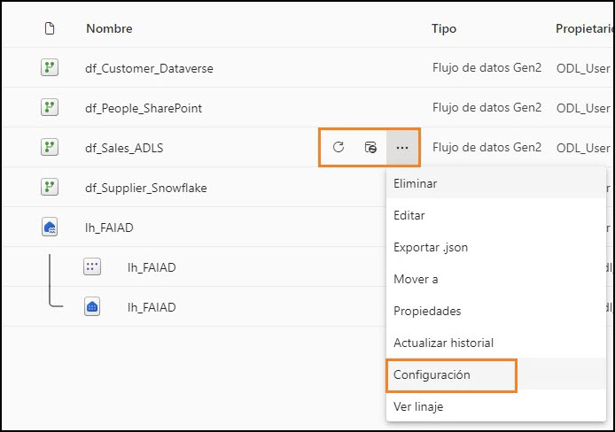
 
   **Nota**: si apre la pagina Impostazioni. Nel pannello di sinistra sono elencati tutti i flussi di dati.

5.	Nel riquadro centrale selezionare il collegamento **Cronologia aggiornamenti**.

   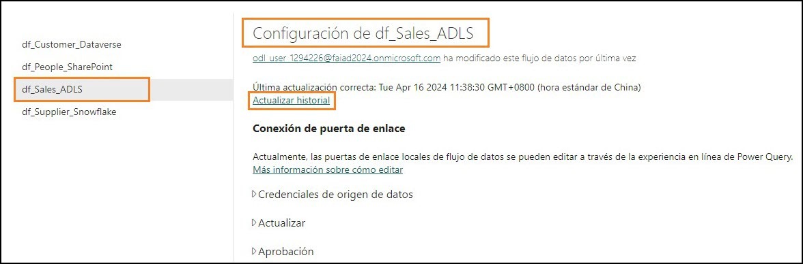
   
6.	Si apre la finestra di dialogo Cronologia aggiornamenti in cui è elencato almeno un aggiornamento. Saranno elencati alcuni aggiornamenti . Si tratta degli aggiornamenti che si sono verificati alla pubblicazione del flusso di dati. Selezionare il collegamento **Ora di inizio**.
 
 **Nota**: l'ora di inizio effettiva sarà diversa.

   
   
Si apre la schermata Dettagli che fornisce i dettagli dell'aggiornamento e ne elenca l'ora di inizio, l'ora di fine e la durata. Elenca anche le tabelle/attività che sono state aggiornate. Nel caso in cui si
verifichi un errore, è possibile fare clic sul nome della tabella/attività per indagare ulteriormente.

   
 
7.	Usciamo facendo clic sulla **X** nell'angolo in alto a destra. Si apre nuovamente la **pagina delle impostazioni del flusso di dati**.
8.	In Connessione gateway espandere **Credenziali dell'origine dati**. Viene visualizzato un elenco delle connessioni usate nel flusso di dati. In questo caso, Lakehouse e ADLS.
      a.	**Lakehouse**: questa è la connessione per importare dati dal flusso di dati.
      b.	**ADLS**: questa è la connessione ai dati dell'origine ADLS.

   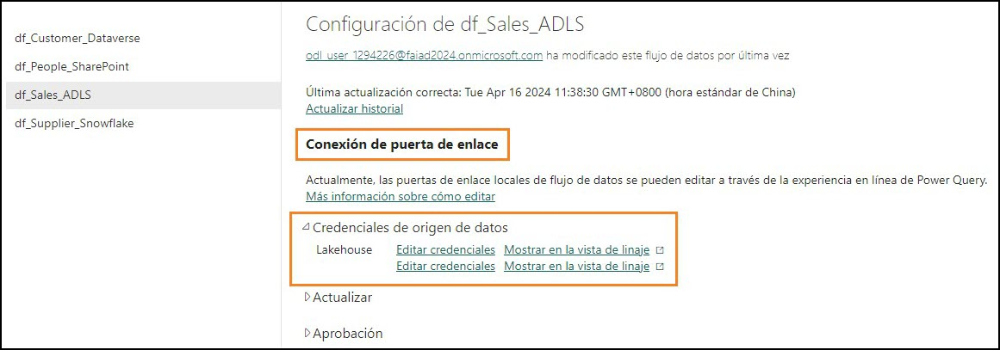
   
9.	Espandere **Aggiorna**.
10.	Impostare il dispositivo di scorrimento **Configurare una pianificazione di aggiornamento** su **Attivato**.
11.	Impostare il** menu a discesa Frequenza di aggiornamento** su **Ogni giorno**. Notare che anche presente un'opzione per impostarla su Settimanale.
12.	Impostare **Fuso orario** sul fuso orario preferito.

**Nota**: poiché si tratta di un ambiente lab, è possibile impostare il fuso orario sul fuso orario preferito. In uno scenario reale, si imposterà il fuso orario in base alla propria ubicazione o all'ubicazione dell'origine dati.

13.	Fai clic sul collegamento **Aggiungi un'altra ora**. Notare che l'opzione Ora è visualizzata.
     
14.	Impostare **Ora** su **12.00**. Notare che è possibile impostare l'aggiornamento sull'ora o sulla mezz'ora.
15.	Selezionare **Applica** per salvare l'impostazione.
    
**Nota:** facendo clic sul collegamento Aggiungi un'altra ora, è possibile aggiungere più orari di aggiornamento. È anche possibile inviare le notifiche di errore al proprietario del flusso di dati e ad altri contatti.

    
    
### Attività 2 - Configurazione dell'aggiornamento pianificato del flusso di dati di fornitori e clienti
1.	Nel pannello di sinistra selezionare **df_Supplier_Snowflake**.
2.	Configurare la pianificazione per eseguire gli aggiornamenti **ogni giorno alle 00:00**.
3.	Selezionare **Applica** per salvare l'impostazione.

    
  	
5.	Nel pannello di sinistra selezionare **df_Customer_Dataverse**.
6.	Configurare la pianificazione degli aggiornamenti su quattro volte al giorno: **00.00, 6:00, 12.00 e 18.00**.
7.	Selezionare **Applica** per salvare l'impostazione.

    
 
Come illustrato in precedenza, è necessario creare una logica personalizzata per gestire lo scenario in cui il file Employee in SharePoint non viene consegnato in tempo. Usiamo la pipeline di dati per risolvere questo problema.

## Pipeline di dati

### Attività 3 - Creazione di una pipeline di dati
1.	Selezionare l'icona **selettore esperienza in Fabric** in basso a sinistra della schermata.
2.	Si apre la finestra di dialogo Microsoft Fabric. Selezionare **Data Factory**. Si apre la home page di Data Factory.

    
 
3.	Nel pannello superiore selezionare **Pipeline di dati** per creare una nuova pipeline.
4.	Si apre la finestra di dialogo Nuova pipeline. Assegnare alla pipeline il nome **pl_Refresh_People_SharePoint**
5.	Selezionare **Crea**.

    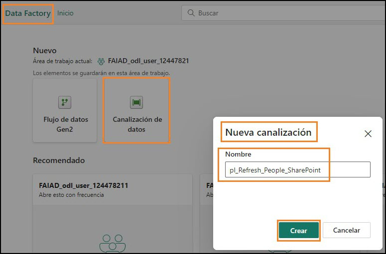
    
Si apre la pagina **Pipeline di dati**. Se si è lavorato con Azure Data Factory, questa schermata sarà familiare. Esaminiamone rapidamente il layout.

Ci si trova nella schermata **Home**. Se si osserva il menu in alto, si possono notare le opzioni per aggiungere le attività di uso comune: convalida, esecuzione di una pipeline e visualizzazione della cronologia di esecuzione. Inoltre, nel riquadro centrale sono presenti opzioni rapide per iniziare a creare la pipeline.

   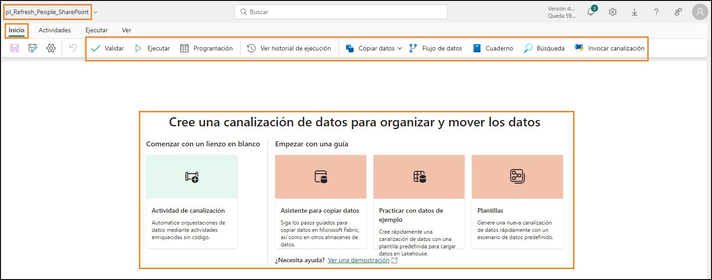
    
6.	Nel menu in alto selezionare **Attività**. Ora nel menu si troverà anche un elenco delle attività di uso comune.
 
7.	Selezionare i **puntini di sospensione (…)** sulla destra del menu per visualizzare tutte le attività disponibili. Useremo alcune di queste attività nel lab.

    
    
8.	Nel menu in alto fare clic su **Esegui**. Si troveranno opzioni per eseguire e pianificare l'esecuzione della pipeline. È anche possibile visualizzare la cronologia di esecuzione 
   mediante l'opzione Visualizza cronologia di esecuzione.
   
10.	Nel menu in alto selezionare **Visualizza**. Qui si troveranno le opzioni per visualizzare il codice in formato JSON. Si troveranno anche le opzioni per formattare le attività.
    
 **Nota**: Se si ha familiarità con JSON, alla fine del lab è possibile selezionare Visualizza codice JSON. Qui si può notare che tutta l'orchestrazione effettuata usando la visualizzazione di progettazione può anche essere scritta in JSON.

   
 
### Attività 4 - Creazione di una pipeline di dati semplice
Iniziamo a creare la pipeline. Abbiamo bisogno di un'attività per aggiornare il flusso di dati. Troviamo un'attività che possiamo usare.

1.	Nel menu in alto selezionare **Attività -> Flusso di dati**. L'attività Flusso di dati viene aggiunta al riquadro di progettazione centrale. Notare che il riquadro inferiore contiene ora opzioni di configurazione dell'attività Flusso di dati.
2.	Configureremo l'attività per la connessione all'attività df_People_SharePoint. Nel **riquadro inferiore** selezionare **Impostazioni**.
3.	Assicurarsi che l'**Area di lavoro** sia impostata sull'area di lavoro di Fabric **FAIAD_<nomeutente>**.
4.	Nel menu a discesa **Flusso di dati** selezionare **df_People_SharePoint**. Quando questa attività Flusso di dati viene eseguita, aggiornerà df_People_SharePoint. Questa procedura è molto semplice. ●¨v
   
 **Nota:** l'opzione Notifica è attualmente disabilitata. Questa funzione sarà abilitata a breve. Sarà possibile configurare le notifiche relative all'esito positivo o negativo di questa attività.
 
Nel nostro scenario, i dati sui dipendenti non vengono aggiornati nei tempi previsti. A volte c'è un ritardo. Vediamo come possiamo risolvere questo problema.

   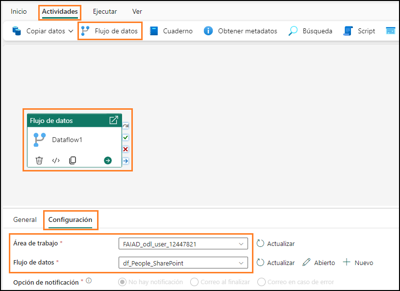
     
5.	Nel **riquadro inferiore** selezionare **Generale**. Assegniamo all'attività un nome e una descrizione.
6.	Nel campo **Nome** immettere **dfactivity_People_SharePoint**.
7.	Nel campo **Descrizione** immettere **Attività Flusso di dati per aggiornare il flusso di dati df_People_Sharepoint**.
8.	Notare che è disponibile un'opzione per disattivare un'attività. Questa funzionalità è utile durante il test o il debug. Lasciarla impostata su **Attivata**.
9.	È presente un'opzione per impostare il **Timeout**. Lasciamo il **valore predefinito** poiché dovrebbe fornire tempo sufficiente per l'aggiornamento del flusso di dati.
    **Nota:** se i dati non sono disponibili nei tempi previsti, impostiamo l'attività in modo che venga eseguita nuovamente ogni 10 minuti, per tre volte. Se anche al terzo tentativo 
            non riesce, verrà segnalato un esito negativo.
10.	Impostare **Riprova** su **3**
11.	Espandere la sezione **Avanzate**.
12.	Impostare **Intervallo tra i tentativi (sec)** su **600**.
13.	Nel menu selezionare l'icona **Home -> Salva** per salvare la pipeline.

     
 
Si notino i vantaggi offerti dall'uso della pipeline di dati rispetto all'impostazione del flusso di dati su un aggiornamento pianificato (come abbiamo fatto per i flussi di dati precedenti):
•	La pipeline offre la possibilità di riprovare più volte prima che l'aggiornamento venga considerato non riuscito.
•	La pipeline offre la possibilità di eseguire l'aggiornamento in pochi secondi mentre l'aggiornamento pianificato del flusso di dati avviene ogni 30 minuti.

### Attività 5 - Creazione di una nuova pipeline di dati
Aggiungiamo un po' più di complessità al nostro scenario. Abbiamo notato che se i dati non sono disponibili alle 09:00, in genere lo sono entro cinque minuti. Se non viene rispettata la finestra
temporale, saranno necessari 15 minuti affinché il file sia disponibile. Vogliamo pianificare i nuovi tentativi a cinque e 15 minuti. Vediamo come è possibile ottenere questo risultato creando una nuova pipeline di dati.
1.	Nel pannello di sinistra fare clic su **FAIAD_<nome utente>** per andare alla home page dell'area di lavoro.
2.	Nel menu in alto fare clic su **Nuovo**, quindi fare clic su **Pipeline di dati nel menu a discesa**.
3.	Si apre la finestra di dialogo Nuova pipeline. Assegnare alla pipeline **il Nome pl_Refresh_People_SharePoint_Option2**
4.	Selezionare **Crea**.
 
     

### Attività 6 - Creazione di un'attività Fino a
1.	Si aprirà la schermata di Pipeline di dati. Nel menu selezionare **Attività**.
2.	Fate clic sui **puntini di sospensione (…**) a destra.
3.	Nell'elenco di attività fare clic su **Fino a**.

  **Fino a**: è un'attività usata per eseguire l'iterazione finché una condizione non viene soddisfatta.

  Nel nostro scenario, ripeteremo e aggiorneremo il flusso di dati finché non avrà esito positivo o finché non avremo provato tre volte.

   

### Attività 7 - Creazione di variabili
1.	Dobbiamo creare variabili che verranno usate per l'iterazione e l'impostazione dello stato. Selezionare l'**area vuota** nel riquadro di progettazione della pipeline.
2.	Notare che il menu nel riquadro inferiore cambia. Selezionare **Variabili**.
3.	Selezionare **Nuova** per aggiungere una nuova variabile.
4.	Notare che compare una riga. Immettere **varCounter** nella casella di testo **Nome**. Useremo questa variabile per iterare per tre volte.
5.	Nel **menu a discesa Tipo** selezionare **Integer**.
6.	Immettere il **Valore predefinito** di **0**.
 
   **Nota**: aggiungiamo var all'inizio dei nomi delle variabili per renderne più agevole la ricerca.

   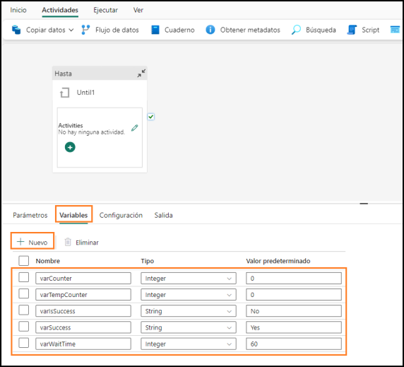
   
7.	Selezionare **Nuova** per aggiungere un'altra variabile.
8.	Notare che compare una riga. Immettere **varTempCounter** nella casella di testo **Nome**. Useremo questa variabile per incrementare la variabile varCounter.
9.	Nel **menu a discesa Tipo** selezionare **Integer**.
10.	Immettere il **Valore predefinito** di **0**.
11.	Eseguire passaggi analoghi per aggiungere altre tre variabili: 
     a.	**varIsSuccess** di tipo **String** con valore predefinito **No**. Questa variabile verrà usata per indicare se l'aggiornamento del flusso di dati ha avuto esito positivo. 
     b.	**varSuccess** di tipo **String** con valore predefinito **Sì**. Questa variabile verrà usata per impostare il valore di varIsSuccess se l'aggiornamento del flusso di dati ha 
        esito positivo. 
     c.	**varWaitTime** di tipo **Integer** con valore predefinito **60**. Questa variabile verrà usata per impostare il tempo di attesa in caso il flusso di dati non riesca (5 
        minuti/300 secondi oppure 15 minuti/900 secondi). 

### Attività 8 - Configurazione di un'attività Fino a
1.	Selezionare l'attività **Fino a**.
2.	Nel **riquadro inferiore** selezionare **Generale**.
3.	Immettere il **Nome: Iterator****
4.	Immettere la **Descrizione: Iteratore per aggiornare il flusso di dati. Riproverà fino a 3 volte**.
 
    
  	
6.	Nel riquadro inferiore selezionare **Impostazioni**.
7.	Seleziona la casella di testo **Espressione**. In questa casella di testo dobbiamo immettere un'espressione che restituirà true o false. L'attività Fino a verrà iterata finché questa espressione restituisce false. Quando l'espressione restituisce true, l'iterazione dell'attività Fino a si interrompe.
8.	Selezionare il collegamento **Aggiungi contenuto dinamico** visualizzato sotto la casella di testo.

     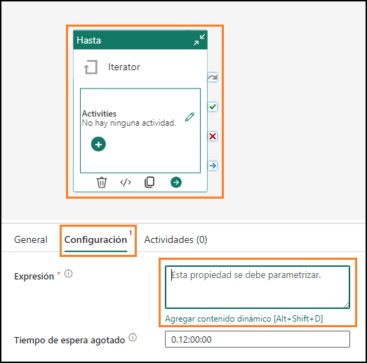

Dobbiamo scrivere un'espressione che verrà eseguita finché il valore di varCounter è 3 o il valore di varIsSuccess è Sì**** (varCounter e varIsSuccess sono le variabili che abbiamo appena creato).
9.	Si apre la finestra di dialogo **Generatore di espressioni della pipeline**. Nella metà inferiore della finestra di dialogo è presente un menu: 
      a.	**Parametri**: sono costanti in una data factory che possono essere usate da una pipeline in qualsiasi espressione. 
      b.	**Variabili di sistema**: queste variabili possono essere usate nelle espressioni quando si definiscono entità all'interno di uno dei servizi. Ad esempio, ID pipeline, nome 
          pipeline, nome trigger e così via.  
      c.	**Funzioni**: è possibile chiamare funzioni all'interno delle espressioni. Le funzioni sono classificate in funzioni Raccolta, Conversione, Data, Logica, Matematica e Stringa. 
            Ad esempio, concat è una funzione Stringa, add è una funzione Matematica e così via. 
      d.	**Variabili**: le variabili della pipeline sono valori che è possibile impostare e modificare durante l'esecuzione della pipeline. A differenza dei parametri della pipeline,che 
          sono definiti a livello di pipeline e non possono essere modificati durante l'esecuzione della pipeline, le variabili della pipeline possono essere impostate e modificate 
           all'interno di una pipeline usando un'attività Imposta variabile. Useremo a breve l'attività Imposta variabile. 

   

10.	Fare clic su **Funzioni** nel menu in basso.
11.	Nella sezione **Funzioni logiche** selezionare la funzione or. Notare che **@or()** viene aggiunto nella casella di testo dell'espressione dinamica. La funzione or accetta due parametri, stiamo lavorando sul primo parametro.
 
    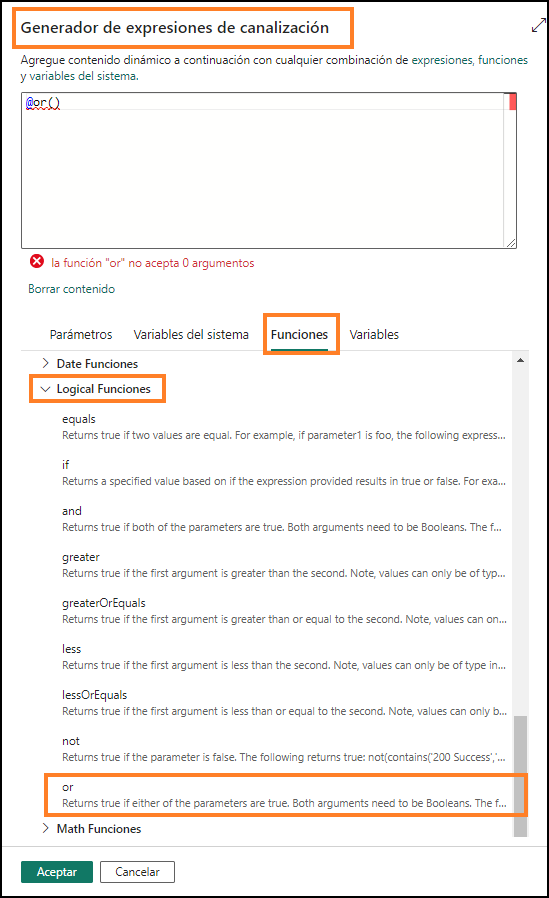
   	
12.	Posizionare il cursore **tra le parentesi** della funzione **@or**.
13.	Nella sezione **Funzioni logiche** selezionare la funzione **equals**. Notare che questo viene aggiunto nella casella di testo dell'espressione dinamica.

   **Nota**: La funzione dovrebbe essere **@or(equals())**. Anche la funzione equals accetta due parametri . Controlleremo se la variabile varCounter è uguale a 3.

   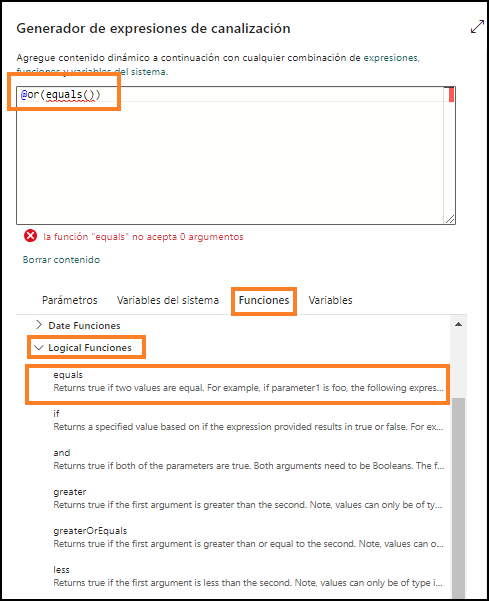
 
14.	Ora posizionare il cursore **tra le parentesi** della funzione **@equals** per aggiungere i parametri.
15.	Nel menu in basso selezionare **Variabili**.
16.	Seleziona la variabile **varCounter** che sarà il primo parametro.
17.	Immettere **3** come secondo parametro della funzione equals. Come illustrato nello screenshot seguente, l'espressione sarà **@or(equals(variables('varCounter'),3))**

    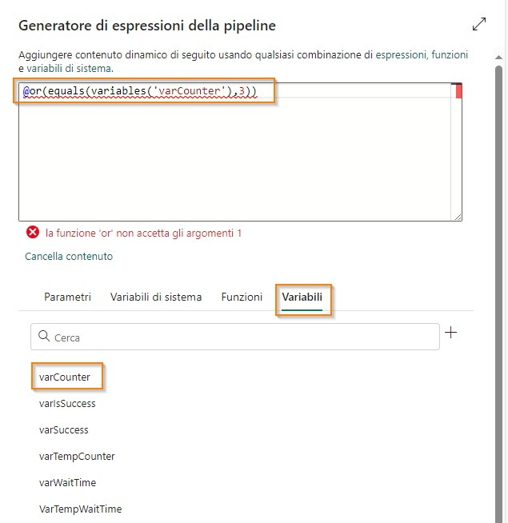
   	
18.	Dobbiamo aggiungere il secondo parametro alla funzione or. **Aggiungere una virgola** tra le due parentesi finali. Questa volta proveremo a digitare il nome della funzione. Iniziare a digitare **equ** e si otterrà un elenco a discesa delle funzioni disponibili (questa funzionalità è denominata
IntelliSense). Seleziona la funzione **equals**.

    
 
19.	Il primo parametro della funzione equals è una variabile. Posiziona il **cursore prima della virgola**.
20.	Inizia a digitare **variables(**
21.	Con l'aiuto di IntelliSense selezionare **variables('varIsSuccess'**)
22.	Dopo la virgola, inseriamo il secondo parametro. Inizia a digitare **variables(**
23.	Con l'aiuto di IntelliSense selezionare **variables('varSuccess')**. Qui stiamo confrontando il valore di varIsSuccess con il valore di varSuccess (il valore predefinito di varSuccess è Sì).

    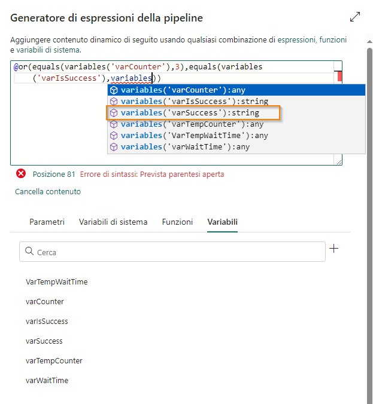
    
24.	L'espressione dovrebbe essere:
    **@or(equals(variables('varCounter'),3),equals(variables('varIsSuccess'), variables('varSuccess')))**
 
25.	Selezionare **OK**.

     

### Attività 9 - Configurazione di un'attività Flusso di dati
1.	Si aprirà nuovamente la schermata di progettazione. Con l'**attività Fino a** selezionata, nel **riquadro inferiore** selezionare **Attività**. Aggiungeremo ora le attività che devono essere eseguite.
2.	Selezionare l'icona **Modifica** nella prima riga. Si aprirà una schermata di progettazione dell'iteratore vuota.

     
  	
3.	Nel menu in alto selezionare **Attività -> Flusso di dati**. L'attività Flusso di dati viene aggiunta al riquadro di progettazione.
4.	Con l'**attività Flusso di dati selezionata**, nel riquadro inferiore selezionare **Generale**. Assegniamo all'attività un nome e una descrizione. 
5.	Nel campo **Nome** immettere **dfactivity_People_SharePoint**.

     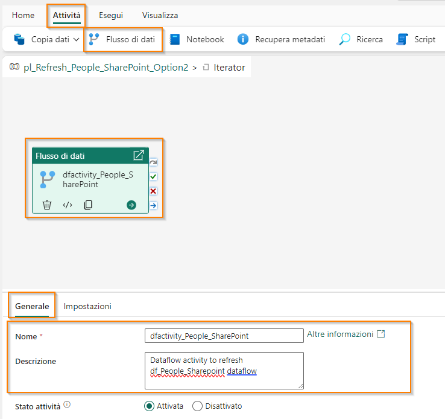
  	
6.	Nel campo **Descrizione** immettere **Attività Flusso di dati per aggiornare il flusso di dati df_People_Sharepoint**.  	
7.	Selezionare **Impostazioni** nel riquadro inferiore.
8.	Assicurarsi che l'**Area di lavoro** sia impostata sulla propria area di lavoro **FAIAD_<nomeutente>**.
9.	Nel menu a discesa Flusso di dati selezionare **df_People_SharePoint**. Quando questa attività Flusso di dati viene eseguita, aggiornerà **df_People_SharePoint**.

    
 
### Attività 10 - Configurazione della prima attività Imposta variabile
Abbiamo configurato l'attività Flusso di dati come abbiamo fatto in precedenza nel lab. Ora aggiungeremo nuova logica. Se l'aggiornamento del flusso di dati ha esito positivo, è necessario uscire dall'iteratore Fino a. Ricordare che una delle condizioni per uscire dell'iteratore è impostare il valore della variabile varIsSuccess su Sì.

1.	Nel menu in alto selezionare **Attività -> Imposta variabile**. L'attività Imposta variabile viene aggiunta al canvas di progettazione.
2.	Con l'attività **Imposta variabile** selezionata, nel riquadro inferiore selezionare **Generale**. Assegniamo all'attività un nome e una descrizione.
3.	Nel campo **Nome** immettere **set_varIsSuccess**
4.	Nel campo **Descrizione** immettere **Impostare la variabile varIsSuccess su Sì**.
   
**Nota**: passare il puntatore del mouse sull'attività Flusso di dati. A destra del riquadro dell'attività sono presenti quattro icone. Tali icone si possono usare per la connessione all'attività successiva in base al risultato dell'attività:
     a.	L'icona **freccia curva grigia** si usa per saltare l'attività.
     b.	L'icona **segno di spunta verde** si usa in caso di esito positivo dell'attività.
     c.	L'icona **segno X rosso** si usa in caso di esito negativo dell'attività.
     d.	L'icona **freccia dritta blu** si usa al completamento dell'attività.

5.	Fare clic sul **segno di spunta verde** dall'attività Flusso di dati dfactivity_People_SharePoint e
trascinare per connettere la nuova **attività Imposta variabile set_varIsSuccess**. In caso di esito positivo dell'aggiornamento del flusso di dati, vogliamo eseguire l'attività Imposta variabile.

     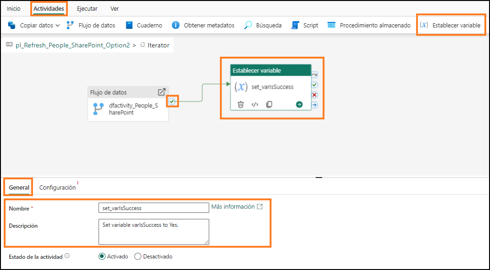
  	
6.	Con l'attività **Imposta variabile** selezionata, fare clic su **Impostazioni** nel menu in basso.
7.	Nel riquadro inferiore assicurarsi che il **Tipo di variabile** sia **Variabile della pipeline**. 
8.	Nel campo **Nome** selezionare **varIsSucces**. Questa è la variabile di cui imposteremo il valore.
9.	Nel campo Valore selezionare la casella di testo. Selezionare il collegamento **Aggiungi contenuto dinamico**.

     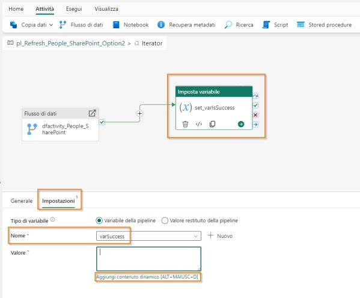
   	
10.	Si apre la finestra di dialogo Generatore di espressioni della pipeline. Selezionare l'area di testo
   **Aggiungere contenuto dinamico di seguito usando qualsiasi combinazione di espressioni, funzioni e variabili di sistema.**
11.	Nel menu in basso selezionare **Variabili -> varSuccess**. Notare che @variables(‘varSuccess’) viene immesso nell'area di testo Aggiungere contenuto dinamico di seguito. Tenere presente 
che quando abbiamo creato le variabili, abbiamo impostato il valore predefinito della variabile
varSuccess su Sì. Quindi, assegniamo il valore Sì alla variabile varIsSuccess.
12.	Selezionare **OK**. Si aprirà nuovamente il **riquadro di progettazione dell'iteratore**.
    
     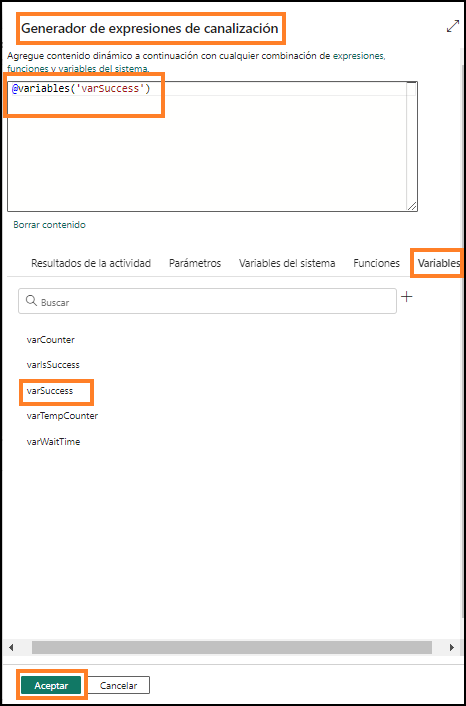
   	
Ora dobbiamo impostare il contatore degli esiti negativi dell'attività Flusso di dati. Nella pipeline di dati una variabile non può fare riferimento a se stessa. Pertanto non possiamo incrementare la variabile contatore varCounter aggiungendo uno al suo valore (varCounter = varCounter + 1). Usiamo quindi la variabile varTempCounter.
 
### Attività 11 - Configurazione della seconda attività Imposta variabile
1.	Nel menu in alto selezionare **Attività -> Imposta variabile**. L'attività Imposta variabile viene aggiunta al canvas di progettazione.
2.	Con l'attività **Imposta variabile** selezionata, nel riquadro inferiore selezionare **Generale**. Assegniamo all'attività un nome e una descrizione.
3.	Nel campo **Nome** immettere **set_varTempCounter**
4.	Nel campo Descrizione immettere **Incrementare la variabile varTempCounter**.
5.	Fare clic sul **segno X rosso** dall'attività Flusso di dati all'attività Imposta variabile. In caso di esito negativo dell'aggiornamento del flusso di dati, vogliamo eseguire questa attività Imposta variabile.
   
     
  	
6.	Con l'attività **Imposta variabile** selezionata, selezionare **Impostazioni** dal menu in basso.
7.	Nel riquadro inferiore assicurarsi che il **Tipo di variabile** sia **Variabile della pipeline**.
8.	Nel campo **Nome** selezionare **varTempCounter**. Questa è la variabile di cui imposteremo il valore.
9.	Nel campo **Valore** selezionare la **casella di testo**. Selezionare il collegamento **Aggiungi contenuto dinamico**.
10.	Si apre la finestra di dialogo Generatore di espressioni della pipeline. Immettere
**@add(variables('varCounter'),1)**

    **Nota**: è possibile digitare l'espressione, usare il menu per selezionare le funzioni o copiare e incollare l'espressione.
 
    **Nota**: questa funzione imposta il valore della variabile varTempCounter sul valore della variabile varCounter più uno (varTempCounter = varCounter + 1).

   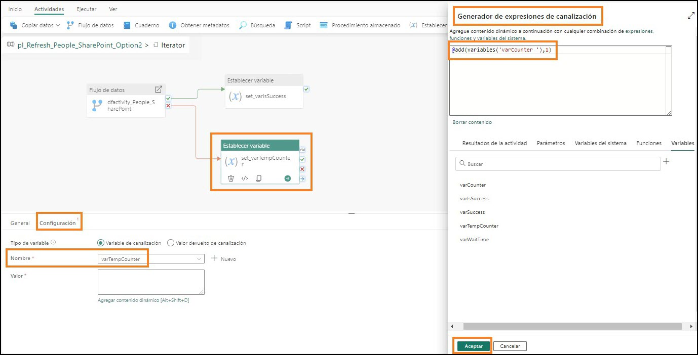
    
    Ora dobbiamo impostare il valore della variabile varCounter sul valore di varTempCounter.

### Attività 12 - Configurazione della terza attività Imposta variabile
1.	Nel menu in alto selezionare **Attività -> Imposta variabile**. L'attività Imposta variabile viene aggiunta al canvas di progettazione.
2.	Con l'attività **Imposta variabile** selezionata, nel riquadro inferiore selezionare **Generale**. Assegniamo all'attività un nome e una descrizione.
3.	Nel campo **Nome** immettere **set_varCounter**.
4.	Nel campo **Descrizione** immettere **Incrementare la variabile varCounter**.
5.	Fare clic sul **segno di spunta verde** dall'attività Imposta variabile set_varTempCounter e trascinare per connettere la nuova a**ttività Imposta variabile set_varCounter**.

   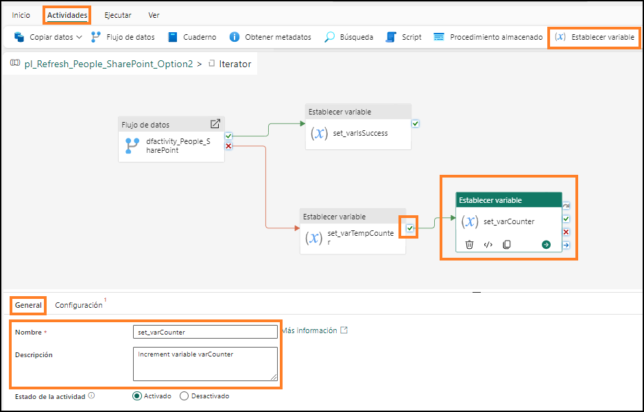
 
6.	Con l'attività **Imposta variabile set_varCounter**selezionata, fare clic su **Impostazioni** nel menu in basso.
7.	Nel riquadro inferiore assicurarsi che il **Tipo di variabile** sia **Variabile della pipeline**.
8.	Nel campo Nome selezionare varCounter. Questa è la variabile di cui imposteremo il valore.
9.	Nel campo Valore selezionare la casella di testo. Selezionare il collegamento **Aggiungi contenuto dinamico**.
10.	Si apre la finestra di dialogo Generatore di espressioni della pipeline. Immettere
**@variables('varTempCounter')**. È possibile digitare l'espressione, usare il menu per selezionare le funzioni o copiare e incollare l'espressione.
**Nota:** questa funzione imposta il valore della variabile varCounter sul valore della variabile varTempCounter (varCounter = varTempCounter). Alla fine di ogni iterazione varCounter e varTempCounter hanno lo stesso valore.
 
   

### Attività 13 - Configurazione di un'attività Attesa
Quindi, dovremo impostare un'attesa di 5 minuti/300 secondi in caso di un primo esito negativo dell'aggiornamento del flusso di dati, prima di un nuovo tentativo. Se l'aggiornamento del flusso di dati non riesce per una seconda volta, dovrà intercorrere un'attesa di 15 minuti/900 secondi prima di un nuovo tentativo. Useremo l'attività Attesa e la variabile varWaitTime per impostare il tempo di attesa.
1.	Nel menu in alto selezionare **Attività -> puntini di sospensione (…) -> Attesa**. L'attività Attesa viene aggiunta al canvas di progettazione.
2.	Con l'attività **Attesa** selezionata, nel riquadro inferiore selezionare Generale. Assegniamo all'attività un nome e una descrizione.
3.	Nel campo **Nome** immettere **wait_onFailure**.
4.	Nel campo **Descrizione** immettere **Attendere 300 secondi prima del secondo tentativo e 900 secondi prima del terzo tentativo**.
5.	Fare clic sul **segno di spunta verde** dall'attività Imposta variabile set_varCounter e trascinare per connettere la nuova **attività Attesa wait_onFailure**.
 
    
 
6.	Con l'attività **Attesa** selezionata, fare clic su **Impostazioni** nel menu in basso.
7.	Nel campo **Tempo di attesa in secondi** selezionare la **casella di testo** e selezionare il contenuto dinamico **Aggiungi contenuto dinamico**.
8.	Si apre la finestra di dialogo Generatore di espressioni della pipeline. Immettere
   
**` @if(
     greater(variables(‘varCounter’), 1),
     if(equals(variables(‘varCounter’), 2), mul(variables(‘varWaitTime’),15 ), mul(variables(‘varWaitTime’), 0)
     ),
     mul(variables(‘varWaitTime’),5 )
     )`**
  	
  È possibile digitare l'espressione, usare il menu per selezionare le funzioni o copiare e incollare l'espressione.

   
 
Qui usiamo due nuove funzioni:
- **greater**: prende due numeri come parametri e li confronta per indicare qual è il maggiore.
- **mul**: questa è una funzione di moltiplicazione, prende due parametri da moltiplicare.
L'espressione è un'istruzione if annidata. Controlla se il valore della variabile varCounter è maggiore di 1. Se è true, controlla se il valore della variabile varCounter è 2. Se è true, imposta il tempo di attesa su varWaitTime per 15. Ricordare che abbiamo impostato il valore predefinito di 60 per la variabile varWaitTime. Il risultato sarebbe 60*15 = 900 secondi. Se il valore della variabile varCounter è diverso da 2 (è maggiore di 2, ossia l'aggiornamento del flusso di dati non è riuscito per 3 volte e
l'iterazione si conclude, non occorre attendere oltre), il tempo di attesa è impostato su varWaitTime
* 0. Pertanto è pari a 0. Se il valore della variabile varCounter è 1, moltiplicheremo varWaitTime * 5. Il risultato sarebbe 60*5 = 300 secondi.
     
9.	Selezionare **OK**.
    
**Checkpoint**: l'iteratore Fino a dovrebbe presentarsi come illustrato nello screenshot seguente.

   
   
10.	Nella parte superiore sinistra del canvas di progettazione selezionare **pl_Refresh_People_Sharepoint_Option2** per uscire dall'iteratore Fino a.

    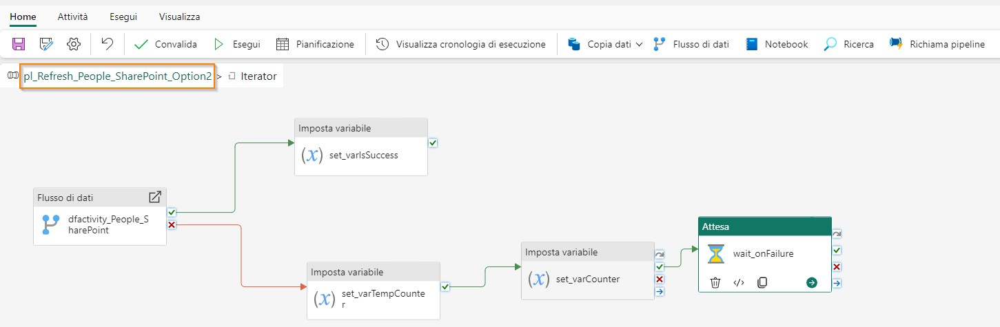
   	
11.	La creazione della pipeline di dati è conclusa. Nel menu in alto selezionare l'icona **Home -> Salva** per salvare la pipeline di dati.

     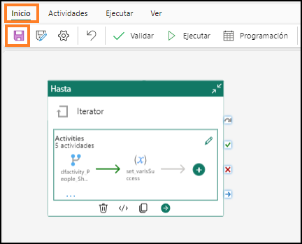

### Attività 14 - Configurazione dell'aggiornamento pianificato per la pipeline di dati
1.	Possiamo testare la pipeline di dati selezionando **Home -> Esegui**.

**Nota**: il completamento dell'aggiornamento della pipeline di dati potrebbe richiedere alcuni minuti. Questo è un ambiente di formazione, quindi il file in SharePoint è sempre disponibile. Pertanto, in questo caso la pipeline di dati non avrà mai esito negativo.

2.	Possiamo impostare la pipeline di dati in modo che venga eseguita in base a una pianificazione. Nel menu in alto selezionare **Home -> Pianificazione**. Si apre la finestra Pianificazione.
3.	Impostare il pulsante di opzione **Esecuzione pianificata** su **Attivato**.
4.	Impostare il menu a discesa **Ripetere** su **Ogni giorno**.
5.	Impostare **Ora** su **09:00**.
6.	Impostare **Data e ora di inizio** su **Oggi**.
7.	Impostare **Data e ora di fine** su una **data futura**.
8.	Impostare il proprio **Fuso orario**.
   
**Nota**: poiché si tratta di un ambiente lab, è possibile impostare il fuso orario sul fuso orario preferito.In uno scenario reale, si imposterà il fuso orario in base alla propria ubicazione o all'ubicazione dell'origine dati.

9.	Selezionare **Applica**.
10.	Selezionare la **X** nell'angolo superiore destro della finestra di dialogo per chiuderla.

   
 
11.	Selezionare l'area di lavoro di Fabric **FAIAD_<nome utente>** nel pannello di sinistra per andare all'area di lavoro.
**Nota**: nella schermata Pianificazione non vi è un'opzione per la notifica dell'esito positivo o negativo (come nella pianificazione del flusso di dati). È possibile impostare la notifica aggiungendo un'attività nella pipeline di dati. Non effettueremo questa impostazione in questo lab poiché si tratta di un ambiente lab.
Abbiamo pianificato gli aggiornamenti per le diverse origini dati. Nel prossimo lab creeremo relazioni, misure ed eseguiremo altre attività di modellazione.
 
## Riferimenti
Fabric Analyst in a Day (FAIAD) presenta alcune delle funzionalità chiave disponibili in Microsoft Fabric. Nel menu di servizio, la sezione Guida (?) include collegamenti ad alcune risorse utili.

   

Di seguito sono riportate ulteriori risorse utili che consentiranno di progredire nell'uso di Microsoft Fabric. 
- Vedere il post di blog per leggere l'[annuncio completo sulla disponibilità generale di Microsof t Fabric](https://aka.ms/Fabric-Hero-Blog-Ignite23) 
- Esplorare Fabric attraverso la [Presentazione guidata](https://aka.ms/Fabric-GuidedTour) 
- Iscriversi alla [versione di valutazione gratuita di Microsof t Fabric](https://aka.ms/try-fabric) 
- Visitare il [sito Web di Microsof t Fabric](https://aka.ms/microsoft-fabric) 
- Acquisire nuove competenze esplorando i [moduli di apprendimento su Fabric](https://aka.ms/learn-fabric) 
- Consultare la [documentazione tecnica di Fabric](https://aka.ms/fabric-docs) 
- Leggere l'[e-book gratuito introduttivo a Fabric](https://aka.ms/fabric-get-started-ebook) 
- Unirsi alla [community di Fabric](https://aka.ms/fabric-community) per pubblicare domande, condividere feedback e imparare dagli altri 

Leggere i blog di annunci più approfonditi sull'esperienza in Fabric:

- [Blog sull'esperienza Data Factory in Fabric](https://aka.ms/Fabric-Data-Factory-Blog) 
- [Blog sull'esperienza Synapse Data Engineering in Fabric](https://aka.ms/Fabric-DE-Blog) 
- [Blog sull'esperienza Synapse Data Science in Fabric](https://aka.ms/Fabric-DS-Blog) 
- [Blog sull'esperienza Synapse Data Warehousing in Fabric](https://aka.ms/Fabric-DW-Blog) 
- [Blog sull'esperienza Synapse Real-Time Analytics in Fabric](https://aka.ms/Fabric-RTA-Blog) 
- [Blog di annunci di Power BI](https://aka.ms/Fabric-PBI-Blog) 
- [Blog sull'esperienza Data Activator in Fabric](https://aka.ms/Fabric-DA-Blog) 
- [Blog su amministrazione e governance in Fabric](https://aka.ms/Fabric-Admin-Gov-Blog) 
- [Blog su OneLake in Fabric](https://aka.ms/Fabric-OneLake-Blog) 
- [Blog sull'integrazione di Dataverse e Microsof t Fabric](https://aka.ms/Dataverse-Fabric-Blog) 

© 2023 Microsoft Corporation. Tutti i diritti sono riservati.
L'uso della demo/del lab implica l'accettazione delle seguenti condizioni:
La tecnologia/le funzionalità descritte nella demo/nel lab sono fornite da Microsoft Corporation allo scopo di ottenere feedback dall'utente e offrire un'esperienza di apprendimento. L'utilizzo della demo/del lab è consentito solo per la valutazione delle caratteristiche e delle funzionalità di tale tecnologia e per l'invio di feedback a Microsoft. L'utilizzo per qualsiasi altro scopo non è consentito. È vietato modificare, copiare, distribuire, trasmettere, visualizzare, eseguire, riprodurre, pubblicare, concedere in licenza, usare per la creazione di lavori derivati, trasferire o vendere questa demo/questo lab o parte di essi.
SONO ESPLICITAMENTE PROIBITE LA COPIA E LA RIPRODUZIONE DELLA DEMO/DEL LAB (O DI QUALSIASI PARTE DI ESSI) IN QUALSIASI ALTRO SERVER O IN QUALSIASI ALTRA POSIZIONE PER ULTERIORE RIPRODUZIONE O RIDISTRIBUZIONE.
QUESTA DEMO/QUESTO LAB RENDONO DISPONIBILI TECNOLOGIE SOFTWARE/FUNZIONALITÀ DI PRODOTTO SPECIFICHE, INCLUSI NUOVI CONCETTI E NUOVE FUNZIONALITÀ POTENZIALI, IN UN AMBIENTE SIMULATO, CON UN'INSTALLAZIONE E UNA CONFIGURAZIONE PRIVE DI COMPLESSITÀ, PER GLI SCOPI DESCRITTI IN PRECEDENZA. LA TECNOLOGIA/I CONCETTI RAPPRESENTATI IN QUESTA DEMO/IN QUESTO LAB POTREBBERO NON CONTENERE LE FUNZIONALITÀ COMPLETE E IL LORO FUNZIONAMENTO POTREBBE NON ESSERE LO STESSO DELLA VERSIONE FINALE. È ANCHE POSSIBILE CHE UNA VERSIONE FINALE DI TALI FUNZIONALITÀ O CONCETTI NON VENGA RILASCIATA. L'ESPERIENZA D'USO DI TALI CARATTERISTICHE E FUNZIONALITÀ PUÒ INOLTRE RISULTARE DIVERSA IN UN AMBIENTE FISICO.
FEEDBACK. L'invio a Microsoft di feedback sulle caratteristiche, sulle funzionalità e/o sui concetti della tecnologia descritti in questa demo/questo lab implica la concessione a Microsoft, a titolo gratuito, del diritto di utilizzare, condividere e commercializzare tale feedback in qualsiasi modo e per qualsiasi scopo. Implica anche la concessione a titolo gratuito a terze parti del diritto di utilizzo di eventuali brevetti necessari per i loro prodotti, le loro tecnologie e i loro servizi al fine di utilizzare o interfacciarsi ai componenti software o ai servizi Microsoft specifici che includono il feedback. L'utente si impegna a non inviare feedback la cui inclusione all'interno di software o
documentazione Microsoft imponga a Microsoft di concedere in licenza a terze parti tale software o documentazione. Questi diritti sussisteranno anche dopo la scadenza del presente contratto.
 
CON LA PRESENTE MICROSOFT CORPORATION NON RICONOSCE ALCUNA GARANZIA O CONDIZIONE RELATIVAMENTE ALLA DEMO/AL LAB, INCLUSE TUTTE LE GARANZIE E CONDIZIONI DI COMMERCIABILITÀ, DI FATTO ESPRESSE, IMPLICITE O PRESCRITTE DALLA LEGGE, ADEGUATEZZA PER UNO SCOPO SPECIFICO, TITOLARITÀ E NON VIOLABILITÀ. MICROSOFT NON OFFRE GARANZIE O RAPPRESENTAZIONI IN RELAZIONE ALL'ACCURATEZZA DEI RISULTATI E DELL'OUTPUT DERIVANTI DALL'USO DELLA DEMO/DEL LAB O ALL'ADEGUATEZZA DELLE INFORMAZIONI CONTENUTE NELLA DEMO/NEL LAB PER QUALSIASI SCOPO.
CLAUSOLA DI RESPONSABILITÀ
Questa demo/questo lab contiene solo una parte delle nuove funzionalità e dei miglioramenti in Microsoft Power BI. Alcune funzionalità potrebbero cambiare nelle versioni future del prodotto. In questa demo/in questo lab si apprendono alcune delle nuove funzionalità, ma non tutte.
