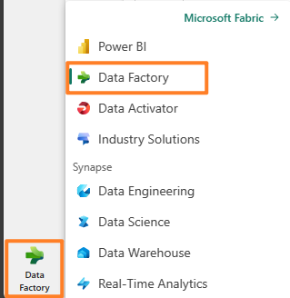
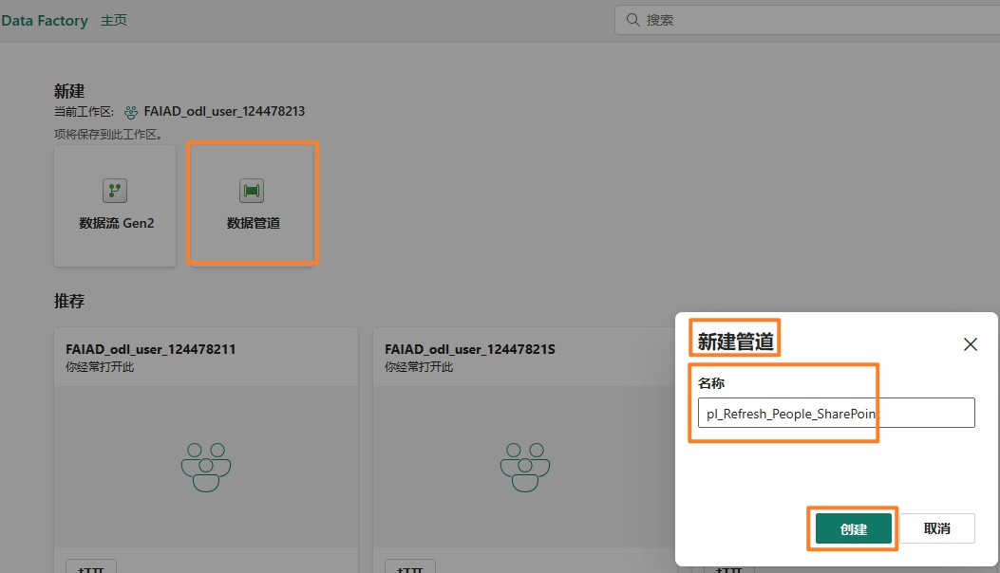
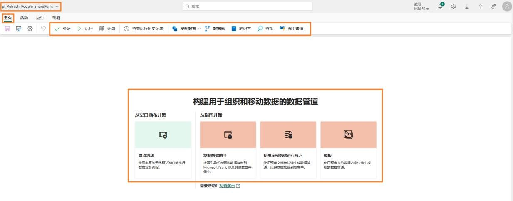
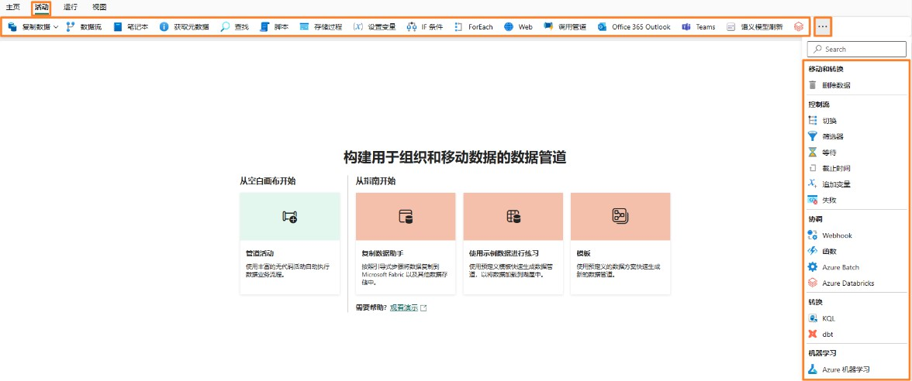
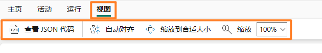
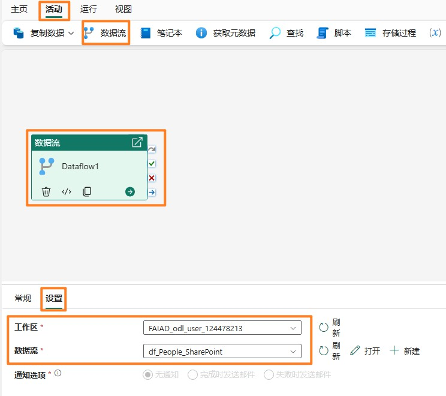
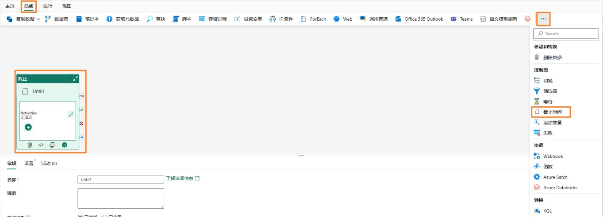

## 目录

- 简介

- 数据流 Gen2

    - 任务 1：为销售数据流配置计划刷新

    - 任务 2：为供应商和客户数据流配置计划刷新	

- 数据管道

    - 任务 3：创建数据管道

    - 任务 4：生成简单的数据管道	

    - 任务 5：创建新数据管道

    - 任务 6：创建截止活动

    - 任务 7：创建变量

    - 任务 8：配置截止活动

    - 任务 9：配置数据流活动

    - 任务 10：配置第1 个设置变量活动	

    - 任务 11：配置第2 个设置变量活动	

    - 任务 12：配置第3 个设置变量活动	

    - 任务 13：配置等待活动

    - 任务 14：为数据管道配置计划刷新	

参考

## 简介

我们已将来自不同数据源的数据引入到Lakehouse。在本实验中，您将为数据源设置刷新计划。简单回顾一下要求：

- **销售数据**：存储在 ADLS 中，每天中午 12 点更新。

- **供应商数据**：存储在 Snowflake 中，每天半夜/凌晨 12 点更新。

- **客户数据**：存储在 Dataverse 中，随时更新。我们每天需要刷新四次，分别在半夜/凌晨 12 点、上午 6 点、中午 12 点和下午 6 点。

- **员工数据**：存储在 SharePoint 中，每天上午 9 点更新。但我们注意到有时会有 5 至 15
分钟的延迟。我们需要创建一个刷新计划来进行调整。

本实验结束后，您将学会：

- 如何为数据流Gen2 配置计划刷新

- 如何创建数据管道

- 如何为数据管道配置计划刷新

## 数据流Gen2

### 任务 1：为销售数据流配置计划刷新

我们首先配置销售数据流的计划刷新。

1.	让我们导航回到您在实验 2 任务 9 中创建的 Fabric 工作区 **FAIAD_<username>。**

2.	此处列出了您创建的所有项目。在屏幕右侧的**搜索框**中，输入**df**。这会将项目筛选到数据流。

3.	将光标悬停在 **df_Sales_ADLS** 行上。请注意，这里显示熟悉的**刷新**和**计划刷新图标**。选择
省略号 (…)。
 
4.	请注意，有“删除”、“编辑”和“导出数据流”选项。我们可以使用“属性”来更新数据流的名称和描述。我们稍后会查看刷新历史记录。选择**设置。**

**注意：**设置页面打开。在左侧面板中，您将看到所有列出的数据流。

5.	在中间窗格中，选择**刷新历史记录**链接。

6.	“刷新历史记录”对话框随即打开。您将看到列出了几次刷新。这是发布数据流时发生的刷新。选择**开始**时间链接。

**注意**：您的开始时间会有所不同。

详细信息屏幕将打开。这将提供刷新的详细信息，其中列出了开始时间、结束时间和持续时间。还列出了刷新的表/活动。如果出现故障，您可以点击表/活动的名称进一步调查。

7.	我们点击右上角的 X 离开此页面。您将导航回到数据**流设置页面**。

8.	在“网关连接”下，展开**数据源凭据**。将显示数据流中使用的连接列表。在本例中，是
Lakehouse 和 ADLS。

    a. **Lakehouse**：这是从数据流引入数据的连接。

    b.	**ADLS**：这是与 ADLS 源数据的连接。

9.	展开**刷新**。

10.	将**配置刷新计划**滑块设置为**开。**

11.	将**刷新频率下拉列表**设置为**每天**。请注意，此处还有一个“设置为每周”的选项。
 
12.	将**时区**设置为您的首选时区。

    **注意**：由于这是实验环境，因此您可以将时区设置为您的首选时区。在实际应用场景中，您将根据您本人/数据源的位置设置时区。

13.	点击**添加其他时间**链接。请注意，**时间**选项已显示。

14.	将**时间**设置为**中午**。请注意，您可以将刷新设置为一小时或半小时。

15.	选择应用以保存此设置。

**注意**：通过点击“添加其他时间”链接，您可以添加多个刷新时间。

您还可以向数据流所有者和其他联系人发送失败通知。

## 任务 2：为供应商和客户数据流配置计划刷新

1.	在左侧面板中，选择 **df_Supplier_Snowflake**。

2.	将刷新计划配置为**每天半夜/凌晨 12 点**刷新。

3.	选择**应用**以保存此设置。

4.	在左侧面板中，选择 **df_Customer_Dataverse。**

5.	将刷新计划配置为每天刷新四次：**半夜/凌晨 12 点、上午 6 点、中午 12 点和下午 6 点。**

6.	选择**应用**以保存此设置。

前面提到，我们需要构建一个自定义逻辑来处理 SharePoint 中的员工文件未按时送达的应用场景。我们使用数据管道来解决此问题。

## 数据管道

任务 3：创建数据管道

1.	选择屏幕左下角的 Fabric 体验选择器图标。

2.	Microsoft Fabric 对话框随即打开。选择 Data Factory。您将导航到 Data Factory 主页。

3.	从顶部面板中，选择**数据管道**以创建新管道。

4.	“新建管道”对话框随即打开。将管道命名为 **pl_Refresh_People_SharePoint**

5.	选择**创建。**

您将导航到**数据管道页面**。如果您使用过Azure 数据工厂，您会熟悉此屏幕。让我们快速了解一下布局。

 
您位于**主页**屏幕。在顶部菜单上，您会看到添加常用活动的选项：验证、运行管道以及查看运行历史记录。此外，在中间窗格中，您会看到开始生成管道的快速选项。

6.	从顶部菜单中选择**活动**。现在，您会在菜单中看到常用活动的列表。
7.	选择菜单右侧的**省略号(…)**，以查看所有其他可用的活动。我们将在实验中使用其中一些活动。

8.	点击顶部菜单中的**运行**。您将找到运行和计划管道执行的选项。还可以找到使用“查看运行历史记录”来查看执行历史记录的选项。

9.	从顶部菜单中选择**视图**。在这里可以找到以 JSON 格式查看代码的选项。还可以找到设置活动格式的选项。

**注意**：如果您在完成本实验后掌握了一些 JSON 背景知识，请自行选择“查看JSON 代码”。在这里，您会注意到使用设计视图进行的所有编排也可以用JSON 编写。

## 任务 4：生成简单的数据管道

我们开始生成管道。我们需要一个活动来刷新数据流。让我们找到一个可以使用的活动。

1.	在顶部菜单中，选择**活动-> 数据流**。数据流活动已添加到中心设计窗格中。请注意，底部窗格现在具有数据流活动的配置选项。

2.	我们将配置该活动以连接到 df_People_SharePoint 活动。在**底部窗格**中选择**设置。**

3.	确保将**工作区**设置为您的 Fabric 工作区 **FAIAD_<username>**

4.	**从数据流下拉列表**中，选择 **df_People_SharePoint**。执行此数据流活动时，它将刷新 **df_People_SharePoint**。这很容易，对吧？

**注意**：通知选项目前呈灰色。该功能将很快启用。您将能够配置有关此活动成功和失败的通知。

在我们的应用场景中，员工数据未按计划更新。有时会有延迟。我们来看看如何调整。

5.	在**底部窗格**中选择**常规**。我们为活动指定名称和说明。

6.	在**名称**字段中，输入 **dfactivity_People_SharePoint**

7.	在**说明**字段中，输入 **Dataflow activity to refresh df_People_Sharepoint dataflow。**

8.	请注意，有一个停用活动的选项。此功能在测试或调试期间非常有用。将其保留为**已激活**。

9.	有一个设置超时的选项。我们保留**默认值**，这样可以为数据流刷新提供足够的时间。

**注意**：如果数据无法按计划提供，我们将活动设置为每 10 分钟重新执行一次，共 3 次。如果第三次尝试也失败，那么它将报告失败。
 
10.	将**重试次数**设置为 **3**

11.	展开**高级**部分。

12.	将**重试间隔（秒** 设置为 **600**。

13.	从菜单中选择**主页 -> 保存**图标以保存管道。

请注意，与将数据流设置为按计划刷新相比（如同我们对早期数据流所做的那样），使用数据管道具有以下优势：
- 管道提供在刷新失败之前重试多次的选项。

- 管道能够在几秒钟内刷新一次，而数据流每 30 分钟按计划刷新一次。

### 任务 5：创建新数据管道

我们为应用场景加大难度。我们注意到，如果在上午 9 点还未提供数据，那么通常在五分钟内
会提供。如果错过该时段，则需要 15 分钟后才能获得文件。我们希望将重试时间安排在 5 分
钟和 15 分钟。让我们看看如何通过创建新的数据管道来实现这一点。

1.	从左侧面板中，点击 **FAIAD_<username>**，以导航到工作区主页。

2.	从顶部菜单中，点击**新建**，然后从**下拉列表**中，点击**数据管道**。

3.	“新建管道”对话框随即打开。将管道**命名**为 **pl_Refresh_People_SharePoint_Option2**
 
4.	选择**创建。**

### 任务 6：创建截止活动

1.	您将导航到数据管道屏幕。从菜单中选**择活动**。

2.	点击右侧的**省略号 (…)**。

3.	从活动列表中，点击**截止时间**。

**截止**：这是一个用于迭代直到满足条件的活动。

在我们的应用场景中，我们将迭代并刷新数据流，直到成功或者已经尝试三次。

