 
 
# Sommaire

- Introduction
- Lakehouse
   - Tâche 1 : interroger des données à l’aide de SQL
   - Tâche 2 : visualiser le résultat T-SQL
   - Tâche 3 : créer une requête visuelle
   - Tâche 4 : visualiser les résultats de la requête
   - Tâche 5 : créer des relations
   - Tâche 6 : créer des mesures
   - Tâche 7 : section facultative - Créer des relations
   - Tâche 8 : section facultative - Créer des mesures
- Références

 
## Introduction
Nous avons des données provenant de différentes sources ingérées dans la lakehouse. Dans ce labo, vous allez utiliser le modèle de données. En général, nous effectuions des activités de modélisation telles que la création de relations, l’ajout de mesures, etc. dans Power BI Desktop. Ici, nous allons
découvrir comment effectuer ces activités de modélisation dans le service. À la fin de ce labo, vous saurez :
- comment explorer Lakehouse ;
- comment explorer la vue SQL de Lakehouse ;
- comment explorer la modélisation de données dans Lakehouse.

## Lakehouse
### Tâche 1 : interroger des données à l’aide de SQL
1.	Revenons à l’espace de travail **Fabric_<username>** que vous avez créé dans le labo 2, tâche 9.
2.	Vous voyez trois types d’lh_FAIAD : Lakehouse, modèle sémantique et point de terminaison SQL. Nous avons exploré l’option Lakehouse dans un labo précédent. Sélectionnez l’option **Point de terminaison analytique SQL lh_FAIAD** pour explorer l’option SQL. Vous êtes alors redirigé vers la **vue SQL** de l’explorateur.

    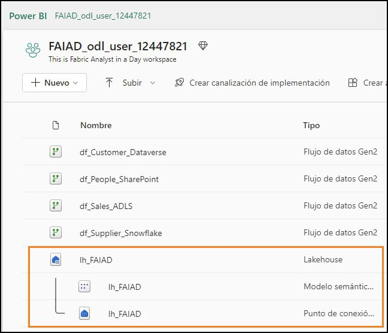

Vous pouvez explorer les données avant de créer un modèle de données à l’aide de SQL. Examinons deux options permettant d’utiliser SQL : la première est conviviale pour les développeurs et la
deuxième est destinée aux analystes.

Supposons que vous souhaitiez connaître rapidement les unités vendues par fournisseur à l’aide de SQL. Nous disposons de deux options : écrire une instruction SQL ou créer l’instruction SQL à l’aide d’un visuel.

Dans le volet gauche, notez que vous pouvez afficher les tables. Si vous développez les tables, vous pouvez afficher les colonnes qui composent la table. En outre, des options permettent de créer des
vues, fonctions et procédures stockées SQL. Si vous avez une expérience SQL, n’hésitez pas à explorer ces options. Essayons d’écrire une requête SQL simple.
 
3.	Dans le **menu supérieur**, cliquez sur **Nouvelle requête SQL** ou en **bas du volet gauche**, cliquez sur **Requête**. Vous êtes alors redirigé vers la vue Requête SQL.

    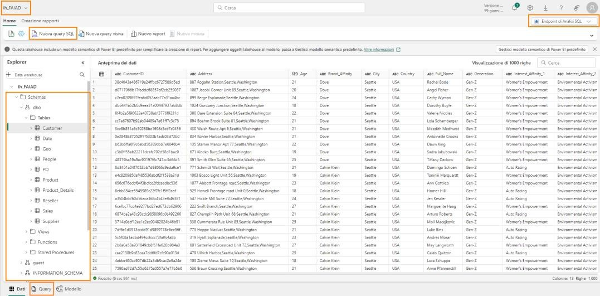

4.	Collez la **requête SQL ci-dessous** dans la **fenêtre Requête**. Cette requête renvoie les unités par nom de fournisseur. Pour y parvenir, elle joint la table Sales avec les tables Product et Supplier.

    ```
    SELECT su.Supplier_Name, SUM(Quantity) as Units FROM dbo.Sales s
    JOIN dbo.Product p on p.StockItemID = s.StockItemID JOIN dbo.Supplier su on su.SupplierID = p.SupplierID GROUP BY su.Supplier_Name
    ```

5.	Cliquez sur **Run** pour afficher les résultats.
6.	Notez qu’une option permet d’enregistrer cette requête en tant que vue en cliquant sur
**Enregistrer en tant que vue**.
7.	Dans le **volet gauche** Explorateur, sous la section **Queries**, cette requête est enregistrée sous **Mes requêtes** comme **SQL query 1**. Cela permet de renommer la requête et de l’enregistrer pour une utilisation ultérieure. En outre, une option permet d’afficher les requêtes partagées avec vous à l’aide du dossier **Requêtes partagées**.
 
    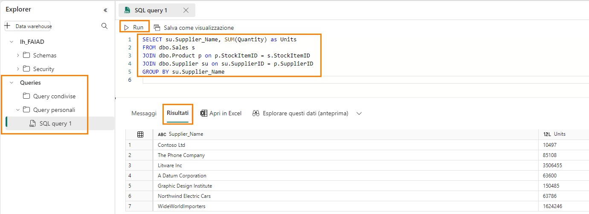
 
### Tâche 2 : visualiser le résultat T-SQL
1.	Nous pouvons également visualiser le résultat de cette requête. **Mettez en surbrillance la requête** dans le volet de la requête et cliquez sur le volet **Résultats**, puis sur **Explorer ces données**.

    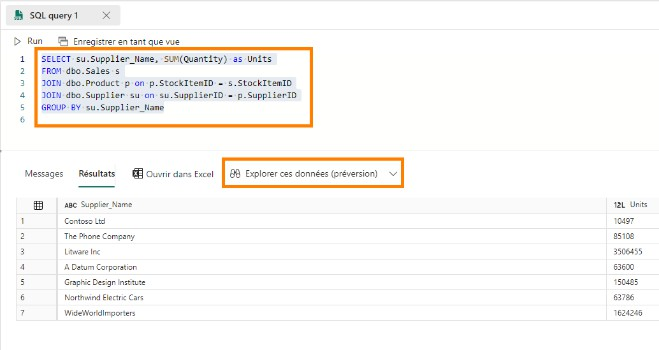

2.	La boîte de dialogue **Explorer la requête SQL** s’ouvre. Dans le volet **Données**, développez **SQL query 1**.
3.	Sélectionnez les **champs Supplier_Name** et **Units**. Un graphique à barres groupées est créé.
4.	Dans la section **Visualisation**, changez le type de visuel en sélectionnant l’**Histogramme empilé**.

    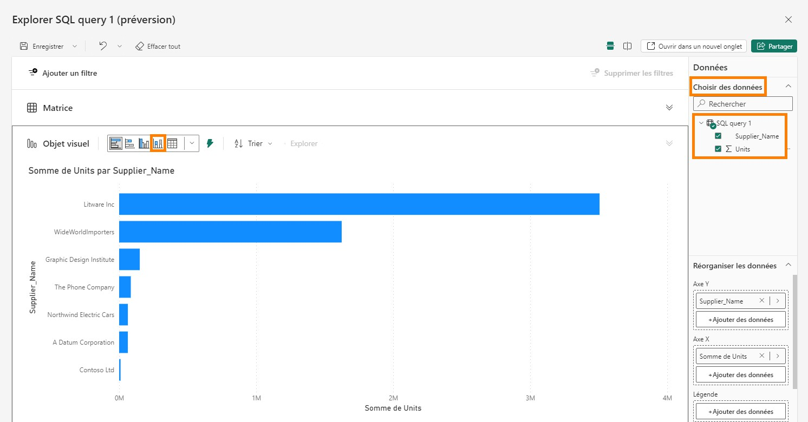
 
 
5.	**Développez Matrice** pour afficher les données sous forme de matrice.

    

6.	Cliquez sur **Enregistrer - > Enregistrer en tant qu’état** en haut de l’écran à droite.
 
    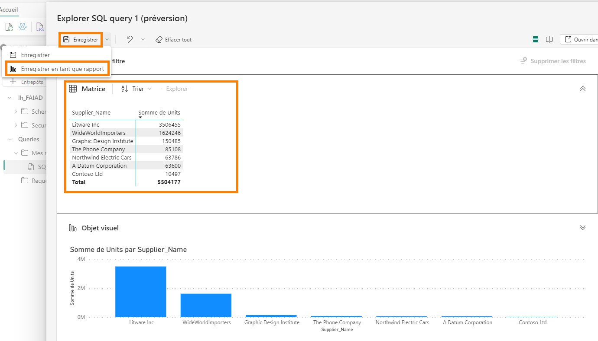
 
7.	La boîte de dialogue Enregistrer votre rapport s’ouvre alors. Tapez **Units by Supplier** dans la zone de texte **Entrez un nom pour votre rapport**.
8.	Assurez-vous que l’espace de travail de destination est votre espace de travail Fabric
**FAIAD<username>**.
9.	Cliquez sur **Enregistrer**.

    

Vous serez alors dirigé vers l’expérience complète de l’état. Plusieurs options sont à votre disposition pour formater les visuels. Nous les verrons au cours du labo suivant.

10.	Dans le volet gauche, cliquez sur **lh_FAIAD**.
 
    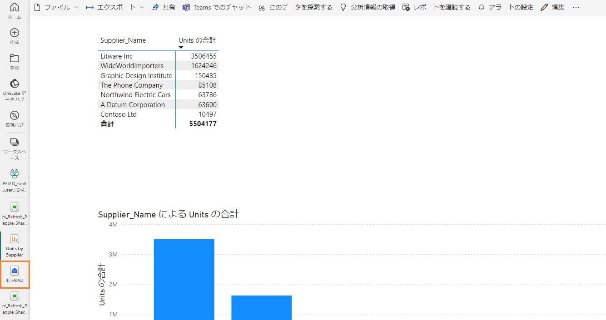
 
### Tâche 3 : créer une requête visuelle
Vous êtes alors redirigé vers la **vue de point de terminaison analytique SQL**. Si vous n’êtes pas familier avec SQL, vous pouvez exécuter une requête similaire à l’aide d’une requête visuelle.
1.	Dans le menu supérieur, cliquez sur **Nouvelle requête visuelle**. Un volet de requête visuelle s’ouvre alors.
2.	Dans le volet **Explorer** développez **Schémas -> dbo -> Tables**.
3.	Faites glisser les tables **Sales, Product et Supplier** vers le volet de requête visuelle.

    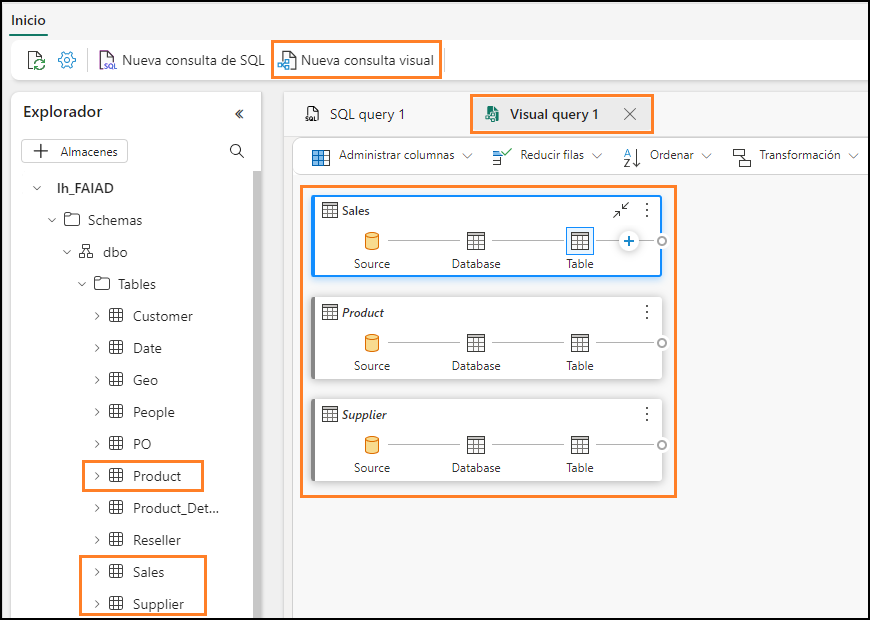

4.	Une fois la table **Sales** sélectionnée, cliquez sur **Combiner -> Fusionner des requêtes** dans le menu du volet de requête visuelle.

    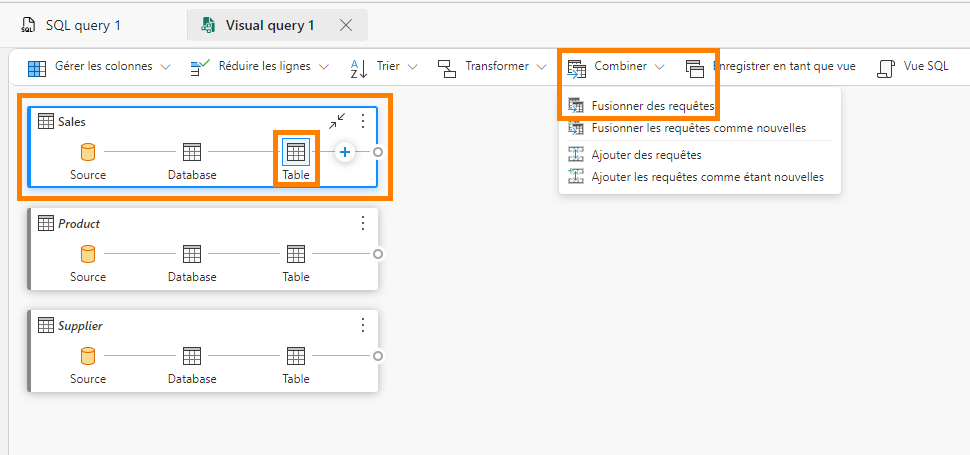
 
 
5.	La boîte de dialogue Fusionner s’ouvre alors. Dans la **liste déroulante Table de droite pour la fusion,** sélectionnez **Product**.
6.	Sélectionnez **StockItemID** dans les tables **Sales** et **Product**. Cette opération permet de fusionner les tables Product et Sales.
7.	Dans le champ **Type de jointure**, sélectionnez **Externe gauche**.
8.	Cliquez sur **OK**.

    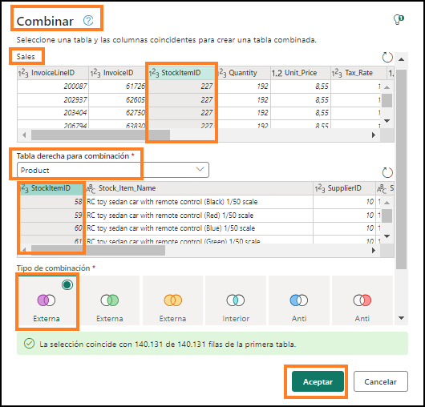

9.	Dans le volet des **résultats**, cliquez sur la **double flèche** en regard de la colonne **Product**.
10.	Une boîte de dialogue s’ouvre alors : sélectionnez-y **SupplierID**.
11.	Cliquez sur OK. Notez que les étapes Requêtes fusionnées et Product développé sont créées dans la table **Sales**.

    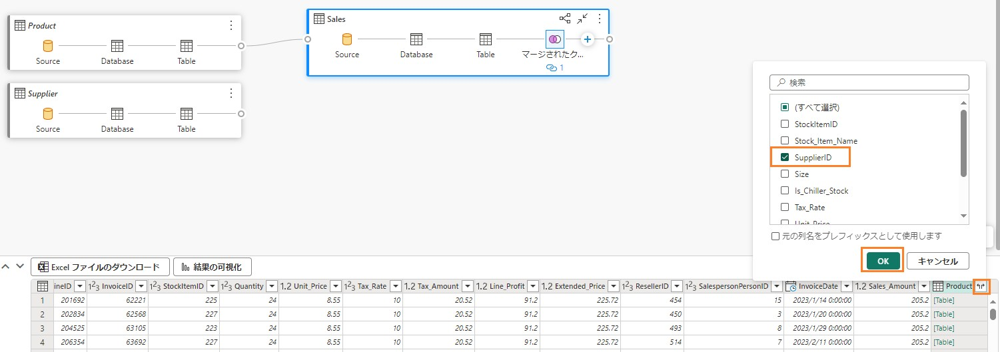
 
12.	De même, fusionnons la table Supplier. Dans la table **Sales**, cliquez sur le signe **« + »** (situé après Product développé) pour ajouter une nouvelle étape. Une boîte de dialogue s’ouvre alors.
13.	Cliquez sur **Combiner -> Fusionner des requêtes**.

    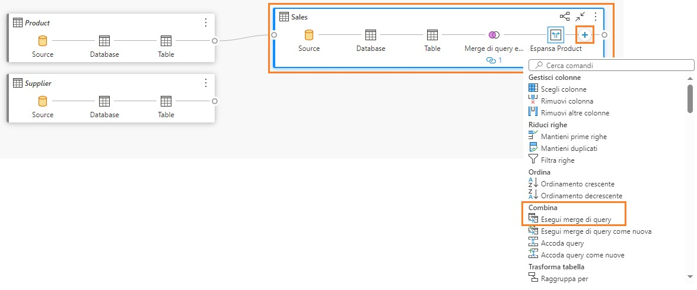

14.	La boîte de dialogue Fusionner s’ouvre alors. Dans la **liste déroulante Table de droite pour la fusion,** sélectionnez **Supplier**.
15.	Sélectionnez **SupplierID** dans les tables **Sales** et **Supplier**. Cette opération permet de fusionner les tables Supplier et Sales.
16.	Dans le champ **Type de jointure**, sélectionnez **Externe gauche**.
17.	Cliquez sur **OK**.

    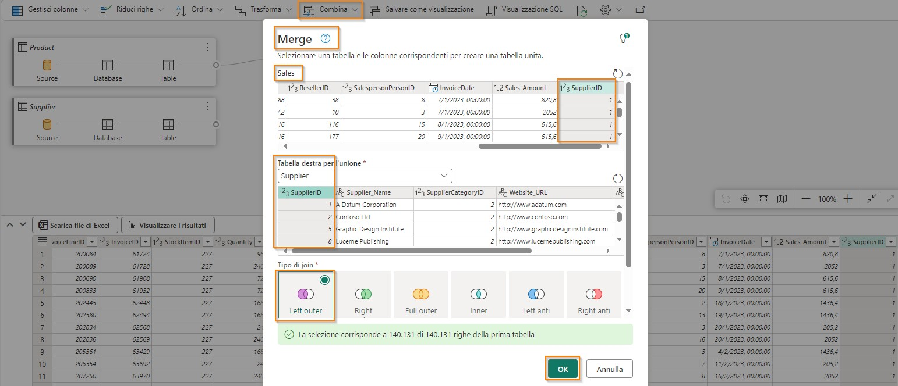
 
 
18.	Dans le volet des **résultats**, cliquez sur la **double flèche** en regard de la colonne **Supplier**.
19.	Une boîte de dialogue s’ouvre alors : sélectionnez-y **Supplier_Name**.
20.	Cliquez sur **OK**. Notez que dans la table Sales, **Requêtes fusionnées** est ajouté et que les **étapes sont enregistrées**.

    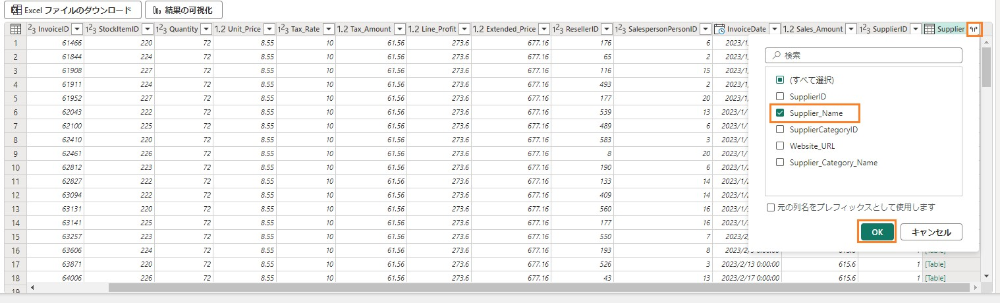

21.	Nous allons maintenant regrouper les données par nom Supplier pour obtenir la quantité par Supplier. Dans la table **Sales**, cliquez sur le signe **« + »** (situé après Expanded Supplier) pour ajouter une nouvelle étape. Une boîte de dialogue s’ouvre alors.
22.	Sélectionnez **Transformer la table -> Grouper par**. La boîte de dialogue Grouper par s’ouvre.
 
    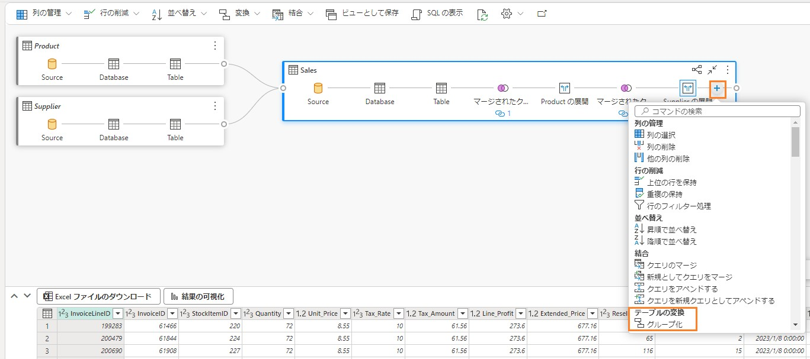

23.	Dans la liste déroulante **Grouper par**, sélectionnez **Supplier_Name**.
24.	Saisissez **Units** comme illustré dans la capture d’écran de la boîte de dialogue de la requête de fusion.
25.	Définissez **Opération** sur **Somme**
26.	Sélectionnez **Quantité** dans le menu déroulant **Colonne**.
27.	Cliquez sur **OK**.

    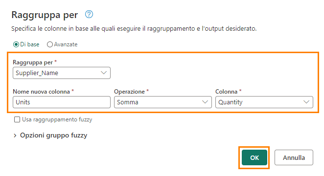

Notez que toutes les étapes sont consignées dans le bloc Sales. (Reportez-vous à la première capture d’écran sous la tâche 4.)
 
### Tâche 4 : visualiser les résultats de la requête
1.	Maintenant que la requête est prête, voyons le résultat. Cliquez sur **Visualiser les résultats** dans le volet des résultats.

    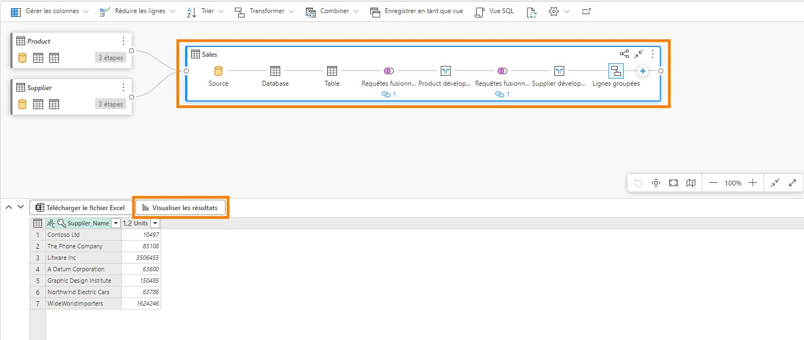

2.	La boîte de dialogue Visualiser les résultats s’ouvre alors. Dans le volet **Données** de droite,
**développez Visual query1**.
3.	Sélectionnez les champs **Supplier_Name** et **Units**.
4.	Notez que le résultat ressemble au résultat de la requête SQL précédente. Si vous le souhaitez, vous pouvez enregistrer cet état. Puisque nous avons enregistré un état similaire précédemment, nous allons cliquer sur **Annuler**.

    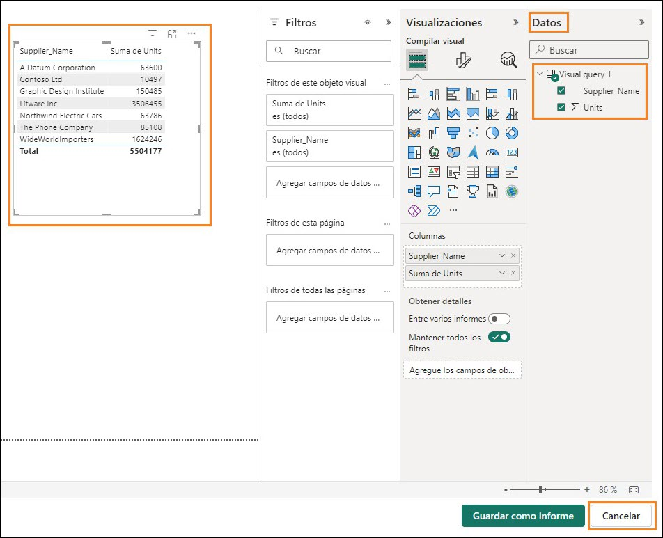

 
### Tâche 5 : créer des relations
Nous sommes maintenant prêts à créer le modèle, des relations entre les tables et des mesures.
1.	Dans le **volet inférieur**, cliquez sur **Modèle**. Notez que le volet central ressemble à la vue Modèle que nous voyons dans Power BI Desktop.
2.	**Redimensionnez et réorganisez** les tables si nécessaire.
3.	Créons une relation entre les tables Sales et Reseller. Sélectionnez la valeur **ResellerID** dans la table **Sales** et faites-la glisser vers la valeur **ResellerID** dans la table **Reseller**.

    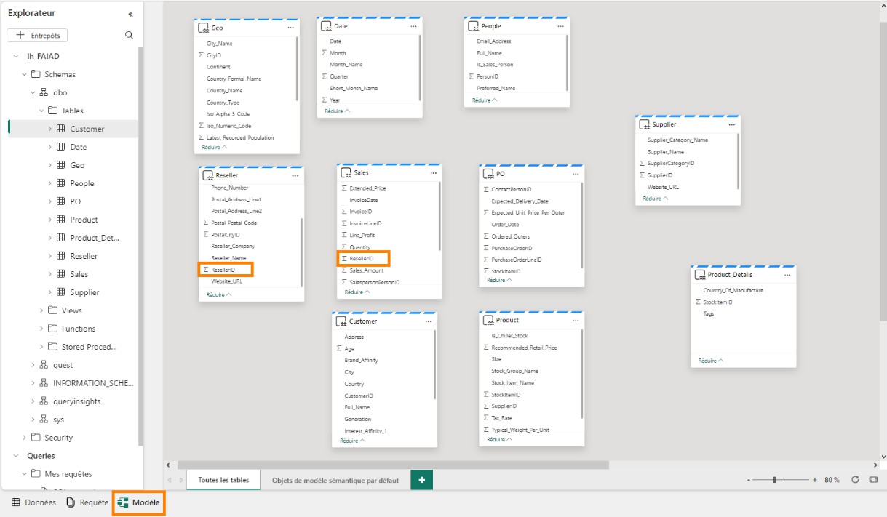

4.	La boîte de dialogue Nouvelle relation s’ouvre alors. Assurez-vous que le champ **Table 1** est défini sur Sales et le paramètre **Colonne** sur **ResellerID**.
5.	Assurez-vous que le champ **Table 2** est défini sur **Reseller** et le paramètre **Colonne** sur
**ResellerID**.
6.	Assurez-vous que le champ **Cardinalité** est défini sur **Plusieurs à un (*:1)**.
7.	Assurez-vous que le champ **Direction du filtre croisé** est défini sur **Single**.
8.	Cliquez sur **OK**.

    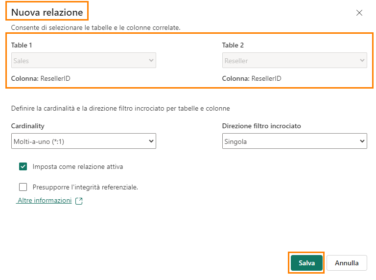

9.	De même, créez une relation entre les tables Sales et Date. Sélectionnez la valeur **InvoiceDate**
dans la table **Sales** et faites-la glisser vers la valeur **Date** dans la table **Date**.
 
10.	La boîte de dialogue Nouvelle relation s’ouvre alors. Assurez-vous que le champ **Table 1** est défini sur **Sales** et le paramètre **Colonne** sur **InvoiceDate**.
11.	Assurez-vous que le champ **Table 2** est défini sur **Date** et le paramètre **Colonne** sur **Date**.
12.	Assurez-vous que le champ **Cardinalité** est défini sur **Plusieurs à un (*:1)**.
13.	Assurez-vous que le champ **Direction du filtre croisé** est défini sur **Single**.
14.	Cliquez sur **OK**.

    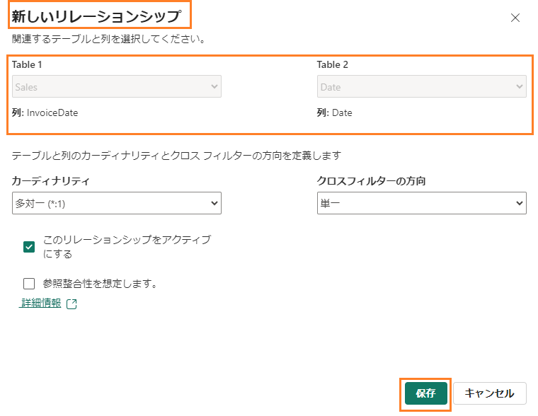

15.	De même, créez une relation **plusieurs-à-un** entre les tables **Sales** et **Product**. Sélectionnez la valeur **StockItemID** dans la table **Sales** et la valeur **StockItemID** dans la table **Product**.
16.	Dans le menu supérieur, **sélectionnez Reporting -> Mettre à jour automatiquement le modèle sémantique** pour enregistrer et mettre à jour le modèle.

    

**Point de contrôle :** votre modèle devrait comporter les trois relations entre les tables Sales et Reseller, les tables Sales et Date, et les tables Sales et Product, comme illustré dans la capture d’écran ci-dessous :

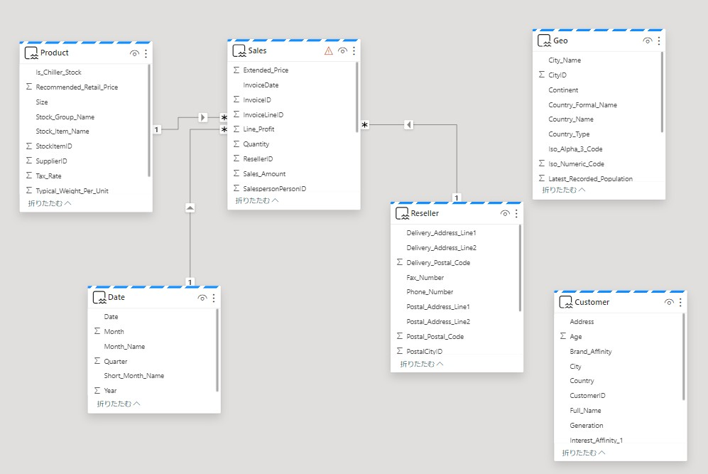
 
 
Pour gagner du temps, nous n’allons pas créer toutes les relations. Si le temps le permet, vous
pouvez suivre la section facultative à la fin du labo. La section facultative passe en revue les étapes permettant de créer les relations restantes.


### Tâche 6 : créer des mesures
Ajoutons quelques mesures dont nous avons besoin pour créer le tableau de bord Ventes.
1.	Cliquez sur la table **Sales** dans la vue de modèle. Nous souhaitons ajouter les mesures à la table Sales.
2.	Dans le menu supérieur, cliquez sur **Accueil -> Nouvelle mesure**. Notez que la barre de formule s’affiche.
3.	Saisissez **Sales = SUM(Sales[Sales_Amount])** dans la **barre de formule**.
4.	Cliquez sur la **coche** à gauche de la barre de formule ou appuyez sur la touche **Entrée**.
5.	Dans le volet Propriétés à droite, développez la section **Mise en forme**.
6.	Dans la liste déroulante **Format**, sélectionnez **Nombre entier**.

    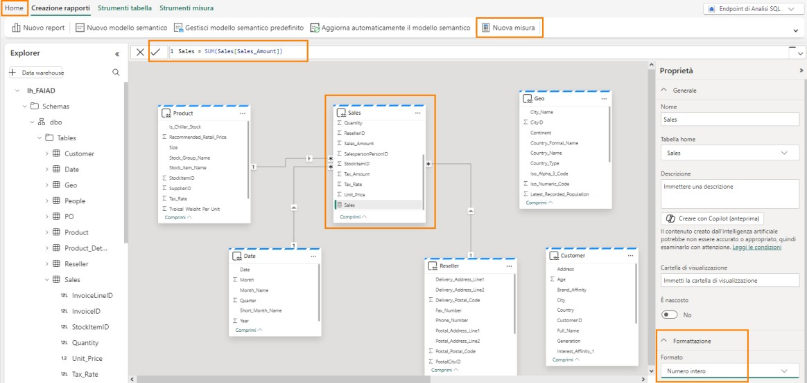
 
 
7.	Une fois la table **Sales** sélectionnée dans le menu supérieur, cliquez sur **Accueil -> Nouvelle mesure**. Notez que la barre de formule s’affiche.
8.	Saisissez **Units = SUM(Sales[Quantity])** dans la **barre de formule**.
9.	Cliquez sur la **coche** à gauche de la barre de formule ou appuyez sur la touche **Entrée**.
10.	Dans le volet Propriétés à droite, développez la section **Mise en forme**. (Le chargement du volet Propriétés peut prendre quelques instants.)
11.	Dans la liste déroulante **Format**, sélectionnez **Nombre entier**.

    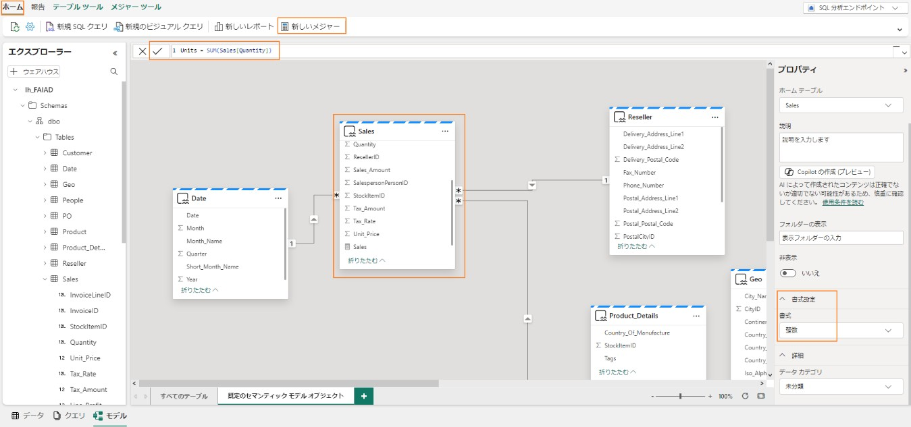

12.	Une fois la table **Sales** sélectionnée dans le menu supérieur, cliquez sur **Accueil -> Nouvelle mesure**. Notez que la barre de formule s’affiche.
13.	Saisissez **Orders = DISTINCTCOUNT(Sales[InvoiceID])** dans la **barre de formule**.
14.	Cliquez sur la **coche** à gauche de la barre de formule ou appuyez sur la touche **Entrée**.
15.	Dans le volet Propriétés à droite, développez la section **Mise en forme**.
16.	Dans la liste déroulante **Format**, sélectionnez **Nombre entier**.
 
    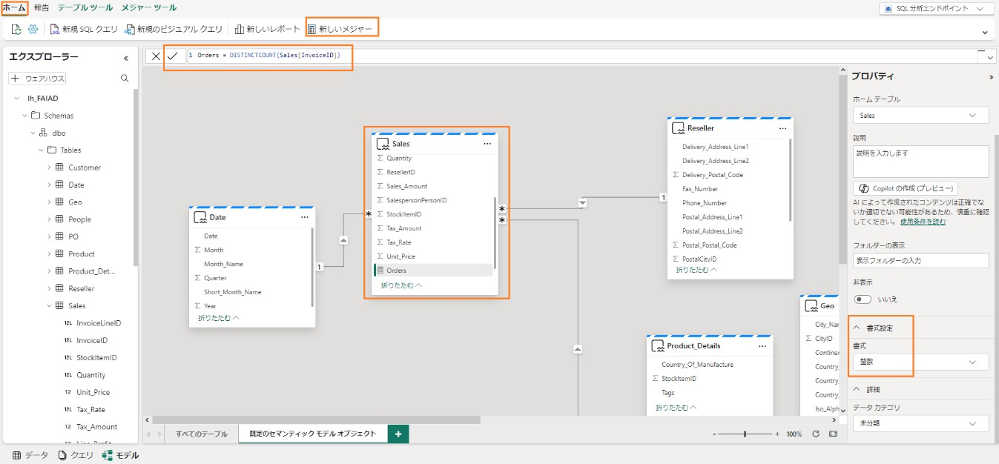

Encore une fois, pour gagner du temps, nous n’allons pas créer toutes les mesures. Si le temps le permet, vous pouvez suivre la section facultative à la fin du labo. La section facultative passe en revue les étapes permettant de créer les mesures restantes.

Nous avons créé un modèle de données et l’étape suivante consiste à créer un état. Nous allons le faire dans le prochain labo.

### Tâche 7 : section facultative - Créer des relations
Ajoutons les relations restantes.

1.	De même, créez une relation **plusieurs-à-un** entre les tables **Sales** et **People**. Sélectionnez la valeur **SalespersonPersonID** dans la table **Sales** et la valeur **PersonID** dans la table **People**.

    **Point de contrôle :** votre modèle devrait ressembler à la capture d’écran ci-dessous.

    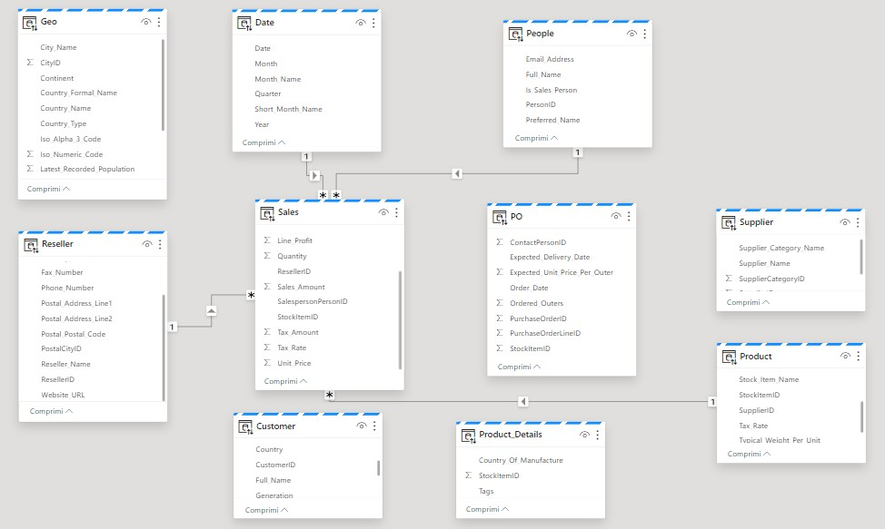

2.	Créons maintenant une relation entre les tables Product et Supplier. Sélectionnez la valeur **SupplierID** dans la table **Product** et faites-la glisser vers la valeur **SupplierID** dans la table **Supplier**.
3.	La boîte de dialogue Nouvelle relation s’ouvre alors. Assurez-vous que le champ **Table 1** est défini sur **Product** et le paramètre **Colonne** sur **SupplierID**.
4.	Assurez-vous que le champ **Table 2** est défini sur **Supplier** et le paramètre **Colonne** sur
**SupplierID**.
5.	Assurez-vous que le champ **Cardinalité** est défini sur **Plusieurs à un (*:1)**.
6.	Assurez-vous que le champ **Direction du filtre croisé** est défini sur **À double sens**.
7.	Cliquez sur **OK**.

    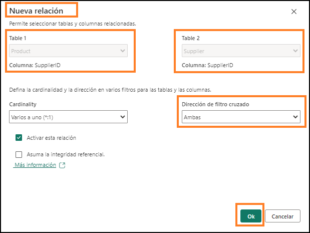

8.	De même, créez une relation **plusieurs-à-un** avec le champ **Direction du filtre croisé** défini sur **À double sens** entre les tables **Product_Details** et **Product**. Sélectionnez la valeur **StockItemID** dans la table **Product_Details** et la valeur **StockItemID** dans la table **Product**.
9.	Créons maintenant une relation entre les tables Reseller et Geo. Sélectionnez la valeur
**PostalCityID** dans la table **Reseller** et faites-la glisser vers la valeur **CityID** dans la table **Geo**.
 
10.	La boîte de dialogue Nouvelle relation s’ouvre alors. Assurez-vous que le champ **Table 1** est défini sur **Reseller** et le paramètre **Colonne** sur **PostalCityID**.
11.	Assurez-vous que le champ **Table 2** est défini sur **Geo** et le paramètre **Colonne** sur **CityID**.
12.	Assurez-vous que le champ **Cardinalité** est défini sur **Plusieurs à un (*:1)**.
13.	Assurez-vous que le champ **Direction du filtre croisé** est défini sur **À double sens**.
14.	Cliquez sur **OK**.

    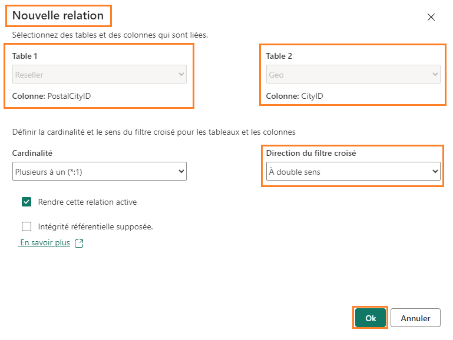

15.	Créons maintenant une relation entre les tables Customer et Reseller. Sélectionnez la valeur **ResellerID** dans la table **Customer** et faites-la glisser vers la valeur **ResellerID** dans la table Reseller.
16.	La boîte de dialogue Nouvelle relation s’ouvre alors. Assurez-vous que le champ **Table 1** est défini sur **Customer** et le paramètre **Colonne** sur **ResellerID**.
17.	Assurez-vous que le champ **Table 2** est défini sur **Reseller** et le paramètre **Colonne** sur
**ResellerID**.
18.	Assurez-vous que le champ **Cardinalité** est défini sur **Plusieurs à un (*:1)**.
19.	Assurez-vous que le champ **Direction du filtre croisé** est défini sur **Single**.
20.	Cliquez sur **OK**.

    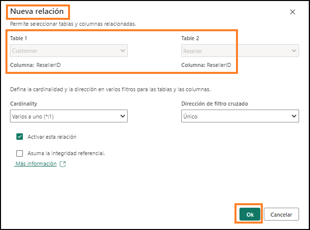

    
    **Point de contrôle**: votre modèle devrait ressembler à la capture d’écran ci-dessous.

    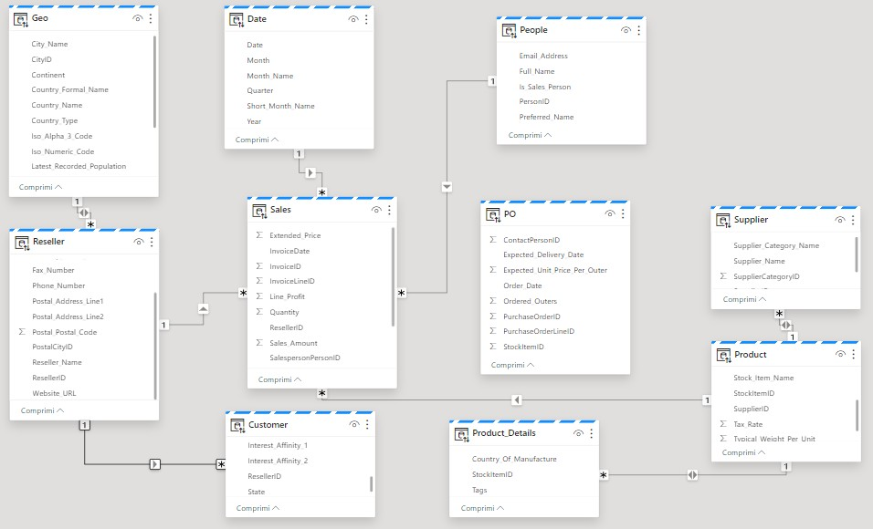

21.	Créons maintenant une relation entre les tables PO et Date. Sélectionnez la valeur **Order_Date**
dans la table **PO** et faites-la glisser vers la valeur **Date** dans la table **Date**.
22.	La boîte de dialogue Nouvelle relation s’ouvre alors. Assurez-vous que le champ **Table 1** est défini sur **PO** et le paramètre **Colonne** sur **Order_Date**.
23.	Assurez-vous que le champ **Table 2** est défini sur **Date** et le paramètre **Colonne** sur **Date**.
24.	Assurez-vous que le champ **Cardinalité** est défini sur **Plusieurs à un (*:1)**.
25.	Assurez-vous que le champ **Direction du filtre croisé** est défini sur **Single**.
26.	Cliquez sur **OK**.

    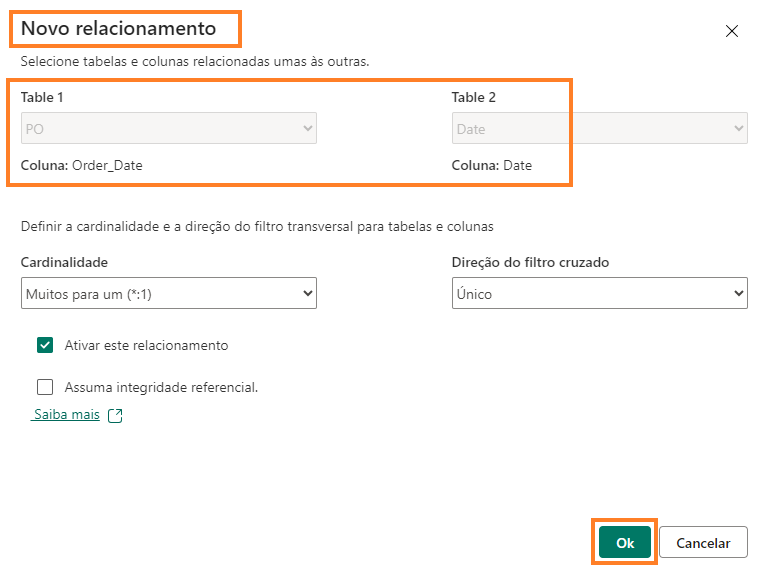

27.	De même, créez une relation **plusieurs-à-un** entre les tables **PO** et **Product**. Sélectionnez la valeur **StockItemID** dans la table PO et la valeur **StockItemID** dans la table **Product**.
28.	De même, créez une relation **plusieurs-à-un** entre les tables **PO** et **People**. Sélectionnez la valeur
**ContactPersonID** dans la table **PO** et la valeur **PersonID** dans la table **People**.
 
Nous avons fini de créer toutes les relations.

**Point de contrôle :** votre modèle devrait ressembler à la capture d’écran ci-dessous.

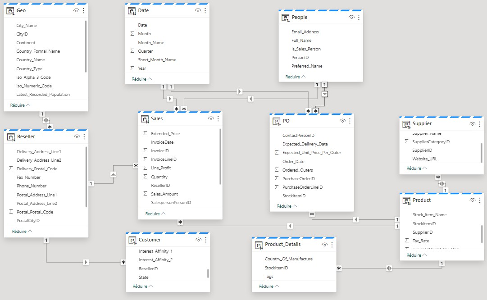

### Tâche 8 : section facultative - Créer des mesures
Ajoutons les mesures restantes.
1.	Sélectionnez la table **Sales** et dans le menu supérieur, cliquez sur **Outils de table -> Nouvelle mesure**.
2.	Saisissez **Avg Order = DIVIDE([Sales], [Orders])** dans la barre de formule.
3.	Cliquez sur la **coche** dans la barre de formule ou appuyez sur la touche Entrée.
4.	Une fois la mesure enregistrée, notez l’option Outils de mesure dans le menu supérieur. Cliquez sur **Outils de mesure**.
5.	Dans la liste déroulante Format, sélectionnez **Nombre décimal**.

    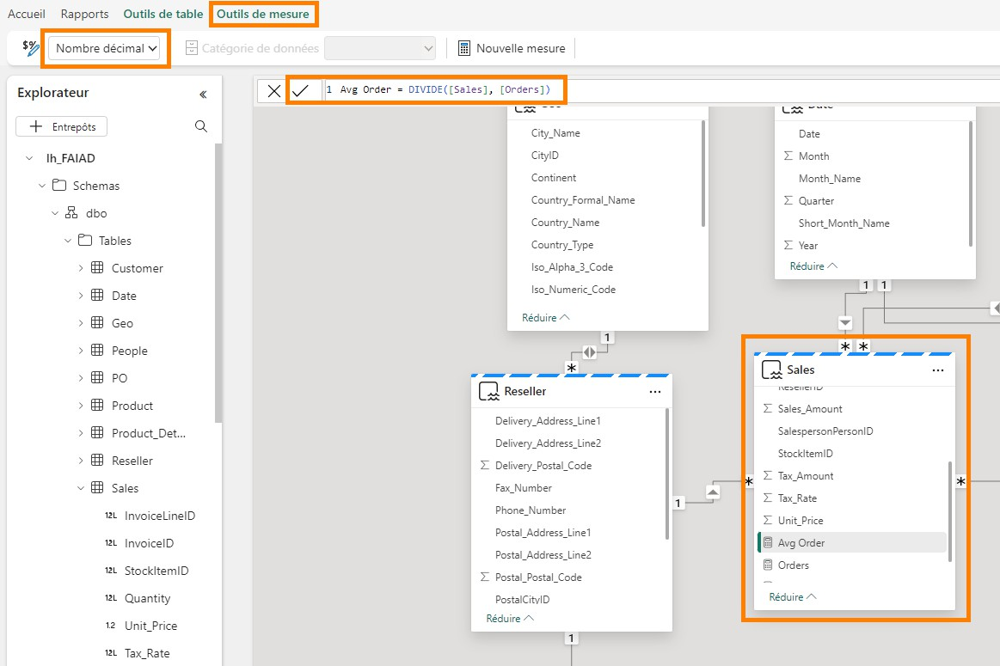
 
 
6. Suivez des étapes similaires pour ajouter les mesures suivantes :

    a.	**GM = SUM(Sales[Line_Profit])** au format **Nombre décimal**.

    b.	**GM% = DIVIDE([GM], [Sales])** au format **Pourcentage**.

    c.	**No of Customers = COUNTROWS(Customer)** au format **Nombre entier**
 
### Références
Fabric Analyst in a Day (FAIAD) vous présente certaines des fonctions clés de Microsoft Fabric. Dans le menu du service, la section Aide (?) comporte des liens vers d’excellentes ressources.

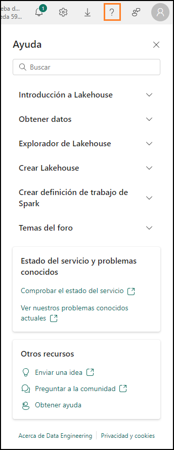

Voici quelques autres ressources qui vous aideront lors de vos prochaines étapes avec Microsoft Fabric :
- Consultez le billet de blog pour lire l’intégralité de l’[annonce de la GA de Microsoft Fabric](https://aka.ms/Fabric-Hero-Blog-Ignite23).
- Explorez Fabric grâce à la [visite guidée](https://aka.ms/Fabric-GuidedTour).
- Inscrivez-vous pour bénéficier d’un [essai gratuit de Microsoft Fabric](https://aka.ms/try-fabric).
- Rendez-vous sur le [site web Microsoft Fabric](https://aka.ms/microsoft-fabric).
- Acquérez de nouvelles compétences en explorant les [modules d’apprentissage Fabric](https://aka.ms/learn-fabric).
- Explorez la [documentation technique Fabric](https://aka.ms/fabric-docs).
- Lisez le [livre électronique gratuit sur la prise en main de Fabric](https://aka.ms/fabric-get-started-ebook).
- Rejoignez la [communauté Fabric](https://aka.ms/fabric-community) pour publier vos questions, partager vos commentaires et apprendre des autres.

Lisez les blogs d’annonces plus détaillés sur l’expérience Fabric :

- [Blog Expérience Data Factory dans Fabric](https://aka.ms/Fabric-Data-Factory-Blog)
- [Blog Expérience Synapse Data Engineering dans Fabric](https://aka.ms/Fabric-DE-Blog)
- [Blog Expérience Synapse Data Science dans Fabric](https://aka.ms/Fabric-DS-Blog)
- [Blog Expérience Synapse Data Warehousing dans Fabric](https://aka.ms/Fabric-DW-Blog)
- [Blog Expérience Synapse Real-Time Analytics dans Fabric](https://aka.ms/Fabric-RTA-Blog)
- [Blog Annonce Power BI](https://aka.ms/Fabric-PBI-Blog)
- [Blog Expérience Data Activator dans Fabric](https://aka.ms/Fabric-DA-Blog)
- [Blog Administration et gouvernance dans Fabric](https://aka.ms/Fabric-Admin-Gov-Blog)
- [Blog OneLake dans Fabric](https://aka.ms/Fabric-OneLake-Blog)
- [Blog Intégration de Dataverse et Microsoft Fabric](https://aka.ms/Dataverse-Fabric-Blog)


© 2023 Microsoft Corporation. Tous droits réservés.
En effectuant cette démonstration/ce labo, vous acceptez les conditions suivantes :

La technologie/fonctionnalité décrite dans cette démonstration/ces travaux pratiques est fournie par Microsoft Corporation en vue d’obtenir vos commentaires et de vous fournir une expérience d’apprentissage. Vous pouvez utiliser cette démonstration/ces ateliers uniquement pour évaluer ces technologies et fonctionnalités, et pour fournir des commentaires à Microsoft. Vous ne pouvez pas l’utiliser à d’autres fins. Vous ne pouvez pas modifier, copier, distribuer, transmettre, afficher, effectuer, reproduire, publier, accorder une licence, créer des œuvres dérivées, transférer ou vendre tout ou une partie de cette démonstration/ces ateliers.

LA COPIE OU LA REPRODUCTION DE CETTE DÉMONSTRATION/CES TRAVAUX PRATIQUES (OU DE TOUTE PARTIE DE CEUX-CI) SUR TOUT AUTRE SERVEUR OU AUTRE EMPLACEMENT EN VUE D’UNE AUTRE REPRODUCTION OU REDISTRIBUTION EST EXPRESSÉMENT INTERDITE.
CETTE DÉMONSTRATION/CES TRAVAUX PRATIQUES FOURNISSENT CERTAINES FONCTIONNALITÉS DE PRODUIT/TECHNOLOGIES LOGICIELLES, NOTAMMENT D’ÉVENTUELS NOUVEAUX CONCEPTS ET FONCTIONNALITÉS, DANS UN ENVIRONNEMENT SIMULÉ SANS INSTALLATION OU CONFIGURATION
COMPLEXE AUX FINS DÉCRITES CI-DESSUS. LES TECHNOLOGIES/CONCEPTS REPRÉSENTÉS DANS CETTE DÉMONSTRATION/CES TRAVAUX PRATIQUES PEUVENT NE PAS REPRÉSENTER LES FONCTIONNALITÉS COMPLÈTES ET PEUVENT NE PAS FONCTIONNER DE LA MÊME MANIÈRE QUE DANS UNE VERSION FINALE. IL EST ÉGALEMENT POSSIBLE QUE NOUS NE PUBLIIONS PAS DE VERSION FINALE DE CES FONCTIONNALITÉS OU CONCEPTS. VOTRE EXPÉRIENCE D’UTILISATION DE CES FONCTIONNALITÉS DANS UN ENVIRONNEMENT PHYSIQUE PEUT ÉGALEMENT ÊTRE DIFFÉRENTE.

**COMMENTAIRES.** Si vous envoyez des commentaires sur les fonctionnalités, technologies et/ou concepts décrits dans ces ateliers/cette démonstration à Microsoft, vous accordez à Microsoft, sans frais, le droit d’utiliser, de partager et de commercialiser vos commentaires de quelque
manière et à quelque fin que ce soit. Vous accordez également à des tiers, sans frais, les droits de brevet nécessaires pour leurs produits, technologies et services en vue de l’utilisation ou
de l’interface avec des parties spécifiques d’un logiciel ou d’un service Microsoft incluant les commentaires. Vous n’enverrez pas de commentaires soumis à une licence exigeant que
Microsoft accorde une licence pour son logiciel ou sa documentation à des tiers du fait que nous y incluons vos commentaires. Ces droits survivent à ce contrat.

MICROSOFT CORPORATION DÉCLINE TOUTES LES GARANTIES ET CONDITIONS EN CE
QUI CONCERNE CETTE DÉMONSTRATION/CES TRAVAUX PRATIQUES, Y COMPRIS TOUTES LES GARANTIES ET CONDITIONS DE QUALITÉ MARCHANDE, QU’ELLES SOIENT EXPLICITES,
IMPLICITES OU LÉGALES, D’ADÉQUATION À UN USAGE PARTICULIER, DE TITRE ET D’ABSENCE
DE CONTREFAÇON. MICROSOFT N’OFFRE AUCUNE GARANTIE OU REPRÉSENTATION EN CE QUI CONCERNE LA PRÉCISION DES RÉSULTATS, LA CONSÉQUENCE QUI DÉCOULE DE L’UTILISATION
DE CETTE DÉMONSTRATION/CES ATELIERS, OU L’ADÉQUATION DES INFORMATIONS CONTENUES DANS CETTE DÉMONSTRATION/CES ATELIERS À QUELQUE FIN QUE CE SOIT.
 
**CLAUSE D’EXCLUSION DE RESPONSABILITÉ**
Cette démonstration/Ce labo comporte seulement une partie des nouvelles fonctionnalités et améliorations disponibles dans Microsoft Power BI. Certaines fonctionnalités sont susceptibles
de changer dans les versions ultérieures du produit. Dans ce labo/cette démonstration, vous allez découvrir comment utiliser certaines nouvelles fonctionnalités, mais pas toutes.

