## Sumário
- Introdução
- Lakehouse
  - Tarefa 1: Consultar dados usando SQL
  - Tarefa 2: Visualizar resultado de T-SQL
  - Tarefa 3: Criar consulta de visual
  - Tarefa 4: Visualizar os resultados da consulta	
  - Tarefa 5: Criar relacionamentos	
  - Tarefa 6: Criar medidas	
  - Tarefa 7: Seção Opcional – Criar relacionamentos	
  - Tarefa 8: Seção Opcional – Criar medidas	
- Referências	

## Introdução
Temos dados de diversas fontes ingeridos no Lakehouse. Neste laboratório, você trabalhará com o modelo de dados. Geralmente, realizamos atividades de modelagem, como criar relacionamentos, adicionar medidas, etc. no Power BI Desktop. Aqui aprenderemos como realizar essas atividades de modelagem no serviço.

Ao final deste laboratório, você terá aprendido:
  - Como explorar o Lakehouse
  - Como explorar a exibição de SQL do Lakehouse
  - Como explorar a modelagem de dados no Lakehouse

## Lakehouse
### Tarefa 1: Consultar dados usando SQL
1. Vamos voltar ao workspace do Fabric, **FAIAD_<nome de usuário>,** que você criou no Laboratório 2, Tarefa 9.
2. Você verá três tipos de lh_FAIAD: Lakehouse, Modelo semântico e Ponto de extremidade de SQL. Exploramos a opção Lakehouse em um laboratório anterior. Selecione a opção **lh_FAIAD -> Ponto de extremidade de análise de SQL** para explorar a opção SQL. Você será direcionado à **exibição de SQL** do explorador.

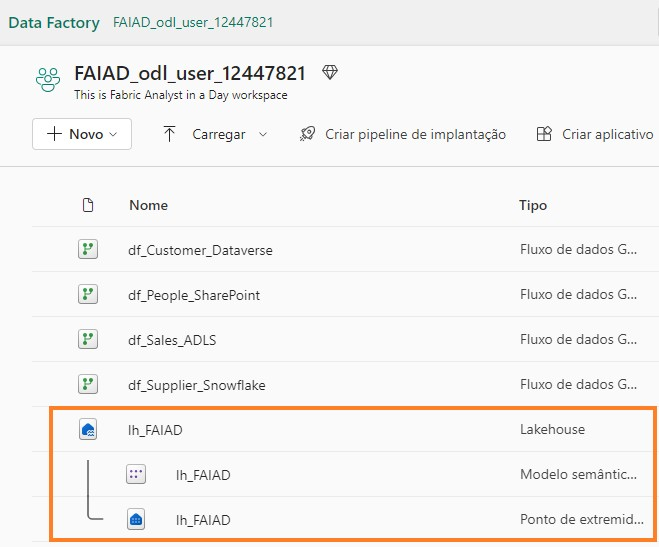

Se desejar explorar os dados antes de criar um modelo de dados, você poderá usar SQL para fazer isso. Vejamos duas opções para usar SQL, a primeira é para desenvolvedor e a segunda opção é para analistas.

Vamos supor que você queira descobrir rapidamente as Unidades vendidas por Fornecedor usando SQL. Temos duas opções: escrever uma instrução SQL ou usar um visual para criar a instrução SQL.

No painel esquerdo, você pode visualizar as Tabelas. Se você expandir as tabelas, poderá visualizar as Colunas que compõem a tabela. Além disso, existem opções para criar Visualizações, Funções
e Procedimentos Armazenados de SQL. Se você tiver experiência em SQL, fique à vontade para explorar essas opções. Vamos tentar escrever uma consulta SQL simples.
 
3. No **menu superior** selecione **Nova consulta SQL** ou na **parte inferior o painel esquerdo,** selecione **Consulta.** Você será direcionado à visualização da consulta SQL.

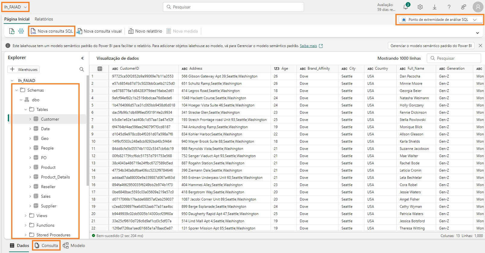

4. Cole a **consulta SQL abaixo** na **janela de consultas.** Essa consulta retornará as unidades por Nome do Fornecedor. Para conseguir isso, una tabela Sales com as tabelas Product e Supplier.

        SELECT su.Supplier_Name, SUM(Quantity) as Units
        FROM dbo.Sales s
        JOIN dbo.Product p on p.StockItemID = s.StockItemID
        JOIN dbo.Supplier su on su.SupplierID = p.SupplierID 
        GROUP BY su.Supplier_Name

5. Clique em **Executar** para exibir os resultados.
6. Há uma opção para salvar essa consulta como uma Visualização selecionando **Salvar como visualização.**
7. No painel **esquerdo Explorador,** na seção **Consultas,** observe que esta consulta é salva em **Minhas consultas** como **Consulta SQL 1.** Isso fornece uma opção para renomear a consulta e salvá-la para uso futuro. Também há uma opção para visualizar consultas compartilhadas com você usando a pasta **Consultas compartilhadas.**

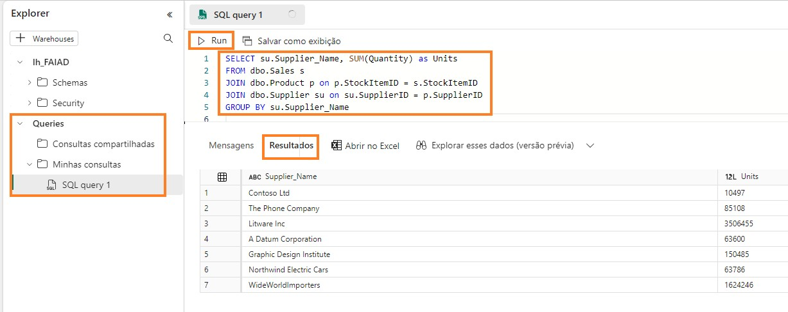 

### Tarefa 2: Visualizar resultado de T-SQL
1. Também podemos visualizar o resultado desta consulta. **Realce a consulta** no painel de consultas, selecione o painel **Resultados** e selecione **Explorar estes dados.**

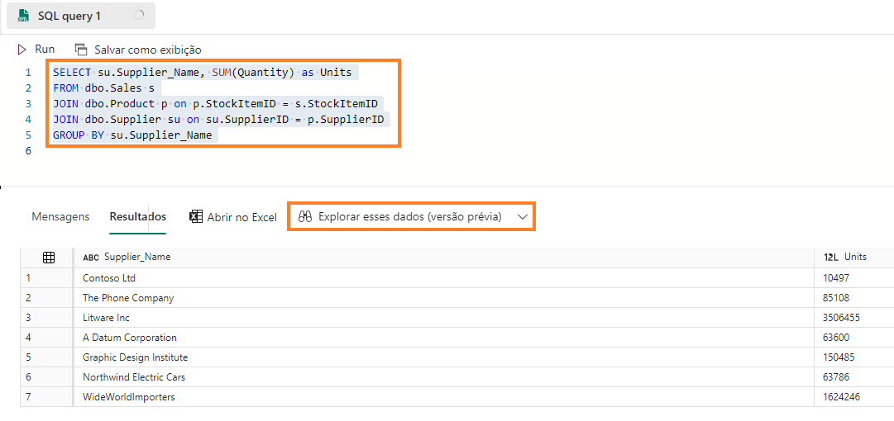

2. A caixa de diálogo **Explorar consulta SQL query** é aberta. No painel **Dados,** expanda **Consulta SQL 1.**
3. Selecione os **campos Supplier_Name** e **Units**. O gráfico de barras clusterizado é criado.
4. Na seção **Visualizações,** altere o tipo de visual selecionando o **Gráfico de colunas empilhadas.**

 
5. **Expanda Matriz** para exibir os dados como uma matriz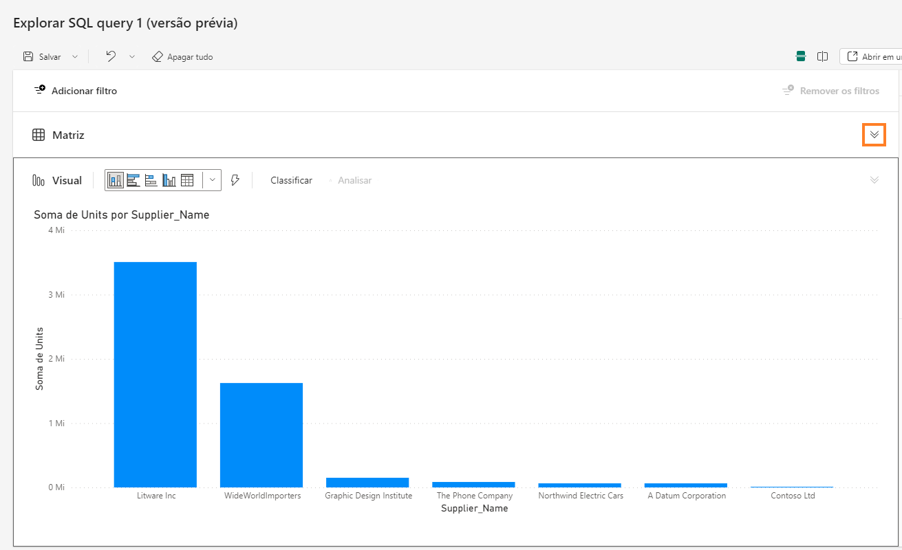

6. Selecione **Salvar -> Salvar como relatório** no canto superior direito da tela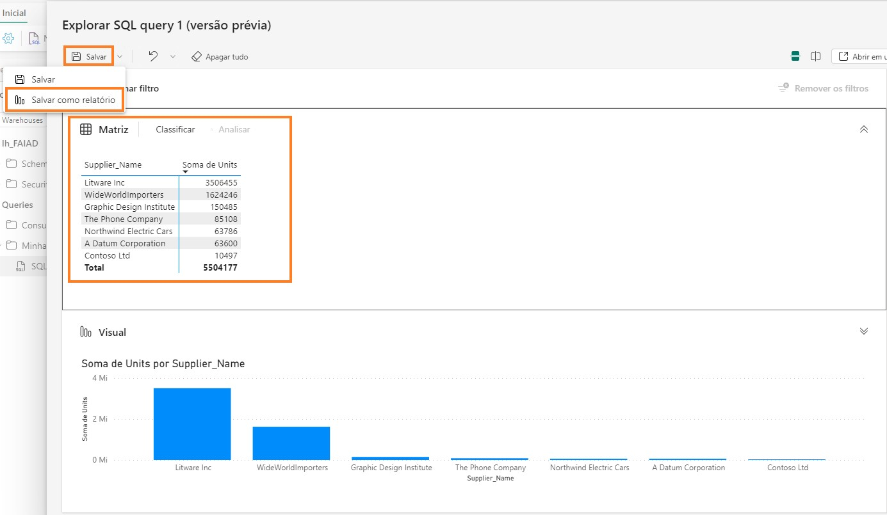

7. A caixa de diálogo Salvar seu relatório é aberta. Digite **Unidades por Fornecedor** na caixa de texto **Inserir um nome para o relatório.**
8. Certifique-se de que o espaço de trabalho de destino seja seu espaço de trabalho do Fabric,
**FAIAD<nome de usuário>.**
 
9. Selecione **Salvar.*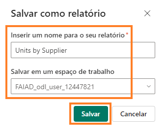

    Você será direcionado para a experiência de relatório completa. Você tem opções para formatar os visuais. Veremos essas opções no próximo laboratório.
10.	No painel esquerdo, selecione **lh_FAIAD.*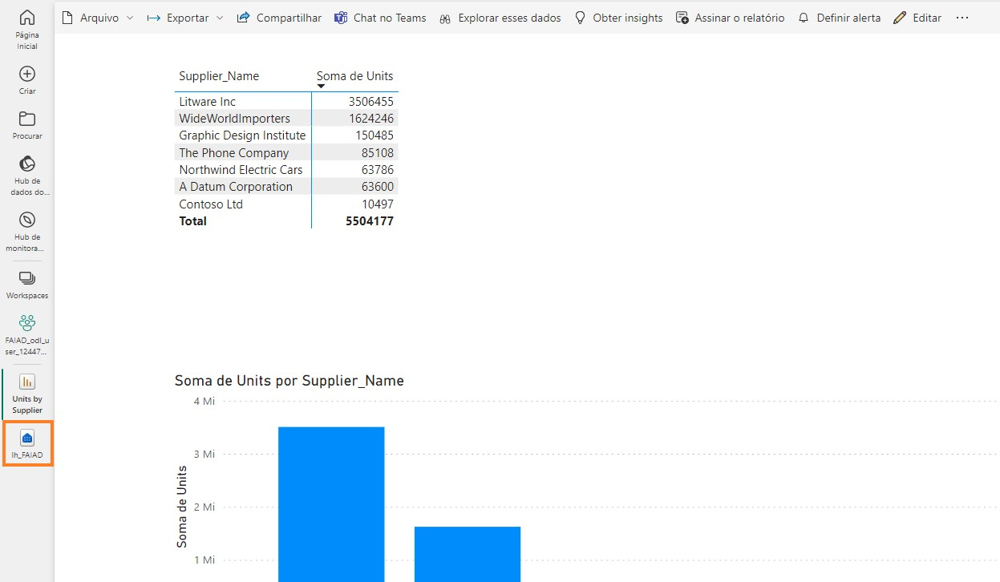

### Tarefa 3: Criar consulta de visual
Você será direcionado de volta à **visualização Ponto de extremidade de análise de SQL.** Se você não estiver familiarizado com SQL, poderá executar uma consulta semelhante usando a consulta de visual.
1. No menu superior, selecione **Nova consulta de visual.** Um painel de consulta de visual é aberto.
2. No painel do **Explorador,** expanda **Esquemas -> dbo -> Tabelas.**
3. Arraste as tabelas **Sales, Product e Supplier** para o painel de consulta de visual.
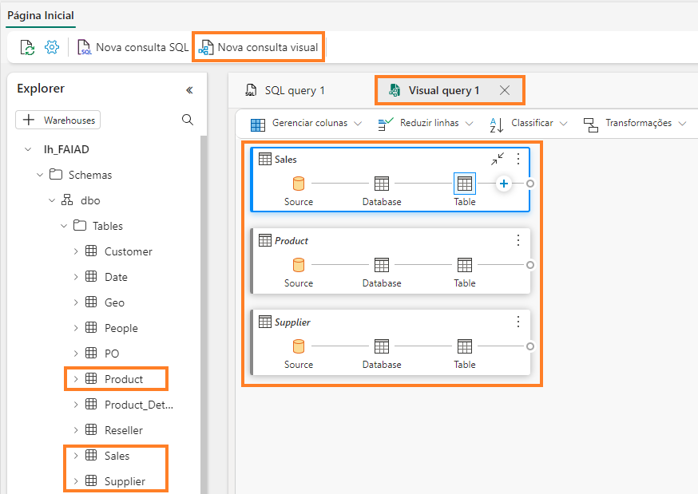

4. Com a tabela **Sales** selecionada, no menu do painel Consulta de visual, selecione **Combinar -> Mesclar consultas.**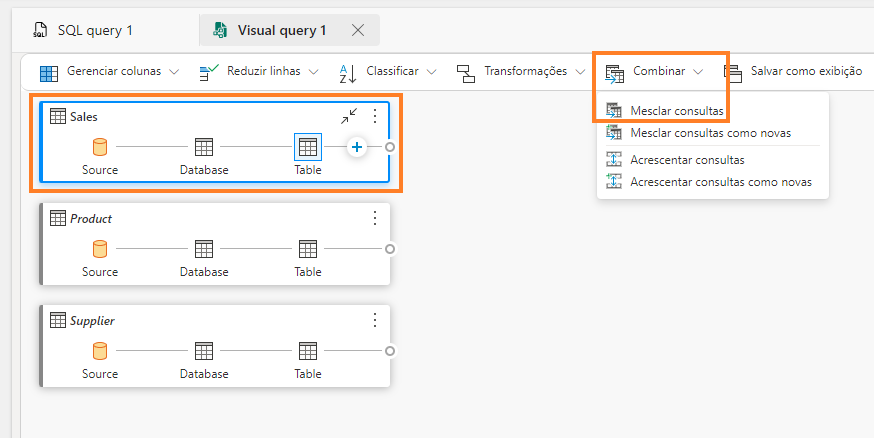

5.	A caixa de diálogo Mesclar é aberta. Na **lista suspensa Tabela direita para mesclagem,** selecione
**Product**.
6. Selecione **StockItemID** nas tabelas **Sales** e **Product.** Isso serve para mesclar as tabelas Product e Sales.
7. Em **Tipo de junção,** selecione **Externa esquerda.**
 
8. Selecione **OK.**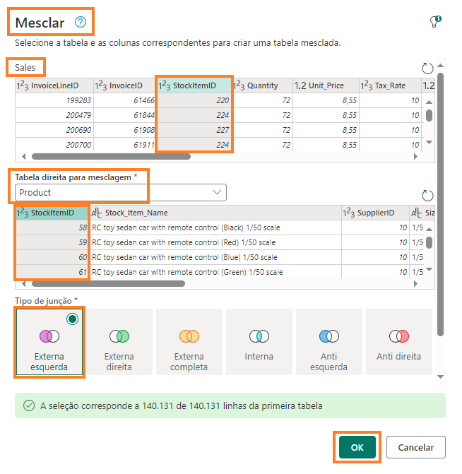

9. No painel **Resultados,** clique na **seta dupla** ao lado da coluna **Product.**
10. A caixa de diálogo é aberta. Selecione **SupplierID.**
11.	Selecione **OK.** Observe que as etapas **Consultas mescladas** e **Produto Expandido** são criadas na tabela **Sales.**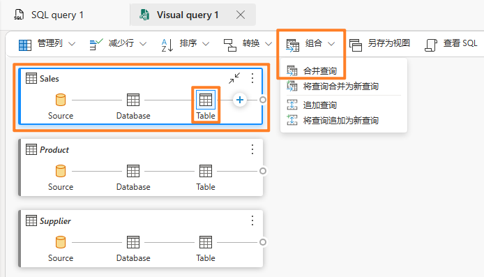

12.	Da mesma forma, vamos mesclar a tabela Supplier. Na tabela **Sales**, selecione **"+"** (localizado após Produto Expandido) para adicionar uma nova etapa. A caixa de diálogo é aberta.
13.	Selecione **Combinar -> Mesclar consultas.**
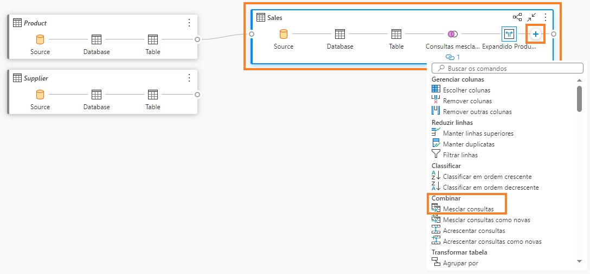 

14.	A caixa de diálogo Mesclar é aberta. Na **lista suspensa Tabela direita para mesclagem,** selecione **Supplier.**
15.	Selecione **SupplierID** nas tabelas **Sales** e **Supplier.** Isso serve para mesclar as tabelas Supplier e Sales.
16.	**Em Tipo de junção,** selecione **Externa esquerda.**
17.	Selecione **OK.**
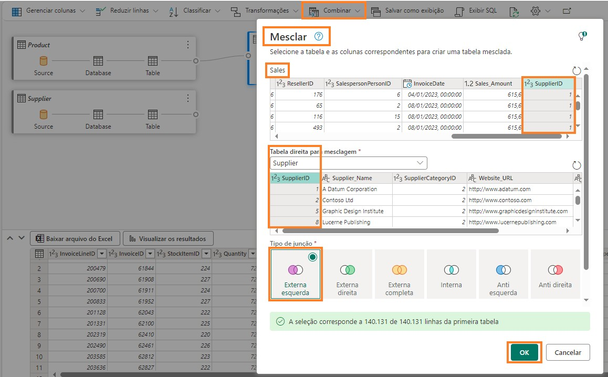

18.	No painel **Resultados**, clique na **seta dupla** ao lado da coluna **Supplier.**
19.	A caixa de diálogo é aberta. Selecione **Supplier_Name.**
20.	Selecione **OK.** Observe que, na tabela Sales, a etapa **Consultas mescladas** é adicionada e **as etapas são registradas.**
 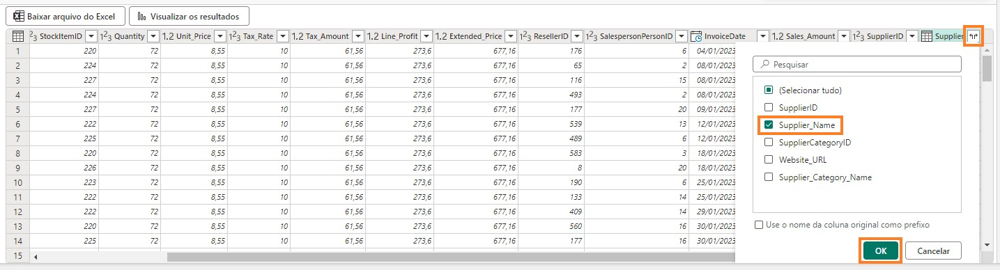 

21.	Vamos agora agrupar por Nome de fornecedor para obter a quantidade por Fornecedor. Na tabela **Sales,** selecione "+" (localizado após Fornecedor Expandido) para adicionar uma nova etapa. A caixa de diálogo é aberta.
22.	Selecione **Transformar tabela -> Agrupar por.** A caixa de diálogo Agrupar por será aberta.
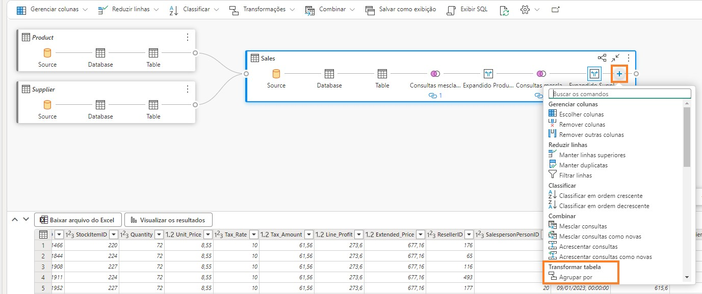

23.	Na lista suspensa **Agrupar por,** selecione **Supplier_Name.**
24.	Insira **Units** como a captura de tela A da caixa de diálogo de consulta de mesclagem.
25.	Defina **Operação** como **Soma.**
26.	Selecione **Quantidade** na lista suspensa **Coluna.**
27.	Selecione **OK.**

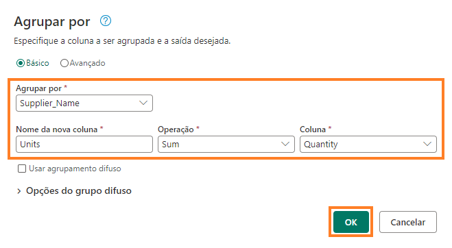

Observe que todas as etapas são registradas no bloco Vendas. (Veja a primeira captura de tela na Tarefa 4.)
 
### Tarefa 4: Visualizar os resultados da consulta
1. Agora que temos a consulta pronta, vamos ver o resultado. Selecione **Visualizar os resultados** no painel de resultados.

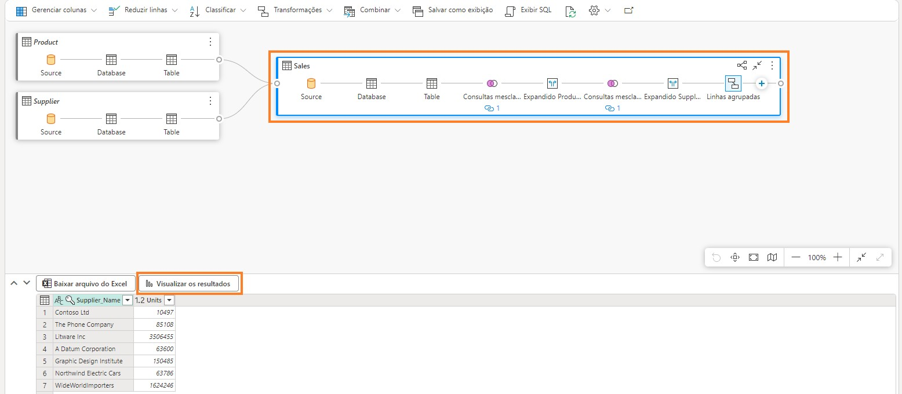

2. A caixa de diálogo Visualizar os resultados é aberta. No painel **Dados** à direita, **expanda Visual query1.**
3. Selecione os campos **Supplier_Name** e **Units.**
4. Observe que o resultado é semelhante ao resultado da consulta SQL anterior. Se desejar, você pode salvar este relatório. Como salvamos um relatório semelhante anteriormente, selecionaremos **Cancelar.**

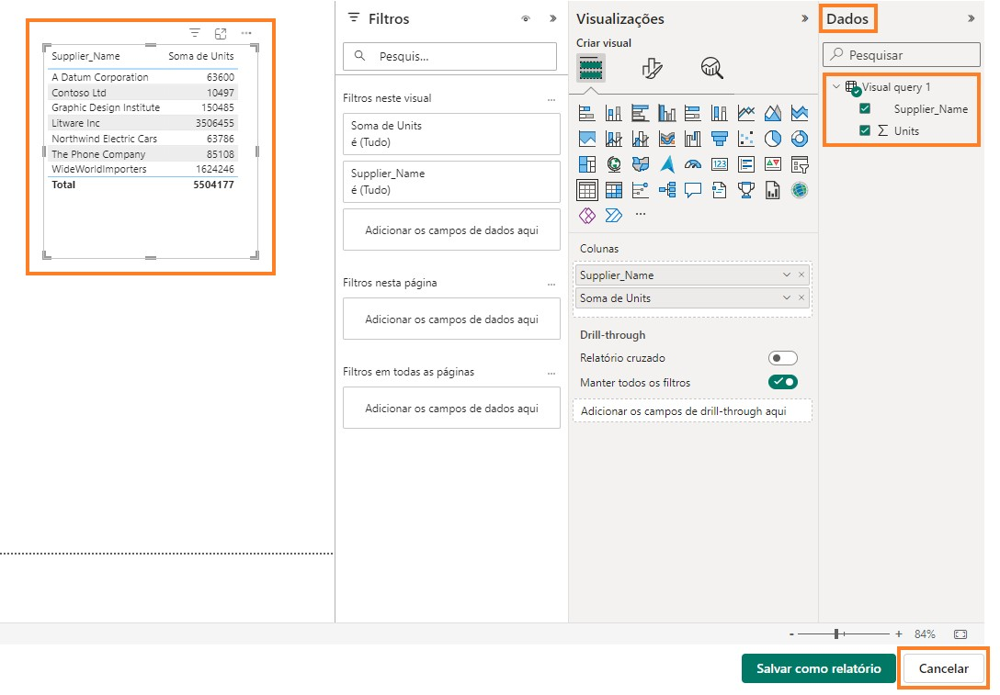
 
### Tarefa 5: Criar relacionamentos
Ok, agora estamos prontos para criar o modelo, criar relacionamentos entre tabelas e criar medidas.
1. No **painel inferior**, selecione **Modelo.** Você observará que o painel central se parece com a visualização Modelo que vemos no Power BI Desktop.
2. **Redimensione e reorganize** as tabelas conforme necessário.
3. Vamos criar um relacionamento entre as tabelas Sales e Reseller. Selecione **ResellerID** na tabela **Sales** e arraste-o para **ResellerID** na tabela **Reseller.**

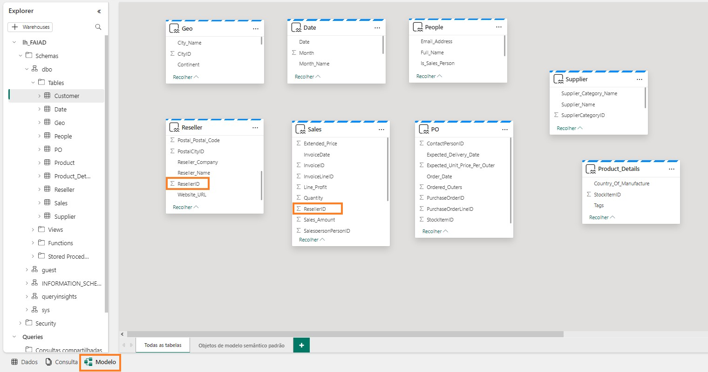

4. A caixa de diálogo Novo relacionamento é aberta. Verifique se **Tabela 1** é **Sales** e **Coluna** é **ResellerID.**
5. Verifique se **Tabela 2** é **Reseller** e **Coluna** é **ResellerID.**
6. Verifique se **Cardinalidade** é **Muitos para um (*:1).**
7. Verifique se **Direção de filtro cruzada** é **Única.**
8. Selecione **OK.**

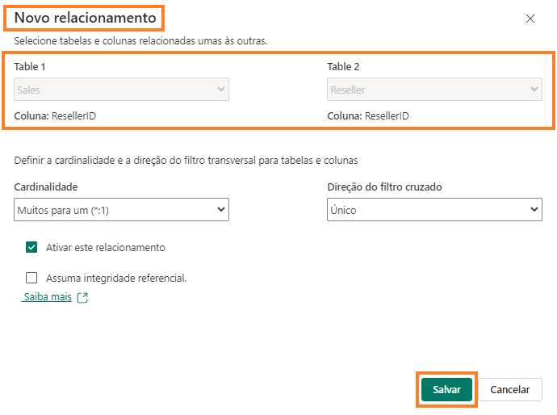
 
9. De maneira semelhante, crie um relacionamento entre as tabelas Sales e Date. Selecione **InvoiceDate** na tabela **Sales** e arraste-o para **Date** na tabela **Date.**
10.	A caixa de diálogo Novo relacionamento é aberta. Verifique se **Tabela 1** é **Sales** e **Coluna**
é **InvoiceDate.**
11.	Verifique se **Tabela 2** é **Date** e **Coluna** é **Date.**
12.	Verifique se **Cardinalidade** é **Muitos para um (*:1).**
13.	Verifique se **Direção de filtro cruzada** é **Única.**
14.	Selecione **OK.*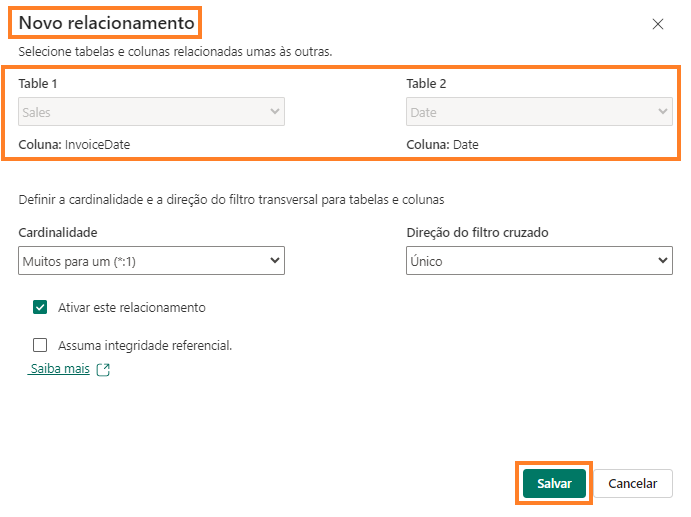

15.	De maneira similar, crie um relacionamento **muitos para um** entre as tabelas **Sales** e **Product.** Selecione **StockItemID** na tabela **Sales** e **StockItemID** na tabela **Product.**
16.	No menu superior, selecione **Relatórios -> Atualizar automaticamente o modelo semântico** para salvar e atualizar o modelo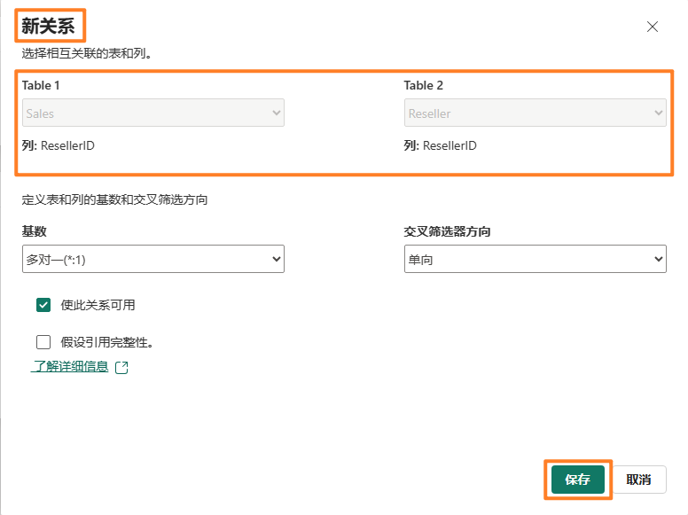

**Ponto de verificação:** seu modelo deve ter os três relacionamentos entre as tabelas Sales e Reseller, Sales e Date e Sales e Product, conforme mostrado na captura de tela abaixo:!

Por uma questão de tempo, não criaremos todos os relacionamentos. Se o tempo permitir, você poderá concluir a seção opcional no fim do laboratório. A seção opcional percorre as etapas para criar os relacionamentos restantes.

### Tarefa 6: Criar medidas
Vamos adicionar algumas medidas necessárias para criar o dashboard Sales.
1. Selecione a tabela **Sales** na visualização do modelo. Queremos adicionar as medidas à tabela Sales.
2. No menu superior, selecione **Página Inicial -> Nova medida.** Observe que a barra de fórmulas é exibida.
3. Insira **Sales = SUM(Sales[Sales_Amount])** na **barra de fórmulas.**
4. Clique na **marca de seleção** à esquerda da barra de fórmulas ou clique no botão **Enter.**
5. No painel Propriedades, à direita, expanda a seção **Formatação.**
6. Na lista suspensa **Formato,** selecione **Número inteiro.**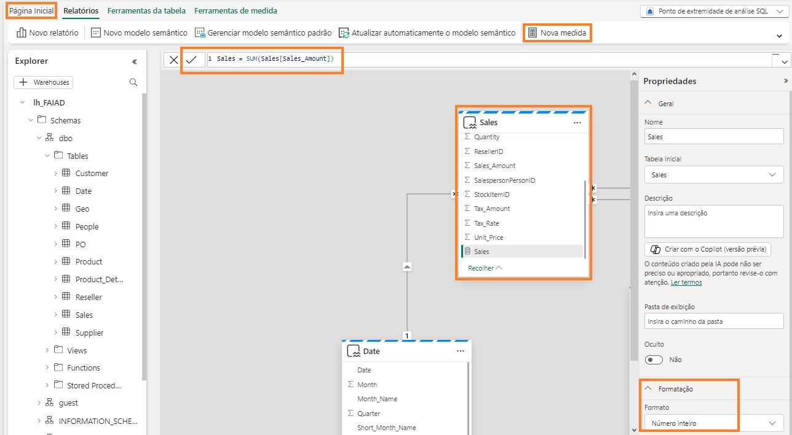
 
7. Com a tabela **Sales** selecionada no menu superior, selecione **Página Inicial -> Nova medida.** Observe que a barra de fórmulas é exibida.
8. Insira **Units = SUM(Sales[Quantity])** na **barra de fórmulas.**
9. Clique na **marca de seleção** à esquerda da barra de fórmulas ou clique no botão **Enter.**
10.	No painel Propriedades à direita, expanda a seção **Formatação** (pode levar alguns instantes para o painel Propriedades carregar).
11.	Na lista suspensa **Formato,** selecione **Número inteiro.**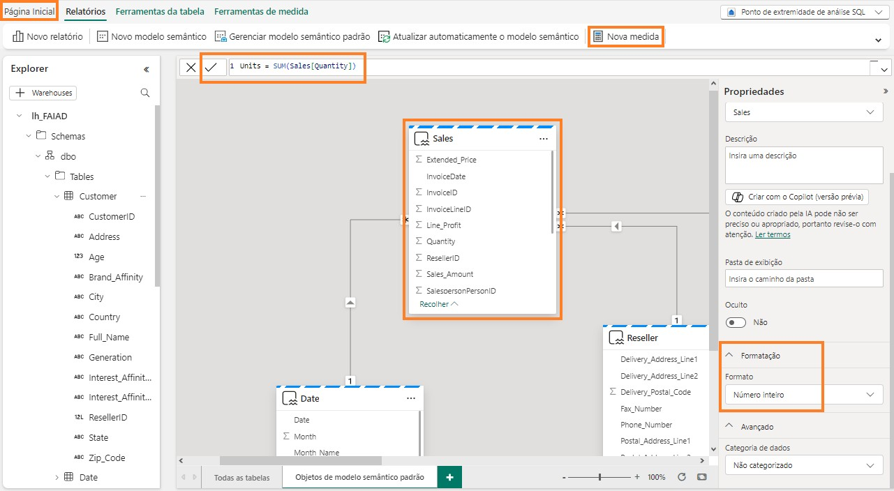

12.	Com a tabela **Sales** selecionada no menu superior, selecione **Página Inicial -> Nova medida.** Observe que a barra de fórmulas é exibida.
13.	Insira **Orders = DISTINCTCOUNT(Sales[InvoiceID])** na **barra de fórmulas.**
14.	Clique na **marca de seleção** à esquerda da barra de fórmulas ou clique no botão **Enter.**
15.	No painel Propriedades, à direita, expanda a seção **Formatação.**
16.	Na lista suspensa **Formato, **selecione **Número inteiro.**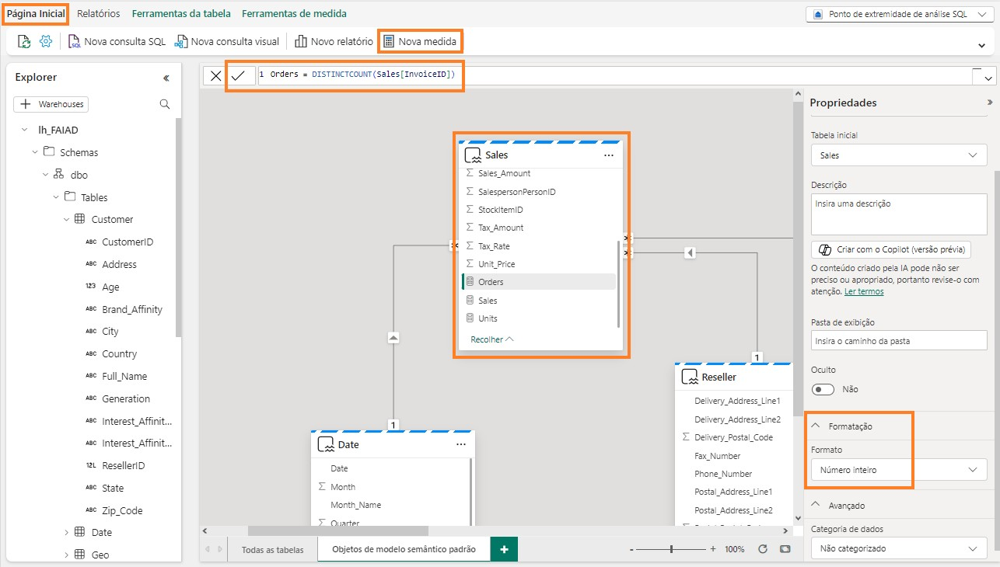
 
Novamente, por uma questão de tempo, não criaremos todas as medidas. Se o tempo permitir, você poderá concluir a seção opcional no fim do laboratório. A seção opcional percorre as etapas para criar as medidas restantes.

Criamos um modelo de dados. A próxima etapa é criar um relatório. Faremos isso no próximo laboratório.

### Tarefa 7: Seção Opcional – Criar relacionamentos
Vamos adicionar os relacionamentos restantes.
1. De maneira similar, crie um relacionamento **muitos para um** entre as tabelas **Sales** e **People.** Selecione **SalespersonPersonID** de **Sales** e **PersonID** de **People.** 

**Ponto de verificação:** Seu modelo deve ser semelhante à captura de tela abaixo.

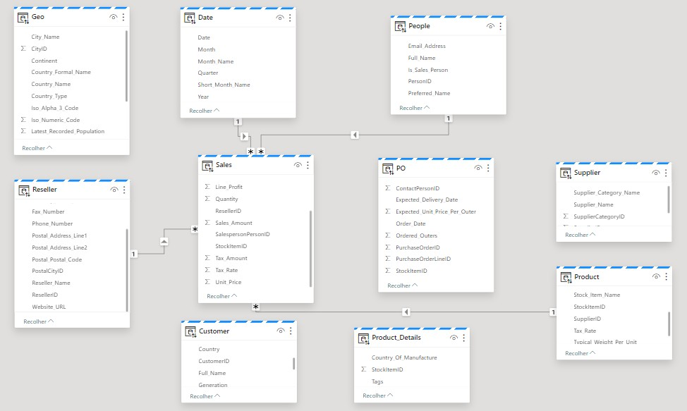

2. Agora, vamos criar um relacionamento entre Product e Supplier. Selecione **SupplierID** na tabela **Product** e arraste-o para **SupplierID** na tabela **Supplier**.
3. A caixa de diálogo Novo relacionamento é aberta. Verifique se **Tabela 1** é **Product** e **Coluna** é **SupplierID.**
4. Verifique se **Tabela 2** é **Supplier** e **Coluna** é **SupplierID.**
5. Verifique se **Cardinalidade** é **Muitos para um (*:1).**
6. Verifique se **Direção de filtro cruzada** é **Ambas.**
7. Selecione **OK.**

 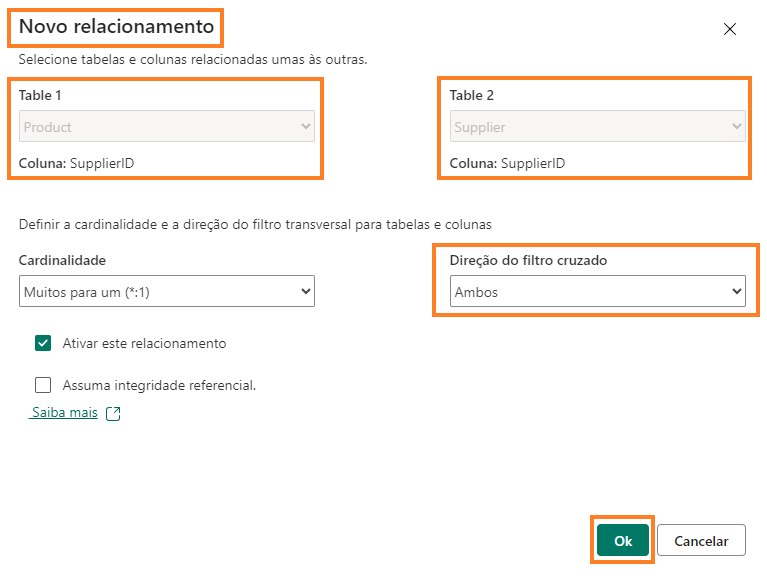

8. Da mesma forma, crie um relacionamento **muitos para um** com **Direção de filtro cruzada** como **Ambas** entre **Product_Details** e **Product.** Selecione **StockItemID** em **Product_Details** e
**StockItemID** em **Product.**
9. Agora, vamos criar um relacionamento entre Reseller e Geo. Selecione **PostalCityID** na tabela **Reseller** e arraste-o sobre **CityID** na tabela **Geo.**
10.	A caixa de diálogo Novo relacionamento é aberta. Verifique se **Tabela 1** é **Reseller** e **Coluna** é **PostalCityID.**
11.	Verifique se **Tabela 2** é **Geo** e **Coluna** é **CityID.**
12.	Verifique se **Cardinalidade** é **Muitos para um (*:1).**
13.	Verifique se **Direção de filtro cruzada** é **Ambas.**
14.	Selecione **OK.**

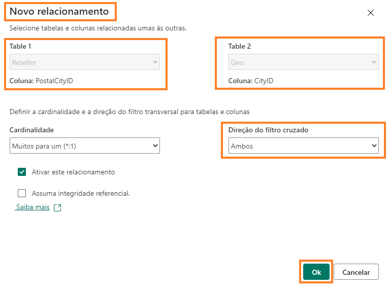

15.	Agora, vamos criar um relacionamento entre Customer e Reseller. Selecione **ResellerID** na tabela **Customer** e arraste-o para **ResellerID** na tabela **Reseller**.
16.	A caixa de diálogo Novo relacionamento é aberta. Verifique se **Tabela 1** é **Customer** e Coluna! é **ResellerID.**
17.	Verifique se **Tabela 2** é **Reseller** e **Coluna** é **ResellerID.**
18.	Verifique se **Cardinalidade** é **Muitos para um (*:1).**
19.	Verifique se **Direção de filtro cruzada é Única.**
20.	Selecione **OK.**
 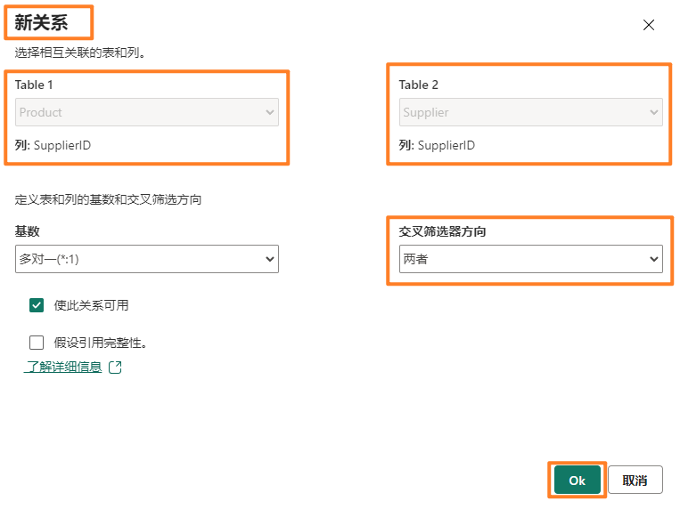

**Ponto de verificação:** Seu modelo deve ser semelhante à captura de tela abaixo.

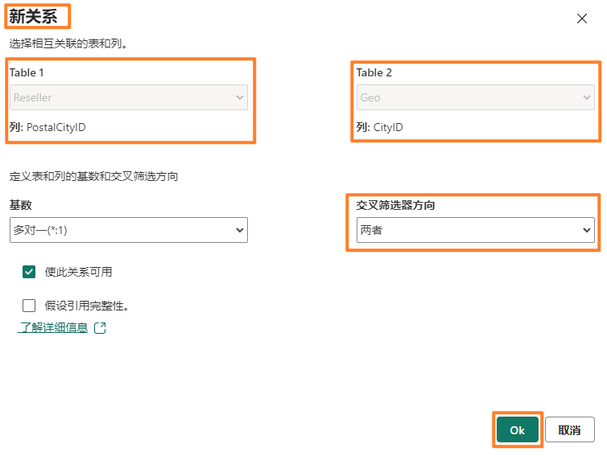

21.	Agora, vamos criar um relacionamento entre PO e Date. Selecione **Order_Date** na tabela **PO** e arraste-o sobre **Date** na tabela **Date.**
22.	A caixa de diálogo Novo relacionamento é aberta. Verifique se **Tabela 1** é **PO** e **Coluna** é **Order_Date.**
23.	Verifique se **Tabela 2** é **Date** e **Coluna** é **Date.**
24.	Verifique se **Cardinalidade** é **Muitos para um (*:1).**
25.	Verifique se **Direção de filtro cruzada** é **Única.**
26.	Selecione **OK.**
 
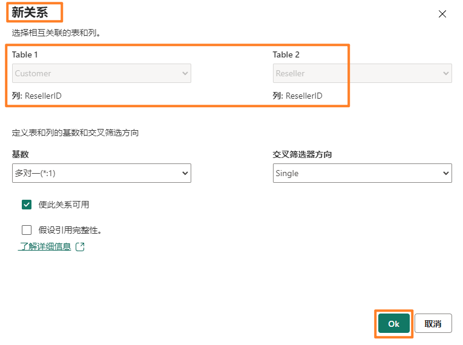

27.	De maneira similar, crie um relacionamento **muitos para um** entre as tabelas **PO** e **Product.** Selecione **StockItemID** em **PO** e **StockItemID** em **Product.**
28.	De maneira similar, crie um relacionamento **muitos para um** entre as tabelas **PO** e **People.** Selecione **ContactPersonID** em **PO** e **PersonID** em **People.**

Terminamos de criar todos os relacionamentos.

**Ponto de verificação:** Seu modelo deve ser semelhante à captura de tela abaixo.

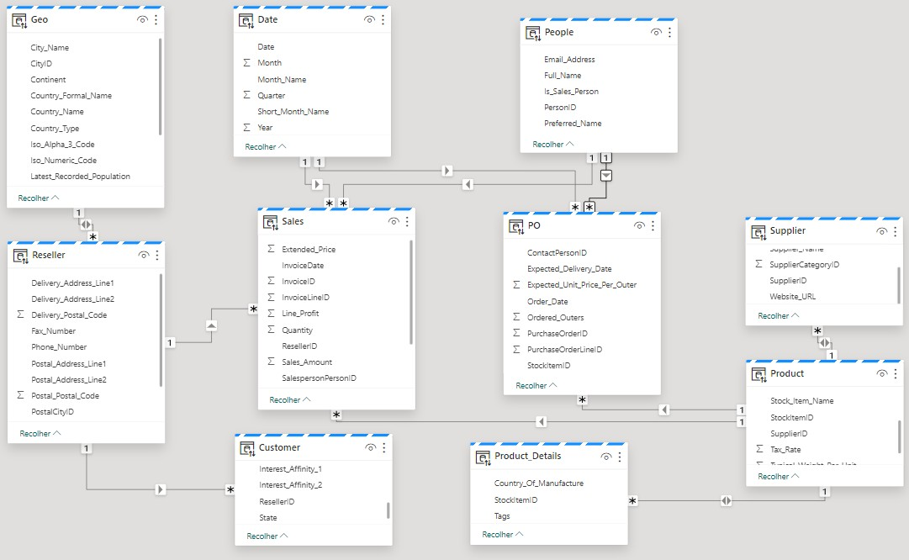
 
### Tarefa 8: Seção Opcional – Criar medidas
Vamos adicionar as medidas restantes.
1. Selecione a tabela Sales e, no menu superior, selecione **Ferramentas da tabela -> Nova medida.**
2. Insira **Avg Order = DIVIDE([Sales], [Orders])** na barra de fórmulas.
3. Clique na **marca de seleção** na barra de fórmulas ou clique no botão Enter.
4. Depois que a medida for salva, observe a opção Ferramentas de medida no menu superior. Clique em **Ferramentas de medida.**
5. Na lista suspensa Formato, clique em **Número decimal.**

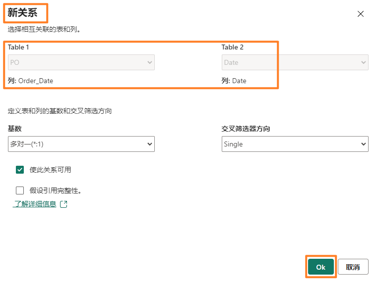

6. Siga as etapas semelhantes para adicionar as seguintes medidas: 
**a. GM = SUM(Sales[Line_Profit])** formatada como **Número decimal.** 
**b. GM% = DIVIDE([GM], [Sales])** formatada como **Porcentagem.** 
**c. No of Customers = COUNTROWS(Customer)** formatada como **Número inteiro**

## Referências
O Fabric Analyst in a Day (FAIAD) apresenta algumas das principais funções disponíveis no Microsoft Fabric. No menu do serviço, a seção Ajuda (?) tem links para ótimos recursos.

Veja aqui mais alguns recursos que ajudarão você com as próximas etapas do Microsoft Fabric.
  - Veja a postagem do blog para ler o [anúncio completo de GA do Microsoft Fabric](https://aka.ms/Fabric-Hero-Blog-Ignite23)
  - Explore o Fabric por meio do [Tour Guiado](https://aka.ms/Fabric-GuidedTour)
  - Inscreva-se para a [avaliação gratuita do Microsoft Fabric](https://aka.ms/try-fabric)
  - Visite o [site do Microsoft Fabric](https://aka.ms/microsoft-fabric)
  - Aprenda novas habilidades explorando os [módulos de Aprendizagem do Fabric](https://aka.ms/learn-fabric)
  - Explore a [documentação técnica do Fabric](https://aka.ms/fabric-docs)
  - Leia o [livro eletrônico gratuito sobre como começar a usar o Fabric](https://aka.ms/fabric-get-started-ebook)
  - Participe da [comunidade do Fabric](https://aka.ms/fabric-community) para postar suas perguntas, compartilhar seus comentários e aprender com outras pessoas

Leia os blogs de comunicados de experiências do Fabric em mais detalhes:
  - [Experiência do Data Factory no blog do Fabric](https://aka.ms/Fabric-Data-Factory-Blog)
  - [Experiência do Synapse Data Engineering no blog do Fabric](https://aka.ms/Fabric-DE-Blog)
  - [Experiência do Synapse Data Science no blog do Fabric](https://aka.ms/Fabric-DS-Blog)
  - [Experiência do Synapse Data Warehousing no blog do Fabric](https://aka.ms/Fabric-DW-Blog)
  - [Experiência do Synapse Real-Time Analytics no blog do Fabric](https://aka.ms/Fabric-RTA-Blog)
  - [Blog de comunicado do Power BI](https://aka.ms/Fabric-PBI-Blog)
  - [Experiência do Data Activator no blog do Fabric](https://aka.ms/Fabric-DA-Blog)
  - [Administração e governança no blog do Fabric](https://aka.ms/Fabric-Admin-Gov-Blog)
  - [OneLake no blog do Fabric](https://aka.ms/Fabric-OneLake-Blog)
  - [Blog de integração do Dataverse e Microsoft Fabric](https://aka.ms/Dataverse-Fabric-Blog)

  © 2023 Microsoft Corporation. Todos os direitos reservados.

Ao usar esta demonstração/este laboratório, você concorda com os seguintes termos:

A tecnologia/funcionalidade descrita nesta demonstração/neste laboratório é fornecida pela
Microsoft Corporation para obter seus comentários e oferecer uma experiência de aprendizado.
Você pode usar a demonstração/o laboratório somente para avaliar tais funcionalidades e
recursos de tecnologia e fornecer comentários à Microsoft. Você não pode usá-los para nenhuma outra finalidade. Você não pode modificar, copiar, distribuir, transmitir, exibir, executar,
reproduzir, publicar, licenciar, criar obras derivadas, transferir nem vender esta demonstração/este laboratório ou qualquer parte deles.

A CÓPIA OU A REPRODUÇÃO DA DEMONSTRAÇÃO/DO LABORATÓRIO (OU DE QUALQUER PARTE DELES) EM QUALQUER OUTRO SERVIDOR OU LOCAL PARA REPRODUÇÃO OU REDISTRIBUIÇÃO ADICIONAL É EXPRESSAMENTE PROIBIDA.

ESTA DEMONSTRAÇÃO/ESTE LABORATÓRIO FORNECE DETERMINADOS RECURSOS E
FUNCIONALIDADES DE PRODUTO/TECNOLOGIA DE SOFTWARE, INCLUINDO NOVOS RECURSOS E CONCEITOS POTENCIAIS, EM UM AMBIENTE SIMULADO SEM CONFIGURAÇÃO NEM
INSTALAÇÃO COMPLEXA PARA A FINALIDADE DESCRITA ACIMA. A TECNOLOGIA/OS CONCEITOS REPRESENTADOS NESTA DEMONSTRAÇÃO/NESTE LABORATÓRIO PODEM NÃO REPRESENTAR A
FUNCIONALIDADE COMPLETA DOS RECURSOS E PODEM NÃO FUNCIONAR DA MESMA MANEIRA QUE UMA VERSÃO FINAL. ALÉM DISSO, PODEMOS NÃO LANÇAR UMA VERSÃO FINAL DE TAIS RECURSOS OU CONCEITOS. SUA EXPERIÊNCIA COM O USO DE TAIS RECURSOS E
FUNCIONALIDADES EM UM AMBIENTE FÍSICO TAMBÉM PODE SER DIFERENTE.

**COMENTÁRIOS.** Caso você forneça comentários sobre os recursos de tecnologia, as funcionalidades e/ou os conceitos descritos nesta demonstração/neste laboratório à Microsoft, você concederá à Microsoft, sem encargos, o direito de usar, compartilhar e comercializar seus comentários de qualquer forma e para qualquer finalidade. Você também concede a terceiros, sem encargos, quaisquer direitos de patente necessários para que seus produtos, suas tecnologias e seus serviços usem ou interajam com partes específicas de um software ou um
serviço da Microsoft que inclua os comentários. Você não fornecerá comentários que estejam sujeitos a uma licença que exija que a Microsoft licencie seu software ou sua documentação para terceiros em virtude da inclusão de seus comentários neles. Esses direitos continuarão em vigor após o término do contrato.

POR MEIO DESTE, A MICROSOFT CORPORATION SE ISENTA DE TODAS AS GARANTIAS E CONDIÇÕES REFERENTES À DEMONSTRAÇÃO/AO LABORATÓRIO, INCLUINDO TODAS AS
GARANTIAS E CONDIÇÕES DE COMERCIALIZAÇÃO, SEJAM ELAS EXPRESSAS, IMPLÍCITAS OU ESTATUTÁRIAS, E DE ADEQUAÇÃO A UMA FINALIDADE ESPECÍFICA, TÍTULO E NÃO VIOLAÇÃO.
A MICROSOFT NÃO DECLARA NEM GARANTE A PRECISÃO DOS RESULTADOS DERIVADOS DO USO DA DEMONSTRAÇÃO/DO LABORATÓRIO NEM A ADEQUAÇÃO DAS INFORMAÇÕES CONTIDAS NA DEMONSTRAÇÃO/NO LABORATÓRIO A QUALQUER FINALIDADE.

**AVISO DE ISENÇÃO DE RESPONSABILIDADE**

Esta demonstração/este laboratório contém apenas uma parte dos novos recursos e aprimoramentos do Microsoft Power BI. Alguns dos recursos podem ser alterados em versões futuras do produto. Nesta demonstração/neste laboratório, você aprenderá sobre alguns dos novos recursos, mas não todos.
