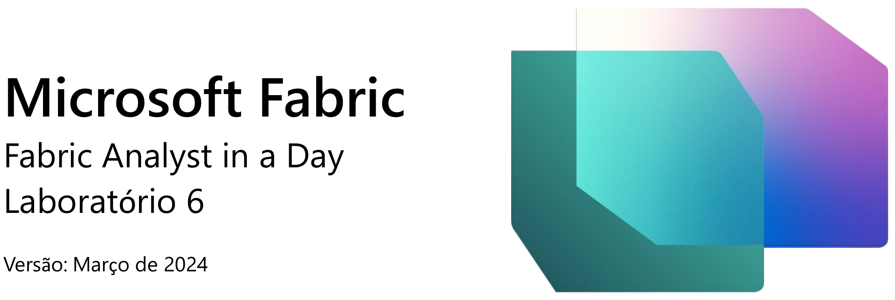
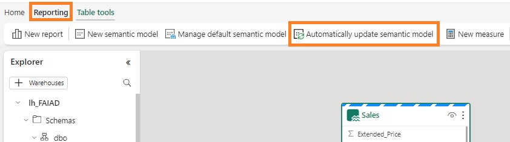
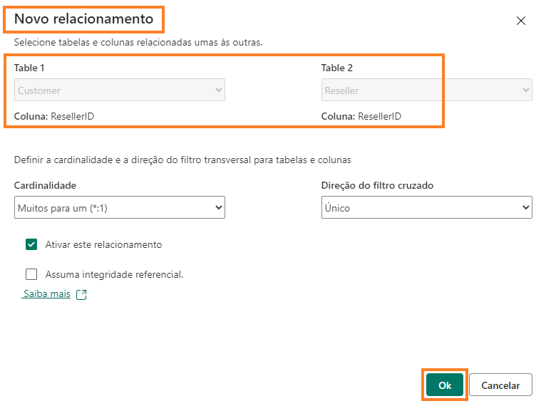

 

# 目次
概要	3 
Lakehouse	3 
タスク 1: SQL を使用してデータをクエリする	3 
タスク 2: T-SQL 結果を視覚化する	6 
タスク 3: ビジュアルクエリを作成する	9 
タスク 4: クエリ結果を視覚化する	13 
タスク 5: リレーションシップを作成する	14 
タスク 6: メジャーを作成する	17 
タスク 7: オプションセクション– リレーションシップを作成する	20 
タスク 8: オプションセクション– メジャーを作成する	24 
リファレンス	26 

 
## 概要

さまざまなソースからのデータが Lakehouse  に取り込まれています。このラボでは、データモデルを操作します。通常、リレーションシップの作成やメジャーの追加などのモデリング アクティビティはPower BI Desktop で実行していました。ここでは、サービス内でこれらのモデリングアクティビティを実行する方法を学びます。

このラボを終了すると、次のことが学べます。

- Lakehouse について詳しく調べる方法
- Lakehouse で SQL ビューを確認する方法
- Lakehouse でデータ モデリングを確認する方法

## Lakehouse
## タスク 1: SQL を使用してデータをクエリする
1.	ラボ 2 のタスク 9 で作成した Fabric ワークスペース **FAIAD_<ユーザー名>** に戻りましょう。

2.	レイクハウス、セマンティックモデル、SQL エンドポイントという 3 種類の lh_FAIAD が表示されます。Lakehouse オプションについては前のラボで確認しました。SQL オプショ
ンを確認するために、**lh_FAIAD SQL 分析エンドポイント** オプションを選択します。エク
スプローラーの **SQL ビュー**が表示されます。

     
 
    データ モデルを作成する前にデータを調べたい場合は、SQL を使用して行うことができます。SQL を使用する 2 つのオプションを見てみましょう。1 つ目は開発者向けで、2 つ目はアナリス     ト向けです。
     たとえば、SQL を使用して、サプライヤーが販売した単位数をすばやく調べたいとします。SQL  ステートメントを記述するか、ビジュアルを使用して SQL  ステートメントを作成する2 つの      オプションがあります。
     左側のパネルに [テーブル] が表示されています。[テーブル] を展開すると、テーブルを構成する [列] を表示できます。また、SQL ビュー、関数、ストアド プロシージャを作成するオプ       ションもあります。SQL の知識がある場合は、これらのオプションを自由に検討してください。では、簡単な SQL クエリを記述してみましょう。

3.	**上部のメニューで新規 SQL クエリ**を選択するか、**左側のパネルの下部**で**クエリ**を選択します。SQL クエリ ビューが表示されます。

     
 
4.	**以下の SQL  クエリをクエリ ウィンドウ**に貼り付けます。このクエリは、サプライヤー名
    ごとに単位数を返します。Sales テーブルをProduct テーブルおよび Supplier テーブルと結合して、これを実現します。

    SELECT su.Supplier_Name, SUM(Quantity) as Units FROM dbo.Sales s
    JOIN dbo.Product p on p.StockItemID = s.StockItemID JOIN dbo.Supplier su on su.SupplierID = p.SupplierID GROUP BY su.Supplier_Name

5.	**実行**をクリックして結果を表示します。

6.	**ビューとして保存**を選択すると、このクエリをビューとして保存できます。

7.	**左側のエクスプローラー** パネルの**クエリ** セクションで、このクエリが**マイ** **クエリ**の下に **SQL query 1** として保存されています。ここで、クエリの名前を変更し、将来使用するために保存することができます。また、**共有クエリ**  フォルダーを使用して、共有されているクエリを表示することもできます。

     
 
## タスク 2: T-SQL 結果を視覚化する
1.	このクエリの結果を視覚化することもできます。クエリ  ペインで**クエリを強調表示**し、
   **結果ペイン**を選択してから、**このデータを探索する**を選択します。

     

2.	**SQL クエリの詳細**ダイアログが開きます。**データ** ペインで、**SQL query 1** を展開します。

3.	**Supplier_Name** および **Units フィールド**を選択します。集合横棒グラフが作成されます。

4.	**視覚化**セクションで、**積み上げ縦棒グラフ**を選択して視覚化タイプを変更します。

     
 
5.	**マトリックスを展開**して、データをマトリックスとして表示します。

     

6.	画面右上の**保存 -> レポートとして保存**を選択します。

     
 
7.	[レポートの保存] ダイアログが開きます。**Units by Supplier をレポートの名前を入力テキストボックス**に入力します。

8.	保存先のワークスペースがご自身の Fabric ワークスペース **FAIAD<ユーザー名>** であることを確認します。

9.	**保存**を選択します。

     

完全なレポート エクスペリエンスが表示されます。視覚化の書式を設定するオプションがあります。これらのオプションについては、次のラボで確認します。

10.	左側のパネルから **lh_FAIAD** を選択します。

     
 
## タスク 3: ビジュアルクエリを作成する
**SQL 分析エンドポイント ビュー**に戻ります。SQL に詳しくない場合は、ビジュアル クエリを使用して同様のクエリを実行できます。

1.	上部のメニューで、**新規のビジュアル クエリ**を選択します。ビジュアル クエリのペインが開きます。

2.	**エクスプローラー** ペインで、**スキーマ -> dbo -> テーブル**を展開します。

3.	**Sales、Product、Supplier**  テーブルをビジュアル  クエリのペインにドラッグします。

     

4.	**Sales** テーブルを選択した状態で、ビジュアル クエリ ペインのメニューから**結合 -> クエリのマージ**を選択します。

     
 
5.	[マージ]  ダイアログボックスが開きます。**マージ用の右テーブル ドロップダウン**で、
   **Product** を選択します。

6.	**StockItemID** を **Sales** テーブルと **Product** テーブルの両方で選択します。これは、Product テーブルと Sales テーブルをマージするためです。

7.	**結合の種類**で**左外部**を選択します。

8.	**OK** を選択します。

     

9.	**結果**ペインで、**Product** 列の横にある**二重矢印**をクリックします。

10.	ダイアログが開いたら、ダイアログから **SupplierID**  を選択します。

11.	**OK** を選択します。**クエリのマージ**と **Product の展開**のステップが **Sales** テーブルに作成されていることを確認します。

      
 
12.	同様に、Supplier テーブルをマージしましょう。**Sales** テーブル内で + ([Product の展開] の後) を選択して新しいステップを追加します。ダイアログが開きます。

13.	**結合 -> クエリのマージ**を選択します。

      

14.	[マージ]  ダイアログボックスが開きます。**マージ用の右テーブル ドロップダウン**で、
**Supplier** を選択します。

15.	**SupplierID** を **Sales** テーブルと **Supplier** テーブルの両方で選択します。これは、Supplier テーブルと Sales テーブルをマージするためです。

16.	**結合の種類**で**左外部**を選択します。

17.	**OK** を選択します。

      
 
18.	**結果**ペインで、**Supplier** 列の横にある**二重矢印**をクリックします。

19.	ダイアログが開いたら、ダイアログから **Supplier_Name**  を選択します。

20.	**OK** を選択します。Sales テーブルで、**マージされたクエリ数**が追加され、**ステップが記録されている**ことに注意してください。

      

21.	ここでは、Supplier 名でグループ化して、Supplier 別の数量を取得しましょう。**Sales**
テーブル内で + ([Supplier の展開] の後) を選択して新しいステップを追加します。ダイアログが開きます。

22.	テー**ブルの変換 -> グループ化**を選択します。[グループ化] ダイアログが開きます。

      

23.	**グループ化**ドロップダウンから、**Supplier_Name** を選択します。

24.	マージ クエリダイアログのスクリーンショットとして **Units** と入力します。

25.	**操作**を**合計**に設定します

26.	**列**ドロップダウンから **Quantity** を選択します。

27.	**OK** を選択します。

       
 

すべてのステップが Sales ブロックに記録されていることに注意してください。(タスク 4 の下の最初のスクリーン ショットを参照してください)。

## タスク 4: クエリ結果を視覚化する
1.	クエリの準備ができたので、結果を見てみましょう。[結果]   ペインで**結果の可視化**を選択します。

     

2.	[結果の可視化] ダイアログが開きます。右側の**データ** ペインから、**ビジュアル クエリ 1**
**を展開します。**

3.	**Supplier_Name** および **Units** フィールドを選択します。
 
4.	結果が先ほどの SQL クエリの結果と似ていることがわかります。必要に応じて、このレポートを保存できます。同様のレポートを前に保存したため、ここでは**キャンセル**を選 択します。

     

## タスク 5: リレーションシップを作成する
これで、モデルの構築、テーブル間のリレーションシップの構築、メジャーの作成を行う準 備が整いました。
1.	**下部パネル**から、**モデル**を選択します。中央のペインが、Power BI Desktop に表示されるモデル ビューと似ていることがわかります。

2.	必要に応じてテーブルの**サイズと配置を変更**します。

3.	Sales テーブルとReseller テーブルの間にリレーションシップを作成しましょう。**Sales** テーブルで **ResellerID** を選択して、**Reseller** テーブルの **ResellerID** までドラッグします。

     
 
4.	[新しいリレーションシップ] ダイアログが開きます。**Table 1** が **Sales**、**列**が **ResellerID** であることを確認します。

5.	**Table 2** が **Reseller、列**が **ResellerID** であることを確認します。

6.	**カーディナリティ**が**多対一(*:1)** であることを確認します。

7.	**クロス フィルターの方向**が **Single** であることを確認します。

8.	**OK** を選択します。

     
 
9.	同様に、Sales テーブルと Date テーブルの間にリレーションシップを作成しましょう。
**Sales** テーブルで **InvoiceDate** を選択して、**Date** テーブルの **Date** までドラッグします。

10.	[新しいリレーションシップ] ダイアログが開きます。**Table 1** が **Sales、列**が **InvoiceDate**
であることを確認します。

11.	**Table 2** が **Date、列**が Date であることを確認します。

12.	**カーディナリティ**が**多対一(*:1)** であることを確認します。

13.	**クロス フィルターの方向**が **Single** であることを確認します。

14.	**OK** を選択します。

     

15.	同じようにして、**Sales** テーブルと **Product** テーブルの間の**多対一**リレーションシップを作成します。**Sales** テーブルの **StockItemID** と **Product** テーブルの **StockItemID** を選択します。

16.	上部メニューから**レポート - > セマンティック モデル オブジェクトを自動的に更新する**
を選択し、モデルを保存して更新します。

     
 
**チェックポイント:** 以下のスクリーンショットに示すように、このモデルには 3 つのリレーションシップ(Sales とReseller テーブルの間、Sales と Date テーブルの間、Sales とProduct
テーブルの間) が必要です。

    

時間の都合上、すべてのリレーションシップの作成は行いません。時間があれば、ラボの最 後にあるオプション セクションを完了してください。オプション セクションでは、残りのリレーションシップを作成するステップについて説明しています。

## タスク 6: メジャーを作成する
Sales ダッシュボードを作成するために必要ないくつかのメジャーを追加しましょう。
1.	モデル ビューで **Sales テーブル** を選択します。Sales テーブルにメジャーを追加するためです。

2.	上部のメニューから、**ホーム-> 新しいメジャー**を選択します。数式バーが表示されます。

3.	**数式**バーに **Sales = SUM(Sales[Sales_Amount])** と入力します。

4.	数式バーの左側のチェック   マークをクリックするか、入力ボタンをクリックします。
 
5.	右側の [プロパティ]  パネルで、**書式設定**セクションを展開します。

6.	**書式**ドロップダウンで**整数**を選択します。

     

7.	上部のメニューで **Sales テーブル**を選択した状態で、**ホーム -> 新しいメジャー**を選択します。数式バーが表示されます。

8.	**数式バー**に **Units = SUM(Sales[Quantity])** と入力します。

9.	数式バーの左側の**チェック**   **マーク**をクリックするか、**入力**ボタンをクリックします。

10.	右側の [プロパティ] パネルで**書式設定**セクションを展開します ([プロパティ] パネルが読み込むまでに少し時間がかかる場合があります)。

11.	**書式**ドロップダウンで**整数**を選択します。

      
 
12.	上部のメニューで **Sales テーブル**を選択した状態で、**ホーム -> 新しいメジャー**を選択します。数式バーが表示されます。

13.	**数式バー**に **Orders = DISTINCTCOUNT(Sales[InvoiceID])** と入力します。

14.	数式バーの左側の**チェック**   **マーク**をクリックするか、**入力**ボタンをクリックします。

15.	右側の [プロパティ]  パネルで、**書式設定**セクションを展開します。

16.	**書式**ドロップダウンで**整数**を選択します。

      

ここでも、時間の都合上、すべてのメジャーの作成は行いません。時間があれば、ラボの最 後にあるオプション セクションを完了してください。このオプション セクションでは、残りのメジャーを作成するステップについて説明しています。
データ モデルを作成したところで、次のステップではレポートを作成します。これは次のラボで行います。
 
## タスク 7: オプションセクション– リレーションシップを作成する
残りのリレーションシップを追加しましょう。
1.	同様に、**Sales** と **People** の間の**多対一**リレーションシップを作成します。**Sales** の
**SalespersonPersonID** と **People** の **PersonID** を選択します。
**チェックポイント:**    モデルは下のスクリーンショットのようになっているはずです。

     

2.	次は、Product とSupplier の間にリレーションシップを作成しましょう。**Product** テーブルで **SupplierID** を選択して、**Supplier** テーブルの **SupplierID** までドラッグします。

3.	[新しいリレーションシップ] ダイアログが開きます。**Table 1** が **Product、列**が **SupplierID**
であることを確認します。

4.	**Table 2** が **Supplier、列**が **SupplierID** であることを確認します。

5.	**カーディナリティ**が**多対一(*:1)** であることを確認します。

6.	**クロス  フィルターの方向**が**双方向**であることを確認します。

7.	**OK** を選択します。

      

8.	同様に、**Product_Details** と **Product** の間に、**クロス フィルターの方向**を**双方向**として**多対一**リレーションシップを作成します。**Product_Details** の **StockItemID** と **Product** の**StockItemID** を選択します。

9.	次は、Reseller とGeo の間にリレーションシップを作成しましょう。**Reseller** テーブルで
**PostalCityID** を選択して、**Geo** テーブルの **CityID** までドラッグします。

10.	[新しいリレーションシップ] ダイアログが開きます。**Table 1** が **Reseller、列**が**PostalCityID** であることを確認します。

11.	**Table 2** が **Geo、列**が **CityID** であることを確認します。

12.	**カーディナリティ**が**多対一(*:1)** であることを確認します。

13.	**クロス  フィルターの方向**が**双方向**であることを確認します。

14.	**OK** を選択します。

     

15.	次は、Customer とReseller の間にリレーションシップを作成しましょう。**Customer** テーブルで **ResellerID** を選択して、**Reseller** テーブルの **ResellerID** までドラッグします。
 
16.	[新しいリレーションシップ] ダイアログが開きます。**Table 1** が **Customer、列**が**ResellerID** であることを確認します。

17.	**Table 2** が **Reseller、列**が **ResellerID** であることを確認します。

18.	**カーディナリティ**が**多対一(*:1)** であることを確認します。

19.	**クロス フィルターの方向**が **Single** であることを確認します。

20.	**OK** を選択します。

      

**チェックポイント:**   モデルは下のスクリーンショットのようになっているはずです。

    
 
21.	次は、PO と Date の間にリレーションシップを作成しましょう。**PO** テーブルで
**Order_Date** を選択して、**Date** テーブルの **Date** までドラッグします。

22.	[新しいリレーションシップ] ダイアログが開きます。**Table 1** が **PO、列**が **Order_Date** であることを確認します。

23.	**Table 2** が **Date、列**が **Date** であることを確認します。

24.	**カーディナリティ**が**多対一(*:1)** であることを確認します。

25.	**クロス フィルターの方向**が **Single** であることを確認します。

26.	**OK** を選択します。

      

27.	同様に、**PO** と **Product** の間の**多対一**リレーションシップを作成します。**PO** の
**StockItemID** と **Product** の **StockItemID** を選択します。

28.	同様に、**PO** と **People** の間の**多対一**リレーションシップを作成します。**PO** の
**ContactPersonID** と **People** の **PersonID** を選択します。すべてのリレーションシップの作成が完了しました。

**チェックポイント:**   モデルは下のスクリーンショットのようになっているはずです。

    
 

## タスク 8: オプションセクション– メジャーを作成する
残りのメジャーを追加しましょう。
1.	上部のメニューで **Sales** テーブルを選択し、**テーブル ツール-> 新しいメジャー**を選択します。

2.	数式バーに **Avg Order = DIVIDE([Sales], [Orders])** と入力します。

3.	数式バーの**チェック マーク**をクリックするか、[入力]  ボタンをクリックします。

4.	メジャーが保存されたら、上部メニューの [メジャーツール] オプションに注目してください。**メジャー ツール**をクリックします。

5.	[書式] ドロップダウンで **10 進数**を選択します。
 

      

6.	同様のステップを実行して、次のメジャーを追加します。 
a.	**GM = SUM(Sales[Line_Profit])** (書式設定は **10 進数)**。 
b.	**GM% = DIVIDE([GM], [Sales])** (書式設定は**パーセンテージ**)。 
c.	**No of Customers = COUNTROWS(Customer)**（書式設定は **整数**） 
 
# リファレンス

Fabric Analyst in a Day (FAIAD) では、Microsoft Fabric で使用できる主要な機能の一部をご紹介します。サービスのメニューにあるヘルプ (?) セクションには、いくつかの優れたリソースへのリンクがあります。

    

Microsoft Fabric の次のステップに役立つリソースをいくつか以下に紹介します。

- ブログ記事で [Microsoft-Fabric-のGA-に関するお知らせ](https://aka.ms/Fabric-Hero-Blog-Ignite23) の全文を確認する
- [ガイド付きツアー](https://aka.ms/Fabric-GuidedTour) を通じて Fabric を探索する
- [Microsoft Fabric の無料試用版](https://www.microsoft.com/en-us/microsoft-fabric/getting-started) にサインアップする
- [Microsoft Fabric のWeb サイト](https://www.microsoft.com/en-in/microsoft-fabric) にアクセスする
- [Fabric の学習モジュール](https://learn.microsoft.com/en-us/training/browse/?products=fabric&resource_type=module)で新しいスキルを学ぶ
- [Fabric の技術ドキュメント](https://learn.microsoft.com/en-us/fabric/) を参照する
- [Fabric 入門編の無料のe-book](https://info.microsoft.com/ww-landing-unlocking-transformative-data-value-with-microsoft-fabric.html) を読む
- [Fabric コミュニティ](https://community.fabric.microsoft.com/)に参加し、質問の投稿やフィードバックの共有を行い、他のユーザーから学びを得る

より詳しい Fabric  エクスペリエンスのお知らせに関するブログを参照してください。

- [Fabric の Data Factory エクスペリエンスに関するブログ](https://blog.fabric.microsoft.com/en-us/blog/introducing-data-factory-in-microsoft-fabric/)
- [Fabric のSynapse Data Engineering エクスペリエンスに関するブログ](https://blog.fabric.microsoft.com/en-us/blog/introducing-synapse-data-engineering-in-microsoft-fabric/)
- [Fabric のSynapse Data Science エクスペリエンスに関するブログ](https://blog.fabric.microsoft.com/en-us/blog/introducing-synapse-data-science-in-microsoft-fabric/)
- [Fabric のSynapse Data Warehousing エクスペリエンスに関するブログ](https://blog.fabric.microsoft.com/en-us/blog/introducing-synapse-data-warehouse-in-microsoft-fabric/)
- [Fabric のSynapse Real-Time Analytics エクスペリエンスに関するブログ](https://blog.fabric.microsoft.com/en-us/blog/sense-analyze-and-generate-insights-with-synapse-real-time-analytics-in-microsoft-fabric/)
- [Power BI のお知らせに関するブログ](https://powerbi.microsoft.com/en-us/blog/empower-power-bi-users-with-microsoft-fabric-and-copilot/)
- [Fabric の Data Activator エクスペリエンスに関するブログ](https://blog.fabric.microsoft.com/en-us/blog/driving-actions-from-your-data-with-data-activator/)
- [Fabric の管理とガバナンスに関するブログ](https://blog.fabric.microsoft.com/en-us/blog/administration-security-and-governance-in-microsoft-fabric/)
- [Fabric の OneLake に関するブログ](https://blog.fabric.microsoft.com/en-us/blog/microsoft-onelake-in-fabric-the-onedrive-for-data/) 
- [Dataverse とMicrosof t Fabric の統合に関するブログ](https://cloudblogs.microsoft.com/dynamics365/it/2023/05/24/new-dataverse-enhancements-and-ai-powered-productivity-with-microsoft-365-copilot/)

© 2023 Microsoft Corporation. All rights reserved.

このデモ/ラボを使用すると、次の条件に同意したことになります。

このデモ/ラボで説明するテクノロジまたは機能は、ユーザーのフィードバックを取得 し、学習エクスペリエンスを提供するために、Microsoft Corporation によって提供されます。ユーザーは、このようなテクノロジおよび機能を評価し、Microsoft にフィードバックを提供するためにのみデモ/ラボを使用できます。それ以外の目的には使用できませ ん。このデモ/ラボまたはその一部を、変更、コピー、配布、送信、表示、実行、再現、 発行、ライセンス、著作物の作成、転送、または販売することはできません。

複製または再頒布のために他のサーバーまたは場所にデモ/ラボ (またはその一部) をコピーまたは複製することは明示的に禁止されています。
 
このデモ/ラボは、前に説明した目的のために複雑なセットアップまたはインストールを 必要としないシミュレーション環境で潜在的な新機能や概念などの特定のソフトウェアテクノロジ/製品の機能を提供します。このデモ/ラボで表されるテクノロジ/概念は、フル機能を表していない可能性があり、最終バージョンと動作が異なることがあります。また、そのような機能や概念の最終版がリリースされない場合があります。物理環境でこのような機能を使用するエクスペリエンスが異なる場合もあります。

**フィードバック。** このデモ/ラボで説明されているテクノロジ、機能、概念に関する フィードバックをMicrosoft に提供する場合、ユーザーは任意の方法および目的でユー
ザーのフィードバックを使用、共有、および商品化する権利を無償で Microsoft に提供するものとします。また、ユーザーは、フィードバックを含む Microsoft のソフトウェアまたはサービスの特定部分を使用したり特定部分とインターフェイスを持ったりする製 品、テクノロジ、サービスに必要な特許権を無償でサード パーティに付与します。ユーザーは、フィードバックを含めるために Microsoft がサード パーティにソフトウェアま たはドキュメントをライセンスする必要があるライセンスの対象となるフィードバックを提供しません。これらの権限は、本契約の後も存続します。

Microsoft Corporation は、明示、黙示、または法律上にかかわらず、商品性のすべての保証および条件、特定の目的、タイトル、非侵害に対する適合性など、デモ/ラボに関する すべての保証および条件を拒否します。Microsoft は、デモ/ラボから派生する結果、出力の正確さ、任意の目的に対するデモ/ラボに含まれる情報の適合性に関して、いかなる 保証または表明もしません。

**免責事項**

このデモ/ラボには、Microsoft Power BI の新機能と機能強化の一部のみが含まれています。一部の機能は、製品の将来のリリースで変更される可能性があります。このデモ/ラ ボでは、新機能のすべてではなく一部について学習します。

