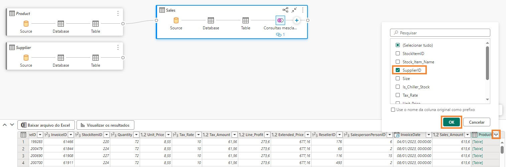
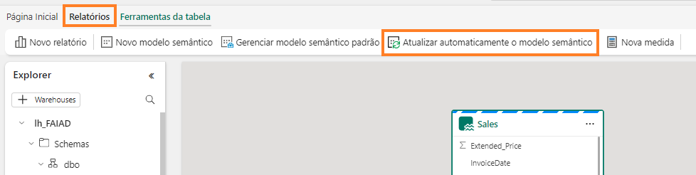
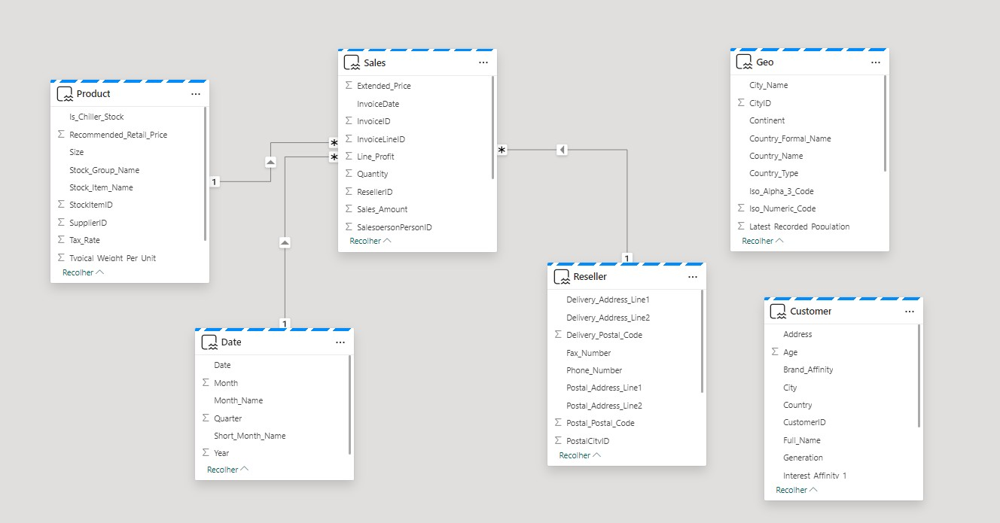

 

## Contenido

[Presentación](#presentación)

[Lakehouse](#lakehouse)

 - [Tarea 1: Consultar datos con SQL](#tarea-1-consultar-datos-con-sql)

 - [Tarea 2: visualizar el resultado de T-SQL](#tarea-2-visualizar-el-resultado-de-t-sql)

 - [Tarea 3: Crear consulta de objetos visuales](#tarea-3-crear-consulta-de-objetos-visuales)

 - [Tarea 4: Visualizar los resultados de la consulta](#tarea-4-visualizar-los-resultados-de-la-consulta)

 - [Tarea 5: Crear relaciones](#tarea-5-crear-relaciones)

 - [Tarea 6: Crear medidas](#tarea-6-crear-medidas)

 - [Tarea 7: Sección opcional: crear relaciones](#tarea-7-sección-opcional-crear-relaciones)

 - [Tarea 8: Sección opcional: crear medidas](#tarea-8-sección-opcional-crear-medidas)

[Referencias](#referencias)

# Presentación

Tenemos datos de diferentes orígenes ingeridos en el lakehouse. En esta práctica de laboratorio, trabajará con el modelo de datos. Normalmente, hacemos actividades de modelado como crear relaciones, agregar medidas, etc. en Power BI Desktop. Aquí aprenderemos cómo hacer estas actividades de modelado en el servicio.

Al final de este laboratorio, habrá aprendido:

-   Cómo explorar un lakehouse

-   Cómo explorar la vista de SQL del lakehouse

-   Cómo explorar el modelado de datos en el lakehouse

# Lakehouse

## Tarea 1: Consultar datos con SQL

1.  Volvamos al área de trabajo de Fabric, **FAIAD\_\<username\**, que creó en el Laboratorio 2, Tarea 9.

2.  Verá tres tipos de lh_FAIAD: Lakehouse, modelo semántico y punto de conexión SQL.

    Exploramos la opción lakehouse en un laboratorio anterior. Seleccione la opción **Punto de**

    **conexión de análisis SQL lh_FAIAD** para explorar la opción SQL. Esto le llevará a la **vista de SQL**

    del explorador.

    

Si desea explorar los datos antes de crear un modelo de datos, puede utilizar SQL para hacerlo. Veamos dos opciones para usar SQL, la primera está orientada a desarrolladores y la segunda opción es para analistas.

Supongamos que desea conocer rápidamente las unidades vendidas por el proveedor mediante SQL. Tenemos dos opciones: escribir una declaración SQL o usar un objeto visual para crear la declaración SQL.

Observe que en el panel izquierdo puede ver las Tablas. Si expande las tablas, puede ver las columnas que componen la tabla. Además, hay opciones para crear vistas, funciones y procedimientos almacenados de SQL. Si tiene experiencia en SQL, no dude en explorar estas opciones. Intentemos escribir una consulta SQL simple.

3.  Desde el **menú superior**, seleccione **Nueva consulta SQL** o desde la **parte inferior izquierda panel**, seleccione **Consulta**. Esto le llevará a la vista de consultas de SQL.

    

4.  Copie la **siguiente consulta de SQL** en la **ventana de consultas**. Esta consulta devolverá las unidades por nombre del proveedor. Para conseguirlo, se une la tabla Sales con las tablas Product y Supplier.

    SELECT su.Supplier_Name, SUM(Quantity) as Units FROM dbo.Sales s
    JOIN dbo.Product p on p.StockItemID = s.StockItemID JOIN dbo.Supplier
    su on su.SupplierID = p.SupplierID GROUP BY su.Supplier_Name

5.  Haga clic en **Run** para ver los resultados.

6.  Observe que hay una opción para guardar esta consulta como Vista si selecciona **Guardar como vista**.

7.  En el panel del **explorador izquierdo**, en la sección **Queries,** observe que esta consulta se guarda en **Mis consultas** como **SQL query 1**. Esto proporciona una opción para cambiar el nombre de la consulta y guardarla para uso futuro. También hay una opción para ver las consultas que se

    comparten con usted mediante la carpeta **Consultas compartidas**.

    

## Tarea 2: visualizar el resultado de T-SQL

1.  También podemos visualizar el resultado de esta consulta. **Resalte la consulta** en el panel de consulta y seleccione el **panel Resultados;** luego seleccione **Explorar estos datos**.

    

2.  Se abre el cuadro de diálogo **Explorar consulta SQL**. Desde el panel **Datos**, expanda **SQL query 1**.

3.  Seleccione los **campos Supplier_Name** y **Units**. Se crea un gráfico de barras agrupadas.

4.  En la sección **Visualizaciones**, cambie el tipo de objeto visual mediante la selección del **gráfico de Columna apilada**.

    

5.  **Expanda la matriz** para ver los datos como una matriz.

    

6.  Seleccione **Guardar - \ Guardar como informe** en la parte superior de la pantalla.

    

7.  Se abre el cuadro de diálogo Guardar el informe. Escriba **Units by Supplier** en el cuadro de texto
    **Especifique un nombre para el informe.**

8.  Asegúrese de que el área de trabajo de destino es su área de trabajo de Fabric **FAIAD\<username\**.

9.  Seleccione **Guardar**.

    

Se le llevará a la experiencia de informe completa. Tiene opciones para formatear los objetos visuales**.** Examinaremos estas opciones en el próximo laboratorio.

10. En el panel de la izquierda, seleccione **lh_FAIAD**.

    

## Tarea 3: Crear consulta de objetos visuales

Se le dirigirá de vuelta a la **vista del punto de conexión de análisis de SQL**. Si no está familiarizado con SQL, puede ejecutar una consulta similar mediante consulta de objeto visual.

1.  En el menú superior, seleccione **Nueva consulta de objeto visual**. Se abre un panel de consulta de objeto visual.

2.  En el panel **Explorador**, expanda **Schemas -\ dbo -\ Tables**.

3.  Arrastre las tablas **Sales, Product y Supplier** al panel de consulta de objeto visual.

    

4.  Con la tabla **Sales** seleccionada, en el menú del panel Consulta de objeto visual, seleccione

    **Combinar -> Combinar consultas.**

    

5.  Se abrirá el cuadro de diálogo Combinar. Desde el **menú desplegable Tabla derecha para combinación**, seleccione **Product**.

6.  Seleccione **StockItemID** de las tablas **Sales** y **Product**. Esto se hace para combinar las tablas Sales y Product.

7.  En **Tipo de combinación**, seleccione **Externa**.

8.  Seleccione **Aceptar**.

    

9.  En el panel **resultados**, haga clic en la **doble flecha** al lado de la columna **Product**.

10. Seleccione **SupplierID** en el cuadro de diálogo que se abre.

11. Seleccione **Aceptar**. Observe que los pasos **Consultas combinadas** y **Producto expandido**

    se crean en la tabla **Sales**.

    

12. De manera similar, combinemos la tabla Supplier. Dentro de la tabla **Sales**, seleccione **\"+\"** (ubicado después del Producto expandido) para agregar un nuevo paso. Se abre un cuadro de diálogo.

13. Seleccione **Combinar -> Combinar consultas**.

    

14. Se abrirá el cuadro de diálogo Combinar. Desde el **menú desplegable Tabla derecha para combinación**, seleccione **Supplier**.

15. Seleccione **SupplierID** de las tablas **Sales** y **Supplier**. Esto se hace para combinar las tablas Supplier y Sales.

16. En **Tipo de combinación**, seleccione **Externa**.

17. Seleccione **Aceptar**.

    

18. En el panel **resultados**, haga clic en la **doble flecha** al lado de la columna **Supplier**.

19. Seleccione **Supplier_Name** en el cuadro de diálogo que se abre.

20. Seleccione **Aceptar**. Observe que en la tabla Sales, las **Consultas combinadas** se agregan y los

    **pasos se registran.**

    

21. Ahora agrupemos por nombre del Proveedor para obtener la cantidad por Proveedor. Dentro de la tabla **Sales**, seleccione **\"+\"** (ubicado después del Proveedor expandido) para agregar un nuevo paso. Se abre un cuadro de diálogo.

22. Seleccione **Transformar tabla -> Agrupar por**. Se abre el cuadro de diálogo Agrupar por.

    

23. En el menú desplegable **Agrupar por** seleccione **Supplier_Name.**

24. Introduzca **Unidades** como captura de pantalla del cuadro de diálogo de consulta de combinación.

25. Establezca **Operación** en **Suma**

26. Seleccione **Cantidad** en el menú desplegable **Columna**.

27. Seleccione **Aceptar**.

    

Observe que todos los pasos están registrados en el bloque Sales. (Consulte la primera captura de pantalla en la Tarea 4).

## Tarea 4: Visualizar los resultados de la consulta

1.  Ahora que tenemos la consulta lista, veamos el resultado. Seleccione **Visualización de resultados**

    en el panel de resultados.

    

2.  Se abre el cuadro de diálogo Visualización de resultados. En el panel **Datos** de la derecha,

    **expanda Visual query1.**

3.  Seleccione los campos **Supplier_Name** y **Units**.

4.  Observe que el resultado es similar al resultado de la consulta SQL anterior. Si lo desea, puede guardar este informe. Como guardamos un informe similar anteriormente, seleccionaremos **Cancelar**.

    

## Tarea 5: Crear relaciones

Bien, ahora estamos listos para crear el modelo, establecer relaciones entre tablas y crear medidas.

1.  En el **panel inferior**, seleccione **Modelo**. Verá que el panel central se parece a la vista Modelo que vemos en Power BI Desktop.

2.  **Cambie el tamaño y mueva** las tablas según sea necesario.

3.  Creemos una relación entre las tablas Sales and Reseller. Seleccione **ResellerID** de la tabla **Sales**

    y arrástrelo a **ResellerID** en la tabla **Reseller**.

    

4.  Se abre el cuadro de diálogo Nueva relación. Asegúrese de que la **Table 1** sea **Sales** y que la

    **Columna** sea **ResellerID.**

5.  Asegúrese de que la **Table 2** sea **Reseller** y que la **Columna** sea **ResellerID.**

6.  Asegúrese de que la **Cardinality** sea **Varios a uno (\*:1)**.

7.  Asegúrese de que la **Dirección de filtro cruzado** sea **Único**.

8.  Seleccione **OK**.

    

9.  De forma similar, creemos una relación entre las tablas Sales y Date. Seleccione **InvoiceDate** de la tabla **Sales** y arrástrelo a **Date** en la tabla **Date**.

10. Se abre el cuadro de diálogo Nueva relación. Asegúrese de que la **Table 1** sea **Sales** y que la

    **Columna** sea **InvoiceDate.**

11. Asegúrese de que la **Table 2** sea **Date** y que la **Columna** sea **Date.**

12. Asegúrese de que la **Cardinality** sea **Varios a uno (\*:1)**.

13. Asegúrese de que la **Dirección de filtro cruzado** sea **Único**.

14. Seleccione **Ok**.

    

15. De forma similar, cree una relación **varios a uno** entre las tablas **Sales** y **Product**. Seleccione

    **StockItemID** en la tabla **Sales** y **StockItemID** en la tabla **Product**.

16. En el menú superior, seleccione **Informes -\ Actualizar automáticamente el modelo semántico**

    para guardar y actualizar el modelo.

    

**Punto de control:** su modelo debe tener tres relaciones entre las tablas Sales y Reseller, Sales y Date y Sales y Product como se muestra en la siguiente captura de pantalla:

Por razones de tiempo, no crearemos todas las relaciones. Si el tiempo lo permite, puede completar la sección opcional al final de la práctica de laboratorio. La sección opcional recorre los pasos para

crear las relaciones restantes.

## Tarea 6: Crear medidas

Agreguemos algunas medidas que necesitamos para crear el panel de Sales.

1.  Seleccione la **tabla Sales** desde la vista del modelo. Queremos agregar las medidas a la tabla Sales.

2.  En el menú superior, seleccione **Inicio -\ Nueva medida**. Observe que se muestra la barra de fórmulas.

3.  Introduzca **Sales = SUM(Sales\[Sales_Amount\])** en la **barra de fórmulas**.

4.  Haga clic en la **marca de verificación** izquierda de la barra de fórmulas o haga clic en el botón

    **Enter.**

5.  En el panel Propiedades de la derecha, expanda la sección **Formato**.

6.  En el menú desplegable **Formato**, seleccione **Número entero**.

    

7.  Con la **tabla Sales** seleccionada en el menú superior, seleccione **Inicio -> Nueva medida**. Observe que se muestra la barra de fórmulas.

8.  Introduzca **Units = SUM(Sales\[Quantity\])** en la **barra de fórmulas**.

9.  Haga clic en la **marca de verificación** izquierda de la barra de fórmulas o haga clic en el botón

    **Enter.**

10. En el panel Propiedades a la derecha, expanda la sección **Formato** (el panel Propiedades puede tardar unos momentos en cargarse).

11. En el menú desplegable **Formato**, seleccione **Número entero**.

    

12. Con la **tabla Sales** seleccionada en el menú superior, seleccione **Inicio -> Nueva medida**. Observe que se muestra la barra de fórmulas.

13. Introduzca **Orders = DISTINCTCOUNT(Sales\[InvoiceID\])** en la **barra de fórmulas.**

14. Haga clic en la **marca de verificación** izquierda de la barra de fórmulas o haga clic en el botón **Enter**.

15. En el panel Propiedades de la derecha, expanda la sección **Formato**.

16. En el menú desplegable **Formato**, seleccione **Número entero**.

    

De nuevo, por razones de tiempo, no crearemos todas las medidas. Si el tiempo lo permite, puede completar la sección opcional al final de la práctica de laboratorio. La sección opcional recorre los pasos para crear las medidas restantes.

Hemos creado un modelo de datos, el siguiente paso es crear un informe. Lo haremos en el siguiente laboratorio.

## Tarea 7: Sección opcional: crear relaciones

Agreguemos las relaciones restantes.

1.  Cree una relación **varios a uno** entre las tablas **Sales** y **Product**. Seleccione **StockItemID** en la tabla **Sales** y **StockItemID** en la tabla **Product**.

2.  Igualmente, cree una relación **varios a uno** entre las tablas **Sales** y **People**. Seleccione

    **SalespersonPersonID** de **Sales** y **PersonID** de **People.**

**Punto de control:** su modelo debe parecerse al de la siguiente captura de pantalla.

3.  Ahora creemos una relación entre las tablas Product y Supplier. Seleccione **SupplierID** de la tabla

    **Product** y arrástrelo a **SupplierID** en la tabla **Supplier**.

4.  Se abre el cuadro de diálogo Nueva relación. Asegúrese de que la **Table 1** sea **Product** y que la

    **Columna** sea **SupplierID.**

5.  Asegúrese de que la **Table 2** sea **Supplier** y que la **Columna** sea **SupplierID.**

6.  Asegúrese de que la **Cardinality** sea **Varios a uno (\*:1)**.

7.  Asegúrese de que la **Dirección de filtro cruzado** sea **Ambas**.

8.  Seleccione **OK**.

    

9.  De manera similar, cree una relación **varios a uno** con **Dirección de filtro cruzado** como **Ambas** entre

    **Product_Details** y **Product**. Seleccione **StockItemID** de **Product_Details** y **StockItemID** de **Product**.

10. Ahora creemos una relación entre las tablas Reseller y Geo. Seleccione **PostalCityID** de la tabla

    **Reseller** y arrástrela sobre **CityID** en la tabla **Geo**.

11. Se abre el cuadro de diálogo Nueva relación. Asegúrese de que la **Table 1** sea **Reseller** y que la

    **Columna** sea **PostalCityID.**

12. Asegúrese de que la **Table 2** sea **Geo** y que la **Columna** sea **CityID.**

13. Asegúrese de que la **Cardinality** sea **Varios a uno (\*:1)**.

14. Asegúrese de que la **Dirección de filtro cruzado** sea **Ambas**.

15. Seleccione **OK**.

    

16. Ahora creemos una relación entre las tablas Customer y Reseller. Seleccione **ResellerID** de la tabla **Customer** y arrástrelo a **ResellerID** en la tabla **Reseller**.

17. Se abre el cuadro de diálogo Nueva relación. Asegúrese de que la **Table 1** sea **Customer** y que la

    **Columna** sea **ResellerID.** 

18. Asegúrese de que la **Table 2** sea **Reseller** y que la **Columna** sea **ResellerID.**

19. Asegúrese de que la **Cardinality** sea **Varios a uno (\*:1)**.

20. Asegúrese de que la **Dirección de filtro cruzado** sea **Único**.

21. Seleccione **OK**.

    

**Punto de control:** su modelo debe parecerse al de la siguiente captura de pantalla.

22. Ahora creemos una relación entre las tablas PO y Date. Seleccione **Order_Date** de la tabla **PO**

    y arrástrela sobre **Date** en la tabla **Date**.

23. Se abre el cuadro de diálogo Nueva relación. Asegúrese de que la **Table 1** sea **PO** y que la

    **Columna** sea **Order_Date.**

24. Asegúrese de que la **Table 2** sea **Date** y que la **Columna** sea **Date.**

25. Asegúrese de que la **Cardinality** sea **Varios a uno (\*:1)**.

26. Asegúrese de que la **Dirección de filtro cruzado** sea **Único**.

27. Seleccione **OK**.

    

28. Igualmente, cree una relación **varios a uno** entre las tablas **PO** y **Product**. Seleccione **StockItemID**

    de **PO** y **StockItemID** de **Product**.

29. Igualmente, cree una relación **varios a uno** entre las tablas **PO** y **People**. Seleccione

    **ContactPersonID** de **PO** y **PersonID** de **People**.

Hemos terminado de crear todas las relaciones.

**Punto de control:** su modelo debe parecerse al de la siguiente captura de pantalla.

## Tarea 8: Sección opcional: crear medidas

Agreguemos las medidas restantes.

1.  Seleccione la tabla **Sales** y en el menú superior, seleccione **Herramientas de tabla -\ Nueva medida**.

2.  Introduzca **Avg Order = DIVIDE(\[Sales\], \[Orders\])** en la barra de fórmulas.

3.  Haga clic en la **marca de verificación** en la barra de fórmulas o haga clic en el botón Enter.

4.  Una vez guardada la medida, observe la opción Herramientas de medición en el menú superior. Haga clic en **Herramientas de medición**.

5.  En el menú desplegable Formato, haga clic en **Número decimal**.

    

6.  Siga pasos similares para agregar las siguientes medidas:

    a.  **GM = SUM(Sales\[Line_Profit\])** formateado como **Número decimal.**

    b.  **GM% = DIVIDE(\[GM\], \[Sales\])** formateado como **Porcentaje.**

    c.  **No of Customers** = **COUNTROWS(Customer)** con formato **Número entero**

# Referencias

Fabric Analyst in a Day (FAIAD) le presenta algunas funciones clave disponibles en Microsoft Fabric. En el menú del servicio, la sección Ayuda (?) tiene vínculos a algunos recursos excelentes.

Estos son algunos recursos más que podrán ayudarle a seguir avanzando con Microsoft Fabric.

-   Vea la publicación del blog para leer el [anuncio de disponibilidad general de Microsoft Fabric](https://aka.ms/Fabric-Hero-Blog-Ignite23) completo.

-   Explore Fabric a través de la [Visita guiada](https://aka.ms/Fabric-GuidedTour)

-   Regístrese en la [prueba gratuita de Microsoft Fabric](https://aka.ms/try-fabric)

-   Visite el [sitio web de Microsoft Fabric](https://aka.ms/microsoft-fabric)

-   Adquiera nuevas capacidades mediante la exploración de los [módulos de aprendizaje de Fabric](https://aka.ms/learn-fabric)

-   Explore la [documentación técnica de Fabric](https://aka.ms/fabric-docs)

-   Lea el [libro electrónico gratuito sobre cómo empezar a usar Fabric](https://aka.ms/fabric-get-started-ebook)

-   Únase a la [comunidad de Fabric](https://aka.ms/fabric-community) para publicar sus preguntas, compartir sus comentarios y aprender de otros.

Obtenga más información en los blogs de anuncios de la experiencia Fabric:

-   [Experiencia de Data Factory en el blog de Fabric](https://aka.ms/Fabric-Data-Factory-Blog)

-   [Experiencia de Synapse Data Engineering en el blog de Fabric](https://aka.ms/Fabric-DE-Blog)

-   [Experiencia de Synapse Data Science en el blog de Fabric](https://aka.ms/Fabric-DS-Blog)

-   [Experiencia de Synapse Data Warehousing en el blog de Fabric](https://aka.ms/Fabric-DW-Blog)

-   [Experiencia de Synapse Real-Time Analytics en el blog de Fabric](https://aka.ms/Fabric-RTA-Blog)

-   [Blog de anuncios de Power BI](https://aka.ms/Fabric-PBI-Blog)

-   [Experiencia de Data Activator en el blog de Fabric](https://aka.ms/Fabric-DA-Blog)

-   [Administración y gobernanza en el blog de Fabric](https://aka.ms/Fabric-Admin-Gov-Blog)

-   [OneLake en el blog de Fabric](https://aka.ms/Fabric-OneLake-Blog)

-   [Blog de integración de Dataverse y Microsoft Fabric](https://aka.ms/Dataverse-Fabric-Blog)

 
 
© 2023 Microsoft Corporation. Todos los derechos reservados.

Al participar en esta demostración o laboratorio práctico, acepta las siguientes condiciones:

Microsoft Corporation pone a su disposición la tecnología o funcionalidad descrita en esta demostración/laboratorio práctico con el fin de obtener comentarios por su parte y de facilitarle una experiencia de aprendizaje. Esta demostración/laboratorio práctico solo se puede usar para evaluar las características de tal tecnología o funcionalidad y para proporcionar comentarios a Microsoft. No se puede usar para ningún otro propósito. Ninguna parte de esta demostración/laboratorio práctico se puede modificar, copiar, distribuir, transmitir, mostrar, realizar, reproducir, publicar, licenciar, transferir ni vender, ni tampoco crear trabajos derivados de ella.

LA COPIA O REPRODUCCIÓN DE ESTA DEMOSTRACIÓN/LABORATORIO PRÁCTICO (O PARTE DE ELLA) EN CUALQUIER OTRO SERVIDOR O UBICACIÓN PARA SU REPRODUCCIÓN O DISTRIBUCIÓN POSTERIOR QUEDA EXPRESAMENTE PROHIBIDA.

ESTA DEMOSTRACIÓN/LABORATORIO PRÁCTICO PROPORCIONA CIERTAS FUNCIONES Y CARACTERÍSTICAS DE PRODUCTOS O TECNOLOGÍAS DE SOFTWARE (INCLUIDOS POSIBLES NUEVOS CONCEPTOS Y CARACTERÍSTICAS) EN UN ENTORNO SIMULADO SIN INSTALACIÓN O CONFIGURACIÓN COMPLEJA PARA EL PROPÓSITO ARRIBA DESCRITO. LA TECNOLOGÍA/CONCEPTOS DESCRITOS EN ESTA DEMOSTRACIÓN/LABORATORIO PRÁCTICO NO REPRESENTAN LA FUNCIONALIDAD COMPLETA DE LAS CARACTERÍSTICAS Y, EN ESTE SENTIDO, ES POSIBLE QUE NO FUNCIONEN DEL MODO EN QUE LO HARÁN EN UNA VERSIÓN FINAL. ASIMISMO, PUEDE QUE NO SE PUBLIQUE UNA VERSIÓN FINAL DE TALES CARACTERÍSTICAS O CONCEPTOS. DE IGUAL MODO, SU EXPERIENCIA CON EL USO DE ESTAS CARACTERÍSTICAS Y FUNCIONALIDADES EN UN ENTORNO FÍSICO PUEDE SER DIFERENTE.

**COMENTARIOS**. Si envía comentarios a Microsoft sobre las características, funcionalidades

o conceptos de tecnología descritos en esta demostración/laboratorio práctico, acepta otorgar a Microsoft, sin cargo alguno, el derecho a usar, compartir y comercializar sus comentarios de

cualquier modo y para cualquier fin. También concederá a terceros, sin cargo alguno, los derechos de patente necesarios para que sus productos, tecnologías y servicios usen o interactúen con cualquier parte específica de un software o servicio de Microsoft que incluya los comentarios.

No enviará comentarios que estén sujetos a una licencia que obligue a Microsoft a conceder su software o documentación bajo licencia a terceras partes porque incluyamos sus comentarios en ellos. Estos derechos seguirán vigentes después del vencimiento de este acuerdo.

MICROSOFT CORPORATION RENUNCIA POR LA PRESENTE A TODAS LAS GARANTÍAS Y CONDICIONES RELATIVAS A LA DEMOSTRACIÓN/LABORATORIO PRÁCTICO, INCLUIDA CUALQUIER GARANTÍA Y CONDICIÓN DE COMERCIABILIDAD (YA SEA EXPRESA, IMPLÍCITA O ESTATUTARIA), DE IDONEIDAD PARA UN FIN DETERMINADO, DE TITULARIDAD Y DE AUSENCIA DE INFRACCIÓN.

MICROSOFT NO DECLARA NI GARANTIZA LA EXACTITUD DE LOS RESULTADOS, EL RESULTADO DERIVADO DE LA REALIZACIÓN DE LA DEMOSTRACIÓN/LABORATORIO PRÁCTICO NI LA

IDONEIDAD DE LA INFORMACIÓN CONTENIDA EN ELLA CON NINGÚN PROPÓSITO.

### DECLINACIÓN DE RESPONSABILIDADES

Esta demostración/laboratorio práctico contiene solo una parte de las nuevas características y mejoras realizadas en Microsoft Power BI. Puede que algunas de las características cambien en versiones futuras del producto. En esta demostración/laboratorio práctico, conocerá algunas de estas nuevas características, pero no todas.

