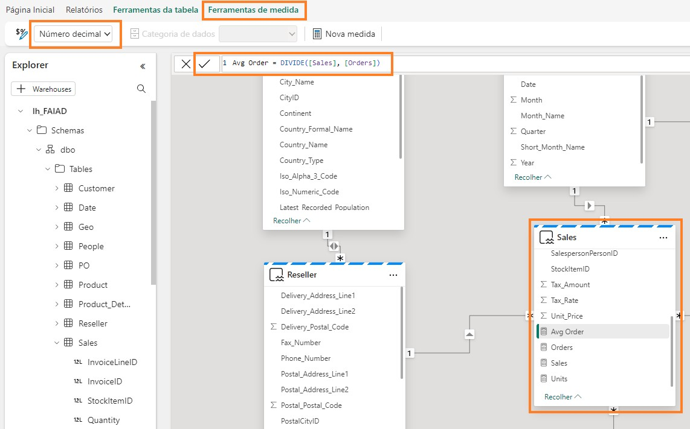

 
## Introduzione
Abbiamo inserito dati provenienti da diverse origini dati in Lakehouse. In questo lab si lavorerà con il modello di dati. In genere, eseguiamo attività di modellazione quali la creazione di relazioni, l'aggiunta di misure, ecc. in Power BI Desktop. Qui impareremo a eseguire queste attività di modellazione nel servizio.
In questo lab si imparerà a:
•	Esplorare lakehouse
•	Esplorare la vista SQL di lakehouse
•	Esplorare la modellazione dei dati in lakehouse

Lakehouse
## Attività 1 - Query sui dati mediante SQL
1.	Torniamo all'area di lavoro di Fabric FAIAD_<nome utente> creata nel Lab 2, attività 9.
2.	Saranno visibili tre tipi di lh_FAIAD, Lakehouse, modello semantico ed endpoint SQL. Abbiamo
esplorato l'opzione Lakehouse in un lab precedente. Selezionare l'opzione lh_FAIAD - Endpoint di analisi SQL per esplorare l'opzione SQL. Si aprirà la vista SQL di Explorer.

   
   
Se si desidera esplorare i dati prima di creare un modello di dati, è possibile usare SQL a questo fine. Osserviamo le due opzioni per l'uso di SQL, la prima è pensata per gli sviluppatori mentre la seconda è destinata agli analisti.
Supponiamo che si voglia conoscere rapidamente le unità vendute dal fornitore mediante SQL.
Abbiamo due opzioni: scrivere un'istruzione SQL o usare un oggetto visivo per creare l'istruzione SQL.
Sul pannello di sinistra si possono visualizzare le tabelle. Espandendo le tabelle, si possono
visualizzare le colonne che compongono la tabella. Vi sono inoltre opzioni per la creazione di viste SQL, funzioni e stored procedure. Se si ha familiarità con SQL, è possibile esplorare queste opzioni. Proviamo a scrivere una semplice query SQL.
 
3.	Nel menu in alto selezionare Nuova query SQL oppure nella parte inferiore del pannello di sinistra selezionare Query. Si aprirà la vista della query SQL.

   
   
4.	Incollare la query SQL seguente nella finestra della query. Questa query restituirà le unità in base al nome del fornitore. Per ottenere questo risultato è necessario unire la tabella Sales alle tabelle Product e Supplier.

SELECT su.Supplier_Name, SUM(Quantity) as Units FROM dbo.Sales s
JOIN dbo.Product p on p.StockItemID = s.StockItemID JOIN dbo.Supplier su on su.SupplierID = p.SupplierID GROUP BY su.Supplier_Name

5.	Fare clic su Run per visualizzare i risultati.
6.	Notare che è disponibile un'opzione per salvare questa query come vista selezionando Salva come visualizzazione.
7.	Nel pannello di sinistra Explorer, nella sezione Query notare che questa query è salvata in Query personali come SQL query 1. Ciò consente di rinominare la query e salvarla per l'uso futuro. È
inoltre presente un'opzione per visualizzare le query condivise con l'utente corrente mediante la cartella Query condivise.

  

## Attività 2 - Visualizzazione del risultato T-SQL
1.	Possiamo anche visualizzare il risultato di questa query. Evidenziare la query nel riquadro della query, selezionare il riquadro dei risultati e selezionare Esplora questi dati.

    
  	
3.	Si apre la finestra di dialogo Esplora query SQL. Nel riquadro Dati espandere SQL query 1.
4.	Selezionare i campi Supplier_Name e Units. Si crea un grafico a barre raggruppate.
5.	Nella sezione Visualizzazioni cambiare il tipo di oggetto visivo selezionando l'istogramma in pila.

    
 
6.	Espandere la matrice per visualizzare i dati come una matrice.

    
  	
8.	Selezionare Salva - > Salva come report in alto a destra della schermata.

    
  	
10.	Si apre la finestra di dialogo Salva report. Digitare Unità per fornitore nella casella di testo
Immettere un nome per il report.
11.	Assicurarsi che l'area di lavoro di destinazione sia l'area di lavoro di Fabric FAIAD<nomeutente>
 
12.	Selezionare Salva.
    
     
   	
Si verrà indirizzati all'esperienza di report completa. Si dispone di opzioni per formattare gli oggetti visivi. Vedremo queste opzioni nel lab successivo.

10.	Nel pannello a sinistra selezionare lh_FAIAD.

     

## Attività 3 - Creazione di una query visiva
Si aprirà nuovamente la vista Endpoint di analisi SQL. Se non si ha familiarità con SQL, è possibile eseguire una query simile usando la query visiva.
1.	Nel menu in alto selezionare Nuova query visiva. Si apre un riquadro delle query visive.
2.	Nel riquadro Esplora espandere Schemi -> dbo -> Tabelle.
3.	Trascinare le tabelle Sales, Product e Supplier nel riquadro delle query visive.
 
    

4.	Con la tabella Sales selezionata, nel menu del riquadro delle query visive selezionare Combina -> Esegui merge di query.

    
  	
6.	Si apre la finestra di dialogo Merge. Nel menu a discesa Tabella destra per l'unione selezionare
Product.
7.	Selezionare StockItemID in entrambe le tabelle Sales e Product. In questo modo si uniscono le tabelle Product e Sales.
8.	In Tipo di join selezionare Left outer.
 
9.	Selezionare OK.

    
  	
11.	Nel riquadro dei risultati fare clic sulla freccia doppia accanto alla colonna Product.
12.	Nella finestra di dialogo che si apre, selezionare SupplierID.
13.	Selezionare OK. Notare che i passaggi Merge di query e Product espansa vengono creati nella tabella Sales.

     
   	
15.	Uniamo allo stesso modo la tabella Supplier. Nella tabella Sales selezionare “+” (dopo Product espansa) per aggiungere un nuovo passaggio. Si apre la finestra di dialogo.
16.	Selezionare Combina -> Esegui merge di query.

     
   	
18.	Si apre la finestra di dialogo Merge. Nel menu a discesa Tabella destra per l'unione selezionare
Supplier.
19.	Selezionare SupplierID in entrambe le tabelle Sales e Supplier. In questo modo si uniscono le tabelle Supplier e Sales.
20.	In Tipo di join selezionare Left outer.
21.	Selezionare OK.

    
   	
23.	Nel riquadro dei risultati fare clic sulla freccia doppia accanto alla colonna Supplier.
24.	Nella finestra di dialogo che si apre, selezionare Supplier_Name.
25.	Selezionare OK. Nella tabella Sales si aggiunge Merge di query e si registrano i passaggi.

     
   	
27.	Raggruppiamo ora per nome del fornitore per ottenere la quantità per fornitore. Nella tabella Sales selezionare "+" (dopo Supplier espansa) per aggiungere un nuovo passaggio. Si apre la finestra di dialogo.
28.	Selezionare Trasforma tabella -> Raggruppa per. Si apre la finestra di dialogo Raggruppa per.
 
      

29.	Nell'elenco a discesa Raggruppa per selezionare Supplier_Name.
30.	Immettere Unità come screenshot A della finestra di dialogo Merge di query.
31.	Impostare Operazione su Somma
32.	Selezionare Quantità dall'elenco a discesa Colonna.
33.	Selezionare OK.

    
   	
Tutti i passaggi vengono registrati nel blocco Sales. (Fare riferimento al primo screenshot nell'Attività 4.)
 
## Attività 4 - Visualizzazione dei risultati della query
1.	Ora che la query è pronta, visualizziamone il risultato. Selezionare Visualizzare i risultati dal riquadro dei risultati.

    
    
2.	Si apre la finestra di dialogo Visualizza risultati. Nel riquadro Dati a destra espandere Visual query1.
3.	Selezionare i campi Supplier_Name e Units.
4.	Notare che il risultato è simile a quello della query SQL precedente. Se lo si desidera, è possibile salvare questo report. Poiché abbiamo salvato in precedenza un report simile, ora selezioniamo Annulla.

    
 
## Attività 5 - Creazione di relazioni
Ora siamo pronti per creare il modello, le relazioni tra tabelle e le misure.
1.	Nel pannello inferiore selezionare Modello. Il riquadro centrale è simile alla visualizzazione Modello presente in Power BI Desktop.
2.	Ridimensionare e ridisporre le tabelle in base alle esigenze.
3.	Creiamo una relazione tra le tabelle Sales e Reseller. Selezionare ResellerID dalla tabella Sales e trascinarlo su ResellerID nella tabella Reseller.

    
  	
5.	Si apre la finestra di dialogo Nuova relazione. Assicurarsi che la Tabella 1 sia Sales e che la
Colonna sia ResellerID.
6.	Assicurarsi che la Tabella 2 sia Reseller e che la Colonna sia ResellerID.
7.	Assicurarsi che il campo Cardinalità sia impostato su Molti a uno (*:1).
8.	Assicurarsi che il campo Direzione filtro incrociato sia impostato su Singola.
9.	Selezionare OK.

    
  	
11.	Allo stesso modo, creiamo una relazione tra le tabelle Sales e Date. Selezionare InvoiceDate dalla tabella Sales e trascinarlo su Date nella tabella Date.
 
12.	Si apre la finestra di dialogo Nuova relazione. Assicurarsi che la Tabella 1 sia Sales e che la
Colonna sia InvoiceDate.
13.	Assicurarsi che la Tabella 2 sia Date e che la Colonna sia Date.
14.	Assicurarsi che il campo Cardinalità sia impostato su Molti a uno (*:1).
15.	Assicurarsi che il campo Direzione filtro incrociato sia impostato su Singola.
16.	Selezionare OK.
    
    
   	
18.	Analogamente, creare una relazione molti-a-uno tra le tabelle Sales e Product. Selezionare
StockItemID dalla tabella Sales e StockItemID dalla tabella Product.
19.	Nel menu in alto selezionare Reporting -> Aggiorna automaticamente il modello semantico per salvare e aggiornare il modello.

    
   	
Checkpoint: il modello dovrebbe avere le tre relazioni tra le tabelle Sales e Reseller e le tabelle Sales e Date e Sales e Product come mostrato nello screenshot seguente:
 
   

Per motivi di tempo, non creeremo tutte le relazioni. Se il tempo lo consente, è possibile completare la sezione facoltativa alla fine del laboratorio. La sezione facoltativa illustra i passaggi per creare le relazioni rimanenti.
 
## Attività 6 - Creazione delle misure
Aggiungiamo alcune misure necessarie per creare il dashboard Sales.
1.	Selezionare la tabella Sales dalla vista del modello. Vogliamo aggiungere le misure alla tabella Sales.
2.	Nel menu in alto selezionare Home -> Nuova misura. Notare che viene visualizzata la barra della formula.
3.	Immettere Sales = SUM(Sales[Sales_Amount]) nella barra della formula.
4.	Fare clic sul segno di spunta a sinistra della barra della formula o premere il tasto INVIO.
5.	Nel pannello Proprietà a destra espandere la sezione Formattazione.
6.	Nell'elenco a discesa Formato selezionare Numero intero.

    
   
7.	Con la tabella Sales selezionata nel menu in alto, selezionare Home -> Nuova misura. Notare che viene visualizzata la barra della formula.
8.	Immettere Units = SUM(Sales[Quantity]) nella barra della formula.
9.	Fare clic sul segno di spunta a sinistra della barra della formula o premere il tasto INVIO.
10.	Nel pannello Proprietà a destra espandere la sezione Formattazione (il caricamento del pannello Proprietà potrebbe richiedere alcuni istanti).
11.	Nel menu a discesa Formato selezionare Numero intero.

    
   	
13.	Con la tabella Sales selezionata nel menu in alto, selezionare Home -> Nuova misura. Notare che viene visualizzata la barra della formula.
14.	Immettere Orders = DISTINCTCOUNT(Sales[InvoiceID]) nella barra della formula.
15.	Fare clic sul segno di spunta a sinistra della barra della formula o premere il tasto INVIO.
16.	Nel pannello Proprietà a destra espandere la sezione Formattazione.
17.	Nel menu a discesa Formato selezionare Numero intero.
    
    
   	
Anche in questo caso, per motivi di tempo non creeremo tutte le misure. Se il tempo lo consente, è possibile completare la sezione facoltativa alla fine del laboratorio. La sezione facoltativa illustra i passaggi per creare le misure rimanenti.
Abbiamo creato un modello di dati, il passaggio successivo è creare un report. Ce ne occuperemo nel prossimo lab.
 
## Attività 7 - Sezione facoltativa: creazione delle relazioni
Aggiungiamo le relazioni rimanenti.
1.	Allo stesso modo, creare una relazione molti-a-uno tra le tabelle Sales e People. Selezionare
SalespersonPersonID da Sales e PersonID da People.
Checkpoint: il modello dovrebbe presentarsi come illustrato nello screenshot seguente.

    
  	
3.	Creiamo ora una relazione tra Product e Supplier. Selezionare SupplierID dalla tabella Product e trascinarlo su SupplierID nella tabella Supplier.
4.	Si apre la finestra di dialogo Nuova relazione. Assicurarsi che la Tabella 1 sia Product e che la
Colonna sia SupplierID.
5.	Assicurarsi che la Tabella 2 sia Supplier e che la Colonna sia SupplierID.
6.	Assicurarsi che il campo Cardinalità sia impostato su Molti a uno (*:1).
7.	Assicurarsi che il campo Direzione filtro incrociato sia impostato su Entrambi.
8.	Selezionare OK.

   
 
9.	Allo stesso modo, creare una relazione molti-a-uno con Direzione filtro incrociato impostato su
Entrambi tra Product_Details e Product. Selezionare StockItemID da Product_Details e
StockItemID da Product.
10.	Creiamo ora una relazione tra Reseller e Geo. Selezionare PostalCityID dalla tabella Reseller e trascinarlo su CityID nella tabella Geo.
11.	Si apre la finestra di dialogo Nuova relazione. Assicurarsi che la Tabella 1 sia Reseller e che la
Colonna sia PostalCityID.
12.	Assicurarsi che la Tabella 2 sia Geo e che la Colonna sia CityID.
13.	Assicurarsi che il campo Cardinalità sia impostato su Molti a uno (*:1).
14.	Assicurarsi che il campo Direzione filtro incrociato sia impostato su Entrambi.
15.	Selezionare OK.

    
   	
17.	Creiamo ora una relazione tra Customer e Reseller. Selezionare ResellerID dalla tabella Customer
e trascinarlo su ResellerID nella tabella Reseller.
18.	Si apre la finestra di dialogo Nuova relazione. Assicurarsi che la Tabella 1 sia Customer e che la
Colonna sia ResellerID.
19.	Assicurarsi che la Tabella 2 sia Reseller e che la Colonna sia ResellerID.
20.	Assicurarsi che il campo Cardinalità sia impostato su Molti a uno (*:1).
21.	Assicurarsi che il campo Direzione filtro incrociato sia impostato su Singola.
22.	Selezionare OK.

    
   
**Checkpoint**: il modello dovrebbe presentarsi come illustrato nello screenshot seguente.

 23.  
     
21.	Creiamo ora una relazione tra PO e Date. Selezionare Order_Date dalla tabella PO e trascinarlo su Date nella tabella Date.
22.	Si apre la finestra di dialogo Nuova relazione. Assicurarsi che la Tabella 1 sia PO e che la Colonna
sia Order_Date.
23.	Assicurarsi che la Tabella 2 sia Date e che la Colonna sia Date.
24.	Assicurarsi che il campo Cardinalità sia impostato su Molti a uno (*:1).
25.	Assicurarsi che il campo Direzione filtro incrociato sia impostato su Singola.
26.	Selezionare OK.

     
   	
28.	Allo stesso modo, creare una relazione molti-a-uno tra le tabelle PO e Product. Selezionare
StockItemID da PO e StockItemID da Product.
29.	Allo stesso modo, creare una relazione molti-a-uno tra le tabelle PO e People. Selezionare
ContactPersonID da PO e PersonID da People.
Abbiamo creato tutte le relazioni.
 
Checkpoint: il modello dovrebbe presentarsi come illustrato nello screenshot seguente.

30.    
 
## Attività 8 - Sezione facoltativa: creazione delle misure
Aggiungiamo le misure rimanenti.
1.	Selezionare la tabella Sales e nel menu in alto selezionare Strumenti tabella -> Nuova misura.
2.	Immettere Avg Order = DIVIDE([Sales], [Orders]) nella barra della formula.
3.	Fare clic sul segno di spunta nella barra della formula o premere il tasto INVIO.
4.	Dopo aver salvato la misura, notare che l'opzione Strumenti misura visualizzata nel menu in alto. Fare clic su Strumenti misura.
5.	Nell'elenco a discesa Formato fare clic su Numero decimale.

      
  	
7.	Seguire passaggi analoghi per aggiungere le seguenti misure:
a.	GM = SUM(Sales[Line_Profit]) formattato come numero decimale.
b.	GM% = DIVIDE([GM], [Sales]) formattato come percentuale.
c.	No of Customers = COUNTROWS(Customer) formattata come numero intero
 
## Riferimenti
Fabric Analyst in a Day (FAIAD) presenta alcune delle funzionalità chiave disponibili in Microsoft Fabric. Nel menu di servizio, la sezione Guida (?) include collegamenti ad alcune risorse utili.

   
Di seguito sono riportate ulteriori risorse utili che consentiranno di progredire nell'uso di Microsoft Fabric.
•	Vedere il post di blog per leggere l'annuncio completo sulla disponibilità generale di Microsof t Fabric
•	Esplorare Fabric attraverso la Presentazione guidata
•	Iscriversi alla versione di valutazione gratuita di Microsof t Fabric
•	Visitare il sito Web di Microsof t Fabric
•	Acquisire nuove competenze esplorando i moduli di apprendimento su Fabric
•	Consultare la documentazione tecnica di Fabric
•	Leggere l'e-book gratuito introduttivo a Fabric
•	Unirsi alla community di Fabric per pubblicare domande, condividere feedback e imparare dagli altri
Leggere i blog di annunci più approfonditi sull'esperienza in Fabric:
•	Blog sull'esperienza Data Factory in Fabric
•	Blog sull'esperienza Synapse Data Engineering in Fabric
•	Blog sull'esperienza Synapse Data Science in Fabric
•	Blog sull'esperienza Synapse Data Warehousing in Fabric
•	Blog sull'esperienza Synapse Real-Time Analytics in Fabric
•	Blog di annunci di Power BI
 
•	Blog sull'esperienza Data Activator in Fabric
•	Blog su amministrazione e governance in Fabric
•	Blog su OneLake in Fabric
•	Blog sull'integrazione di Dataverse e Microsof t Fabric

© 2023 Microsoft Corporation. Tutti i diritti sono riservati.
L'uso della demo/del lab implica l'accettazione delle seguenti condizioni:
La tecnologia/le funzionalità descritte nella demo/nel lab sono fornite da Microsoft Corporation allo scopo di ottenere feedback dall'utente e offrire un'esperienza di apprendimento. L'utilizzo della demo/del lab è consentito solo per la valutazione delle caratteristiche e delle funzionalità di tale tecnologia e per l'invio di feedback a Microsoft. L'utilizzo per qualsiasi altro scopo non è consentito. È vietato modificare, copiare, distribuire, trasmettere, visualizzare, eseguire,
riprodurre, pubblicare, concedere in licenza, usare per la creazione di lavori derivati, trasferire o vendere questa demo/questo lab o parte di essi.
SONO ESPLICITAMENTE PROIBITE LA COPIA E LA RIPRODUZIONE DELLA DEMO/DEL LAB (O DI QUALSIASI PARTE DI ESSI) IN QUALSIASI ALTRO SERVER O IN QUALSIASI ALTRA POSIZIONE PER ULTERIORE RIPRODUZIONE O RIDISTRIBUZIONE.
QUESTA DEMO/QUESTO LAB RENDONO DISPONIBILI TECNOLOGIE SOFTWARE/FUNZIONALITÀ DI PRODOTTO SPECIFICHE, INCLUSI NUOVI CONCETTI E NUOVE FUNZIONALITÀ POTENZIALI, IN UN
AMBIENTE SIMULATO, CON UN'INSTALLAZIONE E UNA CONFIGURAZIONE PRIVE DI COMPLESSITÀ, PER GLI SCOPI DESCRITTI IN PRECEDENZA. LA TECNOLOGIA/I CONCETTI RAPPRESENTATI IN
QUESTA DEMO/IN QUESTO LAB POTREBBERO NON CONTENERE LE FUNZIONALITÀ COMPLETE E
IL LORO FUNZIONAMENTO POTREBBE NON ESSERE LO STESSO DELLA VERSIONE FINALE. È ANCHE POSSIBILE CHE UNA VERSIONE FINALE DI TALI FUNZIONALITÀ O CONCETTI NON VENGA
RILASCIATA. L'ESPERIENZA D'USO DI TALI CARATTERISTICHE E FUNZIONALITÀ PUÒ INOLTRE RISULTARE DIVERSA IN UN AMBIENTE FISICO.
FEEDBACK. L'invio a Microsoft di feedback sulle caratteristiche, sulle funzionalità e/o sui concetti della tecnologia descritti in questa demo/questo lab implica la concessione a Microsoft, a titolo gratuito, del diritto di utilizzare, condividere e commercializzare tale feedback in qualsiasi modo e per qualsiasi scopo. Implica anche la concessione a titolo gratuito a terze parti del diritto di utilizzo di eventuali brevetti necessari per i loro prodotti, le loro tecnologie e i loro servizi al fine di utilizzare o interfacciarsi ai componenti software o ai servizi Microsoft specifici che includono il feedback. L'utente si impegna a non inviare feedback la cui inclusione all'interno di software o documentazione Microsoft imponga a Microsoft di concedere in licenza a terze parti tale software o documentazione. Questi diritti sussisteranno anche dopo la scadenza del presente contratto.
 
CON LA PRESENTE MICROSOFT CORPORATION NON RICONOSCE ALCUNA GARANZIA O CONDIZIONE RELATIVAMENTE ALLA DEMO/AL LAB, INCLUSE TUTTE LE GARANZIE E CONDIZIONI DI COMMERCIABILITÀ, DI FATTO ESPRESSE, IMPLICITE O PRESCRITTE DALLA LEGGE, ADEGUATEZZA PER UNO SCOPO SPECIFICO, TITOLARITÀ E NON VIOLABILITÀ. MICROSOFT NON OFFRE GARANZIE O RAPPRESENTAZIONI IN RELAZIONE ALL'ACCURATEZZA DEI RISULTATI E DELL'OUTPUT DERIVANTI DALL'USO DELLA DEMO/DEL LAB O ALL'ADEGUATEZZA DELLE INFORMAZIONI CONTENUTE NELLA DEMO/NEL LAB PER QUALSIASI SCOPO.
CLAUSOLA DI RESPONSABILITÀ
Questa demo/questo lab contiene solo una parte delle nuove funzionalità e dei miglioramenti in Microsoft Power BI. Alcune funzionalità potrebbero cambiare nelle versioni future del prodotto. In questa demo/in questo lab si apprendono alcune delle nuove funzionalità, ma non tutte.
