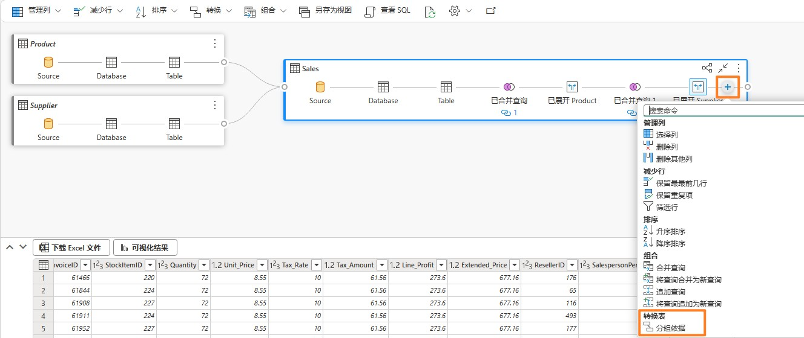
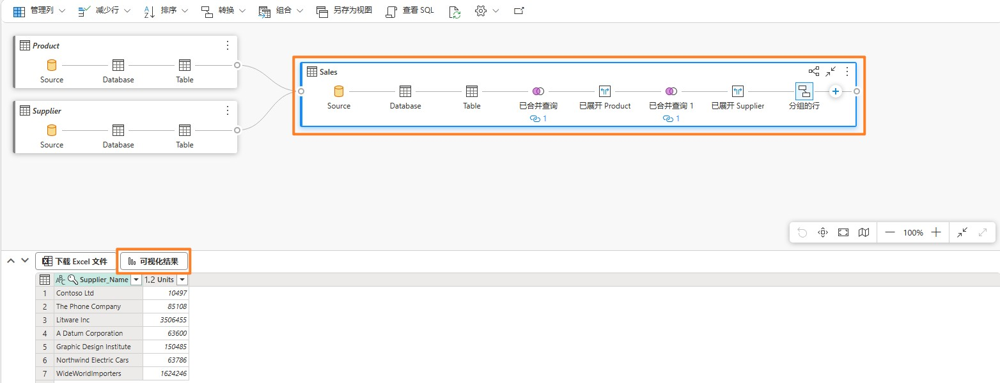
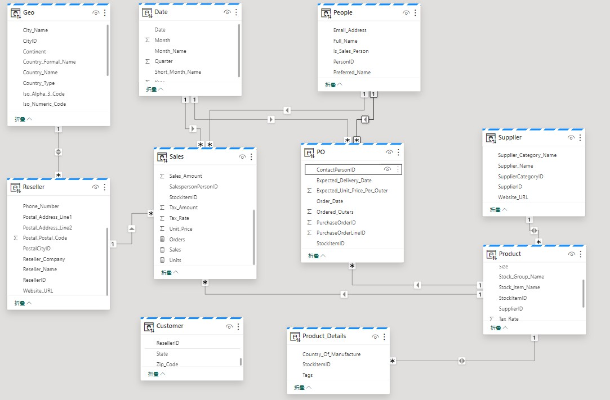

## 目录

- 简介

- Lakehouse
    - 任务 1：使用 SQL 查询数据	

    - 任务 2：可视化T-SQL 结果

    - 任务 3：创建视觉对象查询

    - 任务 4：可视化查询结果

    - 任务 5：创建关系

    - 任务 6：创建度量

    - 任务 7：可选部分- 创建关系	

    - 任务 8：可选部分- 创建度量

参考

## 简介

我们已将来自不同来源的数据引入到  Lakehouse。在本实验中，您将使用数据模型。我们通常在Power BI Desktop 中执行建模活动，例如创建关系、添加度量等。接下来我们将学习如何在该服务中执行这些建模活动。

本实验结束后，您将学会：

- 如何探索 Lakehouse

- 如何探索 Lakehouse 的 SQL 视图

- 如何探索 Lakehouse 中的数据建模

## Lakehouse

### 任务 1：使用SQL 查询数据

1.	让我们导航回到您在实验 2  任务 9 中创建的 Fabric 工作区 **FAIAD_<username>。**

2.	您将看到三种类型的lh_FAIAD - Lakehouse、语义模型和 SQL 终结点。我们在之前的实验中探索了 Lakehouse 选项。选择 **lh_FAIAD SQL 分析终结点**选项来探索 SQL 选项。您将导航到Explorer 的 **SQL 视图**。

如果您想在创建数据模型之前探索数据，可以使用SQL 执行此操作。我们来看一下使用 SQL 的两个选项，第一个选项适合开发人员，第二个选项适合分析师。

假设您想要使用SQL 快速找出供应商销售的单位数量。我们有两种选项，编写 SQL 语句或使用视觉对象创建 SQL 语句。
 
请注意，在左侧面板上，您可以查看表。展开表后，可以查看组成表的列。此外，还有创建SQL 视图、函数和存储过程的选项。如果您具备 SQL 背景知识，请随意探索这些选项。我们来尝试编写一个简单的 SQL 查询。

3.	从**顶部菜单选择新建 SQL 查询**，或从**左下角面板**选择**查询**。您将导航到 SQL 查询视图。

4.	将**以下 SQL 查询**粘贴到**查询窗口**中。此查询将按供应商名称返回单位数量。它将 Sales 表与Product 和 Supplier 表联接起来以实现此目的。

SELECT su.Supplier_Name, SUM(Quantity) as Units FROM dbo.Sales s
JOIN dbo.Product p on p.StockItemID = s.StockItemID JOIN dbo.Supplier su on su.SupplierID = p.SupplierID按su.Supplier_Name 分组

5.	点击 **Run** 查看结果。

6.	请注意，可以通过选择**另存为视图**来将此查询另存为视图。

7.	在**左侧 Explorer** 面板上的**查询**部分，请注意此查询保存在**我的查询**下，为 **SQL query 1。**这里提供一个选项用于重命名并保存该查询以供将来使用。还有一个选项用于使用**共享查询**文件夹查看与您共享的查询。
 
 

## 任务 2：可视化T-SQL 结果

1.	我们还可以可视化该查询的结果。在查询窗格中**突出显示查询**，然后选择**结果窗格**，然后 选择**探索此数据**。

2.	**探索 SQL 查询**对话框随即打开。在**数据**窗格中，展开 **SQL query 1**。

3.	选择 **Supplier_Name** 和 **Units** 字段。簇状条形图创建完成。

4.	从**可视化**部分，选择**堆积柱形图**以更改视觉对象类型。

 
 

5.	**展开矩阵**，以矩阵形式查看数据。

 
6.	选择屏幕右上角的**保存- > 另存为报表**。

7.	“保存报表”对话框随即打开。在**为报表输入名称文本框**中，输入 **Units by Supplier。**

8.	确保将目标工作区设置为您的Fabric 工作区 **FAIAD<username>**

9.	选择**保存**。

将导航到完整报表体验。您可以选择视觉对象的格式。我们将在下一个实验中讨论这些选项。
 
10.	从左侧面板中，选择 **lh_FAIAD。**

### 任务 3：创建视觉对象查询

您将导航回到**SQL 分析终结点视图**。如果您不熟悉SQL，可以使用视觉对象查询执行类似的查询。

1.	在顶部菜单中，选择**新建视觉对象查询**。视觉对象查询窗格随即打开。

2.	从左侧 **Explorer** 窗格中，展开 **Schemas -> dbo -> Tables**。

3.	将 **Sales、Product 和Supplier** 表拖至视觉对象查询窗格。

4.	选择 Sales 表后，从视觉对象查询窗格菜单中，选择组**合 -> 合并查询。**

5.	合并对话框随即打开。**从用于合并的右表下拉菜单**中，选择  **Product。**

6.	从 **Sales** 和 **Product** 表中，选择 **StockItemID**。这将合并 Product 和 Sales 表。

7.	在**联接种类**中，选择**左外**。

8.	选择**确定**。

 
9.	在**结果**窗格中，点击 **Product** 列旁边的**双箭头**。

10.	对话框随即打开，从对话框中选择 **SupplierID。**

11.	选择**确定**。注意，在 **Sales**  表中创建了**合并查询和展开的产品**步骤。

12.	我们按同样的步骤来合并 Supplier 表。在 **Sales **表中，选择“+”（位于展开的产品之后）以添加新步骤。对话框随即打开。

13.	选择**组合 -> 合并查询**。

14.	合并对话框随即打开。从**用于合并的右表下拉菜单**中，选择  **Supplier**。

15.	从 **Sales** 和 **Supplier** 表中，选择 **SupplierID**。这将合并Supplier 和 Sales 表。

16.	在**联接种类**中，选择**左外**。

17.	选择**确定**。

 

18.	在**结果**窗格中，点击 **Supplier** 列旁边的**双箭头。**

19.	对话框随即打开，从对话框中选择 **Supplier_Name。**

20.	选择**确定。**注意，在 Sales  表中添加了**合并查询并录制了步骤**。

21.	我们现在按供应商名称分组，以获取各供应商的数量。在 Sales 表中，选择“+”（位于展开的供应商之后）以添加新步骤。对话框随即打开。

22.	选择**转换表 -> 分组依据**。“分组依据”对话框随即打开。
 
 

23.	从**分组依据**下拉菜单中，选择 **Supplier_Name。**

24.	输入**单位数**作为合并查询对话框的 A 屏幕截图。

25.	将**操作**设为求和
26.	在列下拉菜单中**选择数量**。

27.	选择**确定**。

请注意，所有步骤均已录制在 Sales 区块中。（参考任务 4 下的第一个屏幕截图。）
 
## 任务 4：可视化查询结果

1.	现在我们的查询已经就绪，我们来查看结果。从结果窗格中选择**可视化结果**。

2.	可视化结果对**话**框随即打开。从右侧的数据窗格中，**展开视觉对象query1**。

3.	选择 **Supplier_Name 和 Units** 字段。

4.	请注意，结果类似于之前的SQL 查询结果。您可以选择保存此报表。由于我们之前保存了类似的报表，因此我们将选择**取消**。

 
### 任务 5：创建关系

现在我们准备生成模型、生成表之间的关系并创建度量。

1.	在**底部窗格**中，选择**模型**。您会注意到，中间窗格类似于我们在 Power BI Desktop 中看到的模型视图。

2.	根据需要对表**调整大小和重新排列**。

3.	我们在 Sales 和Reseller 表之间创建关系。从 **Sales** 表中选择 **ResellerID**，并将其拖至**Reseller** 表的 **ResellerID** 中。

4.	“新关系”对话框随即打开。确保 **Table 1** 是 **Sales**，**列是 ResellerID。**

5.	确保 **Table 2 是 Reseller，列是 ResellerID。**

6.	确保**基数为多对一 (*:1)**。

7.	确保**交叉筛选器方向为 Single。**

8.	选择 **Ok。**

 
9.	同样在 **Sales** 和 **Date** 表之间创建关系。从 **Sales** 表中选择 **InvoiceDate**，并将其拖至 **Date** 表的 **Date** 中。

10.	“新关系”对话框随即打开。确保 **Table 1 是 Sales，列是 InvoiceDate。**

11.	确保 **Table 2 是 Date，列是 Date。**

12.	确**保基**数**为多对一 (*:1)。**

13.	确保**交叉筛选器方向**为 **Single**。

14.	选择 **Ok**。

15.	同样，在 **Sales** 表和 **Product** 表之间创建多对一关系。从 **Sales** 表中选择 **StockItemID**，从**Product** 表中选择 **StockItemID**。

16.	从顶部菜单中，选择**报表-> 自动更新语义模型**，以保存并更新模型。

**检查点：** 您的模型应在 Sales 和Reseller 表、Sales 和 Date 表以及 Sales 和Product 表之间建立三种关系，如下面的屏幕截图所示：
 
 

由于时间原因，我们不会创建所有关系。如果时间允许，实验结束后，您可以完成可选部分。 可选部分将逐步介绍创建其余关系的步骤。

### 任务 6：创建度量

我们添加一些创建销售仪表板时所需的度量。

1.	从模型视图中选择 **Sales 表**。我们想要将度量添加到 Sales 表中。

2.	从顶部菜单中，选择**主页-> 新建度值**。请注意，编辑栏已显示。
3.	在编辑栏中输入 **Sales = SUM(Sales[Sales_Amount])。**

4.	点击编辑栏左侧的**复选标记**，或点击 **Enter** 按钮。

5.	在右侧的“属性”面板中，展开**格式化**部分。

6.	从**格式**下拉菜单中，选**择整数**。

 
7.	从顶部菜单中选择 **Sales 表**后，选择主**页 -> 新建度量值**。请注意，编辑栏已显示。

8.	在**编辑栏**中输入 **Units = SUM(Sales[Quantity])。**

9.	点击编辑栏左侧的**复选标记**，或点击 Enter 按钮。

10.	在右侧的“属性”面板中，展开**格式化**部分（加载“属性”面板可能需要一些时间）。

11.	从**格式**下拉菜单中，选择**整数**。

12.	从顶部菜单中选择 **Sales 表**后，选择**主页 -> 新建度量值**。请注意，编辑栏已显示。

13.	在**编辑栏**中输入 **Orders = DISTINCTCOUNT(Sales[InvoiceID])。**

14.	点击编辑栏左侧的复**选标记**，或点击 **Enter** 按钮。

15.	在右侧的“属性”面板中，展开**格式化**部分。

16.	从**格式**下拉菜单中，选择**整数**。

同样由于时间原因，我们不会创建所有度量。如果时间允许，实验结束后，您可以完成可选部 分。可选部分将逐步介绍创建其余度量的步骤。
我们已经创建了数据模型，下一步是创建报表。我们将在下一个实验中执行此任务。
 
### 任务 7：可选部分- 创建关系

我们来添加其余的关系。

1.	同样，在 **Sales** 和 **People** 之间创建多对一关系。从 **Sales** 中选择 **SalespersonPersonID**， 从 **People** 中选择 **PersonID。**

**检查点：** 您的模型应类似于下面的屏幕截图所示。

2.	我们接下来在**Product** 和 **Supplier** 之间创建关系。从 **Product** 表中选择 **SupplierID**，并将其拖至 **Supplier** 表的 **SupplierID** 中。

3.	“新关系”对话框随即打开。确保 **Table 1** 是 **Product**，列是 **SupplierID。**

4.	确保 **Table 2** 是 **Supplier**，**列**是 **SupplierID。**

5.	确保**基数为多对一 (*:1)**。

6.	确保**交叉筛选器方向为两者**。
7.	选择 **Ok**。

 

8.	同样，在 **Product_Details** 和 **Product** 之间创建**多对一**关系，**交叉筛选器方向为两者**。从
**Product_Details** 中选择 **StockItemID**，从 **Product** 中选择 **StockItemID**。

9.	我们接下来在**Reseller** 和Geo 之间创建关系。从 Reseller 表中选择 **PostalCityID**，并将其拖至 **Geo** 表中的 **CityID**。

10.	“新关系”对话框随即打开。确保 **Table 1 是 Reseller，列是 PostalCityID**。

11.	确保 **Table 2 是 Geo，列是 CityID**。

12.	确保**基数**为**多对一 (*:1)**。

13.	确保**交叉筛选器方向**为**两者**。

14.	选择 **Ok。**

15.	我们接下来在 Customer 和Reseller 之间创建关系。从 **Customer** 表中选择 **ResellerID**，并将其拖至 **Reseller** 表的 **ResellerID** 中。

16.	“新关系”对话框随即打开。确保 **Table 1 是 Customer，列** 是 **ResellerID**。

17.	确保 **Table 2** 是 **Reseller**，**列**是 **ResellerID**。

18.	确保**基数为多对一 (*:1)**。

19.	确保**交叉筛选器方向**为 **Single**。

20.	选择 **Ok**。

 
**检查点：**您的模型应类似于下面的屏幕截图所示。

21.	我们接下来在**PO** 和 Date 之间创建关系。从 PO  表中选择 **Order_Date**，并将其拖至 **Date** 表中的 **Date**。

22.	“新关系”对话框随即打开。确保 **Table 1** 是 **PO**，列是 **Order_Date。**

23.	确保 **Table 2** 是 **Date，列**是 **Date。**

24.	确保**基数为**多**对一 (*:1)。
**
25.	确保**交叉筛选器**方向为 **Single。**

26.	选择 **Ok**。

 
27.	同样，在 **PO** 和 **Product** 之间创建多对一关系。从 **PO** 中选择 **StockItemID**，从 **Product** 中选择 **StockItemID**。

28.	同样，在 **PO** 和 **People** 之间创建多对一关系。从 **PO** 中选择 **ContactPersonID**，从 **People** 中选择 **PersonID**。

我们已经创建了所有关系。

**检查点**：您的模型应类似于下面的屏幕截图所示。

 
### 任务 8：可选部分- 创建度量

我们来添加其余的度量。

1.	选择 Sales 表，然后从顶部菜单中选择表工**具 -> 新建度量值**。

2.	在编辑栏中输入 **Avg Order = DIVIDE([Sales], [Orders])**。

3.	点击编辑栏的复**选标记**，或点击 Enter 按钮。

4.	保存度量后，请注意顶部菜单上的“度量工具”选项。点击**度量工具**。

5.	在“格式”下拉菜单中，点击**小数**。

6.	按照相似的步骤添加以下度量：

&nbsp; &nbsp; &nbsp; &nbsp; &nbsp;a.**GM = SUM(Sales[Line_Profit])** 格式设为**小数。**

&nbsp; &nbsp; &nbsp; &nbsp; &nbsp;b.**GM% = DIVIDE([GM], [Sales])** 格式设为**百分数**。

&nbsp; &nbsp; &nbsp; &nbsp; &nbsp;c.**No of Customers = COUNTROWS(Customer)**，格式设置为**整数**
 
## 参考
Fabric Analyst in a Day (FAIAD) 介绍了Microsoft Fabric 中提供的一些主要功能。在服务菜单中， “帮助 (?)”部分包含指向一些优质资源的链接。

以下更多参考资源可帮助您进行 Microsoft Fabric 相关的后续步骤。

- 请参阅博客文章以阅读完整的[Microsof t Fabric GA 公告](https://aka.ms/Fabric-Hero-Blog-Ignite23)

- 通过[引导式教程](https://aka.ms/Fabric-GuidedTour)探索 Fabric

- 注册 [Microsoft Fabric 免费试用版](https://aka.ms/try-fabric)

- 通过探索[Microsoft Fabric 网站](https://aka.ms/microsoft-fabric)

- 通过探索 [Fabric 学习模块](https://aka.ms/learn-fabric)学习新技能

- 探索 [Fabric 技术文档](https://aka.ms/fabric-docs)

- 阅读[有关Fabric 入门指南的免费电子书](https://aka.ms/fabric-get-started-ebook)

- 加入[Fabric 社区](https://aka.ms/fabric-community)发布问题、分享反馈并向他人学习

阅读更多深度Fabric 体验公告博客：

- [Fabric 中的Data Factory 体验博客](https://aka.ms/Fabric-Data-Factory-Blog)

- [Fabric 中的Synapse Data Engineering 体验博客](https://aka.ms/Fabric-DE-Blog)

- [Fabric 中的Synapse Data Science 体验博客](https://aka.ms/Fabric-DS-Blog)

- [Fabric 中的Synapse Data Warehousing 体验博客](https://aka.ms/Fabric-DW-Blog)

- [Fabric 中的Synapse Real-Time Analytics 体验博客](https://aka.ms/Fabric-RTA-Blog)

- [Power BI 公告博客](https://aka.ms/Fabric-PBI-Blog)

- [Fabric 中的Data Activator 博客](https://aka.ms/Fabric-DA-Blog)

- [Fabric 中的管理和治理博客](https://aka.ms/Fabric-Admin-Gov-Blog)

- [Fabric 中的OneLake 博客](https://aka.ms/Fabric-OneLake-Blog)

- [Dataverse 和Microsof t Fabric 集成博客](https://aka.ms/Dataverse-Fabric-Blog)

© 2023 Microsoft Corporation.保留所有权利。

© 2023 Microsoft Corporation.保留所有权利。使用此演示/实验即表示您已同意以下条款: 
本演示/实验中的技术/功能由 Microsoft Corporation 出于获取反馈和提供学习体验的目的提供。只能将本演示/实验用于评估这些技术特性和功能以及向Microsoft 提供反馈。不得用于任何其他用途。不得对此演示/实验或其任何部分进行修改、复制、分发、传送、显示、 执行、复制、公布、许可、转让、销售或基于以上内容创建衍生作品。
严禁将本演示/实验（或其任何部分）复制到任何其他服务器或位置以便进一步复制或再  分发。

本演示/实验出于上述目的，在不涉及复杂设置或安装操作的模拟环境中提供特定软件技术
/产品特性和功能，包括潜在的新功能和概念。本演示/实验中展示的技术/概念可能不是完 整的功能，可能会以不同于最终版本的工作方式工作。我们也可能不会发布此类功能或概念的最终版本。在物理环境中使用此类特性和功能的体验可能也有所不同。

**反馈**。如您针对本演示/实验中所述的技术特性、功能和/或概念向 Microsoft 提供反馈，则意味着您向Microsoft  无偿提供以任何方式、出于任何目的使用和分享您的反馈并将其商业化的权利。您同样无偿为第三方提供其产品、技术和服务使用或配合使用包含此反馈的
Microsoft 软件或服务的任何特定部分所需的任何专利权。如果根据某项许可的规定，
Microsoft  由于在其软件或文档中包含了您的反馈需要向第三方授予该软件或文档的许可， 请不要提供这样的反馈。这些权利在本协议终止后继续有效。
反馈。如您针对本演示/实验中所述的技术特性、功能和/或概念向 Microsoft 提供反馈，则意味着您向Microsoft  无偿提供以任何方式、出于任何目的使用和分享您的反馈并将其商业化的权利。您同样无偿为第三方提供其产品、技术和服务使用或配合使用包含此反馈的
Microsoft 软件或服务的任何特定部分所需的任何专利权。如果根据某项许可的规定，
Microsoft  由于在其软件或文档中包含了您的反馈需要向第三方授予该软件或文档的许可， 请不要提供这样的反馈。这些权利在本协议终止后继续有效。

对于本演示/实验，Microsoft Corporation 不提供任何明示、暗示或法定的保证和条件，包括有关适销性、针对特定目的的适用性、所有权和不侵权的所有保证和条件。对于使用本 演示/实验产生的结果或输出内容的准确性，或者出于任何目的包含本演示/实验中的信息的适用性，Microsoft 不做任何保证或陈述。

**免责声明**

本演示/实验仅包含 Microsoft Power BI 的部分新功能和增强功能。在产品的后续版本中， 部分功能可能有所更改。在本演示/实验中，可了解部分新功能，但并非全部新功能。
