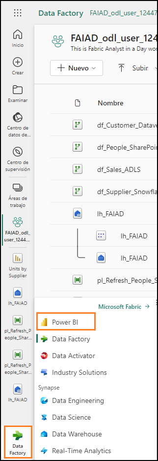
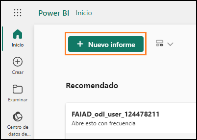
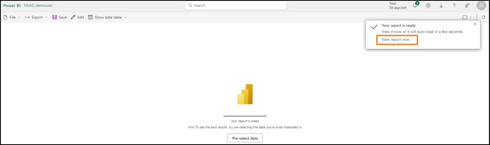
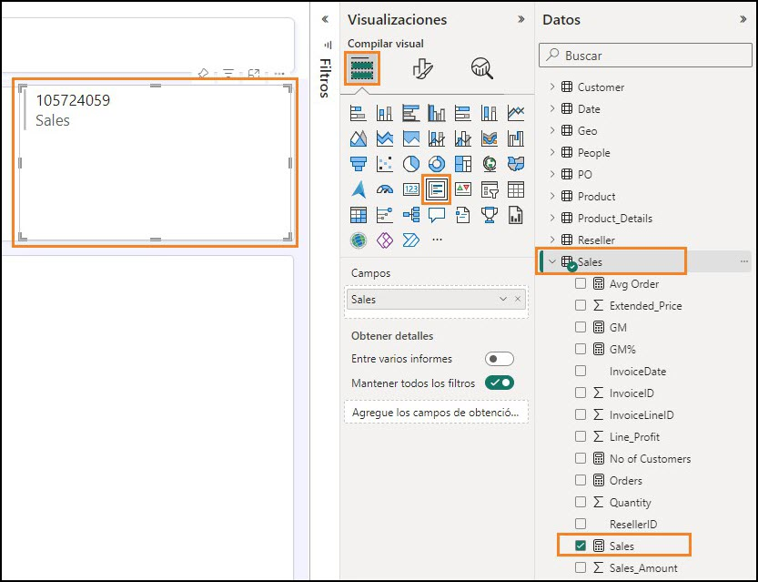
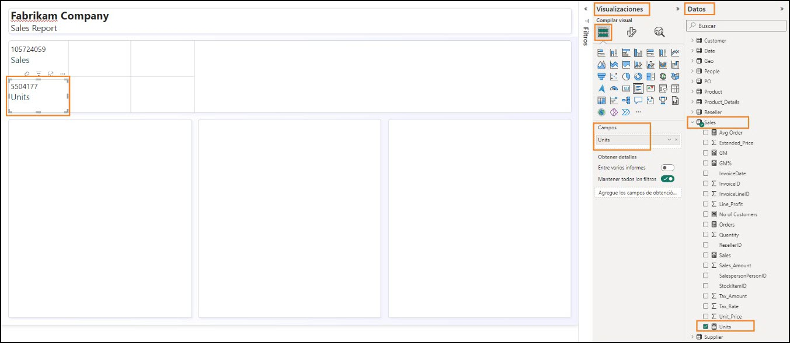
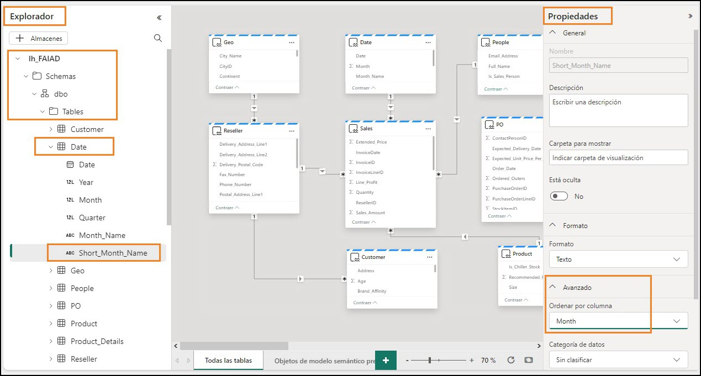
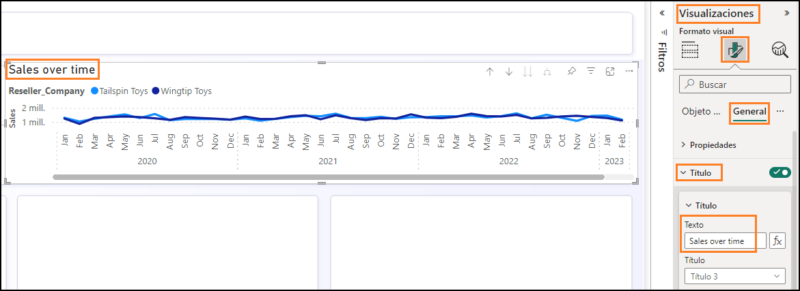
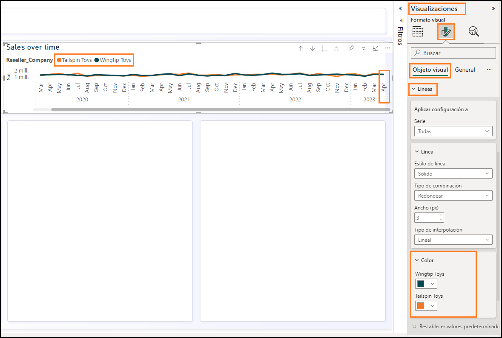
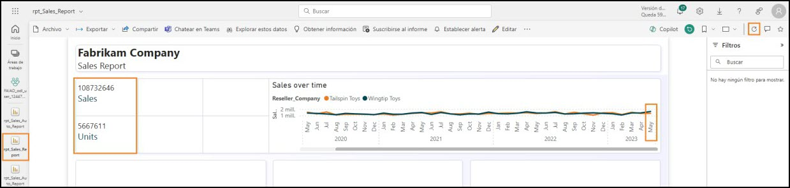
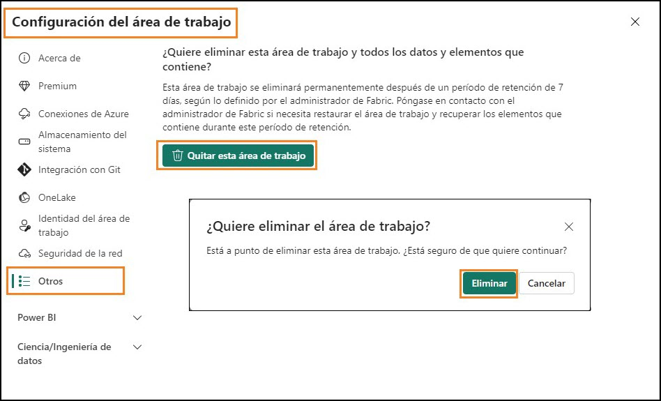

## Sommario
- Introduzione	
- Power BI	
   - Attività 1 - Creazione automatica del report	
   - Attività 2 - Configurazione dello sfondo per un nuovo report	
   - Attività 3 - Aggiunta dell'intestazione al report	
   - Attività 4 - Aggiunta di KPI al report	
   - Attività 5 - Aggiunta di un grafico a linee al report	
   - Attività 6 - Salvataggio del report	
   - Attività 7 - Configurazione della colonna Year nella tabella Date	
  - Attività 8 - Configurazione della colonna Short_Month_Name nella tabella Date	
   - Attività 9 – Formattazione del grafico a linee	
   - Attività 10 - Aggiunta di nuovi dati per simulare la modalità Direct Lake	
- Pulizia dell'ambiente lab	
- Riferimenti	


# Introduzione
Abbiamo inserito dati provenienti da diverse origini dati in Lakehouse, abbiamo presentato
Lakehouse, impostato la pianificazione di un aggiornamento per le origini dati e creato un modello di dati. Ora creeremo un report.
In questo lab si imparerà a:
- Creare automaticamente un report
- Creare un report iniziando da un canvas vuoto
- Usare la modalità Direct Lake che comporta l'aggiornamento automatico dei dati


## Power BI
### Attività 1 - Creazione automatica del report
Iniziamo usando l'opzione di creazione automatica del report. Più avanti nel lab, creeremo nuovamente il report presente in Power BI.

1.	Torniamo all'**area di lavoro di Fabric** creata nel lab precedente.

2.	Nella parte inferiore del pannello di sinistra selezionare l'icona **selettore esperienza in Fabric**.

3.	Si apre la finestra di dialogo delle esperienze in Fabric. Selezionare **Power BI**. Si aprirà la **Home page di Power BI**.

      
 
4.	Selezionare **Nuovo report** dal menu in alto.

   
  	
5.	Si aprirà la schermata **Creare il primo report**. Saranno disponibili opzioni per immettere
manualmente e creare un report o selezionare un modello semantico pubblicato. Abbiamo creato un modello semantico nei lab precedenti, che useremo ora. **Selezionare l'opzione Selezionare un modello semantico pubblicato**.

      
  	
6.	Scegliere un set di dati da usare nella pagina del report che si apre. Notare che sono presenti quattro opzioni. **Selezionare lh_FAIAD**:<br>
      a.	**lh_FAIAD**: questo è il lakehouse con il set di dati che abbiamo creato e che vogliamo usare per il report.<br>
      b.	**Units by Supplier**: questo è il set di dati che abbiamo creato mediante T-SQL.<br>
      c.	**DataflowsStagingWarehouse**: si tratta del warehouse di staging creato per impostazione predefinita. Non l'abbiamo usato poiché non abbiamo eseguito lo staging dei dati.<br>
      d.	**DataflowsStagingLakehouse**: si tratta del Lakehouse di staging creato per impostazione predefinita. Non l'abbiamo usato poiché non abbiamo eseguito lo staging dei dati.<br>
9.	Fare clic sulla **freccia accanto al pulsante Crea automaticamente** il report. Notare che vi sono due opzioni: **Crea automaticamente il report** e Crea un report vuoto. Vogliamo provare la creazione automatica, quindi selezioniamo **Crea automaticamente il report**.
 
      

10. Power BI avvierà la creazione automatica del report. Si noti la presenza di un'opzione per preselezionare i dati, se lo desideriamo. Quando il report è pronto, in alto a destra della schermata si apre una finestra di dialogo. Selezionare **View report now**.

      
   	
>**Checkpoint**: il report sarà simile a quello illustrato nello screenshot seguente. Sono presenti alcuni KPI e alcuni oggetti visivi sulle tendenze. Questo è buon inizio se si sta analizzando un nuovo modello ed è necessario un iniziare rapidamente.

>**Nota**: nel menu in alto è presente l'opzione per modificare il report o visualizzare i dati sotto forma di tabelle. Esplorare liberamente queste opzioni.

9.	Salviamo il report. Nel menu in alto selezionare **Salva**.

10. Si apre la finestra di dialogo Salva report. Assegnare al report il nome **rpt_Sales_Auto_Report**.

>**Nota**: all'inizio del nome del report aggiungiamo il prefisso rpt, ovvero l'abbreviazione di report.

11. Assicurarsi che il report sia salvato nell'area di lavoro **FAIAD_<nome utente>**.
    
12. Selezionare **Salva**.

      
   	
>**Nota**: il report creato automaticamente potrebbe avere un aspetto diverso poiché è stato "creato automaticamente". Dipende anche dalle relazioni e dalle misure create nel lab precedente (Lab 6).

- Lo screenshot precedente mostra come **potrebbe** apparire il report creato automaticamente se si fossero create tutte le relazioni e le misure, incluse le relazioni facoltative (Lab 6).
- Lo screenshot seguente mostra come **potrebbe** apparire il report creato automaticamente se non si fossero create le relazioni e le misure facoltative (Lab 6).
    
  
 
## Attività 2 - Configurazione dello sfondo per un nuovo report

Creiamo un nuovo report usando un'area di disegno vuota.
1.	Nel **pannello di sinistra** selezionare il nome dell'area di lavoro, **FAIAD_<nome utente>**, per tornare a essa.

2.	Nel menu in alto selezionare **Nuovo -> Report**. Si aprirà la pagina per creare il primo report.

      
  	
3.	Fare clic su **Selezionare un modello semantico pubblicato** per poter scegliere il modello creato.

   
  	
4.	Scegliere un modello semantico da usare nella finestra di dialogo report che viene visualizzata. Selezionare **lh_FAIAD**.
 
5.	Fare clic sulla **freccia accanto al pulsante Crea automaticamente il report**. Selezionare **Crea un report vuoto**.
   
      
  	
6.	Se non lo si è ancora aperto, aprire il file **FAIAD.pbix** contenuto nella cartella **C:\FAIAD\Reports**
dell'ambiente lab.
Useremo questo report come riferimento. Inizieremo aggiungendo lo sfondo del canvas. Creeremo l'intestazione del report, aggiungeremo un paio di KPI e creeremo il grafico a linee Sales over time. Per risparmiare tempo, presupponendo che si abbia esperienza nella creazione di oggetti visivi in Power BI Desktop, non creeremo tutti gli oggetti visivi.

      
      	
7. Tornare al **Power BI canvas** nel browser.

8. Selezionare l'icona **Formatta pagina** nel riquadro Visualizzazioni.

9. Espandere la sezione **Sfondo canvas**.

10. Selezionare **Sfoglia** dall'opzione **Immagine**. Si apre la finestra di dialogo Esplora file.

11. Andare alla cartella **C:\FAIAD\Reports** dell'ambiente lab.

12. Selezionare **Summary Background.png**.

13. Impostare l'elenco a discesa **Adattamento immagine** su **Adatta**.

14. Impostare Trasparenza su **0%**.

      
   	
### Attività 3 - Aggiunta dell'intestazione al report
1.	Aggiungiamo l'intestazione nel margine superiore. Nel **menu** selezionare **Casella di testo**.

2.	Immettere **Fabrikam Company** come prima riga nella casella di testo.

3.	Immettere **Sales Report** come seconda riga nella casella di testo.

4.	Evidenziare **Fabrikam Company** e impostare **Tipo di carattere** su **Segoe UI** e **Dimensioni carattere** su 1**8, grassetto**.

5.	Evidenziare **Report vendite** e impostare **Tipo di carattere** su **Segoe UI** e **Dimensioni carattere** su **14**.

6.	Con la **casella di testo selezionata**, nel riquadro Casella di testo Formato sulla destra espandere **Effetti**.

7.	Impostare il dispositivo di scorrimento **Sfondo** su **Disattivato**.

8.	Ridimensionare la **casella di testo per adattarla al margine superiore**.

      
 
### Attività 4 - Aggiunta di KPI al report
1.	Aggiungiamo l'indicatore KPI delle vendite. Selezionare lo **spazio vuoto** nell'area di disegno per spostare lo stato attivo fuori dalla casella di testo.

2.	Nella sezione **Visualizzazioni** selezionare l'oggetto visivo **Scheda con più righe**.

3.	Nella sezione **Dati** espandere la tabella **Sales**.

4.	Selezionare la **misura Sales**.

      
  	
5.	Con l'**oggetto visivo Scheda con più righe selezionato**, selezionare l'icona **Formatta oggetto visivo** dalla sezione Visualizzazioni.

6.	Espandere la sezione **Etichette categorie**.

7.	Aumentare la **dimensione del carattere** a **14**.

8.	Selezionare il menu a discesa **Colore**. Si apre la finestra di dialogo Tavolozza dei colori.
 
9. Impostare il valore Esadecimale su **#004753**.

   
   	
10. Espandere la sezione **Schede**.
 
11. Impostare il dispositivo di scorrimento **Barra evidenziatore** su **Disattivato**.
    
      
   	
12. Selezionare **Generale** nel riquadro Visualizzazioni.

13. Espandere la sezione **Effetti**.

14. Impostare il dispositivo di scorrimento **Sfondo** su **Disattivato**.

15. Ridimensionare l'**oggetto visivo** e spostarlo nella **casella di sinistra come illustrato nello screenshot**.
    
      
   	
16. Aggiungiamo un altro indicatore KPI. Selezionare la **scheda con più righe Sales** appena creata. **Copiare** l'oggetto visivo premendo **CTRL+C** sulla tastiera.

17. **Incollare** l'oggetto visivo premendo **CTRL+V** sulla tastiera. Notare che l'oggetto visivo viene incollato nel canvas. 

18. Con il **nuovo oggetto visivo evidenziato**, in **riquadro Visualizzazioni** **-> Compila oggetto visivo -> Campi** rimuovere la misura **Sales**.

19. Nella sezione **Dati** espandere la tabella Sales e selezionare la misura **Units**.

20. Ridimensionare l'**oggetto visivo** e **posizionarlo nella casella sotto l'oggetto visivo Sales**.

      
   	
### Attività 5 - Aggiunta di un grafico a linee al report
Creiamo un grafico a linee per visualizzare le vendite nel tempo per azienda rivenditrice.

1.	Selezionare lo **spazio vuoto** nel canvas per spostare lo stato attivo fuori dall'oggetto visivo scheda con più righe.

2.	Nella sezione **Visualizzazioni** selezionare **Grafico a linee**.

3.	Nella sezione **Dati** espandere la tabella **Date**.

4.	Selezionare il campo **Year**. Si noti che Year viene sommato per impostazione predefinita e aggiunto all'asse Y. Correggiamo.

      
 
### Attività 6 - Salvataggio del report
Salviamo il report prima di uscire da esso per apportare modifiche al modello.

1.	Nel menu selezionare **File -> Salva**.

2.	Si apre la finestra di dialogo Salva report. Assegnare al report il nome **rpt_Sales_Report**.
   
>**Nota:** all'inizio del nome del report aggiungiamo il prefisso rpt, ovvero l'abbreviazione di report.

3.	Assicurarsi che il report sia salvato nell'area di lavoro **FAIAD_<nome utente>**.

4.	Selezionare **Salva**.

      

### Attività 7 - Configurazione della colonna Year nella tabella Date
1.	Nella **barra dei menu a sinistra** selezionare **lh_FAIAD** per spostarsi sul Lakehouse.

2.	Nel riquadro Explorer di sinistra espandere **lhFAIAD -> Schemas -> dbo -> Tables -> Date**.

3.	Selezionare la colonna **Year**.

4.	Nel riquadro **Proprietà** a destra espandere la sezione **Avanzate**.

5.	Nell'elenco a discesa **Riepiloga per** selezionare **Nessuno**.

      
  	
6.	Tornare al report selezionando **rpt_Sales_Report** nella barra dei menu a sinistra.

7.	Selezionare **Modifica** dal menu in alto.
 
8.	Nel menu in alto selezionare **Aggiorna**. Si noti che nel pannello Dati, Year non è un campo di somma.

9. Con l'**oggetto visivo grafico a linee selezionato, rimuovere Somma di Year** dall'asse Y.

10. Selezionare il campo **Year** per aggiungerlo all'**asse X**.

11. Espandere la tabella **Sales** e selezionare la **misura Sales**.

      

### Attività 8 - Configurazione della colonna Short_Month_Name nella tabella Date

1.	Aggiungiamo il mese al grafico. Nella tabella Date trascinare il campo **Short_Month_Name** sotto
**Year** sull'**asse X**. Notare che l'oggetto visivo è ordinato in base a Sales. Ordiniamolo in base a Short_Month_Name.

2.	Selezionare i **puntini di sospensione** (…) nell'angolo superiore destro dell'oggetto visivo.

3.	Selezionare **Ordina asse -> Year Short_Month_Name**.

4.	Selezionare i **puntini di sospensione (…)** nell'angolo superiore destro dell'oggetto visivo.

5.	Selezionare **Ordina asse -> Ordinamento crescente**.

      
   
>**Nota**: i mesi sono ordinati in ordine alfabetico. Correggiamo.

   
 
6.	Nella **barra dei menu a sinistra** selezionare **lh_FAIAD** per spostarsi sul Lakehouse.

7.	Si apre la finestra di dialogo **Modifiche non salvate**. Selezionare **Salva** per salvare le modifiche al report.

      
  	
8.	Si passerà al Lakehouse lh_FAIAD. Nel riquadro Explorer di sinistra espandere **lhFAIAD -> Schemas -> dbo -> Tables -> Date**.

9. Selezionare la colonna **Short_Month_Name**.
11. Nel riquadro **Proprietà** a destra espandere la sezione **Avanzate**.
12. Nell'elenco a discesa **Ordina per colonna** selezionare **Month**.

      
   	
10. Tornare al report selezionando **rpt_Sales_Report** nella barra dei menu a sinistra.

11. Selezionare **Modifica** dal menu in alto.

12. Nel menu in alto selezionare **Aggiorna**. Si noti che i mesi sono ordinati correttamente.
 
      
   	
### Attività 9 – Formattazione del grafico a linee

È molto semplice aggiornare il modello semantico durante la creazione dei report. Ciò fornisce un'interazione fluida come Power BI Desktop.

1.	Con l'**oggetto visivo grafico a linee selezionato**, nella sezione **Dati** espandere la tabella **Reseller**.

2.	Trascinare il campo **Reseller -> Reseller Company** nella sezione **Legenda**.
   
      
  	
3.	Con l'**oggetto visivo grafico a linee selezionato**, nella sezione Visualizzazioni selezionare l'icona **Formatta oggetto visivo -> Generale**.

4.	Espandere la sezione **Titolo**.

5.	Impostare il testo di **Titolo** su **Sales over time**.

6.	Espandere la sezione **Effetti**.
 
7.	Impostare il dispositivo di scorrimento **Sfondo** su **Disattivato**.
   
      
  	
8.	Nella sezione **Visualizzazione** selezionare l'icona **Formatta oggetto visivo -> Oggetto visivo**.

9.	Espandere la sezione **Righe**.

10. Espandere la sezione **Colore**.

11. Impostare il colore di **Wingtip Toys** su **#004753**

12. Impostare il colore di **Tailspin Toys** su **#F17925**

13. Ridimensionare l'**oggetto visivo e spostarlo nella casella in alto a destra come illustrato nello screenshot**.

14. Scorrere verso destra l'oggetto visivo e si **noti che sono presenti dati fino ad aprile 2023**.

      
   	
15. Per salvare il report, nel menu selezionare **File -> Salva**.Come indicato in precedenza, non creeremo tutti gli oggetti visivi in questo lab. Se si desidera, aggiungere ulteriori oggetti visivi.

### Attività 10 - Aggiunta di nuovi dati per simulare la modalità Direct Lake

In genere, in modalità Import, dopo aver aggiornato i dati nell'origine è necessario aggiornare il modello di Power BI dopodiché vengono aggiornati i dati nel report. Con la modalità Direct Query, quando i dati vengono aggiornati nell'origine sono disponibili nel report Power BI. Tuttavia, la modalità Direct Query è in genere lenta. Per risolvere questo problema, Microsoft Fabric ha introdotto la modalità Direct Lake. Direct Lake è un percorso rapido per caricare i dati dal lake al motore di Power BI per poter procedere immediatamente con l'analisi. Vediamolo.

In uno scenario reale, i dati vengono aggiornati nell'origine. Poiché ci troviamo in un ambiente di formazione, simuleremo questo comportamento collegando un file Parquet ai dati relativi a maggio 2023.

1.	Selezionare **FAIAD_<nome utente>** nella barra dei menu di sinistra per andare alla home page dell'area di lavoro.

2.	Selezionare **df_Sales_ADFS** per poter modificare il flusso di dati aggiungendo il nuovo file Parquet.

      
  	
3.	Nella barra multifunzione selezionare **Home -> Recupera -> Query vuota**.

4.	Si apre la finestra di dialogo Connetti a origine dati. Selezionare **tutte le righe nell'editor ed eliminarle**.

5.	Copiare il codice seguente e incollarlo nell'editor.

```
let
Source = #"ADLS Base Folder",
#"Filtered Rows" = Table.SelectRows(Source, each Text.Contains([Folder Path], "Sales.Invoices_May")),
 
#"https://stvnextblobstorage dfs core windows net/fabrikam-sales/Delta-Parquet-Format/Sales Invoices_May/_0- 0ee085a3-716f-4833-a792-c3162c1de300-0 parquet" = #"Filtered Rows"{[#"Folder
Path"="https://stvnextblobstorage.dfs.core.windows.net/fabrikam-sales/Delta-Parquet- Format/Sales.Invoices_May/",Name="0-0ee085a3-716f-4833-a792-c3162c1de300-0.parquet"]}[Content],
#"Imported Parquet" = Parquet.Document(#"https://stvnextblobstorage dfs core windows net/fabrikam-sales/Delta- Parquet-Format/Sales Invoices_May/_0-0ee085a3-716f-4833-a792-c3162c1de300-0 parquet")
in
#"Imported Parquet"
```

6.	Selezionare **Avanti**.

      
  	
7.	Si ricrea una nuova query. **Rinominarla**. Rinominare la query in **MayInvoice** nel pannello di destra in **Impostazioni query -> Proprietà -> Nome**.

8.	Disabilitiamo lo staging per la nuova query. **Fare clic con il pulsante destro del mouse** sulla query MayInvoice e **deselezionare Abilita staging**.

      
  	
9. Ora aggiungiamo i dati di MayInvoice alla tabella Invoice. Selezionare la query Invoice dalla sezione Query.

11. Nella barra multifunzione selezionare **Home -> Accoda query**.

12. Si apre la finestra di dialogo Accoda. Nel menu a discesa **Tabella da accodare** selezionare **MayInvoice**. 

13. Selezionare **OK**.
    
      
   	
14. Selezionare **Pubblica** nell'angolo inferiore destro per salvare e pubblicare gli aggiornamenti.

      
   	
>**Nota**: una volta pubblicato, il flusso di dati verrà aggiornato. L'operazione potrebbe richiedere alcuni minuti.
   	
15. Selezionare **rpt_Sales_Report** nella barra dei menu di sinistra per tornare al report.

16. Nel menu in alto selezionare **Aggiorna**. Si noti che ora nel grafico a linee sono presenti dati per maggio 2023. Si noti, inoltre, che l'importo delle vendite e l'unità sono aumentati.

      
 
I flussi di dati creati nei lab precedenti vengono aggiornati secondo pianificazione, i dati vengono inseriti nel lakehouse. Il modello di dati nel lakehouse e i report vengono aggiornati. Non è
necessario aggiornare il modello di dati e il report quando ciascun flusso di dati viene aggiornato. Questo è il vantaggio di Direct Lake.
Ricontrolliamo le problematiche elencate nell'esposizione del problema:

- **È necessario aggiornare il set di dati almeno tre volte al giorno per adattarsi ai diversi tempi di aggiornamento delle diverse origini dati.**

Abbiamo risolto questo problema usando Direct Lake. Ogni singolo flusso di dati viene aggiornato in base alla propria pianificazione. Non è necessario aggiornare il set di dati e il report.

- **Gli aggiornamenti richiedono molto tempo in quanto è necessario eseguire un aggiornamento completo ogni volta per acquisire eventuali aggiornamenti dei sistemi di origine.**

Abbiamo risolto anche questo problema usando Direct Lake. Ogni singolo flusso di dati viene aggiornato in base alla propria pianificazione. Non è necessario aggiornare il set di dati e il report, perciò non è richiesto un aggiornamento completo.

- **Se si verificano errori in qualsiasi delle origini dati da cui si estraggono i dati, l'aggiornamento del set di dati si interrompe. Spesso il file dei dipendenti non viene caricato in tempo e ciò causa l'interruzione dell'aggiornamento del set di dati.**

Pipeline di dati aiuta a risolvere questo problema, consentendo di provare più volte a eseguire l'aggiornamento a intervalli diversi.

- **Eventuali modifiche al modello di dati richiedono molto tempo in quanto Power Query richiede molto tempo per l'aggiornamento delle anteprime, date le dimensioni elevate dei dati e le trasformazioni complesse.**

Abbiamo notato che i flussi di dati sono efficienti e facili da modificare. In genere, il caricamento dell'anteprima nei flussi di dati non richiede molto tempo.

- **È necessario un PC Windows per usare Power BI Desktop anche se lo standard aziendale è Mac.**

Microsoft Fabric è un'offerta SaaS. Tutto ciò di cui abbiamo bisogno è un browser per accedere al servizio. Non dobbiamo installare alcun software nei nostri desktop.
 
### Pulizia dell'ambiente lab
Quando si è pronti a eseguire la pulizia dell'ambiente lab, effettuare i passaggi seguenti.

1.	Selezionare l'area di lavoro **FAIAD_<nome utente>** nel pannello di sinistra per andare alla home page dell'area di lavoro.

2.	Nel menu in alto selezionare i **puntini di sospensione (…)** accanto a Gestisci accesso e selezionare **Impostazioni area di lavoro**.

      
  	
3.	Si apre la finestra di dialogo Impostazioni area di lavoro. Nel menu a sinistra selezionare **Altro**.

4.	Selezionare **Rimuovere questa area di lavoro**.

5.	Si apre la finestra di dialogo Eliminare l'area di lavoro?. Selezionare **Elimina**.

  	In questo modo si elimineranno l'area di lavoro e tutti gli elementi che contiene.

      
  	
## Riferimenti

Fabric Analyst in a Day (FAIAD) presenta alcune delle funzionalità chiave disponibili in Microsoft Fabric. Nel menu di servizio, la sezione Guida (?) include collegamenti ad alcune risorse utili.

   
    
Di seguito sono riportate ulteriori risorse utili che consentiranno di progredire nell'uso di Microsoft Fabric.<br>
- Vedere il post di blog per leggere l'[annuncio completo sulla disponibilità generale di Microsof t Fabric](https://aka.ms/Fabric-Hero-Blog-Ignite23)<br>
- Esplorare Fabric attraverso la [Presentazione guidata](https://aka.ms/Fabric-GuidedTour)<br>
- Iscriversi alla [versione di valutazione gratuita di Microsof t Fabric](https://aka.ms/try-fabric)<br>
- Visitare il [sito Web di Microsof t Fabric](https://aka.ms/microsoft-fabric)<br>
- Acquisire nuove competenze esplorando i [moduli di apprendimento su Fabric](https://aka.ms/learn-fabric)<br>
- Consultare la [documentazione tecnica di Fabric](https://aka.ms/fabric-docs)<br>
- Leggere l'[e-book gratuito introduttivo a Fabric](https://aka.ms/fabric-get-started-ebook)<br>
- Unirsi alla [community di Fabric](https://aka.ms/fabric-community) per pubblicare domande, condividere feedback e imparare dagli altri<br>

Leggere i blog di annunci più approfonditi sull'esperienza in Fabric:

- [Blog sull'esperienza Data Factory in Fabric](https://aka.ms/Fabric-Data-Factory-Blog)<br>
- [Blog sull'esperienza Synapse Data Engineering in Fabric](https://aka.ms/Fabric-DE-Blog)<br>
- [Blog sull'esperienza Synapse Data Science in Fabric](https://aka.ms/Fabric-DS-Blog)<br>
- [Blog sull'esperienza Synapse Data Warehousing in Fabric](https://aka.ms/Fabric-DW-Blog)<br>
- [Blog sull'esperienza Synapse Real-Time Analytics in Fabric](https://aka.ms/Fabric-RTA-Blog)<br>
- [Blog di annunci di Power BI](https://aka.ms/Fabric-PBI-Blog)<br>
- [Blog sull'esperienza Data Activator in Fabric](https://aka.ms/Fabric-DA-Blog)<br>
- [Blog su amministrazione e governance in Fabric](https://aka.ms/Fabric-Admin-Gov-Blog)<br>
- [Blog su OneLake in Fabric](https://aka.ms/Fabric-OneLake-Blog)<br>
- [Blog sull'integrazione di Dataverse e Microsof t Fabric](https://aka.ms/Dataverse-Fabric-Blog)<br>


© 2023 Microsoft Corporation. Tutti i diritti sono riservati.
L'uso della demo/del lab implica l'accettazione delle seguenti condizioni:
La tecnologia/le funzionalità descritte nella demo/nel lab sono fornite da Microsoft Corporation allo scopo di ottenere feedback dall'utente e offrire un'esperienza di apprendimento. L'utilizzo della demo/del lab è consentito solo per la valutazione delle caratteristiche e delle funzionalità di tale tecnologia e per l'invio di feedback a Microsoft. L'utilizzo per qualsiasi altro scopo non è
consentito. È vietato modificare, copiare, distribuire, trasmettere, visualizzare, eseguire, riprodurre, pubblicare, concedere in licenza, usare per la creazione di lavori derivati, trasferire o vendere questa demo/questo lab o parte di essi.
SONO ESPLICITAMENTE PROIBITE LA COPIA E LA RIPRODUZIONE DELLA DEMO/DEL LAB (O DI QUALSIASI PARTE DI ESSI) IN QUALSIASI ALTRO SERVER O IN QUALSIASI ALTRA POSIZIONE PER ULTERIORE RIPRODUZIONE O RIDISTRIBUZIONE.
QUESTA DEMO/QUESTO LAB RENDONO DISPONIBILI TECNOLOGIE SOFTWARE/FUNZIONALITÀ DI PRODOTTO SPECIFICHE, INCLUSI NUOVI CONCETTI E NUOVE FUNZIONALITÀ POTENZIALI, IN UN AMBIENTE SIMULATO, CON UN'INSTALLAZIONE E UNA CONFIGURAZIONE PRIVE DI COMPLESSITÀ, PER GLI SCOPI DESCRITTI IN PRECEDENZA. LA TECNOLOGIA/I CONCETTI RAPPRESENTATI IN QUESTA DEMO/IN QUESTO LAB POTREBBERO NON CONTENERE LE FUNZIONALITÀ COMPLETE E IL LORO FUNZIONAMENTO POTREBBE NON ESSERE LO STESSO DELLA VERSIONE FINALE. È ANCHE POSSIBILE CHE UNA VERSIONE FINALE DI TALI FUNZIONALITÀ O CONCETTI NON VENGA RILASCIATA. L'ESPERIENZA D'USO DI TALI CARATTERISTICHE E FUNZIONALITÀ PUÒ INOLTRE RISULTARE DIVERSA IN UN AMBIENTE FISICO.

**FEEDBACK**. L'invio a Microsoft di feedback sulle caratteristiche, sulle funzionalità e/o sui concetti della tecnologia descritti in questa demo/questo lab implica la concessione a Microsoft, a titolo gratuito, del diritto di utilizzare, condividere e commercializzare tale feedback in qualsiasi modo e per qualsiasi scopo. Implica anche la concessione a titolo gratuito a terze parti del diritto di utilizzo di eventuali brevetti necessari per i loro prodotti, le loro tecnologie e i loro servizi al fine di utilizzare o interfacciarsi ai componenti software o ai servizi Microsoft specifici che includono il feedback. L'utente si impegna a non inviare feedback la cui inclusione all'interno di software o
documentazione Microsoft imponga a Microsoft di concedere in licenza a terze parti tale software o documentazione. Questi diritti sussisteranno anche dopo la scadenza del presente contratto.
 
CON LA PRESENTE MICROSOFT CORPORATION NON RICONOSCE ALCUNA GARANZIA O CONDIZIONE RELATIVAMENTE ALLA DEMO/AL LAB, INCLUSE TUTTE LE GARANZIE E CONDIZIONI DI COMMERCIABILITÀ, DI FATTO ESPRESSE, IMPLICITE O PRESCRITTE DALLA LEGGE, ADEGUATEZZA PER UNO SCOPO SPECIFICO, TITOLARITÀ E NON VIOLABILITÀ. MICROSOFT NON OFFRE GARANZIE O RAPPRESENTAZIONI IN RELAZIONE ALL'ACCURATEZZA DEI RISULTATI E DELL'OUTPUT DERIVANTI DALL'USO DELLA DEMO/DEL LAB O ALL'ADEGUATEZZA DELLE INFORMAZIONI CONTENUTE NELLA DEMO/NEL LAB PER QUALSIASI SCOPO.

CLAUSOLA DI RESPONSABILITÀ
Questa demo/questo lab contiene solo una parte delle nuove funzionalità e dei miglioramenti in Microsoft Power BI. Alcune funzionalità potrebbero cambiare nelle versioni future del prodotto. In questa demo/in questo lab si apprendono alcune delle nuove funzionalità, ma non tutte.
