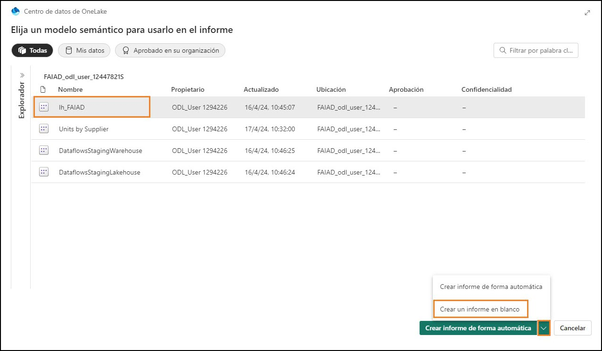
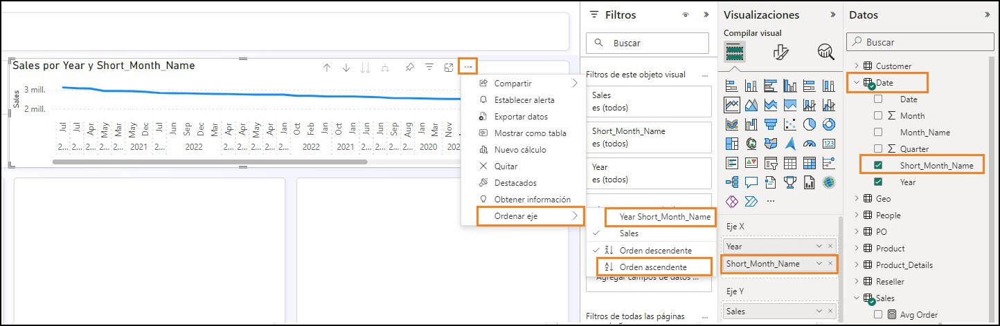

	  	 
 
## Sommaire
- Introduction
- Power BI
   - Tâche 1 : créer automatiquement un état
   - Tâche 2 : configurer l’arrière-plan d’un nouvel état
   - Tâche 3 : ajouter un en-tête à l’état
   - Tâche 4 : ajouter des KPI à l’état
   - Tâche 5 : ajouter un graphique en courbes à l’état
   - Tâche 6 : enregistrer l’état
   - Tâche 7 : configurer la colonne Year de la table Date
   - Tâche 8 : configurer la colonne Short_Month_Name de la table Date
   - Tâche 9 : mettre en forme le graphique en courbes
   - Tâche 10 : ajouter de nouvelles données pour simuler le mode Direct Lake
- Nettoyer l’environnement de labo
- Références

 
## Introduction
Nous avons ingéré des données de différentes sources de données dans Lakehouse, découvert
Lakehouse, défini une planification d’actualisation pour les sources de données et créé un modèle de données. Nous allons maintenant créer un état.

À la fin de ce labo, vous saurez :
- comment créer automatiquement un état ;
- comment créer un état à partir d’un canevas vide ;
- comment bénéficier du mode Direct Lake entraînant une actualisation automatique des données.


## Power BI
### Tâche 1 : créer automatiquement un état

Commençons par utiliser l’option de création automatique d’un état. Plus tard dans le labo, nous allons recréer l’état dont nous disposons dans Power BI.

1. Revenons à l’**espace de travail Fabric** que vous avez créé dans le labo précédent.
2. Cliquez sur l’icône du **sélecteur de l’expérience Fabric** dans la partie inférieure du volet gauche.
3. La boîte de dialogue Expérience Fabric s’ouvre alors. Cliquez sur **Power BI**. Vous êtes alors redirigé vers la **page d’Accueil Power BI**.

    

4. Cliquez sur **Nouveau rapport** dans le menu supérieur.

    

5. Vous êtes alors redirigé vers l’écran **Créer votre premier rapport**. Des options permettent de saisir des données manuellement et créer un état ou choisir un modèle sémantique publié. Nous avons créé un modèle sémantique dans les labos précédents. Utilisons-le. Sélectionnez l’option **Choisir un modèle sémantique publié**.

    

6. Choisissez un jeu de données à utiliser sur la page de votre état qui s’ouvre. Notez que nous disposons de quatre options. Sélectionnez **lh_FAIAD :**

    a. **lh_FAIAD :** il s’agit de la lakehouse comportant le jeu de données que nous avons créé et que nous souhaitons utiliser pour l’état.

    b. **Units by Supplier :** il s’agit du jeu de données que nous avons créé à l’aide de T-SQL.
    
    c. **DataflowsStagingWarehouse :** il s’agit de l’entrepôt de mise en lots créé par défaut. Nous ne l’avons pas utilisé car nous n’avons pas mis en lots les données.
    
    d. **DataflowsStagingLakehouse :** il s’agit du lakehouse de mise en lots créé par défaut. Nous ne l’avons pas utilisé car nous n’avons pas mis en lots les données.

7. Cliquez sur la **flèche en regard du bouton Créer automatiquement un état**. Notez que deux options sont disponibles : Créer automatiquement un état et Créer un rapport vide. Essayons la création automatique, donc sélectionnons **Créer automatiquement un état**.
 
    

8. Power BI commence alors à créer automatiquement l’état. Notez qu’une option permet de présélectionner des données, le cas échéant. Une fois l’état prêt, une boîte de dialogue s’affiche en haut de l’écran à droite. Cliquez sur **Afficher le rapport maintenant**.

    

    **Point de contrôle :** vous disposez d’un état qui ressemble à la capture d’écran ci-dessous. Quelques KPI et quelques visuels de tendance sont disponibles. Il s’agit d’un bon point de départ si vous
    analysez un nouveau modèle.

    **Remarque :** dans le menu supérieur, notez que vous pouvez modifier l’état ou afficher certaines données sous forme de tables. N’hésitez pas à explorer ces options.

9. Enregistrons cet état. Dans le menu supérieur, cliquez sur **Enregistrer**.

10. La boîte de dialogue Enregistrer votre état s’ouvre alors. Nommez l’état **rpt_Sales_Auto_Report**.

**Remarque :** nous ajoutons le préfixe rpt, à savoir l’abréviation du terme « report » (état) en anglais, au nom de l’état.

11. Assurez-vous que l’état est enregistré dans votre espace de travail **FAIAD_<username>**.
 
12. Cliquez sur **Enregistrer**.


**Remarque :** l’état créé automatiquement peut être différent pour vous, car il est « créé automatiquement ». Cela dépend également des relations et des mesures créées dans le labo précédent (Labo 6).

La capture d’écran ci-dessus illustre à quoi **peut** ressembler l’état créé automatiquement si vous avez créé toutes les relations et mesures, y compris les relations facultatives (Labo 6).

La capture d’écran ci-dessous illustre à quoi **peut** ressembler l’état créé automatiquement si vous n’avez pas créé les relations et mesures facultatives (Labo 6).


 
### Tâche 2 : configurer l’arrière-plan d’un nouvel état

Nous allons créer un nouvel état en utilisant un canevas vierge.
1. Dans le **panneau de gauche**, sélectionnez le nom de votre espace de travail, **FAIAD_<username>**
pour naviguer dans l’espace de travail.
2. Dans le menu supérieur, cliquez sur **Nouveau -> État**. Vous êtes alors redirigé vers la page Créer votre premier état.

    

3. Sélectionnez **Choisir un modèle sémantique publié** pour pouvoir choisir le modèle que nous avons créé.

    

4. Choisissez un modèle sémantique à utiliser dans la boîte de dialogue de l’état qui s’ouvre. Sélectionnez **lh_FAIAD**.
 
5. Cliquez sur la **flèche en regard du bouton Créer automatiquement un état**. Cliquez sur **Créer un état vide**.

    

6. Si vous ne l’avez pas encore ouvert, ouvrez le fichier **FAIAD.pbix** situé dans le dossier **C:\FAIAD\Reports** de votre environnement de labo.

Cet état va nous servir de référence. Nous allons commencer par ajouter l’arrière-plan du canevas. Nous allons créer l’en-tête de l’état, ajouter quelques KPI et créer le graphique en courbes Sales over time. Pour gagner du temps et étant entendu que vous avez de l’expérience dans la création de visuels dans Power BI Desktop, nous n’allons pas créer tous les visuels.


7. Revenez au **canevas Power BI** dans votre navigateur.
8. Cliquez sur l’**icône Mettre en forme la page** dans le volet Visualisation.
9. Développez la section **Arrière-plan du canevas**.
 
10. Cliquez sur **Parcourir** depuis l’option **Image**. La boîte de dialogue Explorateur de fichiers s’ouvre alors.
11. Accédez au dossier **C:\FAIAD\Reports** de votre environnement de labo.
12. Sélectionnez **Summary Background.png**.
13. Définissez la liste déroulante **Ajustement de l’image** sur **Ajuster**.
14. Réglez le curseur Transparence sur **0 %**.

    

### Tâche 3 : ajouter un en-tête à l’état
1. Ajoutons l’en-tête dans la marge supérieure. Dans le **menu**, cliquez sur **Zone de texte**.
2. Saisissez **Fabrikam Company** comme première ligne de la zone de texte.
3. Saisissez **Sales Report** comme deuxième ligne de la zone de texte.
4. Mettez en surbrillance **Fabrikam Company** et définissez les champs **Police** sur **Segoe UI** et **Taille de la police** sur **18, gras**.
5. Mettez en surbrillance **État Sales** et définissez les champs **Police** sur **Segoe UI** et **Taille de la police** sur **14**.
6. Une fois la **zone de texte** sélectionnée, développez **Effets** dans le volet Format à droite.
7. Réglez le curseur **Arrière-plan** sur **Désactivé**.
8. Redimensionnez la **zone de texte pour l’adapter à la marge supérieure**.

    

### Tâche 4 : ajouter des KPI à l’état
1. Ajoutons l’indicateur de performance clé Sales. Cliquez sur l’**espace blanc** dans le canevas pour détourner le focus de la zone de texte.
2. Dans la **section Visualisations**, sélectionnez le visuel **Carte multiligne**.
3. Dans la section **Données**, développez la **table Sales**.
4. Sélectionnez la mesure **Sales**.

    

5. Une fois le visuel **Carte multiligne** sélectionné, cliquez sur l’icône **Mettre en forme le visuel dans**
la section Visualisations.
6. Développez la section **Étiquettes de catégorie**.
7. Redéfinissez le champ **Taille de la police** sur **14**.
8. Cliquez sur la liste déroulante **Couleur**. La boîte de dialogue Palette de couleurs s’ouvre alors.
 
9. Définissez la valeur Hex sur **#004753**.

    

10. Développez la section **Cartes**.
 
11. Réglez le curseur **Barre d’accentuation** sur **Désactivé**.

    

12. Cliquez sur **Général** dans le volet Visualisations.
13. Développez la section **Effets**.
14. Réglez le curseur **Arrière-plan** sur **Désactivé**.
15. Redimensionnez le **visuel** et déplacez-le vers la **case gauche, comme illustré dans la capture d’écran**.

    

16. Ajoutons un autre KPI. Sélectionnez la **carte multiligne Sales** que vous venez de créer. **Copiez** le visuel à l’aide du raccourci clavier **Ctrl + C**.
17. **Collez** le visuel à l’aide du raccourci clavier **Ctrl + V**. Notez que le visuel est collé sur le canevas.
 
18. Une fois le **nouveau visuel** mis en surbrillance, supprimez la mesure **Sales** dans la section **Volet Visualisation -> Générer un élément visuel -> Champs**.
19. Dans la section **Données**, développez la table Sales et sélectionnez la mesure **Units**.
20. Redimensionnez le **visuel** et **placez-le dans la case située sous le visuel Sales**.

    

### Tâche 5 : ajouter un graphique en courbes à l’état
Créons un graphique en courbes pour visualiser Sales dans le temps par Reseller Company.
1. Cliquez sur l’**espace blanc** dans le canevas pour détourner le focus du visuel Carte multiligne.
2. Dans la **section Visualisations**, sélectionnez **Graphique en courbes**.
3. Dans la section **Données**, développez la table **Date**.
4. Cliquez sur le champ **Year**. Notez que le champ Year est une somme par défaut et ajouté à l’axe Y. Résolvons ce problème.

    

### Tâche 6 : enregistrer l’état
Nous allons enregistrer l’état avant de le quitter pour apporter des modifications au modèle.
1. Dans le menu supérieur, cliquez sur **Fichier -> Enregistrer**.
2. La boîte de dialogue Enregistrer votre état s’ouvre alors. Nommez l’état **rpt_Sales_Report**.

**Remarque :** nous ajoutons le préfixe rpt, à savoir l’abréviation du terme « report » (état) en anglais, au nom de l’état.

3. Assurez-vous que l’état est enregistré dans l’espace de travail **FAIAD_<username>**.
4. Cliquez sur **Enregistrer**.

    

### Tâche 7 : configurer la colonne Year de la table Date
1. Dans la **barre de menu de gauche**, sélectionnez **lh_FAIAD** pour accéder à la lakehouse.

2. Dans le volet gauche Explorateur, développez **lhFAIAD -> Schemas -> dbo -> Tables -> Date**.

3. Cliquez sur la colonne **Year**.

4. Dans le volet **Propriétés** à droite, développez la section **Options avancées**.
5. Dans la liste déroulante **Totaliser par**, sélectionnez **Aucun**.

    

6. Revenez à l’état en sélectionnant **rpt_Sales_Report** dans la barre de menu de gauche.

7. Dans le menu supérieur, cliquez sur **Modifier**.

8. Dans le menu supérieur, cliquez sur **Actualiser**. Vous remarquerez que dans le volet Données, Year n’est pas un champ de somme.

9. Une fois le visuel **Graphique en courbes** sélectionné, **supprimez Somme de Year** de l’axe Y.

10.	Sélectionnez le champ **Year** pour l’ajouter à l’**axe X**.

11. Développez la table **Sales** et sélectionnez la mesure **Sales**.

    

### Tâche 8 : configurer la colonne Short_Month_Name de la table Date
1. Ajoutons le mois à ce graphique. Dans la table Date, faites glisser le champ **Short_Month_Name**
sous **Year** sur l’**axe X**. Notez que le visuel est trié selon Sales. Trions-le selon Short_Month_Name.
2. Cliquez sur les **points de suspension (…)** dans le coin supérieur droit du visuel.
3. Sélectionnez **Trier axe -> Year Short_Month_Name**.
4. Cliquez sur les **points de suspension (…)** dans le coin supérieur droit du visuel.
5. Sélectionnez **Trier axe -> Tri croissant**.

    

    **Remarque :** les mois sont triés par ordre alphabétique. Résolvons ce problème.

    

6. Dans la **barre de menu de gauche**, sélectionnez **lh_FAIAD** pour accéder à la lakehouse.
7. La boîte de dialogue **Modifications non enregistrées** s’ouvre alors. Cliquez sur **Enregistrer** pour enregistrer les modifications de l’état.

    

8. Vous serez redirigé vers la lakehouse lh_FAIAD. Dans le volet gauche Explorateur, développez **lhFAIAD -> Schemas -> dbo -> Tables -> Date**.

9. Sélectionnez la colonne **Short_Month_Name**.

10. Dans le volet **Propriétés** à droite, développez la section **Options avancées**.

11. Dans la liste déroulante **Trier par colonne**, sélectionnez **Month**.
 
    
 
12. Revenez à l’état en sélectionnant **rpt_Sales_Report** dans la barre de menu de gauche.
13. Dans le menu supérieur, cliquez sur **Modifier**.
14. Dans le menu supérieur, cliquez sur **Actualiser**. Notez maintenant que les mois sont triés correctement.

    

### Tâche 9 : mettre en forme le graphique en courbes
Notez à quel point il est facile de mettre à jour le modèle sémantique lors de la création des états. Cela donne des interactions fluides comme Power BI Desktop.

1. Une fois le visuel **Graphique en courbes** sélectionné, développez la table **Reseller** dans la section **Données**.
2. Faites glisser le champ **Reseller -> Reseller Company** vers la section **Légende**.

    
 
3. Une fois le visuel **Graphique en courbes** sélectionné, cliquez sur l’icône **Mettre en forme le visuel -> Général** dans la section **Visualisations**.
4. Développer la section **Titre**.
5. Définissez le texte **Titre** sur **Sales over** **time**.
6. Développez la section **Effets**.
7. Réglez le curseur **Arrière-plan** sur **Désactivé**.

    

8. Dans la section **Visualisations**, cliquez sur l’icône **Mettre en forme le visuel -> Objet visuel**.
9. Développez la section **Lignes**.
10. Développez la section **Couleurs**.
11. Définissez la couleur **Wingtip Toys** sur **#004753**
12. Définissez la couleur **Tailspin Toys** sur **#F17925**.
13. Redimensionnez le **visuel** et déplacez-le vers la **case supérieure droite, comme illustré dans la capture d’écran**.
14. Faites défiler le visuel vers la droite et **notez que nous disposons de données jusqu’en avril 2023**.

    
 
15. Enregistrons l’état en sélectionnant F**ichier -> Enregistrer** dans le menu.

Comme indiqué précédemment, nous n’allons pas créer tous les visuels dans ce labo. À votre guise, n’hésitez pas à créer d’autres visuels.

### Tâche 10 : ajouter de nouvelles données pour simuler le mode Direct Lake
En général, en mode Import, une fois les données de la source actualisées, nous devons actualiser le modèle Power BI après quoi les données de l’état sont mises à jour. Avec le mode Direct Query, une fois les données actualisées dans la source, elles sont disponibles dans l’état Power BI. Cependant, le mode Direct Query est généralement lent. Pour résoudre ce problème, Microsoft Fabric a introduit le mode Direct Lake. Direct Lake est un moyen rapide de charger les données du lac directement dans le moteur Power BI, prêtes à l’analyse. Explorons cela.

Dans un scénario réel, les données sont mises à jour à la source. Puisque nous sommes dans un environnement de formation, nous allons simuler cela en le connectant à un fichier Parquet avec les données de mai 2023.

1. Cliquez sur **FAIAD_<username>** à partir de la barre de menu de gauche pour accéder à la page d’accueil de l’espace de travail.
2. Sélectionnez **df_Sales_ADFS**, afin que nous puissions modifier le flux de données en ajoutant le nouveau fichier Parquet.

    
 
3. Dans le ruban, cliquez sur **Accueil -> Obtenir les données -> Requête vide**.

4. La boîte de dialogue Connexion à une source des données s’ouvre alors. Sélectionnez **toutes les lignes dans l’éditeur et supprimez-les**.

5. Copiez le code ci-dessous et collez-le dans l’éditeur.

    ```
    let
    Source = #"ADLS Base Folder",
    #"Filtered Rows" = Table.SelectRows(Source, each Text.Contains([Folder Path], "Sales.Invoices_May")),
    #"https://stvnextblobstorage dfs core windows net/fabrikam-sales/Delta-Parquet-Format/Sales Invoices_May/_0- 0ee085a3-716f-4833-a792-c3162c1de300-0 parquet" = #"Filtered Rows"{[#"Folder
    Path"="https://stvnextblobstorage.dfs.core.windows.net/fabrikam-sales/Delta-Parquet- Format/Sales.Invoices_May/",Name="0-0ee085a3-716f-4833-a792-c3162c1de300-0.parquet"]}[Content],
    #"Imported Parquet" = Parquet.Document(#"https://stvnextblobstorage dfs core windows net/fabrikam-sales/Delta- Parquet-Format/Sales Invoices_May/_0-0ee085a3-716f-4833-a792-c3162c1de300-0 parquet")
    in
    #"Imported Parquet"
    ```

6. Cliquez sur **Suivant**.

    
 
7. Une nouvelle requête est à nouveau créée. Nous allons la **renommer**. Renommez la requête **MayInvoice** dans le panneau de droite, sous **Paramètres de requête -> Propriétés -> Nom**.

8. Nous allons désactiver la mise en lots pour la nouvelle requête. **Cliquez avec le bouton droit de la souris** sur la requête MayInvoice et **décochez la case Activer la mise en lots**.

    

9. À présent, ajoutons les données May **Invoice** à la table Invoice. Sélectionnez la requête Invoice
dans la section Requêtes.

10. Dans le ruban, cliquez sur **Accueil -> Ajouter** des requêtes.
11. La boîte de dialogue Ajouter une requête s’affiche alors. Dans la liste déroulante T**able à ajouter**, sélectionnez **MayInvoice**.
 
12. Cliquez sur **OK**.

    

13. Cliquez sur **Publier** Dans le coin inférieur droit pour enregistrer et publier les mises à jour.

    

    **Remarque :** une fois publié, le flux de données est actualisé. Cette opération peut prendre quelques minutes.

14. Cliquez sur **rpt_Sales_Report** dans la barre de menu de gauche pour revenir à l’état.

15. Dans le menu supérieur, cliquez sur **Actualiser**. Notez maintenant que le graphique en courbes comporte des données pour mai 2023. Notez également que le montant Sales et Units a
augmenté.


 
Les Dataflows que nous avons créés dans les labos précédents sont actualisés dans les délais, les données sont ingérées dans la lakehouse. Le modèle de données de la lakehouse est mis à jour et les états sont actualisés. Nous n’avons pas besoin d’actualiser le modèle de données et de signaler
l’actualisation de chacun des flux de données. Voilà l’avantage de Direct Lake.

Revenons sur les défis répertoriés dans l’énoncé du problème :

- **Vous devez actualiser votre jeu de données au moins trois fois par jour pour tenir compte des différentes heures de mise à jour des différentes sources de données.**

Nous avons résolu ce problème à l’aide de Direct Lake. Chaque flux de données individuel est actualisé selon son calendrier. Le jeu de données et l’état n’ont pas besoin d’être actualisés.

- **Vos actualisations prennent beaucoup de temps, car vous devez effectuer chaque fois une actualisation complète pour capturer toutes les mises à jour survenues sur les systèmes sources.**

Encore une fois, nous avons résolu ce problème à l’aide de Direct Lake. Chaque flux de données individuel est actualisé selon son calendrier. Le jeu de données et l’état n’ont pas besoin d’être actualisés, donc nous n’avons pas à nous soucier d’une actualisation complète.

- **Toute erreur dans l’une des sources de données à partir desquelles vous extrayez des données entraîne une interruption de l’actualisation de votre jeu de données. Il arrive souvent que le fichier collaborateur ne soit pas chargé à temps, ce qui aboutit à une
interruption de l’actualisation de votre jeu de données.**

Le pipeline de données permet de résoudre ce problème, en permettant de réessayer d’effectuer une actualisation en cas d’échec et à différents intervalles.

- **Apporter des modifications à votre modèle de données prend beaucoup de temps, car Power Query en prend beaucoup pour actualiser vos aperçus, compte tenu du gros volume de données et des transformations complexes.**

Nous avons remarqué que les flux de données sont efficaces et faciles à modifier. En général, le chargement de l’aperçu dans les flux de données ne prend pas beaucoup de temps.

- **Vous avez besoin d’un PC Windows pour utiliser Power BI Desktop, même si le standard de l’entreprise est Mac.**

Microsoft Fabric est une offre SaaS. Il nous suffit d’un navigateur pour accéder au service. Nous n’avons pas besoin d’installer de logiciel sur nos bureaux.
 
## Nettoyer l’environnement de labo
Une fois que vous êtes prêt à nettoyer l’environnement de labo, procédez comme suit :

1. Sélectionnez l’espace de travail **FAIAD_<username>** à partir du panneau de gauche pour naviguer vers la page d’accueil de l’espace de travail.
2. Dans le menu supérieur, cliquez sur les **points de suspension (…)** en regard de Gérer l’accès et sélectionnez **Paramètres d’espace de travail**.

    

3. La boîte de dialogue Paramètres d’espace de travail s’ouvre alors. Cliquez sur **Autre** dans le menu gauche.
4. Cliquez sur **Supprimer cet espace de travail**.
5. La boîte de dialogue Supprimer l’espace de travail s’ouvre alors. Cliquez sur **Supprimer**.
 
L’espace de travail et tous les éléments qu’il comporte sont alors supprimés.


 
### Références
Fabric Analyst in a Day (FAIAD) vous présente certaines des fonctions clés de Microsoft Fabric. Dans le menu du service, la section Aide (?) comporte des liens vers d’excellentes ressources.


Voici quelques autres ressources qui vous aideront lors de vos prochaines étapes avec Microsoft Fabric :
- Consultez le billet de blog pour lire l’intégralité de l’[annonce de la GA de Microsoft Fabric](https://aka.ms/Fabric-Hero-Blog-Ignite23).
- Explorez Fabric grâce à la [visite guidée](https://aka.ms/Fabric-GuidedTour).
- Inscrivez-vous pour bénéficier d’un [essai gratuit de Microsoft Fabric](https://aka.ms/try-fabric).
- Rendez-vous sur le [site web Microsoft Fabric](https://aka.ms/microsoft-fabric).
- Acquérez de nouvelles compétences en explorant les [modules d’apprentissage Fabric](https://aka.ms/learn-fabric).
- Explorez la [documentation technique Fabric](https://aka.ms/fabric-docs).
- Lisez le [livre électronique gratuit sur la prise en main de Fabric](https://aka.ms/fabric-get-started-ebook).
- Rejoignez la [communauté Fabric](https://aka.ms/fabric-community) pour publier vos questions, partager vos commentaires et apprendre des autres.

Lisez les blogs d’annonces plus détaillés sur l’expérience Fabric :

- [Blog Expérience Data Factory dans Fabric](https://aka.ms/Fabric-Data-Factory-Blog)
- [Blog Expérience Synapse Data Engineering dans Fabric](https://aka.ms/Fabric-DE-Blog)
- [Blog Expérience Synapse Data Science dans Fabric](https://aka.ms/Fabric-DS-Blog)
- [Blog Expérience Synapse Data Warehousing dans Fabric](https://aka.ms/Fabric-DW-Blog)
- [Blog Expérience Synapse Real-Time Analytics dans Fabric](https://aka.ms/Fabric-RTA-Blog)
- [Blog Annonce Power BI](https://aka.ms/Fabric-PBI-Blog)
- [Blog Expérience Data Activator dans Fabric](https://aka.ms/Fabric-DA-Blog)
- [Blog Administration et gouvernance dans Fabric](https://aka.ms/Fabric-Admin-Gov-Blog)
- [Blog OneLake dans Fabric](https://aka.ms/Fabric-OneLake-Blog)
- [Blog Intégration de Dataverse et Microsoft Fabric](https://aka.ms/Dataverse-Fabric-Blog)


© 2023 Microsoft Corporation. Tous droits réservés.
En effectuant cette démonstration/ce labo, vous acceptez les conditions suivantes :

La technologie/fonctionnalité décrite dans cette démonstration/ces travaux pratiques est fournie par Microsoft Corporation en vue d’obtenir vos commentaires et de vous fournir une expérience d’apprentissage. Vous pouvez utiliser cette démonstration/ces ateliers uniquement pour évaluer ces technologies et fonctionnalités, et pour fournir des commentaires à Microsoft. Vous ne pouvez pas l’utiliser à d’autres fins. Vous ne pouvez pas modifier, copier, distribuer, transmettre, afficher, effectuer, reproduire, publier, accorder une licence, créer des œuvres dérivées, transférer ou vendre tout ou une partie de cette démonstration/ces ateliers.

LA COPIE OU LA REPRODUCTION DE CETTE DÉMONSTRATION/CES TRAVAUX PRATIQUES (OU DE TOUTE PARTIE DE CEUX-CI) SUR TOUT AUTRE SERVEUR OU AUTRE EMPLACEMENT EN VUE D’UNE AUTRE REPRODUCTION OU REDISTRIBUTION EST EXPRESSÉMENT INTERDITE.
CETTE DÉMONSTRATION/CES TRAVAUX PRATIQUES FOURNISSENT CERTAINES FONCTIONNALITÉS DE PRODUIT/TECHNOLOGIES LOGICIELLES, NOTAMMENT D’ÉVENTUELS NOUVEAUX CONCEPTS ET FONCTIONNALITÉS, DANS UN ENVIRONNEMENT SIMULÉ SANS INSTALLATION OU CONFIGURATION
COMPLEXE AUX FINS DÉCRITES CI-DESSUS. LES TECHNOLOGIES/CONCEPTS REPRÉSENTÉS DANS CETTE DÉMONSTRATION/CES TRAVAUX PRATIQUES PEUVENT NE PAS REPRÉSENTER LES FONCTIONNALITÉS COMPLÈTES ET PEUVENT NE PAS FONCTIONNER DE LA MÊME MANIÈRE QUE DANS UNE VERSION FINALE. IL EST ÉGALEMENT POSSIBLE QUE NOUS NE PUBLIIONS PAS DE VERSION FINALE DE CES FONCTIONNALITÉS OU CONCEPTS. VOTRE EXPÉRIENCE D’UTILISATION DE CES FONCTIONNALITÉS DANS UN ENVIRONNEMENT PHYSIQUE PEUT ÉGALEMENT ÊTRE DIFFÉRENTE.

**COMMENTAIRES.** Si vous envoyez des commentaires sur les fonctionnalités, technologies et/ou concepts décrits dans ces ateliers/cette démonstration à Microsoft, vous accordez à Microsoft, sans frais, le droit d’utiliser, de partager et de commercialiser vos commentaires de quelque
manière et à quelque fin que ce soit. Vous accordez également à des tiers, sans frais, les droits de brevet nécessaires pour leurs produits, technologies et services en vue de l’utilisation ou
de l’interface avec des parties spécifiques d’un logiciel ou d’un service Microsoft incluant les commentaires. Vous n’enverrez pas de commentaires soumis à une licence exigeant que
Microsoft accorde une licence pour son logiciel ou sa documentation à des tiers du fait que nous y incluons vos commentaires. Ces droits survivent à ce contrat.

MICROSOFT CORPORATION DÉCLINE TOUTES LES GARANTIES ET CONDITIONS EN CE
QUI CONCERNE CETTE DÉMONSTRATION/CES TRAVAUX PRATIQUES, Y COMPRIS TOUTES LES GARANTIES ET CONDITIONS DE QUALITÉ MARCHANDE, QU’ELLES SOIENT EXPLICITES,
IMPLICITES OU LÉGALES, D’ADÉQUATION À UN USAGE PARTICULIER, DE TITRE ET D’ABSENCE
DE CONTREFAÇON. MICROSOFT N’OFFRE AUCUNE GARANTIE OU REPRÉSENTATION EN CE QUI CONCERNE LA PRÉCISION DES RÉSULTATS, LA CONSÉQUENCE QUI DÉCOULE DE L’UTILISATION
DE CETTE DÉMONSTRATION/CES ATELIERS, OU L’ADÉQUATION DES INFORMATIONS CONTENUES DANS CETTE DÉMONSTRATION/CES ATELIERS À QUELQUE FIN QUE CE SOIT.
 
**CLAUSE D’EXCLUSION DE RESPONSABILITÉ**
Cette démonstration/Ce labo comporte seulement une partie des nouvelles fonctionnalités et améliorations disponibles dans Microsoft Power BI. Certaines fonctionnalités sont susceptibles
de changer dans les versions ultérieures du produit. Dans ce labo/cette démonstration, vous allez découvrir comment utiliser certaines nouvelles fonctionnalités, mais pas toutes.

