 
 
## 目次
概要	3 
Power BI	3 
タスク 1: レポートを自動作成する	3 
タスク 2: 新しいレポートの背景を構成する	8 
タスク 3: レポートにヘッダーを追加する	11 
タスク 4: レポートにKPI を追加する	12 
タスク 5: レポートに折れ線グラフを追加する	15 
タスク 6: レポートを保存する	15 
タスク 7: Date テーブルのYear 列を構成する	16 
タスク 8: Date テーブルのShort_Month_Name 列を構成する	17 
タスク 9: 折れ線グラフを書式設定する	19 
タスク 10: 新しいデータを追加して Direct Lake モードをシミュレートする	21 
ラボ環境をクリーンアップする	26 
リファレンス	28 

 
## 概要

さまざまなデータ ソースからレイクハウスにデータを取り込み、レイクハウスについて学び、データ ソースの更新スケジュールを設定し、データ モデルを作成しました。次は、レポートを作成します。
このラボを終了すると、次のことが学べます。

- レポートを自動的に作成する方法
- 空のキャンバスからレポートを構築する方法
- データが自動的に更新される Direct Lake モードを体験する方法

# Power BI
## タスク 1: レポートを自動作成する
まず、レポートの自動作成オプションを使用してみましょう。ラボの後半では、Power BI にあるレポートを作成し直します。
1.	前のラボで作成した **Fabric** **ワークスペース**に移動します。

2.	左側のパネルの下部にある **Fabric** **エクスペリエンスセレクター** アイコンを選択します。

3.	Fabric エクスペリエンスのダイアログが開きます。**Power BI** を選択します。**Power BI**
ホーム ページが表示されます。

       
 
4.	上部のメニューから**新しいレポート**を選択します。

      
 
5.	**最初のレポートの作成画面**が表示されます。データを手動で入力してレポートを作成す
ることも、公開されているセマンティック モデルを選択することもできます。前のラボではセマンティック モデルを作成しました。それを使ってみましょう。**公開されたセマ**
**ンティック モデルを選択**オプションを選択します。

      

6.	[レポートで使用するデータセットを選択] ページが開きます。4 つのオプションがあります。**lh_FAIAD を選択します。**  
a.	**lh_FAIAD:** これは、作成したデータセットを含む lakehouse です。これをレポート
に使用します。 
b.	**Units by Supplier:** これはT-SQL を使用して作成したデータセットです。 
c.	**DataflowsStagingWarehouse:** これは既定で作成されるステージング ウェアハウスです。データをステージングしなかったので、これは使用しませんでした。 
d.	**DataflowsStagingLakehouse:** これは既定で作成されるステージング レイクハウスです。データをステージングしなかったので、これは使用しませんでした。 

7.	**レポートの自動作成ボタンの横の矢印**をクリックします。[レポートの自動作成] と[空の
レポートの作成] という 2 つのオプションがあることに注意してください。自動作成を試してみましょう。**レポートを自動作成する**を選択します。

      
 

8.	Power BI によって、レポートの自動作成が開始されます。[データの事前選択] オプションを選択することもできます。レポートの準備が完了すると、画面の右上にダイアログが表示されます。**View report now** を選択します。

     

**チェックポイント:** 以下のスクリーンショットのようなレポートが表示されます。少数の KPIといくつかの傾向のビジュアルがあります。新しいモデルを分析しようとしており、すぐに開始する必要がある場合、これは良いスタート地点となります。

**注:** 上部のメニューには、レポートを編集したり、データをテーブルとして表示したりするオプションがあります。自由にこれらのオプションを試してみてください。
 
9.	このレポートを保存しましょう。上部のメニューで **Save** を選択します。

10.	[レポートの保存] ダイアログが開きます。レポートに **rpt_Sales_Auto_Report** という名前を付けます。
**注:** レポート名の前にreport の省略形である rpt を付けています。

11.	レポートがワークスペース **FAIAD_<ユーザー名>** に保存されることを確認します。

12.	**保存**を選択します。

     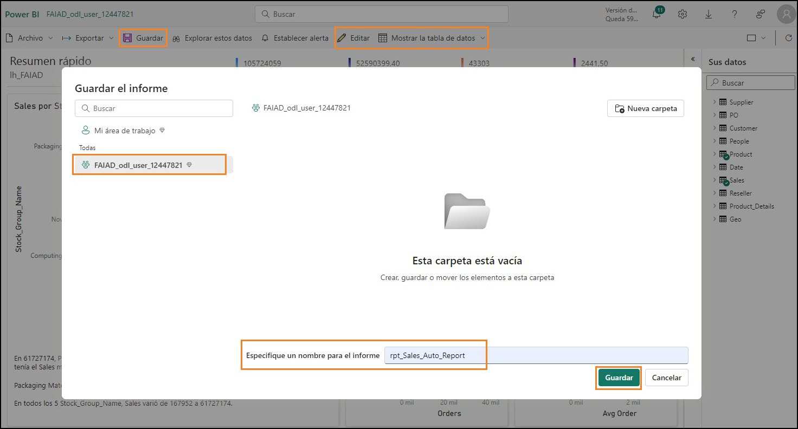 

**注:** 自動作成レポートは、"自動作成" されるのでユーザーによって外観が異なる場合があります。また、前のラボ(ラボ 6) で作成したリレーションシップとメジャーにも依存します。
上のスクリーンショットは、オプションのリレーションシップ (ラボ 6) を含むすべてのリ レーションシップとメジャーを作成した場合に、自動作成レポートがどのように表示される
**可能性があるか**を示したものです。

下のスクリーンショットは、オプションのリレーションシップとメジャー (ラボ 6) の作成をスキップした場合に、自動作成レポートがどのように表示される**可能性があるか**を示したものです。

    
 
## タスク 2: 新しいレポートの背景を構成する

空のキャンバスを使用して新しいレポートを作成してみましょう。
1.	**左側のパネル**で、ワークスペース名 **FAIAD_<ユーザー名>** を選択して、ワークスペースに移動します。

2.	上部のメニューから**新規 -> レポート**を選択します。[最初のレポートを作成する] ページが表示されます。

      
 
3.	作成したモデルを選択できるように、**公開されたセマンティック モデルを選択**を選択し
ます。

     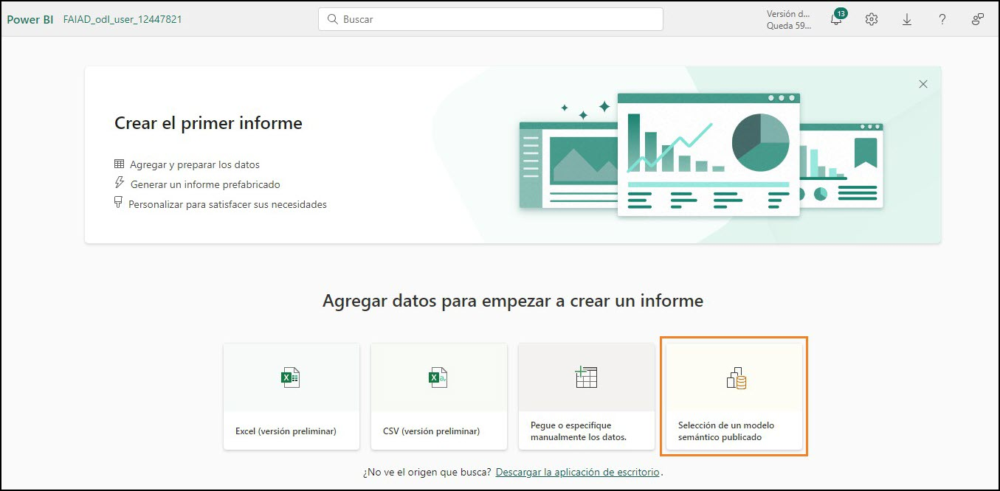 

4.	[レポートで使用するセマンティック モデルを選択する] ダイアログが開きます。
**lh_FAIAD** を選択します。

5.	**レポートの自動作成ボタンの横の矢印**をクリックします。**空のレポートを作成する**を選択します。

      

6.	まだ開いていない場合は、自分のラボ環境の **C:\FAIAD\Reports** フォルダーにある
**FAIAD.pbix** を開きます。
 
このレポートを参考として使用します。まず最初にキャンバスの背景を追加します。レポートヘッダーを作成し、いくつかの KPI を追加して、売上推移の折れ線グラフを作成します。時間の都合上、また出席者には Power BI Desktop でのビジュアル作成の経験があることをふまえ、すべてのビジュアルの作成は行いません。

    

7.	ブラウザーで **Power BI** キャンバスに戻ります。

8.	[視覚化] ペインでページの**書式設定アイコン**を選択します。

9.	**キャンバスの背景セクション**を展開します。

10.	**画像**オプションの**参照**を選択します。エクスプローラー ダイアログが開きます。

11.	ラボ環境の **C:\FAIAD\Reports** フォルダーに移動します。

12.	**Summary Background.png** を選択します。

13.	**イメージのサイズ調整**ドロップダウンを**自動調整**に設定します。

14.	[透過性] を **0%** に設定します。

     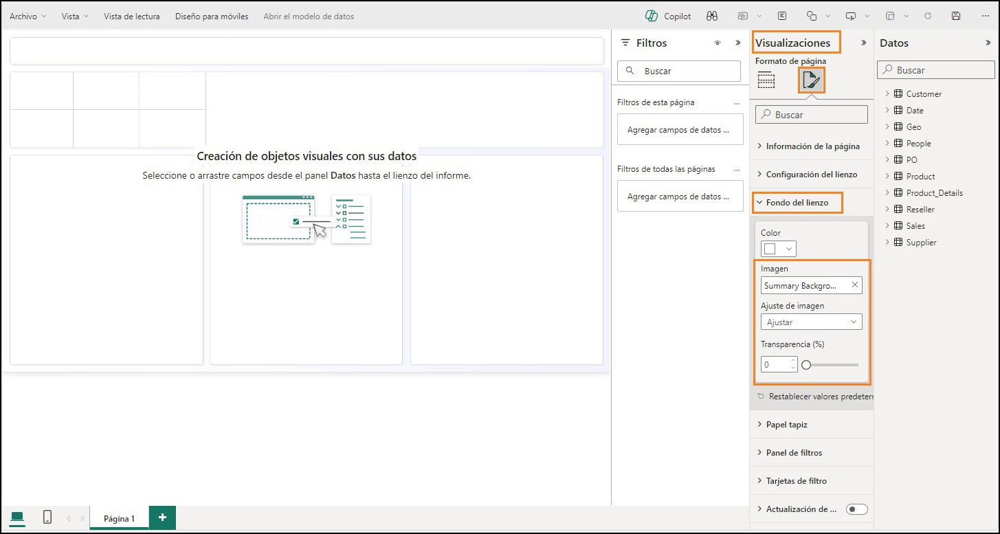 
 
## タスク 3: レポートにヘッダーを追加する
1.	上部の余白にヘッダーを追加しましょう。**メニュー**で、**テキスト ボックス**を選択します。

2.	テキスト ボックスの最初の行として **Fabrikam Company** と入力します。

3.	テキスト ボックスの 2 行目として **Sales Report** と入力します。

4.	**Fabrikam Company** を強調表示し、**フォントを Segoe UI、フォント サイズを 18、太字**に設定します。

5.	**Sales Report** を強調表示し、**フォントを Segoe UI、フォントサイズを 14、太字**に設定します。

6.	**テキスト ボックスを選択した**状態で、右側の [書式設定テキスト ボックス] ペインで
**[効果] を展開**します。

7.	**背景**スライダーを使用して、**オフ**に設定します。

8.	**上部の余白に収まるようにテキスト ボックス**のサイズを変更します。

      
 
## タスク 4: レポートに KPI を追加する
1.	Sales KPI を追加しましょう。キャンバス内で**空白**を選択し、テキスト ボックスからフォーカスを外します。

2.	**視覚化セクション**で、**複数行カード ビジュアル**を選択します。

3.	**データ セクション**で、**Sales テーブル**を展開します。

4.	**Sales メジャー**を選択します。

     

5. **複数行カード ビジュアルを選択**した状態で、[視覚化] セクションの**ビジュアルの書式設定アイコン**を選択します。

6.	**カテゴリ ラベル** セクションを展開します。

7.	**フォント サイズ**を **14** に上げます。

8.	**色ドロップダウン**を選択します。[カラー パレット] ダイアログが開きます。

9.	[16 進] の値を **#004753** に設定します。

        
 
10.	**カード** セクションを展開します。

11.	**アクセント バー** スライダーを使用して、**オフ**に設定します。

     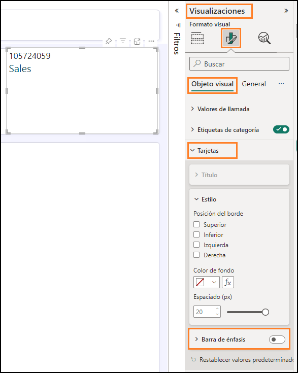  
 
12.	[視覚化] ペインで**全般**を選択します。

13.	**効果セクション**を展開します。

14.	**背景**スライダーを使用して、**オフ**に設定します。

15.	**ビジュアル**のサイズを変更して、**スクリーンショットに表示されている左のボックス**に移動します。

     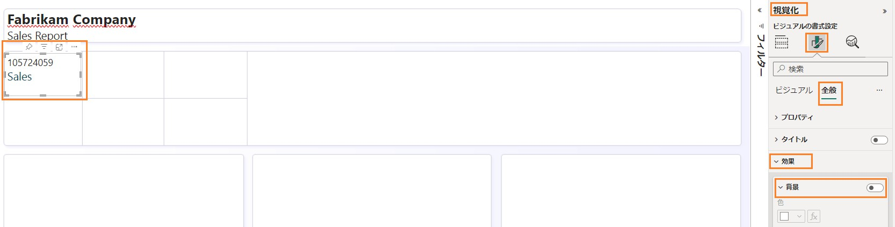 

16.	別のKPI を追加してみましょう。先ほど作成した **Sales 複数行カード**を選択します。キーボードの **Ctrl+C** を使用して、ビジュアルをコピーします。

17.	キーボードの **Ctrl+V** を使用して、ビジュアルを**貼り付け**ます。ビジュアルがキャンバスに貼り付けられました。

18.	**新しいビジュアルを強調表示**した状態で、**視覚化ペイン -> ビジュアルのビルド->
フィールド** セクションから **Sales** メジャーを削除します。

19.	**Data** セクションで、**Sales** テーブルを展開し、**Units** メジャーを選択します。

20.	**ビジュアル**のサイズを変更し、**Sales ビジュアルの下のボックスに配置**します。

      
 
## タスク 5: レポートに折れ線グラフを追加する
折れ線グラフを作成して、リセラー会社ごとの売上の推移を視覚化しましょう。
1.	キャンバス内で空白を選択し、複数行カード ビジュアルからフォーカスを外します。

2.	視覚化セクションで、折れ線グラフを選択します。

3.	データ セクションで Date テーブルを展開します。

4.	Year フィールドを選択します。Year は既定で合計され、Y 軸に追加されることに注意してください。これを修正しましょう。

     

## タスク 6: レポートを保存する
レポートから移動してモデルを変更する前にレポートを保存しましょう。
1.	メニューからファイル -> 保存を選択します。

2.	[レポートの保存] ダイアログが開きます。レポートに rpt_Sales_Report という名前を付けます。
注: レポート名の前にreport の省略形である rpt を付けています。

3.	レポートが FAIAD_<ユーザー名> ワークスペースに保存されることを確認します。

4.	保存を選択します。

     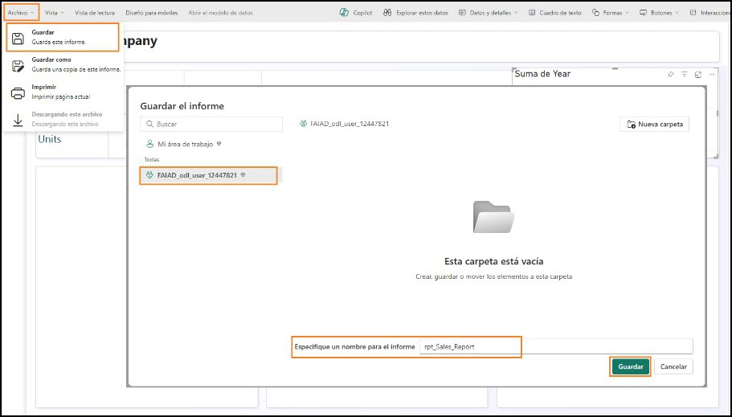 
 

## タスク 7: Date テーブルのYear 列を構成する
1.	左メニュー バーで lh_FAIAD を選択してレイクハウスに移動します。

2.	左側の [エクスプローラー] ペインで、lhFAIAD -> スキーマ -> dbo -> テーブル-> Date を展開します。

3.	Year 列を選択します。

4.	右側のプロパティ ペインで、詳細セクションを展開します。

5.	集計の方法ドロップダウン リストで、なしを選択します。

      

6.	左メニュー バーから rpt_Sales_Report を選択して、レポートに戻ります。

7.	上部のメニューから編集を選択します。
 
8.	上部のメニューで、更新を選択します。データ パネルで、Year が集計フィールドでなく
なったことに注意してください。

9.	折れ線グラフビジュアルを選択した状態で、Y 軸から Sum of Year を削除します。

10.	Year フィールドを選択すると、X 軸に追加されます。

11.	Sales テーブルを展開し、Sales メジャーを選択します。

     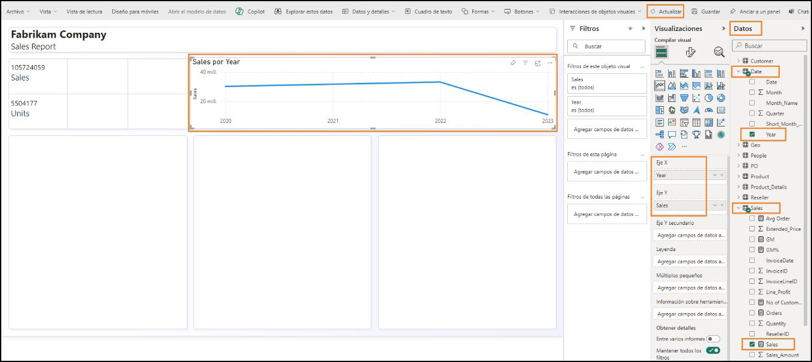 

## タスク 8: Date テーブルのShort_Month_Name 列を構成する
1.	このグラフに月を追加してみましょう。Date テーブルの Short_Month_Name フィールドを X 軸の Year の下にドラッグします。ビジュアルが Sales の順に並べ替えられていることに注目してください。Short_Month_Name の順に並べ替えてみましょう。

2.	ビジュアルの右上隅にある省略記号 (…) を選択します。

3.	軸の並べ替え-> Year Short_Month_Name を選択します。

4.	ビジュアルの右上隅にある省略記号 (…) を選択します。

5.	軸の並べ替え-> 昇順で並べ替えを選択します。

     
 
   注: 月がアルファベット順に並べられています。これを修正しましょう。

   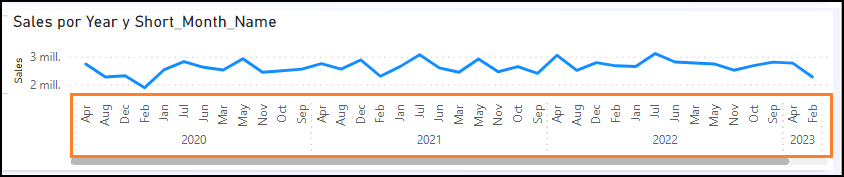  

6.	左メニュー バーで lh_FAIAD を選択してレイクハウスに移動します。

7.	未保存の変更ダイアログが開きます。保存を選択して、レポートへの変更を保存します。

     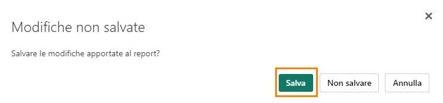 

8.	lh_FAIAD レイクハウスが表示されます。左側の [エクスプローラー] ペインで、lhFAIAD ->
スキーマ -> dbo -> テーブル-> Date を展開します。

9.	Short_Month_Name 列を選択します。

10.	右側のプロパティ ペインで、詳細セクションを展開します。

11.	列で並べ替えドロップダウンで Month を選択します。

      

12.	左メニュー バーから rpt_Sales_Report を選択して、レポートに戻ります。

13.	上部のメニューから編集を選択します。
 
14.	上部のメニューで、更新を選択します。月が正しく並べ替えられました。

       

## タスク 9: 折れ線グラフを書式設定する
レポートの作成中にセマンティック モデルを更新することがいかに簡単であるかに注目してください。これによりPower BI Desktop のようなシームレスな対話型操作が実現します。
1.	折れ線グラフビジュアルを選択した状態で、データ セクションの Reseller テーブルを展開します。

2.	Reseller -> Reseller Company フィールドを凡例セクションにドラッグします。

     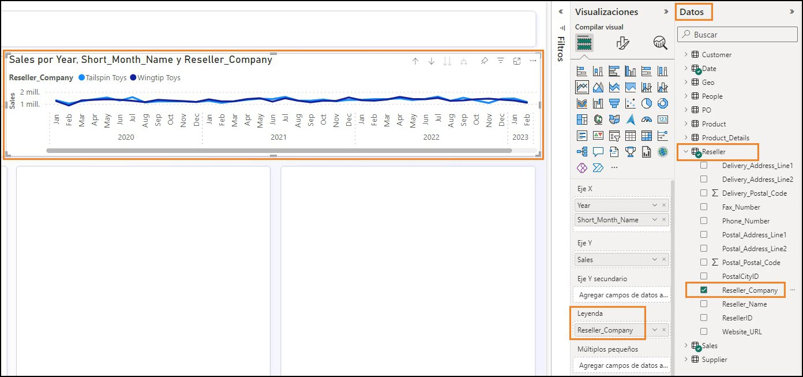 

3.	折れ線グラフビジュアルを選択した状態で、視覚化セクションで ビジュアルの書式設定アイコン-> 全般を選択します。

4.	タイトル セクションを展開します。

5.	タイトルのテキストとして Sales over time を設定します。
 
6.	効果セクションを展開します。

7.	背景スライダーを使用して、オフに設定します。

       

8.	視覚化セクションでビジュアルの書式設定アイコン -> ビジュアルを選択します。

9.	線セクションを展開します。

10.	カラー セクションを展開します。

11.	Wingtip Toys の色を #004753 に設定します。

12.	Tailspin Toys の色を #F17925 に設定します。

13.	ビジュアルのサイズを変更して、スクリーンショットに表示されている右上のボックス
に移動します。

14.	ビジュアルの右までスクロールして、2023 年 4 月までのデータがあることを確認します。

        
 
15.	レポートを保存しましょう。メニューでファイル -> 保存を選択します。

前にも説明していますが、このラボではすべてのビジュアルを作成するわけではありません。時間があるときに、その他のビジュアルをご自由に作成してください。

## タスク 10: 新しいデータを追加してDirect Lake モードをシミュレートする
通常、Import モードでは、ソース内のデータが更新されたら、Power BI モデルを更新する必要があります。その後でレポート内のデータが更新されます。Direct Query モードでは、 ソースでデータが更新されると、Power BI レポートで使用できるようになります。ただし、通常、direct query モードは低速です。この問題を解決するために、Microsoft Fabric はDirect Lake モードを導入しました。Direct Lake は、データをレイクから Power BI エンジンに直接読み込んで分析できるようにするための高速パスです。これについて詳しく説明します。
実際のシナリオでは、データはソースで更新されます。ここはトレーニング環境であるため、2023 年 5 月のデータを含むparquet ファイルに接続してこれをシミュレートします。
 
1.	左のメニュー バーで FAIAD_<ユーザー名> を選択して、ワークスペースのホームに移動
します。

2.	df_Sales_ADFS を選択すると、データフローを編集して新しい Parquet ファイルを追加できるようになります。

     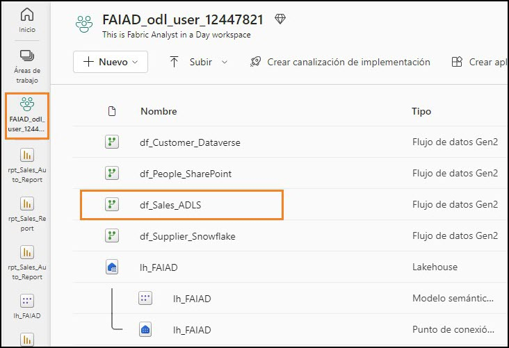 

3.	リボンでホーム -> データの取得 -> 空のクエリを選択します。

4.	[データ ソースへの接続] ダイアログが開きます。エディターですべての行を選択して削除します。

5.	下のコードをコピーして、エディターに貼り付けます。

let
  Source = #"ADLS Base Folder",
  #"Filtered Rows" = Table.SelectRows(Source, each Text.Contains([Folder Path], "Sales.Invoices_May")),
 #"https://stvnextblobstorage dfs core windows net/fabrikam-sales/Delta-Parquet-Format/Sales Invoices_May/_0- 0ee085a3-716f-4833-a792-c3162c1de300-0 parquet" = #"Filtered Rows"{[#"Folder
Path"="https://stvnextblobstorage.dfs.core.windows.net/fabrikam-sales/Delta-Parquet- Format/Sales.Invoices_May/",Name="0-0ee085a3-716f-4833-a792-c3162c1de300-0.parquet"]}[Content],
 #"Imported Parquet" = Parquet.Document(#"https://stvnextblobstorage dfs core windows net/fabrikam-sales/Delta- Parquet-Format/Sales Invoices_May/_0-0ee085a3-716f-4833-a792-c3162c1de300-0 parquet")
in
  #"Imported Parquet"
 
6.	次へを選択します。

      

7.	新しいクエリが再び作成されます。その名前を変更しましょう。右パネルのクエリの設定->プロパティ-> 名前で、クエリの名前を MayInvoice に変更します。

8.	新しいクエリのステージングを無効にします。MayInvoice クエリを右クリックし、ステージングを有効にするをオフにします。

      

9.	次に、5 月の請求書データを Invoice テーブルに追加しましょう。[クエリ] セクションで
Invoice クエリを選択します。

10.	リボンで ホーム-> クエリをアペンドするを選択します。

11.	クエリをアペンドするダイアログが表示されます。アペンドするテーブル ドロップダウンから MayInvoice を選択します。

12.	OK を選択します。

      
 
13.	右下隅の公開を選択して、変更内容を保存して公開します。

        
 
注: 公開されると、データフローが最新の情報に更新されます。これには数分かかる場合があります。

14.	左メニュー バーから rpt_Sales_Report を選択して、レポートに戻ります。

15.	上部のメニューで、更新を選択します。折れ線グラフに 2023 年 5 月のデータがあります。また、Sales の金額と Units も増加しています。

      
 
前のラボで作成したデータフローがスケジュールに従って更新され、データがレイクハウスに取り込まれます。Lakehouse 内のデータ モデルが更新され、レポートが最新の情報に更新されます。各データフローが更新されるときに、データ モデルとレポートを更新する必要はありません。これがDirect Lake の利点です。
問題の内容にリストされている課題をもう一度見てみましょう。
- 各種データ ソースごとに異なる更新時間に対応するには、1 日に少なくとも 3 回はデータセットを更新する必要があります。
Direct Lake を使用してこれを解決しました。個々のデータフローはスケジュールに従って更新されます。データセットとレポートを更新する必要はありません。
- ソース システムで発生したすべての更新を取得するために毎回完全な更新を行う必
要があるため、更新に長い時間がかかります。
これについてもDirect Lake を使用して解決しました。個々のデータフローはスケ ジュールに従って更新されます。データセットとレポートを更新する必要はないため、完全な更新について心配する必要はありません。
- 取得元のデータ ソースでエラーが発生すると、データセットの更新が中断されま
す。従業員ファイルが時間どおりにアップロードされず、データセットの更新が中断されてしまうことが何度もあります。
データ パイプラインを使用すると、エラー時およびさまざまな間隔で更新を再試行できるようになり、この問題の解決に役立ちます。
- データモデルに変更を加えるのに非常に長い時間がかかります。データサイズが大き
くて変換が複雑だと、Power Query によるプレビューの更新に時間がかかるためです。
データフローは効率的で、変更が簡単であることを認識しました。通常、データフローのプレビューは読み込みにそれほど時間がかかりません。
- 社内標準は Mac ですが、Power BI Desktop を使用するには Windows PC が必要です。
Microsoft Fabric は SaaS オファリングです。必要となるのは、サービスにアクセスするためのブラウザーだけです。デスクトップにソフトウェアをインストールする必要はありません。
 
# ラボ環境をクリーンアップする
ラボ環境をクリーンアップする準備ができたら、以下のステップを実行します。
1.	左側のパネルで FAIAD_<ユーザー名> ワークスペースを選択して、ワークスペースのホームに移動します。

2.	上部のメニューで [アクセスの管理] の横にある省略記号 (…) を選択し、ワークスペースの設定を選択します。

      

3.	[ワークスペースの設定] ダイアログが開きます。左側のメニューから、その他を選択します。

4.	このワークスペースを削除するを選択します。

5.	ワークスペースを削除するダイアログが開きます。削除を選択します。
 
これで、ワークスペースとワークスペースに含まれていたすべての項目が削除されます。

    
 
## リファレンス
Fabric Analyst in a Day (FAIAD) では、Microsoft Fabric で使用できる主要な機能の一部をご紹介します。サービスのメニューにあるヘルプ (?) セクションには、いくつかの優れたリソースへのリンクがあります。

      

Microsoft Fabric の次のステップに役立つリソースをいくつか以下に紹介します。

- ブログ記事で [Microsoft-Fabric-のGA-に関するお知らせ](https://aka.ms/Fabric-Hero-Blog-Ignite23) の全文を確認する
- [ガイド付きツアー](https://aka.ms/Fabric-GuidedTour) を通じて Fabric を探索する
- [Microsoft Fabric の無料試用版](https://www.microsoft.com/en-us/microsoft-fabric/getting-started) にサインアップする
- [Microsoft Fabric のWeb サイト](https://www.microsoft.com/en-in/microsoft-fabric) にアクセスする
- [Fabric の学習モジュール](https://learn.microsoft.com/en-us/training/browse/?products=fabric&resource_type=module)で新しいスキルを学ぶ
- [Fabric の技術ドキュメント](https://learn.microsoft.com/en-us/fabric/) を参照する
- [Fabric 入門編の無料のe-book](https://info.microsoft.com/ww-landing-unlocking-transformative-data-value-with-microsoft-fabric.html) を読む
- [Fabric コミュニティ](https://community.fabric.microsoft.com/)に参加し、質問の投稿やフィードバックの共有を行い、他のユーザーから学びを得る

より詳しい Fabric  エクスペリエンスのお知らせに関するブログを参照してください。

- [Fabric の Data Factory エクスペリエンスに関するブログ](https://blog.fabric.microsoft.com/en-us/blog/introducing-data-factory-in-microsoft-fabric/)
- [Fabric のSynapse Data Engineering エクスペリエンスに関するブログ](https://blog.fabric.microsoft.com/en-us/blog/introducing-synapse-data-engineering-in-microsoft-fabric/)
- [Fabric のSynapse Data Science エクスペリエンスに関するブログ](https://blog.fabric.microsoft.com/en-us/blog/introducing-synapse-data-science-in-microsoft-fabric/)
- [Fabric のSynapse Data Warehousing エクスペリエンスに関するブログ](https://blog.fabric.microsoft.com/en-us/blog/introducing-synapse-data-warehouse-in-microsoft-fabric/)
- [Fabric のSynapse Real-Time Analytics エクスペリエンスに関するブログ](https://blog.fabric.microsoft.com/en-us/blog/sense-analyze-and-generate-insights-with-synapse-real-time-analytics-in-microsoft-fabric/)
- [Power BI のお知らせに関するブログ](https://powerbi.microsoft.com/en-us/blog/empower-power-bi-users-with-microsoft-fabric-and-copilot/)
- [Fabric の Data Activator エクスペリエンスに関するブログ](https://blog.fabric.microsoft.com/en-us/blog/driving-actions-from-your-data-with-data-activator/)
- [Fabric の管理とガバナンスに関するブログ](https://blog.fabric.microsoft.com/en-us/blog/administration-security-and-governance-in-microsoft-fabric/)
- [Fabric の OneLake に関するブログ](https://blog.fabric.microsoft.com/en-us/blog/microsoft-onelake-in-fabric-the-onedrive-for-data/) 
- [Dataverse とMicrosof t Fabric の統合に関するブログ](https://cloudblogs.microsoft.com/dynamics365/it/2023/05/24/new-dataverse-enhancements-and-ai-powered-productivity-with-microsoft-365-copilot/)

© 2023 Microsoft Corporation. All rights reserved.
このデモ/ラボを使用すると、次の条件に同意したことになります。

このデモ/ラボで説明するテクノロジまたは機能は、ユーザーのフィードバックを取得 し、学習エクスペリエンスを提供するために、Microsoft Corporation によって提供されます。ユーザーは、このようなテクノロジおよび機能を評価し、Microsoft にフィードバックを提供するためにのみデモ/ラボを使用できます。それ以外の目的には使用できません。このデモ/ラボまたはその一部を、変更、コピー、配布、送信、表示、実行、再現、発行、ライセンス、著作物の作成、転送、または販売することはできません。
複製または再頒布のために他のサーバーまたは場所にデモ/ラボ (またはその一部) をコピーまたは複製することは明示的に禁止されています。
 
このデモ/ラボは、前に説明した目的のために複雑なセットアップまたはインストールを必要としないシミュレーション環境で潜在的な新機能や概念などの特定のソフトウェアテクノロジ/製品の機能を提供します。このデモ/ラボで表されるテクノロジ/概念は、フル機能を表していない可能性があり、最終バージョンと動作が異なることがあります。また、そのような機能や概念の最終版がリリースされない場合があります。物理環境でこのような機能を使用するエクスペリエンスが異なる場合もあります。
フィードバック。このデモ/ラボで説明されているテクノロジ、機能、概念に関する フィードバックをMicrosoft に提供する場合、ユーザーは任意の方法および目的でユー
ザーのフィードバックを使用、共有、および商品化する権利を無償で Microsoft に提供するものとします。また、ユーザーは、フィードバックを含む Microsoft のソフトウェアまたはサービスの特定部分を使用したり特定部分とインターフェイスを持ったりする製 品、テクノロジ、サービスに必要な特許権を無償でサード パーティに付与します。ユーザーは、フィードバックを含めるために Microsoft がサード パーティにソフトウェアまたはドキュメントをライセンスする必要があるライセンスの対象となるフィードバックを提供しません。これらの権限は、本契約の後も存続します。
Microsoft Corporation は、明示、黙示、または法律上にかかわらず、商品性のすべての保証および条件、特定の目的、タイトル、非侵害に対する適合性など、デモ/ラボに関するすべての保証および条件を拒否します。Microsoft は、デモ/ラボから派生する結果、出力の正確さ、任意の目的に対するデモ/ラボに含まれる情報の適合性に関して、いかなる保証または表明もしません。
免責事項
このデモ/ラボには、Microsoft Power BI の新機能と機能強化の一部のみが含まれていま す。一部の機能は、製品の将来のリリースで変更される可能性があります。このデモ/ラボでは、新機能のすべてではなく一部について学習します。
