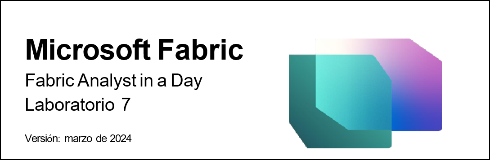
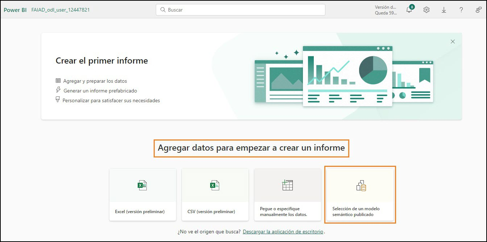
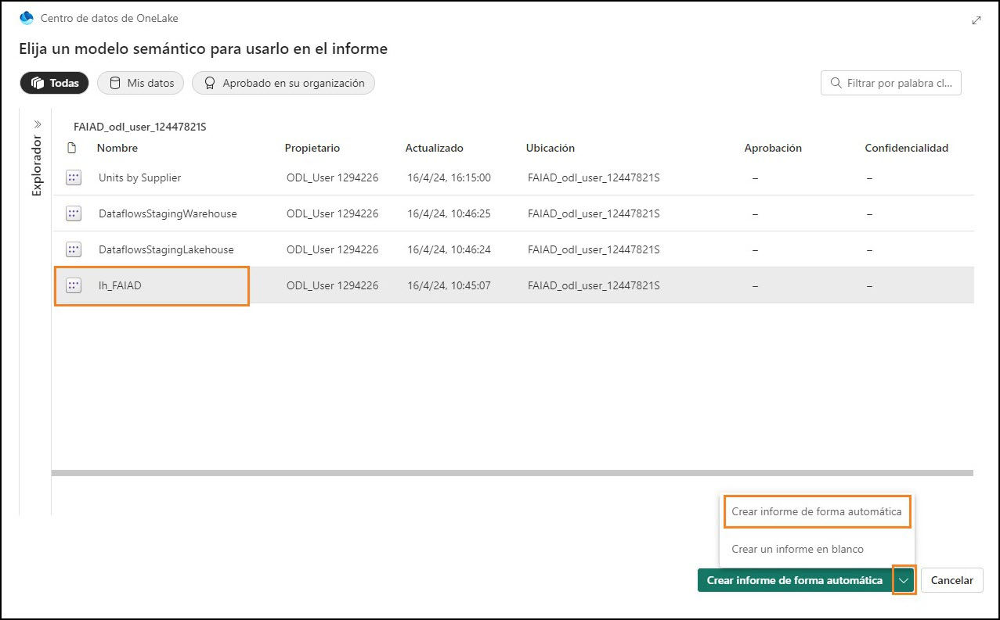
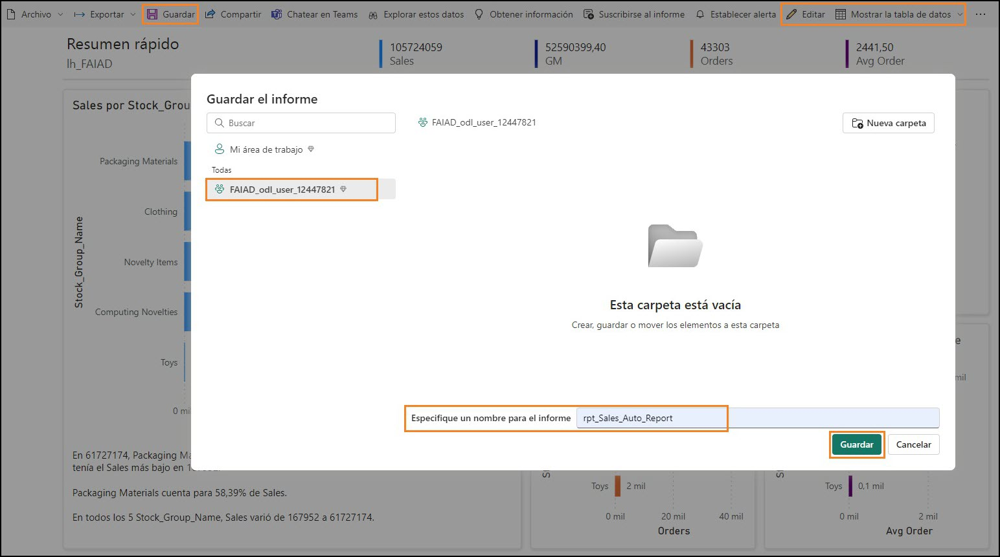
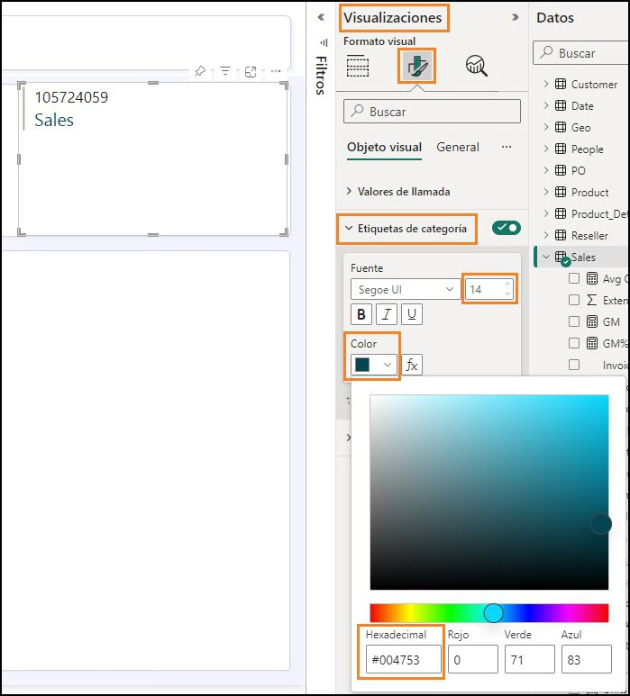
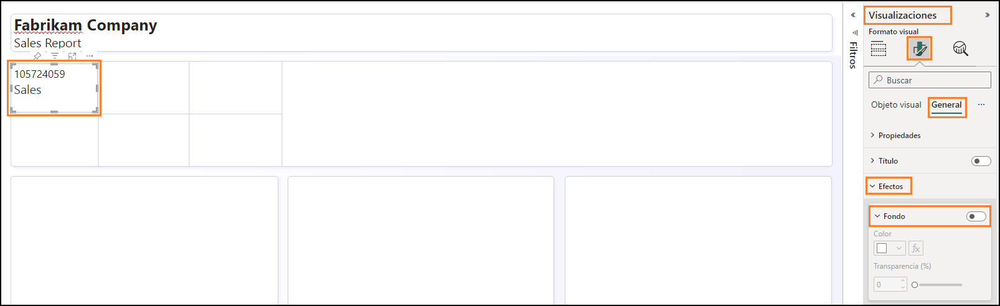
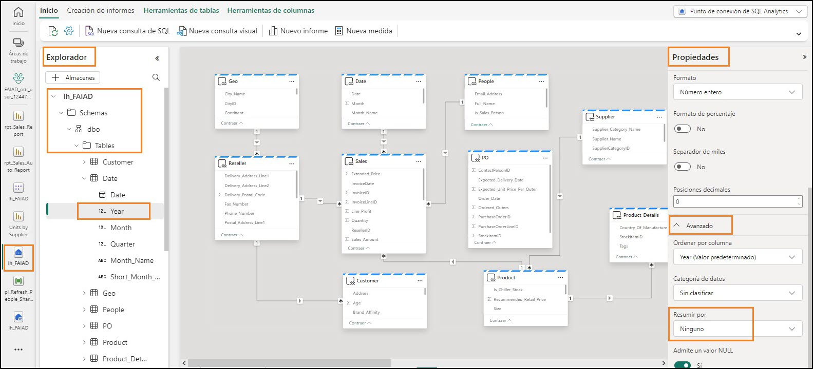
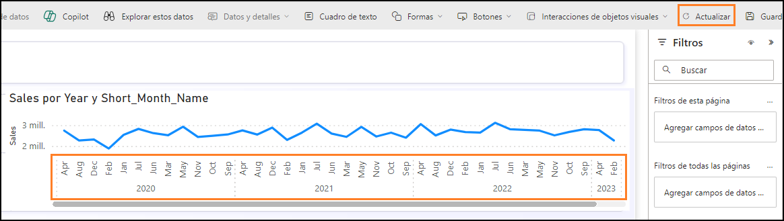
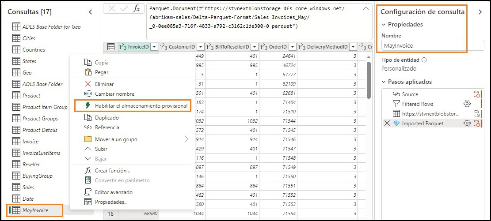

 

## Contenido

[Introducción](#introducción)

[Power BI](#power-bi)

 - [Tarea 1: Crear un informe de forma automática](#tarea-1-crear-un-informe-de-forma-automática)

 - [Tarea 2: Configurar el fondo para un nuevo informe](#tarea-2-configurar-el-fondo-para-un-nuevo-informe)

 - [Tarea 3: Agregar un encabezado al informe](#tarea-3-agregar-un-encabezado-al-informe)

 - [Tarea 4: Agregar KPI al informe](#tarea-4-agregar-kpi-al-informe)

 - [Tarea 5: Agregar un gráfico de líneas al informe](#tarea-5-agregar-un-gráfico-de-líneas-al-informe)

 - [Tarea 6: Guardar el informe](#tarea-6-guardar-el-informe)

 - [Tarea 7: Configurar la columna Year en la tabla Date](#tarea-7-configurar-la-columna-year-en-la-tabla-date)

 - [Tarea 8: Configurar la columna Short_Month_Name en la tabla Date](#tarea-8-configurar-la-columna-short_month_name-en-la-tabla-date)

 - [Tarea 9: Aplicar formato al gráfico de líneas](#tarea-9-aplicar-formato-al-gráfico-de-líneas)

 - [Tarea 10: Agregar nuevos datos para simular el modo Direct Lake](#tarea-10-agregar-nuevos-datos-para-simular-el-modo-direct-lake)

[Limpieza del entorno de laboratorio](#limpieza-del-entorno-de-laboratorio)

[Referencias](#referencias)

# Introducción

Ingerimos datos de diferentes orígenes de datos a un Lakehouse,conocimos los almacenes de lago, establecimos una programación de actualización para los orígenes de datos y creamos un modelo de datos. Ahora vamos a crear un informe.

Al final de este laboratorio, habrá aprendido:

-   Cómo crear un informe de forma automática

-   Cómo crear un informe a partir de un lienzo en blanco

-   Cómo usar el modo Direct Lake, que da como resultado una actualización automática de los datos

# Power BI

## Tarea 1: Crear un informe de forma automática

Comencemos con la opción de creación automática de informes. Y, más adelante en el laboratorio, volveremos a crear el informe que tenemos en Power BI.

1.  Volvamos al **área de trabajo de Fabric** que creó en el laboratorio anterior.

2.  En la parte inferior del panel de navegación de la izquierda, seleccione el icono **Selector de experiencia de Fabric**.

3.  Se abre el cuadro de diálogo de experiencia de Fabric. Seleccione **Power BI**. Se le llevará a la

    **página Inicio de Power BI.**

    

4.  Seleccione **Nuevo informe** en el menú superior.

    

5.  Se le dirigirá a la **pantalla Crear el primer informe**. Habrá opciones para introducir datos

    manualmente y crear un informe o elegir un modelo semántico publicado. Hemos creado un modelo semántico en los laboratorios anteriores. Usemos ese. Seleccione la opción **Selección de un modelo semántico publicado**.

    

6.  Se abre la página Elija un conjunto de datos para usar en su informe. Observe que tenemos cuatro opciones. **Seleccione lh_FAIAD**:

    a.  **lh_FAIAD:** este es el lakehouse con el conjunto de datos que creamos y que queremos usar para el informe.

    b.  **Units by Supplier:** este es el conjunto de datos que creamos con T-SQL.

    c.  **DataflowsStagingWarehouse:** este es el almacén provisional que se crea de manera predeterminada. No utilizamos esto porque no organizamos datos.

    d.  **DataflowsStagingLakehouse:** este es el Lakehouse provisional que se crea de manera predeterminada. No utilizamos esto porque no organizamos datos.

7.  Haga clic en la flecha **junto al botón Crear informe de forma automática**. Observe que hay dos opciones: Crear informe de forma automática y Crear un informe en blanco. Probemos la

    creación automática: seleccione **Crear informe de forma automática**.

    

8.  Power BI comenzará a crear de forma automática el informe. Observe que hay una opción para seleccionar previamente los datos si así lo queremos también. Una vez que el informe esté listo, aparecerá un cuadro de diálogo en la parte superior derecha de la pantalla. Seleccione **View**

    **report now.**

    

**Punto de control:** tendrá un informe similar a la captura de pantalla siguiente. Hay algunos KPI y algunos objetos visuales de tendencias. Este es un buen comienzo si está analizando un nuevo modelo y necesita un impulso.

**Nota:** Observe que en el menú superior tiene la opción de editar el informe o ver algunos de los datos como tablas. No dude en explorar estas opciones.

9.  Guardemos este informe. En el menú superior, seleccione **Guardar**.

10. Se abre el cuadro de diálogo Guardar el informe. Nombre el informe como **rpt_Sales_Auto_Report Nota:** Estamos anteponiendo rpt al nombre del informe, que es la abreviatura de informe (en inglés).

11. Asegúrese de que el informe esté guardado en el área de trabajo **FAIAD\_\<username\.**

12. Seleccione **Guardar.**

    

**Nota:** El informe creado automáticamente puede verse diferente ya que se \"creó automáticamente\". También depende de las relaciones y medidas que creó en el laboratorio anterior (Laboratorio 6).

La captura de pantalla anterior muestra el aspecto que el informe creado automáticamente **puede**

tener si ha creado todas las relaciones y medidas, incluidas las relaciones opcionales (Laboratorio 6).

La siguiente captura de pantalla es el aspecto que **puede** tener el informe creado automáticamente si omite la creación de las relaciones y medidas opcionales (Laboratorio 6).



## Tarea 2: Configurar el fondo para un nuevo informe

Creemos un nuevo informe usando un lienzo en blanco.

1.  En el **panel izquierdo**, seleccione el nombre del área de trabajo, **FAIAD\_\<username>** por el que se navegará en el área de trabajo.

2.  En el menú superior, seleccione **Nuevo -> Informe**. Se le dirigirá a la página de creación de su primer informe.

    

3.  Seleccione la opción **Selección de un modelo semántico publicado**, para que podamos elegir el modelo que hemos creado.

    

4.  Se abre el cuadro de diálogo Selección de un modelo semántico para usarlo en su informe. Seleccione **lh_FAIAD**.

5.  Haga clic en la flecha **junto al botón Crear informe de forma automática**. Seleccione **Crear un informe en blanco.**

    

6.  Si aún no lo ha abierto, abra **FAIAD.pbix**, que se encuentra en la carpeta **C:\\FAIAD\\Reports** del entorno de laboratorio.

Vamos a utilizar este informe como referencia. Comenzaremos agregando el fondo del lienzo.

Crearemos el encabezado del informe, agregaremos un par de KPI y crearemos el gráfico de líneas de Ventas a lo largo del tiempo. Por razones de tiempo y sabiendo que tiene experiencia en la creación de objetos visuales en Power BI Desktop, no crearemos todos los objetos visuales.


7.  Vuelva al **lienzo de Power BI** en su explorador.

8.  Seleccione el **icono** de **la página Formato** en el panel de Visualizaciones.

9.  Expanda la **sección Fondo del lienzo**.

10. Seleccione la opción **Examinar** de la opción **Imagen**. Se abre el cuadro de diálogo Explorador de archivos.

11. Vaya a la carpeta **C:\\FAIAD\\Reports** del entorno de su laboratorio.

12. Seleccione **Summary Background.png.**

13. Establezca el menú desplegable **Ajuste de imagen** en **Ajustar**.

14. Establezca la Transparencia en **0 %**.

    

## Tarea 3: Agregar un encabezado al informe

1.  Agreguemos el encabezado en el margen superior. En el **menú**, seleccione **Cuadro de texto**.

2.  Introduzca **Fabrikam Company** como primera línea en el cuadro de texto.

3.  Introduzca **Sales Report** como segunda línea en el cuadro de texto.

4.  Resalte **Fabrikam Company** y establezca la **Fuente** en **Segoe UI** y el **tamaño de fuente** a **18, negrita**.

5.  Resalte **Informe de ventas** y establezca la **Fuente** en **Segoe UI** y el **tamaño de fuente** a **14.**

6.  Con el **cuadro de texto seleccionado**, en el panel del cuadro de texto Formato de la derecha,

    **expanda la sección Efectos.**

7.  Utilice el control deslizante **Fondo** para configurarlo en **Desactivado**.

8.  Cambie el tamaño del cuadro de texto **para que quepa en el margen superior**.

    

## Tarea 4: Agregar KPI al informe

1.  Agreguemos KPI de ventas. Seleccione el **espacio en blanco** en el lienzo para quitar el foco del cuadro de texto.

2.  En la **sección Visualizaciones**, seleccione el **objeto visual Tarjeta de varias filas**.

3.  En la **sección Datos**, expanda la **tabla Sales**.

4.  Seleccione **la medida Sales**.

    

5.  Con **el objeto visual de tarjeta de varias filas seleccionado**, seleccione el **icono Dar formato a objeto visual** en la sección Visualizaciones.

6.  Expanda la sección **Etiquetas de categorías**.

7.  Aumente el **tamaño de fuente** a **14**.

8.  Seleccione el **menú desplegable Color**. Se abre el cuadro de diálogo Paleta de colores.

9.  Establezca el valor Hex en **#004753**.

    

10. Expanda la sección **Tarjetas**.

11. Utilice el control deslizante **Barra de énfasis** para configurarlo en **Desactivado**.

    

12. Seleccione **General** en el panel de Visualizaciones.

13. Expanda la **sección Efectos**.

14. Utilice el control deslizante **Fondo** para configurarlo en **Desactivado**.

15. Cambie el tamaño del **objeto visual** y muévalo al **cuadro izquierdo como se muestra en la captura de pantalla**.

    

16. Vamos a agregar otro KPI. Seleccione la **Tarjeta de varias filas de Sales** que acabamos de crear.

    **Copie** el objeto visual mediante la selección de **Ctrl+C** desde tu teclado.

17. **Pegue** el objeto visual mediante la selección de **Ctrl+V** desde tu teclado. Observe que el objeto visual se pega en el lienzo.

18. Con el **nuevo objeto visual resaltado**, en la sección **Visualizaciones -> Crear objeto visual -> Campos**, elimine la medida **Sales**.

19. Desde la sección **Datos**, expanda la tabla **Sales** y seleccione la medida **Units**.

20. Cambie el tamaño del **objeto visual** y **colóquelo en el cuadro debajo del objeto visual Sales**.

    

## Tarea 5: Agregar un gráfico de líneas al informe

Creemos un gráfico de líneas para visualizar las ventas a lo largo del tiempo por empresa revendedora.

1.  Seleccione el **espacio en blanco** en el lienzo para quitar el foco del objeto visual de tarjeta de varias filas.

2.  En la **sección Visualizaciones**, seleccione **Gráfico de líneas**.

3.  En la **sección Datos**, expanda la tabla **Date**.

4.  Seleccione el campo **Year**. Tenga en cuenta que Year se suma de forma predeterminada y se agrega al eje Y. Rectifiquemos esto.

    

## Tarea 6: Guardar el informe

Guardemos el informe antes de salir de él para realizar cambios en el modelo.

1.  En el menú, seleccione **Archivo -> Guardar**.

2.  Se abre el cuadro de diálogo Guardar el informe. Nombre el informe como **rpt_Sales_Report**

    **Nota:** Estamos anteponiendo rpt al nombre del informe, que es la abreviatura de informe (en inglés).

3.  Asegúrese de que el informe esté guardado en el **área de trabajo FAIAD\_\<username>\.**

4.  Seleccione **Guardar.**

    

## Tarea 7: Configurar la columna Year en la tabla Date

1.  En la **barra de menú izquierda**, seleccione **lh_FAIAD** para navegar hasta el Lakehouse.

2.  En el panel izquierdo del explorador, expanda **lhFAIAD -> Schemas -> dbo -> Tables -> Date**.

3.  Seleccione la columna **Year**.

4.  En el panel **Propiedades** de la derecha, expanda la sección **Avanzado**.

5.  En el menú desplegable **Resumir por**, seleccione **Ninguno**.

    

6.  Vuelva al informe seleccionando **rpt_Sales_Report** en la barra de menú de la izquierda.

7.  Seleccione **Editar** en el menú superior.

8.  En el menú superior, seleccione **Actualizar**. Observe en el panel de Datos que Year no es un campo de suma.

9.  Con el **objeto visual Gráfico de líneas seleccionado**, **elimine la Sum of Year** del eje Y.

10. Seleccione el campo **Year** y se agregará al **eje X**.

11. Expanda la tabla **Sales** y seleccione la **medida Sales**.

    

## Tarea 8: Configurar la columna Short_Month_Name en la tabla Date

1.  Agreguemos Mes a este gráfico. Desde la tabla Date, arrastre el campo **Short_Month_Name** debajo de **Year** en el **eje X**. Observe que el objeto visual está ordenado por Sales. Ordenémoslo por Short_Month_Name.

2.  Haga clic en los **puntos suspensivos (...)** en la esquina superior derecha del objeto visual.

3.  Seleccione **Ordenar eje -> Year Short_Month_Name**.

4.  Haga clic en los **puntos suspensivos (...)** en la esquina superior derecha del objeto visual.

5.  Seleccione **Ordenar eje -> Orden ascendente**.

    

**Nota:** Los meses están ordenados alfabéticamente. Vamos a arreglarlo.


6.  En la **barra de menú izquierda**, seleccione **lh_FAIAD** para navegar hasta el Lakehouse.

7.  Se abre el cuadro de diálogo **Cambios sin guardar**. Seleccione **Guardar** para guardar los cambios en el informe.

    

8.  Se le dirigirá al Lakehouse lh_FAIAD. En el panel izquierdo del explorador, expanda **lhFAIAD -> Schemas -> dbo -> Tables -> Date**.

9.  Seleccione la columna **Short_Month_Name**.

10. En el panel **Propiedades** de la derecha, expanda la sección **Avanzado**.

11. En el menú desplegable **Ordenar por columna** seleccione **Month**.

    

12. Vuelva al informe seleccionando **rpt_Sales_Report** en la barra de menú de la izquierda.

13. Seleccione **Editar** en el menú superior.

14. En el menú superior, seleccione **Actualizar**. Observe que ahora los meses están ordenados correctamente.

    

## Tarea 9: Aplicar formato al gráfico de líneas

Observe lo fácil que es actualizar el modelo semántico mientras se crean los informes. Esto proporciona una interacción fluida como Power BI Desktop.

1.  Con el **objeto visual Gráfico de líneas seleccionado**, en la **sección Datos**, expanda la tabla **Reseller**.

2.  Arrastre **Reseller -\ Reseller Company** a la sección **Leyenda**.

    

3.  Con el **objeto visual Gráfico de líneas seleccionado**, en la sección **Visualizaciones**, seleccione

    **icono Formato visual -> General.**

4.  Expanda la sección **Título**.

5.  Establezca el texto **Título** en **Ventas a lo largo del tiempo**.

6.  Expanda la sección **Efectos**.

7.  Utilice el control deslizante **Fondo** para configurarlo en **Desactivado**.

    

8.  En la sección **Visualizaciones**, seleccione el **icono Formato de objeto visual -> Objeto visual**.

9.  Expanda la sección **Líneas**.

10. Expanda la sección **Colores**.

11. Establezca el color de **Wingtip Toys** en **#004753**

12. Establezca el color de **Tailspin Toys** en **#F17925**.

13. Cambie el tamaño del **objeto visual** y muévalo al **cuadro superior derecho como se muestra en la captura de pantalla**.

14. Desplácese hacia la derecha en el objeto visual y **observe que tenemos datos hasta abril de 2023**.

    

15. Guardemos el informe: desde el menú, seleccione **Archivo -> Guardar**.

Como se mencionó anteriormente, no crearemos todos los objetos visuales en esta práctica de laboratorio. Siéntase libre de crear más objetos visuales si lo desea.

## Tarea 10: Agregar nuevos datos para simular el modo Direct Lake

Normalmente, en el modo Import, una vez que se actualizan los datos en el origen, necesitamos actualizar el modelo de Power BI y después se actualizan los datos en el informe. Con el modo de Direct Query, una vez que los datos se actualizan en el origen, están disponibles en el informe de Power BI. Sin embargo, el modo de Direct Query suele ser lento. Para resolver este problema,

Microsoft Fabric presenta el modo Direct Lake. Direct Lake es una ruta rápida para cargar los datos del lago directamente en el motor de Power BI listos para su análisis. Exploremos más.

En un escenario real, los datos se actualizan en el origen. Como estamos en un entorno de entrenamiento, lo simularemos mediante la conexión a un archivo Parquet con datos de mayo de 2023.

1.  Seleccione **FAIAD\_\<username>** en la barra de menús de la izquierda para navegar hasta la página de inicio del área de trabajo.

2.  Seleccione **df_Sales_ADFS** para que podamos editar el flujo de datos al agregar el nuevo archivo Parquet.

    

3.  En la cinta de opciones, seleccione **Inicio -> Obtener datos -> Consulta en blanco**.

4.  Se abre el cuadro de diálogo del origen de datos. Seleccione **todas las filas en el editor y elimínelas**.

5.  Copie el siguiente código y péguelo en el editor.

    ```
        let
        Source = #"ADLS Base Folder",
        #"Filtered Rows" = Table.SelectRows(Source, each Text.Contains([Folder Path], "Sales.Invoices_May")),
        #"https://stvnextblobstorage dfs core windows net/fabrikam-sales/Delta-Parquet-Format/Sales Invoices_May/_0- 0ee085a3-716f-4833-a792-c3162c1de300-0 parquet" = #"Filtered Rows"{[#"Folder
        Path"="https://stvnextblobstorage.dfs.core.windows.net/fabrikam-sales/Delta-Parquet- Format/Sales.Invoices_May/",Name="0-0ee085a3-716f-4833-a792-c3162c1de300-0.parquet"]}[Content],
        #"Imported Parquet" = Parquet.Document(#"https://stvnextblobstorage dfs core windows net/fabrikam-sales/Delta- Parquet-Format/Sales Invoices_May/_0-0ee085a3-716f-4833-a792-c3162c1de300-0 parquet")
        in
        #"Imported Parquet"
    ```

6.  Seleccione **Siguiente**.

    

7.  Se recrea una nueva consulta. Vamos a **renombrarlo**. Cambie el nombre de la consulta a

    **MayInvoice** en el panel derecho, en **Configuración de consulta -> Propiedades -> Nombre**.

8.  Deshabilitemos la preparación para la nueva consulta. **Haga clic con el botón secundario** en la consulta MayInvoice y **desmarque Habilitar el almacenamiento provisional**.

    

9.  Ahora, agreguemos los datos de May invoice a la tabla Invoice. Seleccione la consulta **Invoice**

    desde la sección Consultas.

10. En la cinta de opciones, seleccione **Inicio - Anexar** consultas.

11. Aparece el cuadro de diálogo Anexar consulta. Desde el menú desplegable **Tabla para anexar**, seleccione **MayInvoice**.

12. Seleccione **Aceptar**.

    

13. Seleccione **Publicar** en la esquina inferior derecha para guardar y publicar las actualizaciones.

    

**Nota:** Una vez publicado, el flujo de datos se actualizará. Esto puede tardar varios minutos.

14. Seleccione **rpt_Sales_Report** en la barra de menús izquierda para volver al informe**.**

15. En el menú superior, seleccione **Actualizar**. Observe ahora que en el gráfico de líneas hay datos para mayo de 2023. Además, observe que el importe y las Unidades de ventas han aumentado.

    

Los flujos de datos que hemos creado en laboratorios anteriores se actualiza según lo programado, los datos se incorporan al Lakehouse. El modelo de datos en el lakehouse y los informes se actualizan. No tenemos que actualizar el modelo de datos ni informar cuando se actualice cada uno de los flujos de datos. Esta es la ventaja de Direct Lake.

Revisemos los desafíos que se enumeran en el planteamiento del problema:

-   **Debe actualizar su conjunto de datos al menos tres veces al día para adaptarse a los diferentes tiempos de actualización para los diferentes orígenes de datos.** Resolvimos esto con Direct Lake. Cada flujo de datos individual se actualiza según su programación. No es necesario actualizar el conjunto de datos y el informe.

-   **Sus actualizaciones tardan mucho tiempo, ya que necesita hacer una actualización completa cada vez para capturar cualquier actualización que haya ocurrido en los sistemas de origen.** De nuevo, resolvimos esto con Direct Lake. Cada flujo de datos individual se actualiza según su programación. No es necesario actualizar el conjunto de datos y el informe, por lo que no tenemos que preocuparnos por la actualización completa.

-   **Cualquier error en cualquiera de los orígenes de datos de los que extrae provocará que se interrumpa la actualización del conjunto de datos. Muchas veces, el archivo del empleado no se carga a tiempo, lo que provoca que se interrumpa la actualización del conjunto de datos.** La canalización de datos ayuda a resolver este problema al brindar la capacidad de volver a intentar la actualización en caso de error y en diferentes intervalos.

-   **Se necesita mucho tiempo para hacer cambios en su modelo de datos, ya que Power Query tarda mucho en actualizar sus versiones preliminares, dado el gran tamaño de los datos y**

    **las transformaciones complejas.**

    Vimos que los flujos de datos son eficientes y es fácil hacer cambios en ellos. Normalmente, la versión preliminar en flujos de datos no tarda mucho en cargarse.

-   **Necesita que un PO con Windows use Power BI Desktop aunque el estándar corporativo es Mac.**

    Microsoft Fabric es una oferta SaaS. Lo único que necesitamos es un explorador para acceder al servicio. No tenemos que instalar ningún software en nuestros escritorios.

# Limpieza del entorno de laboratorio

Una vez que esté todo listo para limpiar el entorno del laboratorio, siga los pasos a continuación.

1.  Seleccione el área de trabajo **FAIAD\_\<nombre de usuario>** en el panel izquierdo para navegar a la página de inicio del área de trabajo.

2.  En el menú superior, seleccione **puntos suspensivos (...)** al lado de Administrar acceso y seleccione **Configuración del área de trabajo**.

    

3.  Se abre el cuadro de diálogo de Configuración del área de trabajo. Seleccione **Otros** en el menú izquierdo.  

4.  Seleccione **Quitar esta área de trabajo**.

5.  Se abrirá el cuadro de diálogo de eliminar área de trabajo. Seleccione **Eliminar**.

Esto eliminará el área de trabajo y todos los elementos que contenía.


# Referencias

Fabric Analyst in a Day (FAIAD) le presenta algunas funciones clave disponibles en Microsoft Fabric. En el menú del servicio, la sección Ayuda (?) tiene vínculos a algunos recursos excelentes.


Estos son algunos recursos más que podrán ayudarle a seguir avanzando con Microsoft Fabric.

-   Vea la publicación del blog para leer el [anuncio de disponibilidad general de Microsoft Fabric](https://aka.ms/Fabric-Hero-Blog-Ignite23) completo.

-   Explore Fabric a través de la [Visita guiada](https://aka.ms/Fabric-GuidedTour)

-   Regístrese en la [prueba gratuita de Microsoft Fabric](https://aka.ms/try-fabric)

-   Visite el [sitio web de Microsoft Fabric](https://aka.ms/microsoft-fabric)

-   Adquiera nuevas capacidades mediante la exploración de los [módulos de aprendizaje de Fabric](https://aka.ms/learn-fabric)

-   Explore la [documentación técnica de Fabric](https://aka.ms/fabric-docs)

-   Lea el [libro electrónico gratuito sobre cómo empezar a usar Fabric](https://aka.ms/fabric-get-started-ebook)

-   Únase a la [comunidad de Fabric](https://aka.ms/fabric-community) para publicar sus preguntas, compartir sus comentarios y aprender de otros.

Obtenga más información en los blogs de anuncios de la experiencia Fabric:

-   [Experiencia de Data Factory en el blog de Fabric](https://aka.ms/Fabric-Data-Factory-Blog)

-   [Experiencia de Synapse Data Engineering en el blog de Fabric](https://aka.ms/Fabric-DE-Blog)

-   [Experiencia de Synapse Data Science en el blog de Fabric](https://aka.ms/Fabric-DS-Blog)

-   [Experiencia de Synapse Data Warehousing en el blog de Fabric](https://aka.ms/Fabric-DW-Blog)

-   [Experiencia de Synapse Real-Time Analytics en el blog de Fabric](https://aka.ms/Fabric-RTA-Blog)

-   [Blog de anuncios de Power BI](https://aka.ms/Fabric-PBI-Blog)

-   [Experiencia de Data Activator en el blog de Fabric](https://aka.ms/Fabric-DA-Blog)

-   [Administración y gobernanza en el blog de Fabric](https://aka.ms/Fabric-Admin-Gov-Blog)

-   [OneLake en el blog de Fabric](https://aka.ms/Fabric-OneLake-Blog)

-   [Blog de integración de Dataverse y Microsoft Fabric](https://aka.ms/Dataverse-Fabric-Blog)

 
 
© 2023 Microsoft Corporation. Todos los derechos reservados.

Al participar en esta demostración o laboratorio práctico, acepta las siguientes condiciones:

Microsoft Corporation pone a su disposición la tecnología o funcionalidad descrita en esta demostración/laboratorio práctico con el fin de obtener comentarios por su parte y de facilitarle una experiencia de aprendizaje. Esta demostración/laboratorio práctico solo se puede usar para evaluar las características de tal tecnología o funcionalidad y para proporcionar comentarios a Microsoft. No se puede usar para ningún otro propósito. Ninguna parte de esta demostración/laboratorio práctico se puede modificar, copiar, distribuir, transmitir, mostrar, realizar, reproducir, publicar, licenciar, transferir ni vender, ni tampoco crear trabajos derivados de ella.

LA COPIA O REPRODUCCIÓN DE ESTA DEMOSTRACIÓN/LABORATORIO PRÁCTICO (O PARTE DE ELLA) EN CUALQUIER OTRO SERVIDOR O UBICACIÓN PARA SU REPRODUCCIÓN O DISTRIBUCIÓN POSTERIOR QUEDA EXPRESAMENTE PROHIBIDA.

ESTA DEMOSTRACIÓN/LABORATORIO PRÁCTICO PROPORCIONA CIERTAS FUNCIONES Y CARACTERÍSTICAS DE PRODUCTOS O TECNOLOGÍAS DE SOFTWARE (INCLUIDOS POSIBLES NUEVOS CONCEPTOS Y CARACTERÍSTICAS) EN UN ENTORNO SIMULADO SIN INSTALACIÓN O CONFIGURACIÓN COMPLEJA PARA EL PROPÓSITO ARRIBA DESCRITO. LA TECNOLOGÍA/CONCEPTOS DESCRITOS EN ESTA DEMOSTRACIÓN/LABORATORIO PRÁCTICO NO REPRESENTAN LA FUNCIONALIDAD COMPLETA DE LAS CARACTERÍSTICAS Y, EN ESTE SENTIDO, ES POSIBLE QUE NO FUNCIONEN DEL MODO EN QUE LO HARÁN EN UNA VERSIÓN FINAL. ASIMISMO, PUEDE QUE NO SE PUBLIQUE UNA VERSIÓN FINAL DE TALES CARACTERÍSTICAS O CONCEPTOS. DE IGUAL MODO, SU EXPERIENCIA CON EL USO DE ESTAS CARACTERÍSTICAS Y FUNCIONALIDADES EN UN ENTORNO FÍSICO PUEDE SER DIFERENTE.

**COMENTARIOS**. Si envía comentarios a Microsoft sobre las características, funcionalidades

o conceptos de tecnología descritos en esta demostración/laboratorio práctico, acepta otorgar a Microsoft, sin cargo alguno, el derecho a usar, compartir y comercializar sus comentarios de

cualquier modo y para cualquier fin. También concederá a terceros, sin cargo alguno, los derechos de patente necesarios para que sus productos, tecnologías y servicios usen o interactúen con cualquier parte específica de un software o servicio de Microsoft que incluya los comentarios.

No enviará comentarios que estén sujetos a una licencia que obligue a Microsoft a conceder su software o documentación bajo licencia a terceras partes porque incluyamos sus comentarios en ellos. Estos derechos seguirán vigentes después del vencimiento de este acuerdo.

MICROSOFT CORPORATION RENUNCIA POR LA PRESENTE A TODAS LAS GARANTÍAS Y CONDICIONES RELATIVAS A LA DEMOSTRACIÓN/LABORATORIO PRÁCTICO, INCLUIDA CUALQUIER GARANTÍA Y CONDICIÓN DE COMERCIABILIDAD (YA SEA EXPRESA, IMPLÍCITA O ESTATUTARIA), DE IDONEIDAD PARA UN FIN DETERMINADO, DE TITULARIDAD Y DE AUSENCIA DE INFRACCIÓN.

MICROSOFT NO DECLARA NI GARANTIZA LA EXACTITUD DE LOS RESULTADOS, EL RESULTADO DERIVADO DE LA REALIZACIÓN DE LA DEMOSTRACIÓN/LABORATORIO PRÁCTICO NI LA

IDONEIDAD DE LA INFORMACIÓN CONTENIDA EN ELLA CON NINGÚN PROPÓSITO.

### DECLINACIÓN DE RESPONSABILIDADES

Esta demostración/laboratorio práctico contiene solo una parte de las nuevas características y mejoras realizadas en Microsoft Power BI. Puede que algunas de las características cambien en versiones futuras del producto. En esta demostración/laboratorio práctico, conocerá algunas de estas nuevas características, pero no todas.
